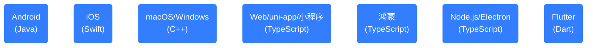
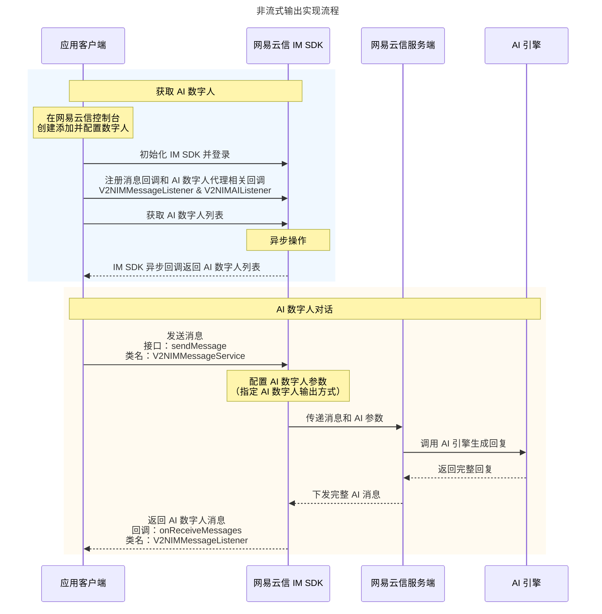
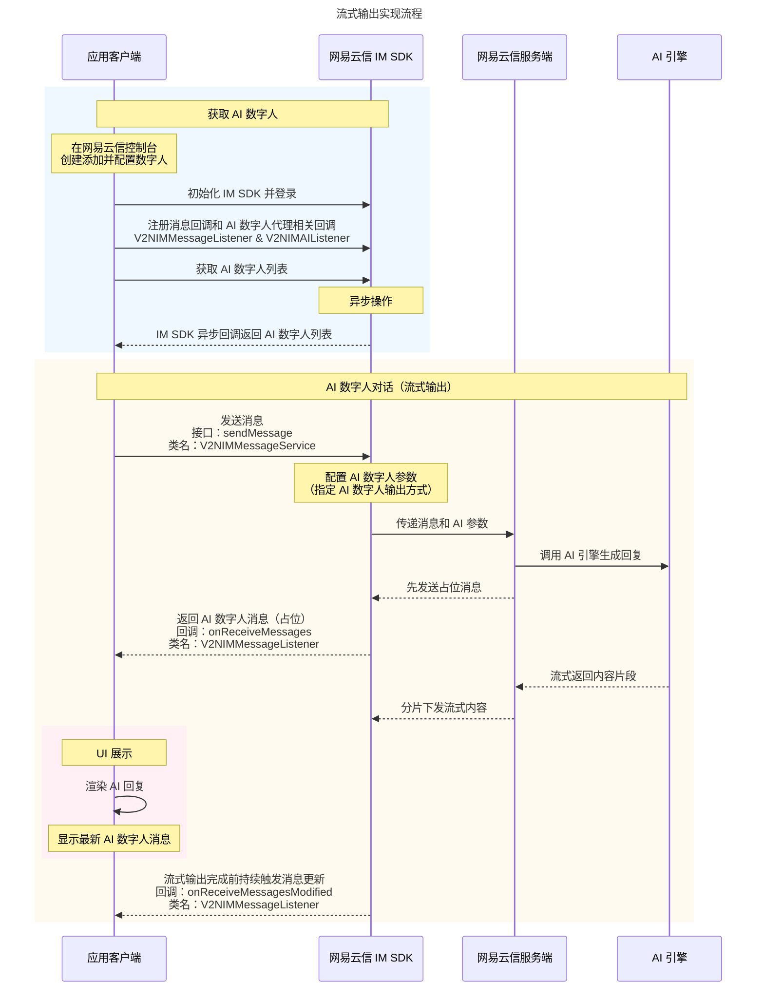
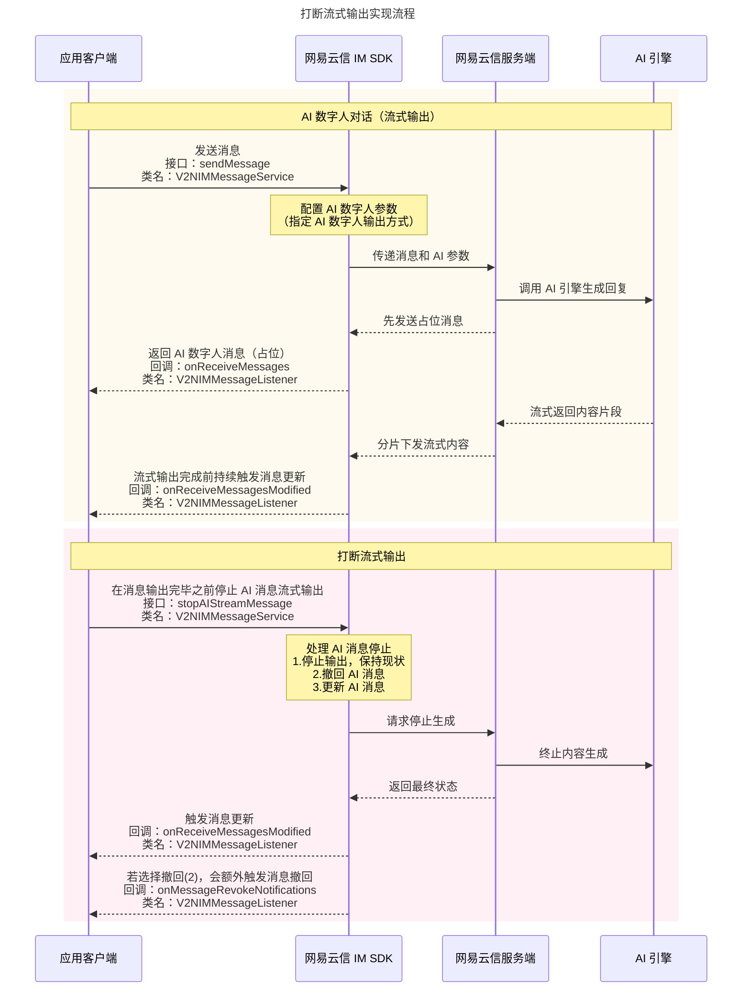
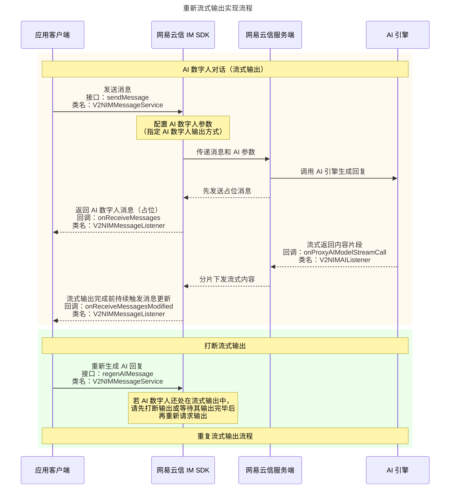
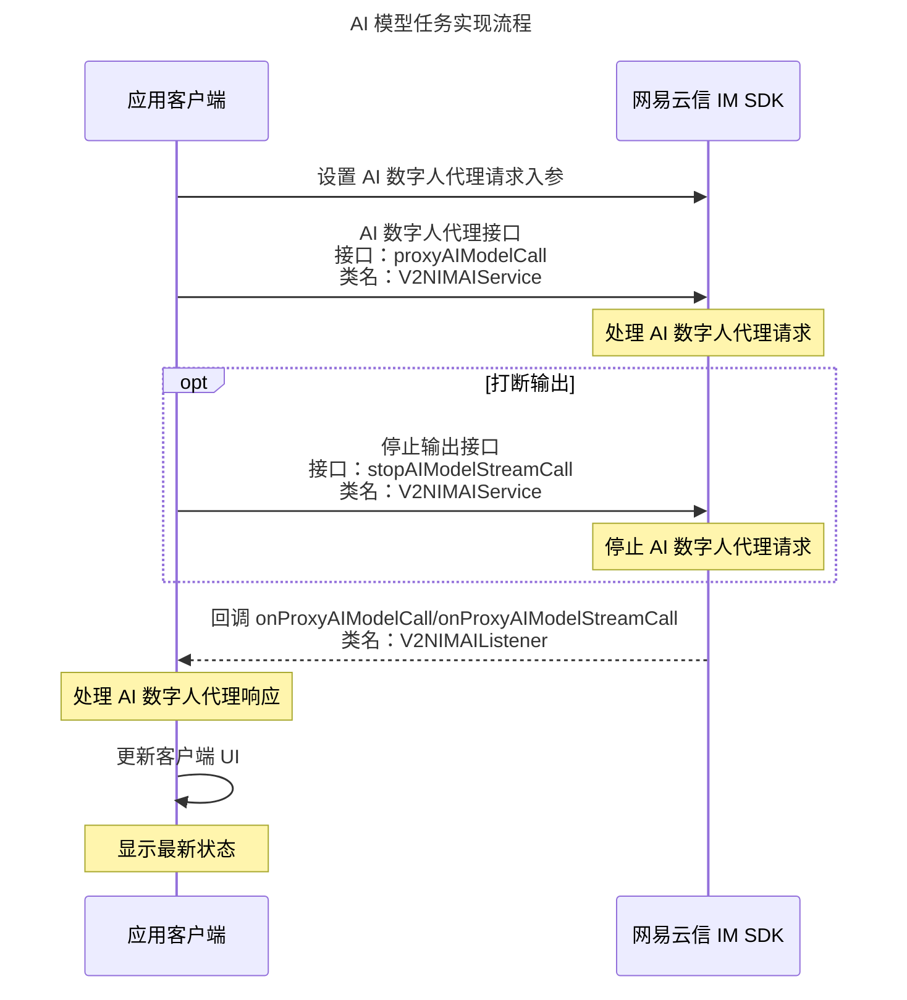

网易云信在即时通讯 IM 中提供了 AI 数字人聊天能力，帮助开发者快速构建智能化的对话体验。本文详细介绍了 AI 数字人聊天功能的相关场景、效果以及在不同平台项目即时通讯应用中的实现方式。

本文采用 [网易云信即时通讯 10\.x\.x+ 系列 SDK（NIM SDK）](https://doc.yunxin.163.com/messaging2/concept?platform=client) 实现，内容适用的开发平台或框架如下所示：



::: note note
- 自 10.8.30 版本起，网易云信支持 AI 数字人 **流式输出** 能力，通过实时分片传输 AI 生成的内容，降低响应延迟、支持中断控制，显著改善用户交互体验。
- 如果您正在使用的是低于 10\.x\.x+ 系列的 NIM SDK，您也可以参考本文内容，并结合 [相应版本的客户端 API](#apiList) 实现。
:::

## 功能概述

### 业务场景

与 AI 数字人聊天提供了四种核心场景，用来覆盖常见的即时通讯聊天形式，满足不同的交互需求，分别是：

场景类型 | 说明
--- | ---
**AI 单聊** | 用户与 AI 数字人一对一聊天。用户可以直接与 AI 数字人发起一对一的聊天会话。无论是寻求信息查询、情感陪伴、知识分享还是娱乐互动、实现角色扮演/拟人沟通、AI 客服等场景，AI 数字人都能迅速响应，提供个性化的反馈和服务。
**AI 聊** | 双人聊中 @AI 数字人引出会话。当两个用户正在进行一对一聊天时，任意一方可以通过艾特（@）AI 数字人的方式，邀请其参与对话。AI 数字人会根据当前聊天的上下文，结合提问回答有用的信息，促进更深层次的交流。<note type="note">**AI 聊** 是网易云信即时通讯 IM 的创新功能，终端用户可以在 IM 单聊场景里，直接艾特（@）AI 数字人，快速参与到好友互动中，无需拉群或加好友，以第三人称提供 AI 辅助和聊天互动。</note>
**AI 群聊** | 群聊中 @AI 数字人。在群聊环境中，AI 数字人同样可以被召唤加入。通过艾特（@）操作，AI 数字人能够理解群聊的主题和氛围，为群组成员提供实时的智能建议、解答疑问或是活跃气氛，成为群聊中的智慧助手，提升整体的沟通效率和娱乐性。用户可以将数字人拉入群中，进行互动，当然您也可以使用 **AI 聊** 功能替代。
**AI 助聊** | 预设 AI 聊天提示词选项。通过 NIM SDK 代理接口，结合聊天对方的用户角色属性和 IM 聊天上下文，为用户推荐聊天话题和措词，为用户提供表达建议。

### AI 输出模式

AI 数字人支持两种输出模式，您可根据产品需求选择合适的方式：

输出模式 | 特性
--- | ---
非流式输出 | <li>响应时间通常为 3-10 秒，等待完整内容生成后再发送。<li>AI 内容生成采用流式方式，但实现需等待全部内容生成后才通过 IM 通道下发，存在一定消息延迟。<li>无法体现 AI 思考与回复的渐进过程。<li>无法打断输出过程，需要等待回复完毕才能结束聊天。
流式输出 | <li>通过实时分片传输 AI 生成的内容，降低消息延迟。<li>支持消息内容的渐进式展示，模拟人类打字输出效果，增强对话真实感。<li>支持打断 AI 输出，减少无效内容生成，节约计算资源。<li>支持 AI 消息的重新生成和输出，增强交互体验。

### 流式输出

AI 数字人流式输出功能通过实时分片传输 AI 生成的内容，显著改善用户交互体验。

流式输出模式下，支持开发者控制 AI 交互，包括打断 AI 输出以及请求重新生成 AI 回复。

- **打断输出：** 用户可随时打断正在输出的 AI 回复，支持以下三种处理方式：
    - **停止输出**：以当前输出内容为最终消息。
    - **撤回**：直接撤回整条消息。
    - **更新**：用自定义文本替换当前消息。
- **重新生成：** 用户可请求重新生成 AI 回复，支持以下两种方式：
    - **更新原消息**：新内容覆盖原消息（限 3 天内消息）。
    - **发送新消息**：创建全新消息来展示重新生成的内容。

::: note notice
- 同一账号多端登录时，可同步流式输出效果。中途加入的终端可补全之前内容，接续流式体验。所有终端均可对流式输出进行打断操作。
- 发送端流式过程中实时更新会话。
:::

## 在线 Demo

您可以前往 [融合通讯 + AI 场景功能体验 App](https://aigc.yunxin.163.com/) 体验相关功能。

## 效果展示

按照 AI 聊的四种场景，预期可实现的效果如下所示：

:::::: div linked-codes
::: code 非流式输出
<div class="container">
  <div class="column">
    <figure>
      <figcaption style="width: 100%; text-align: center; caption-side: top;"><b>AI 单聊</b></figcaption>
       </figure>
  </div>
  <div class="column">
    <figure>
      <figcaption style="width: 100%; text-align: center; caption-side: top;"><b>AI 聊</b></figcaption>
       </figure>
  </div>
  <div class="column">
    <figure>
      <figcaption style="width: 100%; text-align: center; caption-side: top;"><b>AI 群聊</b></figcaption>
      
</figure>
  </div>
  <div class="column">
    <figure>
      <figcaption style="width: 100%; text-align: center; caption-side: top;"><b>AI 助聊</b></figcaption>
      
</figure>
  </div>
</div>
:::
::: code 流式输出
<div class="container">
  <div class="column">
    <figure>
      <figcaption style="width: 100%; text-align: center; caption-side: top;"><b>AI 单聊</b></figcaption>
       </figure>
  </div>
  <div class="column">
    <figure>
      <figcaption style="width: 100%; text-align: center; caption-side: top;"><b>AI 聊</b></figcaption>
       </figure>
  </div>
  <div class="column">
    <figure>
      <figcaption style="width: 100%; text-align: center; caption-side: top;"><b>AI 群聊</b></figcaption>
      
</figure>
  </div>
  <div class="column">
    <figure>
      <figcaption style="width: 100%; text-align: center; caption-side: top;"><b>打断&重新输出</b></figcaption>
      
</figure>
  </div>
</div>
:::
::::::

## 准备工作

### 添加数字人

根据本文操作前，请确保您已经完成了以下设置：

- 在 [网易云信控制台](https://app.yunxin.163.com/global/home) 上创建至少一个应用。详细步骤请参考 [创建应用并获取 AppKey](https://doc.yunxin.163.com/console/concept/TIzMDE4NTA?platform=console)。
- 为您创建的应用，添加一个数字人。详细步骤请参考 [开通并添加数字人](https://doc.yunxin.163.com/console/concept/TYxMDEzNDg?platform=console)。

    

### 配置数字人

在实现层面，数字人被视为一种特殊的用户，在网易云信控制台上添加了数字人后，您需要调用服务端 [`/im/v2/users/:{account_id}`](https://doc.yunxin.163.com/messaging2/server-apis/TA0NzYzNjk?platform=server) 接口，将数字人的账号 ID（`account_id`）传入，并在 `extension` 字段中加入 AI 聊数字人的信息扩展，如下所示，即可被 IM UIKit 识别为 AI 聊数字人。

- **`aichat`**：1 表示该数字人功能定位为 AI 聊数字人，可以进行聊天或者置顶到会话列表。
- **`welcomeText`**：用户首次进入 AI 数字人聊天页面，AI 数字人发送的欢迎消息。
- **`pinDefault`**：表示该 AI 数字人是否置顶到会话列表中。1 表示置顶，0 表示不置顶。默认为不置顶。
- **`ai_stream`**：表示 AI 数字人是否为流式输出方式。1 表示流式输出，0 表示非流式输出。默认为非流式输出。
- **`ai_stream_status`**：表示 AI 数字人输出状态。1 表示占位，2 表示停止输出，3 表示停止输出并更新 AI 消息，4 表示输出完成，5 表示服务器终止。

    ```JSON
    {
        "aiChat": 1, //是否为 AI 聊数字人
        "welcomeText": "欢迎使用 AI 聊数字人", //欢迎语
        "pinDefault": 1, //是否默认置顶
        "ai_stream": 1, //是否为流式输出方式
        "ai_stream_status": 4 //输出状态
    }
    ```
<a id="apiList"></a>

## 相关接口

本文涉及的 NIM SDK 客户端接口调用如下所示：

:::::: div linked-codes
::: code SDK ≥ 10.0.0
- **[sendMessage](https://doc.yunxin.163.com/messaging2/client-apis/zIwODM2NTM?platform=client#sendMessage)**：本端发送消息。
- **[getAIUserList](https://doc.yunxin.163.com/messaging2/client-apis/TA0NjQ0ODE?platform=client#getaiuserlist)**：批量查询 AI 数字人列表。
- **[onReceiveMessages](https://doc.yunxin.163.com/messaging2/client-apis/DAxNjk0Mzc?platform=client#V2NIMMessageListener)**：消息接收回调。
- **[proxyAIModelCall](https://doc.yunxin.163.com/messaging2/client-apis/TA0NjQ0ODE?platform=client#proxyaimodelcall)**：向 LLM（Large Language Models）发起模型调用请求。
- **[onProxyAIModelCall](https://doc.yunxin.163.com/messaging2/client-apis/DAxNjk0Mzc?platform=client#V2NIMAIListener)**：AI 透传接口的响应的回调。
- **[createTextMessage](https://doc.yunxin.163.com/messaging2/client-apis/TY4MDg4MTk?platform=client#createtextmessage)**：创建一条文本消息。
- **[stopAIStreamMessage](https://doc.yunxin.163.com/messaging2/client-apis/zIwODM2NTM?platform=client#stopAIStreamMessage)**：停止 AI 数字人消息输出。可选择直接停止输出，也可以选择撤回/更新 AI 数字人消息。
- **[regenAIMessage](https://doc.yunxin.163.com/messaging2/client-apis/zIwODM2NTM?platform=client#regenAIMessage)**：重新请求输出 AI 数字人消息。
- **[stopAIModelStreamCall](https://doc.yunxin.163.com/messaging2/client-apis/TA0NjQ0ODE?platform=client#stopAIModelStreamCall)**：停止 AI 流式输出请求。
- **[onReceiveMessagesModified](https://doc.yunxin.163.com/messaging2/client-apis/DAxNjk0Mzc?platform=client#V2NIMMessageListener)**：消息更新回调。
- **[onProxyAIModelStreamCall](https://doc.yunxin.163.com/messaging2/client-apis/DAxNjk0Mzc?platform=client#V2NIMAIListener)**：AI 流式输出的回调。
:::
::: code SDK < 10.0.0
此处仅以安卓客户端为例举例，其他平台或开发框架请在相应版本的客户端 API 文档（[iOS](https://doc.yunxin.163.com/messaging/references/iOS/doxygen/Latest/zh/index.html) | [macOS/Windows](https://doc.yunxin.163.com/messaging/references/pc/doxygen/Latest/zh/index.html) | [Web](https://doc.yunxin.163.com/messaging/references/web/typedoc/Latest/zh/NIM/interfaces/nim_NIMInterface.NIMInterface.html) | [Electron](https://doc.yunxin.163.com/messaging/references/electron/typedoc/Latest/zh/index.html)）中搜索查看：
- **[sendMessage](https://doc.yunxin.163.com/messaging/references/android/doxygen/Latest/zh/interfacecom_1_1netease_1_1nimlib_1_1sdk_1_1msg_1_1_msg_service.html#a74db65f6720c4e2ba7a5d2a9e72ebda8)**：本端发送消息。
- **[getAIUserList](https://doc.yunxin.163.com/messaging/references/android/doxygen/Latest/zh/interfacecom_1_1netease_1_1nimlib_1_1sdk_1_1ai_1_1_n_i_m_a_i_service.html#adc60745149557ddaac8c871a549353f9)**：批量查询 AI 数字人列表。
- **[observeMsgStatus](https://doc.yunxin.163.com/messaging/references/android/doxygen/Latest/zh/interfacecom_1_1netease_1_1nimlib_1_1sdk_1_1msg_1_1_msg_service_observe.html#a18702631b4650ca3b0d71a7dad52be6a)**：消息相关监听器。
- **[proxyAIModelCall](https://doc.yunxin.163.com/messaging/references/android/doxygen/Latest/zh/interfacecom_1_1netease_1_1nimlib_1_1sdk_1_1ai_1_1_n_i_m_a_i_service.html#af5fe0c3a7b627e0aa03dd275ec478be2)**：向 LLM（Large Language Models）发起模型调用请求。
- **[onProxyAIModelCall](https://doc.yunxin.163.com/messaging/references/android/doxygen/Latest/zh/interfacecom_1_1netease_1_1nimlib_1_1sdk_1_1ai_1_1_n_i_m_a_i_listener.html#a7f9ab09718f875381dae5b9c825d6f51)**：AI 透传接口的响应的回调。
- **[createTextMessage](https://doc.yunxin.163.com/messaging/references/android/doxygen/Latest/zh/classcom_1_1netease_1_1nimlib_1_1sdk_1_1msg_1_1_message_builder.html#a29772394b4a5d39cc5e9c0cf2180d775)**：创建一条文本消息。
- **[stopAIStreamMessage](https://doc.yunxin.163.com/messaging/references/android/doxygen/Latest/zh/interfacecom_1_1netease_1_1nimlib_1_1sdk_1_1msg_1_1_msg_service.html#a85c6295e7d4c80a966c552b60d5af064)**：停止 AI 数字人消息输出。可选择直接停止输出，也可以选择撤回/更新 AI 数字人消息。
- **[regenAIMessage](https://doc.yunxin.163.com/messaging/references/android/doxygen/Latest/zh/interfacecom_1_1netease_1_1nimlib_1_1sdk_1_1msg_1_1_msg_service.html#a73ed6d0fd6fdcbaa2c25ecaad7589e6a)**：重新请求输出 AI 数字人消息。
- **[stopAIModelStreamCall](https://doc.yunxin.163.com/messaging/references/android/doxygen/Latest/zh/interfacecom_1_1netease_1_1nimlib_1_1sdk_1_1ai_1_1_n_i_m_a_i_service.html#adead5663020eba01f961d23427e6fab1)**：停止 AI 流式输出请求。
- **[observeReceiveMessagesModified](https://doc.yunxin.163.com/messaging/references/android/doxygen/Latest/zh/interfacecom_1_1netease_1_1nimlib_1_1sdk_1_1msg_1_1_msg_service_observe.html#a6675a8cd27b3b76a8db6b0a4c0432bd8)**：消息更新回调。
- **[onProxyAIModelStreamCall](https://doc.yunxin.163.com/messaging/references/android/doxygen/Latest/zh/interfacecom_1_1netease_1_1nimlib_1_1sdk_1_1ai_1_1_n_i_m_a_i_listener.html#ad3593ef39347f58fb4c8ae978d14ae13)**：AI 流式输出的回调。
:::
::::::

## 实现流程

客户端整体实现流程如下图所示：

:::::: div linked-codes
::: code 非流式输出

:::
::: code 流式输出

:::
::: code 打断流式输出

:::
::: code 重新流式输出

:::
::: code AI 模型任务

:::
::::::

## 第一步：获取 AI 数字人列表

在客户端获取您配置的 AI 数字人列表。这是实现 AI 数字人聊天功能的基础步骤，您需要知道可用的 AI 数字人资源才能在应用中有效地使用该功能。

:::::: div linked-codes
::: code Android
```Java
NIMClient.getService(V2NIMAIService.class).getAIUserList(new V2NIMSuccessCallback<List<V2NIMAIUser>>() {
  @Override
  public void onSuccess(List<V2NIMAIUser> v2NIMAIUsers) {
   //get ai users success
   saveAIUsers(v2NIMAIUsers);
  }
}, new V2NIMFailureCallback() {
  @Override
  public void onFailure(V2NIMError error) {
   // get ai users error
   int code = error.getCode();
  }
});
```
:::
::: code iOS
```Swift
NIMSDK.shared().v2AIService.getAIUserList({ result in
    // get ai users success
    if let users = result
    {
        self.saveAIUsers(users)
    }
}, failure: { (error: V2NIMError) in
    // get ai users error
    let code = error.code
})
```
:::
::: code macOS/Windows
```C++
auto& aiService = v2::V2NIMClient::get().getAIService();
aiService.getAIUserList(
    [=](nstd::vector<nstd::shared_ptr<V2NIMAIUser>> result) {
        // success, handle result
        for (auto& user : result)
            std::cout << user->accountId.c_str() << std::endl;
    },
    [=](v2::V2NIMError error) {
        // failed, handle error
    });
```
:::
::: code Web/uni-app/小程序
```TypeScript
const aiUserList = await nim.V2NIMAIService.getAIUserList()
```
:::
::: code 鸿蒙
```TypeScript
const aiUserList = await nim.aiService.getAIUserList()
```
:::
::: code Node.js/Electron
```TypeScript
import { v2 } from 'node-nim'

const aiUsers = await v2.aiService.getAIUserList()
console.log(aiUsers)
```
:::
::: code Flutter
```Dart
// 异步方法
NimCore.instance.aiService.getAIUserList().then((value) {
  print('getAIUserList result: $value');
});
// 同步方法
final aiResult = await NimCore.instance.aiService.getAIUserList();
```
:::
::::::

## 第二步：实现聊天场景

### 场景一：AI 单聊

单聊时，上下文取值范围为最新的 30 条消息，且：

- 消息类型只能是文本消息、换行消息、回复消息。
- 第一条消息必须是真实用户发送的消息，而非数字人回复。
- 如果是换行消息（标题+内容），则拼接标题和内容作为上下文。

**非流式输出模式：**

:::::: div linked-codes
::: code Android
```Java
/**
 * 发送消息
 * @param text 消息内容
 * @param aiUser AI 数字人
 * @param aiMessageContexts 发送给 AI 数字人的消息上下文
 */
public void sendMessageToAIUser(String text,V2NIMAIUser aiUser,List<V2NIMMessage> aiMessageContexts){
  String conversationId = V2NIMConversationIdUtil.p2pConversationId(aiUser.getAccountId());
  V2NIMMessage message = V2NIMMessageCreator.createTextMessage(text);
  V2NIMSendMessageParams params = V2NIMSendMessageParamsBuilder.builder()
    .withAIConfig(getAIConfigParams(aiUser,aiMessageContexts))
    .build();
  NIMClient.getService(V2NIMMessageService.class).sendMessage(message, conversationId, params, new V2NIMSuccessCallback<V2NIMSendMessageResult>() {
   @Override
   public void onSuccess(V2NIMSendMessageResult v2NIMSendMessageResult) {
    //send message to ai user success
    V2NIMMessage msg = v2NIMSendMessageResult.getMessage();
   }
  }, new V2NIMFailureCallback() {
   @Override
   public void onFailure(V2NIMError error) {
    // send message to ai user error
    int code = error.getCode();
   }
  },null);
}

/**
 * 设置消息 AI 配置参数
 * @param aiUser AI 数字人
 * @param aiMessageContexts 发送给 AI 数字人的消息上下文
 * @return
 */
protected V2NIMMessageAIConfigParams getAIConfigParams(V2NIMAIUser aiUser,List<V2NIMMessage> aiMessageContexts) {
  V2NIMMessageAIConfigParams aiConfigParams = new V2NIMMessageAIConfigParams(aiUser.getAccountId());
  //上下文消息列表
  List<V2NIMAIModelCallMessage> aiMessages = new ArrayList<>();
  // AI_MESSAGE_SIZE = 30
  int size = Math.min(aiMessageContexts.size(), AI_MESSAGE_SIZE);
  //第一条消息不能是数字人消息
  // 标记是否已经设置过第一条消息
  boolean firstSet = false;
  for (int i = size; i > 0; i--) {
   int index = aiMessageContexts.size() - i;
   V2NIMMessage message = aiMessageContexts.get(index);
   boolean isFromAIUser = TextUtils.equals(aiUser.getAccountId(),message.getSenderId());
   //1 如果第一条是数字人消息，则不再添加
   //2 如果消息没有服务器 ID，说明不是发出去的消息，则不再添加
   if ((!firstSet && isFromAIUser)
     || TextUtils.isEmpty(message.getMessageServerId())) {
    continue;
   }
   firstSet = true;
   aiMessages.add(
     new V2NIMAIModelCallMessage(
       isFromAIUser ? V2NIMAIModelRoleType.V2NIM_AI_MODEL_ROLE_TYPE_ASSISTANT: V2NIMAIModelRoleType.V2NIM_AI_MODEL_ROLE_TYPE_USER,
       message.getText(),
       V2NIMMessageType.V2NIM_MESSAGE_TYPE_TEXT.getValue()));
  }
  aiConfigParams.setMessages(aiMessages);
  //如果 V2NIMAIUser 中的 modelConfig.prompt 定义了变量，则必填 promptVariables
  //JSON 格式的字符串,本字段的键来自于 V2NIMAIUser.modelConfig 里的 promptKeys 属性
  //String promptVariables = getPromptVariables(aiUser);
  //aiConfigParams.setPromptVariables(promptVariables);
  return aiConfigParams;
}
```
:::
::: code iOS
```Swift
/**
 * 发送消息
 * @param text 消息内容
 * @param aiUser AI 数字人
 * @param aiMessageContexts 发送给 AI 数字人的消息上下文
 */
func sendMessageToAIUser(text: String, aiUser: V2NIMAIUser, aiMessageContexts: [V2NIMMessage])
{
    let conversationId = V2NIMConversationIdUtil.p2pConversationId(aiUser.accountId ?? "") ?? ""
    let message = V2NIMMessageCreator.createTextMessage(text)
    let params = V2NIMSendMessageParams()
    params.aiConfig = self.getAIConfigParams(aiUser, aiMessageContexts)
    NIMSDK.shared().v2MessageService.send(message, conversationId: conversationId, params: params) { result in
        // send message to ai user success
        let message = result.message
    } failure: { error in
        // send message to ai user error
        let code = error.code
    }
}
/**
 * 设置消息 AI 配置参数
 * @param aiUser AI 数字人
 * @param aiMessageContexts 发送给 AI 数字人的消息上下文
 * @return
 */
func getAIConfigParams(_ aiUser: V2NIMAIUser, _ aiMessageContexts: [V2NIMMessage]) -> V2NIMMessageAIConfigParams
{
    let aiConfigParams = V2NIMMessageAIConfigParams()

    aiConfigParams.accountId = aiUser.accountId

    // 从最新的 30 条消息中取上下文
    // AI_MESSAGE_SIZE = 30
    let messageModels = aiMessageContexts.suffix(AI_MESSAGE_SIZE)
    // 只支持文本消息
    let aiMessageModels = messageModels.filter({message in
        return message.messageType == V2NIMMessageType.MESSAGE_TYPE_TEXT
    })
    //第一条消息不能是数字人消息
    // 标记是否已经设置过第一条消息
    var firstSet = false
    var aiMessages = [V2NIMAIModelCallMessage]()
    for (i, message) in aiMessageModels.enumerated() {
        let isFromAIUser = aiUser.accountId == message.senderId
        //1 如果第一条是数字人消息，则不再添加
        //2 如果消息没有服务器 ID，说明不是发出去的消息，则不再添加
        if ((!firstSet && isFromAIUser) || message.messageServerId?.count ?? 0 <= 0)
        {
            continue;
        }
        firstSet = true

        let aiMessage = V2NIMAIModelCallMessage()

        if isFromAIUser {
            // 数字人响应的消息上下文 role 为 ASSISTANT
            aiMessage.role = .NIM_AI_MODEL_ROLE_TYPE_ASSISTANT
        } else {
            // 用户发送的消息上下文 role 为 USER
            aiMessage.role = .NIM_AI_MODEL_ROLE_TYPE_USER
        }
        aiMessage.msg = message.text ?? ""
        aiMessage.type = .NIM_AI_MODEL_CONTENT_TYPE_TEXT

        aiMessages.append(aiMessage)
    }
    aiConfigParams.messages = aiMessages

    //如果 V2NIMAIUser 中的 modelConfig.prompt 定义了变量，则必填 promptVariables
    //JSON 格式的字符串,本字段的键来自于 V2NIMAIUser.modelConfig 里的 promptKeys 属性
    //String promptVariables = [self getPromptVariables:aiUser];
    //params.promptVariables = promptVariables
    return aiConfigParams;
}
```
:::
::: code macOS/Windows
```C++
auto& messageService = v2::V2NIMClient::get().getMessageService();
auto message = v2::V2NIMMessageCreator::createTextMessage("Hello");
auto conversationId = v2::V2NIMConversationIdUtil::p2pConversationId("AI user account ID");
v2::V2NIMMessageAIConfigParams aiConfig;
aiConfig.accountId = "AI user account";
v2::V2NIMSendMessageParams sendMessageParams;
sendMessageParams.aiConfig = aiConfig;
messageService.sendMessage(
    *message, conversationId, sendMessageParams,
    [=](v2::V2NIMSendMessageResult result) {
        // succeed, handle result.
    },
    [=](v2::V2NIMError error) {
        // failed, handle error.
    },
    nullptr);
```
:::
::: code Web/uni-app/小程序
```TypeScript
/** step 1: 监听收消息事件 **/
nim.V2NIMMessageService.on('onReceiveMessages', function(msgs) {
  msgs.forEach(msg => {
    if (msg.aiConfig && msg.aiConfig.accountId) {
      /** step 3: 过一阵子收到了 AI 响应的消息 **/
      console.log('Trigger onReceiveMessages and get ai message', msg)
    }
  })
})

/** step 2: 与数字人单聊, 向它提问 **/
const messageBeforeSend = nim.V2NIMMessageCreator.createTextMessage("如何做一份好吃的烤肉")
const conversationId = nim.V2NIMConversationIdUtil.p2pConversationId("AI_ACCOUNT_ID")
const aiConfig = {
  "accountId": "AI_ACCOUNT_ID", // 这个是 AI 数字人的账号, 和会话 ID 里的对话人此场景相同.
  "aiStream": false // 指定 AI 输出方式为完整输出, 不分片. 此字段默认就是 false.
}
const message = await nim.V2NIMMessageService.sendMessage(
  messageBeforeSend,
  conversationId,
  {
    "aiConfig": aiConfig
  }
)
```
:::
::: code 鸿蒙
```TypeScript
/** step 1: 监听收消息事件 **/
nim.messageService.on('onReceiveMessages', (msgs) => {
  msgs.forEach(msg => {
    if (msg.aiConfig && msg.aiConfig.accountId) {
      /** step 3: 过一阵子收到了 AI 响应的消息 **/
      console.log('Trigger onReceiveMessages and get ai message', msg)
    }
  })
})

/** step 2: 与数字人单聊, 向它提问 **/
const messageBeforeSend = nim.messageCreator.createTextMessage('如何做一份好吃的烤肉')
const conversationId = nim.conversationIdUtil.p2pConversationId('AI_ACCOUNT_ID')
const aiConfig: V2NIMMessageAIConfigParams = {
  accountId: 'AI_ACCOUNT_ID',
  aiStream: false, // 指定 AI 输出方式为完整输出, 不分片. 此字段默认就是 false.
}
const message = await nim.messageService.sendMessage(
  messageBeforeSend,
  conversationId,
  {
    aiConfig
  }
)
```
:::
::: code Node.js/Electron
```TypeScript
import { v2 } from 'node-nim'

// 使用 AI 数字人账号创建会话 ID
const conversationId = v2.conversationIdUtil.p2pConversationId('AI user account ID')
// 创建文本消息
const textMessage = v2.messageCreator.createTextMessage('Hello')
// 给 AI 数字人发送消息
await v2.messageService.sendMessage(textMessage, conversationId, {
    aiConfig: {
      // 指定 AI 数字人用户账号
      accountId: 'AI user account ID'
    }
  },
  null
)
```
:::
::: code Flutter
```Dart
final textMessage =
    (await MessageCreator.createTextMessage('hello')).data;
final conversationId =
(await NimCore.instance.conversationIdUtil.teamConversationId(teamId))
    .data!;
if (textMessage != null) {
  final sendParams = NIMSendMessageParams();
  // 指定 AI 数字人用户账号
  sendParams.aiConfig = NIMMessageAIConfigParams(
     accountId: ''
    );
  final sendMessageResult = await NimCore.instance.messageService
      .sendMessage(message: textMessage, conversationId: conversationId,
      params: sendParams);
  if (sendMessageResult.isSuccess) {

  }
}
```
:::
::::::

**流式输出模式：**

:::::: div linked-codes
::: code Android
```Java
//消息监听，请在合适的位置添加和取消
V2NIMMessageListener messageListener = new V2NIMMessageListener() {
  @Override
  public void onReceiveMessages(List<V2NIMMessage> messages) {
   for (V2NIMMessage msg : messages) {
    V2NIMMessageAIConfig aiConfig = msg.getAIConfig();
    // 判断是否是 AI 回复的消息
    if(aiConfig != null && aiConfig.getAIStatus() == V2NIMMessageAIStatus.V2NIM_MESSAGE_AI_STATUS_RESPONSE){
     // 判断是否是 AI 流式的占位消息
     if(aiConfig.isAIStream() && aiConfig.getAIStreamStatus() == V2NIMMessageAIStreamStatus.V2NIM_MESSAGE_AI_STREAM_STATUS_PLACEHOLDER){
      // 处理 AI 流式消息,目前流式消息占位消息的 content 为 Thinking...，用户也可以自己处理是否展示自己想要的内容
      //数字人回复内容引用资源列表
        List<V2NIMAIRAGInfo> airaGs = aiConfig.getAIRAGs();
     }
    }
   }
  }

  @Override
  public void onReceiveP2PMessageReadReceipts(List<V2NIMP2PMessageReadReceipt> readReceipts) {
  }
  @Override
  public void onReceiveTeamMessageReadReceipts(List<V2NIMTeamMessageReadReceipt> readReceipts) {
  }
  @Override
  public void onMessageRevokeNotifications(List<V2NIMMessageRevokeNotification> revokeNotifications) {
  }
  @Override
  public void onMessagePinNotification(V2NIMMessagePinNotification pinNotification) {
  }
  @Override
  public void onMessageQuickCommentNotification(V2NIMMessageQuickCommentNotification quickCommentNotification) {
  }
  @Override
  public void onMessageDeletedNotifications(List<V2NIMMessageDeletedNotification> messageDeletedNotifications) {
  }
  @Override
  public void onClearHistoryNotifications(List<V2NIMClearHistoryNotification> clearHistoryNotifications) {
  }
  @Override
  public void onSendMessage(V2NIMMessage message) {
  }
  @Override
  public void onReceiveMessagesModified(List<V2NIMMessage> messages) {
   for (V2NIMMessage msg : messages) {
    V2NIMMessageAIConfig aiConfig = msg.getAIConfig();
    // 判断是否是 AI 回复的消息
    if(aiConfig != null && aiConfig.getAIStatus() == V2NIMMessageAIStatus.V2NIM_MESSAGE_AI_STATUS_RESPONSE){
     // 判断是否是 AI 流式
     if(aiConfig.isAIStream()){
      // 处理 AI 流式消息,目前流式消息占位消息的 content 为 Thinking...，用户也可以自己处理是否展示自己想要的内容
      V2NIMMessageAIStreamStatus aiStreamStatus = aiConfig.getAIStreamStatus();
      //流式过程中的消息
      if(aiStreamStatus == V2NIMMessageAIStreamStatus.V2NIM_MESSAGE_AI_STREAM_STATUS_STREAMING){
       //当前获取到的流式消息分片，可以根据 aiStreamLastChunk.getContent()做流式消息内容追加的动画
       V2NIMMessageAIStreamChunk aiStreamLastChunk = aiConfig.getAIStreamLastChunk();
       // 当前已经接收到流式消息分片组合之后的消息内容
       String content = msg.getText();
       //处理逻辑
       //...
      }
      //流式消息被停止了
      else if(aiStreamStatus == V2NIMMessageAIStreamStatus.V2NIM_MESSAGE_AI_STREAM_STATUS_STOPPED){
       //当前已经接收到流式消息分片组合之后的消息内容
       String content = msg.getText();
       //处理逻辑
       //...
      }
      //流式消息被停止并设置了更新文本
      else if(aiStreamStatus == V2NIMMessageAIStreamStatus.V2NIM_MESSAGE_AI_STREAM_STATUS_UPDATED){
       //流式消息停止时设置的更新文本
       String content = msg.getText();
       //处理逻辑
       //...
      }
      //流式消息输出完成了
      else if(aiStreamStatus == V2NIMMessageAIStreamStatus.V2NIM_MESSAGE_AI_STREAM_STATUS_GENERATED){
       //完整的回复内容
       String content = msg.getText();
       //处理逻辑
       //...
      }
      //流式消息出现问题，被服务端异常终止
      else if(aiStreamStatus == V2NIMMessageAIStreamStatus.V2NIM_MESSAGE_AI_STREAM_STATUS_ABORTED){
       //当前已经接收到流式消息分片组合之后的消息内容
       String content = msg.getText();
       //处理逻辑
       //...
      }
     }
    }
   }
  }
};

// 注册消息监听，注意及时取消，避免内存泄漏
//NIMClient.getService(V2NIMMessageService.class).addMessageListener(messageListener);
// 取消消息监听
//NIMClient.getService(V2NIMMessageService.class).removeMessageListener(messageListener);

/**
 * 发送消息
 * @param text 消息内容
 * @param aiUser AI 数字人
 * @param aiMessageContexts 发送给 AI 数字人的消息上下文
 */
public void sendMessageToAIUser(String text,V2NIMAIUser aiUser,List<V2NIMMessage> aiMessageContexts){
  String conversationId = V2NIMConversationIdUtil.p2pConversationId(aiUser.getAccountId());
  V2NIMMessage message = V2NIMMessageCreator.createTextMessage(text);
  V2NIMSendMessageParams params = V2NIMSendMessageParamsBuilder.builder()
    .withAIConfig(getAIConfigParams(aiUser,aiMessageContexts))
    .build();
  NIMClient.getService(V2NIMMessageService.class).sendMessage(message, conversationId, params, new V2NIMSuccessCallback<V2NIMSendMessageResult>() {
   @Override
   public void onSuccess(V2NIMSendMessageResult v2NIMSendMessageResult) {
    //send message to ai user success
    V2NIMMessage msg = v2NIMSendMessageResult.getMessage();
   }
  }, new V2NIMFailureCallback() {
   @Override
   public void onFailure(V2NIMError error) {
    // send message to ai user error
    int code = error.getCode();
   }
  },null);
}

/**
 * 设置消息 AI 配置参数
 * @param aiUser AI 数字人
 * @param aiMessageContexts 发送给 AI 数字人的消息上下文
 * @return
 */
protected V2NIMMessageAIConfigParams getAIConfigParams(V2NIMAIUser aiUser,List<V2NIMMessage> aiMessageContexts) {
  V2NIMMessageAIConfigParams aiConfigParams = new V2NIMMessageAIConfigParams(aiUser.getAccountId());
  //上下文消息列表
  List<V2NIMAIModelCallMessage> aiMessages = new ArrayList<>();
  // AI_MESSAGE_SIZE = 30
  int size = Math.min(aiMessageContexts.size(), AI_MESSAGE_SIZE);
  //第一条消息不能是数字人消息
  // 标记是否已经设置过第一条消息
  boolean firstSet = false;
  for (int i = size; i > 0; i--) {
   int index = aiMessageContexts.size() - i;
   V2NIMMessage message = aiMessageContexts.get(index);
   boolean isFromAIUser = TextUtils.equals(aiUser.getAccountId(),message.getSenderId());
   //1 如果第一条是数字人消息，则不再添加
   //2 如果消息没有服务器 ID，说明不是发出去的消息，则不再添加
   if ((!firstSet && isFromAIUser)
     || TextUtils.isEmpty(message.getMessageServerId())) {
    continue;
   }
   firstSet = true;
   aiMessages.add(
     new V2NIMAIModelCallMessage(
       isFromAIUser ? V2NIMAIModelRoleType.V2NIM_AI_MODEL_ROLE_TYPE_ASSISTANT: V2NIMAIModelRoleType.V2NIM_AI_MODEL_ROLE_TYPE_USER,
       message.getText(),
       V2NIMMessageType.V2NIM_MESSAGE_TYPE_TEXT.getValue()));
  }
  aiConfigParams.setMessages(aiMessages);
  //如果 V2NIMAIUser 中的 modelConfig.prompt 定义了变量，则必填 promptVariables
  //JSON 格式的字符串,本字段的键来自于 V2NIMAIUser.modelConfig 里的 promptKeys 属性
  //String promptVariables = getPromptVariables(aiUser);
  //aiConfigParams.setPromptVariables(promptVariables);
  //设置为流式响应
  aiConfigParams.setAIStream(true);
  return aiConfigParams;
}
```
:::
::: code iOS
```Swift
// 设置消息接收回调
[[NIMSDK sharedSDK].v2MessageService addMessageListener:messageListener];
// 创建文本消息
V2NIMMessage *message = [V2NIMMessageCreator createTextMessage:@"如何做一份好吃的烤肉"];
// 通过 AI 数字人的账号，生成会话 ID。
NSString *conversationId = [V2NIMConversationIdUtil p2pConversationId:aiAccountId];
// 配置发送消息参数
V2NIMSendMessageParams *params = [[V2NIMSendMessageParams alloc] init];
// 配置 AI 参数
V2NIMMessageAIConfigParams *aiConfig = [[V2NIMMessageAIConfigParams alloc] init];
// 使用 AI 数字人的账号, 和会话 ID 里的对话人此场景相同。
aiConfig.accountId = aiAccountId;
// 指定 AI 输出方式为分片输出。此字段默认 NO，不分片。
aiConfig.aiStream = YES;
params.aiConfig = aiConfig;
// 发送消息
[[NIMSDK sharedSDK].v2MessageService sendMessage:message conversationId:conversationId params:params success:^(V2NIMSendMessageResult * _Nonnull result) {
    NSLog(@"send message success: %@", result.message);
} failure:^(V2NIMError * _Nonnull error) {
    NSLog(@"send message fail: %@", error);
} progress:^(NSUInteger progress) {
    NSLog(@"upload attachment on progress: %lu", progress);
}];
```
:::
<!--
::: code macOS/Windows
```C++

```
:::
-->
::: code Web/uni-app/小程序
```TypeScript
/** step 1: 监听收占位消息 **/
nim.V2NIMMessageService.on('onReceiveMessages', function(msgs) {
  msgs.forEach(msg => {
    if (msg.aiConfig && msg.aiConfig.accountId && msg.aiConfig.aiStream) {
      /** step 4: 收到占位消息 **/
      // msg -> aiConfig -> aiStreamStatus: 1. 代表这是一条占位消息
      // msg -> text: "Thinking...." 占位内容
      console.log('Trigger onReceiveMessages and get ai message', msg)
    }
  })
})
/** step 2: 监听收消息更新 **/
nim.V2NIMMessageService.on('onReceiveMessagesModified', function(msgs) {
  msgs.forEach(msg => {
    if (msg.aiConfig && msg.aiConfig.accountId && msg.aiConfig.aiStream) {
      /** step 5: 收到消息分片更新 **/
      // msg -> text: "<think>嗯，用户现在问的是如何做一份好吃的烤肉。". 根据当前所有分片的拼合内容
      // msg -> aiConfig -> aiStreamLastChunk -> content: "嗯，用户现在问的是如何做一份好吃的烤肉。". 此分片的响应内容
      // 消息体是否已经完整.
      const isComplete = msg.aiConfig.aiStreamStatus !== -1
      console.log(`Trigger onReceiveMessagesModified. isComplete:${isComplete}`, msg)
    }
  })
})

/** step 3: 与数字人单聊, 向它提问 **/
const messageBeforeSend = nim.V2NIMMessageCreator.createTextMessage("如何做一份好吃的烤肉")
const conversationId = nim.V2NIMConversationIdUtil.p2pConversationId("AI_ACCOUNT_ID")
const aiConfig = {
  "accountId": "AI_ACCOUNT_ID", // 这个是 AI 数字人的账号, 和会话 ID 里的对话人此场景相同.
  "aiStream": true // 指定 AI 输出方式为分片输出
}
const message = await nim.V2NIMMessageService.sendMessage(
  messageBeforeSend,
  conversationId,
  {
    "aiConfig": aiConfig
  }
)
```
:::
::: code 鸿蒙
```TypeScript
/** step 1: 监听收占位消息 **/
nim.messageService.on('onReceiveMessages', (msgs) => {
  msgs.forEach(msg => {
    if (msg.aiConfig && msg.aiConfig.accountId && msg.aiConfig.aiStream) {
      /** step 4: 收到占位消息 **/
      // msg -> aiConfig -> aiStreamStatus: 1. 代表这是一条占位消息
      // msg -> text: 'Thinking....' 占位内容
      console.log('Trigger onReceiveMessages and get ai message', msg)
    }
  })
})
/** step 2: 监听收消息更新 **/
nim.messageService.on('onReceiveMessagesModified', (msgs) => {
  msgs.forEach(msg => {
    if (msg.aiConfig && msg.aiConfig.accountId && msg.aiConfig.aiStream) {
      /** step 5: 收到消息分片更新 **/
      // msg -> text: '<think>嗯，用户现在问的是如何做一份好吃的烤肉。'. 根据当前所有分片的拼合内容
      // msg -> aiConfig -> aiStreamLastChunk -> content: '嗯，用户现在问的是如何做一份好吃的烤肉。'. 此分片的响应内容
      // 消息体是否已经完整.
      const isComplete = msg.aiConfig.aiStreamStatus !== -1
      console.log(`Trigger onReceiveMessagesModified. isComplete:${isComplete}`, msg)
    }
  })
})

/** step 3: 与数字人单聊, 向它提问 **/
const messageBeforeSend = nim.messageCreator.createTextMessage('如何做一份好吃的烤肉')
const conversationId = nim.conversationIdUtil.p2pConversationId('AI_ACCOUNT_ID')
const aiConfig: V2NIMMessageAIConfigParams = {
  accountId: 'AI_ACCOUNT_ID', // 这个是 AI 数字人的账号, 和会话 ID 里的对话人此场景相同.
  aiStream: true // 指定 AI 输出方式为分片输出
}
const message = await nim.messageService.sendMessage(
  messageBeforeSend,
  conversationId,
  {
    aiConfig: aiConfig
  }
)
```
:::
<!--
::: code Electron/Node.js
```TypeScript

```
:::
-->
::: code Flutter
```Dart
  final textMessage =
    (await MessageCreator.createTextMessage('hello')).data;
    final conversationId =
    (await NimCore.instance.conversationIdUtil.teamConversationId(teamId))
        .data!;
    if (textMessage != null) {
    final sendParams = NIMSendMessageParams();
    // 指定 AI 数字人用户账号
    sendParams.aiConfig = NIMMessageAIConfigParams(
    accountId: '',
      aiStream: true
    );
    final sendMessageResult = await NimCore.instance.messageService
        .sendMessage(message: textMessage, conversationId: conversationId,
    params: sendParams);
    if (sendMessageResult.isSuccess) {

    }
    }
```
:::
::::::

<a id="chat"></a>

### 场景二：AI 聊

单聊中艾特（@）数字人要求只能在真实用户一对一单聊中 @ 数字人，且按照用户场景可分为：

- 直接 @ 数字人，此时不需要传入上下文。
- 在回复消息中 @ 数字人，此时取被回复消息作为上下文，且：
    - 目前，被回复消息类型只能为文本消息、换行消息。
    - 如果是换行消息（标题+内容），则拼接标题和内容作为上下文。

**非流式输出模式：**

:::::: div linked-codes
::: code Android
```Java
/**
 * 发送消息
 * @param conversationId 会话 ID
 * @param text 消息内容
 * @param aiUser AI 数字人
 * @param aiMessageContexts 发送给 AI 数字人的消息上下文
 */
public void sendMessageAtAIUser(String conversationId,String text,V2NIMAIUser aiUser,List<V2NIMMessage> aiMessageContexts){
  V2NIMMessage message = V2NIMMessageCreator.createTextMessage(text);
  V2NIMSendMessageParams params = V2NIMSendMessageParamsBuilder.builder()
    .withAIConfig(getAIConfigParams(aiUser,aiMessageContexts))
    .build();
  NIMClient.getService(V2NIMMessageService.class).sendMessage(message, conversationId, params, new V2NIMSuccessCallback<V2NIMSendMessageResult>() {
   @Override
   public void onSuccess(V2NIMSendMessageResult v2NIMSendMessageResult) {
    //send message success
    V2NIMMessage msg = v2NIMSendMessageResult.getMessage();
   }
  }, new V2NIMFailureCallback() {
   @Override
   public void onFailure(V2NIMError error) {
    // send message error
    int code = error.getCode();
   }
  },null);
}
```
:::
::: code iOS
```Swift
func sendMessageAtAIUser(conversationId:String, text: String, aiUser: V2NIMAIUser, aiMessageContexts: [V2NIMMessage])
{
    let message = V2NIMMessageCreator.createTextMessage(text)
    let params = V2NIMSendMessageParams()
    params.aiConfig = self.getAIConfigParams(aiUser, aiMessageContexts)
    NIMSDK.shared().v2MessageService.send(message, conversationId: conversationId, params: params) { result in
        // send message to ai user success
        let message = result.message
    } failure: { error in
        // send message to ai user error
        let code = error.code
    }
}
```
:::
::: code macOS/Windows
```C++
auto& messageService = v2::V2NIMClient::get().getMessageService();
auto message = v2::V2NIMMessageCreator::createTextMessage("Hello");
auto conversationId = v2::V2NIMConversationIdUtil::p2pConversationId("Other account ID");
v2::V2NIMMessageAIConfigParams aiConfig;
aiConfig.accountId = "AI user account";
v2::V2NIMSendMessageParams sendMessageParams;
sendMessageParams.aiConfig = aiConfig;
messageService.sendMessage(
    *message, conversationId, sendMessageParams,
    [=](v2::V2NIMSendMessageResult result) {
        // succeed, handle result.
    },
    [=](v2::V2NIMError error) {
        // failed, handle error.
    },
    nullptr);
```
:::
::: code Web/uni-app/小程序
```TypeScript
/** step 1: 监听收消息事件 **/
nim.V2NIMMessageService.on('onReceiveMessages', function(msgs) {
  msgs.forEach(msg => {
    if (msg.aiConfig && msg.aiConfig.accountId) {
      /** step 3: 过一阵子收到了 AI 响应的消息. **/
      console.log('Trigger onReceiveMessages and get ai message', msg)
    }
  })
})

/** step 2: 与其他好友单聊, 向 AI 机器人提问 **/
const messageBeforeSend = nim.V2NIMMessageCreator.createTextMessage("如何做一份好吃的烤肉")
const conversationId = nim.V2NIMConversationIdUtil.p2pConversationId("FRIEND_ACCOUNT_ID")
const aiConfig = {
  "accountId": "AI_ACCOUNT_ID", // 这个是 AI 数字人的账号, 和会话 ID 里的对话人不同.
  "aiStream": false // 指定 AI 输出方式为完整输出, 不分片. 此字段默认就是 false.
}
const message = await nim.V2NIMMessageService.sendMessage(
  messageBeforeSend,
  conversationId,
  {
    "aiConfig": aiConfig
  }
)

```
:::
::: code 鸿蒙
```TypeScript
/** step 1: 监听收消息事件 **/
nim.messageService.on('onReceiveMessages', (msgs) => {
  msgs.forEach(msg => {
    if (msg.aiConfig && msg.aiConfig.accountId) {
      /** step 3: 过一阵子收到了 AI 响应的消息. **/
      console.log('Trigger onReceiveMessages and get ai message', msg)
    }
  })
})

/** step 2: 与其他好友单聊, 向 AI 机器人提问 **/
const messageBeforeSend = nim.messageCreator.createTextMessage('如何做一份好吃的烤肉')
const conversationId = nim.conversationIdUtil.p2pConversationId('FRIEND_ACCOUNT_ID')
const aiConfig: V2NIMMessageAIConfigParams = {
  accountId: 'AI_ACCOUNT_ID', // 这个是 AI 数字人的账号, 和会话 ID 里的对话人不同.
  aiStream: false // 指定 AI 输出方式为完整输出, 不分片. 此字段默认就是 false.
}
const message = await nim.messageService.sendMessage(
  messageBeforeSend,
  conversationId,
  {
    aiConfig: aiConfig
  }
)
```
:::
::: code Node.js/Electron
```TypeScript
import { v2 } from 'node-nim'

// 使用指定用户 ID 创建会话 ID
const conversationId = v2.conversationIdUtil.p2pConversationId('Other account ID')
// 创建文本消息
const textMessage = v2.messageCreator.createTextMessage('Hello')
// 给指定用户发送消息
await v2.messageService.sendMessage(textMessage, conversationId, {
    aiConfig: {
      // @ 指定 AI 数字人用户账号
      accountId: 'AI user account ID'
    }
  },
  null
)
```
:::
::: code Flutter
```Dart
final textMessage =
    (await MessageCreator.createTextMessage('hello')).data;
final conversationId =
(await NimCore.instance.conversationIdUtil.teamConversationId(teamId))
    .data!;
if (textMessage != null) {
  final sendParams = NIMSendMessageParams();
  // 指定 AI 数字人用户账号
  sendParams.aiConfig = NIMMessageAIConfigParams(
     accountId: ''
    );
  final sendMessageResult = await NimCore.instance.messageService
      .sendMessage(message: textMessage, conversationId: conversationId,
      params: sendParams);
  if (sendMessageResult.isSuccess) {

  }
}
```
:::
::::::

**流式输出模式：**

:::::: div linked-codes
::: code Android
```Java
/**
 * 发送消息
 * @param conversationId 会话 ID
 * @param text 消息内容
 * @param aiUser AI 数字人
 * @param aiMessageContexts 发送给 AI 数字人的消息上下文
 */
public void sendMessageAtAIUser(String conversationId,String text,V2NIMAIUser aiUser,List<V2NIMMessage> aiMessageContexts){
  V2NIMMessage message = V2NIMMessageCreator.createTextMessage(text);
  V2NIMSendMessageParams params = V2NIMSendMessageParamsBuilder.builder()
    .withAIConfig(getAIConfigParams(aiUser,aiMessageContexts))
    .build();
  NIMClient.getService(V2NIMMessageService.class).sendMessage(message, conversationId, params, new V2NIMSuccessCallback<V2NIMSendMessageResult>() {
   @Override
   public void onSuccess(V2NIMSendMessageResult v2NIMSendMessageResult) {
    //send message success
    V2NIMMessage msg = v2NIMSendMessageResult.getMessage();
   }
  }, new V2NIMFailureCallback() {
   @Override
   public void onFailure(V2NIMError error) {
    // send message error
    int code = error.getCode();
   }
  },null);
}
```
:::
::: code iOS
```Swift
// 设置消息接收回调
[[NIMSDK sharedSDK].v2MessageService addMessageListener:messageListener];
// 创建文本消息
V2NIMMessage *message = [V2NIMMessageCreator createTextMessage:@"如何做一份好吃的烤肉"];
// 通过对方的账号，生成会话 ID。
// 和摸个用户聊天，所以使用这个用户的账号
NSString *conversationId = [V2NIMConversationIdUtil p2pConversationId:otherAccountId];
// 配置发送消息参数
V2NIMSendMessageParams *params = [[V2NIMSendMessageParams alloc] init];
// 配置 AI 参数
V2NIMMessageAIConfigParams *aiConfig = [[V2NIMMessageAIConfigParams alloc] init];
// 使用 AI 数字人的账号, 和会话 ID 里的对话人此场景相同。
aiConfig.accountId = aiAccountId;
// 指定 AI 输出方式为分片输出。此字段默认 NO，不分片。
aiConfig.aiStream = YES;
params.aiConfig = aiConfig;
// 发送消息
[[NIMSDK sharedSDK].v2MessageService sendMessage:message conversationId:conversationId params:params success:^(V2NIMSendMessageResult * _Nonnull result) {
    NSLog(@"send message success: %@", result.message);
} failure:^(V2NIMError * _Nonnull error) {
    NSLog(@"send message fail: %@", error);
} progress:^(NSUInteger progress) {
    NSLog(@"upload attachment on progress: %lu", progress);
}];
```
:::
<!--
::: code macOS/Windows
```C++

```
:::
-->
::: code Web/uni-app/小程序
```TypeScript
/** step 1: 监听收占位消息 **/
nim.V2NIMMessageService.on('onReceiveMessages', function(msgs) {
  msgs.forEach(msg => {
    if (msg.aiConfig && msg.aiConfig.accountId && msg.aiConfig.aiStream) {
      /** step 4: 收到占位消息 **/
      // msg -> aiConfig -> aiStreamStatus: 1. 代表这是一条占位消息
      // msg -> text: "Thinking...." 占位内容
      console.log('Trigger onReceiveMessages and get ai message', msg)
    }
  })
})
/** step 2: 监听收消息更新 **/
nim.V2NIMMessageService.on('onReceiveMessagesModified', function(msgs) {
  msgs.forEach(msg => {
    if (msg.aiConfig && msg.aiConfig.accountId && msg.aiConfig.aiStream) {
      /** step 5: 收到消息分片更新 **/
      // msg -> text: "<think>嗯，用户现在问的是如何做一份好吃的烤肉。". 根据当前所有分片的拼合内容
      // msg -> aiConfig -> aiStreamLastChunk -> content: "嗯，用户现在问的是如何做一份好吃的烤肉。". 此分片的响应内容
      // 消息体是否已经完整.
      const isComplete = msg.aiConfig.aiStreamStatus !== -1
      console.log(`Trigger onReceiveMessagesModified. isComplete:${isComplete}`, msg)
    }
  })
})

/** step 3: 与其他好友单聊, 向机器人提问 **/
const messageBeforeSend = nim.V2NIMMessageCreator.createTextMessage("如何做一份好吃的烤肉")
const conversationId = nim.V2NIMConversationIdUtil.p2pConversationId("Friend_ACCOUNT_ID")
const aiConfig = {
  "accountId": "AI_ACCOUNT_ID", // 这个是 AI 数字人的账号, 和会话 ID 里的对话人不同.
  "aiStream": true // 指定 AI 输出方式为分片输出
}
const message = await nim.V2NIMMessageService.sendMessage(
  messageBeforeSend,
  conversationId,
  {
    "aiConfig": aiConfig
  }
)
```
:::
::: code 鸿蒙
```TypeScript
/** step 1: 监听收占位消息 **/
nim.messageService.on('onReceiveMessages', (msgs) => {
  msgs.forEach(msg => {
    if (msg.aiConfig && msg.aiConfig.accountId && msg.aiConfig.aiStream) {
      /** step 4: 收到占位消息 **/
      // msg -> aiConfig -> aiStreamStatus: 1. 代表这是一条占位消息
      // msg -> text: 'Thinking....' 占位内容
      console.log('Trigger onReceiveMessages and get ai message', msg)
    }
  })
})
/** step 2: 监听收消息更新 **/
nim.messageService.on('onReceiveMessagesModified', (msgs) => {
  msgs.forEach(msg => {
    if (msg.aiConfig && msg.aiConfig.accountId && msg.aiConfig.aiStream) {
      /** step 5: 收到消息分片更新 **/
      // msg -> text: '<think>嗯，用户现在问的是如何做一份好吃的烤肉。'. 根据当前所有分片的拼合内容
      // msg -> aiConfig -> aiStreamLastChunk -> content: '嗯，用户现在问的是如何做一份好吃的烤肉。'. 此分片的响应内容
      // 消息体是否已经完整.
      const isComplete = msg.aiConfig.aiStreamStatus !== -1
      console.log(`Trigger onReceiveMessagesModified. isComplete:${isComplete}`, msg)
    }
  })
})

/** step 3: 与其他好友单聊, 向机器人提问 **/
const messageBeforeSend = nim.messageCreator.createTextMessage('如何做一份好吃的烤肉')
const conversationId = nim.conversationIdUtil.p2pConversationId('Friend_ACCOUNT_ID')
const aiConfig: V2NIMMessageAIConfigParams = {
  accountId: 'AI_ACCOUNT_ID', // 这个是 AI 数字人的账号, 和会话 ID 里的对话人不同.
  aiStream: true // 指定 AI 输出方式为分片输出
}
const message = await nim.messageService.sendMessage(
  messageBeforeSend,
  conversationId,
  {
    'aiConfig': aiConfig
  }
)
```
:::
<!--
::: code Electron/Node.js
```TypeScript

```
:::
-->
::: code Flutter
```Dart
 final textMessage =
        (await MessageCreator.createTextMessage('hello')).data;
    final conversationId =
    (await NimCore.instance.conversationIdUtil.teamConversationId(teamId))
        .data!;
    if (textMessage != null) {
      final sendParams = NIMSendMessageParams();
      // 指定 AI 数字人用户账号
      sendParams.aiConfig = NIMMessageAIConfigParams(
          accountId: '',
              aiStream: true
      );
      final sendMessageResult = await NimCore.instance.messageService
          .sendMessage(message: textMessage, conversationId: conversationId,
          params: sendParams);
      if (sendMessageResult.isSuccess) {

      }
    }
```
:::
::::::

### 场景三：AI 群聊

在群聊场景下提及或召唤数字人（即 @ 数字人操作）的实现逻辑，与在单一聊天对话中执行相同动作时的机制保持一致。详情请参考 [场景二：单聊中 @ AI 数字人](#chat)。

### 场景四：AI 助聊

在 AI 助聊聊天过程中，IM SDK 封装了携带有聊天消息上下文的请求，再调用大语言模型代理接口：

- 在每次会话消息更新时，请求 AI 数字人，为用户提供聊天回复建议。再结合 UI 提示，无需打字用户单击即可发送消息，避免会话沉默。
- 请求回复成功后，AI 数字人的回复结果会以回调的形式异步返回。

<!--  -->

**非流式输出模式：**

:::::: div linked-codes
::: code Android
```Java
//注册异步回调
NIMClient.getService(V2NIMAIService.class).addAIListener(new V2NIMAIListener() {
  @Override
  public void onProxyAIModelCall(V2NIMAIModelCallResult result) {
   //proxy ai model call result
   int code = result.getCode();
   if(code != 200){
    //proxy ai model call error
   }else{
    //proxy ai model call success

    //AI 数字人账号 ID
    String accountId = result.getAccountId();
    // 本次响应的标识,用来和发送请求做匹配
    String requestId = result.getRequestId();
    // 本地响应的回复内容
    V2NIMAIModelCallContent content = result.getContent();
   }
  }
});

//AI 数字人账号 ID
String aiUserAccountId = "AI User Account";
// 本次请求的唯一标识，响应会携带此标识，用于匹配请求和响应
String requestId = getUUid();
// 本地请求的内容
V2NIMAIModelCallContent content = new V2NIMAIModelCallContent("request content",0);
V2NIMProxyAIModelCallParams params = new V2NIMProxyAIModelCallParams(aiUserAccountId,requestId,content);

NIMClient.getService(V2NIMAIService.class).proxyAIModelCall(params, new V2NIMSuccessCallback<Void>() {
  @Override
  public void onSuccess(Void unused) {
   //proxy ai model call success
  }
}, new V2NIMFailureCallback() {
  @Override
  public void onFailure(V2NIMError error) {
   //proxy ai model call failed
  }
});
```
:::
::: code iOS
```Swift
let instance = SampleCodeAIListener()
instance.addListener()
instance.proxyAIModelCall(aiUserAccountId: "AI User Account", requestContent: "request content")
```
```Swift
class SampleCodeAIListener: NSObject, V2NIMAIListener
{
    func onProxyAIModelCall(_ data: V2NIMAIModelCallResult)
    {
        // proxy ai model call result
        if(data.code != 200)
        {
            // proxy ai model call error
        } else
        {
            // proxy ai model call success

            // AI 数字人账号 ID
            let accountId = data.accountId;
            // 本次响应的标识,用来和发送请求做匹配
            let requestId = data.requestId;
            // 本地响应的回复内容
            let content = data.content;
        }
    }

    func proxyAIModelCall(aiUserAccountId: String, requestContent: String)
    {
        let requestId = UUID().uuidString
        let content = V2NIMAIModelCallContent()
        content.msg = requestContent
        content.type = .NIM_AI_MODEL_CONTENT_TYPE_TEXT

        let params = V2NIMProxyAIModelCallParams()
        params.accountId = aiUserAccountId
        params.requestId = requestId
        params.content = content

        NIMSDK.shared().v2AIService.proxyAIModelCall(params) {
            // proxy ai model call success
        } failure: { error in
            // proxy ai model call failed
        }
    }

    func addListener()
    {
        NIMSDK.shared().v2AIService.add(self)
    }

    func removeListener()
    {
        NIMSDK.shared().v2AIService.remove(self)
    }
}
```
:::
::: code Web/uni-app/小程序
```TypeScript
// 监听 AI 助聊事件
nim.V2NIMAIService.on('onProxyAIModelCall', (response) => {
    const resultString = result.content.msg || '';
    结果字符串的格式为: 【msg1】【msg2】【msg3】【msg4】...
    const msgList = resultString
      .split('【')
      .filter((str: string) => str)
      .map((str: string) => str.split('】')[0]);

    // msgList 为 AI 助聊返回的提示词列表
    console.log(msgList)

})
// 发送 AI 助聊请求
await nim.V2NIMAIService.proxyAIModelCall({
    // 账号信息，默认：'aizhuliao'
    accountId: 'aizhuliao',
    // 请求流水号，随机唯一即可
    requestId: btoa(`${new Date().valueOf()}`),
    // 对方发送的最后一条消息内容，没有则默认为：'您好，您是？'
    content: {
      msg: lastMsg?.msg || '您好，您是？',
      type: 0, // 默认为：0
    },
    // 最近的 20 条聊天记录
    messages: validatedMsgList,
    // 对方特征信息
    promptVariables: JSON.stringify({
      // 姓名
      name: '金辰郡主',
      // 性别
      sex: '女生',
      // 年龄
      age: '20 岁',
      // 兴趣
      hobby: '兴趣爱好：古筝、下棋、书法、历史',
      // 性格
      characteristic: '温文尔雅，知书达理的郡主（明朝王爷的小女儿），精通历史，是个古代文学小百科',
    }),
})
```
:::
::: code macOS/Windows
```C++
V2NIMAIListener aiListener;
aiListener.onProxyAIModelCall = [=](V2NIMAIModelCallResult response) {
    // handle response
};
auto& aiService = v2::V2NIMClient::get().getAIService();
aiService.addAIListener(aiListener);

V2NIMProxyAIModelCallParams proxyAIModelCallParams;
proxyAIModelCallParams.accountId = "AI user account ID";
proxyAIModelCallParams.requestId = "Generate a request UUID";
proxyAIModelCallParams.content.msg = "Hello";
proxyAIModelCallParams.content.type = 0;
aiService.proxyAIModelCall(
    proxyAIModelCallParams,
    [=]() {
        // success
    },
    [=](v2::V2NIMError error) {
        // failed, handle error
    });
```
:::
::: code 鸿蒙
```TypeScript
/** step 1: AI 模块监听事件 **/
nim.aiService.on('onProxyAIModelCall', (response) => {
  /** step 3: 过一阵子收到了 AI 响应的内容. **/
  if (response.code === 200) {
    console.log('Trigger onProxyAIModelCall', response)
  }
})

/** step 2: 使用 AI 助聊 **/
await nim.aiService.proxyAIModelCall(
  {
    accountId: 'AI_ACCOUNT_ID', // AI 数字人的账号
    requestId: Math.random().toString(), // 该次请求的凭证, 不得重复. 推荐开发者去使用 UUID 算法来保证不重复.
    aiStream: false, // 指定 AI 输出方式为完整输出, 不分片. 此字段默认就是 false.
    content: {
      msg: '如何做一份番茄炒蛋', // 代理提问内容.
      type: 0
    }
  }
)
```
:::
::: code Node.js/Electron
```TypeScript
import { v2 } from 'node-nim'

// 监听事件
v2.aiService.on('proxyAIModelCall', (result) => {
  // 处理请求后的回复
})
// 发送请求
v2.aiService.proxyAIModelCall({
  accountId: 'AI user account ID',
  requestId: new Date().toDateString(),
  content: {
    msg: 'Hello'
  }
})
```
:::
::: code Flutter
```Dart
// 创建消息内容
final aiContent = NIMAIModelCallContent("message content",0);
// 创建发送参数，accountId
final aiParam = NIMProxyAIModelCallParams(accountId: '',content:aiContent );
NimCore.instance.aiService.proxyAIModelCall(params).then((value){

});
```
:::
::::::

## （可选）第三步：控制 AI 流式输出

如果您正在使用 AI 数字人 **流式输出模式**，您可以在使用过程中 **打断输出** 或者要求 AI 数字人 **重新输出**。

### 打断输出

您可以调用 `stopAIStreamMessage` 方法停止 AI 数字人消息的输出。以下示例以 **单聊场景** 为例。

- 直接打断 AI 数字人输出，保持现状（打断的时间点）。
- 打断 AI 数字人输出，并撤回发出的 AI 回复消息。
- 打断 AI 数字人输出，并更新已输出的 AI 消息，用户自行决定是否输入替换文案，提交给服务器，如果为空则保持不变，否则采用用户输入文案更新消息。

**示例代码：**

:::::: div linked-codes
::: code Android
```Java
public void stopAIStreamMessage(V2NIMMessage msg) {

  // 创建停止流式消息的参数对象，有三个选项，此处以更新为例
  V2NIMMessageAIStreamStopParams params = new V2NIMMessageAIStreamStopParams.Builder(V2NIMMessageAIStreamStopOpType.V2NIM_MESSAGE_AI_STREAM_STOP_OP_UPDATE)
    .updateContent("更新后的消息内容")
    .build();

  // 调用 stopAIStreamMessage 方法
  NIMClient.getService(V2NIMMessageService.class).stopAIStreamMessage(msg, params, new V2NIMSuccessCallback<Void>() {
   @Override
   public void onSuccess(Void unused) {
    // 停止成功
   }
  }, new V2NIMFailureCallback() {
   @Override
   public void onFailure(V2NIMError error) {
    // 停止失败
   }
  });
}
```
:::
::: code iOS
```Swift
V2NIMMessageAIStreamStopParams *params = [[V2NIMMessageAIStreamStopParams alloc] init];
// 支持保持现状、撤回或者更新。这里配置为更新。
params.operationType = V2NIM_MESSAGE_AI_STREAM_STOP_OP_UPDATE;
// operationType 为更新时必填 updateContent，且仅在 operationType 为更新时有效。
params.updateContent = @"new content";
[[NIMSDK sharedSDK].v2MessageService stopAIStreamMessage:message
                                             params:params success:^{
    // Stop AI success
} failure:^(V2NIMError * _Nonnull error) {
    // Stop AI failed
}];
Web
```
:::
::: code macOS/Windows
```C++
V2NIMMessageAIStreamStopParams stop_parameter;
stop_parameter.operationType = V2NIM_MESSAGE_AI_STREAM_STOP_OP_DEFAULT;
messageService.stopAIStreamMessage(
   message,
   stop_parameter,
   [](void) {
        // stop AI stream message succeeded
   },
   [](V2NIMError error) {
        // stop AI stream message failed, handle error
   });
```
:::
::: code Web/uni-app/小程序
```TypeScript
// 这条消息是 AI 流式消息, 且在输出过程中的.
await nim.V2NIMMessageService.stopAIStreamMessage(message, {
  "operationType": 0
})
```
:::
::: code 鸿蒙
```TypeScript
// Case 1: 打断聊天 AI 消息
const message: V2NIMMessage = {} as V2NIMMessage // received V2NIMMessage
const params: V2NIMMessageAIStreamStopParams = {
  operationType: V2NIMMessageAIStreamStopOpType.V2NIM_MESSAGE_AI_STREAM_STOP_OP_UPDATE,
  updateContent: 'Update content'
}
messageService.stopAIStreamMessage(message, params)
  .then(() => {
    // success
  })
  .catch((error: V2NIMError) => {
    // error
  })

// Case 2: 打断代理 AI 消息
const stopProxyParams: V2NIMAIModelStreamCallStopParams = {
  accountId: '机器人账号 ID',
  requestId: '请求 ID'
}
aiService.stopAIModelStreamCall(stopProxyParams)
  .then(() => {
    // success
  })
  .catch((error: V2NIMError) => {
    // error
  })

```
:::
::: code Electron/Node.js
```TypeScript
await v2.messageService.stopAIStreamMessage(message, {
   operationType: 0
})
```
:::
::: code Flutter
```Dart
NIMMessageAIStreamStopParams params = NIMMessageAIStreamStopParams(
    operationType: V2NIMMessageAIStreamStopOpType.V2NIM_MESSAGE_AI_STREAM_STOP_OP_DEFAULT);
NimCore.instance.messageService.stopAIStreamMessage(message, params);
```
:::
::::::

### 重新输出

您可以调用 `regenAIMessage` 方法重新请求 AI 数字人输出。以下示例以 **单聊场景** 为例。

::: note notice
- 若 AI 数字人还处在流式输出中，则不支持重新输出，请先打断 AI 数字人输出或者等待其输出完毕后再调用该方法方法重新请求 AI 数字人输出。
- 只有消息发起者才能调用该方法要求 AI 数字人对原始消息重新输出回复消息。
:::

- 重新输出的 AI 数字人消息覆盖老消息。

    ::: note note
    只能覆盖 3 天内的老消息。
    :::

- 创建一条新消息，重新输出的 AI 数字人消息。

**示例代码：**

:::::: div linked-codes
::: code Android
```Java
public void regenAIMessage(V2NIMMessage msg){
  // 创建重新输出数字人消息的参数对象，有多个选项，此处以重新生成为例
  V2NIMMessageAIRegenParams params = new V2NIMMessageAIRegenParams(V2NIMMessageAIRegenOpType.V2NIM_MESSAGE_AI_REGEN_OP_UPDATE);

  // 调用 regenAIMessage 方法
  NIMClient.getService(V2NIMMessageService.class).regenAIMessage(msg, params, new V2NIMSuccessCallback<Void>() {
   @Override
   public void onSuccess(Void unused) {
    // 重新输出成功
   }
  }, new V2NIMFailureCallback() {
   @Override
   public void onFailure(V2NIMError error) {
    // 重新输出失败
   }
  });
}
```
:::
::: code iOS
```Swift
// 配置更新参数，可以配置为更新消息或者生成一条新的消息
V2NIMMessageAIRegenParams *params = [[V2NIMMessageAIRegenParams alloc] initWith: V2NIM_MESSAGE_AI_REGEN_OP_UPDATE];
[[NIMSDK sharedSDK].v2MessageService regenAIMessage:message
                                        params:params
                                            success:^{
    // Regen AI success
} failure:^(V2NIMError * _Nonnull error) {
   // Regen AI failed
}];
```
:::
::: code macOS/Windows
```C++
V2NIMMessageAIRegenParams regen_parameter;
regen_parameter.operationType = V2NIM_MESSAGE_AI_REGEN_OP_UPDATE;
messageService.regenAIMessage(
   message,
   regen_parameter,
   [](void) {
        // regen AI message succeeded
   },
   [](V2NIMError error) {
        // regen AI message failed, handle error
   });
```
:::
::: code Web/uni-app/小程序
```TypeScript
await nim.V2NIMMessageService.regenAIMessage(message, {
  "operationType": 0
})
```
:::
::: code 鸿蒙
```TypeScript
const message: V2NIMMessage = xxxx as V2NIMMessage // received V2NIMMessage
const params: V2NIMMessageAIRegenParams = {
  operationType: V2NIMMessageAIRegenOpType.V2NIM_MESSAGE_AI_REGEN_OP_UPDATE
}
messageService.regenAIMessage(message, params)
  .then(() => {
    // success
  })
  .catch((error: V2NIMError) => {
    // error
  })
```
:::
::: code Electron/Node.js
```TypeScript
await v2.messageService.regenAIMessage(message, {
  operationType: 0
})
```
:::
::: code Flutter
```Dart
NIMMessageAIRegenParams params = NIMMessageAIRegenParams(
    operationType: V2NIMMessageAIRegenOpType.V2NIM_MESSAGE_AI_REGEN_OP_NEW
);
NimCore.instance.messageService.regenAIMessage(
    message,
    params
);
```
:::
::::::

<style>
.platform-tabs {
    display: flex;
    justify-content: center;
    align-items: left;
    gap: 14px; /* 间距 */
    margin-top: 20px;
    justify-content: flex-start;：子元素靠左对齐。
    // flex-wrap: wrap; /* 允许标签在必要时换行 */
}

.platform-tab {
    display: flex;
    align-items: center;
    padding: 8px 16px; /* 调整内边距 */
    height: 38px; /* 设置固定高度 */
    border: 1px solid #ccc;
    border-radius: 5px;
    box-shadow: 0 4px 8px rgba(0, 0, 0, 0.1);
    background-color: #0000;
    font-family: 'Inter', sans-serif;
    font-size: 14px; /* 调整字体大小 */
    cursor: pointer;
    transition: all 0.3s ease;
    white-space: nowrap; /* 防止文字换行 */
}

.platform-tab:hover {
    box-shadow: 0 6px 12px rgba(0, 0, 0, 0.2);
    transform: translateY(-2px);
}

.platform-tab img {
    width: 24px;
    height: 24px;
    margin-right: 8px;
}

.platform-tab span {
    margin-left: 5px;
    margin-right: 5px;
}
.container {
  display: flex;
  justify-content: space-between;
}

.column {
  flex: 1;
  margin: 5px;
  gap: 14px; /* 间距 */
  text-align: center;
  border: 0px solid #ccc;
  border-radius: 5px;
  box-shadow: 0 4px 8px rgba(0, 0, 0, 0.1);
  transition: all 0.3s ease;
}

.column:hover {
    box-shadow: 0 6px 12px rgba(0, 0, 0, 0.2);
    transform: translateY(-2px);
}

.column img {
  width: 100%;
  height: auto;
}
</style>

<div style="display: none;">

:::::: div linked-codes
::: code 非流式输出

:::
::: code 流式输出

:::
::: code 打断流式输出

:::
::: code 重新流式输出

:::
::: code AI 模型任务

:::
::::::
</div>