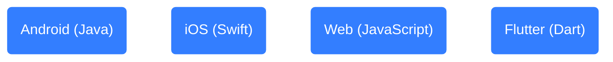
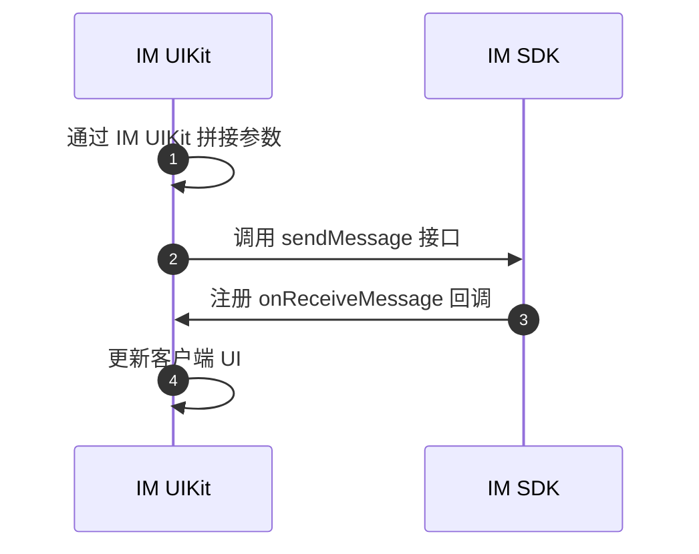

网易云信在即时通讯 IM 中实现了 AI 数字人聊天功能。本文介绍如何该功能的相关场景、效果以及实现方式。

本文采用 [网易云信即时通讯 UIKit（NIM UIKit）](https://doc.yunxin.163.com/messaging-uikit/concept?platform=client) 实现，内容适用的开发平台或框架如下所示：



## 功能介绍

AI 聊包含了三种场景，用来覆盖常见的即时通讯聊天形式，分别是：

- 场景一：单独与 AI 数字人聊天（简称 **AI 单聊**）

    用户可以直接与 AI 数字人发起一对一的聊天会话。无论是寻求信息查询、情感陪伴、知识分享还是娱乐互动、实现角色扮演/拟人沟通、AI 客服等场景，AI 数字人都能迅速响应，提供个性化的反馈和服务。

- 场景二：双人聊中 @AI 数字人引出会话（简称 **AI 聊**）

    当两个用户正在进行一对一聊天时，任意一方可以通过艾特（@）AI 数字人的方式，邀请其参与对话。AI 数字人会根据当前聊天的上下文，结合提问回答有用的信息，促进更深层次的交流。

    :::note note
    **AI 聊** 是网易云信即时通讯 IM 的创新功能，终端用户可以在 IM 单聊场景里，直接艾特（@）AI 数字人，快速参与到好友互动中，无需拉群或加好友，以第三人称提供 AI 辅助和聊天互动。
    :::

- 场景三：群聊中 @AI 数字人（简称 **AI 群聊**）

    在群聊环境中，AI 数字人同样可以被召唤加入。通过艾特（@）操作，AI 数字人能够理解群聊的主题和氛围，为群组成员提供实时的智能建议、解答疑问或是活跃气氛，成为群聊中的智慧助手，提升整体的沟通效率和娱乐性。用户可以将 AI 数字人拉入群中，进行互动，当然您也可以使用 **AI 聊** 功能替代。

## 效果展示

按照 AI 聊的三种场景，预期可实现的效果如下所示：

<style>
.container {
  display: flex;
  justify-content: space-between;
}

.column {
  flex: 1;
  margin: 5px;
  text-align: center;
}

.column img {
  width: 100%;
  height: auto;
}
</style>

<div class="container">
  <div class="column">
    <figure>   <figcaption style="width: 100%; text-align: center; caption-side: top;"><b>AI 单聊</b></figcaption>    </figure>
  </div>
  <div class="column">
    <figure>   <figcaption style="width: 100%; text-align: center; caption-side: top;"><b>AI 聊</b></figcaption>    </figure>
  </div>
  <div class="column">
    <figure>
  <figcaption style="width: 100%; text-align: center; caption-side: top;"><b>AI 群聊</b></figcaption>
  
</figure>
  </div>
</div>

## AI 数字人配置

在实现层面，AI 数字人被视为一种特殊的用户，在网易云信控制台上 [添加了 AI 数字人](https://doc.yunxin.163.com/aiagents/guide/jE4MTU1MDI?platform=client) 后，您需要调用服务端 [`/im/v2/users/:{account_id}`](https://doc.yunxin.163.com/messaging2/server-apis/TA0NzYzNjk?platform=server) 接口，将 AI 数字人的账号 ID（`account_id`）传入，并在 `extension` 字段中加入 AI 聊数字人的信息扩展，如下所示，即可被 IM UIKit 识别为 AI 聊数字人。

::: note notice
创建的 AI 数字人有对应的账号 ID，但是该 ID 仅用于识别，无法进行登录。
:::

- `aichat`：1 表示该  AI 数字人功能定位为 AI 聊数字人，可以进行聊天或者置顶到会话列表。
- `welcomeText`：用户首次进入 AI 数字人聊天页面，AI 数字人发送的欢迎消息。
- `pinDefault`：表示该 AI 数字人是否置顶到会话列表中。1 表示置顶，0 表示不置顶。默认为不置顶。
- `ai_stream`：表示 AI 数字人是否为流式输出方式。1 表示流式输出，0 表示非流式输出。默认为非流式输出。
- `ai_stream_status`：表示 AI 数字人输出状态。1 表示占位，2 表示停止输出，3 表示停止输出并更新 AI 消息，4 表示输出完成，5 表示服务器终止。

    ```JSON
    {
      "aiChat": 1, //是否为 AI 聊数字人
      "welcomeText": "欢迎使用 AI 聊数字人", //欢迎语
      "pinDefault": 1, //是否默认置顶
      "ai_stream": 1, //是否为流式输出方式
      "ai_stream_status": 4 //输出状态
    }
    ```

## 实现流程

客户端整体实现流程如下图所示：



## 一：通过 IM UIKit 拼接参数

### 场景 1：与 AI 数字人单聊

单聊时，上下文取值范围为最新的 30 条消息，且：

- 消息类型只能是文本消息、换行消息、回复消息。
- 第一条消息必须是真实用户发送的消息，而非 AI 数字人回复。
- 如果是换行消息（标题+内容），则拼接标题和内容作为上下文。

:::::: div linked-codes
::: code Android
```Java
protected List<V2NIMAIModelCallMessage> getAIMessage() {
  //上下文 List<V2NIMAIModelCallMessage> aiMessages = new ArrayList<>();
  if (AIUserManager.getAIUserById(accountId) != null) {
    int size = Math.min(chatView.getMessageList().size(), AI_MESSAGE_SIZE);
    // 第一条消息不能是 AI 数字人消息
    // 标记是否已经设置过第一条消息    boolean firstSet = false;
    for (int i = size; i > 0; i--) {
      int index = chatView.getMessageList().size() - i;
      ChatMessageBean chatMessageBean = chatView.getMessageList().get(index);
      boolean isFromAIUser =
          AIUserManager.isAIUser(chatMessageBean.getMessageData().getMessage().getSenderId());
      //1 如果第一条是 AI 数字人消息，则不再添加
      //2 如果消息已经撤回，则不再添加
      //3 如果消息没有服务器 ID，说明不是发出去的消息，则不再添加      if ((!firstSet && isFromAIUser)
          || chatMessageBean.isRevoked()
          || TextUtils.isEmpty(
              chatMessageBean.getMessageData().getMessage().getMessageServerId())) {
        continue;
      }
      firstSet = true;
      if (!TextUtils.isEmpty(
          MessageHelper.getAIContentMsg(chatMessageBean.getMessageData().getMessage()))) {
        aiMessages.add(
            new V2NIMAIModelCallMessage(
                isFromAIUser
                    ? V2NIMAIModelRoleType.V2NIM_AI_MODEL_ROLE_TYPE_ASSISTANT                    : V2NIMAIModelRoleType.V2NIM_AI_MODEL_ROLE_TYPE_USER,
                MessageHelper.getAIContentMsg(chatMessageBean.getMessageData().getMessage()),
                V2NIMMessageType.V2NIM_MESSAGE_TYPE_TEXT.getValue()));
      }
    }
  }
  return aiMessages;
}
```
:::
::: code iOS
```Swift
// 基础参数
let params = chatRepo.getSendMessageParams()

// aiUserAccid 为 AI 数字人账号
if let aiAccid = aiUserAccid {
    // 从最新的 30 条消息中取上下文
    let messageModels = messages.suffix(30)
    // 上下文只能为文本消息、换行消息、回复消息
    let aiMessageModels = messageModels.filter { $0.type == .text || $0.type == .richText || $0.type == .reply }

    var firstUserMessage = false // 是否找到第一条用户发的消息
    var aiMessages = [V2NIMAIModelCallMessage]()

    for (i, model) in aiMessageModels.enumerated() {
      var isUserMessage = false
      if model.message?.aiConfig == nil || !((model.message?.aiConfig?.aiStatus != .MESSAGE_AI_STATUS_RESPONSE) == true) {
        firstUserMessage = true
        isUserMessage = true
      }

      // 找到第一条用户发送的消息
      if !firstUserMessage {
        continue
      }

      let aiMessage = V2NIMAIModelCallMessage()
      aiMessage.type = .NIM_AI_MODEL_CONTENT_TYPE_TEXT

      if isUserMessage {
          // 用户发送的消息上下文 role 为 USER
        aiMessage.role = .NIM_AI_MODEL_ROLE_TYPE_USER
      } else {
          //  AI 数字人响应的消息上下文 role 为 ASSISTANT
        aiMessage.role = .NIM_AI_MODEL_ROLE_TYPE_ASSISTANT
      }

      if model.type == .text || model.type == .reply {
          // 文本消息、回复消息直接使用消息 text 作为上下文
        let text = model.message?.text ?? ""
        aiMessage.msg = text
      } else if model.type == .richText, let m = model as? MessageRichTextModel {
          // 换行消息拼接标题和内容作为上下文
        let text = (m.titleText ?? "") + (m.message?.text ?? "")
        aiMessage.msg = text
      }

      aiMessages.append(aiMessage)
    }

  let aiConfig = V2NIMMessageAIConfigParams()
  aiConfig.accountId = aiAccid

  // 请求大模型的内容
  let content = V2NIMAIModelCallContent()
    content.msg = text ?? ""
    content.type = .NIM_AI_MODEL_CONTENT_TYPE_TEXT

  // 文本消息
  if message.messageType == .MESSAGE_TYPE_TEXT, let text = message.text {
    aiConfig.content = content
    aiConfig.messages = aiMessages
  }

  // 换行消息
  if message.messageType == .MESSAGE_TYPE_CUSTOM,
     let type = NECustomUtils.typeOfCustomMessage(message.attachment),
     type == customRichTextType {
    let title = NECustomUtils.titleOfRichText(message.attachment)
    let body = NECustomUtils.bodyOfRichText(message.attachment)
    let text = (title ?? "") + (body ?? "")
    aiConfig.content = content
    aiConfig.messages = aiMessages
  }

  params.aiConfig = aiConfig
}
```
:::
::: code Web
```JavaScript
private _getAIConfig(
    msg: V2NIMMessageForUI
  ): V2NIMMessageAIConfigParams | undefined {
    const {
      serverExtension,
      conversationId,
      receiverId,
      messageType,
      text = '',
    } = msg

    let serverExt

    try {
      serverExt = JSON.parse(serverExtension || '{}')
    } catch (error) {
      serverExt = {}
    }

    // @ 消息
    const yxAitMsg = serverExt.yxAitMsg || {}
    // 回复消息
    const replyMsg = this.replyMsgs.get(conversationId)
    const { relation } = this.rootStore.uiStore.getRelation(receiverId)
    const myAccountId = this.rootStore.userStore.myUserInfo.accountId

    let aiConfig: V2NIMMessageAIConfigParams | undefined = void 0

    if (relation === 'ai') {
      if (messageType === V2NIMConst.V2NIMMessageType.V2NIM_MESSAGE_TYPE_TEXT) {
        // 取最近的 30 条文本会话
        let _msgs = (this.msgs.get(conversationId) || [])
          .slice(-AI_MESSAGE_LIMIT)
          .filter(
            (item) =>
              item.messageType ===
              V2NIMConst.V2NIMMessageType.V2NIM_MESSAGE_TYPE_TEXT
          )

        // 找到第一条自己发的消息，从此时开始作为真正的上下文
        const myIndex = _msgs.findIndex((item) => item.senderId === myAccountId)

        _msgs = myIndex === -1 ? [] : _msgs.slice(myIndex)

        aiConfig = {
          accountId: receiverId,
          content: { msg: text, type: 0 },
          // 取最后 30 条消息作为上下文
          messages: _msgs.map((item) => {
            const role =
              item.senderId === myAccountId
                ? ('user' as V2NIMAIModelRoleType)
                : ('assistant' as V2NIMAIModelRoleType)

            return {
              role,
              msg: item.text || '',
              type: 0,
            }
          }),
        }
      } else {
        aiConfig = {
          accountId: receiverId,
        }
      }
    }

    // 只保留 @ AI 数字人的 yxAitMsg
    const newYxAitMsg = {}

    Object.keys(yxAitMsg).forEach((account) => {
      if (this.rootStore.aiUserStore.aiUsers.has(account)) {
        newYxAitMsg[account] = yxAitMsg[account]
      }
    })

    // 找到最早的 @ AI 数字人
    const aiAtAccount = this._findMinStart(newYxAitMsg)
    const aiAtMember = this.rootStore.aiUserStore.aiUsers.get(aiAtAccount || '')

    // 表示 @ AI 数字人
    if (aiAtMember) {
      aiConfig = {
        accountId: aiAtMember.accountId,
        content: { msg: text, type: 0 },
      }
    }

    // 表示此时有回复消息
    if (replyMsg && aiConfig) {
      // 只有回复的是文本消息需要带上下文，其他类型消息不用带上下文
      if (
        replyMsg.messageType ===
        V2NIMConst.V2NIMMessageType.V2NIM_MESSAGE_TYPE_TEXT
      ) {
        aiConfig.messages = [
          {
            role: 'user' as V2NIMAIModelRoleType,
            msg: replyMsg.text || '',
            type: 0,
          },
        ]
      } else {
        aiConfig.messages = void 0
      }
    }

    return aiConfig
  }
```
:::
::: code Flutter
```Dart
final aiMessageSize= 30;
  List<NIMAIModelCallMessage?>? getAIMessages() {
    int size = min(_messageList.length, aiMessageSize);
    List<NIMAIModelCallMessage?>? aiMessages;
    if (isAIUser() && _messageList.isNotEmpty) {
      aiMessages = <NIMAIModelCallMessage?>[];
      //第一条消息不能是数字人消息
      // 标记是否已经设置过第一条消息
      bool firstSet = false;
      for (int index = 0; index < size; index++) {
        final message = _messageList[index];
        bool isFromAI =
            AIUserManager.instance.isAIUser(message.nimMessage.senderId);
        //1 如果第一条是数字人消息，则不再添加
        //2 如果消息已经撤回，则不再添加
        //3 如果消息没有服务器ID，说明不是发出去的消息，则不再添加
        //4 如果没有消息内容，则不再添加
        if ((!firstSet && !isFromAI) ||
            message.isRevoke ||
            message.nimMessage.messageServerId?.isNotEmpty != true ||
            ChatMessageHelper.getAIContentMsg(message.nimMessage)?.isNotEmpty !=
                true) {
          continue;
        }
        firstSet = true;
        aiMessages.add(NIMAIModelCallMessage(
            type: 0,
            msg: ChatMessageHelper.getAIContentMsg(message.nimMessage),
            role: isFromAI
                ? NIMAIModelRoleType.assistant
                : NIMAIModelRoleType.user));
      }
    }
    return aiMessages;
  }
```
:::
::::::

<a id="chat"></a>

### 场景 2：单聊中 @AI 数字人

单聊中艾特（@）数字人要求只能在真实用户一对一单聊中 @ 数字人，且按照用户场景可分为：

- 直接 @ 数字人，此时不需要传入上下文。
- 在回复消息中 @ 数字人，此时取被回复消息作为上下文，且：
    - 目前，被回复消息类型只能为文本消息、换行消息。
    - 如果是换行消息（标题+内容），则拼接标题和内容作为上下文。

:::::: div linked-codes
::: code Android
```Java
if (aiUser != null && replyMsg != null && !TextUtils.isEmpty(MessageHelper.getAIContentMsg(replyMsg))) {
  aiMessage =
      new V2NIMAIModelCallMessage(
          V2NIMAIModelRoleType.V2NIM_AI_MODEL_ROLE_TYPE_USER,
          MessageHelper.getAIContentMsg(replyMsg),
          0);
}
```
:::
::: code iOS
```Swift
// 基础参数
let params = chatRepo.getSendMessageParams()

// aiUserAccid 为数字人账号
if let aiAccid = aiUserAccid {

  let aiConfig = V2NIMMessageAIConfigParams()
  aiConfig.accountId = aiAccid

  // 请求大模型的内容
  let content = V2NIMAIModelCallContent()
    content.msg = text ?? ""
    content.type = .NIM_AI_MODEL_CONTENT_TYPE_TEXT

  // replyMessage 为被回复的消息，且消息类型为文本消息
  if replyMessage.messageType == .MESSAGE_TYPE_TEXT {
    let aiMessage = V2NIMAIModelCallMessage()
    aiMessage.msg = replyMessage.text ?? ""
    aiMessage.type = .NIM_AI_MODEL_CONTENT_TYPE_TEXT
    aiMessage.role = .NIM_AI_MODEL_ROLE_TYPE_USER

    aiConfig.messages = [aiMessage]
  }

  // replyMessage 为被回复的消息，且消息类型为换行消息
  if replyMessage.messageType == .MESSAGE_TYPE_CUSTOM,
     let type = NECustomUtils.typeOfCustomMessage(replyMessage.attachment),
     type == customRichTextType {
    let title = NECustomUtils.titleOfRichText(replyMessage.attachment)
    let body = NECustomUtils.bodyOfRichText(replyMessage.attachment)
    let text = (title ?? "") + (body ?? "")

    let aiMessage = V2NIMAIModelCallMessage()
    aiMessage.msg = text
    aiMessage.type = .NIM_AI_MODEL_CONTENT_TYPE_TEXT
    aiMessage.role = .NIM_AI_MODEL_ROLE_TYPE_USER

    aiConfig.messages = [aiMessage]
  }

  aiConfig.content = content
  params.aiConfig = aiConfig
}
```
:::
::: code Web
```JavaScript
private _getAIConfig(
    msg: V2NIMMessageForUI
  ): V2NIMMessageAIConfigParams | undefined {
    const {
      serverExtension,
      conversationId,
      receiverId,
      messageType,
      text = '',
    } = msg

    let serverExt

    try {
      serverExt = JSON.parse(serverExtension || '{}')
    } catch (error) {
      serverExt = {}
    }

    // @ 消息
    const yxAitMsg = serverExt.yxAitMsg || {}
    // 回复消息
    const replyMsg = this.replyMsgs.get(conversationId)
    const { relation } = this.rootStore.uiStore.getRelation(receiverId)
    const myAccountId = this.rootStore.userStore.myUserInfo.accountId

    let aiConfig: V2NIMMessageAIConfigParams | undefined = void 0

    if (relation === 'ai') {
      if (messageType === V2NIMConst.V2NIMMessageType.V2NIM_MESSAGE_TYPE_TEXT) {
        // 取最近的 30 条文本会话
        let _msgs = (this.msgs.get(conversationId) || [])
          .slice(-AI_MESSAGE_LIMIT)
          .filter(
            (item) =>
              item.messageType ===
              V2NIMConst.V2NIMMessageType.V2NIM_MESSAGE_TYPE_TEXT
          )

        // 找到第一条自己发的消息，从此时开始作为真正的上下文
        const myIndex = _msgs.findIndex((item) => item.senderId === myAccountId)

        _msgs = myIndex === -1 ? [] : _msgs.slice(myIndex)

        aiConfig = {
          accountId: receiverId,
          content: { msg: text, type: 0 },
          // 取最后 30 条消息作为上下文
          messages: _msgs.map((item) => {
            const role =
              item.senderId === myAccountId
                ? ('user' as V2NIMAIModelRoleType)
                : ('assistant' as V2NIMAIModelRoleType)

            return {
              role,
              msg: item.text || '',
              type: 0,
            }
          }),
        }
      } else {
        aiConfig = {
          accountId: receiverId,
        }
      }
    }

    // 只保留 @ 数字人的 yxAitMsg
    const newYxAitMsg = {}

    Object.keys(yxAitMsg).forEach((account) => {
      if (this.rootStore.aiUserStore.aiUsers.has(account)) {
        newYxAitMsg[account] = yxAitMsg[account]
      }
    })

    // 找到最早的 @ 数字人
    const aiAtAccount = this._findMinStart(newYxAitMsg)
    const aiAtMember = this.rootStore.aiUserStore.aiUsers.get(aiAtAccount || '')

    // 表示 @ 数字人
    if (aiAtMember) {
      aiConfig = {
        accountId: aiAtMember.accountId,
        content: { msg: text, type: 0 },
      }
    }

    // 表示此时有回复消息
    if (replyMsg && aiConfig) {
      // 只有回复的是文本消息需要带上下文，其他类型消息不用带上下文
      if (
        replyMsg.messageType ===
        V2NIMConst.V2NIMMessageType.V2NIM_MESSAGE_TYPE_TEXT
      ) {
        aiConfig.messages = [
          {
            role: 'user' as V2NIMAIModelRoleType,
            msg: replyMsg.text || '',
            type: 0,
          },
        ]
      } else {
        aiConfig.messages = void 0
      }
    }

    return aiConfig
  }
```
:::
::: code Flutter
```Dart
//根据回复消息设置上下文
    List<NIMAIModelCallMessage>? aiMessages;
    if (aiAgent != null && replyMsg != null) {
      final textMsg = ChatMessageHelper.getAIContentMsg(replyMsg);
      if (textMsg != null) {
        aiMessages = [
          NIMAIModelCallMessage(
              type: 0, msg: textMsg, role: NIMAIModelRoleType.user)
        ];
      }
    }
```
:::
::::::

### 场景 3：群聊中 @AI 数字人

在群聊场景下提及或召唤数字人（即 @ 数字人操作）的实现逻辑，与在单一聊天对话中执行相同动作时的机制保持一致。详情请参考 [单聊中 @ AI 数字人](#chat)。

## 二：发送消息

发送消息的接口采用 `sendMessage`，详情请参考《即时通讯 IM》[消息收发](https://doc.yunxin.163.com/messaging2/guide/DYzMjA0Njc?platform=client)。

发送消息时，您需要在发送接口的 `V2NIMSendMessageParams` 参数中填入 `aiConfig`，以此识别为调用大模型（LLMs）的请求。

:::::: div linked-codes
::: code Android
```Java
if (aiAgent != null) {
  aiConfigParams = new V2NIMMessageAIConfigParams(aiAgent.getAccountId());
  if (!TextUtils.isEmpty(MessageHelper.getAIContentMsg(message))) {
    V2NIMAIModelCallContent content =
        new V2NIMAIModelCallContent(MessageHelper.getAIContentMsg(message), 0);
    aiConfigParams.setContent(content);
  }
}
//AI 消息上下文设置 
if (aiConfigParams != null && aiMessage != null && !aiMessage.isEmpty()) {
  aiConfigParams.setMessages(aiMessage);
}
if (aiConfigParams != null) {
  paramsBuilder.withAIConfig(aiConfigParams);
}
ChatRepo.sendMessage(
    message,
    conversationId,
    paramsBuilder.build(),
    new ProgressFetchCallback<>(){
        //...
    };
```
:::
::: code iOS
```Swift
// params 为消息发送相关参数，类型为 V2NIMSendMessageParams
ChatRepo.shared.sendMessage(message: message,
                     conversationId: conversationId,
                     params: params) { result, error, pro in
  completion(result?.message ?? message, error, pro)
}
```
:::
::: code Web
```JavaScript
private _getAIConfig(
    msg: V2NIMMessageForUI
  ): V2NIMMessageAIConfigParams | undefined {
    const {
      serverExtension,
      conversationId,
      receiverId,
      messageType,
      text = '',
    } = msg

    let serverExt

    try {
      serverExt = JSON.parse(serverExtension || '{}')
    } catch (error) {
      serverExt = {}
    }

    // @ 消息
    const yxAitMsg = serverExt.yxAitMsg || {}
    // 回复消息
    const replyMsg = this.replyMsgs.get(conversationId)
    const { relation } = this.rootStore.uiStore.getRelation(receiverId)
    const myAccountId = this.rootStore.userStore.myUserInfo.accountId

    let aiConfig: V2NIMMessageAIConfigParams | undefined = void 0

    if (relation === 'ai') {
      if (messageType === V2NIMConst.V2NIMMessageType.V2NIM_MESSAGE_TYPE_TEXT) {
        // 取最近的 30 条文本会话
        let _msgs = (this.msgs.get(conversationId) || [])
          .slice(-AI_MESSAGE_LIMIT)
          .filter(
            (item) =>
              item.messageType ===
              V2NIMConst.V2NIMMessageType.V2NIM_MESSAGE_TYPE_TEXT
          )

        // 找到第一条自己发的消息，从此时开始作为真正的上下文
        const myIndex = _msgs.findIndex((item) => item.senderId === myAccountId)

        _msgs = myIndex === -1 ? [] : _msgs.slice(myIndex)

        aiConfig = {
          accountId: receiverId,
          content: { msg: text, type: 0 },
          // 取最后 30 条消息作为上下文
          messages: _msgs.map((item) => {
            const role =
              item.senderId === myAccountId
                ? ('user' as V2NIMAIModelRoleType)
                : ('assistant' as V2NIMAIModelRoleType)

            return {
              role,
              msg: item.text || '',
              type: 0,
            }
          }),
        }
      } else {
        aiConfig = {
          accountId: receiverId,
        }
      }
    }

    // 只保留 @ AI 数字人的 yxAitMsg
    const newYxAitMsg = {}

    Object.keys(yxAitMsg).forEach((account) => {
      if (this.rootStore.aiUserStore.aiUsers.has(account)) {
        newYxAitMsg[account] = yxAitMsg[account]
      }
    })

    // 找到最早的 @ AI 数字人
    const aiAtAccount = this._findMinStart(newYxAitMsg)
    const aiAtMember = this.rootStore.aiUserStore.aiUsers.get(aiAtAccount || '')

    // 表示 @ AI 数字人
    if (aiAtMember) {
      aiConfig = {
        accountId: aiAtMember.accountId,
        content: { msg: text, type: 0 },
      }
    }

    // 表示此时有回复消息
    if (replyMsg && aiConfig) {
      // 只有回复的是文本消息需要带上下文，其他类型消息不用带上下文
      if (
        replyMsg.messageType ===
        V2NIMConst.V2NIMMessageType.V2NIM_MESSAGE_TYPE_TEXT
      ) {
        aiConfig.messages = [
          {
            role: 'user' as V2NIMAIModelRoleType,
            msg: replyMsg.text || '',
            type: 0,
          },
        ]
      } else {
        aiConfig.messages = void 0
      }
    }

    return aiConfig
  }
```
:::
::: code Flutter
```Dart
//根据回复消息设置上下文
    List<NIMAIModelCallMessage>? aiMessages;
    if (aiAgent != null && replyMsg != null) {
      final textMsg = ChatMessageHelper.getAIContentMsg(replyMsg);
      if (textMsg != null) {
        aiMessages = [
          NIMAIModelCallMessage(
              type: 0, msg: textMsg, role: NIMAIModelRoleType.user)
        ];
      }
    }
```
:::
::::::

## 三：收到消息

发送消息的接口采用 `onReceiveMessages` 回调事件，详情请参考《即时通讯 IM》[消息收发](https://doc.yunxin.163.com/messaging2/guide/DYzMjA0Njc?platform=client)。

收到消息后，如果消息的 `aiConfig` 不为空且 `aiConfig.aiStatus` 为 `2`，则为 AI 数字人响应的消息。

:::::: div linked-codes
::: code Android
```Java
@Override
public void onReceiveMessages(@NonNull List<IMMessageInfo> messages) {
  //...
}
```
:::
::: code iOS
```Swift
/// 收到消息回调
/// - Parameter messages: 消息列表
public func onReceive(_ messages: [V2NIMMessage]) {
    for msg in messages {
          // AI 数字人回复的消息
          if msg.aiConfig != nil,
             msg.aiConfig?.aiStatus == .MESSAGE_AI_STATUS_RESPONSE {
            ...
          }
    }
}
```
:::
::: code Web
```JavaScript
nim.V2NIMMessageService.on('onReceiveMessages', () => {
    //...
})
```
:::
::: code Flutter
```Dart
 //new message
    subscriptions.add(
        NimCore.instance.messageService.onReceiveMessages.listen((event) async {
      
    }));
```
:::
::::::


<style>
    .platform-tabs {
        display: flex;
        justify-content: center;
        align-items: left;
        gap: 14px; /* 间距 */
        margin-top: 20px;
        justify-content: flex-start;：子元素靠左对齐。
        // flex-wrap: wrap; /* 允许标签在必要时换行 */
    }

    .platform-tab {
        display: flex;
        align-items: center;
        padding: 8px 16px; /* 调整内边距 */
        height: 38px; /* 设置固定高度 */
        border: 1px solid #ccc;
        border-radius: 5px;
        box-shadow: 0 4px 8px rgba(0, 0, 0, 0.1);
        background-color: #0000;
        font-family: 'Inter', sans-serif;
        font-size: 14px; /* 调整字体大小 */
        cursor: pointer;
        transition: all 0.3s ease;
        white-space: nowrap; /* 防止文字换行 */
    }

    .platform-tab:hover {
        box-shadow: 0 6px 12px rgba(0, 0, 0, 0.2);
        transform: translateY(-2px);
    }

    .platform-tab img {
        width: 24px;
        height: 24px;
        margin-right: 8px;
    }

    .platform-tab span {
        margin-left: 5px;
        margin-right: 5px;
    }
</style>