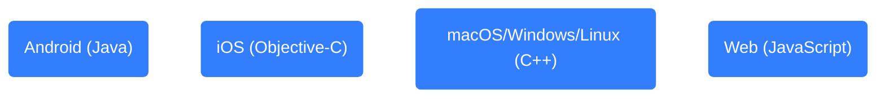
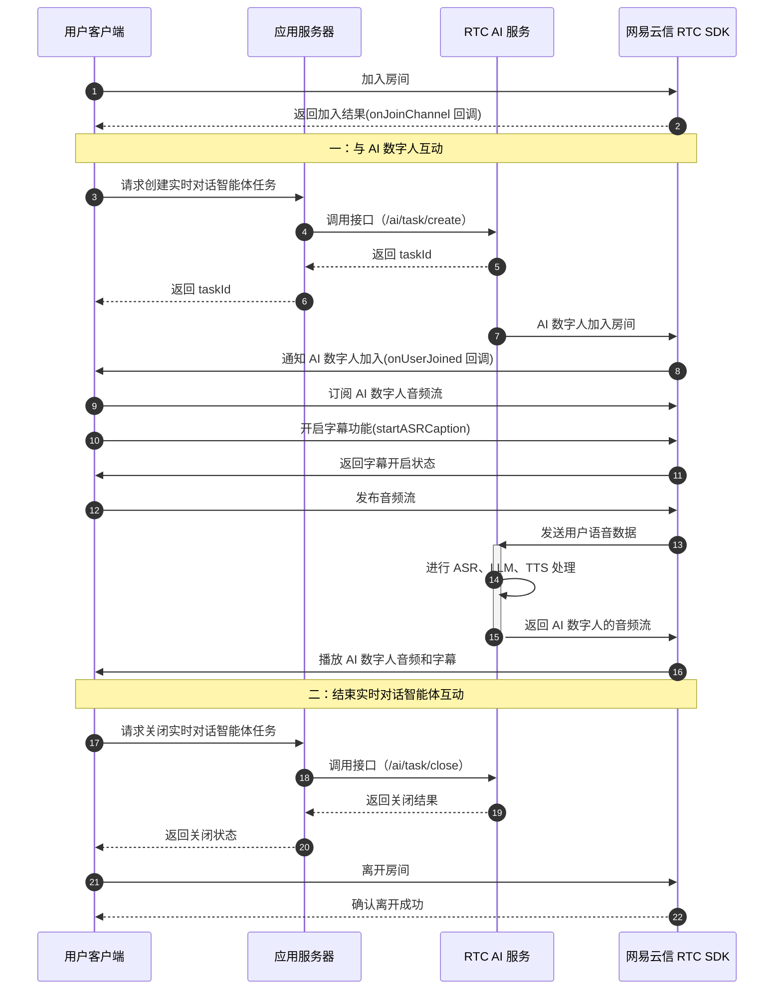
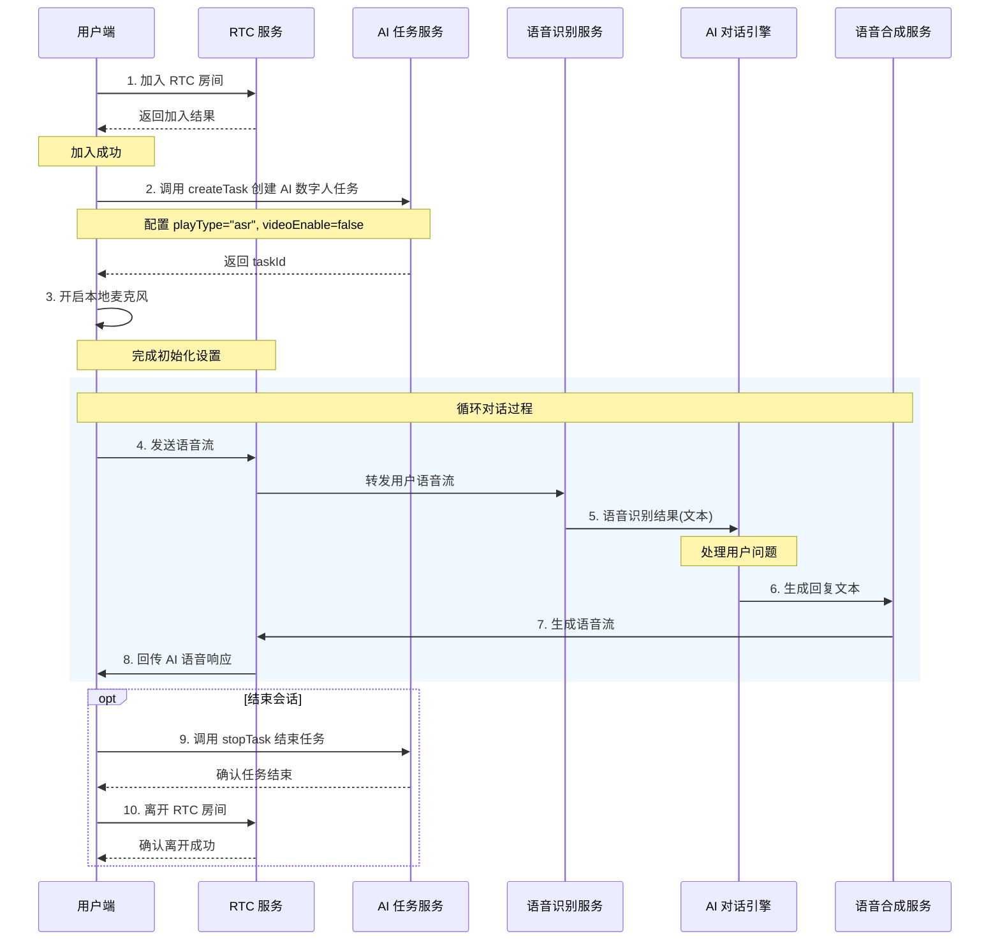

网易云信支持通过实时对话智能体实现 AI 数字人互动功能。本文介绍了实现这一业务场景所需的配套功能，以及在不同平台项目音视频应用中的实现方式。

本文以实现实时字幕功能为例，适用于基于已有的安卓、iOS、macOS/Windows/Linux、Web 应用引入 AI 数字人的业务功能，内容适用的开发平台如下所示：



## 产品介绍

[实时对话智能体](https://yunxin.163.com/rtc-ai) 是网易云信倾力打造的一款多模态智能体，让人与 AI 的交互不再局限于文字。基于实时对话智能体，您可以轻松打造一个能处理多模态数据的实时对话 AI 数字人，赋予数字人更强的情感体验和互动能力。

## 业务场景

除了打造 AI 数字人之外，实时对话智能体还可以用于多种互动场景，如在线教育、企业会议、社交互动等，提供个性化的反馈和服务。

- **企业会议**：在企业会议中，实时对话智能体可以实时记录会议要点、提供决策支持和后续行动项跟踪。还可以实时翻译和总结会议内容，实现无缝沟通。
- **智能硬件**：依托于嵌入的实时对话智能体，实现传统硬件的智能化改造，从而为用户提供情感陪伴、智能教育、实时看护以及多端控制与联动。
- **社交互动**：社交应用通过集成实时对话智能体，丰富用户互动方式，如虚拟角色互动、情感陪伴等。实时对话智能体还可以提供初步心理咨询服务，通过聊天和对话缓解用户压力和焦虑。
- **语言学习**：对于语言学习应用，实时对话智能体可以模拟不同语言的母语者，帮助学习者练习听力和口语。
- **游戏娱乐**：在游戏和互动娱乐平台中，实时对话智能体可以作为虚拟角色，提供沉浸式的游戏体验和互动故事。
- **虚拟讲解**：在电商直播领域，实时对话智能体能够全天候主持节目、介绍产品、互动直播。在旅游和文化推广方面，实时对话智能体化身虚拟导游，介绍旅游景点、文化背景和历史信息。

## 体验功能

### 第一步：体验在线 Demo

:::::: div custom-tabs
::: tab 实时对话 DEMO

网易云信精心打造了支持多模态数据的实时对话 DEMO，通过这个 DEMO，您可以体验到以下场景：

- **自定义角色**：根据您的需求，定制专属的对话角色，提升交互体验。
- **灵活暂停功能**：在对话中随时暂停，方便您处理其他事务。
- **个人生活助手**：例如智能天气查询，只需简单提问，即可获取实时天气信息。

    更多惊喜等待您探索。您可以联系在线客户经理或 [提交工单](https://app.yunxin.163.com/global/service/ticket/create) 联系网易云信技术支持工程师，为您详细介绍并提供 DEMO 访问权限。

    

:::
::: tab AI 数字人 DEMO

您可以前往 [融合通讯 + AI 场景功能体验 App](https://aigc.yunxin.163.com/) 体验相关功能。


:::
::::::

### 第二步：正式开通

如果您需要正式开通网易云信对话式 AI 能力，请参考 [AI 服务计费规则](https://doc.yunxin.163.com/nertc/server-apis/TYxNjMwNTg?platform=server) 开通功能。

## 准备工作

根据本文操作前，请确保您已经完成了以下设置：

- 在 [网易云信控制台](https://app.yunxin.163.com/global/home) 上创建至少一个应用，并开通音视频通话 2.0 服务。详细步骤请参考 [创建应用并获取 AppKey](https://doc.yunxin.163.com/console/concept/TIzMDE4NTA?platform=console)。
- 集成了 NERTC SDK 到您的项目。详情请参考对应开发平台或框架的 [集成开发](https://doc.yunxin.163.com/nertc/guide?platform=android) 手册。

## 相关接口

本文涉及的 NERTC SDK 接口调用如下所示：

:::::: div linked-codes
::: code Android
- [init](https://doc.yunxin.163.com/nertc/references/android/doxygen/Latest/zh/html/classcom_1_1netease_1_1lava_1_1nertc_1_1sdk_1_1_n_e_rtc.html#a2198fb57cd127a8ae136e1f450236e57)
- [joinChannel](https://doc.yunxin.163.com/nertc/references/android/doxygen/Latest/zh/html/classcom_1_1netease_1_1lava_1_1nertc_1_1sdk_1_1channel_1_1_n_e_rtc_channel.html#ac4d898d7aff28eceb4563dbd401905a1)
- [onJoinChannel](https://doc.yunxin.163.com/nertc/references/android/doxygen/Latest/zh/html/interfacecom_1_1netease_1_1lava_1_1nertc_1_1sdk_1_1channel_1_1_n_e_rtc_channel_callback.html#a45f03a0d039cbd98520752af764e8e17)
- [NERtcCallback](https://doc.yunxin.163.com/nertc/references/android/doxygen/Latest/zh/html/interfacecom_1_1netease_1_1lava_1_1nertc_1_1sdk_1_1_n_e_rtc_callback.html)
- [setAudioProfile](https://doc.yunxin.163.com/nertc/references/android/doxygen/Latest/zh/html/classcom_1_1netease_1_1lava_1_1nertc_1_1sdk_1_1_n_e_rtc.html#a577e39135f6388f4d02e4cb72f97a9f3)
- [startASRCaption](https://doc.yunxin.163.com/nertc/references/android/doxygen/Latest/zh/html/classcom_1_1netease_1_1lava_1_1nertc_1_1sdk_1_1_n_e_rtc_ex.html#a3a596178454004ffa60048408452e255)
- [stopASRCaption](https://doc.yunxin.163.com/nertc/references/android/doxygen/Latest/zh/html/classcom_1_1netease_1_1lava_1_1nertc_1_1sdk_1_1_n_e_rtc_ex.html#a414aa68931856ba0784f2888706a0f4b)
- [onAsrCaptionStateChanged](https://doc.yunxin.163.com/nertc/references/android/doxygen/Latest/zh/html/interfacecom_1_1netease_1_1lava_1_1nertc_1_1sdk_1_1_n_e_rtc_callback_ex.html#a78863157c411456eaf507dbd8070dc5f)
- [onAsrCaptionResult](https://doc.yunxin.163.com/nertc/references/android/doxygen/Latest/zh/html/interfacecom_1_1netease_1_1lava_1_1nertc_1_1sdk_1_1_n_e_rtc_callback_ex.html#a2bedd5417c013d4b52aebfab76f48c89)
<!-- - ASR -->
:::
::: code iOS
- [setupEngineWithContext](https://doc.yunxin.163.com/nertc/references/iOS/doxygen/Latest/zh/html/protocol_i_n_e_rtc_engine-p.html#aa0b59418e236407489b3a5cb7abdd9e1)
- [joinChannelWithToken](https://doc.yunxin.163.com/nertc/references/iOS/doxygen/Latest/zh/html/protocol_i_n_e_rtc_engine-p.html#a4876b67191a8e51488fc0d0ef14fc724)
- [NERtcJoinChannelCompletion](https://doc.yunxin.163.com/nertc/references/iOS/doxygen/Latest/zh/html/_i_n_e_rtc_engine_8h.html#aa42cdb0d053a6ae6dacd6c00d5417b70)
- [setAudioProfile](https://doc.yunxin.163.com/nertc/references/iOS/doxygen/Latest/zh/html/protocol_i_n_e_rtc_engine-p.html#a79daa01fb308cf2b70d27fb7f73cab01)
- [startASRCaption](https://doc.yunxin.163.com/nertc/references/iOS/doxygen/Latest/zh/html/protocol_i_n_e_rtc_engine_ex-p.html#a7706561b76cfc84ca6da9b83fb3b05f2)
- [stopASRCaption](https://doc.yunxin.163.com/nertc/references/iOS/doxygen/Latest/zh/html/protocol_i_n_e_rtc_engine_ex-p.html#a64d0c0b703406998f70378ae3b511864)
- [onNERtcEngineAsrCaptionStateChanged](https://doc.yunxin.163.com/nertc/references/iOS/doxygen/Latest/zh/html/protocol_n_e_rtc_engine_delegate_ex-p.html#a7f49d9bd0d278aab3591ebd4f77b10e6)
- [onNERtcEngineAsrCaptionResult](https://doc.yunxin.163.com/nertc/references/iOS/doxygen/Latest/zh/html/protocol_n_e_rtc_engine_delegate_ex-p.html#ae3f51a1bfe620acfe8aca45df9874c57)
:::
::: code C++
- [initialize](https://doc.yunxin.163.com/nertc/references/macOS/doxygen/Latest/zh/html/classnertc_1_1_i_rtc_engine.html#a1e816fd56f1cc6953a263f6798d0f1d4)
- [joinChannel](https://doc.yunxin.163.com/nertc/references/macOS/doxygen/Latest/zh/html/classnertc_1_1_i_rtc_engine.html#a29bdc1e3e13990b94ab9e92c8c7b5693)
- [onJoinChannel](https://doc.yunxin.163.com/nertc/references/macOS/doxygen/Latest/zh/html/classnertc_1_1_i_rtc_engine_event_handler.html#a3f55353db4a1369d70ec3859e91c7337)
- [setAudioProfile](https://doc.yunxin.163.com/nertc/references/macOS/doxygen/Latest/zh/html/classnertc_1_1_i_rtc_engine_ex.html#afdf5835ec7a5cabf46c43f2b4cc8b030)
- [startASRCaption](https://doc.yunxin.163.com/nertc/references/macOS/doxygen/Latest/zh/html/classnertc_1_1_i_rtc_engine_ex.html#a1689a0bdcf317353d05e806bcb4140d7)
- [stopASRCaption](https://doc.yunxin.163.com/nertc/references/macOS/doxygen/Latest/zh/html/classnertc_1_1_i_rtc_engine_ex.html#a233033d4fff11b7c8160e3507235c426)
- [onAsrCaptionStateChanged](https://doc.yunxin.163.com/nertc/references/macOS/doxygen/Latest/zh/html/classnertc_1_1_i_rtc_engine_event_handler_ex.html#a2b6b9377a15928ec24249278199e8d42)
- [onAsrCaptionResult](https://doc.yunxin.163.com/nertc/references/macOS/doxygen/Latest/zh/html/classnertc_1_1_i_rtc_engine_event_handler_ex.html#adf82bb032c38c1ce42ea7d8a663113ee)
:::
::: code Web
- [createClient](https://doc.yunxin.163.com/docs/interface/nertc/web/typedoc/Latest/zh/html/modules/nertc.nertc-1.html#createclient)
- [client.on](https://doc.yunxin.163.com/docs/interface/nertc/web/typedoc/Latest/zh/html/interfaces/client.client-1.html#join)
- [stream.setAudioProfile](https://doc.yunxin.163.com/docs/interface/nertc/web/typedoc/Latest/zh/html/interfaces/stream.stream-1.html#setaudioprofile)
- [stream.init](https://doc.yunxin.163.com/docs/interface/nertc/web/typedoc/Latest/zh/html/interfaces/stream.stream-1.html#init)
- [client.publish](https://doc.yunxin.163.com/docs/interface/nertc/web/typedoc/Latest/zh/html/interfaces/client.client-1.html#publish)
- [client.startAsrCaptions](https://doc.yunxin.163.com/docs/interface/nertc/web/typedoc/Latest/zh/html/interfaces/client.client-1.html#startasrcaptions)
- [client.on](https://doc.yunxin.163.com/docs/interface/nertc/web/typedoc/Latest/zh/html/interfaces/client.client-1.html#on)
:::
::::::

本文涉及的 NERTC 服务端接口调用如下所示：

- **[开启实时对话](https://doc.yunxin.163.com/nertc/server-apis/jQzOTE2NTc?platform=server)**：`https://rtc-ai.yunxinapi.com/ai/task/create`
- **[结束实时对话](https://doc.yunxin.163.com/nertc/server-apis/TM5NTMwNzY?platform=server)**：`https://rtc-ai.yunxinapi.com/ai/task/close`

## 调用时序

基于网易云信音视频通话实现 AI 数字人音视频互动的整体流程如下图所示（以安卓为例，其他平台有接口差异）：



## 第一步：创建 Client 并加入房间

本章节介绍如何使用 NERTC SDK 创建客户端并加入房间，包括如何监听流添加事件、订阅 AI 数字人的远程流，并在订阅后播放音频流。

:::::: div linked-codes
::: code Android
```Java
//初始化 RTC,添加 RTC 相关的事件监听
private final NERtcCallback rtcCallback = new NERtcCallbackEx() {
    @Override
    public void onJoinChannel(int result, long channelId, long elapsed, long uid) {
        Log.i(TAG, "本端加入房间结果 result = " + result + ", channelId = " + channelId);
    }

    @Override
    public void onUserJoined(long uid, NERtcUserJoinExtraInfo joinExtraInfo) {
        Log.i(TAG, "AI 数字人加入房间 uid = " + uid + ", joinExtraInfo = " + joinExtraInfo.customInfo);
    }
    @Override
    public void onAsrCaptionStateChanged(int asrState, int code, String message) {
        Log.i(TAG, "字幕状态 asrState = " + asrState + ", code = " + code + ", message = " + message);
    }
    @Override
    public void onAsrCaptionResult(NERtcAsrCaptionResult[] result, int resultCount) {
        Log.i(TAG, "收到字幕消息 resultCount = " + resultCount);
    }
    ...
}
NERtcOption rtcOption = new NERtcOption();
rtcOption.logDir = AppUtils.getExtraLogPath(context);
rtcOption.logLevel = NERtcConstants.LogLevel.INFO;
NERtcEx.getInstance().init(context, appkey, rtcCallback, rtcOption);
//加入 RTC 房间
NERtcEx.getInstance().joinChannel(token, channelName, uid);
```

:::
::: code iOS
```Objective-C
//初始化 SDK
NERtcEngineContext *context = [[NERtcEngineContext alloc] init];
[[NERtcEngine sharedEngine] setupEngineWithContext:context];

//加入 RTC 房间
[[NERtcEngine sharedEngine] joinChannelWithToken:@"Your Token"
                                    channelName: Your roomId
                                          myUid:Your userId
                                channelOptions:NERtcJoinChannelOptions
                                    completion:^(NSError * _Nullable error, uint64_t channelId, uint64_t elapesd) {
                                                        if (error) {
                                                            //加入失败
                                                        } else {
                                                            //加入成功
                                                        }
                                      }];

- (void)onNERtcEngineUserDidJoinWithUserID:(uint64_t)userID userName:(NSString *)userName joinExtraInfo:(nullable NERtcUserJoinExtraInfo *)joinExtraInfo {
   //AI 数字人加入房间
}

- (void)onNERtcEngineAsrCaptionStateChanged:(NERtcAsrCaptionState)state code:(int)code message:(NSString *)message {
  // 开启/关闭字幕状态
}

- (void)onNERtcEngineAsrCaptionResult:(nullable NSArray<NERtcAsrCaptionResult*> *)results {
  // 收到字幕消息
}
```

:::
::: code C++
```C++
//初始化 SDK
NERtcEngineContext context;
context.app_key = "xxxxxxxxxxxx";
context.event_handler = this;
IRtcEngineEx *rtc_engine = (IRtcEngineEx *)createNERtcEngine();
rtc_engine->initialize(context);

//加入 RTC 房间
rtc_engine_->joinChannel(token, channel_name, uid);

void onJoinChannel(channel_id_t cid, uid_t uid, NERtcErrorCode result, uint64_t elapsed) {
   //加入房间的结果返回
}

void onUserJoined(uid_t uid, const char* user_name, NERtcUserJoinExtraInfo join_extra_info) {
   //AI 数字人加入房间
}

void onAsrCaptionStateChanged(NERtcAsrCaptionState state, int code, const char* message) {
  // 开启/关闭字幕状态
}

void onAsrCaptionResult(const NERtcAsrCaptionResult *results, unsigned int result_count) {
  // 收到字幕消息
}
```

:::
::: code Web
```JavaScript
const client = NERTC.createClient({
  appkey,
});
//监听 stream-added 事件，订阅 AI 数字人的远端流
client.on('stream-added', e => {
  console.log('stream-added', 'AI 数字人已加入房间');
  const remoteStream = e.stream;
  client.subscribe(remoteStream, { audio: true, video: false });
});
//监听'stream-subscribed'，订阅到 AI 数字人后调用 play()
client.on('stream-subscribed', e => {
  const remoteStream = e.stream;
  console.log('stream-subscribed', 'AI 数字人已订阅');
  if (e.mediaType === 'audio') {
    remoteStream.play(null, { audio: true, video: false });
  }
});

await client.join({
    channelName,
    uid,
    token,
})
```
:::
::::::

## 第二步：创建本地音频流

本章节解释了如何创建本地音频流，并设置音频配置以保证与 AI 数字人更好的互动效果。

:::::: div linked-codes
::: code Android
为保证与 AI 数字人更好的聊天效果，请在 `NERtcEx.getInstance()`[.`init()`](https://doc.yunxin.163.com/nertc/references/android/doxygen/Latest/zh/html/classcom_1_1netease_1_1lava_1_1nertc_1_1sdk_1_1_n_e_rtc.html#a2198fb57cd127a8ae136e1f450236e57) 之后调用 [`setAudioProfile(NERtcConstants.AudioProfile.STANDARD, NERtcConstants.AudioScenario.MUSIC)`](https://doc.yunxin.163.com/nertc/references/android/doxygen/Latest/zh/html/classcom_1_1netease_1_1lava_1_1nertc_1_1sdk_1_1_n_e_rtc.html#a577e39135f6388f4d02e4cb72f97a9f3)。
```Java
NERtcEx.getInstance().init(context, appkey, rtcCallback, rtcOption);
NERtcEx.getInstance().setAudioProfile(NERtcConstants.AudioProfile.STANDARD, NERtcConstants.AudioScenario.MUSIC);
```
:::
::: code iOS

为保证与 AI 数字人更好的聊天效果，请在 [`setupEngineWithContext`](https://doc.yunxin.163.com/nertc/references/iOS/doxygen/Latest/zh/html/protocol_i_n_e_rtc_engine-p.html#aa0b59418e236407489b3a5cb7abdd9e1) 初始化之后调用 [`setAudioProfile:kNERtcAudioProfileStandard scenario:kNERtcAudioScenarioMusic]`](https://doc.yunxin.163.com/nertc/references/iOS/doxygen/Latest/zh/html/protocol_i_n_e_rtc_engine-p.html#a79daa01fb308cf2b70d27fb7f73cab01)。

```Objective-C
[[NERtcEngine sharedEngine] setAudioProfile:kNERtcAudioProfileStandard scenario:kNERtcAudioScenarioMusic];
```

:::
::: code C++
为保证与 AI 数字人更好的聊天效果，请在 [`initialize`](https://doc.yunxin.163.com/nertc/references/macOS/doxygen/Latest/zh/html/classnertc_1_1_i_rtc_engine.html#a1e816fd56f1cc6953a263f6798d0f1d4) 初始化之后调用 [rtc_engine->setAudioProfile(kNERtcAudioProfileStandard, kNERtcAudioScenarioMusic)](https://doc.yunxin.163.com/nertc/references/macOS/doxygen/Latest/zh/html/classnertc_1_1_i_rtc_engine_ex.html#a34c04a16ffdd9702636191073b3dbe99)。

```C++
rtc_engine->setAudioProfile(kNERtcAudioProfileStandard, kNERtcAudioScenarioMusic);
```

:::
::: code Web

为保证与 AI 数字人更好的聊天效果，请在 [`stream.init()`](https://doc.yunxin.163.com/docs/interface/nertc/web/typedoc/Latest/zh/html/interfaces/stream.stream-1.html#init) 之前调用 [`setAudioProfile('music_standard')`](https://doc.yunxin.163.com/docs/interface/nertc/web/typedoc/Latest/zh/html/interfaces/stream.stream-1.html#setaudioprofile)。

```JavaScript
const localStream = NERTC.createStream({
    audio: true,
    video: false,
    }) as Stream;
localStream.setAudioProfile('music_standard');
await localStream.init()
```
:::
::::::

## 第三步：发布音频流

本章节展示了 Web 应用如何发布本地音频流，使其他用户（包括 AI 数字人）能够接收到音频数据。

:::::: div linked-codes
::: code Android
NERTC Android SDK 自动发布音频流，您可跳过本步骤。
:::
::: code iOS
NERTC iOS SDK 自动发布音频流，您可跳过本步骤。
:::
::: code C++
NERTC C++ SDK 自动发布音频流，您可跳过本步骤。
:::
::: code Web
```JavaScript
await client.publish(localStream);
```
:::
::::::

## 第四步：AI 数字人加入房间

### 收到回调后再加入房间

调用 AI 数字人加入房间的 createTask 接口应在客户端成功加入房间后执行，即在收到 joinChannel 的成功回调后再进行，以确保服务器端房间已完全创建。如果在 joinChannel 调用后立即调用 createTask 可能会导致 **房间不存在** 的错误。以下示例展示了正确的调用时序：

:::::: div linked-codes
::: code Android
```Java
// 初始化 RTC,添加 RTC 相关的事件监听
private final NERtcCallback rtcCallback = new NERtcCallbackEx() {
    @Override
    public void onJoinChannel(int result, long channelId, long elapsed, long uid) {
        if (result == 0) {
            Log.i(TAG, "本端加入房间成功 channelId = " + channelId);
            // 成功加入房间后，再调用创建 AI 数字人任务的接口
            joinRtcRoomTask(config, new TaskCallback() {
                @Override
                public void onSuccess(String taskId) {
                    Log.d(TAG, "joinRtcRoomTask success, taskId: " + taskId);
                }

                @Override
                public void onError(String errorMessage) {
                    Log.d(TAG, "joinRtcRoomTask error: " + errorMessage);
                }
            });
        } else {
            Log.e(TAG, "加入房间失败，错误码 = " + result);
        }
    }
}
```
:::
::: code iOS
```Objective-C
// 加入 RTC 房间
[[NERtcEngine sharedEngine] joinChannelWithToken:@"Your Token"
                                    channelName: Your roomId
                                          myUid:Your userId
                                channelOptions:NERtcJoinChannelOptions
                                    completion:^(NSError * _Nullable error, uint64_t channelId, uint64_t elapesd) {
                                        if (error) {
                                            // 加入失败
                                            NSLog(@"加入房间失败: %@", error);
                                        } else {
                                            // 加入成功，调用创建 AI 数字人任务的接口
                                            NSLog(@"加入房间成功，channelId: %llu", channelId);
                                            RtcRoomTask *task = [[RtcRoomTask alloc] init];
                                            [task joinRtcRoomTaskWithConfig:config callback:self];
                                        }
                                      }];
```
:::
::: code C++
```C++
// 初始化 SDK
NERtcEngineContext context;
context.app_key = "xxxxxxxxxxxx";
context.event_handler = this;
IRtcEngineEx *rtc_engine = (IRtcEngineEx *)createNERtcEngine();
rtc_engine->initialize(context);

// 加入 RTC 房间
rtc_engine_->joinChannel(token, channel_name, uid);

// 加入房间的回调实现
void onJoinChannel(channel_id_t cid, uid_t uid, NERtcErrorCode result, uint64_t elapsed) {
    if (result == kNERtcNoError) {
        // 加入房间成功，调用创建 AI 数字人任务的接口
        std::cout << "加入房间成功, channelId: " << cid << std::endl;

        // 1. 设置请求 URL
        std::string url = "https://rtc-ai.yunxinapi.com/ai/task/create";

        // 2. 构建请求体并发送请求
        // ...创建 AI 数字人任务的代码...
    } else {
        std::cout << "加入房间失败, 错误码: " << result << std::endl;
    }
}
```
:::
::: code Web
```JavaScript
// 加入房间是异步操作
client.join({
    channelName,
    uid,
    token,
}).then(() => {
    console.log('加入房间成功');
    // 成功加入房间后，再调用创建 AI 数字人任务的接口
    joinRtcRoomTask(taskConfig).then((res) => {
        if (res.data.code === 200) {
            console.log('joinRtcRoomTask success', res.data.result);
            // AI 数字人退出房间时，需要该参数
            const taskId = res.data.result.taskId;
        } else {
            console.error('joinRtcRoomTask error', res);
        }
    });
}).catch(err => {
    console.error('加入房间失败', err);
});
```
:::
::::::

### 选择智能体配置方式

网易云信实时对话智能体提供开放接口（[/ai/task/create](https://doc.yunxin.163.com/nertc/server-apis/jQzOTE2NTc?platform=server)），支持用户按需设置 AI 能力模块（例如自动语音识别 ASR、文字转语音 TTS、大语言模型 LLM）参数，个性化定制用户专属的 AI 智能体。

- **方式一：参数配置模式**

    参数配置模式是指调用开放接口时，在请求体中逐一设定 `asr`、`llm`、`tts`、`pipeline` 等参数，适用于灵活调用场景。

- **方式二：智能体开发模式**

    智能体开发模式是指先在网易云信 [智能体平台](https://doc.yunxin.163.com/ai-hardware/guide/TU3MjE3NjE?platform=client) 添加智能体，完成智能体的可视化配置后，再通过使用 agent 参数信息，全量配置即全量配置均从 [网易云信智能体管理平台](https://doc.yunxin.163.com/ai-hardware/guide/TU3MjE3NjE?platform=client) 获取。适用于调用已有智能体的快捷模式。

以下代码以 **参数配置模式** 为示例提供了 AI 数字人作为 RTC 用户加入房间的详细步骤，包括通过客户端 API 调用方式调用 [AI 服务接口](https://doc.yunxin.163.com/nertc/server-apis/jQzOTE2NTc?platform=server) 创建 RTC AI 任务和处理任务结果。如果您想通过 **智能体开发模式** 实现，请参考 [开启实时对话](https://doc.yunxin.163.com/nertc/server-apis/jQzOTE2NTc?platform=server#%E8%AF%B7%E6%B1%82%E4%BD%93%E7%A4%BA%E4%BE%8B) 请求体示例二。

:::::: div linked-codes
::: code Android
```Java
//joinRtcRoomTask 调用示例
joinRtcRoomTask(config, new TaskCallback() {
    @Override
    public void onSuccess(String taskId) {
        Log.d(TAG, "joinRtcRoomTask success, taskId: " + taskId);
    }

    @Override
    public void onError(String errorMessage) {
        Log.d(TAG, "joinRtcRoomTask error: " + errorMessage);
    }
});
//joinRtcRoomTask 方法实现
public void joinRtcRoomTask(RtcTaskConfig config, TaskCallback callback) {
    OkHttpClient client = new OkHttpClient();

    // 构建请求体
    JSONObject jsonBody = new JSONObject();
    try {
        jsonBody.put("cname", config.getcname());
        jsonBody.put("appkey", config.getAppkey());
        jsonBody.put("taskType", config.getTaskType());
        JSONObject data = new JSONObject();
        JSONObject llm = new JSONObject();
        JSONObject customPromptKeyWord = new JSONObject();
        customPromptKeyWord.put("name", config.getData().getLlm().getCustomPromptKeyWord().getName());
        customPromptKeyWord.put("sex", config.getData().getLlm().getCustomPromptKeyWord().getSex());
        customPromptKeyWord.put("age", config.getData().getLlm().getCustomPromptKeyWord().getAge());
        customPromptKeyWord.put("hobby", config.getData().getLlm().getCustomPromptKeyWord().getHobby());
        customPromptKeyWord.put("characteristic", config.getData().getLlm().getCustomPromptKeyWord().getCharacteristic());

        llm.put("customPromptKeyWord", customPromptKeyWord);
        data.put("llm", llm);

        JSONObject tts = new JSONObject();
        tts.put("voice", config.getData().getTts().getVoice());
        data.put("tts", tts);

        jsonBody.put("data", data);

    } catch (Exception e) {
        e.printStackTrace();
    }

    // 构建请求体
    RequestBody requestBody = RequestBody.create(
       MediaType.parse("application/json; charset=utf-8"), jsonBody.toString());

    // 创建请求
    Request request = new Request.Builder()
       .url("https://rtc-ai.yunxinapi.com/ai/task/create")
       .post(requestBody)
       .addHeader("AppKey", config.getAppkey())
       .addHeader("Cname", config.getRoomCname())
       .addHeader("Uid", config.getUid())
       .addHeader("Token", config.getRtcToken())
       .build();

    // 异步执行请求
    client.newCall(request).enqueue(new Callback() {
        @Override
        public void onFailure(Call call, IOException e) {
            e.printStackTrace();
            if (callback != null) {
                callback.onError("Request failed: " + e.getMessage());
            }
        }

        @Override
        public void onResponse(Call call, Response response) throws IOException {
            if (response.isSuccessful()) {
                String res = response.body().string();
                try {
                    JSONObject jsonResponse = new JSONObject(res);
                    if (jsonResponse.getInt("code") == 200) {
                        // 任务成功
                        JSONObject result = jsonResponse.getJSONObject("result");
                        String taskId = result.getString("taskId");
                        if (callback != null) {
                            callback.onSuccess(taskId);
                        }
                    } else {
                        if (callback != null) {
                            callback.onError("Error: " + jsonResponse.toString());
                        }
                    }
                } catch (Exception e) {
                    e.printStackTrace();
                    if (callback != null) {
                        callback.onError("Error parsing response: " + e.getMessage());
                    }
                }
            } else {
                if (callback != null) {
                    callback.onError("Request failed with status code: " + response.code());
                }
            }
        }
    });
}
```
:::
::: code iOS
```Objective-C
//使用 joinRtcRoomTaskWithConfig 示例
RtcRoomTask *task = [[RtcRoomTask alloc] init];
[task joinRtcRoomTaskWithConfig:config callback:self];

//定义 TaskCallback
#import <Foundation/Foundation.h>
@protocol TaskCallback <NSObject>
@required
- (void)onSuccess:(NSString *)message;
- (void)onError:(NSString *)errorMessage;
@end

//定义 joinRtcRoomTaskWithConfig
#import <Foundation/Foundation.h>
#import "TaskCallback.h"

@interface RtcRoomTask : NSObject

- (void)joinRtcRoomTaskWithConfig:(NSDictionary *)config callback:(id<TaskCallback>)callback;
@end
//实现 joinRtcRoomTask 方法
#import "RtcRoomTask.h"

@implementation RtcRoomTask

- (void)joinRtcRoomTaskWithConfig:(NSDictionary *)config callback:(id<TaskCallback>)callback {
    // 设置请求 URL
    NSURL *url = [NSURL URLWithString:@"https://rtc-ai.yunxinapi.com/ai/task/create"];

    // 构建请求体（JSON 格式）
    NSMutableDictionary *dataDict = [NSMutableDictionary dictionary];
    NSDictionary *llmDict = @{
        @"customPromptKeyWord": @{
            @"name": config[@"name"],
            @"sex": config[@"sex"],
            @"age": config[@"age"],
            @"hobby": config[@"hobby"],
            @"characteristic": config[@"characteristic"]
        }
    };
    dataDict[@"llm"] = llmDict;

    NSDictionary *ttsDict = @{ @"voice": config[@"voice"] };
    dataDict[@"tts"] = ttsDict;

    NSDictionary *requestBody = @{
        @"cname": config[@"cname"],
        @"appkey": config[@"appkey"],
        @"taskType": config[@"taskType"],
        @"data": dataDict
    };

    NSError *error;
    NSData *jsonData = [NSJSONSerialization dataWithJSONObject:requestBody options:0 error:&error];

    if (error) {
        if ([callback respondsToSelector:@selector(onError:)]) {
            [callback onError:@"Error creating JSON body"];
        }
        return;
    }

    // 创建请求
    NSMutableURLRequest *request = [NSMutableURLRequest requestWithURL:url];
    [request setHTTPMethod:@"POST"];
    [request setValue:config[@"appkey"] forHTTPHeaderField:@"AppKey"];
    [request setValue:config[@"roomCname"] forHTTPHeaderField:@"Cname"];
    [request setValue:config[@"uid"] forHTTPHeaderField:@"Uid"];
    [request setValue:config[@"rtcToken"] forHTTPHeaderField:@"Token"];
    [request setHTTPBody:jsonData];

    // 创建会话并发送请求
    NSURLSession *session = [NSURLSession sharedSession];
    NSURLSessionDataTask *dataTask = [session dataTaskWithRequest:request completionHandler:^(NSData *data, NSURLResponse *response, NSError *error) {
        if (error) {
            if ([callback respondsToSelector:@selector(onError:)]) {
                [callback onError:error.localizedDescription];
            }
            return;
        }

        // 解析响应数据
        NSError *jsonError;
        NSDictionary *jsonResponse = [NSJSONSerialization JSONObjectWithData:data options:0 error:&jsonError];

        if (jsonError) {
            if ([callback respondsToSelector:@selector(onError:)]) {
                [callback onError:@"Error parsing response"];
            }
            return;
        }

        // 检查返回的 code 是否是 200
        NSInteger code = [jsonResponse[@"code"] integerValue];
        if (code == 200) {
            NSString *taskId = jsonResponse[@"result"][@"taskId"];
            if ([callback respondsToSelector:@selector(onSuccess:)]) {
                [callback onSuccess:taskId];
            }
        } else {
            if ([callback respondsToSelector:@selector(onError:)]) {
                [callback onError:[NSString stringWithFormat:@"Error: %@", jsonResponse[@"message"]]];
            }
        }
    }];

    // 启动请求
    [dataTask resume];
}

@end
```

:::
::: code C++
```C++
 // 1. 设置请求 URL
std::string url = "https://rtc-ai.yunxinapi.com/ai/task/create";;
// 2. 构建请求体（JSON 格式）
json data_dict;
data_dict["llm"] = {
    {"customPromptKeyWord", {
        {"name", my_name},
        {"sex", my_sex},
        {"age", my_age},
        {"hobby", my_hobby},
        {"characteristic", my_characteristic}
      }}
 };
data_dict["tts"] = {
    {"voice", my_voice}
};
json request_body = {
    {"cname", my_cname},
    {"appkey", my_appkey},
    {"taskType", my_task_type},
    {"data", data_dict}
};

HttpRequest request;
request.setHTTPMethod("POST");
request.addHeader("AppKey", my_appkey);
request.addHeader("Cname", my_room_cname);
request.addHeader("Uid", my_uid);
request.addHeader("Token", my_rtc_token);
request.addHeader("Content-Type", "application/json");
request.setHTTPBody(request_body.dump().c_str());
HttpClient::SharedInstance()->Request(request, [this](int code, const std::string& err_msg, const std::string& content) {
      if (code == 200) {
          // 请求成功
          auto response = json::parse(content);
          std::string task_id = response["result"]["taskId"];
      } else {
          // 请求失败
      }
  };
```

:::
::: code Web
```JavaScript
joinRtcRoomTask(taskConfig).then((res) => {
    if (res.data.code === 200) {
        console.log('joinRtcRoomTask success', res.data.result);
        //AI 数字人退出房间时，需要该参数
        const taskId = res.data.result.taskId;
    } else {
        console.error('joinRtcRoomTask error', res);
    }
});

function joinRtcRoomTask(config: RtcTaskConfig): Promise<any> {
  return axios.post(
    'https://rtc-ai.yunxinapi.com/ai/task/create',
    {
      cname: config.cname,
      appkey: config.appkey,
      taskType: config.taskType,
      data: config.data,
    },
    {
      headers: {
        AppKey: config.appkey,
        Cname: config.roomCname,
        Uid: config.uid,
        Token: config.rtcToken,
      },
    },
  );
}

//ts 定义及说明如下
interface RtcTaskConfig {
  cname: number; //房间 ID
  appkey: string; // 应用 appkey
  taskType: number; //任务类型，常量 7
  data: {
    llm: {
      customPromptKeyWord: {
          name：string;
          sex: string;
          age: string;
          hobby: string;
          characteristic: string;
      };
    };
    tts: {
       voice: string; //音色 ID
    };
  };
  roomCname: string; // channelName
  rtcToken: string; //用户加入房间时的 token 参数
  uid: string | number; //本端用户 uid
}
```
:::
::::::

<a id="interaction"></a>

## 第五步：与 AI 数字人互动

### 场景一：开启实时字幕

本章节描述了如何开启实时字幕功能，字幕回调会返回房间中所有用户的语音转文本信息，以及如何处理房间中所有用户的语音转文本信息。

:::::: div linked-codes
::: code Android
```Java
//开启实时字幕（建议在 AI 数字人加入之后，即收到 onUserJoined 回调确定 AI 数字人已经加入房间之后再开启）
NERtcASRCaptionConfig config = new NERtcASRCaptionConfig();
config.srcLanguage = "AUTO";
config.dstLanguage = "EN";
NERtcEx.getInstance().startASRCaption(config);
// 收到字幕开关状态
@Override
public void onAsrCaptionStateChanged(int asrState, int code, String message) {
    if (state == 0) {
        //开启字幕失败
    } else if (state == 1) {
       //关闭字幕失败
    } else if (state == 2) {
       //开启字幕成功
    } else if (state == 3) {
       //关闭字幕成功
    }
}
// 收到字幕消息
@Override
public void onAsrCaptionResult(NERtcAsrCaptionResult[] result, int resultCount) {
    for (int i = 0; i < resultCount; i++) {
        String content = result[i].content;
       //此处可以根据解析的 content 进行页面展示
        ...
    }
}
```
:::
::: code iOS
```Objective-C
//开启字幕功能（建议在 AI 数字人加入之后，即收到 onNERtcEngineUserDidJoinWithUserID 回调确定 AI 数字人已经加入房间之后再开启）
NERtcASRCaptionConfig *asrConfig = [[NERtcASRCaptionConfig alloc] init];
asrConfig.srcLanguage = @"AUTO";
asrConfig.dstLanguage = @"EN";
[[NERtcEngine sharedEngine] startASRCaption:asrConfig];
// 收到字幕开关状态
- (void)onNERtcEngineAsrCaptionStateChanged:(NERtcAsrCaptionState)state code:(int)code message:(NSString *)message {
    if (state == kNERtcAsrCaptionStartFailed) {
     //开启字幕失败
    } else if (state == kNERtcAsrCaptionStateStopFailed) {
     //关闭字幕失败
    } else if (state == kNERtcAsrCaptionStateStarted) {
     //开启字幕成功
    } else if (state == kNERtcAsrCaptionStateStopped) {
     //关闭字幕成功
    }
}
// 收到字幕消息
- (void)onNERtcEngineAsrCaptionResult:(nullable NSArray<NERtcAsrCaptionResult*> *)results {
    for (NERtcAsrCaptionResult* asrResult in results) {
        NSString* content = asrResult->content;
        //此处可以根据解析的 content 进行页面展示
    }
}
```
:::
::: code C++
```C++
//开启字幕功能（建议在 AI 数字人加入之后，即收到 onUserJoined 回调确定 AI 数字人已经加入房间之后再开启）
NERtcASRCaptionConfig asr_config;
asr_config.src_language = "AUTO";
asr_config.dst_language = "EN";
rtc_engine->startASRCaption(asr_config);
// 收到字幕开关状态
void onAsrCaptionStateChanged(NERtcAsrCaptionState state, int code, const char* message) {
    if (state == kNERtcAsrCaptionStartFailed) {
     //开启字幕失败
    } else if (state == kNERtcAsrCaptionStateStopFailed) {
     //关闭字幕失败
    } else if (state == kNERtcAsrCaptionStateStarted) {
     //开启字幕成功
    } else if (state == kNERtcAsrCaptionStateStopped) {
     //关闭字幕成功
    }
}
// 收到字幕消息
void onAsrCaptionResult(const NERtcAsrCaptionResult *results, unsigned int result_count) {
    for (int i = 0; i < result_count; ++i) {
        auto content = results[i].content;
        //此处可以根据解析的 content 进行页面展示
    }
}
```
:::
::: code Web
```JavaScript
//开启实时字幕（建议在 AI 数字人加入之后，即收到 stream-added 回调确定 AI 数字人已经加入房间之后再开启）
await client.startAsrCaptions('AUTO', 'EN');
//字幕回调
client.on('asr-captions', (data) => {
    data.forEach((item) => {
      const caption = {} as any;
      const { timestamp, srcUid, text, isFinal } = item;
      //处理字幕
      //timestamp 时间戳
      //srcUid 该条字幕对应的 uid
      //text 字幕文本
      //isFinal 表示这一句话是否讲完
 });
```
:::
::::::

部分参数说明如下：

- **srcLanguage**：代表当前 SDK 用户的源语言代码，默认可设置为 `AUTO`，即自动识别中英文（CN/EN）。有关实时字幕支持的语言列表，请参考 [创建 RTC AI 任务](https://doc.yunxin.163.com/nertc/server-apis/jQzOTE2NTc?platform=server#%E8%AF%B7%E6%B1%82%E4%BD%93%E5%8F%82%E6%95%B0) 的请求体参数 `srcLan` 说明。
- **dstLanguage**：在当前 SDK 需要开启字幕翻译功能时，代表将其他用户语言翻译成的目标语言代码。目标语言支持的语言列表，请参考 [创建 RTC AI 任务](https://doc.yunxin.163.com/nertc/server-apis/jQzOTE2NTc?platform=server#%E8%AF%B7%E6%B1%82%E4%BD%93%E5%8F%82%E6%95%B0) 的请求体参数 `srcLan` 说明。
- **state：代表开启字幕的成功状态，取值范围和含义**：
    - **0**：请求开启字幕失败，建议 App 重新调用接口开启字幕。
    - **1**：请求关闭字幕失败，建议 App 重新调用接口关闭字幕。
    - **2**：请求开启字幕成功，App 会收到字幕内容的回调。
    - **3**：请求关闭字幕成功，App 不再会收到字幕内容的回调。

- **code：代表相关回调，取值范围和含义**：
    - **200**：请求成功。
    - **400**：无效信令。
    - **402**：用户未登录状态。
    - **601**：消息内容不合法。
    - **611**：该应用没有字幕权限。
    - **612**：服务端不支持字幕功能。

### 场景二：关闭实时字幕

本章节描述了如何关闭实时字幕功能。

:::::: div linked-codes
::: code Android
```Java
NERtcEx.getInstance().stopASRCaption();
```
:::
::: code iOS
```Objective-C
[[NERtcEngine sharedEngine] stopASRCaption];
```
:::
::: code C++
```C++
rtc_engine->stopASRCaption();
```
:::
::: code Web
```JavaScript
await client.stopAsrCaptions();
```

:::
::::::

### 场景三：纯语音对话模式

在这个场景中，用户只需要与 AI 数字人进行实时语音对话，不需要显示字幕或其他复杂交互。适用于语音助手、客服咨询、语音导航、移动应用中的语音指令功能、老年人或视障用户的无障碍交互应用等纯语音交互的应用场景。



:::::: div linked-codes
::: code Android
```Java
// 1. 创建并加入 RTC 房间
engine.joinChannel(token, roomId, uid);

// 2. 在成功加入房间回调中创建纯语音对话任务
private final NERtcCallback rtcCallback = new NERtcCallbackEx() {
    @Override
    public void onJoinChannel(int result, long channelId, long elapsed, long uid) {
        if (result == 0) {
            // 创建纯语音交互任务
            RtcRoomTaskConfig config = new RtcRoomTaskConfig();
            config.appKey = APP_KEY;
            config.roomId = roomId;
            config.playType = "asr"; // 仅限语音识别和合成
            config.resourceId = "您的 AI 形象 ID"; // 使用您配置的数字人 ID

            // 可选：配置关闭视频流，只使用语音
            config.videoEnable = false;

            joinRtcRoomTask(config, new TaskCallback() {
                @Override
                public void onSuccess(String taskId) {
                    Log.d(TAG, "纯语音对话任务创建成功");
                    // 保存 taskId 用于后续管理任务
                    mTaskId = taskId;

                    // 开启本地麦克风
                    engine.enableLocalAudio(true);
                }
            });
        }
    }
};
```
:::
::: code iOS
```Objective-C
// 1. 创建并加入 RTC 房间
[[NERtcEngine sharedEngine] joinChannelWithToken:token
                                    channelName:roomId
                                          myUid:uid
                                  completion:^(NSError * _Nullable error, uint64_t channelId, uint64_t elapesd, uint64_t uid) {
    if (!error) {
        // 创建纯语音交互任务
        NERtcRoomTaskConfig *config = [[NERtcRoomTaskConfig alloc] init];
        config.appKey = APP_KEY;
        config.roomId = roomId;
        config.playType = @"asr"; // 仅限语音识别和合成
        config.resourceId = @"您的 AI 形象 ID"; // 使用您配置的数字人 ID

        // 可选：配置关闭视频流，只使用语音
        config.videoEnable = NO;

        [[NERtcRoomTaskManager sharedManager] createTaskWithConfig:config completion:^(NSString * _Nullable taskId, NSError * _Nullable error) {
            if (!error) {
                NSLog(@"纯语音对话任务创建成功");
                // 保存 taskId 用于后续管理任务
                self.taskId = taskId;

                // 开启本地麦克风
                [[NERtcEngine sharedEngine] enableLocalAudio:YES];
            }
        }];
    }
}];
```
:::
::: code C++
```C++
// 1. 初始化 RTC 引擎
NERtcEngineContext context;
context.app_key = APP_KEY;
context.event_handler = this; // 实现 NERtcEngineDelegateEx 接口
IRtcEngineEx *rtcEngine = createNERtcEngine();
rtcEngine->initialize(context);

// 2. 加入房间
rtcEngine->joinChannel(token, roomId.c_str(), uid);

// 3. 在加入房间回调中创建纯语音对话任务
void onJoinChannel(channel_id_t cid, uid_t uid, NERtcErrorCode result, uint64_t elapsed) override {
    if (result == kNERtcNoError) {
        std::cout << "加入房间成功，channelId: " << cid << std::endl;

        // 4. 构建创建任务的 HTTP 请求参数
        nlohmann::json requestBody;
        requestBody["appKey"] = APP_KEY;
        requestBody["roomId"] = roomId;
        requestBody["playType"] = "asr"; // 仅限语音识别和合成
        requestBody["resourceId"] = "您的 AI 形象 ID";
        requestBody["videoEnable"] = false; // 关闭视频，仅使用语音

        // 5. 发送 HTTP 请求创建任务
        std::string url = "https://rtc-ai.yunxinapi.com/ai/task/create";
        httplib::Client client(url);

        // 设置请求头
        httplib::Headers headers = {
            {"Content-Type", "application/json"},
            {"Authorization", "Bearer " + getAuthToken()}
        };

        // 发送请求
        auto response = client.Post("/", headers, requestBody.dump(), "application/json");
        if (response && response->status == 200) {
            // 解析返回的 taskId
            auto jsonResponse = nlohmann::json::parse(response->body);
            if (jsonResponse["code"] == 200) {
                std::string taskId = jsonResponse["result"]["taskId"];
                std::cout << "纯语音对话任务创建成功，taskId: " << taskId << std::endl;

                // 保存 taskId
                this->taskId = taskId;

                // 开启本地音频
                rtcEngine->enableLocalAudio(true);
            }
        }
    } else {
        std::cout << "加入房间失败，错误码: " << result << std::endl;
    }
}
```
:::
::: code Web
```JavaScript
// 1. 创建并加入 RTC 房间
await client.join({
    channelName: roomId,
    uid: userId,
    token: token
}).then(async () => {
    console.log('加入房间成功');

    // 2. 创建纯语音对话任务
    const taskConfig = {
        appKey: APP_KEY,
        roomId: roomId,
        playType: 'asr', // 仅限语音识别和合成
        resourceId: '您的 AI 形象 ID', // 使用您配置的数字人 ID
        videoEnable: false // 可选：关闭视频流，只使用语音
    };

    try {
        const response = await createAITask(taskConfig);
        console.log('纯语音对话任务创建成功', response.taskId);

        // 3. 开启本地麦克风
        await localStream.enableAudio();

        // 保存 taskId 用于后续管理任务
        window.taskId = response.taskId;
    } catch (error) {
        console.error('创建 AI 任务失败', error);
    }
}).catch(error => {
    console.error('加入房间失败', error);
});

// 4. 用户可以直接开始说话，AI 会自动响应
```
:::
::::::

### 场景四：AI 打断

本章节展示如何实现 AI 打断功能。AI 打断指的是人工智能（AI）在对话或交互过程中用户主动中断大模型对话的行为。例如，用户单击了诸如 **停止输出** 的按钮，然后大模型暂停请求。

:::::: div linked-codes
::: code Android
```Java
NERtcEx.getInstance().aiManualInterrupt(0);
```
:::
::: code iOS
```Objective-C
[[NERtcEngine sharedEngine] aiManualInterrupt:0];
```
:::
::: code C++
```C++
rtc_engine->aiManualInterrupt(0);
```
:::
::: code Web
```JavaScript
const uid = 'xxx' //AI 机器人的 uid。可以不传，接口默认选择第一个 remoteStream 的 uid
await rtc.client.aiManualInterrupt(uid)
```
:::
::::::

## 第六步：AI 数字人退出房间

本章节解释了当需要关闭房间时，如何通过客户端 API 调用方式调用 [AI 服务接口](https://doc.yunxin.163.com/nertc/server-apis/TM5NTMwNzY?platform=server) 实现 AI 数字人退出房间，包括发送退出房间的请求和处理响应。

:::::: div linked-codes
::: code Android
```Java
public void leaveRtcRoomTask(RtcTaskConfig config, TaskCallback callback) {
    OkHttpClient client = new OkHttpClient();

    // 构建请求体
    JSONObject jsonBody = new JSONObject();
    try {
        jsonBody.put("cname", config.getcname());
        jsonBody.put("appkey", config.getAppkey());
        jsonBody.put("taskId", config.getTaskId());
        jsonBody.put("taskType", 7);

    } catch (Exception e) {
        e.printStackTrace();
        if (callback != null) {
            callback.onError("Error creating JSON body");
        }
        return;
    }

    // 构建请求体
    RequestBody requestBody = RequestBody.create(
            MediaType.parse("application/json; charset=utf-8"), jsonBody.toString());

    // 创建请求
    Request request = new Request.Builder()
            .url("https://rtc-ai.yunxinapi.com/ai/task/close")
            .post(requestBody)
            .addHeader("AppKey", config.getAppkey())
            .addHeader("Cname", config.getRoomCname())
            .addHeader("Uid", config.getUid())
            .addHeader("Token", config.getRtcToken())
            .build();

    // 异步执行请求
    client.newCall(request).enqueue(new Callback() {
        @Override
        public void onFailure(Call call, IOException e) {
            e.printStackTrace();
            if (callback != null) {
                callback.onError("Request failed: " + e.getMessage());
            }
        }

        @Override
        public void onResponse(Call call, Response response) throws IOException {
            if (response.isSuccessful()) {
                String res = response.body().string();
                try {
                    JSONObject jsonResponse = new JSONObject(res);
                    if (jsonResponse.getInt("code") == 200) {
                        // 任务成功
                        if (callback != null) {
                            callback.onSuccess("Room task closed successfully.");
                        }
                    } else {
                        if (callback != null) {
                            callback.onError("Error: " + jsonResponse.toString());
                        }
                    }
                } catch (Exception e) {
                    e.printStackTrace();
                    if (callback != null) {
                        callback.onError("Error parsing response: " + e.getMessage());
                    }
                }
            } else {
                if (callback != null) {
                    callback.onError("Request failed with status code: " + response.code());
                }
            }
        }
    });
}
```
:::
::: code iOS
```Objective-C
//定义 leaveRtcRoomTask
#import <Foundation/Foundation.h>
#import "TaskCallback.h"
@interface RtcRoomTask : NSObject
- (void)leaveRtcRoomTaskWithConfig:(NSDictionary *)config callback:(id<TaskCallback>)callback;
@end

// 实现 leaveRtcRoomTask
#import "RtcRoomTask.h"
@implementation RtcRoomTask

- (void)leaveRtcRoomTaskWithConfig:(NSDictionary *)config callback:(id<TaskCallback>)callback {
    // 设置请求 URL
    NSURL *url = [NSURL URLWithString:@"https://rtc-ai.yunxinapi.com/ai/task/close"];

    // 构建请求体（JSON 格式）
    NSMutableDictionary *requestBody = [NSMutableDictionary dictionary];
    [requestBody setObject:config[@"cname"] forKey:@"cname"];
    [requestBody setObject:config[@"appkey"] forKey:@"appkey"];
    [requestBody setObject:config[@"taskId"] forKey:@"taskId"];
    [requestBody setObject:@7 forKey:@"taskType"]; // 固定值 7

    NSError *error;
    NSData *jsonData = [NSJSONSerialization dataWithJSONObject:requestBody options:0 error:&error];

    if (error) {
        if ([callback respondsToSelector:@selector(onError:)]) {
            [callback onError:@"Error creating JSON body"];
        }
        return;
    }

    // 创建请求
    NSMutableURLRequest *request = [NSMutableURLRequest requestWithURL:url];
    [request setHTTPMethod:@"POST"];
    [request setValue:config[@"appkey"] forHTTPHeaderField:@"AppKey"];
    [request setValue:config[@"roomCname"] forHTTPHeaderField:@"Cname"];
    [request setValue:config[@"uid"] forHTTPHeaderField:@"Uid"];
    [request setValue:config[@"rtcToken"] forHTTPHeaderField:@"Token"];
    [request setHTTPBody:jsonData];

    // 创建会话并发送请求
    NSURLSession *session = [NSURLSession sharedSession];
    NSURLSessionDataTask *dataTask = [session dataTaskWithRequest:request completionHandler:^(NSData *data, NSURLResponse *response, NSError *error) {
        if (error) {
            if ([callback respondsToSelector:@selector(onError:)]) {
                [callback onError:error.localizedDescription];
            }
            return;
        }

        // 解析响应数据
        NSError *jsonError;
        NSDictionary *jsonResponse = [NSJSONSerialization JSONObjectWithData:data options:0 error:&jsonError];

        if (jsonError) {
            if ([callback respondsToSelector:@selector(onError:)]) {
                [callback onError:@"Error parsing response"];
            }
            return;
        }

        // 检查返回的 code 是否是 200
        NSInteger code = [jsonResponse[@"code"] integerValue];
        if (code == 200) {
            NSString *message = @"Room task closed successfully.";
            if ([callback respondsToSelector:@selector(onSuccess:)]) {
                [callback onSuccess:message];
            }
        } else {
            if ([callback respondsToSelector:@selector(onError:)]) {
                [callback onError:[NSString stringWithFormat:@"Error: %@", jsonResponse[@"message"]]];
            }
        }
    }];

    // 启动请求
    [dataTask resume];
}

@end
```
:::
::: code C++
```C++
// 1. 设置请求 URL
std::string url = "https://rtc-ai.yunxinapi.com/ai/task/close";
// 2. 构建请求体（JSON 格式）
json request_body = {
    {"cname", my_cname},
    {"appkey", my_appkey},
    {"taskId", my_task_id},
    {"taskType", my_task_type}
};

HttpRequest request;
request.setHTTPMethod("POST");
request.addHeader("AppKey", my_appkey);
request.addHeader("Cname", my_room_cname);
request.addHeader("Uid", my_uid);
request.addHeader("Token", my_rtc_token);
request.addHeader("Content-Type", "application/json");
request.setHTTPBody(request_body.dump().c_str());
HttpClient::SharedInstance()->Request(request, [this](int code, const std::string& err_msg, const std::string& content) {
      if (code == 200) {
          // 请求成功
      } else {
          // 请求失败
      }
  };
```
:::
::: code Web
```JavaScript
function leaveRtcRoomTask(config) {
  return axios.post('https://rtc-ai.yunxinapi.com/ai/task/close', {
      cname: config.cname, //房间 ID
      appkey: config.appKey, // 应用 appkey
      taskId: config.taskId, //AI 数字人加入房间成功时返回的 taskId
      taskType: 7,
  }, {
    headers: {
      AppKey: config.appkey, // 应用 appkey
      Cname: config.roomCname, // channelName
      Uid: config.uid, //本端用户 uid
      Token: config.rtcToken, //用户加入房间时的 token 参数
    },
  });
}
```
:::
::::::