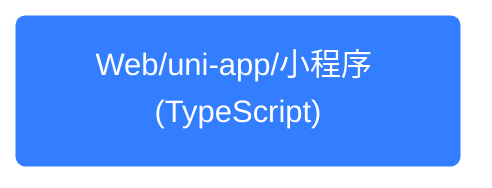
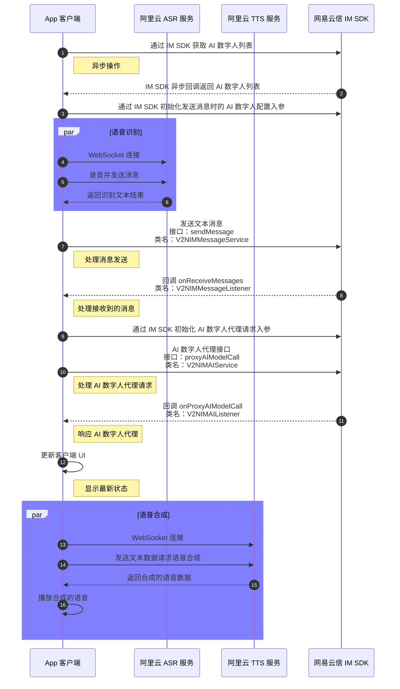

网易云信在即时通讯 IM 中实现了 AI 数字人聊天功能。本文介绍了如何通过 AI 数字人在即时通讯应用中加入语音通话和语音合成功能，使用户沟通更便捷、自然。语音通话传递情感，适用于多种场景，提高沟通效率。语音合成帮助用户获取信息，拓展视障人士和阅读困难适用人群，同时减轻视觉疲劳。

本文采用 [网易云信即时通讯 SDK（NIM SDK）](https://doc.yunxin.163.com/messaging2/concept?platform=client) 实现，内容适用的开发平台或框架如下所示：



## 在线 Demo

您可以前往 [融合通讯 + AI 场景功能体验 App](https://aigc.yunxin.163.com/) 体验相关功能。

## 效果示例

根据本文操作，再结合部分网页开发，预期可实现的效果如下所示：


<!--  -->

## 准备工作

根据本文操作前，请确保您已经完成了以下设置：

1. 基于 NIM SDK 在 App 中引入了 AI 数字人，并能实现收发消息。详细步骤请参考 [基于 IM SDK 实现与 AI 数字人聊天](https://doc.yunxin.163.com/aiagents/guide/DgyNDI0NTk?platform=client)。
2. 获取阿里云 Token。详细步骤请参考阿里云官方文档 [获取 Token](https://help.aliyun.com/zh/isi/getting-started/obtain-an-access-token-1/)。
<!-- 3. 引入 NPM WebSocket 服务。详情请参考 [react-use-websocket](https://www.npmjs.com/package/react-use-websocket)。-->

## 实现流程

客户端整体实现流程如下图所示，本文仅介绍语音识别和语音合成部分，有关其余部分，请参考 [基于 IM SDK 实现与 AI 数字人聊天](https://doc.yunxin.163.com/aiagents/guide/DgyNDI0NTk?platform=client)：



## 语音通话

通过智能语音识别（ASR，Automatic Speech Recognition），您可以在即时通讯 App 中加入语音通话功能，丰富用户的沟通方式，提高沟通效率和用户体验。

### 用户场景

语音通话适用于满足用户在特定场景下不方便打字的场景：

- **商务沟通**：商务人士在出差或参加会议时，可能需要与同事、客户或合作伙伴进行紧急沟通。通过即时通讯 App 的语音通话功能，他们可以随时随地发起通话，及时解决问题，提高工作效率。
- **社交互动**：在社交场合，用户可以通过语音通话与朋友分享生活中的趣事、心情变化或突发事件，增进彼此之间的感情。例如，在朋友聚会时，大家可以通过语音通话分享现场的欢乐氛围，让未能到场的朋友也能感受到聚会的热闹。
- **远程协作**：团队成员分布在不同地区时，语音通话可以作为远程协作的重要工具。在项目讨论、方案制定或问题解决过程中，团队成员可以通过语音通话实时交流想法，提高协作效率，确保项目顺利推进。
- **教育领域**：在线教育平台可以利用语音通话功能实现教师与学生之间的实时互动教学，提高教学效果。
- **医疗领域**：远程医疗问诊中，医生可以通过语音通话与患者进行详细沟通，了解病情。
- **娱乐领域**：在游戏或虚拟现实应用中，语音通话可以让玩家之间进行实时语音交流，增强游戏互动性和沉浸感。

### 第一步：建立连接

通过使用 NIM SDK，您可以借助自己接入的阿里云服务，利用 WebSocket 协议建立连接，实现语音数据的实时传输和语音识别。相关细节请参考阿里云官方文档《实时语音识别》[WebSocket 协议说明](https://help.aliyun.com/zh/isi/developer-reference/websocket?spm=a2c4g.11186623.help-menu-30413.d_3_0_1_8.740746bfZPfgMt)。

```TypeScript
import useWebSocket, { ReadyState } from 'react-use-websocket';
...
const {
  sendMessage: asrSendMessage,
  lastMessage: asrLastMessage,
  readyState: asrReadyState,
  getWebSocket: asrGetWebSocket,
} = useWebSocket(`wss://nls-gateway-cn-shanghai.aliyuncs.com/ws/v1?token=${imCallConfig?.token}&taskId=${taskId}`);
```

### 第二步：开启或关闭录音

开启或关闭录音的整体思路为：

- **开始录音**：获取用户的音频流，创建音频上下文和脚本处理器，将录音数据通过 WebSocket 发送给 ASR 服务进行语音识别。
- **停止录音**：断开音频流和音频上下文的连接，停止录音并关闭 WebSocket 连接，结束语音识别过程。

```TypeScript
// 开始录音
const startRecording = useCallback(async () => {
  if (!asrSendMessage) return;

  audioStreamRef.current = await navigator.mediaDevices.getUserMedia({ audio: true });
  audioContextRef.current = new (window.AudioContext || window.webkitAudioContext)({
    sampleRate: 16000,
  });
  audioInputRef.current = audioContextRef.current.createMediaStreamSource(audioStreamRef.current);

  // 设置缓冲区大小为 2048 的脚本处理器
  scriptProcessorRef.current = audioContextRef.current.createScriptProcessor(2048, 1, 1);

  scriptProcessorRef.current.onaudioprocess = function (event: {
    inputBuffer: { getChannelData: (arg0: number) => any };
  }) {
    const inputData = event.inputBuffer.getChannelData(0);
    const inputData16 = new Int16Array(inputData.length);
    for (let i = 0; i < inputData.length; ++i) {
      inputData16[i] = Math.max(-1, Math.min(1, inputData[i])) * 0x7fff; // PCM 16-bit
    }

    if (
      status === 'listening' &&
      (lastCmdRef.current === 'TranscriptionStarted' ||
        lastCmdRef.current === 'SentenceBegin' ||
        lastCmdRef.current === 'TranscriptionResultChanged')
    ) {
      // 通过 WebSocket 发送录音数据
      asrSendMessage(inputData16);
    }
  };

  audioInputRef.current.connect(scriptProcessorRef.current);
  scriptProcessorRef.current.connect(audioContextRef.current.destination);
}, [asrSendMessage]);

// 停止录音
const stopRecording = useCallback(() => {
  if (scriptProcessorRef.current) {
    scriptProcessorRef.current.disconnect();
  }
  if (audioInputRef.current) {
    audioInputRef.current.disconnect();
  }
  if (audioStreamRef.current) {
    audioStreamRef.current.getTracks().forEach((track: { stop: () => any }) => track.stop());
  }
  if (audioContextRef.current) {
    audioContextRef.current.close();
  }

  // 停止音频播放
  playAudioDestinationRef.current?.stream.getAudioTracks().forEach((track: { stop: () => any }) => track.stop());
  playAudioContextRef.current?.close();
  playAudioDestinationRef.current?.disconnect();

  asrGetWebSocket()?.close();

  setIMCallState('disconnected');
}, [asrGetWebSocket]);
```

### 第三步：处理语音消息

处理语音消息的整体思路为：

- **监听 ASR 消息**：根据接收到的 ASR 消息类型，处理不同的语音识别事件，如识别开始、一句话开始、识别结果变化、一句话结束等。在识别结束时，发送消息并关闭连接。
- **发送语音消息**：将识别出的文本内容通过 AI 数字人或 NIM SDK 发送给对方用户，实现语音通话功能。

```TypeScript
// 监听 ASR 消息
useEffect(() => {
  if (asrLastMessage !== null) {
    const { data } = asrLastMessage;

    if (data) {
      const { header, payload = {} } = JSON.parse(data);

      const { name } = header;
      const { result } = payload;

      if (lastCmdRef.current !== name) {
        lastCmdRef.current = name;
      }

      switch (name) {
        case 'TranscriptionStarted':
          // 识别开始，发送录音文件
          setStatus('listening');
          break;

        case 'SentenceBegin':
          // 一句话开始
          break;

        case 'TranscriptionResultChanged':
          // 识别结果发生变化
          break;

        case 'SentenceEnd':
          if (result) {
            asrSendMessage(
              JSON.stringify({
                header: {
                  appkey: 'Avy05y2vzsHm****',
                  task_id: taskIdRef.current,
                  message_id: generateUuid(),
                  namespace: 'SpeechTranscriber',
                  name: 'StopTranscription',
                },
              }),
            );

            // 发送消息
            handleSendMsg(result);
            setStatus('processing');
          }
          break;

        case 'TranscriptionCompleted':
          // 结束识别, 断开连接
          asrGetWebSocket()?.close();

          break;

        case 'TaskFailed':
          // 识别失败,重新建立连接
          const newTaskId = generateUuid();
          taskIdRef.current = newTaskId;
          setTaskId(newTaskId);
          break;

        default:
          break;
      }
    }
  }
}, [asrLastMessage, handleSendMsg]);
```

## 语音合成

通过智能语音合成（TTS，Text To Speech）功能可以让即时通讯 App 将文本信息转换为语音输出，为用户提供更加丰富和便捷的交互体验。

### 用户场景

语音合成适用于用户需要休息眼睛或在不方便阅读的场景：

- **视障人士**：视障人士在使用即时通讯 App 时，可能无法像普通人一样轻松阅读文字信息。通过语音合成，他们可以听到 App 中的文字内容，如好友或社工发来的消息、群聊中的讨论等，从而无障碍地参与社交互动，获取所需信息。
- **学习辅助**：学生在学习过程中，可以通过语音合成将学习资料、课文或笔记转换为语音，进行听写练习或复习巩固。例如，在学习外语时，学生可以利用语音合成听外语句子的标准发音，提高听力和口语能力。
- **信息获取**：在用户需要快速获取信息但又不方便阅读时，TTS 功能可以发挥作用。如在开车时，用户可以通过语音合成听导航提示、新闻资讯或好友发来的消息，确保在行驶过程中不漏掉重要信息，同时避免因分心阅读而影响驾驶安全。
- **医疗领域**：在患者康复训练中，语音合成可以播放康复指导语音，辅助患者进行康复练习。
- **娱乐领域**：语音合成可以为游戏角色或虚拟主播提供更加生动、个性化的语音表现，提升用户体验。

### 第一步：建立连接

通过使用 NIM SDK，您可以借助自己接入的阿里云服务，同样使用 WebSocket 协议建立连接，用于将文本信息转换为语音输出。相关细节请参考阿里云官方文档《语音合成 CosyVoice 大模型》[WebSocket 协议说明](https://help.aliyun.com/zh/isi/developer-reference/websocket-protocol-description?spm=a2c4g.11186623.help-menu-30413.d_3_1_1_3.41e62e6dU937Gy)。

```TypeScript
// TTS WebSocket
const {
  sendMessage: ttsSendMessage,
  lastMessage: ttsLastMessage,
  readyState: ttsReadyState,
  getWebSocket: ttsGetWebSocket,
} = useWebSocket(
  aiTtsStatusRef?.current && ttsTokenRef?.current && taskIdRef.current && isSynthesisStarted
    ? `wss://nls-gateway-cn-beijing.aliyuncs.com/ws/v1?token=${ttsTokenRef?.current}&taskId=${taskIdRef.current}`
    : null,
);
```

### 第二步：处理消息

处理消息的整体思路为：

- **启动语音合成任务**：WebSocket 连接成功后，发送 `StartSynthesis` 请求，启动语音合成任务。
- **监听 TTS 消息**：根据接收到的 TTS 消息类型，处理不同的语音合成事件，如合成开始、一句话开始、合成结果返回、一句话结束、合成完成等。在收到合成音频数据时，将其添加到队列中。

```TypeScript
// WebSocket 连接成功后，发送 StartSynthesis 请求
useEffect(() => {
  if (ttsConnectionStatus === 'Open') {
    queueRef.current = [];

    ttsSendMessage(
      JSON.stringify({
        header: {
          appkey: 'Avy05y2vzsHm****',
          task_id: taskIdRef.current,
          message_id: generateUuid(),
          namespace: 'FlowingSpeechSynthesizer',
          name: 'StartSynthesis',
        },
        payload: {
          voice: currentVoiceRef.current,
          format: 'MP3',
          sample_rate: 16000, // 采样率
          volume: 100, // 音量
          speech_rate: 0, // 语速
          pitch_rate: 0, // 音调
          enable_subtitle: true, // 是否启用字幕
          platform: 'javascript',
        },
      }),
    );
  }
}, [ttsConnectionStatus]);

// 监听 TTS 消息
useEffect(() => {
  if (ttsLastMessage !== null) {
    const { data } = ttsLastMessage;

    // 处理二进制的音频流
    if (data instanceof Blob) {
      const reader = new FileReader(); // 创建 FileReader 对象读取二进制数据
      reader.onload = () => {
        const arrayBuffer = reader.result; // 获取读取结果（ArrayBuffer）
        queueRef?.current.push(arrayBuffer); // 将数据添加到队列
        processQueue(); // 处理队列中的数据
      };
      reader.readAsArrayBuffer(data); // 读取 Blob 数据为 ArrayBuffer
    } else {
      // 如果收到的是文本消息
      const { header } = JSON.parse(data);

      const { name } = header;

      switch (name) {
        case 'SynthesisStarted':
          // 收到 SynthesisStarted 事件，发送 RunSynthesis 请求
          // 任务开始，发送文本内容
          ttsSendMessage(
            JSON.stringify({
              header: {
                appkey: 'Avy05y2vzsHm****',
                task_id: taskIdRef.current,
                message_id: generateUuid(),
                namespace: 'FlowingSpeechSynthesizer',
                name: 'RunSynthesis',
              },
              payload: {
                text: curPlayingText,
              },
            }),
          );

          // 收到 SentenceEnd 事件时，发送 StopSynthesis 请求
          setTimeout(() => {
            ttsSendMessage(
              JSON.stringify({
                header: {
                  appkey: 'Avy05y2vzsHm****',
                  task_id: taskIdRef.current,
                  message_id: generateUuid(),
                  namespace: 'FlowingSpeechSynthesizer',
                  name: 'StopSynthesis',
                },
              }),
            );
          }, 1000);

          break;

        case 'SentenceBegin':
          // SentenceBegin 事件表示服务端检测到了一句话的开始。

          break;

        case 'SentenceSynthesis':
          // SentenceSynthesis 事件表示有新的合成结果返回，包含最新的音频和时间戳，句内全量，句间增量。

          break;

        case 'SentenceEnd':
          break;

        case 'SynthesisCompleted':
          // SynthesisCompleted 事件表示服务端已停止了语音合成并且所有音频数据下发完毕。
          break;

        case 'TaskFailed':
          break;
        default:
          break;
      }
    }
  }
}, [curPlayingText, ttsLastMessage, handleSendMsg]);
```

### 第三步：播放音频

播放音频整体思路为：

- 结束前一个音频流，创建一个新的 `MediaSource` 对象，并设置播放器的源为该对象。
- 监听 `MediaSource` 的 `sourceopen` 事件，创建 `SourceBuffer` 对象以处理音频数据。
- 监听 `SourceBuffer` 的 `updateend` 事件，从队列中取出音频数据并添加到 `SourceBuffer` 中，播放合成的音频。

```TypeScript
  const player = document.getElementById('player') as HTMLAudioElement; // 获取播放器元素

  // 处理音频流队列
  const processQueue = useCallback(() => {
    if (queueRef.current.length > 0 && sourceBufferRef.current && !sourceBufferRef.current.updating) {
      // 确保队列中有数据且 SourceBuffer 未在更新中
      sourceBufferRef.current.appendBuffer(queueRef.current.shift()); // 从队列中取出数据并添加到 SourceBuffer
    }
  }, []);

  // ① 结束前一个音频流
  mediaSourceRef.current?.endOfStream();

  queueRef.current = [];

  // ② 创建一个新的 MediaSource 对象
  mediaSourceRef.current = new MediaSource(); // 创建 MediaSource 实例
  player.src = URL.createObjectURL(mediaSourceRef.current); // 设置播放器的源为 MediaSource 对象

  // 监听 MediaSource 的 sourceopen 事件
  mediaSourceRef.current.addEventListener('sourceopen', () => {
    sourceBufferRef.current = mediaSourceRef.current.addSourceBuffer('audio/mpeg'); // 创建 SourceBuffer 对象以处理音频数据
    // 监听 SourceBuffer 的 updateend 事件，处理队列中的数据
    sourceBufferRef.current.addEventListener('updateend', processQueue);

    player.play(); // 播放音频
  });
```