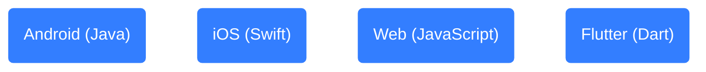
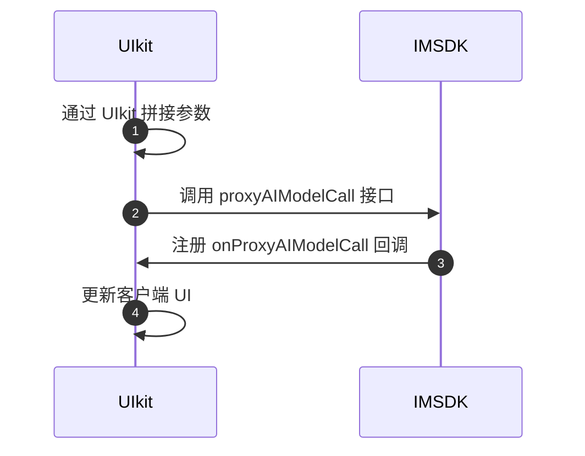

网易云信即时通讯 IM 数字人，通过集成 AI 翻译能力，使得开发者能够通过简单的客户端开发，轻松地在应用中实现多国语言的实时翻译功能。本文介绍如何该功能的效果展示以及实现方式。

本文采用 [网易云信即时通讯 UIKit（NIM UIKit）](https://doc.yunxin.163.com/messaging-uikit/concept?platform=client) 实现，内容适用的开发平台或框架如下所示：

<!-- <div class="platform-tabs"><div class="platform-tab"><span>Android (Java)</span></div> <div class="platform-tab"><span>iOS (Swift)</span></div> <div class="platform-tab"><span>Web (TypeScript)</span></div> </div> -->



## 功能介绍

AI 翻译技术，作为一种热门的语言处理方法，核心在于将原始文本（源文本）与其目标语言文本输入到高度复杂的机器学习模型中，模型经过大量双语或多语文本数据训练而成。

服务端模型负责解析并理解源文本的语义和上下文，然后生成相应的目标语言文本，实现跨语言的精准传达。通过在即时通讯应用中嵌入多国语言翻译，能够打破聊天时的语言障碍，促进全球化交流，也为企业的国际化运营和贸易提供了强有力的技术支撑。

## 效果展示

按照语言翻译的翻译界面以及语种选择的两种常见场景，预期可实现的效果如下所示：

<style>
.container {
  display: flex;
  justify-content: space-between;
}

.column {
  flex: 1;
  margin: 5px;
  text-align: center;
}

.column img {
  width: 100%;
  height: auto;
}
</style>

<div class="container">
  <div class="column">
    <figure>   <figcaption style="width: 100%; text-align: center; caption-side: top;"><b>翻译功能效果展示</b></figcaption>    </figure>
  </div>
  <div class="column">
    <figure>   <figcaption style="width: 100%; text-align: center; caption-side: top;"><b>语言选择效果展示</b></figcaption>    </figure>
  </div>
</div>

<!-- 翻译功能


语言选择

 -->

<a id="config"></a>

## 数字人配置

通过向 `AIUserManager` 中设置代理 `Provider`，指定实现划词搜索功能的 AI 数字人，并指定翻译的目标语言：

:::::: div linked-codes
::: code Android
```Java
//设置功能数字人信息

AIUserManager.setProvider(
      new AIUserAgentProvider() {

         // 指定翻译机器人支持的翻译语言，可为空(使用 IMUKIT 默认支持的语言)
        @NonNull
        @Override
        public List<String> getAiTranslateLanguages(@NonNull List<? extends V2NIMAIUser> users) {
            List<String> languageList = new ArrayList<>();
            languageList.add("英语");
            languageList.add("日语");
            languageList.add("韩语");
            languageList.add("俄语");
            return languageList;
        }

        // 指定翻译使用的 AI 机器人，如果为空，则该功能不可用
        @Override
        public V2NIMAIUser getAiTranslateUser(@NonNull List<? extends V2NIMAIUser> users) {
          for (V2NIMAIUser user : users) {
            if (AI_TRANSLATION_USER_ACCOUNT.equals(user.getAccountId())) {
              return user;
            }
          }
          return null;
        }

        // 指定 AI 划词机器人，如果为空，则该功能不可用
        @Override
        public V2NIMAIUser getAiSearchUser(@NonNull List<? extends V2NIMAIUser> users) {
          for (V2NIMAIUser user : users) {
            if (AI_SEARCH_USER_ACCOUNT.equals(user.getAccountId())) {
              return user;
            }
          }
          return null;
        }
      });
}
```
:::
::: code iOS
```Swift
// 实现 AIUserAgentProvider 协议方法
extension AppDelegate: AIUserAgentProvider {
    // 指定 AI 划词搜索机器人，如果为空，则该功能不可用
    public func getAISearchUser(_ users: [V2NIMAIUser]) -> V2NIMAIUser? {
        for user in users {
            if user.accountId == "划词搜索机器人 account id" {
                return user
            }
        }
        return nil
    }

    // 指定翻译使用的 AI 机器人，如果为空，则该功能不可用
    public func getAITranslateUser(_ users: [V2NIMAIUser]) -> V2NIMAIUser? {
      for user in users {
        if user.accountId == "翻译机器人 account id" {
          return user
        }
      }
      return nil
    }

    // 指定翻译机器人支持的翻译语言，可为空(使用 IMUKIT 默认支持的语言)
    public func getAITranslateLangs(_ users: [V2NIMAIUser]) -> [String] {
      ["英语", "日语", "韩语", "俄语"]
    }
}
```
:::
::: code Web
```TypeScript
import React from 'react'
import { Provider } from '@xkit-yx/im-kit-ui'

const localOptions = {
      // ...
      // AI 功能是否开启
      aiVisible: true,
      // AI 提供者
      aiProvider: {
        /**
         * 指定 AI 翻译数字人
         */
          getAITranslateUser?(user: V2NIMAIUser[]): V2NIMAIUser | void {
              // demo 根据 accid 匹配，具体值根据业务后台配置的来
              return users.find((item) => item.accountId === '')
          }

        /**
         * 指定 AI 翻译语言
         */
        getAITranslateLangs?(user: V2NIMAIUser[]): string[] {
            return ["英语", "日语", "韩语", "俄语"]
        }
      },
}

const App = () => {
    const props = {...}

    return <Provider {...props} localOptions />
}
```
:::
::: code Flutter
```Dart
AIUserManager.instance.init();

// 指定翻译使用的 AI 机器人，如果为空，则该功能不可用
AIUserManager.instance.aiTranslateUserProvider = (List<NIMAIUser> users) {
  for (var user in users) {
    if (user.accountId == AI_TRANSLATION_USER_ACCOUNT) {
      return user;
    }
  }
  return null;
};

// 指定翻译机器人支持的翻译语言，可为空(使用 IMUKIT 默认支持的语言)
AIUserManager.instance.aiTranslateLanguagesProvider =
    (List<NIMAIUser> users) {
  return ["英语", "日语", "韩语", "俄语", "法语", "德语"];
};
```
<!--
// 指定 AI 划词机器人，如果为空，则该功能不可用
AIUserManager.instance.aiSearchUserProvider = (List<NIMAIUser> users) {
  for (var user in users) {
    if (user.accountId == AI_SEARCH_USER_ACCOUNT) {
      return user;
    }
  }
  return null;
};
-->
:::
::::::

完成以上步骤即可在 IM UIKit 中使用 AI 翻译功能。

## 实现流程

客户端整体实现流程如下图所示：



### 一：通过 UIkit 拼接参数

拼接参数时，将用户划词选中的内容作为 `text`。如果是设置待翻译的目标语言列表，则在 [数字人配置](#config) 时设置为 `language`，用户选择后传入即可。

:::::: div linked-codes
::: code Android
```Java
// 翻译的目标语言
String language = "英语" ;
String text = "我是要翻译的内容" ;
//创建请求对象
V2NIMProxyAIModelCallParams.Builder builder = new V2NIMProxyAIModelCallParams.Builder();
// 设置翻译机器人 ID
builder.accountId(aiTranslateUser.getAccountId());
// 生成随机 UUID 作为 requestIDUUID uuid = UUID.randomUUID();
String requestId = uuid.toString();
builder.requestId(requestId);
// 设置翻译内容
V2NIMAIModelCallContent content = new V2NIMAIModelCallContent(text, 0);
builder.content(content);
// 设置翻译模板语言，以 JSON 形式传递，其中 JSON 的 KEY 值为"Language"固定
try {
  JSONObject variables = new JSONObject();
  variables.put("Language", language);
  String varStr = variables.toString();
  builder.promptVariables(varStr);
  ALog.d(TAG, "start translate:" + varStr + ",content:" + text);
} catch (Exception e) {
  ALog.e(TAG, "translate error, promptVariables error");
}
```
:::
::: code iOS
```Swift
// 接口请求对象
let request = V2NIMProxyAIModelCallParams()

// 生成随机 UUID 作为 requestID
let requestId = UUID().uuidString

// msg 代表请求内容
let content = V2NIMAIModelCallContent()
content.msg = "待翻译内容"
content.type = .NIM_AI_MODEL_CONTENT_TYPE_TEXT

// 获取 AI 大模型配置, temperature: 控制随机性和多样性的程度
let configParams = V2NIMAIModelConfigParams()
configParams.temperature = 0.2
request.modelConfigParams = configParams

// 设置对应的数字人
request.accountId = "数字人 account id"

// 设置翻译模板语言，以 JSON 形式传递，其中 JSON 的 KEY 值为"Language"固定
let promptVariables = ["Language": "英语"]

// 将 promptVariables 序列化为 json string 赋值给 request 对象参数
request.promptVariables = "promptVariables json string"
```
:::
::: code Web
```TypeScript
/**
   * 发送 AI 代理请求
   * @params requestId 请求 ID，用于区分不同的请求，传就表示新的请求，不传表示继续上次的请求
   */
  async sendAIProxyActive(
    params: Omit<V2NIMProxyAIModelCallParams, 'requestId'> & {
      requestId?: string
      onSendAIProxyErrorHandler?: (errorCode: number) => void
    }
  ): Promise<void> {
    try {
      logger.log('sendAIProxyActive', params)

      const finalParams = { ...params }

      // 表示新的请求，重置 requestId、aiResMsgs、proxyAccountId
      if (params.requestId) {
        this.resetAIProxy()
        this.requestId = params.requestId
        this.proxyAccountId = params.accountId
      } else {
        finalParams.requestId = this.requestId
      }

      if (params.onSendAIProxyErrorHandler) {
        this.onSendAIProxyErrorHandler = params.onSendAIProxyErrorHandler
      }

      await this.nim.V2NIMAIService.proxyAIModelCall(
        finalParams as V2NIMProxyAIModelCallParams
      )

      this.aiReqMsgs.push(params.content)
      logger.log('sendAIProxyActive success:', params)
    } catch (error) {
      logger.error(
        'sendAIProxyActive failed:',
        (error as V2NIMError).toString()
      )
      this.onSendAIProxyErrorHandler((error as V2NIMError).code)
      throw error
    }
  }
```
:::
::: code Flutter
```Dart
// 接口请求对象
NIMProxyAIModelCallParams request = NIMProxyAIModelCallParams();
// 设置对应的数字人
request.accountId = AIUserManager.instance.getAITranslateUser()?.accountId;

// 生成随机 UUID 作为 requestID
request.requestId = translationLanguageRequestId;

NIMAIModelCallContent content = NIMAIModelCallContent(type: 0);
content.msg = "待翻译内容";
request.content = content;

// 获取 AI 大模型配置, temperature: 控制随机性和多样性的程度
NIMAIModelConfigParams configParams = NIMAIModelConfigParams();
configParams.temperature = 0.2;
request.modelConfigParams = configParams;

// 设置翻译模板语言，以 JSON 形式传递，其中 JSON 的 KEY 值为"Language"固定
String promptKey = "Language";
final Map<String, dynamic> promptVariables = {};
// language 翻译的目标语言
promptVariables[promptKey] = language;
request.promptVariables = jsonEncode(promptVariables);
```
:::
::::::

### 二：调用 proxyAIModelCall 接口

基于拼接的参数，再调用《即时通讯 IM》[proxyAIModelCall](https://doc.yunxin.163.com/messaging2/client-apis/TA0NjQ0ODE?platform=client#proxyaimodelcall) 接口，向 LLM（Large Language Models）发起模型调用 AI 翻译请求。

:::::: div linked-codes
::: code Android
```Java
AIRepo.proxyAIModelCall(
    builder.build(),
    new FetchCallback<Void>() {
      @Override
      public void onError(int errorCode, @Nullable String errorMsg) {
        ALog.e(TAG,"ai translate error, errorCode: " + errorCode);
        // 通知页面刷新 UI，不展示 loading 状态
      }

      @Override
      public void onSuccess(@Nullable Void data) {
        ALog.d(LIB_TAG, TAG, "aiSearch success");
        // 不需要处理，在监听中会收到 AI 处理结果，此处不需要逻辑处理
      }
    });
```
:::
::: code iOS
```Swift
AIRepo.shared.proxyAIModelCall(request) { [weak self] error in
    if let err = error {
      print("proxyAIModelCall error: \(err.localizedDescription)")
      completion(err)
    } else {

    }
}
```
:::
::: code Web
```TypeScript
nim.V2NIMAIService.proxyAIModelCall(
    params as V2NIMProxyAIModelCallParams
)
```
:::
::: code Flutter
```Dart
NimCore.instance.aiService.proxyAIModelCall(request);
```
:::
::::::

### 三：注册 onProxyAIModelCall 监听

针对 proxyAIModelCall 接口的返回信息，您可以注册《即时通讯 IM》[`onProxyAIModelCall`](https://doc.yunxin.163.com/messaging2/client-apis/TA0NjQ0ODE?platform=client#addAIListener) 监听，接口服务端下发的响应内容。

:::::: div linked-codes
::: code Android
```Java
private V2NIMAIListener aiListener =
    new V2NIMAIListener() {
      @Override
      public void onProxyAIModelCall(V2NIMAIModelCallResult result) {
          // 更加账号 ID 判断是否为翻译机器人执行的结果
        if (result != null && aiTranslateUser != null
        && TextUtils.equals(result.getAccountId(), aiTranslateUser.getAccountId())) {
            // 根据返回码判断是否为成功
          if (result.getCode() == 200) {
              // 支持成功返回翻译结果
              String translateResult = result.getContent().getMsg();
          } else {
            // 服务错误，可根据错误码进行相关处理
          }
        }
      }
    };
    // 注册 AI 结果监听，在调用接口之前注册，一次注册多次使用
    AIRepo.addAIListener(aiListener);
    // 移除注册的 listener，在不使用的时候移除
    AIRepo.removeAIListener(aiListener);
```
:::
::: code iOS
```Swift
// 添加监听
AIRepo.shared.addAIListener(self)
// 移除监听
AIRepo.shared.removeAIListener(self)

// Al 数字人监听
extension YourClass: V2NIMAIListener {
  open func onProxyAIModelCall(_ data: V2NIMAIModelCallResult) {
    // 根据返回码判断是否为成功
    if data.code == 200 {
      // 根据 requestId 判断是否为当前请求结果
      if data.requestId == "request" {
        // 翻译结果
        let msg = data.content.msg
      }
    }
  }
}
```
:::
::: code Web
```TypeScript
nim.V2NIMAIService.on('onProxyAIModelCall', () => {
    this.aiResMsgs.push(res.content.msg)
})
```
:::
::: code Flutter
```Dart
subscriptions
    .add(NimCore.instance.aiService.onProxyAIModelCall.listen((event) {
  // 根据返回码判断是否为成功
  if (event.code == 200) {
    // 根据 requestId 判断是否为当前请求结果
    if (event.requestId == "requestId") {
      String? result = event.content?.msg;
      if (result != null) {
        // result 为翻译结果
      }
    }
  }
}));
```
:::
::::::


<style>
    .platform-tabs {
        display: flex;
        justify-content: center;
        align-items: left;
        gap: 14px; /* 间距 */
        margin-top: 20px;
        justify-content: flex-start;：子元素靠左对齐。
        // flex-wrap: wrap; /* 允许标签在必要时换行 */
    }

    .platform-tab {
        display: flex;
        align-items: center;
        padding: 8px 16px; /* 调整内边距 */
        height: 38px; /* 设置固定高度 */
        border: 1px solid #ccc;
        border-radius: 5px;
        box-shadow: 0 4px 8px rgba(0, 0, 0, 0.1);
        background-color: #0000;
        font-family: 'Inter', sans-serif;
        font-size: 14px; /* 调整字体大小 */
        cursor: pointer;
        transition: all 0.3s ease;
        white-space: nowrap; /* 防止文字换行 */
    }

    .platform-tab:hover {
        box-shadow: 0 6px 12px rgba(0, 0, 0, 0.2);
        transform: translateY(-2px);
    }

    .platform-tab img {
        width: 24px;
        height: 24px;
        margin-right: 8px;
    }

    .platform-tab span {
        margin-left: 5px;
        margin-right: 5px;
    }
</style>