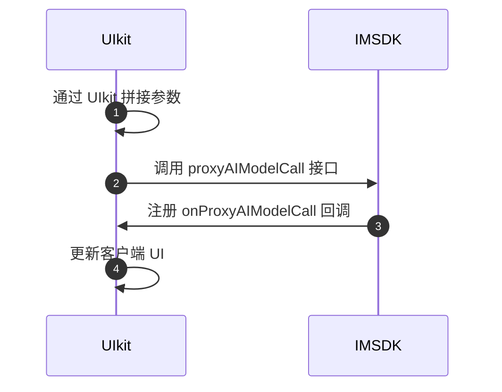

网易云信即时通讯 IM 数字人功能支持在聊天对话界面上选定特定的文本片段，然后基于选定的内容执行搜索和查询操作。用户可以在不离开聊天界面的情况下，快速获取与对话内容相关的信息，增强了 IM 应用的功能性和互动性。本文介绍如何该功能的相关设计、效果以及实现方式。

本文采用 [网易云信即时通讯 UIKit（NIM UIKit）](https://doc.yunxin.163.com/messaging-uikit/concept?platform=client) 实现，内容适用的开发平台或框架如下所示：

<!-- <div class="platform-tabs"><div class="platform-tab"><span>Android (Java)</span></div> <div class="platform-tab"><span>iOS (Swift)</span></div> <div class="platform-tab"><span>Web (TypeScript)</span></div> </div> -->


## 功能介绍

AI 数字人被整合到即时通讯（IM）应用中，与网易云信大语言模型（LLMs）进行深度集成，可快捷实现划词搜索功能等功能。具体实现步骤推进如下：

1. UI 层设计：在 UI 层实现文本选择功能。当用户在聊天界面或其他文本区域划选文字时，系统应识别到用户的选择动作，并高亮显示选定的文本。
2. 事件监听与处理：一旦检测到用户完成了文本选择，触发一个事件处理器。该处理器负责收集选定的文本内容，并准备发送请求给网易云信服务器。
3. 请求构建与发送：事件处理器构建一个包含选定文本的客户端请求，发送给 LLMs。
4. 调用大语言模型：后端服务器接收到请求后，将使用大语言模型对选定的文本进行分析和理解，以生成相关的搜索结果或回复。
5. 响应处理与展示：后端服务器处理请求后，返回包含搜索结果的响应。前端应用程序接收此响应，并将其呈现给用户，您可以实现以弹窗、悬浮窗口或在原聊天界面下方的形式展示。

## 效果展示

按照划词搜索的开始划词和追加订正信息的两种常见场景，预期可实现的效果如下所示：

<style>
.container {
  display: flex;
  justify-content: space-between;
}

.column {
  flex: 1;
  margin: 5px;
  text-align: center;
}

.column img {
  width: 100%;
  height: auto;
}
</style>

<div class="container">
  <div class="column">
    <figure>   <figcaption style="width: 100%; text-align: center; caption-side: top;"><b>划词搜索效果展示</b></figcaption>    </figure>
  </div>
  <div class="column">
    <figure>   <figcaption style="width: 100%; text-align: center; caption-side: top;"><b>追加信息效果展示</b></figcaption>   <!--   --> </figure>
  </div>
</div>

## 基于 IM UIKit 接入

移动端接入需要依赖划词搜索插件：

:::::: div linked-codes
::: code Android
```Java
implementation(project(":imkit:aisearchkit"))
```
:::
::: code iOS
```Cocoapods
pod 'NEAISearchKit'
```
:::
::: code Web
```TypeScript
暂无
```
:::
::::::

## 数字人配置

通过向 `AIUserManager` 中设置代理 `Provider`，指定实现划词搜索功能的 AI 数字人：

:::::: div linked-codes
::: code Android
```Java
//设置功能数字人信息
AIUserManager.setProvider(
    new AIUserAgentProvider() {
        //...
      @Override
       public V2NIMAIUser getAiSearchUser(@NonNull List<? extends V2NIMAIUser> users) {
        //todo 返回具体实现划词搜索功能的机器人
      }
    });
```
:::
::: code iOS
```Swift
// 实现 AIUserAgentProvider 协议方法
extension AppDelegate: AIUserAgentProvider {
    public func getAISearchUser(_ users: [V2NIMAIUser]) -> V2NIMAIUser? {
      //todo 返回具体实现划词搜索功能的机器人
    }
    //...
}
```
:::
::: code Web
```TypeScript
import React from 'react'
import { Provider } from '@xkit-yx/im-kit-ui'

const localOptions = {
      // ...
      // AI 功能是否开启
      aiVisible: true,
      // AI 提供者
      aiProvider: {
        /**
         * 注册 AI 划词数字人
         */
        setAISearchUser: (users: V2NIMAIUser[]): V2NIMAIUser | void => {
          // demo 根据 accid 匹配，具体值根据业务后台配置的来
          return users.find((item) => item.accountId === '')
        },
      },
}

const App = () => {
    const props = {...}

    return <Provider {...props} localOptions />
}
```
:::
::::::

完成以上步骤即可在 IM UIKit 中使用 AI 划词搜索功能。

## 实现流程

客户端整体实现流程如下图所示：



### 一：通过 UIkit 拼接参数

拼接参数时，将用户划词选中的内容作为 `content`。如果是追加补充信息，则将之前的划词选中内容和补充内容作为上下文传入。

:::::: div linked-codes
::: code Android
```Java
V2NIMProxyAIModelCallParams.Builder builder = new V2NIMProxyAIModelCallParams.Builder();
//设置划词搜索数字人 accid
builder.accountId(aiUser.getAccountId());
// 生成随机 UUID 作为 requestIDUUID uuid = UUID.randomUUID();
String requestId = uuid.toString();
builder.requestId(requestId);
//keyword 代表请求内容，首次为划词选中的内容，之后为补充的内容
V2NIMAIModelCallContent content = new V2NIMAIModelCallContent(keyword, 0);
builder.content(content);
//上下文，每次请求成功后记录上下文，下次补充请求使用
if (!messages.isEmpty()) {
  builder.messages(messages);
}
```
:::
::: code iOS
```Swift
// 生成随机 UUID 作为 requestID
let requestId = UUID().uuidString

// msg 代表请求内容，首次为划词选中的内容，之后为补充的内容
let content = V2NIMAIModelCallContent()
content.msg = msg
content.type = .NIM_AI_MODEL_CONTENT_TYPE_TEXT

/// 获取 AI 大模型配置, temperature: 控制随机性和多样性的程度
let aiConfig = V2NIMAIModelConfigParams()
aiConfig.temperature = 0.8

//上下文，每次请求成功后记录上下文，下次补充请求使用
var aiMessages = [V2NIMAIModelCallMessage]()
for (i, text) in searchTexts.enumerated() {
  NEALog.infoLog(ModuleName + " " + className(), desc: #function + "[AISearch], message text\(i + 1): \(String(describing: text))")
  let message = V2NIMAIModelCallMessage()
  message.msg = text
  message.role = .NIM_AI_MODEL_ROLE_TYPE_USER
  message.type = .NIM_AI_MODEL_CONTENT_TYPE_TEXT
  aiMessages.append(message)
}

// Al 数字人请求参数
let params = V2NIMProxyAIModelCallParams()
params.accountId = accid    // 划词数字人 accountId
params.requestId = requestId
params.content = content
params.modelConfigParams = aiConfig
params.messages = aiMessages
```
:::
::: code Web
```TypeScript
/**
   * 发送 AI 代理请求
   * @params requestId 请求 ID，用于区分不同的请求，传就表示新的请求，不传表示继续上次的请求
   */
  async sendAIProxyActive(
    params: Omit<V2NIMProxyAIModelCallParams, 'requestId'> & {
      requestId?: string
      onSendAIProxyErrorHandler?: (errorCode: number) => void
    }
  ): Promise<void> {
    try {
      logger.log('sendAIProxyActive', params)

      const finalParams = { ...params }

      // 表示新的请求，重置 requestId、aiResMsgs、proxyAccountId
      if (params.requestId) {
        this.resetAIProxy()
        this.requestId = params.requestId
        this.proxyAccountId = params.accountId
      } else {
        finalParams.requestId = this.requestId
      }

      if (params.onSendAIProxyErrorHandler) {
        this.onSendAIProxyErrorHandler = params.onSendAIProxyErrorHandler
      }

      await this.nim.V2NIMAIService.proxyAIModelCall(
        finalParams as V2NIMProxyAIModelCallParams
      )

      this.aiReqMsgs.push(params.content)
      logger.log('sendAIProxyActive success:', params)
    } catch (error) {
      logger.error(
        'sendAIProxyActive failed:',
        (error as V2NIMError).toString()
      )
      this.onSendAIProxyErrorHandler((error as V2NIMError).code)
      throw error
    }
  }
```
:::
::::::

### 二：调用 proxyAIModelCall 接口

基于拼接的参数，再调用《即时通讯 IM》[proxyAIModelCall](https://doc.yunxin.163.com/messaging2/client-apis/TA0NjQ0ODE?platform=client#proxyaimodelcall) 接口，向 LLM（Large Language Models）发起模型调用划词搜索请求。

:::::: div linked-codes
::: code Android
```Java
AIRepo.proxyAIModelCall(
    builder.build(),
    new FetchCallback<Void>() {
      @Override
      public void onError(int errorCode, @Nullable String errorMsg) {
        //..
      }

      @Override
       public void onSuccess(@Nullable Void data) {

        //发送成之后，将关键字添加到上下文
        V2NIMAIModelCallMessage message =
            new V2NIMAIModelCallMessage(
                V2NIMAIModelRoleType.V2NIM_AI_MODEL_ROLE_TYPE_USER, keyword, 0);
        messages.add(0, message);
      }
    });
```
:::
::: code iOS
```Swift
AIRepo.shared.proxyAIModelCall(params) { [weak self] error in
    if let err = error {
      print("proxyAIModelCall error: \(err.localizedDescription)")
      completion(err)
    } else {
      //发送成之后，将关键字添加到上下文
    }
}
```
:::
::: code Web
```TypeScript
nim.V2NIMAIService.proxyAIModelCall(
    params as V2NIMProxyAIModelCallParams
)
```
:::
::::::

### 三：注册 onProxyAIModelCall 监听

针对 proxyAIModelCall 接口的返回信息，您可以注册《即时通讯 IM》[`onProxyAIModelCall`](https://doc.yunxin.163.com/messaging2/client-apis/TA0NjQ0ODE?platform=client#addAIListener) 监听，接口服务端下发的响应内容。

:::::: div linked-codes
::: code Android
```Java
//定义监听
private final V2NIMAIListener aiListener =
    new V2NIMAIListener() {
      @Override
      public void onProxyAIModelCall(V2NIMAIModelCallResult result) {
        //刷新 UI
      }
    };
    //添加监听
    AIRepo.addAIListener(aiListener);
```
:::
::: code iOS
```Swift
// Al 数字人监听
@protocol V2NIMAIListener <NSObject>

/**
 * AI 透传接口的响应的回调
 * 接口调用完毕后, 接下来服务器响应以通知的形式下发, 端测需要触发回调提供
 * @param data 响应内容
 */
- (void)onProxyAIModelCall:(V2NIMAIModelCallResult *)data;

@end

// 添加监听
AIRepo.shared.addAIListener(aiListener)
```
:::
::: code Web
```TypeScript
nim.V2NIMAIService.on('onProxyAIModelCall', () => {
    this.aiResMsgs.push(res.content.msg)
})
```
:::
::::::


<style>
    .platform-tabs {
        display: flex;
        justify-content: center;
        align-items: left;
        gap: 14px; /* 间距 */
        margin-top: 20px;
        justify-content: flex-start;：子元素靠左对齐。
        // flex-wrap: wrap; /* 允许标签在必要时换行 */
    }

    .platform-tab {
        display: flex;
        align-items: center;
        padding: 8px 16px; /* 调整内边距 */
        height: 38px; /* 设置固定高度 */
        border: 1px solid #ccc;
        border-radius: 5px;
        box-shadow: 0 4px 8px rgba(0, 0, 0, 0.1);
        background-color: #0000;
        font-family: 'Inter', sans-serif;
        font-size: 14px; /* 调整字体大小 */
        cursor: pointer;
        transition: all 0.3s ease;
        white-space: nowrap; /* 防止文字换行 */
    }

    .platform-tab:hover {
        box-shadow: 0 6px 12px rgba(0, 0, 0, 0.2);
        transform: translateY(-2px);
    }

    .platform-tab img {
        width: 24px;
        height: 24px;
        margin-right: 8px;
    }

    .platform-tab span {
        margin-left: 5px;
        margin-right: 5px;
    }
</style>