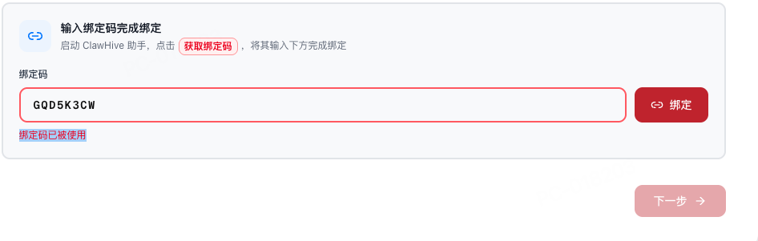
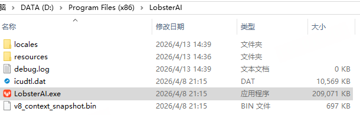
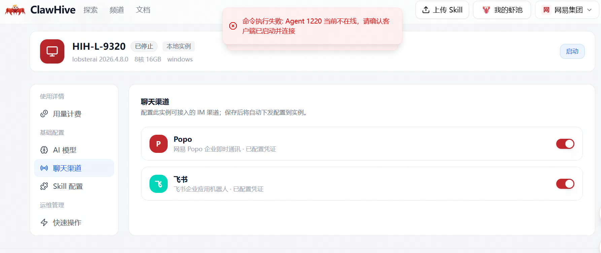
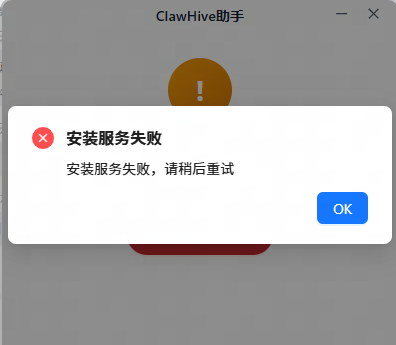
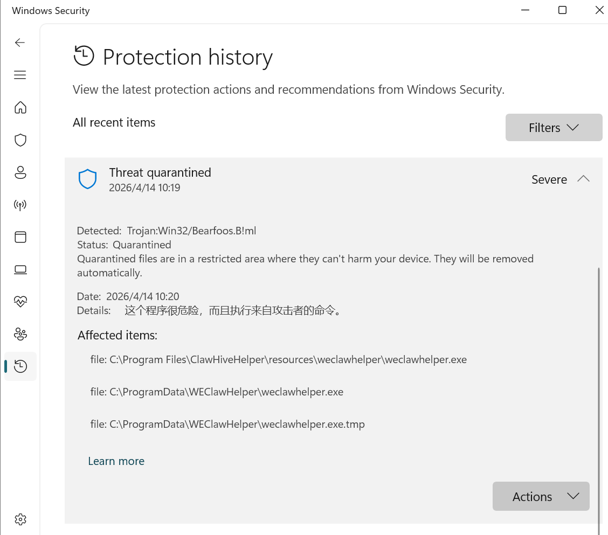
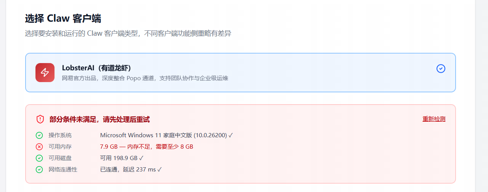
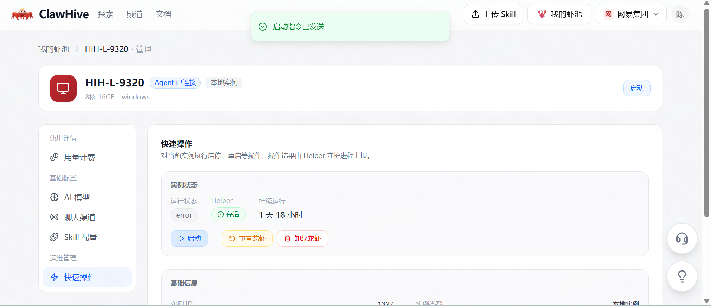
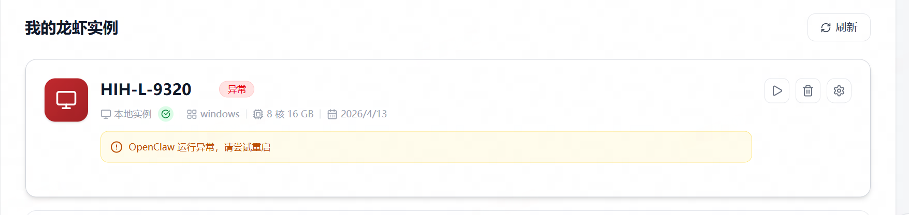
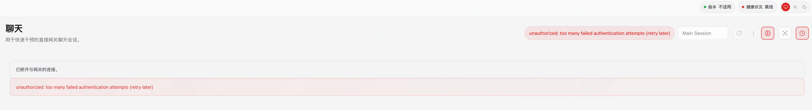

1.没有审核通过的提示，直接就把邮件发到邮箱了。

审核通过后，您将收到激活邮件

激活邮件将发送至**939751535@qq.com**

请点击邮件中的链接完成账号激活并设置登录密码

2.密码要求要同时满足4项有点变态，建议满足两项。

至少 8 位、包含大小写字母、包含数字、包含特殊字符

4.在网站上卸载，把我本地openClaw卸载了，没有卸载蟹蟹。

5.绑定本地设备的时候提示：绑定码已被使用（我已经在另一个账号上把设备删除了），并且切换到另一个账号也是提示同样的错误。

解法：mac删除\~/.weclawhelper，windows把C:\\ProgramData\\WEClawHelper这个删除，重新打开助手会重新生成

6.windows电脑默认使用有道龙虾，安装的时候会默认先卸载本地的有道龙虾再安装，本地已有的skill和使用记录都会被清理。如果有道龙虾不是安装在C盘，还会出现帝王蟹一直卸载有道龙虾，但是没有正常安装有道龙虾的情况。

7\. windows电脑装好龙虾后，再次打开，遇到报错

原因查到是电脑安全软件拦截，卸载了应用。解法，找到安全中心，恢复下

8\. 安装环境硬件不满足

配置限制 暂未放开支持

9\. 帝王蟹状态异常，重新下发启动指令无效

日志中有错误打印

level=error msg=\"update-host-info: agentserver rejected:
{\\\"code\\\":400,\\\"message\\\":\\\"Timestamp after current
time.\\\"}\" agentID=1220 status=400

原因是
本地时间和服务端时间有个校验，现在服务端是严格校验，差1s就会校验不通过

10\. clawHive 安装后运行打开没反应，任务进程中短暂运行后闪退

解法,gpu显卡兼容问题，可以让客户用测试的包看看，测试包解决了显卡兼容问题，
后面会发版解决。

安装包过大 单独提供在popo群

11\. 帝王蟹安装没有报错，但是也没有任何反应

terminal中使用 openclaw dashboard查看gateway状态

解法： launchctl list \| grep -i
openclaw检查本地是否有其他类龙虾产品出现端口冲突和进程竞争，如果有，先关闭，再重装帝王蟹

12.下发技能之后，本地找不到对应的技能
