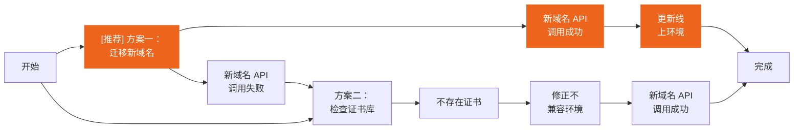

尊敬的网易云信客户：

为了向您提供更好的服务和体验，网易云信已于 **2025 年 05 月 21 日** 进行了 `*.netease.im` 证书的升级运维操作，完成从 **DigiCert Global Root CA** 到 **DigiCert Global Root G2** 的 SSL 证书根证书系统强制升级。为保障您正常使用，请在北京时间 **2025 年 05 月 20 日** 之前完成兼容性适配。

## 升级概要

| 信息类别 | 详情 |
| ---- | ---- |
| **当前状态** | DigiCert Global Root CA |
| **目标状态** | DigiCert Global Root G2 |
| **升级性质** | 强制性安全升级。 |
| **影响范围** | 此次升级影响所有使用 `*.netease.im` 相关域名与网易云信服务交互的系统，包括 **即时通讯 IM**、**音视频通话 RTC**、**短信**、**房间组件**、**指南针（含数据统计）**、以及所有通过 HTTPS 协议连接网易云信服务的系统。 |
| **关键影响** | 如未在 **2025 年 05 月 20 日** 前完成升级，旧证书完全失效，未升级系统将无法连接。所有依赖网易云信服务的系统将无法建立安全连接，API 调用返回证书错误，导致服务完全中断。 |
| **时间节点** | <ul><li><b>2025 年 03 月 26 日</b>：开始公告升级操作</li><li><b>2025 年 05 月 20 日</b>：完成所有生产环境兼容性适配的最终 **截止** 日期</li><li><b>2025 年 05 月 21 日</b>：网易云信进行升级运维操作</li><li><b>2025 年 05 月 21 日以后</b>：如出现系统无法连接网易云信服务，请 [提交工单](https://app.yunxin.163.com/global/service/ticket/create) 联系网易云信技术支持工程师</li></ul> |

## 升级原因

此次升级，由以下三个关键因素引起：

- **Mozilla 根证书信任政策变更**：Mozilla 浏览器将于 2026 年 4 月 15 日停止信任 DigiCert Global Root CA 根证书。
- **DigiCert 官方决策**：受 Mozilla 根证书信任策略变更影响，DigiCert 将全面停用旧根体系颁发的 TLS/SSL 证书，升级为 Digicert Global Root G2。
- **行业安全标准**：这是全行业范围内的强制性安全合规要求。Digicert Global Root G2 使用 SHA256 签名算法，提升安全性。

## 升级方案

为解决即将失效的 SSL 证书问题，网易云信提供了以下升级方案。建议您优先采用 **方案一（迁移新域名）**，确保您的业务系统能够与网易云信服务平台保持无缝连接。



如以上两种方案都无法解决您的问题，请 [提交工单](https://app.yunxin.163.com/global/service/ticket/create) 联系网易云信技术支持工程师。

### 方案一：迁移新域名（推荐）

:::note notice
网易云信提供了域名迁移升级方案，新域名已默认支持 DigiCert Global Root G2。网易云信强烈建议您迁移到新域名，域名迁移详情请参考下文 [附：新旧域名对照表](#tables)。专属云客户将由您对应的网易云信客户成功经理单独反馈新域名。
:::

您可以临时将以下域名替换，在 **测试环境** 中，进行 API 调用测试：

| 业务模块 | 当前域名 | 新域名 | API 调用测试 |
| --- | ---- | ---- | --- |
| 即时通讯 IM | api.netease.im | api.yunxinapi.com | [/nimserver/user/getUinfos.action](https://doc.yunxin.163.com/messaging/server-apis/zI0NzYyMDQ?platform=server) |
| 短信 | api.netease.im | sms.yunxinapi.com | [/sms/sendcode.action](https://doc.yunxin.163.com/sms/server-apis/jg2NDEyMzI?platform=server#%E5%8F%91%E9%80%81%E7%9F%AD%E4%BF%A1%E9%AA%8C%E8%AF%81%E7%A0%81) |
| 音视频通话 RTC | logic-dev.netease.im | rtc.yunxinapi.com | [/v3/api/rooms?cname={cname}](https://doc.yunxin.163.com/nertc/server-apis/TI5MTIwNDc?platform=server) |
| 房间组件 NERoom | roomkit.netease.im | roomkit.yunxinapi.com | [/neroom/v3/users/:user_uuid](https://doc.yunxin.163.com/neroom/server-apis/DU2MzY4MjI?platform=server) |
| 指南针（含数据统计） | data.netease.im | data.yunxinapi.com | [/data/v3/nrtc/rooms](https://doc.yunxin.163.com/campass/server-apis/Dc2Njc0MzY?platform=server) |

- 如能正常收到 API 响应，说明环境兼容新证书。您可以继续规划线上环境域名迁移计划。
- 如出现 SSL 错误，请检查证书库并继续参考下文 [修正不兼容环境](#fix) 进行修正，然后重试调用。

### 方案二：检查证书库

若无法迁移新域名，请务必保证在 **2025 年 05 月 20 日** 前确认您的业务服务器已兼容 **DigiCert Global Root G2 证书**。

- **Windows**：运行 `certmgr.msc`，检查 **受信任的根证书颁发机构** 是否包含 DigiCert Global Root G2。
- **macOS**：在 **钥匙串访问** 中检查 **系统根证书**。
- **Linux**：检查 `/etc/ssl/certs/` 或 `/etc/pki/tls/certs/` 目录。
- **Java**：使用 keytool 检查 cacerts
   ```Bash
   keytool -list -v -keystore $JAVA_HOME/lib/security/cacerts | grep "DigiCert Global Root G2"
   ```

以 Java 为例，直接查看服务器是否有部署根证书：

```Bash
#1.打开命令行终端，设置 JAVA_HOME 环境变量
$ export JAVA_HOME={替换成 JDK 安装的目录}

#2.切换目录至 JAVA_HOME
$ cd $JAVA_HOME

#3.查找 JDK 根证书文件
$ find . -name cacerts
  ./jre/lib/security/cacerts

#4 查看是否存在根证书(一般证书的默认密码为：changeit)
./bin/keytool -list -v -keystore ./lib/security/cacerts|grep -C 15 'CB:3C:CB:B7:60:31:E5:E0:13:8F:8D:D3:9A:23:F9:DE:47:FF:C3:5E:43:C1:14:4C:EA:27:D4:6A:5A:B1:CB:5F'
```

匹配的根证书如下：


如未匹配到根证书，请继续参考下文 [修正不兼容环境](#fix) 进行修正。

<a id="fix"></a>

## 修正不兼容环境

### 下载新根证书

如您没有检查到证书，并需要通过导入证书文件的方式升级，请从以下链接下载 DigiCert Global Root G2 根证书，并按照自身环境导入和适配新根证书：

- **PEM 格式**：[https://cacerts.digicert.com/DigiCertGlobalRootG2.crt.pem](https://cacerts.digicert.com/DigiCertGlobalRootG2.crt.pem)
- **DER 格式**：[https://cacerts.digicert.com/DigiCertGlobalRootG2.crt](https://cacerts.digicert.com/DigiCertGlobalRootG2.crt)

### 修正环境方案

以下提供了多种编程环境的 SSL 证书问题解决方案，请根据您遇到的具体错误和使用的开发语言，选择合适的证书导入或更新方式：

:::::: div linked-codes
::: code Java

当出现 `SSLHandshakeException: PKIX path building failed` 错误时：

- **方案一**：升级 JDK（推荐）。升级到 JDK 1.8.0_131 或更高版本，默认支持 G2 根证书。

- **方案二**：手动导入根证书到系统证书库。

   ```Bash
   keytool -keystore $JAVA_HOME/lib/security/cacerts -importcert -alias DigiCertGlobalRootG2 -file DigiCertGlobalRootG2.crt.pem -storepass changeit
   ```

- **方案三**：在代码中配置自定义信任库。

   ```Java
   System.setProperty("javax.net.ssl.trustStore", "/path/to/custom/truststore");
   System.setProperty("javax.net.ssl.trustStorePassword", "password");
   ```

:::
::: code PHP

当出现 `cURL error 60: SSL certificate problem` 错误时：

- **方案一**：升级系统根证书库。

   - Debian/Ubuntu: `sudo apt-get update && sudo apt-get install ca-certificates`
   - CentOS/RHEL: `sudo yum update ca-certificates`

- **方案二**：指定证书文件路径。

   ```PHP
   $curl = curl_init();
   curl_setopt($curl, CURLOPT_CAINFO, "/path/to/DigiCertGlobalRootG2.crt.pem");
   ```

- **方案三**：手动添加根证书到系统证书库。

   ```Bash
   cat DigiCertGlobalRootG2.crt.pem >> /etc/ssl/certs/ca-certificates.crt
   ```

   操作系统类型 | 信任根证书库位置 | 添加可信根证书的方法 |
   --- | --- | --- |
   Linux | /etc/ssl/certs/ | 拷贝根证书文件（DigiCertGlobalRootG2.crt.pem）到目录下 |
   Linux | /etc/pki/tls/certs/ca-bundle.crt | `cat DigiCertGlobalRootG2.crt.pem >> /etc/pki/tls/certs/ca-bundle.crt` |
   Linux | /etc/ssl/certs/ca-bundle.crt | `cat DigiCertGlobalRootG2.crt.pem >> /etc/ssl/certs/ca-bundle.crt` |
   Linux | /etc/pki/tls/certs/ca-bundle.trust.crt | `cat DigiCertGlobalRootG2.crt.pem >> /etc/pki/tls/certs/ca-bundle.trust.crt` |
   Unix | /System/Library/OpenSSL/ | 拷贝根证书文件（DigiCertGlobalRootG2.crt.pem）到目录下 |

:::
::: code .NET

当出现 `The remote certificate is invalid according to the validation procedure` 错误时，导入证书到 Windows 证书存储。下载 DER 格式证书并双击安装到 **受信任的根证书颁发机构**。

<!-- - **方案二**：程序中指定证书验证。

   ```C#
   ServicePointManager.ServerCertificateValidationCallback = delegate { return true; };
   ``` -->

:::
::: code Python

当出现 `SSL: CERTIFICATE_VERIFY_FAILED` 错误时：

- **方案一**：升级系统根证书库，确保系统根证书库已更新。

- **方案二**：在代码中指定证书文件。
    ```Python
    import ssl
    import requests

    response = requests.get('https://api.netease.im/endpoint',
                            verify='/path/to/DigiCertGlobalRootG2.crt.pem')
    ```

- **方案三**：创建自定义 SSL 上下文。

    ```Python
    import ssl

    context = ssl.create_default_context(cafile="/path/to/DigiCertGlobalRootG2.crt.pem")
    ```

:::
::::::

## 根证书兼容性

下表列出了 DigiCert 颁发的 2 个根证书在常见操作系统和执行环境（默认配置下）的兼容性情况：

| 根证书名称 | 平台兼容性 |
| ---- | ---- |
| **[DigiCert Global Root G2](https://cacerts.digicert.com/DigiCertGlobalRootG2.crt.pem)** <br>序列号: 33af1e6a711a9a0bb2864b11d09fae5 | <ul><li>Windows XP SP3 以上</li><li>macOS X 10.10 以上</li><li>Java 1.8.0_131 以上</li><li>Android 5.0 以上</li><li>iOS 7.0 以上</li></ul>**注意**：如果出现不能兼容新证书的场景，添加 DigiCert Global Root G2 根证书到执行环境的信任库。 |
| **[DigiCert Global Root CA](https://cacerts.digicert.com/DigiCertGlobalRootCA.crt.pem)** <br>序列号: 83be056904246b1a1756ac95991c74a | <ul><li>Windows XP SP3 以上</li><li>macOS X 10.6 以上</li><li>Java 1.4.2_17 以上</li><li>Android 1.1 以上</li><li>iOS 4.0 以上</li></ul> |

- 以上数据来源于《DigiCert 官网》[Compatibility of DigiCert Trusted Root Certificates](https://knowledge.digicert.com/general-information/compatibility-of-digicert-trusted-root-certificates)。
- Linux 系统信任根证书的保存位置因发行版（Distribution）的不同有所差异。大部分 Linux 发行版使用目录 `/etc/ssl/certs/` 或文件 `/etc/pki/tls/certs/ca-bundle.crt` 包含系统信任根证书库。

<!-- - macOS 数据来源于 Apple 官网 [macOS 中可用的受信任根证书列表](https://support.apple.com/zh-cn/103723)。 -->

<a id="validate"></a>

## 验证测试步骤

1. **测试环境验证**
   - 按上文 [修正不兼容环境](#fix) 所述方法修正环境。
   - 使用现有域名或网易云信提供的新域名发起 API 调用。
   - 验证 SSL 握手是否成功、API 响应是否正确。

2. **生产环境部署**
   - 在确认测试环境无问题后，对生产环境实施相同修正。
   - 监控日志确保无 SSL 相关错误。

3. **验证成功标准**
   - 系统能与网易云信服务器正常建立 HTTPS 连接。
   - 无 SSL 证书相关错误。
   - 业务功能正常运行。

## 根证书指纹信息

如需验证根证书的真实性，请参考以下指纹信息，数据来源为《DigiCert 官网》[DigiCert Trusted Root Authority Certificates](https://www.digicert.com/kb/digicert-root-certificates.htm)：

**DigiCert Global Root G2**

```
- SHA-1: DF:3C:24:F9:BF:D6:66:76:1B:26:80:73:FE:06:D1:CC:8D:4F:82:A4
- SHA-256: CB:3C:CB:B7:60:31:E5:E0:13:8F:8D:D3:9A:23:F9:DE:47:FF:C3:5E:43:C1:14:4C:EA:27:D4:6A:5A:B1:CB:5F
```
**DigiCert Global Root CA**

```
- SHA-1: A8:98:5D:3A:65:E5:E5:C4:B2:D7:D6:6D:40:C6:DD:2F:B1:9C:54:36
- SHA-256: 43:48:A0:E9:44:4C:78:CB:26:5E:05:8D:5E:89:44:B4:D8:4F:96:62:BD:26:DB:25:7F:89:34:A4:43:C7:01:61
```
<a id="tables"></a>

## 附：新旧域名对照

若您使用的域名不在下述范围内，可 [提交工单](https://app.yunxin.163.com/global/service/ticket/create) 联系网易云信技术支持工程师确认。

| 业务模块 | 原域名 | 新域名 | 业务单元 |
| --- | --- | --- | --- |
| 即时通讯 IM | api.netease.im | api.yunxinapi.com | 国内 |
| ^^ | api-bj.netease.im | api-bj.yunxinapi.com | 国内 |
| ^^ | api-cn.netease.im | api-cn.yunxinapi.com | 国内 |
| ^^ | api-outsea.netease.im | api-outsea.yunxinapi.com | 国内 |
| ^^ | api-sg.netease.im | api-sg.yunxinapi.com | 海外 |
| 短信 | api.netease.im | sms.yunxinapi.com | 国内&海外 |
| ^^ | cmpp.netease.im | sms-cmpp.yunxinapi.com | 国内 |
| 音视频通话 RTC | api.netease.im | api.yunxinapi.com | 国内&海外 |
| ^^ | logic-dev.netease.im | rtc.yunxinapi.com | 国内&海外 |
| ^^ | logic-bak.netease.im | rtc-bak.yunxinapi.com | 国内&海外 |
| ^^ | rtc-ai.netease.im | rtc-ai.yunxinapi.com | 国内&海外 |
| ^^ | roomserver.netease.im | roomserver.yunxinapi.com | 国内&海外 |
| ^^ | call-prd-ap.netease.im | rtc-ap.yunxinapi.com | 国内&海外 |
| ^^ | call-prd-gy.netease.im | rtc-gy.yunxinapi.com | 国内&海外 |
| 房间组件 NERoom | roomkit.netease.im | roomkit.yunxinapi.com | 国内 |
| ^^ | yiyong-xedu-v2.netease.im | yiyong-xedu-v2.yunxinapi.com | 国内 |
| ^^ |  meeting-api.netease.im | meeting-api.yunxinapi.com | 国内 |
| ^^ | roomkit-sg.netease.im | roomkit-sg.yunxinapi.com | 海外 |
| 指南针（含数据统计） | data.netease.im | data.yunxinapi.com | 国内 |

## 常见问题

**Q1: 我无法升级 JDK 系统，有其他解决方案吗？**

A: 有。您可以手动将新根证书导入到现有证书库中，请参考上文 [修正不兼容环境](#fix) 中相应环境的修正方法。

**Q2: 如何确认我的修正是否成功？**

A: 参考上文 [验证测试步骤](#validate)，确保系统能正常连接网易云信服务。

**Q3: 是否所有网易云信客户都必须进行此升级？**

A: 是的，这是一项强制性安全升级，所有使用网易云信服务的客户都需要完成此升级。

**Q4: 根证书升级会影响之前的通信内容吗？**

A: 不会，根证书升级仅影响未来的连接建立，不会影响已有数据。

**Q5: 什么是服务器证书？**

A: 服务器证书通常又称为 **SSL 证书**、**域名证书**、**SSL Certificate**、**Server Certificate**、**SSL Web Server Certificates**、**TLS/SSL server certificate**。通常由权威机构颁发的证书，用于对网站进行身份鉴定，并使客户端与网站之间通过 TLS/SSL 协议建立起安全传输通道，HTTPS 协议是最常见的基于 TLS/SSL 的应用层协议之一。

**Q6: 什么是根证书？**

A: 根证书用于标识权威机构的身份，是权威机构用自己的身份私钥对自己的身份公钥签发的数字证书。根证书需要经不易被篡改的通道分发。浏览器、操作系统、TLS/SSL 开发库通常随软件发行包预置其信任的权威机构的根证书。

**Q7: 根证书和应用的密钥证书有关么？**

A: 无关，接口签名的密钥证书和 TLS 证书没有任何关联。

----

<p style="text-align: right;">感谢您对网易云信的信任与支持，此次升级中如遇到任何问题，请及时联系网易云信技术支持工程师。</p>

<p style="text-align: right;">网易云信</p>

<p style="text-align: right;">2025 年 03 月 26 日</p>

<style>
table th:first-of-type {
    width: 15%;
}
table th:nth-of-type(2) {
    width: 30%;
}
table th:nth-of-type(2) {
    width: 30%;
}
table th:nth-of-type(3) {
    width: 25%;
}
</style>