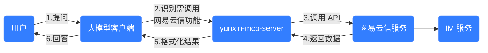

网易云信支持兼容 MCP（Model Context Protocol）开源协议，将即时通讯（IM）通过 MCP 协议开放给开发者。这意味着您可以通过简单配置结合大模型快速调用网易云信服务端 API，实现更高效的开发和运营。本文介绍如何通过克隆 [Yunxin-MCP-Server.git](https://github.com/netease-im/yunxin-mcp-server.git) 源码实现通过 MCP 协议接入 IM 服务端 API。

## MCP 介绍

[MCP（Model Context Protocol）](https://docs.anthropic.com/en/docs/agents-and-tools/mcp) 是由 Anthropic 提出并开源的模型上下文协议，旨在让大语言模型能够无缝与各种外部数据源和工具进行交互。它被视为 AI 领域的 **HTTP 协议** 或 AI 世界的 **USB-C**，为模型智能与现实应用之间构建标准化连接。随着 OpenAI 与 Google 的支持，MCP 正在成为全球广泛接受的标准协议，推动 AI 应用开发向着更高效统一的方向发展。通过 MCP 协议，AI 智能体（Agent）可以在一个统一开放的系统中访问外部数据和调用外部工具，实现工具提供方和 Agent 应用维护者的解耦。

通过 MCP 协议接入 IM 服务端 API，大致工作流程如下所示：


<style>
table th:first-of-type {
    width: 25%;
}
table th:nth-of-type(2) {
    width: 25%;
}
</style>

## 功能亮点

通过网易云信 MCP ，您可以实现以下功能：

- **IM 场景应用**：让大模型分析历史消息和群成员关系等，用于辅助运营。
- **数据统计分析**：查询 SDK/API 调用情况的实时统计数据和每日消息量等 T+1 离线统计数据。
- **跨工具协作**：将网易云信 MCP 与其他 MCP 工具组合使用，如将查询数据写入 Excel 并生成可视化图表。

## 使用示例

通过网易云信 MCP，您可以让大模型执行以下操作：

- 查询用户消息历史并分析沟通模式。
- 获取群组成员结构并提供运营建议。
- 统计 API 调用情况并分析系统负载。
- 监控 RTC 房间质量并排查性能问题。
- ....

    

## 环境要求

通过 MCP 协议接入 IM 服务端 API，对开发环境有以下要求：

- 支持 MCP 协议的大模型客户端（如 [Cherry Studio](https://cherry-ai.com/download)）。
- 大模型平台账号（如 [DeepSeek](https://www.deepseek.com/)）。
- Python 包管理工具 [uv](https://pypi.org/project/uv/)。
- 网易云信 [应用密钥（App Key）](https://doc.yunxin.163.com/console/guide/TIzMDE4NTA?platform=console)。

## 环境配置

1. 访问 [DeepSeek 官网](https://www.deepseek.com/) 注册账号。
2. 访问 [Cherry Studio 下载页面](https://cherry-ai.com/download) 并安装。
3. 打开已安装的 Cherry Studio，打开 **设置**，选择 **MCP 服务器**，安装 uv 环境依赖。

    

4. 在 Cherry Studio 中配置 MCP 服务：

    - **方式一**：打开 Cherry Studio 的 MCP 配置界面，按以下方式配置。

        配置项 | 具体配置 | 参考截图 |
        ---- | ---- | ---- |
        **命令** | uvx |  |
        **参数** | yunxin-mcp-server | ^^ |
        **环境变量** | AppKey=your_netease_im_appkey <br>AppSecret=your_netease_im_secret | ^^ |

    - **方式二**：JSON 配置文件。

        ```JSON
        {
        "mcpServers": {
            "yunxin_mcp": {
            "name": "yunxin-mcp-server",
            "type": "stdio",
            "command": "uvx",
            "args": [
                "yunxin_mcp_server"
            ],
            "env": {
                "AppKey": "your_netease_im_appkey",
                "AppSecret": "your_netease_im_secret"
            }
            }
        }
        }
        ```

6. 完成配置后，保存并启用 MCP 服务。
6. 在会话页面，开启使用 yunxin-mcp-server。

    

## 工具列表

网易云信 MCP Server 提供了丰富的工具支持，完整工具列表请在 [Yunxin-MCP-Server.git 仓库](https://github.com/netease-im/yunxin-mcp-server) 查看。