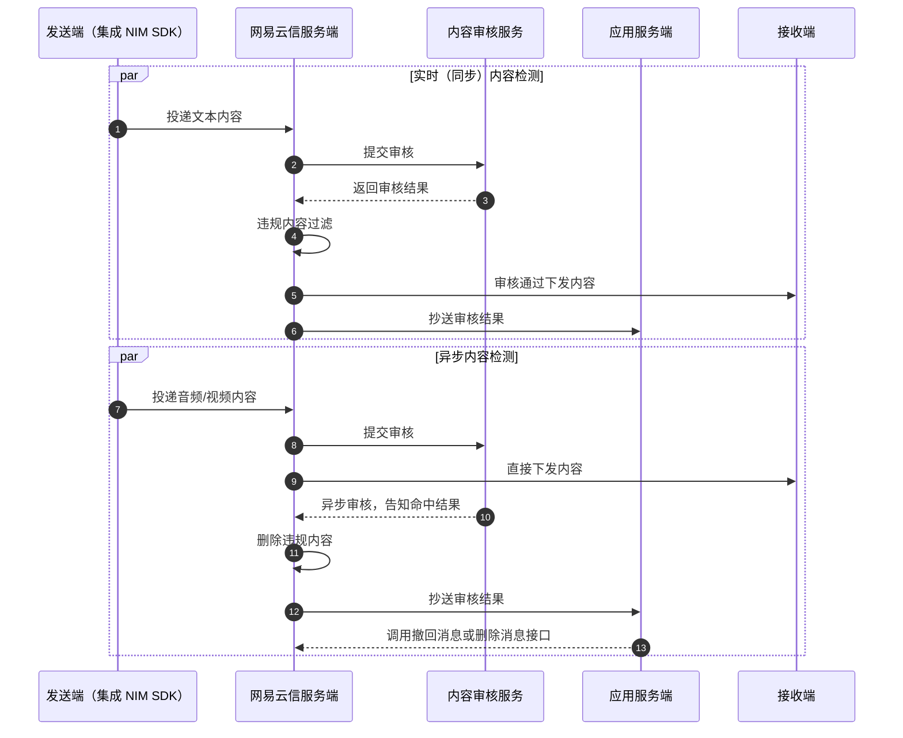

<!--keywords: 内容审核,安全通,反垃圾 -->

网易云信融合网易易盾的内容安全审核能力，为您提供全方位的内容审核增值服务，对 IM 即时通讯内容进行有效的判别和筛选，降低相关人力投入。在国家对互联网内容安全政策监管日趋严格和规范的大背景下，为您的产品营收稳定增长保驾护航。

<!-- ::: note note
IM 易盾内容审核服务现已全新升级为安全通服务，2021 年 4 月 1 日后开通的内容审核功能均为新版安全通。新版安全通服务相较于旧版内容审核功能，提供更为便捷的接入方式、更易用的接口体系。
::: -->

## 技术原理

针对不同的内容类型，安全通提供两套内容审核方案：

审核方案
 | 说明
:---- | :----
实时（同步）内容审核 | 主要针对文本和图片内容。由网易云信服务端进行内容提交、过滤和投递，[客户端会收到内容审核结果](https://doc.yunxin.163.com/messaging/docs/DcxNzE0NTU?platform=android#获取审核结果)，且网易云信服务器会同时抄送审核结果给应用服务器。客户端上需根据内容审核结果自行实现相关业务处理。
异步内容审核 | 主要针对音频和视频。由网易云信服务端先行投递消息，违规内容由网易云信服务端删除。内容审核结果抄送至应用服务器，后者根据审核结果对消息进行处理（如撤回）。客户端不会收到内容审核结果。

网易云信 IM 实现安全通反垃圾的技术原理如下图所示，若您需要网易云信服务器将审核结果抄送到您的应用服务器，即流程 6 和流程 12，请开通 [异步反垃圾抄送](https://doc.yunxin.163.com/messaging/server-apis/TcxNzU4NzU?platform=server#%E6%98%93%E7%9B%BE%E5%BC%82%E6%AD%A5%E5%8F%8D%E5%9E%83%E5%9C%BE%E6%8A%84%E9%80%81)。

<!--  -->

## 功能概述

[开通安全通功能并配置安全通检测规则](https://doc.yunxin.163.com/messaging/server-apis/jYxOTcyNzY?platform=server)</b> 后，指定类型的消息经过相关的接口调用和配置后，都会先经由安全通进行内容安全检测，之后才会转发给接收端的用户。安全通目前支持单聊、群聊、聊天室和圈组的文本消息、图片消息、用户头像和用户资料等类型的内容安全检测以及自定义消息的内容安全检测。

目前提供如下几种消息类型的内容审核：

| API 关键字 | 说明 |
| :---- | :---- |
| text | 文本消息 |
| image | 图片消息 |
| audio | 音频消息 |
| video | 视频消息 |
| custom | 自定义消息 |

<!--暂不支持

| location | 位置消息 |
| file | 文件消息 |
| avchat | 音视频通话事件消息 |
| notification | 通知消息 |
| tip | 提醒消息 |

-->

## 注意事项

::: note important
网易云信安全通内部使用了易盾的密钥，如果您刷新了易盾密钥，请务必及时 [提交工单](https://app.yunxin.163.com/global/service/ticket/create) 联系网易云信技术支持工程师。
:::

## 审核结果字段说明

异步内容审核 **不支持** 返回结果字段。

实时内容审核结果通过客户端回调返回，具体请参考客户端相关文档。审核结果字段 yidunAntiSpamRes，该字段为 JSON 字符串格式，请自行解析或者反转成 JSON 对象使用。yidunAntiSpamRes 字段定义如下：

<table>
<thead><tr><th style="width:100px">名称</th><th style="width:100px">类型</th><th>说明</th></tr></thead>
<tr><td> code </td><td>Integer</td><td>状态码：<ul><li>200：易盾内容审核结果返回正常</li><li>404：易盾反回的内容审核结果为空，该情况下 yidunAntiSpamRes 中无 code 以外的字段</li><li>414：易盾返回的内容审核结果过长，该情况下 yidunAntiSpamRes 中无 ext 字段</li></ul></td></tr>
<tr><td> type </td><td>String</td><td>内容审核类型<ul><li>text：文本</li><li>image：图片</li></ul></td></tr>
<tr><td> version </td><td>String</td><td>易盾内容审核的接口版本</td></tr>
<tr><td> taskId </td><td>String</td><td>审核任务的 ID</td></tr>
<tr><td> suggestion </td><td>Integer</td><td> 建议处理方式<ul><li>0：通过</li><li>1：嫌疑，建议人工复审</li><li>2：不通过</li></td></tr>
<tr><td> status </td><td>Integer</td><td>内容审核请求结果<li>2：检测成功<li>3：检测失败<note type=note>只有图片审核（type="image"）时才返回该字段。</td></tr>
<tr><td> ext </td><td>String</td><td>内容审核结果，对应易盾的 result 字段，result 字段详情参考 <a href="https://support.dun.163.com/documents/588434200783982592?docId=791131792583602176#%E5%93%8D%E5%BA%94" target="_blank">易盾文档</a>。<note type="note">本链接仅以 <b>单次同步文本检测的 result 字段说明</b> 为例。</note></td></tr>
</table>

::: note notice
考虑到安全通内容审核相关字段后续的扩展性（一般为新增属性），请注意做好解析兼容。
:::

## 参考文档

- 《网易易盾官方文档》[文本内容审核](https://support.dun.163.com/documents/588434200783982592?docId=589155559786291200)
- 《网易易盾官方文档》[图片内容审核](https://support.dun.163.com/documents/588434277524447232?docId=588969512673185792)