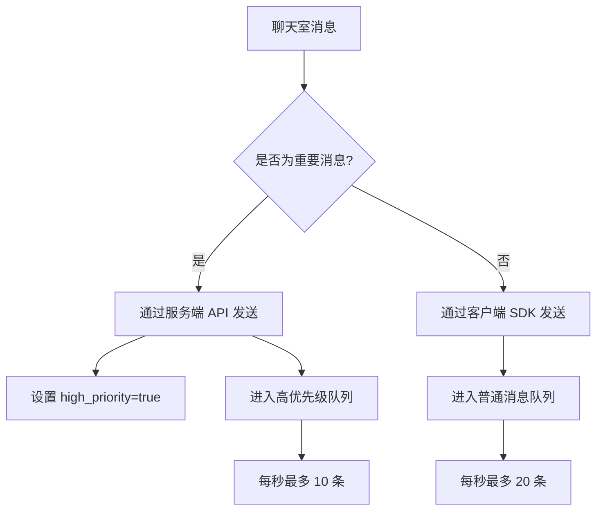

<!--keywords: 流控,聊天室流控,最佳实践-->

网易云信聊天室在高并发场景下实施流量控制机制（以下简称 **流控机制**），当用户在聊天室发送大量文字消息和自定义消息（如礼物）时，部分消息可能丢失。

本文介绍如何在高流量环境下尽可能地确保重要的自定义消息能够可靠投递。

## 流控机制详情

### 消息接收限制

消息类型 | 限制频率 | 超限处理
--- | --- | ---
普通消息 | 每秒至多接收 20 条 | 超过部分会因为流控随机丢弃
高优先级消息 | 每秒至多接收 10 条 | 超过部分尽量保证但无法完全保证

### 流控机制引入原因

- 客户端性能保障
    - 防止流量激增导致客户端 UI 渲染性能开销过高（过多的消息导致卡顿）。
    - 避免消息刷新影响用户阅读体验（过多消息用户看不清，体验反而下降）。
- 服务器稳定性保障   
    - 虽然服务器有扩容和负载均衡机制，但聊天室流量激增可能导致单台服务器过载，产生登录聊天室变慢和聊天室发消息耗时增加的现象，最终影响用户体验。

    ::: note note
    如您有特殊业务需求，可通过工单联系网易云信技术支持申请调整流控配额。
    :::

## 推荐应对方案

### 消息分级与优先级处理

### 详细实施方案

1. 聊天室消息类型区分。

    将聊天室用户发送的普通消息和不可丢失的自定义消息（如礼物、公告、重要通知等）按如下方式进行区分：

    - 普通消息通过客户端发送，详情请参考 [聊天室消息收发](https://doc.yunxin.163.com/messaging2/guide/DQzNjE0MDU?platform=client#聊天室消息收发)。
    - 不可丢失的 **自定义消息** 通过调用 **服务端 API**（`im/v2/chatrooms/{room_id}/messages`）发送，调用时将业务参数 `high_priority` 设置为 `true`，从而将该自定义消息设置为高优先级消息。详情请参见 [发送聊天室消息](https://doc.yunxin.163.com/messaging2/server-apis/TAwMzc0NzE?platform=server)。

2. 高流量礼物消息优化策略。

    在自定义消息为礼物消息的场景下，为了避免礼物消息数量过多超过高优先级消息每秒上限，自行开发如下两个方案，并将两者组合使用：

    策略 | 说明 | 优势
    --- | --- | --- 
    策略一：礼物分级投递 | 根据礼物的级别分配不同的策略。例如：普通礼物每秒 5 条，高级礼物每秒 5 条，同时高级礼物未用完的条数配额可以分给普通礼物。 | 确保高价值礼物优先展示；灵活分配资源；提升用户付费体验。 | 
    策略二：合并发送 | 将多个同类型礼物合并成一条消息。当普通礼物数量较多时，通过合并减少消息总量。即使在极高流量下部分普通礼物消息被丢弃，用户体验也不会显著受影响。 | 减少消息总量；降低流控风险；提升展示效率；减少屏幕视觉干扰。 | 