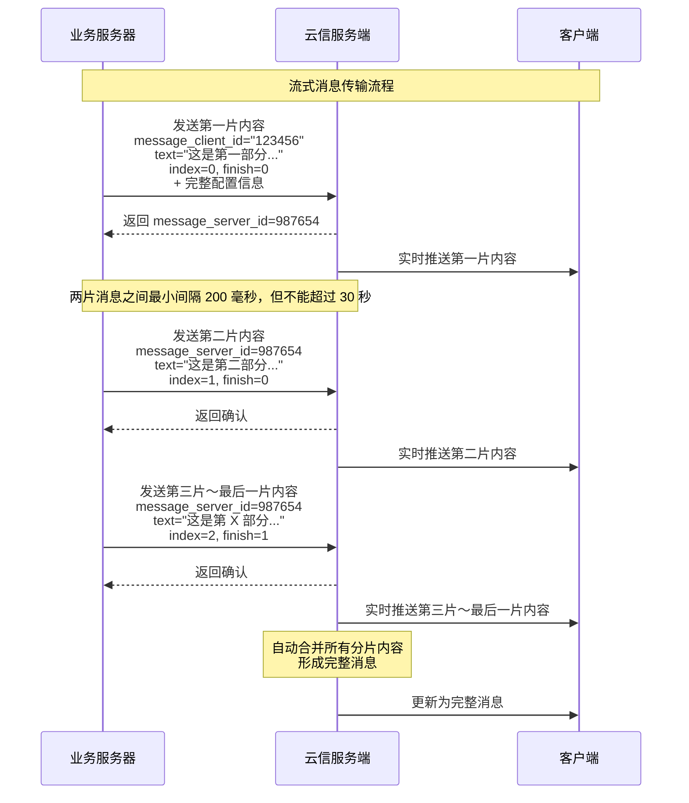

网易云信服务端支持在单聊和高级群聊中发送流式消息。通过实时分片传输 AI 生成的内容，降低响应延迟、支持中断控制，显著改善用户交互体验。

该接口可以在会话中发送一条流式消息。目前会话类型支持单聊和高级群。

## 功能描述

- **基本规则**：
    - 对于单聊，流式通知会实时下发给消息的发送方和接收方。
    - 对于高级群聊，流式通知只会下发给消息发送者。若需要下发至全员，请联系云信技术支持进行开通。
    - 对于群定向消息，流式通知会下发至发送占位消息时刻的成员列表。流式通知过程中新加入的成员无法看到流式通知。
    - 流式消息完成或终止后，系统会自动将已接收的所有分片内容按序号合并成完整消息。
  
- **接口限制**：
    - **时间限制**：每次分片之间最长间隔不能超过 30 秒，否则流式消息将被终止。
    - **长度限制**：所有分片 `text` 总长度不能超过 5000 字符，超过将立即终止流式消息。
    - **终止规则**：流式消息一旦终止，该流式消息的后续请求将被拒绝。

- **调用频率**：建议使用缓冲逻辑，而非每个字符都立即调用接口。
    - 推荐方式：每 200 毫秒调用一次。
    - 好处：降低接口调用频率，提高系统效率，保持良好的流式体验。

## 工作原理

流式消息的工作原理和组成部分：



<!--     %% 可能的错误情况
    Note over Client, Server: 可能的错误情况
    
    rect rgb(255, 220, 220)
        Note over Client, Server: 错误情况1: 超过30秒未发送下一片
        Client--xServer: 超过30秒...
        Server--xClient: 终止流式消息<br>返回错误码
    end
    
    rect rgb(255, 220, 220)
        Note over Client, Server: 错误情况2: 总长度超过5000字符
        Client--xServer: 发送过长内容...
        Server--xClient: 立即终止流式消息<br>返回错误码
    end
    
    rect rgb(255, 220, 220)
        Note over Client, Server: 错误情况3: 流式消息终止后继续发送
        Client--xServer: 消息已终止后继续发送请求
        Server--xClient: 拒绝请求<br>返回错误码
    end -->

## 调用频率

单个应用默认最高调用频率请参考 [频控说明](https://doc.yunxin.163.com/messaging2/server-apis/DUzNjAzMTc?platform=server)。

## 请求信息

### 请求 URL

```
POST https://{endpoint}/im/v2/conversations/{conversation_id}/messages/actions/stream_message
```

:::note note
请求 URL 中的 `{endpoint}` 代表服务地址域名，您可以根据用户服务区域选择中国大陆和海外服务地址，并支持搭建高可用主备域名机制。详情请参考 [调用方式](https://doc.yunxin.163.com/messaging2/server-apis/zcwODA3MTU?platform=server#服务地址) 服务地址章节。
:::

### 请求头参数

请求 Header 的参数说明请参考 [请求 Header](https://doc.yunxin.163.com/messaging2/server-apis/zcwODA3MTU?platform=server#请求头)。

### 路径参数

参数名称 | 类型 | 是否必选 | 说明 | 示例
---- | ---- | ---- | ---- | ----
`conversation_id` | String | 是 | 会话 ID。会话 ID 需要用户自行拼装，拼装规则：<br> `owner_id | conversation_type | other_id` <li>owner_id：操作者账号 ID</li><li>conversation_type：会话类型，1：单聊会话。</li><li>other_id：对方账号 ID</li> | 单聊会话：`account_id1|1|account_id2`

### 请求体参数

参数名称 | 类型 | 是否必选 | 描述
---- | ---- | ---- | ----
`message` | Object | 是 | 消息体。
 `message_type` | Integer | 是 | 消息类型。当前仅支持 0（文本消息）。
 `message_client_id` | String | 否 | 客户端消息 ID。若不传入，则会自动生成。
 `attachment` | Object | 是 | 流式消息详情。
   `text` | String | 是 | 流式消息的内容。所有分片 `text` 总长度不能超过 5000 字符。
   `index` | Integer | 否 | 流式分片的序号，从 0 开始。不填会根据接收到请求的顺序自动编号。
   `finish` | Integer | 否 | 该流式输出是否已结束。0（默认）：未结束，1：结束。
 `message_server_id` | Long | 否 | 消息的服务器 ID。针对同一条流式消息，首次调用 API 时不填该参数，从第二次调用开始需要将该字段回传。
`message_config` | Object | 否 | 消息相关配置信息，首次调用 API 时填入，后续请求无需传入。
 `unread_enabled` | Boolean | 否 | 该消息是否需要计入未读数。默认为 true（计入）。
 `mutil_sync_enabled` | Boolean | 否 | 该消息是否需要发送方多端同步。默认为 true（发送方才会收到流式通知和消息通知）。
 `history_enabled` | Boolean | 否 | 该消息是否存云端历史。默认为 true（存储）。
 `conversation_update_enabled` | Boolean | 否 | 是否将该消息更新至会话列表服务中本会话的最后一条消息。默认为 true（更新）。
`route_config` | Object | 否 | 抄送相关配置信息，首次调用 API 时填入，后续请求无需传入。
 `route_enabled` | Boolean | 否 | 该消息是否需要抄送至指定的应用服务器（需要为应用开通消息抄送功能），默认为 true（抄送）。
 `route_environment` | String | 否 | 当前消息需要抄送到的环境的名称，对应您在 [网易云信控制台](https://app.yunxin.163.com/global/home) 中配置的自定义抄送的环境名称。
`p2p_option` | Object | 否 | 单聊消息功能相关配置信息，首次调用 API 时填入，后续请求无需传入。
 `check_friend` | Boolean | 否 | 该消息是否只发给好友（与消息发送者为好友关系的账号），默认为 false。<br>若需要设置为好友关系才能发送消息，需先在 [网易云信控制台](https://app.yunxin.163.com/global/home) 完成配置，再将该字段设置为 true。
`team_option` | Object | 否 | 高级群消息功能配置项。
 `mark_as_read` | Boolean | 否 | 是否需要已读功能（仅对高级群消息有效），默认为 false（不需要）。
 `ignore_chat_banned` | Boolean | 否 | 发送高级群消息时，是否忽略群禁言。默认为 false（不忽略）。若设置为 true（忽略），那么高级群内被禁言的情况下也可以发送消息。
 `ignore_member_chat_banned` | Boolean | 否 | 发送高级群消息时，是否忽略成员禁言。默认为 false（不忽略）。如设置为 true（忽略），那么高级群内被禁言的用户也可以发送消息。
 `check_team_member_valid` | Boolean | 否 | 发送高级群消息时，是否需要验证群成员身份，默认为 true（需要）。如设置为 false（不需要），那么不会验证群成员身份。
`target_option` | Object | 否 | 群定向消息配置项。<note type=notice>该功能需要单独开通。 |
 `receiver_account_ids` | Array of strings | 是 | 群定向消息成员列表，即指定接收群消息的群成员列表。<note type=note><li>当 `inclusive` 为 true，当前列表为可见（接收）列表。<li>当 `inclusive` 为 false，当前列表为不可见（不接收）列表。<li>列表中不能包含消息发送者，消息发送者默认为可见。<li>列表中不能包含非法账号、非群成员账号。<li>列表中最多可以传入 100 个用户账号。
 `inclusive` | Boolean | 否 | 群定向消息成员列表是否为可见列表。默认为 true，即 `receiver_account_ids` 为可见（接收）列表。
 `check_team_member_valid` | Boolean | 否 | 发送群定向消息时，是否需要验证定向成员的群成员身份。默认为 true，即需要验证群成员身份。
 `visible_to_new_member` | Boolean | 否 | 新进群成员是否可见该消息。默认为 false，即新进群成员不可以查看该定向消息。若设置为 true，则新进群成员若可以查询该定向消息，可以通过云端历史相关接口查询到该消息。<note type=notice><li>当 `inclusive` 为 true 时，不能同时设置 `visible_to_new_member` 为 true。即发送定向列表为可见的定向消息时，只能由定向列表中成员接收和查看。<li>发送超大群消息时，不能将 `visible_to_new_member` 设置为 true。
`push_config` | Object | 否 | 推送相关配置信息，首次调用 API 时填入，后续请求无需传入。<br>支持发送初始分片、消息发送完成两个阶段分别推送。
 `push_enabled` | Boolean | 否 | 该消息是否需要 APNs 推送或安卓系统通知栏推送，默认为 true（推送）。只有该字段为 true 时，推送相关参数才会生效。
 `push_nick_enabled` | Boolean | 否 | 推送文案是否需要带上昵称，默认为 true（带昵称）。
 `push_content` | String | 否 | 推送文案，长度上限 500 字符。如果不填，则使用默认推送文案。<br>推送文案的显示规则如下：<li>push_content 不为空且 push_nick_enabled = true，最终推送文案为：推送者昵称+ push_content<li>push_content 不为空且 push_nick_enabled = false，最终推送文案为：push_content<li>push_content 为空且 push_nick_enabled = true，最终推送文案为：推送者昵称+默认文案<li>push_content 为空且 push_nick_enabled = false，最终推送文案为：默认文案<br>其中，根据消息类型，默认文案分为以下几种：<li>文本消息默认文案：发来了一条消息<li>图片消息默认文案：发来了一张图片<li>语音消息默认文案：发来了一段语音<li>视频消息默认文案：发来了一段视频<li>地理位置默认文案：发来了一个地理位置<li>文件消息默认文案：发来了一个文件<li>语音聊天邀请消息默认文案：发来了语音聊天邀请<li>视频聊天邀请消息默认文案：发来了视频聊天邀请</li>
 `push_payload` | String | 否 | 推送对应的 payload，必须是 JSON 格式，长度上限 2048 字符。详情请参考 [推送 payload 配置](https://doc.yunxin.163.com/messaging/server-apis/DQyNjc5NjE?platform=server)。
`extension` | String | 否 | 开发者扩展字段，JSON 格式。例如："{\"k\":\"v\"}" <br>该字段长度上限以使用的 IM 套餐为准。IM 旗舰版及以上套餐才支持配置字段上限。<note type=notice>只有在首次调用或最后一次调用本接口时传入该字段才能生效，中间请求时该字段失效（即使配置也不生效）。
`rag_info_list` | Array of objects | 否 | 流式消息中携带的 rag 信息。
 `name` | String | 否 | rag 名称。
 `icon` | String | 否 | rag 图标。
 `title` | String | 否 | 引用资源的标题。
 `time` | Long | 否 | 引用资源的时间。
 `url` | String | 否 | 引用资源的 URL。
 `description` | String | 否 | 引用资源的描述。
`thread_config` | Object | 否 | Thread 消息配置项。<note type=notice>该功能需要单独开通。 |
 `thread_root` | Object | 否 | Thread 根消息对象。 |
  `sender_id` | String | 否 | 根消息的发送者。 |
  `receiver_id` | String | 否 | 根消息的接收者。 |
  `create_time` | Long | 否 | 根消息的发送时间。 |
  `message_server_id` | Long | 否 | 根消息的服务器消息 ID。 |
  `message_client_id` | String | 否 | 根消息的客户端消息 ID。
 `thread_reply` | Object | 否 | 被回复的消息对象。 |
  `sender_id` | String | 否 | 被回复消息的发送者。 |
  `receiver_id` | String | 否 | 被回复消息的接收者。 |
  `create_time` | Long | 否 | 被回复消息的发送时间。 |
  `message_server_id` | Long | 否 | 被回复的根消息的服务器消息 ID。 |
  `message_client_id` | String | 否 | 被回复消息的客户端消息 ID。 |

### 请求体示例

- **首次调用流式消息时的示例**：

    ```JSON
    {
        "message": {
            "message_type": 0,
            "message_client_id": "123456",
            "attachment": {
                "text": "这是一条流式消息的内容片段",
                "index": 0,
                "finish": 0
            }
        },
        "message_config": {
            "unread_enabled": true,
            "mutil_sync_enabled": true,
            "history_enabled": true,
            "conversation_update_enabled": true
        },
        "route_config": {
            "route_enabled": true,
            "route_environment": "env"
        },
        "p2p_option": {
            "check_friend": false
        },
        "push_config": {
            "push_enabled": true,
            "push_nick_enabled": true,
            "push_content": "您收到一条新消息",
            "push_payload": "{\"key1\":\"value1\",\"key2\":\"value2\"}"
        },
        "extension": "{\"k\":\"v\"}"
    }
    ```

- **后续持续调用流式消息时的示例**：

    ```JSON
    {
      "message": {
        "message_type": 0,
        "attachment": {
          "text": "这是流式消息的后续内容",
          "index": 1,
          "finish": 0
        },
        "message_server_id": 987654
      }
    }
    ```

- **最后一个分片请求示例**：

    ```JSON
    {
    "message": {
        "message_type": 0,
        "attachment": {
            "text": "这是流式消息的最后一部分",
            "index": 2,
            "finish": 1
        },
        "message_server_id": 987654321
    }
    }
    ```

## 响应信息

### 响应头参数

响应 Header 的参数说明请参考 [响应 Header](https://doc.yunxin.163.com/messaging2/server-apis/zcwODA3MTU?platform=server#响应头)。

### 响应体参数

参数名称 | 类型 | 说明 | 是否必返回 |
---- | ---- | ---- | ----
`code` | Integer | 状态码，200 表示请求成功。 | 是
`msg` | String | 提示信息。请求失败时返回错误信息，请求成功时返回 "success"。 | 是
`data` | Object | 返回的 JSON 数据对象，请求失败则返回空对象。 | 是 |
 `message_server_id` | Long | 服务端消息 ID。 | 是
 `message_client_id` | String | 客户端消息 ID。 | 是
 `sender_id` | String | 消息发送方账号 ID。 | 是
 `conversation_type` | Integer | 消息会话类型。1：单聊会话；2：高级群会话；3：超大群会话 | 是
 `receiver_id` | String | 消息接收者账号 ID。 | 否
 `create_time` | Long | 消息发送时间戳。 | 是
 `message_type` | Integer | 消息类型。0：文本。1：图片。2：语音。3：视频。4：地址位置。6：文件。10：提示。12：音视频话单。100：自定义。 | 是
 `attachment` | Object | 消息分片信息。 | 否
   `text` | String | 流式消息的内容。 | 否
   `index` | Integer | 流式分片的序号，从 0 开始。| 否
   `finish` | Integer | 该流式输出是否已结束。0：未结束，1：结束。| 否

### 响应体示例

```JSON
{
  "code": 200,
  "msg": "success",
  "data": {
    "attachment": {
      "index": 0,
      "finish": 0,
      "text": "这是一条流式消息的内容片段"
    },
    "message_server_id": 15026972234532,
    "sender_id": "test",
    "conversation_type": 1,
    "receiver_id": "aliaitest10",
    "create_time": 1753087272397,
    "message_type": 0,
    "message_client_id": "4268bca6**d00e0fd44f"
  }
}
```

## 错误码

本文仅列举部分业务接口错误码，完整列表请参考客户端 API [错误码](https://doc.yunxin.163.com/messaging2/client-apis/DUxNjU3MzU?platform=client)。 

| 错误码 | 错误码描述 | 错误信息示例
| ---- | ---- | ----
| 200 | 请求成功 | success
| 414 | 参数错误 | parameter error
| 102404 | 用户不存在 | account not exist
| 102421 | 用户被禁言 | account chat banned
| 102422 | 用户被禁用 | account banned
| 104404 | 好友不存在 | friend not exist
| 107410 | 该 App 未开启发消息功能 | messaging function disabled
| 107351 | 发送者在接收者的黑名单中 | The sender is on the recipient blocklist
| 500 | 服务器内部错误 | internal server error