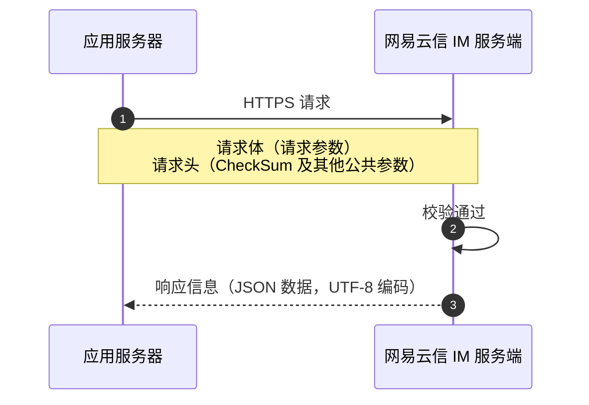

<!--keywords: IM,即时通讯,服务端 API,服务端,API 调用,请求结构,CheckSum,CheckSum 校验,请求头,Header,header,Body,body-->

应用服务端调用 API 向网易云信 IM 服务端发起的请求需遵循固定的请求结构和请求方式。

## 请求概述

应用服务端调用 API 向网易云信 IM 服务端发起的请求需遵循固定的请求结构和请求方式。

<style>
table th:first-of-type {
    width: 17%;
}
</style>



### 请求方式

- **通信协议**：IM 服务端 API 是简单的 HTTP/HTTPS 接口，适配各种语言。

- **请求方式**：应用服务端向 IM 服务端发起的请求支持 **POST**、**PATCH**、**GET**、**DELETE** 方式。

### 服务地址

为保障业务稳定性，网易云信 IM 服务提供了主备域名机制。当主域名发生故障时，您可以使用备用域名继续访问 API 服务。有关海外业务接入相关说明，请参考 [接入海外数据中心](https://doc.yunxin.163.com/messaging2/concept/Dk0Nzk3MDE?platform=client)。

服务区域 | 主域名 | 备用域名 |
---- | ---- | ---- |
国内 | open.yunxinapi.com | open-bak.yunxinapi.com |
海外 | open-sg.yunxinapi.com | open-sg-bak.yunxinapi.com |

:::note note
为确保服务的高可用性，网易云信建议：

- **配置多域名访问**：在业务系统中同时配置主备域名，当检测到主域名无法访问时，自动切换至备用域名。
- **使用 SDK 自动切换功能**：如果您使用 Java 开发语言，强烈建议通过网易云信提供的 [Server SDK](https://doc.yunxin.163.com/messaging2/server-apis/jQxNjEwMjI?platform=server) 接入，该 SDK 已内置多域名自动故障切换能力，无需您手动实现域名切换逻辑。
- **定期检查域名可用性**：建议在应用中实现定期检查域名可用性的机制，以便及时发现并应对可能的域名访问问题。
:::

## 请求结构

IM 服务端 API 请求结构主要由下表所示三部分组成。

组成部分 | 说明
---- | ----
URL | 指向具体的业务请求，请参考各 API 文档。
Header | 请求头，包含网易云信 App Key、CheckSum 等在内的 **公共请求参数**，用于鉴权。应用服务端请求 IM 服务端的所有 API 调用均采用 **相同** 的 Header 公共请求参数配置。
Body | 请求体，包含 API 对应的业务参数，具体参考各 API 文档的 **请求参数** 小节。

### 请求 URL

请求 URL 路径遵循 RESTFUL 原则，围绕资源定义接口路径，通过 HTTP/HTTPS 方法类型来区分接口的 **增删改查** 行为。此外，一些向前兼容的接口允许在 URL 中添加 `action` 进行标注。

当前支持 POST、GET、PATCH、DELETE 四种操作类型的接口，对应资源的增删改查操作。

| 操作类型 | 示例操作 | 注意事项 |
| ---- | ---- | ---- |
| `POST` 新增资源 | 注册 IM 账号。 | GET 请求由于 URL 长度限制等原因，可以改为 POST 请求，详细说明见下文 **查询参数**。
| `GET` 查询资源 | - 查询某个账号 ID。 | 针对多个资源的查询，根据代码实现和业务需要，选择批量查询或者分页查询，二选一。 |\
| | - 查询多个用户信息。 | |\
| | - 按页查询好友列表。 | |
| `PATCH` 更新资源 | 更新用户名片。 | PATCH 可以对部分资源属性进行更新，也可以更新所有资源属性，即 PATCH 包含 PUT（更新整个资源） 的功能，支持全部资源属性的更新。
| `DELETE` 删除资源 | - 删除单个账号。 | 删除任何数据和资源之前，请确保您已明确操作的必要性。 |\
| | - 删除多个账号。 | |

### 请求头

调用 IM 服务端 API 的请求，都需要在请求头（Header）中传入 `CheckSum` 进行鉴权。

Header 参数为 **公共请求参数**，应用服务端请求网易云信 IM 服务端，都需在 Header 中配置如下参数。

参数名称 | 类型 | 是否必选 | 描述
---- | ---- | ---- | ----
`AppKey` | String | 是 | 通过网易云信控制台获取，请参考 <a href="https://doc.yunxin.163.com/console/concept/TA1ODMzMDc?platform=console#获取-app-key">获取 App key</a>。
`Nonce` | String | 是 | 随机数（最大长度 128 个字符）。
`CurTime` | String | 是 | 当前 UTC 时间戳，从 1970 年 1 月 1 日 0 时 0 分 0 秒开始到 **现在** 的秒数。该时间用于计算 CheckSum 的有效期，请确保与标准时间同步。
`CheckSum` | String | 是 | SHA1(AppSecret + Nonce + CurTime)，将该三个参数拼接的字符串进行 SHA1 哈希计算从而生成 16 进制字符（小写）。<ul><li>出于安全性考虑，每个 `CheckSum` 的 **有效期** 为 **5 分钟**，即服务端接收到请求的时间与请求中的 `CurTime` 相差不能超过 5 分钟，建议每次请求都生成新的 `CheckSum`，同时 **请确认** 发起请求的服务器是与标准时间同步的，例如有 NTP 服务。</li><li>`CheckSum` 检验失败时会返回 414 错误码。</li> </ul>
`X-custom-traceid` | String | 否 | 开发者填入的 logID，用于与开发者业务服务器中的请求中的上下游请求关联，该由用户自定义和使用，网易云信服务器不会对该字段做任何处理，直接返回给开发者。<note type=note>只有在请求 Header 中填入了该参数，响应 Header 中才会有该字段。
`Content-Type` | String | 是 | 请求体的数据类型。例如 `application/json`、`charset=utf-8`。

::: note important
- 请妥善保管用于计算 `CheckSum` 的 `AppSecret`，可在应用服务器存储和使用，但不应存储或传递到客户端，也不应在网页等前端代码中嵌入。
- 当请求头中包含 `X-custom-traceid` 字段时，服务端默认会基于该字段进行接口幂等校验。如果不含有该请求头，则不进行幂等校验。
:::

**CheckSum 计算示例**

计算 `CheckSum` 的示例代码如下：

:::::: div linked-codes
::: code Java
```Java
import java.security.MessageDigest;

public class CheckSumBuilder {
    // 计算并获取 CheckSum
    public static String getCheckSum(String appSecret, String nonce, String curTime) {
        return encode("sha1", appSecret + nonce + curTime);
    }

    // 计算并获取 md5 值
    public static String getMD5(String requestBody) {
        return encode("md5", requestBody);
    }

    private static String encode(String algorithm, String value) {
        if (value == null) {
            return null;
        }
        try {
            MessageDigest messageDigest
                    = MessageDigest.getInstance(algorithm);
            messageDigest.update(value.getBytes());
            return getFormattedText(messageDigest.digest());
        } catch (Exception e) {
            throw new RuntimeException(e);
        }
    }
    private static String getFormattedText(byte[] bytes) {
        int len = bytes.length;
        StringBuilder buf = new StringBuilder(len * 2);
        for (int j = 0; j < len; j++) {
            buf.append(HEX_DIGITS[(bytes[j] >> 4) & 0x0f]);
            buf.append(HEX_DIGITS[bytes[j] & 0x0f]);
        }
        return buf.toString();
    }
    private static final char[] HEX_DIGITS = { '0', '1', '2', '3', '4', '5',
            '6', '7', '8', '9', 'a', 'b', 'c', 'd', 'e', 'f' };
}
```
:::
::: code Node.js
```JavaScript
const { SHA1 } = require("crypto-js");

function randString(x) {
  let s = "";
  while (s.length < x && x > 0) {
    const v = Math.random() < 0.5 ? 32 : 0;
    s += String.fromCharCode(
      Math.round(Math.random() * (122 - v - (97 - v)) + (97 - v))
    );
  }
  return s;
}

const [Nonce, CurTime] = [randString(20), new Date().getTime().toString().slice(0, 10)];

function CheckSum(AppSecret, Nonce, CurTime) {
  return SHA1(AppSecret + Nonce + CurTime);
}
```
:::
::::::

### 请求体

传入请求体（Body）的 **具体业务参数** 请参考各 API 文档。以注册 IM 账号为例，对应的业务参数配置说明请参考 [注册 IM 账号](https://doc.yunxin.163.com/messaging2/server-apis/TQyNjgyMzc?platform=server)。

::: note notice
请求参数（即传入 Body 的具体业务参数）无论为何类型，实际传入时都需要转为 String 格式，否则将报错。
:::

**路径参数**

当接口中有路径参数定义时，才添加路径参数。

路径参数一般表示该资源集合下的单个资源 ID，如：账号 ID、聊天室 ID。

**查询参数**

- `GET`、`DELETE` 请求必须使用查询参数，不能使用请求体参数。
- 查询参数为 `key-value` 形式，没有二级结构。所有参数和值需要经过 **url 编码**。
- 分页查询提供 `page_token/offset`、`limit` 两个分页查询参数（请参考分页接口说明）。
- 当查询参数出现 `Array` 类型时，每个参数以逗号进行拼接，如 `https://open.yunxinapi.com/im/v2/accounts?account_ids=account1%2Caccount2`。

**请求体参数**

- 请求体的数据类型为 Content-Type=application/json; charset=utf-8。
- 请求体参数一般用于 `POST`、`PATCH` 请求，`GET`、`DELETE` 请求禁止使用。
- Array 类型的参数需要以 JSONArray 的形式接收。
- 参数格式为 JSON 格式，如果接口参数较多，并且具有结构信息，使用二级结构表示。
- 一些 JSON 格式但是内容可自定义的参数定义为 String 类型，要求 JSON 格式。传参时需要添加引号，例如：`{payload:"{\"pushTitle\":\"title\"}"}`。主要涉及以下参数：
    - `push_payload`
    - `antispam_bussiness_id`
    - `antispam_extension`
    - `antispam_custom_message`
    - `antispam_cheating`

## 响应概述

调用 IM 服务端 API 的返回类型均为 JSON，同时进行 UTF-8 编码。

如调用成功，则返回状态码 `200`。如调用异常，则会返回相应的错误码，请参考各 API 文档中的错误码部分。

### 响应头

响应头（Header）参数为 **公共请求参数**，应用服务端请求网易云信 IM 服务端后，网易云信服务端会返回结果，响应的 Header 包括参数。

参数名称 | 类型 | 描述
---- | ---- | ----
`Content-Type` | String | 响应体的数据类型，`application/json`、`charset=utf-8`。
`X-yunxin-traceid` | String | 请求在网易云信服务器中的 log 排查 ID，用于问题排查。
`X-Timestamp` | String | 网易云信服务器接收到该请求的时间，精确到 ms 的 UTC 时间。
`X-custom-traceid` | String | 开发者在请求 Header 中填入的 logID，用于与开发者业务服务器中的请求中的上下游请求关联，该由用户自定义和使用，网易云信服务器不会对该字段做任何处理，直接返回给开发者。<note type=note>只有在请求 Header 中填入了该参数，响应 Header 中才会有该字段。</note>

### 响应体

响应体（Body）中的响应参数包括返回码（code）、错误描述（msg）和响应内容（data）。

::: note notice
随着业务迭代，接口返回的 JSON 数据会持续新增字段（不影响原有字段结构）。为保障接口兼容性与业务扩展性，请务必 **采用标准 JSON 解析方式**（通过字段名直接访问，而非依赖字段顺序遍历），以免因新增字段导致解析逻辑异常。标准解析方式可确保： 
- 新增字段不影响现有解析逻辑。
- 无需因字段顺序变化调整代码。
- 兼容未来所有合理的字段扩展。
:::

参数名称 | 类型 | 是否必返回 | 说明 | 示例
---- | ---- | ---- | ---- | ----
`code` | Integer | 是 | 返回码（错误码） | 200
`msg` | String | 是 | 提示信息，成功时返回 **success** | "Parameter error, xxx"
`data` | Object | 是 | 返回的数据结构，JSON 格式。请求失败时返回空对象 | -

:::note notice
- `POST`、`PATACH` 请求必须返回完整的资源信息。`GET` 请求按接口功能返回。`DELETE` 请求删除成功返回 200，删除失败返回错误信息。
- 对于批量接口来说，部分成功、部分失败、全部失败均返回 200，并返回失败列表（请参考下文批量接口说明）。
- 对于分页接口来说，响应必须包含 `has_more`、`items`、`next_token/offset` 三部分。
- `data` 中的字段为 `key-value` 形式，当返回值 `value` 为 null 时，该字段整体不返回。
:::

## 查询类型说明

### 分页接口

- 分页查询必须提供 `page_token/offset`、`limit` 两个分页查询参数。
    - 当分页接口具有偏移量语义的，使用 `offset+limit`，并在查询结束后返回下一次查询的 `offset`。
    - 当分页接口具有标识符语义的，使用 `page_token+limit`，并在查询结束后返回下一次查询的 `next_token`。
- `page_token` 和 `offset` 返回的是本次查询最后一条记录的位置，`page_token` 或者 `offset` 均为非必填参数，为空时，默认从第一条记录开始查询。

分页查询参数：

参数名称 | 类型 | 是否必选 | 描述
---- | ---- | ---- | ----
`page_token` | String | 否 | 分页标识符（标识查询位置索引的字符串值），如果为空，则默认从第一条记录开始查询。<note type=note>对应上次分页查询返回的 `next_token` 值。</note> |
`offset` | Integer | 否 | 数据偏移量。 |
`limit` | Integer | 否 | 单页查询的数量上限，默认和最大值都为 100。 |

分页资源响应参数：

其中 `has_more`、`items` 必须返回，而 `next_token` 可以替换为 `offset`。

参数名称 | 类型 | 是否必返回 | 描述
---- | ---- | ---- | ----
`code` | Integer | 是 | 返回码（错误码）
`msg` | String | 是 | 提示信息，成功时返回 **success**
`data` | Object | 是 | 返回的数据结构，JSON 格式。请求失败时返回空对象。
 `has_more` | Boolean | 是 | 是否有下一页的数据。true：是。false：否。
 `next_token` | String | 否 | 下一页的标识。
 `offset` | Integer | 否 | 数据偏移量。
 `limit` | Integer | 否 | 单页查询的数量上限，默认和最大值都为 100。
 `items` | Array of objects | 是 | 操作成功的元素列表。
  `xxx` | - | - | -

### 批量接口

- 当批量参数在 **请求体参数** 出现时，参数类型为 `Array`，以 JSONArray 形式接收。
- 当批量参数在 **查询参数** 出现时，每个参数值以逗号进行拼接，如 `account_ids=account1,account2,account3`。

批量资源响应参数：

批量请求下，部分成功，部分失败，或全部失败，都返回 200，内部返回失败列表，失败列表包含每一条错误码（code）与错误信息（msg）。

- **`success_list`**：成功请求的对象列表。
- **`failed_list`：单个失败的原因列表，每个失败原因包含三个部分**：错误请求的资源标识（如账号 ID、用户 ID 等），`error_code`，`error_msg`。

参数名称 | 类型 | 是否必返回 | 描述
---- | ---- | ---- | ----
`code` | Integer | 是 | 返回码（错误码）
`msg` | String | 是 | 提示信息，成功时返回 **success**
`data` | Object | 是 | 返回的数据结构，JSON 格式。请求失败时返回空对象。
 `success_list` | Array of strings | 否 | 操作成功的批量元素列表（根据需要选择 `Array of objects` 或其他类型）。
  `xxx` | - | - | -
 `failed_list` | Array of strings | 否 | 操作失败的批量元素列表。若不为空，则一定包括以下三个字段。
  `id` | String | 是 | 操作失败的批量元素 ID（具体字段名称根据 API 类型可能有所不同，如 `account_id`、`team_id` 等）。
  `error_code` | Integer | 是 | 错误码。
  `error_msg` | String | 是 | 错误信息。

## 错误码

具体错误码和排查指引请参考各 API 文档中的错误码部分及 [错误码](https://doc.yunxin.163.com/messaging2/client-apis/DUxNjU3MzU?platform=client)。

:::note notice
对于 `GET` 请求，若需要查询获取多个资源信息，可以使用批量接口或分页接口。
:::