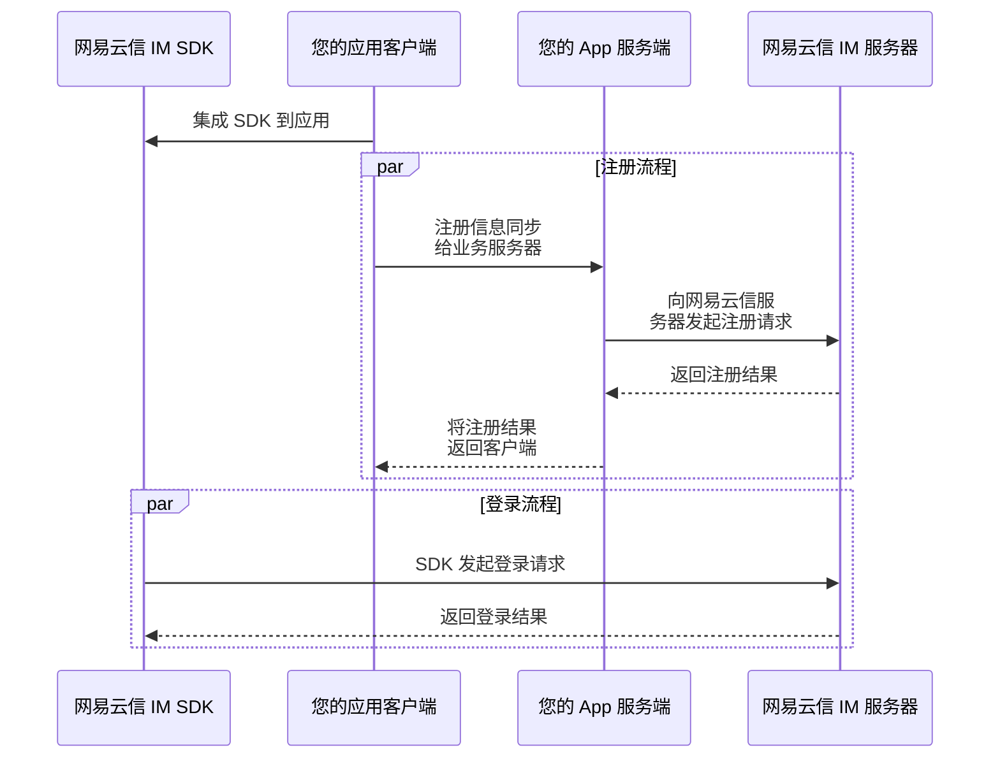

<!--keywords: 注册账号,网易云信 IM 账号,IM 账号,账号集成,IM 账号,账号管理,IM 账号管理 -->

本文介绍如何通过网易云信服务端 API 创建一个 IM 账号，以及相关的常见问题。

## 接口描述

该接口用于将当前应用自身账号导入网易云信 IM 系统，为其创建一个对应的网易云信系统内部账号 ID（以下称 **`account_id`**），使得该账号可使用 IM 功能。

创建 IM 账号时会自动创建用户资料。

一种典型的 IM 账号注册与初次登录的流程如下：



::: note important
- 通过服务端 API 创建的账号不会在 [网易云信控制台](https://app.yunxin.163.com/global/home) 显示，因此注册成功后，请务必记录网易云信将返回的账号信息，在开发者自身的应用服务器上维护储存。
- 通过服务端 API 创建账号时，网易云信服务端会对 `account_id` 参数做小写转换，请注意以 API 返回的 `account_id` 为准，以免登录失败。
:::

## 调用频率

单个应用默认最高调用频率请参考 [频控说明](https://doc.yunxin.163.com/messaging2/server-apis/DUzNjAzMTc)。

<style>
table th:first-of-type {
    width: 20%;
}
</style>

## 请求信息

### 请求 URL

```
POST https://{endpoint}/im/v2/accounts
```

:::note note
请求 URL 中的 `{endpoint}` 代表服务地址域名，您可以根据用户服务区域选择中国大陆和海外服务地址，并支持搭建高可用主备域名机制。详情请参考 [调用方式](https://doc.yunxin.163.com/messaging2/server-apis/zcwODA3MTU?platform=server#%E6%9C%8D%E5%8A%A1%E5%9C%B0%E5%9D%80) 服务地址章节。
:::

### 请求头参数

请求 Header 的参数说明请参考 [请求 Header](https://doc.yunxin.163.com/messaging2/server-apis/zcwODA3MTU#请求头)。

### 请求体参数

参数名称 | 类型 | 是否必选 | 说明 | 默认值
---- | ---- | ---- | ---- | ---- |
`account_id` | String | 是 | IM 账号，请确保唯一性。</li><li>若涉及字母，传参时请一律小写处理。因此以返回结果中的 account_id 为准。</li><li>只允许字母、数字、半角下划线、@、半角点以及半角横线。</li><li>长度上限为 32 位字符。</li> | 无
`token` | String | 否 | IM 账号对应的登录密钥 Token。</li><li>如果未指定，网易云信会自动生成 Token，并在创建账号成功后返回。</li><li>Token 如果没有更新，将永久有效。</li><li>长度上限 128 位字符。 | -
`configuration` | Object | 否 | IM 账号配置项。 | -
 `enabled` | Boolean | 否 | 该账号是否可用。默认可用，若设为 false，则表示禁用该账号。</li><li>禁用后账号无法登录，且该账号不能进行任何 IM 账号相关操作，调用相关接口会报错。</li><li>被禁用的账号仍计入应用账号总数。 | true
 `p2p_chat_banned` | Boolean | 否 | 单聊禁言标记。true：禁言。 | false
 `team_chat_banned` | Boolean | 否 | 群聊禁言标记。true：禁言。 | false
 `chatroom_chat_banned` | Boolean | 否 | 聊天室禁言标记。true：禁言。 | false
 `qchat_chat_banned` | Boolean | 否 | 圈组禁言标记。true：禁言。 | false
`user_information` | Object | 否 | 用户信息。 | -
 `name` | String | 否 | 用户昵称。<li>长度上限 64 位字符。</li><li>需要通过反垃圾审核。</li> | -
 `avatar` | String | 否 | 用户头像的 URL 地址，例如 "https://netease/xxx.png"。<li>长度上限 1024 位字符，可设置为空字符串。</li><li>需要通过反垃圾审核。 | -
 `sign` | String | 否 | 用户签名。<li>长度上限 256 位字符，可设置为空字符串。</li><li>需要通过反垃圾审核。</li> | -
 `email` | String | 否 | 用户邮箱地址。<li>需符合邮箱字符规则，例如 "zhangsan@xx.com"，可设置为空字符串。</li><li>长度上限 64 位字符。</li><li>需要通过反垃圾审核。</li> | -
 `birthday` | String | 否 | 用户生日，例如 "xxxx-xx-xx"。<li>长度上限 16 位字符，可设置为空字符串。</li><li>需要通过反垃圾审核。</li> | -
 `mobile` | String | 否 | 用户手机号码。<li>长度上限 32 位字符，可设置为空字符串。<li>非中国大陆手机号码需要填写国家代码（如美国：+1-xxxxxxxxxx）或地区代码（如香港：+852-xxxxxxxx）。 | -
 `gender` | Integer | 否 | 用户性别，0-未知，1-男，2-女。 | 0
 `extension` | String | 否 | 预留给开发者的扩展字段，建议封装成 JSON 格式，{key:value}。<li>长度上限 1024 位字符。</li><li>需要通过反垃圾审核。</li> | -
 `email_validation_mode` | Integer | 否 | 用户信息校验模式。0：默认当前校验模式；1：扩展校验模式，包括特殊字符和拉丁字符；2：不校验，不建议用该模式，可能会导致未知显示问题。 | 0
 `antispam_configuration` | Object | 否 | 安全通相关配置项。 | -
  `enabled` | Boolean | 否 | 是否使用安全通，默认为 true，即对于开启安全通功能的用户，默认使用安全通。如果需要设置单条消息不经过安全通，则设置为 fasle。如果未开启安全通功能，则该字段无效。 | true
  `business_id_map` | Array of objects | 否 | 安全通业务 ID 列表。 | -
   `type` | Integer | 是 | 检测类型，1 为文本。2 为图片。 | -
   `business_id` | String | 是 | 安全通业务 ID。 | -

### 请求体示例

```JSON
{
  "account_id": "string",
  "token": "string",
  "configuration": {
    "enabled": true,
    "p2p_chat_banned": false,
    "team_chat_banned": false,
    "chatroom_chat_banned": false,
    "qchat_chat_banned": false
  },
  "user_information": {
    "name": "string",
    "avatar": "http://dummyimage.com/100x100",
    "sign": "string",
    "email": "l.bxyuulbt@qq.com",
    "birthday": "1974-12-27",
    "mobile": "13355645597",
    "gender": 0,
    "extension": "string",
    "email_validation_mode": 0
  }
}
```

## 响应信息

### 响应头参数

响应 Header 的参数说明请参考 [响应 Header](https://doc.yunxin.163.com/messaging2/server-apis/zcwODA3MTU#响应头)。

### 响应体参数

参数名称 | 类型 | 说明 | 是否必返回 |
---- | ---- | ---- | ----
`code` | Integer | 状态码，200 表示请求成功。 | 是
`msg` | String | 提示信息。请求失败时返回错误信息，请求成功时返回 "success"。 | 是
`data` | Object | 返回的 JSON 数据对象，请求失败则返回空对象。 | 是 |
 `account_id` | String | IM 账号 ID。 | 否
 `token` | String | IM 账号对应的登录密钥。 | 否
 `configuration` | Object | 用户账号配置项。 | 否
  `enabled` | Boolean | IM 账号的是否可用。禁用后账号无法登录（仍计入应用账号总数），且该账号不能进行任何 IM 账号相关操作，调用相关接口会报错。 | 否
  `p2p_chat_banned` | Boolean | 单聊禁言标记。true：禁言。 | 否
  `team_chat_banned` | Boolean | 群聊禁言标记。true：禁言。 | 否
  `chatroom_chat_banned` | Boolean | 聊天室禁言标记。true：禁言。 | 否
  `qchat_chat_banned` | Boolean | 圈组禁言标记。true：禁言。 | 否
  `push_enabled_when_desktop_online` | Boolean | 桌面端在线时是否允许移动端推送（默认为 true），当设备有登录记录时才支持设置，否则无法修改。 | 否
 `user_information` | Object | 用户信息。 | 否
  `name` | String | 用户昵称。 | 否
  `avatar` | String | 用户头像的 URL 地址。 | 否
  `sign` | String | 用户签名。 | 否
  `email` | String | 用户邮箱地址。 | 否
  `birthday` | String | 用户生日。 | 否
  `mobile` | String | 用户手机号码。 | 否
  `gender` | Integer | 用户性别，0-未知，1-男，2-女。 | 否
  `extension` | String | 预留给开发者的扩展字段，建议封装成 JSON 格式。 | 否

### 响应体示例

```json
{
    "code": 200,
    "msg": "success",
    "data": {
        "account_id": "zhangsan",
        "token": "abcdef",
        "configuration": {
            "enabled": true,
            "p2p_chat_banned": false,
            "team_chat_banned": false,
            "chatroom_chat_banned": false,
            "qchat_chat_banned": false,
            "push_enabled_when_desktop_online": true
        },
        "user_information": {
            "name": "zhangsan",
            "avatar": "http://xxxx.xx/x.png",
            "sign": "Hello World",
            "email": "zhangsan@corp.xx.com",
            "birthday": "xxxx-xx-xx",
            "mobile": "13312345678",
            "gender": 2,
            "extension": "xxxx"
        }
    }
}
```

## 错误码

本文仅列举部分业务接口错误码，完整列表请参考客户端 API [错误码](https://doc.yunxin.163.com/messaging2/client-apis/DUxNjU3MzU?platform=client)。<!-- IM V10 -->

| 错误码 | 错误码描述 | 错误信息示例 |
| ---- | ---- | ---- |
| 102405 | 用户已存在 | account already exists |
| 102434 | 超过最大账号数 | limit of accounts exceeded |
| 102449 | 账号请求需要重试 | account operation need retry |
| 103451 | 用户资料反垃圾 | user profile hit antispam |
| 200 | 请求成功 | success |
| 403 | 鉴权失败 | authentication failed |
| 414 | 参数错误 | parameter error |
| 500 | 服务器内部错误 | internal server error |

## 相关接口

网易云信 IM 账号的移动端推送配置（默认 true，即当桌面端在线时，允许移动端推送），只有登录后才能修改，因此无法在注册账号时设置。用户需要先登录 IM，再调用 [更新移动端推送配置](https://doc.yunxin.163.com/messaging2/server-apis/zU3OTk0MTg) 或 [更新账号属性](https://doc.yunxin.163.com/messaging2/server-apis/TgwNTIyODk) 接口修改移动端推送配置。

## 常见问题

### **已有大量用户账号的应用，如何进行账号集成？**

对于已经存在大量用户账号的应用，如果需要接入网易云信 IM 服务，网易云信推荐遵从 **按需创建** 的原则。

考虑到存量账号中可能存在相当比例的僵尸用户或非活跃用户，在迁入网易云信时直接全量导入对您是一种不必要的开销。您可以在用户第一次触发使用网易云信的 IM 行为时检查该用户的是否已创建 IM 账号（`account_id`），如未创建则通过后台自动创建再登录，这种方式会使您的用户只有在必要的时候才创建网易云信的 IM 账号，同时在网易云信中创建的用户都是有效的活跃用户。

### **为什么不能通过客户端 SDK 创建账号，必须要通过服务端创建？**

网易云信的账号体系和应用的账号体系是业务绑定的关系，通过应用服务端才能创建网易云信 IM 账号可以有效控制账号的创建行为，任何应用的客户端都存在被破解的风险，如果直接通过客户端就可以创建网易云信 IM 账号可能会使您的应用出现被盗刷账号的情况（可能友商提供类似的客户端接口，使您在开发时节省了几行代码，但是为您的应用安全埋下了风险的种子）。

### **通过网易云信服务端 API 注册的 IM 账号可否在网易云信控制台中查看？**

通过网易云信服务端注册的账号不会出现在 [网易云信控制台](https://app.yunxin.163.com/global/home)。

这么做的原因是：
- 控制台提供的用户列表只是部分用户列表，是为了方便您在接入网易云信 IM 服务的过程中，在没有服务端开发的情况下快速进行客户端集成的调试。您可以在 [网易云信控制台](https://app.yunxin.163.com/global/home) 上快速的创建测试账号，并在客户端上登录测试。
- 通过网易云信服务端 API 创建的账号在 [网易云信控制台](https://app.yunxin.163.com/global/home) 不显示，是为了保护用户的隐私及账号安全，以免出现误操作，例如对用户进行不当的禁用或其他操作。

### **注册账号后如何查询/更新姓名等用户信息？**

可以通过调用 [用户名片](https://doc.yunxin.163.com/messaging2/server-apis/TA0NzYzNjk) 相关接口进行查询或更新用户信息，包括用户昵称、年龄、性别等信息。