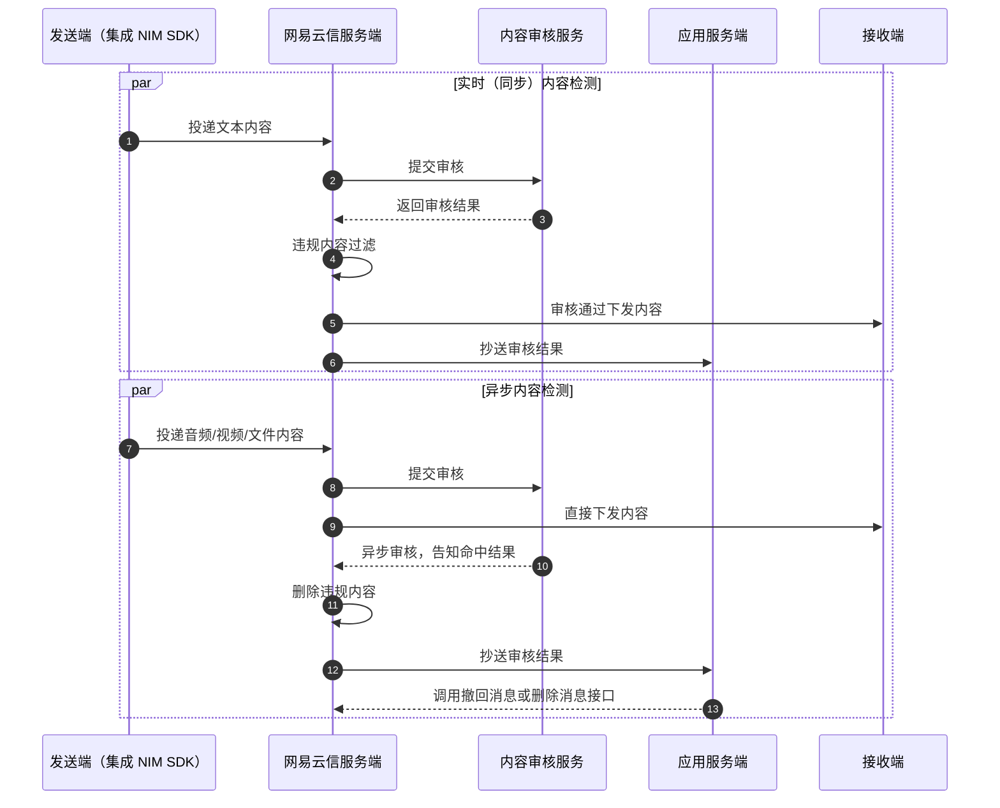

目前网易云信支持三类内容审核功能，分别为客户端本地反垃圾、安全通与客户自定义反垃圾。

## 支持平台

本文内容适用的开发平台或框架如下表所示，涉及的接口请参考下文 [相关接口](#相关接口) 章节：

安卓 | iOS | macOS/Windows | Web/uni-app/小程序 | Node.js/Electron | 鸿蒙 | Flutter
:----: | :----: | :----: | :----: | :----: | :----: | :----:
✔️️️️️️️ | ✔️️️️️️️ | ✔️️️️️️️ | ✔️️️️️️️ | ✔️️️️️️️ | ✔️️️️️️️ ️️️️ | -

## <span id="客户端本地反垃圾">客户端反垃圾</span>

客户端反垃圾是指在本地发送文本消息前，由客户端先对内容进行审查，并根据审查结果，决定是否投递、替换消息。反垃圾规则支持关键字和正则表达式两种匹配方式。登录客户端时，NIM SDK 会自动向网易云信服务端获取反垃圾词库。

### 适用条件

- 客户端本地反垃圾可用于对单聊、群聊和聊天室的文本消息进行内容安全检测。如需检测图片、音视频等其他类型的消息，请使用 [安全通](#安全通)。

- 客户端反垃圾功能仅适用于 **2024 旗舰版** 及其以上版本套餐。如果您有需要，可在线升级账号套餐。

### 开通功能

1. 在 [网易云信控制台](https://app.yunxin.163.com/global/home) 首页 **应用管理** 中选择应用。

2. 单击 **IM 即时通讯** 下的 **功能配置** 按钮进入功能配置页。

    

2. 顶部选择 **全局功能** 页签，开通 **客户端反垃圾** 功能。

    

3. 阅读并确认信息后，单击 **确认**。

4. 开通后，单击 **子功能配置** 配置反垃圾词库。

    

    替换/拦截规则 | 说明
    ---- | ----
    本地拦截库 | 客户端检测到文本消息存在敏感词汇后，直接拦截违规文本消息。发送者将收到对应的警告或提示，一般对应等级最高的违规，如消息存在涉政、反动内容。
    本地替换库 | 客户端将检测到的敏感词汇替换成指定的文本，再将替换后的消息发送给服务器。
    服务端拦截库 | 检测到敏感词汇后，网易云信服务器拦截涉及的违规消息。违规消息仅对发送者可见，接收方无法收到违规消息。一般对应消息存在广告等违规场景。

5. 完成配置后单击 **发布词库** 将反垃圾词库下发到客户端 SDK。

### **方式一：发送消息时自动检测**

用户登录后发送消息时，配置消息发送参数 `V2NIMSendMessageParams.clientAntispamEnabled = true` 及替换词 `V2NIMSendMessageParams.clientAntispamReplace`，NIM SDK 内部会自动进行反垃圾检测，并在发送回调中返回相应检测结果。

::: note note
Web 端需要在初始化时提前设置好 `V2NIMClientAntispamUtilConfig`，否则设置的消息发送参数将无效，消息发送时不会自动检测。
```
"V2NIMClientAntispamUtilConfig":{
   "enable": true
  }
```
:::

### **方式二：手动调用检测接口**

如需更灵活地控制检测流程，可以先调用 `checkTextAntispam` 方法进行检测，然后根据检测结果决定是否发送消息：

:::::: div linked-codes
::: code 安卓
```Java
V2NIMClientAntispamResult res = V2NIMClientAntispamUtil.checkTextAntispam('bad sentense', '***')
```
:::
::: code iOS
```Objective-C
V2NIMClientAntispamResult *res = [V2NIMClientAntispamUtil checkTextAntispam:@"bad sentense" replace:@"***"];
```
:::
::: code macOS/Windows
```C++
auto result = V2NIMClientAntispamUtil::checkTextAntispam("spam text", "*");
```
:::
::: code Web/uni-app/小程序
```TypeScript
const res = nim.V2NIMClientAntispamUtil.checkTextAntispam('bad sentense', '***')
```
:::
::: code Node.js/Electron
```TypeScript
const result = v2.clientAntispamUtil.checkTextAntispam(text, replace)
```
:::
::: code 鸿蒙
```TypeScript
const res = nim.localAntispamUtil.checkTextAntispam('bad sentense', '***')
```
:::
::::::

### 审核结果

- 如果命中客户端本地反垃圾，SDK 接口会回调结果 [`V2NIMClientAntispamResult`](https://doc.yunxin.163.com/messaging2/client-apis/DAxNjk0Mzc?platform=client#V2NIMClientAntispamResult)，请根据审核结果修改命中词。
- 如果命中并配置了服务端拦截，那么在发送消息前，需要配置消息发送参数 `V2NIMSendMessageParams.clientAntispamEnabled` = true，如果不设置，服务器不会进行拦截。并提前设置命中替换词 `V2NIMSendMessageParams.clientAntispamReplace`。
- 如果命中并配置了服务端拦截以及 [开通 IM 消息抄送](https://doc.yunxin.163.com/messaging2/server-apis/jY5MDk1NTQ?platform=server)，IM 消息抄送会通过 `antispam` 字段进行标记，请参考 [IM 其他抄送](https://doc.yunxin.163.com/messaging2/server-apis/TcxNzU4NzU?platform=server)。

## <span id="安全通">安全通反垃圾</span>

安全通（又称 **易盾反垃圾**）是网易云信提供的内容安全增值业务，为您提供全方位的内容安全检测服务。开通安全通功能并配置安全通检测规则后，指定类型的消息都会先经由安全通进行内容安全检测，之后才会转发给接收端的应用用户。安全通目前支持单聊、群聊、聊天室和圈组的文本消息、图片消息、自定义消息以及用户头像和用户资料等类型的内容安全检测。

更多 IM 安全通的功能介绍，请参考 [安全通概述](https://doc.yunxin.163.com/messaging/server-apis/Dg0NDY2NzY?platform=server)。

### 技术原理

网易云信 IM 实现安全通反垃圾的技术原理如下图所示，若您需要网易云信服务器将审核结果抄送到您的应用服务器，即流程 6 和流程 12，请开通 [异步反垃圾抄送](https://doc.yunxin.163.com/messaging/server-apis/TcxNzU4NzU?platform=server#%E6%98%93%E7%9B%BE%E5%BC%82%E6%AD%A5%E5%8F%8D%E5%9E%83%E5%9C%BE%E6%8A%84%E9%80%81)。



<!--  -->

### 准备阶段

前往网易云信控制台 [开通安全通](https://doc.yunxin.163.com/messaging/server-apis/jYxOTcyNzY?platform=server)。

### 运行阶段

开通安全通服务后，调用发送消息方法 `sendMessage` 时配置相关参数 `antispamConfig` 可实现消息安全通审核。

单聊群聊等指定类型的消息会根据检测规则进行内容安全检测。除此之外，自定义消息如果需要经过安全通检测，请参考以下方式进行配置。

如果需要对 **自定义消息** 进行安全通检测，需要对即将发送的消息配置 `antispamConfig` 属性。

其中，`antispamCustomMessage` 参数用于自定义消息中需要反垃圾的内容，必须是 JSON 格式，长度不超过 5000 字节。

格式如下:

```JSON
{
    "type": 1, //1:文本，2：图片
    "data": "" //文本内容 or 图片地址
}
```

### 获取审核结果

匹配消息体命中敏感词后，可通过返回结果中的 `antispamResult` 字段通知客户端反垃圾结果。

只有被安全通拦截的消息才会有 `antispamResult` 字段返回。对于疑似消息根据网易云信控制台设置的策略来判断，如果疑似消息被拦截会有该字段返回，如果疑似消息放行则没有该字段返回。

返回的审核结果 `antispamResult` 为 JSON 字符串格式，请自行解析或者反转成 JSON 对象使用。

antispamResult 字段定义如下：

<table>
<thead><tr><th style="width:100px">名称</th><th style="width:100px">类型</th><th>说明</th></tr></thead>
<tr><td> code </td><td>Integer</td><td>状态码：<ul><li>200：易盾内容审核结果返回正常</li><li>404：易盾反回的内容审核结果为空，该情况下该字段中无 `code` 以外的字段</li><li>414：易盾返回的内容审核结果过长，该情况下该字段中无 `ext` 字段</li></ul></td></tr>
<tr><td> type </td><td>String</td><td>内容审核类型<ul><li>text：文本</li><li>image：图片</li></ul></td></tr>
<tr><td> version </td><td>String</td><td>易盾内容审核的接口版本</td></tr>
<tr><td> taskId </td><td>String</td><td>审核任务的 ID</td></tr>
<tr><td> suggestion </td><td>Integer</td><td> 建议处理方式<ul><li>0：通过</li><li>1：嫌疑，建议人工复审</li><li>2：不通过</li></td></tr>
<tr><td> status </td><td>Integer</td><td>内容审核请求结果<li>2：检测成功<li>3：检测失败<note type=note>只有图片审核（type="image"）时才返回该字段。</td></tr>
<tr><td> ext </td><td>String</td><td>内容审核结果，对应易盾的 result 字段，result 字段详情参考 <a href="https://support.dun.163.com/documents/588434200783982592?docId=791131792583602176#%E5%93%8D%E5%BA%94" target="_blank">易盾文档</a>（注：本链接仅以 <b>单次同步文本检测的 result 字段说明</b> 为例）</td></tr>
</table>

:::note notice
语音、视频消息进行安全通反垃圾时，是异步检测的，并且检测结果是通过 IM 抄送通知开发者服务器。虽然命中后网易云信会自动删除服务器上的文件，但是在检测结果出来之前，消息可能已经被投递到接收方。因此如果开发者收到命中抄送后，对于单聊和群消息，请通过 IM 服务端接口进行 [撤回/删除消息](https://doc.yunxin.163.com/messaging2/server-apis/jAwNTEzODQ?platform=server2)。对于聊天室消息，请通过 IM 服务端接口 [撤回/删除聊天室历史消息](https://doc.yunxin.163.com/messaging2/server-apis/Tk5MTE3MDY?platform=server#%E8%81%8A%E5%A4%A9%E5%AE%A4%E6%B6%88%E6%81%AF%E6%92%A4%E5%9B%9E)。
:::

### 安全通重要参数

| 参数 | 类型 | 说明 |
| ---- | ---- | ---- |
| antispamExtension | 易盾反垃圾扩展字段 | 透传给易盾的反垃圾含圈组版的检测参数，具体请参考 [易盾的反垃圾含圈组版用户可扩展参数](https://support.dun.163.com/documents/588434200783982592?docId=476559002902757376#/%E7%94%A8%E6%88%B7%E6%89%A9%E5%B1%95%E5%8F%82%E6%95%B0)，格式为 JSON，长度限制 1024 <note type="note">反作弊相关的 email、phone、token、extension，抄送到 yidunAntiCheating。其他用户增值信息，抄送到 yidunAntiSpamExt。</note> |
| antispamResult | 易盾反垃圾结果 | 易盾反垃圾触发时返回的结果字段，格式为 JSON |
| antispamCheating | 易盾反作弊字段 | 透传给易盾的反作弊检测参数，格式为 JSON，长度限制 1024，具体请参考 [文本防刷版开发文档](https://support.dun.163.com/documents/2018041901?docId=420802794453520384#%E6%AD%A5%E9%AA%A42%EF%BC%9A%E6%8E%A5%E5%85%A5%E6%96%87%E6%9C%AC%E6%A3%80%E6%B5%8Bapi,%E4%BC%A0%E5%85%A5%E5%8F%8D%E4%BD%9C%E5%BC%8Atoken%E5%AD%97%E6%AE%B5) <note type="note">反作弊相关的 email、phone、token、extension，抄送到 `antispamCheating`。其他用户增值信息，抄送到 `antispamExtension`。</note> |

## <span id="自定义反垃圾">自定义反垃圾</span>

如果您的应用已接入第三方内容安全审核服务（第三方反垃圾服务），您可通过网易云信服务端的 [第三方回调](https://doc.yunxin.163.com/messaging/server-apis/jI3ODc2ODE?platform=server) 服务来实现第三方反垃圾，即发送方发送消息后先过第三方内容安全审核后再判断是否投递至接收方。

## 相关信息

[反垃圾相关错误码](https://doc.yunxin.163.com/messaging2/client-apis/DUxNjU3MzU?platform=client#反垃圾错误)

## 相关接口

API | 说明
--- | ---
[`checkTextAntispam`](https://doc.yunxin.163.com/messaging2/client-apis/DAxNjk0Mzc?platform=client#V2NIMClientAntispamUtil) | 对输入的文本进行本地反垃圾检查
[`V2NIMMessage`](https://doc.yunxin.163.com/messaging2/client-apis/DAxNjk0Mzc?platform=client#V2NIMMessage) | 消息对象
[`sendMessage`](https://doc.yunxin.163.com/messaging2/client-apis/zIwODM2NTM?platform=client#sendMessage) | 发送消息
[`V2NIMMessageAntispamConfig`](https://doc.yunxin.163.com/messaging2/client-apis/DAxNjk0Mzc?platform=client#V2NIMMessageAntispamConfig) | 消息反垃圾配置
[`V2NIMSendMessageResult`](https://doc.yunxin.163.com/messaging2/client-apis/DAxNjk0Mzc?platform=client#V2NIMSendMessageResult) | 消息发送成功结果