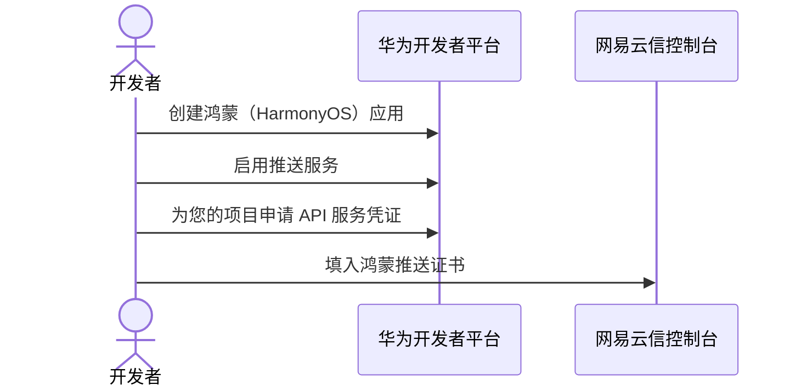

网易云信即时通讯 SDK（简称 NIM SDK）鸿蒙版自 v0.6.0 起支持鸿蒙推送服务。本文主要介绍如何集成鸿蒙的离线推送通道，使消息通过鸿蒙推送服务离线推送至未在线的用户。整体流程如下所示：



## 第一步：创建鸿蒙应用

若您已在华为开发者平台开通鸿蒙推送服务，则忽略该步骤。具体信息请参考鸿蒙推送文档 [Push Kit（推送服务）](https://developer.huawei.com/consumer/cn/doc/harmonyos-guides/push-kit-guide)。

1. 在华为开发者平台注册开发者账号并完成认证，详情请参考 [华为开发者账号注册指南](https://developer.huawei.com/consumer/cn/doc/start/registration-and-verification-0000001053628148?ha_linker=eyJ0cyI6MTcwNTI4MzU5ODg5MiwiaWQiOiJlYTRjNTAyOWY4YmFiMjhkMmY5ZjZhYTg5YTkyNzM3MSJ9)。

2. 登录华为开发者平台，[创建华为项目](https://developer.huawei.com/consumer/cn/doc/app/agc-help-createproject-0000001100334664?ha_linker=eyJ0cyI6MTcwNTI4MzYxMDE3NSwiaWQiOiJlYTRjNTAyOWY4YmFiMjhkMmY5ZjZhYTg5YTkyNzM3MSJ9)。

    

3. 在当前项目下，[创建 HarmonyOS 应用](https://developer.huawei.com/consumer/cn/doc/app/agc-help-create-app-0000002247955506)，创建好之后获取应用包名称。

    

    :::note note
    创建 HarmonyOS NEXT 应用，而非 Android 应用。
    :::

## 第二步：启用推送服务

在 [华为 AppGallery Connect 平台](https://developer.huawei.com/consumer/cn/service/josp/agc/index.html) 中，选择当前项目，单击左侧 **推送服务** 并开通。具体请参考 [开通推送服务](https://developer.huawei.com/consumer/cn/doc/harmonyos-guides/push-config-setting)。


## 第三步：配置调试签名

支持自动签名和手动签名两种方式。

从 DevEco Studio 6.0.0 Beta5 版本开始，鸿蒙新增自动签名功能，在注册应用时配置即可。


本节主要说明如何完成手动签名，具体请参考 [手动签名](https://developer.huawei.com/consumer/cn/doc/harmonyos-guides/ide-signing#section297715173233)。

1. 生成密钥和证书请求文件。

    1. 在主菜单栏单击 **Build > Generate Key and CSR**。
    2. 在 **Key store file** 中，可以单击 **Choose Existing** 选择已有的密钥库文件（存储有密钥的.p12文件）；如果没有密钥库文件，单击 **New** 进行创建。

        

        

        创建 CSR 文件成功，可以在存储路径下获取生成的密钥库文件（.p12）、证书请求文件（.csr）和 material 文件夹（存放签名方案相关材料，如密码、证书等）。

        ::: note note
        Key store file：设置密钥库文件存储路径，并填写 p12 文件名，如 cert/yxhm.p12。
        :::

2. 创建证书和描述文件。

    1. 在 [华为 AppGallery Connect 平台](https://developer.huawei.com/consumer/cn/service/josp/agc/index.html) 中，选择当前项目，单击左侧 **证书、APP ID和Profile > 证书**，进入证书页面，点击 **新增证书**。

        

        
    
    2. 进入 Profile 页面，点击 **添加** 新增描述文件。

        

    3. 进入设备页面，点击 **添加设备** 新增调试设备。

        

3. 配置应用签名。

    

    ::: note note
    建议将下载的证书和描述文件放到项目目录下，指定相对路径。
    :::

## 第四步：申请 API 服务凭证

1. 登录 [华为开发者官网](https://developer.huawei.com/consumer/cn/doc/start/api-0000001062522591#section11695162765311)，确保华为项目、HarmonyOS 应用已创建完毕。

2. 进入 [管理中心](https://developer.huawei.com/consumer/cn/console/overview)，依次单击 **API 服务 > 我的 API > 新增 HMS API 服务**，然后选择 **推送服务**。

    

3. 创建 [API 服务凭证](https://developer.huawei.com/consumer/cn/doc/start/api-0000001062522591#section1392201118153)，单击 **凭证** > **服务账号密钥** > **创建凭证**，选择创建 **服务账号密钥** 类型凭证。

    

    :::note note
    若创建步骤不适用，最新步骤需参考 [创建服务账号密钥](https://developer.huawei.com/consumer/cn/doc/start/api-0000001062522591#section11695162765311)。在华为开发者的 API Console 上创建并下载服务账号密钥文件，相关创建步骤及支持此类鉴权的公开 API 类型请参考 [API Console 操作指南](https://developer.huawei.com/consumer/cn/doc/start/api-0000001062522591#section11695162765311)。
    :::

    <a id="key"></a>

    创建完之后下载 JSON 文件，以下为一个 **服务账号密钥** 文件示例，您需要按照一定格式在网易云信控制台的应用配置中填入，映射关系请参考下文 [第四步：添加鸿蒙推送证书](#config)。

    ```JSON
    {
        "project_id": "xxxxxxxxxxxxxx",
        "key_id": "xxxxxxxxxxxxxxxxx",
        "private_key": "MIIJQgIBADANB 此处省略较多字符 MYT76N4WB3Y8PZV6p5gMMQ== ",  //注意您需要去掉首尾的换行符，仅保留中间字段
        "sub_account": "101783233",
        "auth_uri": "https://oauth-login.cloud.huawei.com/oauth2/v3/authorize",
        "token_uri": "https://oauth-login.cloud.huawei.com/oauth2/v3/token",
        "auth_provider_cert_uri": "https://oauth-login.cloud.huawei.com/oauth2/v3/certs",
        "client_cert_uri": "https://oauth-login.cloud.huawei.com/oauth2/v3/x509?client_id=101783233"
    }
    ```

    :::note notice
    创建的 **服务账号密钥**（即推送证书） 请谨慎保管，网易云信控制台需上传 **服务账号密钥** 部分信息才能实现离线推送能力。
    :::

## 第五步：添加鸿蒙推送证书

<a id="config"></a>

1. 登录 [网易云信控制台](https://app.yunxin.163.com/global/home)。

2. 在首页 **应用管理** 中选择应用进入 **应用配置** 页面。

2. 顶部选择 **证书管理** 页签，进入推送证书配置页。

3. 在对应的鸿蒙证书配置项中，单击 **添加证书**，配置推送相关信息。

    设置项 | 说明 | 示例 |
    --- | --- | --- |
    证书名称 | 名称需要与 NIM SDK 初始化时传入 `pushServiceConfig.harmonyCertificateName` 完全相同，上传的推送证书才会生效。 | `DEMO_HMOS_PUSH_xxx`
    应用包名 | 与华为 **AppGallery Connect** 中创建的 HarmonyOS 应用包名相同。 | - |
    ProjectId | [**服务账号密钥**](#key) 的 `project_id` 具体值，例如 `"project_id": "dev7519896637536769923"`。 |  `dev7519896637536769923`。
    KeyId | **服务账号密钥** 的 `key_id` 具体值，例如 `"key_id": "18366af0b4b44dd8bb4a77184d04704f"`。 | `18366af0b4b44dd8bb4a77184d04704f`
    SubAccount | **服务账号密钥** 的 `sub_account` 具体值，例如 `"sub_account": "101783233"`。 | `101783233`
    PrivateKey | **服务账号密钥** 的 `private_key` 具体值，例如 `----BEGIN PRIVATE KEY----\nMIIJQgIBADANB************MYT76N4WB3Y8PZV6p5gMMQ==\n----END PRIVATE KEY----\n`，注意您需要去掉首尾的换行符，仅保留中间字段。 | `XXXXXMIIJQgIBADANB************MYT76N4WB3Y8PZV6p5gMMQXXXXXX== `

    

4. 填写证书信息并上传后，单击 **确定**。