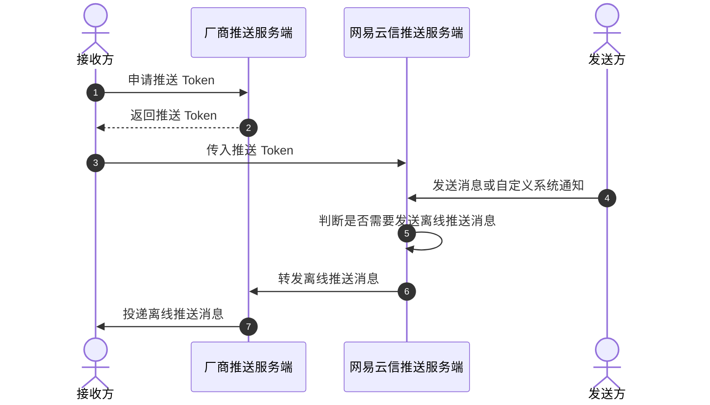

为了提高消息送达率，网易云信引入手机系统厂商推送。手机系统级别的厂商推送（如小米、华为、vivo、OPPO、魅族等安卓类厂商）的优势在于其拥有稳定的系统级长连接，可以做到随时接收推送。

## 适用场景

您可以通过集成各移动端设备厂商的原生推送 SDK，与 NIM Flutter SDK 搭配使用，实现离线推送功能。

实现离线推送消息功能后，当出现以下用户行为时，会触发离线推送，使用手机厂商系统级推送告知用户有消息需要接收：

- 当应用被切换到后台，并且 App 资源被系统回收时。
- 用户登录账号后，主动关闭 App 时。
- 网络不稳定等，导致 NIM SDK 无法与网易云信服务器保持正常连接时。

## 技术原理

网易云信 IM 实现离线推送的技术原理如下：



## 前提条件

在实现离线推送功能之前，请确保：

- **开发环境满足如下要求**：
  - Flutter-dart 3.0.0 ~ 4.0.0 版本
  - Android Studio 3.5 及以上版本
  - Android 5.0 API 19 及以上版本设备
  - 1.5.21 以上版本的 `kotlin-gradle-plugin`

- 已 [集成 Flutter SDK](https://doc.yunxin.163.com/messaging2/guide/DIyNzI1MDA?platform=client)。
- 在 [网易云信控制台](https://app.yunxin.163.com/global/home) 上，[创建应用](https://doc.yunxin.163.com/console/guide/TIzMDE4NTA?platform=console)，获取应用密钥（App Key）。
- 已 [注册 IM 账号](https://doc.yunxin.163.com/messaging2/guide/jU0Mzg0MTU?platform=client#4-注册-im-账号)，获取 IM 账号和 Token。

## 第一步：集成平台离线推送服务

请参考具体第三方厂商的推送集成文档，集成需要使用到的第三方厂商离线推送 SDK，接入各厂商的离线推送服务。

目前支持以下第三方推送厂商：

| 第三方推送厂商 | 当前兼容版本 | 集成指南 |
| :---- | :---- | :---- |
| 小米 | 6.0.1 | [集成小米推送](https://doc.yunxin.163.com/messaging/guide/zg2NDE4ODM?platform=android) |
| 华为 | 6.12.0.300 | [集成华为推送](https://doc.yunxin.163.com/messaging/guide/jg2ODQxMjU?platform=android)
| 荣耀 | 7.0.61.303 | [集成荣耀推送](https://doc.yunxin.163.com/messaging/guide/DMwMjc5MDM?platform=android)
| OPPO | 3.5.1 | [集成 OPPO 推送](https://doc.yunxin.163.com/messaging/guide/zI4ODc0MTE?platform=android)
| vivo | 4.0.4.0_504 | [集成 vivo 推送](https://doc.yunxin.163.com/messaging/guide/zY0MjM0OTc?platform=android)
| 魅族 | 4.3.0 | [集成魅族推送](https://doc.yunxin.163.com/messaging/guide/DcwMjI1MTI?platform=android)
| 谷歌 FCM | `firebase-bom:33.0.0`<br>`firebase-messaging：24.0.0`<br>`firebase-analytics: 22.0.0` | [集成谷歌推送](https://doc.yunxin.163.com/messaging/guide/zY2Nzc4MjY?platform=android)

## 第二步：集成 NIM Flutter SDK

请参考 [集成 NIM Flutter SDK](https://doc.yunxin.163.com/messaging2/guide/DIyNzI1MDA?platform=client) 完成 NIM Flutter SDK 的集成。

## 第三步：初始化 NIM SDK

在 [初始化 NIM SDK](https://doc.yunxin.163.com/messaging2/guide/zY5NTAzMTI?platform=client) 时，完成厂商的推送证书配置，并选择推送渠道。

1. 需要将推送证书的信息配置到初始化参数 [`NIMAndroidSDKOptions.mixPushConfig`](https://pub.dev/documentation/nim_core_v2/latest/nim_core_v2/NIMMixPushConfig-class.html) 中。

    :::::: div linked-codes
    ::: code 小米
    ```Dart
    final xmPushConfig = NIMMixPushConfig(
      xmAppId: '小米 AppId',
      xmAppKey: '小米 AppKey',
      xmCertificateName: '小米证书',
    );
    // 初始化时指定推送配置
    NimCore.instance.initialize(
      NIMAndroidSDKOptions(
        appKey: appKey,
        // 其他初始化参数
        // ...
        mixPushConfig: xmPushConfig,
      ),
    );
    ```
    :::
    ::: code 华为
    ```Dart
    final hwPushConfig = NIMMixPushConfig(
      hwAppId: '华为 AppId',
      hwCertificateName: '华为证书',
    );
    // 初始化时指定推送配置
    NimCore.instance.initialize(
      NIMAndroidSDKOptions(
        appKey: appKey,
        // 其他初始化参数
        // ...
        mixPushConfig: hwPushConfig,
      ),
    );
    ```
    :::
    ::: code 荣耀
    ```Dart
    final honorPushConfig = NIMMixPushConfig(
      honorCertificateName: '荣耀证书'
    );
    // 初始化时指定推送配置
    NimCore.instance.initialize(
      NIMAndroidSDKOptions(
        appKey: appKey,
        // 其他初始化参数
        // ...
        mixPushConfig: honorPushConfig,
      ),
    );
    ```
    :::
    ::: code vivo
    ```Dart
    final vivoPushConfig = NIMMixPushConfig(
      vivoCertificateName: 'vivo 证书',
    );
    // 初始化时指定推送配置
    NimCore.instance.initialize(
      NIMAndroidSDKOptions(
        appKey: appKey,
        // 其他初始化参数
        // ...
        mixPushConfig: vivoPushConfig,
      ),
    );
    ```
    :::
    ::: code OPPO
    ```Dart
    final oppoPushConfig = NIMMixPushConfig(
      oppoAppId: 'oppoAppId',
      oppoAppKey: 'oppoAppKey',
      oppoAppSecret: 'oppoAppSecret',
      oppoCertificateName: 'oppo 证书',
    );
    // 初始化时指定推送配置
    NimCore.instance.initialize(
      NIMAndroidSDKOptions(
        appKey: appKey,
        // 其他初始化参数
        // ...
        mixPushConfig: oppoPushConfig,
      ),
    );
    ```
    :::
    ::: code 魅族
    ```Dart
    final mzPushConfig = NIMMixPushConfig(
      mzAppId: 'mzAppId',
      mzAppKey: 'mzAppKey',
      mzCertificateName: 'mz 证书',
    );
    // 初始化时指定推送配置
    NimCore.instance.initialize(
      NIMAndroidSDKOptions(
        appKey: appKey,
        // 其他初始化参数
        // ...
        mixPushConfig: mzPushConfig,
      ),
    );
    ```
    :::
    ::: code 谷歌
    ```Dart
    // 传入网易云信控制台上配置的谷歌推送证书名，谷歌推送的 AppSecret 请在 AndroidManifest.xml 文件中配置
    final fcmPushConfig = NIMMixPushConfig(
      fcmCertificateName: 'fcm 证书',
    );
    // 初始化时指定推送配置
    NimCore.instance.initialize(
      NIMAndroidSDKOptions(
        appKey: appKey,
        // 其他初始化参数
        // ...
        mixPushConfig: fcmPushConfig,
      ),
    );
    ```
    :::
    ::::::

    :::note note
    推送证书名长度不超过 32 个字符，否则登录时会报错 500。
    :::

2. 选择推送渠道。

    - 如果 [`NIMAndroidSDKOptions.mixPushConfig.autoSelectPushType`](https://pub.dev/documentation/nim_core_v2/latest/nim_core_v2/NIMMixPushConfig/autoSelectPushType.html) 为 false（默认），则 SDK 直接选择服务端推荐的推送渠道。

    - 如果配置 `NIMAndroidSDKOptions.mixPushConfig.autoSelectPushType` 为 true，则 SDK 根据实际的 token 的获取情况确定推送渠道，此时服务端推荐的推送渠道为最高优先级。需要确定推送渠道时，先进行本地支持性判断，然后将向所有可能支持的推送厂商申请 token，并在成功拿到的 token 中选择优先级更高的渠道。

    :::note note
    SDK 默认 Google FCM 推送的优先级最低，即如果同时接入了 FCM 和其他厂商推送，则会优先走其他厂商推送通道。但是如果您的应用用户主要分布在海外，在 [网易云信控制台](https://app.yunxin.163.com/global/home) 已设置 **FCM 推送优先** （**控制台：应用详情 > 更多 > 证书管理**），那么同时接入 FCM 和其他厂商推送 SDK 的场景下，优先走 FCM 推送通道。
    :::

3. 对于 Android 平台，需要在原生 Android 代码中的 `Application#onCreate` 中启用荣耀和 OPPO 厂商的推送服务，即对荣耀、OPPO 推送服务进行初始化。其他厂商推送服务无需额外初始化，可忽略该步骤。

    :::::: div linked-codes
    ::: code 荣耀
    ```Java
    public class FlutterApplication extends Application {
        ...
        @Override
        public void onCreate() {
            ...
            if (NIMUtil.isMainProcess(this)) {
                ...
                // 在此处添加以下代码
                HonorPushClient.getInstance().init(getApplicationContext(), true);
                ...
            }
        }
    }
    ```
    :::
    ::: code OPPO
    ```Java
    public class FlutterApplication extends Application {
        ...
        @Override
        public void onCreate() {
            ...
            if (NIMUtil.isMainProcess(this)) {
                ...
                // 在此处添加以下代码
                com.heytap.msp.push.HeytapPushManager.init(this, true);
                ...
            }
        }
    }
    ```
    :::
    ::::::

    若您正确集成第三方推送（已传相关推送 `token` 至网易云信服务器），SDK 日志会打印以下相应记录。其中 `pushType` 或 `type` 表示推送类型（5 小米、6 华为、7 魅族、8 谷歌 FCM、9 vivo、10 OPPO、0 不支持），`tokenName` 表示推送证书名称，`token` 表示推送 token。

    ```Java
    [ui]mix_push: after login, mix push state=MixPushState{pushType=5, hasPushed=0, lastDeviceId=''}
    [ui]mix_push: commit mix push token:type 5 tokenName PUSH_CER_NAME token y7ssE..................sLxnU
    ```

## 第四步：测试离线推送

### **消息发送方**

发送消息或自定义通知给接收方（离线），具体的收发流程可参考 [消息收发](https://doc.yunxin.163.com/messaging2/guide/DYzMjA0Njc?platform=client) 和 [自定义通知收发](https://doc.yunxin.163.com/messaging2/guide/TYyNDk1ODk?platform=client)。

这里以发送文本消息为例，通过调用 `sendMessage` 实现。发送的消息默认需要推送，如需设置推送文案，推送角标，推送文案前缀等，请参考 [配置消息的推送属性](https://doc.yunxin.163.com/messaging2/guide/DYzMjA0Njc?platform=client)。

<!-- 这里的代码也太简单了 -->

```Dart
final textMessage =
    (await MessageCreator.createTextMessage('test text message')).data;
if (textMessage != null) {
  final params = NIMSendMessageParams(pushConfig: NIMMessagePushConfig(pushEnabled:true));
  final sendMessageResult = await NimCore.instance.messageService
      .sendMessage(message: textMessage, conversationId: 'conversationId', params: params);
  if (sendMessageResult.isSuccess) {
    print(
        'sendMessage result: ${sendMessageResult.isSuccess} data ${sendMessageResult.data?.toJson()}');
  }
}
```

### **消息接收方**

接收方将会在登录后接收到离线推送。

:::note note
- 离线推送支持配置免打扰时间，具体请参考 [设置推送全局免打扰](https://doc.yunxin.163.com/messaging/guide/DAwNTI5NjE?platform=flutter)。
- 离线推送支持配置多端推送策略，即支持推送至同一账号的多个客户端，具体请参考 [设置多端推送策略](https://doc.yunxin.163.com/messaging/guide/DI5MzY2NTk?platform=flutter)。
:::

## 第五步：（可选）关闭或开启离线推送

NIM SDK 的第三方推送服务功能默认开启，无需单独调用开启服务接口。若后续不想使用第三方推送服务，可调用安卓原生平台接口 [`enable`](https://doc.yunxin.163.com/messaging2/references/android/doxygen/Latest/zh/interfacecom_1_1netease_1_1nimlib_1_1sdk_1_1mixpush_1_1_mix_push_service.html#a30b0a583ee96874a154124ffa07004cb) 方法进行关闭。

```Java
NIMClient.getService(MixPushService.class).enable(false).setCallback(...)
```

## 相关参考

- [推送 payload 配置](https://doc.yunxin.163.com/messaging2/guide/DQyNjc5NjE?platform=server)

- [Android 推送问题排查](https://doc.yunxin.163.com/messaging2/guide/TQyOTE4Nzk?platform=client)

- 第三方厂商推送通道存在流控，具体请参考 [厂商推送通道限制说明](https://doc.yunxin.163.com/messaging/guide/DY1MzgzOTk?platform=android)

- 若您想直接使用 SDK 中注册的 Channel 来作为第三方厂商（小米、OPPO）的申请 Channel，可参考 [SDK 中的 Channel 信息](https://doc.yunxin.163.com/messaging/guide/DY4NzY5ODU?platform=android)

- [第三方推送厂商通道错误码参考](https://doc.yunxin.163.com/messaging/guide/DY4NzY5ODU?platform=android#%E5%8E%82%E5%95%86%E9%80%9A%E9%81%93%E9%94%99%E8%AF%AF%E7%A0%81%E6%96%87%E6%A1%A3)

## 常见问题

### 触发离线推送的条件是什么？

Android 切换到后台并且等 App 被系统回收时，或者用户主动关闭 App，才能触发推送条件。因此，若要测试 Android 推送问题，请登录后关闭 App，确保满足推送条件。

### 哪些场景下不会触发推送？

IM 账号未登录/已登出/被踢出，不会触发推送。App 在前台，也不会触发推送。用户登录 IM 账号，并且未主动登出或者没有被踢出，可能触发推送。