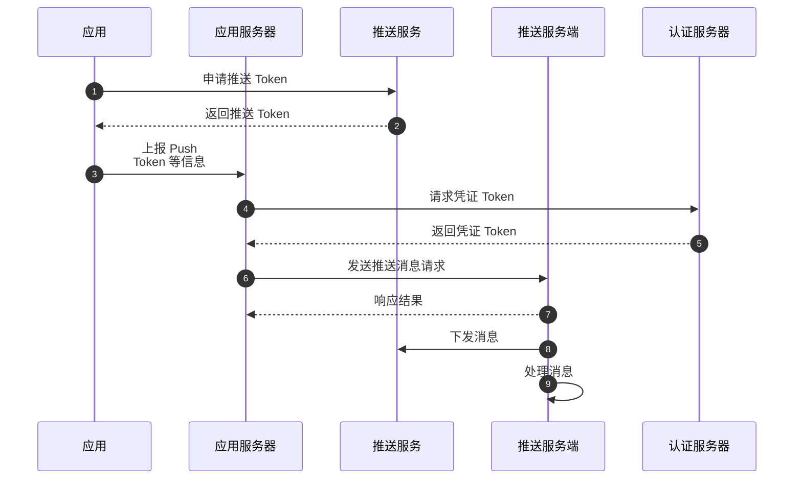

<!-- keywords: 离线推送,推送证书,APPID -->
<!-- description: 网易云信IM即时通讯离线推送功能,离线推送客户端开发指南-->

为了提高消息送达率，云信引入手机系统厂商推送。手机系统级别的厂商推送（如小米、华为、vivo、OPPO、魅族、鸿蒙等）的优势在于其拥有稳定的系统级长连接，可以做到随时接收推送。


## 功能概述

NIM SDK 支持华为鸿蒙 Push Kit 离线推送功能。

当用户清理掉应用进程（被冻结、主动关闭）、网络不稳定等导致客户端 SDK 无法与云信服务器保持正常连接时，此时云信服务端会通过华为鸿蒙 Push Kit 通道为目标用户发送离线推送的消息。

如果您需要通过云信向 App 发送离线推送，需要先向云信提供华为 API 库的**服务账号密钥**信息，授权云信服务端与 Push Kit 通信，从而实现离线推送功能。


## 技术原理

云信 IM 实现鸿蒙离线推送的技术原理如下：

<!--原图

-->

<!--  -->




## 前提条件

在实现“离线推送”功能之前，请确保：

- 开发环境要求：HarmonyOS NEXT 4.1 及以上版本。

- 已在云信控制台[创建应用](https://doc.yunxin.163.com/console/concept/TIzMDE4NTA?platform=console)（AppKey）并[注册云信 IM 账号](https://doc.yunxin.163.com/messaging2/quick-start/jU0Mzg0MTU?platform=client)（获取 accid 和 token）。

- 已准备好鸿蒙推送服务信息。

    - 已[注册华为开发者平台开发账号](https://developer.huawei.com/consumer/cn/doc/start/registration-and-verification-0000001053628148?ha_linker=eyJ0cyI6MTcwNTI4MzU5ODg5MiwiaWQiOiJlYTRjNTAyOWY4YmFiMjhkMmY5ZjZhYTg5YTkyNzM3MSJ9)。
    - 已[创建华为项目](https://developer.huawei.com/consumer/cn/doc/app/agc-help-createproject-0000001100334664?ha_linker=eyJ0cyI6MTcwNTI4MzYxMDE3NSwiaWQiOiJlYTRjNTAyOWY4YmFiMjhkMmY5ZjZhYTg5YTkyNzM3MSJ9)。
    - 已当前项目下[创建 HarmonyOS 应用](https://developer.huawei.com/consumer/cn/doc/app/agc-help-createapp-0000001146718717#section98313321213)。
      - 创建 HarmonyOS NEXT 应用，而非 Android 应用。
      - 自动或手动配置应用签名，可参考 [NIMSDK HarmonyOS Demo Github 仓库](https://github.com/netease-im/nim-harmony-demo/blob/main/README.md)。     
    - 已申请该项目 API 服务凭证[服务账号密钥](https://developer.huawei.com/consumer/cn/doc/start/api-0000001062522591#section11695162765311)。


## 实现流程

### 步骤 1：集成鸿蒙推送服务

请参考[创建鸿蒙推送证书](https://doc.yunxin.163.com/messaging2/guide/TkyNTI3OTg?platform=client)，上传鸿蒙推送证书，授权云信服务端与鸿蒙推送 Push Kit 通信。

### 步骤 2：集成 NIM SDK

请参考 [NIMSDK HarmonyOS Demo Github 仓库](https://github.com/netease-im/nim-harmony-demo/blob/main/README.md) 将 NIM SDK 集成至您的项目。

### 步骤 3：初始化 NIM SDK

1. 在项目文件中引入 NIMSDK。

    
    ```
    import { NIMInitializeOptions, NIMServiceOptions } from '@nimsdk/base'
    import { NIMSdk } from '@nimsdk/nim'
    import { NIMInterface } from '@nimsdk/base'
    ```
    

2. 调用 ```NIMSdk.newInstance``` 初始化 NIM SDK。在初始化参数 `NIMServiceOptions.pushServiceConfig.harmonyCertificateName` 中传入推送证书名称（对应云信控制台配置的推送证书）。

    ```
    // 证书名称设置与 NIM SDK 初始化配置
    const serviceOptions: NIMServiceOptions = {
      /*
      loginServiceConfig: {
        lbsUrls: ['https://imtest.netease.im/lbs/xxx'],
        linkUrl: 'weblink-harmony-xxx.netease.im:443'
      },
      */
      pushServiceConfig: {
        harmonyCertificateName: "DEMO_HMOS_PUSH_xxx"    // 需要与步骤 1 中上传的鸿蒙推送证书名称保持完全一致
      }
    }

    NIMSdk.newInstance(context, initializeOptions, serviceOptions)
    ```

    :::note note
    推送证书名称，不超过 32 个字符，否则登录时会报 500 错误。
    :::


### 步骤 4：获取鸿蒙通知许可

HarmonyOS 通知依赖 `notificationManager.requestEnableNotification()` 获取，单击"确定"后应用才可接受鸿蒙通知。云信离线推送必须在鸿蒙通知打开的情况下才可触达。请求通知权限的示例代码如下：

```
import { notificationManager } from '@kit.NotificationKit';

// Request permission to send notification.
notificationManager.requestEnableNotification().then(() => {
  console.info(`[ANS] requestEnableNotification success`);
}).catch((err:Base.BusinessError) => {
  console.error(`[ANS] requestEnableNotification failed, code is ${err.code}, message is ${err.message}`);
});
```

### 步骤 5：上传 pushToken 至云信服务器

NIM SDK 已对鸿蒙推送的 pushToken 上传进行封装，包括**登录后自动上传**和**手动开关鸿蒙推送上传**两种方式。

在依赖 NIM SDK 上传 pushToken 之前，用户可以使用[官方示例代码](https://developer.huawei.com/consumer/cn/doc/harmonyos-references/push-pushservice-0000001727929896#section163204312464)自行尝试获取鸿蒙推送 pushToken，只有在获取成功的情况下，才认为项目配置成功（官方表示模拟器暂不支持获取 pushToken）：

```
import pushService from '@hms.core.push.pushService';

try {
  const pushToken = await pushService.getToken();
  console.info("PushService", `Get push token successfully: ${pushToken}`)
} catch (err) {
  // fail
  let e: BusinessError = err as BusinessError;
  console.error("PushService", 'Get push token catch error: ' + e.code + ' ' + e.message);
}
```

对于 ```await pushService.getToken();``` 过程中出现的任何 ArkTS API 错误码均可参照 [ArkTS API错误码](https://developer.huawei.com/consumer/cn/doc/harmonyos-references/push-error-code-0000001727929904#section3835124673016%EF%BC%8C)排查问题。

- **登录后自动上传** ：NIM SDK 将在 IM 登录成功后，自动上报 pushToken。

    ```
    await nimsdk.loginService.login(this.userName, token, loginOption)
    // then, SDK 自动上传鸿蒙推送 token
    ```

- **手动开关鸿蒙推送上传**：NIM SDK 提供 `nimsdk.pushService`，支持用户调用 ```pushService.enable(boolean)``` 接口函数手动开/关鸿蒙推送的接收。

    ```
    // Enalbe harmony push
    await nimsdk.pushService.enable(true)

    // Disable harmony push
    await nimsdk.pushService.enable(false)
    ```

### 步骤 6：测试离线推送


**消息发送方：**

发送消息或自定义系统通知给接收方（离线），具体的收发流程可参考[消息收发](https://doc.yunxin.163.com/messaging2/guide/DYzMjA0Njc?platform=client)和[自定义系统通知收发](https://doc.yunxin.163.com/messaging2/guide/TYyNDk1ODk?platform=client)。
    
这里以发送文本消息为例，通过调用 ```messageService.sendMessage``` 实现。应鸿蒙推送规范，需要配置例如 `category` 为 IM 消息（若未配置将会被鸿蒙强制限制推送），NIM SDK 为每条消息提供了 `V2NIMMessagePushConfig` 配置项，以测试鸿蒙推送为例，消息的 `pushConfig` 可按照以下示例代码配置测试推送： 

```
let message: V2NIMMessage = messageCreator.createTextMessage("Test NIM sendMessage")

      // add push payload
      if (!message.pushConfig) {
        message.pushConfig = {} as V2NIMMessagePushConfig
      }
      message.pushConfig.pushPayload = `{"harmonyField":{"payload": {"notification": {"category": "IM","clickAction": {"actionType": 0}}},"pushOptions": {"testMessage": true}}}`
```


**消息接收方：**

接收方将会在登录后上报 pushToken，杀死应用后即可接收到离线推送。

<!--未实现

:::note note
- 离线推送支持配置免打扰时间，具体请参考[设置推送全局免打扰](https://doc.yunxin.163.com/messaging/guide/zQ1OTM1MTk?platform=iOS)。
- 离线推送支持配置多端推送策略，即支持推送至同一账号的多个客户端，具体请参考[设置多端推送策略](https://doc.yunxin.163.com/messaging/guide/zkwMTc0Mjg?platform=iOS)。
:::

-->

## 推送相关文档

- [推送 payload 配置](https://doc.yunxin.163.com/messaging/guide/DQyNjc5NjE?platform=server)


## 常见问题


### 触发离线推送的条件

Q：触发推送的条件是什么？

A：App 应用主动杀死，触发推送条件。因此，要测试推送问题，请登录后杀死 App。


### 不会触发推送的场景

Q：哪些场景下不会触发推送？


A: IM 账号未登录/已登出/被踢下线，不会触发推送。App 在前台，不会触发推送。用户登录 IM 账号，并且未主动登出或者没有被踢下线，可能触发推送。


### 个别用户推送异常

Q：对于同一个消息，其他用户的推送正常，为什么个别用户推送异常？

A：请确认以下三点：

- 发送者和接收者两者是否是好友关系，控制台是否有设置非好友关系允许发送消息。
- 双方是否有拉黑情况。
- 接收方是否有设置发送免打扰，如果是强制推送的情况下可忽略。