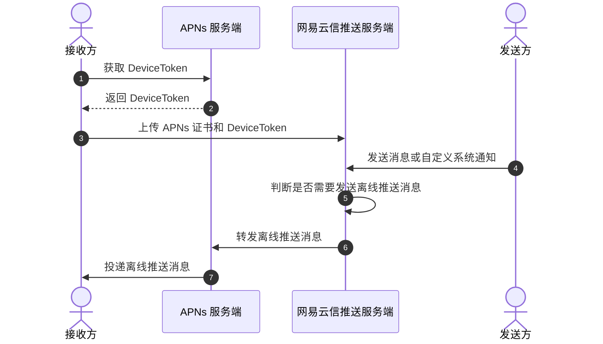

<!-- keywords: 离线推送,APNs,p12,推送证书,APPID -->
<!-- description: 网易云信 IM 即时通讯离线推送功能,离线推送客户端开发指南-->

为了提高消息送达率，NIM SDK 支持 APNs 离线推送功能。

## 适用场景

当程序在后台被挂起、被系统/用户杀死，或网络异常，NIM SDK 与网易云信服务端的长连接会因为超时而断开，此时网易云信服务端会通过 APNs（Apple Push Notification Service）通道为目标用户发送离线推送的消息。

## 技术原理

如果您需要通过网易云信向 App 发送离线推送，需要先向网易云信提供 APNs 信息，例如 App ID、证书等，授权网易云信服务端与 APNs 通信，从而实现离线推送功能。

网易云信 IM 实现离线推送的技术原理如下：

<!--  -->



## 前提条件

在实现离线推送功能之前，请确保：

- **开发环境满足如下要求**：
    - Xcode 13
    - iOS 9.0.0 及以上版本
- 已 [注册 IM 账号](https://doc.yunxin.163.com/messaging2/guide/jU0Mzg0MTU?platform=client#%E7%AC%AC%E4%BA%8C%E6%AD%A5%E6%B3%A8%E5%86%8C-im-%E8%B4%A6%E5%8F%B7)，获取 IM 账号和 Token。

## 第一步：集成 APNs 推送服务

请参考 [集成 APNs 推送服务](https://doc.yunxin.163.com/messaging2/guide/jEzNjk3NTM?platform=iOS)，实现网易云信服务端与 APNs 通信。

## 第二步：集成 NIM SDK

请参考 [集成 iOS SDK](https://doc.yunxin.163.com/messaging2/guide/zk2MjQ5OTc?platform=client) 将 NIM SDK 集成至您的项目。

## 第三步：初始化 NIM SDK

1. 在项目文件中引入头文件 `NIMSDK.h`。

    ```Objective-C
    #import <NIMSDK/NIMSDK.h>
    ```

2. 调用 [`registerWithOptionV2:v2Option:`](https://doc.yunxin.163.com/messaging2/references/iOS/doxygen/Latest/zh/de/de3/interface_n_i_m_s_d_k.html#a4140971377bec8212dabd66fdea0bbb3) 初始化 NIM SDK。在初始化参数 [`NIMSDKOption`](https://doc.yunxin.163.com/messaging2/references/iOS/doxygen/Latest/zh/d1/de8/interface_n_i_m_s_d_k_option.html) 中传入推送证书名称（对应 [网易云信控制台](https://app.yunxin.163.com/global/home) 配置的推送证书）。

    ```Objective-C
    - (BOOL)application:(UIApplication *)application didFinishLaunchingWithOptions:(NSDictionary *)launchOptions {
        ...
        // 推荐在程序启动的时候初始化 NIM SDK
        NSString *appKey        = @"your app key";
        NIMSDKOption *option    = [NIMSDKOption optionWithAppKey:appKey];
        option.apnsCername      = @"your APNs cer name";
        [[NIMSDK sharedSDK] registerWithOption:option];
        ...
    }
    ```

    :::note note
    推送证书名称，不超过 32 个字符，否则登录时会报 500 错误。
    :::

## 第四步：上传 devicetoken

通过调用 [`updateApnsToken:`](https://doc.yunxin.163.com/messaging2/references/iOS/doxygen/Latest/zh/de/de3/interface_n_i_m_s_d_k.html#a075db650901791cc08043314ed3e1fd0) 将提前获取到的 `deviceToken` 上传至网易云信服务端用于后续的 APNs 推送。

```Objective-C
- (void)registerPushService
{
    if (@available(iOS 11.0, *))
    {
        UNUserNotificationCenter *center = [UNUserNotificationCenter currentNotificationCenter];
        [center requestAuthorizationWithOptions:(UNAuthorizationOptionBadge | UNAuthorizationOptionSound | UNAuthorizationOptionAlert) completionHandler:^(BOOL granted, NSError * _Nullable error) {
            if (!granted)
            {
                dispatch_async_main_safe(^{
                    [[UIApplication sharedApplication].keyWindow makeToast:@"请开启推送功能否则无法收到推送通知" duration:2.0 position:CSToastPositionCenter];
                })
            }
        }];
    }
    else
    {
        UIUserNotificationType types = UIUserNotificationTypeBadge | UIUserNotificationTypeSound | UIUserNotificationTypeAlert;
        UIUserNotificationSettings *settings = [UIUserNotificationSettings settingsForTypes:types
                                                                                 categories:nil];
        [[UIApplication sharedApplication] registerUserNotificationSettings:settings];
    }

    [[UIApplication sharedApplication] registerForRemoteNotifications];

    // 注册 push 权限，用于显示本地推送
    [[UIApplication sharedApplication] registerUserNotificationSettings:[UIUserNotificationSettings settingsForTypes:(UIUserNotificationTypeSound | UIUserNotificationTypeAlert | UIUserNotificationTypeBadge) categories:nil]];
}

...

- (void)application:(UIApplication *)app didRegisterForRemoteNotificationsWithDeviceToken:(NSData *)deviceToken
{
    // 上传 devicetoken 至网易云信服务端。
    [[NIMSDK sharedSDK] updateApnsToken:deviceToken];
}
```

:::note notice
如需设置自定义推送文案（`customContentKey`），需要提前在 [网易云信控制台](https://app.yunxin.163.com/global/home) 开通自定义推送文案功能，并提前添加好自定义的推送文案。具体如何实现，请参考 [推送文案](https://doc.yunxin.163.com/messaging2/guide/zM4MDQzOTk?platform=iOS#设置推送文案)。

:::

## 第五步：测试离线推送

### **消息发送方**

发送消息或自定义系统通知给接收方（离线），具体的收发流程可参考 [消息收发](https://doc.yunxin.163.com/messaging2/guide/DYzMjA0Njc?platform=client) 和 [自定义通知收发](https://doc.yunxin.163.com/messaging2/guide/TYyNDk1ODk?platform=client)。

这里以发送文本消息为例，通过调用 [`sendMessage:toSession:completion:`](https://doc.yunxin.163.com/messaging2/references/iOS/doxygen/Latest/zh/d2/d6e/protocol_n_i_m_chat_manager-p.html#a88b87af2e32adf7f65832fc3fbfe5591) 实现。发送的消息默认需要推送，如需设置推送文案，推送角标，推送文案前缀等，请参考 [配置消息的推送属性](https://doc.yunxin.163.com/messaging2/guide/zM4MDQzOTk?platform=iOS)。

```Objective-C
// 构造出具体会话：P2P 单聊，对方账号为 user
NIMSession *session = [NIMSession session:@"user" type:NIMSessionTypeP2P];
// 构造出具体消息
NIMMessage *message = [[NIMMessage alloc] init];
message.text        = @"hello";   //消息内容
message.apnsContent = @"发来了一条消息"; //推送文案
// 错误反馈对象
NSError *error = nil;
// 发送消息
[[NIMSDK sharedSDK].chatManager sendMessage:message toSession:session error:&error];
```

### **消息接收方**

接收方将会在登录后接收到离线推送。

:::note note
- 离线推送支持配置免打扰时间，具体请参考 [设置推送全局免打扰](https://doc.yunxin.163.com/messaging2/guide/zQ1OTM1MTk?platform=iOS)。
- 离线推送支持配置多端推送策略，即支持推送至同一账号的多个客户端，具体请参考 [设置多端推送策略](https://doc.yunxin.163.com/messaging2/guide/zkwMTc0Mjg?platform=iOS)。
:::

## 相关参考

- [iOS 推送问题排查](https://doc.yunxin.163.com/messaging2/guide/jk0OTM3MjQ?platform=client)
- [推送 payload 配置](https://doc.yunxin.163.com/messaging2/server-apis/DQyNjc5NjE?platform=server)

## 常见问题

### 触发推送的条件是什么？

iOS 切换到后台，或者用户主动杀死 App，触发推送条件。因此，要测试 iOS 推送问题，请登录后杀死 App，或将其切换到后台。

### 哪些场景下不会触发推送？

IM 账号未登录/已登出/被踢下线，不会触发推送。App 在前台，不会触发推送。用户登录 IM 账号，并且未主动登出或者没有被踢下线，可能触发推送。

### query token with exception must not refer to a null object

推送会出现 `query token with exception must not refer to a null object` 报错信息，可能没有在 Application 主进程里面注册推送，请检查推送 SDK 的初始化时机<!-- ，您也可以参考 Demo 示例代码 -->。

### 为什么个别用户推送异常？

对于同一个消息，其他用户的推送正常，个别用户推送异常时，请确认以下三点：

- 发送者和接收者两者是否是好友关系，控制台是否有设置非好友关系允许发送消息。
- 双方是否有拉黑情况。
- 接收方是否有设置发送免打扰，如果是强制推送的情况下可忽略。