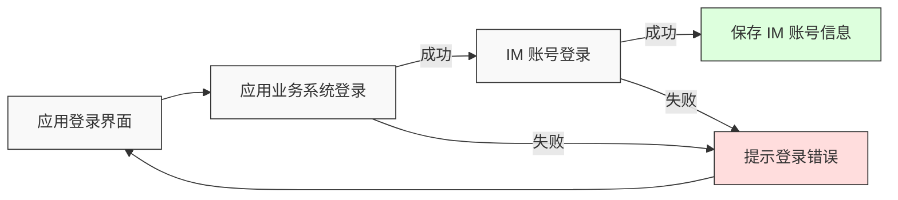
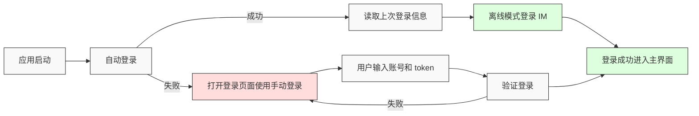
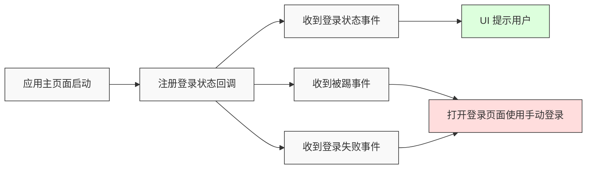

登录对于 IM 产品来说至关重要，是后续业务顺利进行的前提条件。开发者集成 NIM SDK 的各项能力时，如果未能正确使用登录接口或处理登录状态，将引发不必要的问题，影响开发进度。本文详细介绍如何以最佳方式实现 IM 登录功能。

## 注意事项

- 本文主要介绍 **移动端** 的登录流程，涉及的接口请参考 [登录相关 API 文档](https://doc.yunxin.163.com/messaging2/client-apis/TQ5NTUwNzQ?platform=client)。
- 本文以静态 Token 鉴权为例，更多登录方式请参考 [登录及登出 IM](https://doc.yunxin.163.com/messaging2/guide/Dk1MTY4MzA?platform=client)。

## 准备工作

根据本文操作前，请确保您已经完成了以下设置：

- 已在 [网易云信控制台](https://app.yunxin.163.com/global/home) 上，[创建应用](https://doc.yunxin.163.com/console/guide/TIzMDE4NTA?platform=console)，获取 App Key。
- 已 [集成 SDK](https://doc.yunxin.163.com/messaging2/guide/DA5NzIyMjc?platform=client)。
- 已通过服务端 [注册 IM 账号](https://doc.yunxin.163.com/messaging2/server-apis/TQyNjgyMzc?platform=server)，获取 IM 账号和对应的静态 `token`。

    如果仅需要测试和调试，您可通过控制台注册 IM 测试账号。测试账号及对应的静态 `token` 仅适用于调试环境，线上生产环境必须将测试账号及其 `token` 替换为云信服务端生成的正式 `account_id` 和 `token`。

## Demo 体验

您可以参考 [登录 Demo](https://github.com/zsy18/YunxinPushTestDemo/tree/V10) 体验完整登录流程。

## 登录流程

常见的登录流程一般分为三个部分，首次登录、自动登录以及登录状态处理。

### 首次登录

用户首次打开应用进行登录时，一般需要用户输入账号密码，进行用户自身业务系统的登录，成功后再使用云信返回的 IM 账号和 `token` 进行 IM 登录。

**首次登录流程：**



**接口调用：**

1. 调用 [`login`](https://doc.yunxin.163.com/messaging2/client-apis/TQ5NTUwNzQ?platform=client#login) 方法手动登录 IM。

  ::: note note
  在登录时 **关闭离线模式**。
  :::

2. 调用后处理逻辑：

    - 如果登录成功，保存 IM 账号和 `token` 到本地，便于下次应用启动时使用。
    - 如果登录失败，提示用户登录失败。

**示例代码：**

:::::: div linked-codes
::: code 安卓
```Java
V2NIMLoginOption option = new V2NIMLoginOption();
//关闭离线模式
option.setOfflineMode(false);

NIMClient.getService(V2NIMLoginService.class).login(accid, token, option, new V2NIMSuccessCallback<Void>() {
            @Override
            public void onSuccess(Void unused) {
                //保存accid、token，用于下次自动登录。
                Preferences.saveUserAccount(accid);
                Preferences.saveUserToken(token);
                // TODO: 登录成功跳转到主页面
            }
        },
        new V2NIMFailureCallback() {
            @Override
            public void onFailure(V2NIMError error) {
                //登录失败
                int code = error.getCode();
                String desc = error.getDesc();
                Toast.makeText(LoginActivity.this, R.string.tip_login_fail, Toast.LENGTH_SHORT).show();
            }
        });

}
```
:::
::: code iOS
```Objective-C
V2NIMLoginOption *loginOption = [[V2NIMLoginOption alloc] init];
loginOption.offlineMode = NO;
loginOption.forceMode = YES;
[[NIMSDK sharedSDK].v2LoginService login:accountId token:token option:loginOption success:^{
     NSLog(@"=== 登录成功");
     //缓存账号密码到本地
     //跳转到主页面
  } failure:^(V2NIMError * _Nonnull error) {
}];
```
:::
::::::

<!--其他端的登录比较简单，且不适用自动登录，内容先隐藏（示例代码不完全正确）
::: code macOS/Windows
```C++
V2NIMLoginOption option;

loginService.login(
    "accountId",
    "token",
    option,
    []() {
       // 登录成功，保存账号密码
        saveAccountAndToken("accountId", "token");
        // 跳转到主页面
        navigateToMainPage();
    },
    [](V2NIMError error) {
        // 登录失败，显示错误提示
    });
```
:::
::: code Web/uni-app/小程序
```TypeScript
try {
  await nim.V2NIMLoginService.login(accountId, token, {
      offlineMode: false
  });
  // 登录成功，保存账号和token到本地
  localStorage.setItem('nim_account', accountId);
  localStorage.setItem('nim_token', token);
  // 跳转到主页面
  navigateToMainPage();
} catch (err) {
  // 登录失败
  // console.log(err.code)
}
```
:::
::: code Node.js/Electron
```TypeScript
try {
    await v2.loginService.login(accountId, token, {
    });
    // 登录成功，保存账号和token
    saveAccountAndToken(accountId, token);
    // 进入主界面
    navigateToMainWindow();
  } catch (error) {
    // 登录失败
    console.error(`Login failed: ${error.code} ${error.message}`);
    showErrorDialog('登录失败，请检查账号密码');
  }
```
:::
::: code 鸿蒙
```TypeScript
// 1. default and fixed token
try {
  await nim.loginService.login(login(accountId, token, {
      offlineMode: false
    });
    // 登录成功，保存账号和token
    preferences.saveAccountAndToken(accountId, token);
    // 跳转到主页面
    router.pushUrl({
      url: 'pages/MainPage'
    });
  } catch (err) {
  // 登录失败
  // console.log(err.code)
}
```
:::
::: code Flutter
```Dart
Future<void> manualLogin(String accountId, String token) async {
  var options = NIMLoginOption();
  options.offlineMode = false;
  
  try {
    final loginResult = await NimCore.instance.loginService.login(
      accountId, token, options);
    
    // 登录成功，保存账号和token
    await prefs.setString('nim_account', accountId);
    await prefs.setString('nim_token', token);
    
    // 跳转到主页面
    Navigator.of(context).pushReplacementNamed('/main');
  } catch (e) {
    // 登录失败
    ScaffoldMessenger.of(context).showSnackBar(
      SnackBar(content: Text('登录失败，请检查账号密码'))
    );
  }
}
```
:::
-->

### 自动登录

用户登录成功后，再次打开应用，一般无需用户输入账号密码，而是程序内部获取上次登录的 IM 的账号和 `token`，通过离线方式登录 IM，此次登录会优先打开本地数据库，即使无网络的情况下也可以正常访问本地数据。

**自动登录流程：**



**接口调用：**

1. 获取上次登录的 IM 账号和 `token`。

2. 调用 [`login`](https://doc.yunxin.163.com/messaging2/client-apis/TQ5NTUwNzQ?platform=client#login) 方法登录 IM。

  ::: note note
  在登录时 **开启离线模式**。
  :::

3. 开启离线模式后，登录会统一走失败回调，当状态码为 191008 时表示进入离线模式，可以进入主页面。

**示例代码：**

:::::: div linked-codes
::: code 安卓
```Java
V2NIMLoginOption option = new V2NIMLoginOption();
//本次登录采用离线登录，无网络下也可以登录成功，后面 SDK 内部会自动重连
option.setOfflineMode(true);
NIMClient.getService(V2NIMLoginService.class).login(account, token, option, new V2NIMSuccessCallback<Void>() {
            @Override
            public void onSuccess(Void unused) {
                Log.e(TAG,"login  onSuccess");
                // 登录成功跳转到主页面
            }
        },
            new V2NIMFailureCallback() {
            @Override
            public void onFailure(V2NIMError error) {
                Log.e(TAG,"login  onFailure:"+error.getCode()+","+error.getDesc());
                if (191008 == error.getCode()) {
                    //进入离线模式，数据已经打开，跳转到主页面
                }else {
                    //自动登录失败，清理登录缓存信息,返回登录页面
                    Preferences.saveUserAccount("");
                    Preferences.saveUserToken("");
                }
            }
        });

}
```
:::
::: code iOS
```Objective-C
V2NIMLoginOption *loginOption = [[V2NIMLoginOption alloc] init];
loginOption.offlineMode = YES;
[[NIMSDK sharedSDK].v2LoginService login:accountId token:token option:loginOption success:^{
     NSLog(@"=== 登录成功");
     //缓存账号密码到本地
     //跳转到主页面
  } failure:^(V2NIMError * _Nonnull error) {
      if (error.code == 191008) {
            //进入离线模式，数据已经打开，跳转到主页面
        } else {
            //自动登录失败，清理登录缓存信息,返回登录页面
        }
}];
```
:::
::::::

<!--其他端的登录比较简单，且不适用自动登录，内容先隐藏（示例代码不完全正确）
::: code macOS/Windows
暂不支持自动登录（离线登录）模式。
:::
::: code Web/uni-app/小程序
```TypeScript
async function autoLogin() {
  const accountId = localStorage.getItem('nim_account');
  const token = localStorage.getItem('nim_token');
  
  if (!accountId || !token) {
    navigateToLoginPage();
    return;
  }
  
try {
  await nim.V2NIMLoginService.login(accountId, token, {
      offlineMode: true
  });
  // 登录成功，跳转到主页面
  navigateToMainPage();
} catch (err) {
    if (err.code === 191008) {
      // 进入离线模式，数据已打开，跳转到主页面
      navigateToMainPage();
    } else {
      // 自动登录失败，清理缓存，返回登录页面
      localStorage.removeItem('nim_account');
      localStorage.removeItem('nim_token');
      navigateToLoginPage();
    }
}
```
:::
::: code Node.js/Electron
暂不支持自动登录（离线登录）模式。
:::
::: code 鸿蒙
```TypeScript
async function autoLogin() {
  const accountId = preferences.getAccountId();
  const token = preferences.getToken();
  
  if (!accountId || !token) {
    router.pushUrl({
      url: 'pages/LoginPage'
    });
    return;
  }
  
try {
  await nim.loginService.login(accountId, token, {
      offlineMode: true
    });
    // 登录成功，跳转到主页面
    router.pushUrl({
      url: 'pages/MainPage'
    });
  } catch (err) {
    if (err.code === 191008) {
      // 进入离线模式，数据已打开
      router.pushUrl({
        url: 'pages/MainPage'
      });
    } else {
      // 自动登录失败，清理缓存，返回登录页面
      preferences.clearAccountAndToken();
      router.pushUrl({
        url: 'pages/LoginPage'
      });
    }
  }
}
```
:::
::: code Flutter
```Dart
Future<void> autoLogin() async {
  final accountId = prefs.getString('nim_account');
  final token = prefs.getString('nim_token');
  
  if (accountId == null || token == null) {
    Navigator.of(context).pushReplacementNamed('/login');
    return;
  }
  
  var options = NIMLoginOption();
  options.offlineMode = true;
  
  try {
    final loginResult = await NimCore.instance.loginService.login(
      accountId, token, options);
    
    // 登录成功，跳转到主页面
    Navigator.of(context).pushReplacementNamed('/main');
  } catch (e) {
    if (e is NimResult && e.code == 191008) {
      // 进入离线模式，数据已打开
      Navigator.of(context).pushReplacementNamed('/main');
    } else {
      // 自动登录失败，清理缓存，返回登录页面
      await prefs.remove('nim_account');
      await prefs.remove('nim_token');
      Navigator.of(context).pushReplacementNamed('/login');
    }
  }
}
```
:::
-->

### 登录状态处理

在 IM 初始接口调用之后，可以在应用的主页面注册 IM 的登录回调，处理一些业务逻辑，如 UI 层提示用户当前连接状态、被踢、多端登录等。

**登录状态处理流程：**



**接口调用：**

1. 进入应用主页面。

2. 调用 [`addLoginListener`](https://doc.yunxin.163.com/messaging2/client-apis/TQ5NTUwNzQ?platform=client#addLoginListener) 添加登录状态监听。

3. 收到被踢、登录失败等事件后，清理当前登录信息，并返回登录页面。

**示例代码：**

:::::: div linked-codes
::: code 安卓
```Java
private V2NIMLoginListener loginListener = new V2NIMLoginListener() {
    @Override
    public void onLoginStatus(V2NIMLoginStatus status) {
        switch (status){
            case V2NIM_LOGIN_STATUS_LOGOUT:
                tvLoginStatus.setText("登出");
                break;
            case V2NIM_LOGIN_STATUS_UNLOGIN:
                tvLoginStatus.setText("未登录");
                break;
            case V2NIM_LOGIN_STATUS_LOGINING:
                tvLoginStatus.setText("登录中");
                break;
            case V2NIM_LOGIN_STATUS_LOGINED:
                tvLoginStatus.setText("登录成功");
                break;
        }
        Log.e(TAG,"loginListener onLoginStatus:"+status.toString());
    }
    @Override
    public void onLoginFailed(V2NIMError error) {
         //登录失败，清理登录缓存信息,返回登录页面
         Preferences.saveUserAccount("");
         Preferences.saveUserToken("");
    }
    @Override
    public void onKickedOffline(V2NIMKickedOfflineDetail detail) {
        //用户被踢，清理登录缓存信息返回登录页面
         Preferences.saveUserAccount("");
         Preferences.saveUserToken("");
    }
    @Override
    public void onLoginClientChanged(V2NIMLoginClientChange change, List<V2NIMLoginClient> clients) {
    }
};
//
NIMClient.getService(V2NIMLoginService.class).addLoginListener(loginListener);
```
:::
::: code iOS
```Objective-C
[[NIMSDK sharedSDK].v2LoginService addLoginListener:self];
- (void)onLoginFailed:(V2NIMError *)error {
    //登录失败，清理登录缓存信息,返回登录页面
}

- (void)onKickedOffline:(V2NIMKickedOfflineDetail *)detail {
    //用户被踢，清理登录缓存信息返回登录页面
}
```
:::
::::::

<!--其他端的登录比较简单，且不适用自动登录，内容先隐藏（示例代码不完全正确）
::: code macOS/Windows
```C++
class LoginStatusObserver : public V2NIMLoginListener {
public:
    void onLoginStatus(V2NIMLoginStatus status) override {
        switch (status) {
            case V2NIM_LOGIN_STATUS_LOGOUT:
                updateStatusUI("已登出");
                break;
            case V2NIM_LOGIN_STATUS_UNLOGIN:
                updateStatusUI("未登录");
                break;
            case V2NIM_LOGIN_STATUS_LOGINING:
                updateStatusUI("登录中");
                break;
            case V2NIM_LOGIN_STATUS_LOGINED:
                updateStatusUI("登录成功");
                break;
        }
    }

    void onLoginFailed(V2NIMError error) override {
        clearLoginCache();
        navigateToLoginPage();
    }

    void onKickedOffline(V2NIMKickedOfflineDetail detail) override {
        clearLoginCache();
        navigateToLoginPage();
    }

    void onLoginClientChanged(V2NIMLoginClientChange change, std::vector<V2NIMLoginClient> clients) override {
        // 多端登录状态变化
    }
};

// 注册监听
auto observer = std::make_shared<LoginStatusObserver>();
loginService.addLoginListener(observer);
```
:::
::: code Web/uni-app/小程序
```TypeScript

```
:::
::: code Node.js/Electron
```TypeScript

```
:::
::: code 鸿蒙
```TypeScript

```
:::
::: code Flutter
```Dart

```
:::
-->

## 获取登录状态

通过调用 [`getLoginStatus`](https://doc.yunxin.163.com/messaging2/client-apis/TQ5NTUwNzQ?platform=client#getLoginStatus) 获取登录状态，如果用户已经处于已登录和登录中状态，请勿再频繁调用登录接口登录。

| 登录状态 | 说明 |
| :---- | :---- |
| V2NIM_LOGIN_STATUS_LOGOUT(0) | 已登出 |
| V2NIM_LOGIN_STATUS_LOGINED(1) | 已登录 |
| V2NIM_LOGIN_STATUS_LOGINING(2) | 正在登录 |
| V2NIM_LOGIN_STATUS_UNLOGIN(3) | 未登录 | 

:::::: div linked-codes
::: code 安卓
```Java
V2NIMLoginStatus status = NIMClient.getService(V2NIMLoginService.class).getLoginStatus();
```
:::
::: code iOS
```Objective-C
- (void)printLoginStatus:(V2NIMLoginStatus)status
{
    switch (status) {
        case V2NIM_LOGIN_STATUS_LOGOUT:
            NSLog(@"login status = logout");
            break;
        case V2NIM_LOGIN_STATUS_LOGINING:
            NSLog(@"login status = logining");
            break;
        case V2NIM_LOGIN_STATUS_LOGINED:
            NSLog(@"login status = logined");
            break;
        default:
            NSLog(@"login status = %ld", status);
    }
}

V2NIMLoginStatus status = [[[NIMSDK sharedSDK] v2LoginService] getLoginStatus];
```
:::
::::::

<!--其他端的登录比较简单，且不适用自动登录，内容先隐藏（示例代码不完全正确）
::: code macOS/Windows
```C++
auto loginStatus = loginService.getLoginStatus();
```
:::
::: code Web/uni-app/小程序
```TypeScript
const loginStatus = nim.V2NIMLoginService.getLoginStatus()
```
:::
::: code Node.js/Electron
```TypeScript
const status = v2.loginService.getLoginStatus()
```
:::
::: code 鸿蒙
```TypeScript
const loginStatus = nim.loginService.getLoginStatus()
```
:::
::: code Flutter
```Dart
await NimCore.instance.loginService.getLoginStatus();
```
:::
::::::
-->

<!--通塔建议去掉，只关注 LoginStatus 就行
### 获取登录连接状态

IM 登录连接状态表示当前登录的 NIM SDK 实例与网易云信服务端的长连接状态，也可以理解为用户客户端和网易云信服务端的网络连接状态。

通过调用 `getConnectStatus` 获取登录连接状态，您可以根据不同的状态进行界面提示相应的业务操作。

| 登录连接状态 | 说明 |
| :---- | :---- |
| V2NIM_CONNECT_STATUS_DISCONNECTED(0) | SDK 未连接服务端 |
| V2NIM_CONNECT_STATUS_CONNECTED(1) | SDK 已连接服务端 |
| V2NIM_CONNECT_STATUS_CONNECTING(2) | SDK 正在与服务端连接 |
| V2NIM_CONNECT_STATUS_WAITING(3) | SDK 正在等待与服务端重连 |

 :::::: div linked-codes
::: code 安卓
```Java
V2NIMConnectStatus status= NIMClient.getService(V2NIMLoginService.class).getConnectStatus();
```
:::
::: code iOS
```Objective-C
V2NIMConnectStatus status = [[[NIMSDK sharedSDK] v2LoginService] getConnectStatus];
```
:::
::: code macOS/Windows
```C++
auto connectStatus = loginService.getConnectStatus();
```
:::
::: code Web/uni-app/小程序
```TypeScript
const connectStatus = nim.V2NIMLoginService.getConnectStatus()
```
:::
::: code Node.js/Electron
```TypeScript
getConnectStatus(): V2NIMConnectStatus
```
:::
::: code 鸿蒙
```TypeScript
getConnectStatus(): V2NIMConnectStatus
```
:::
::: code Flutter
```Dart
await NimCore.instance.loginService.getConnectStatus();
```
:::
::::::
-->