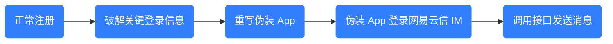
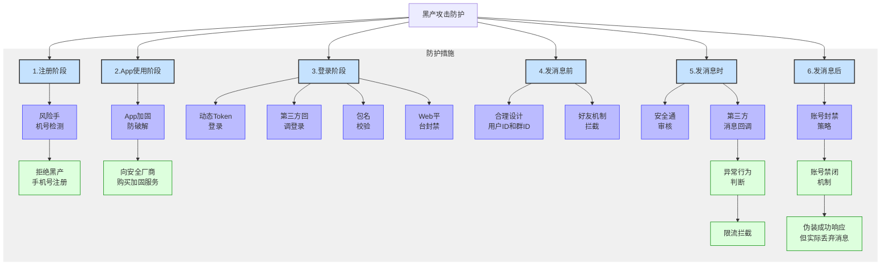
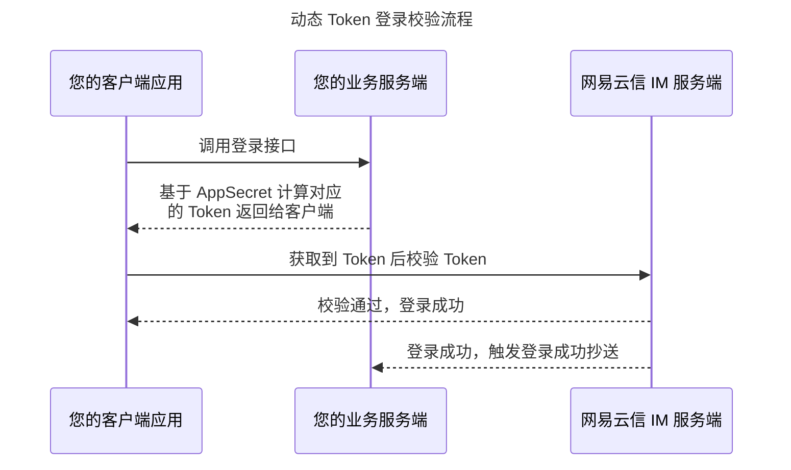
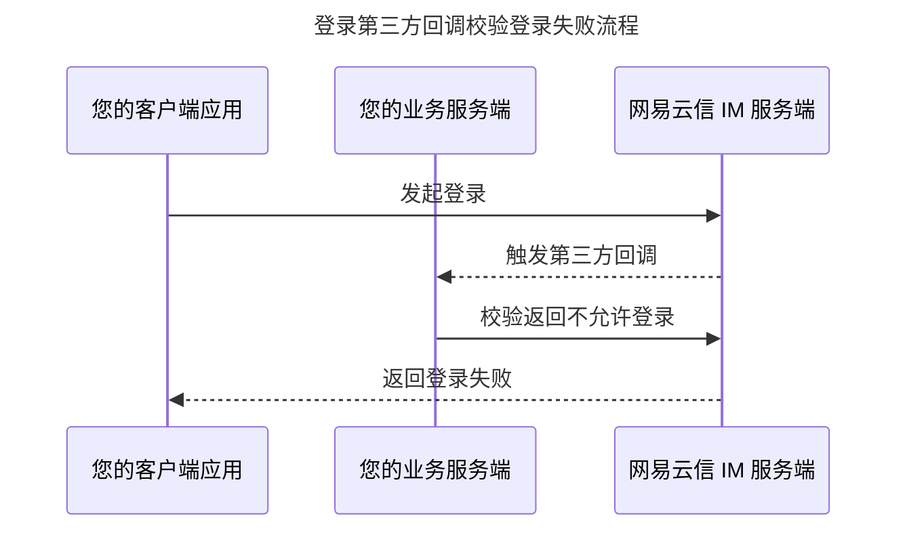
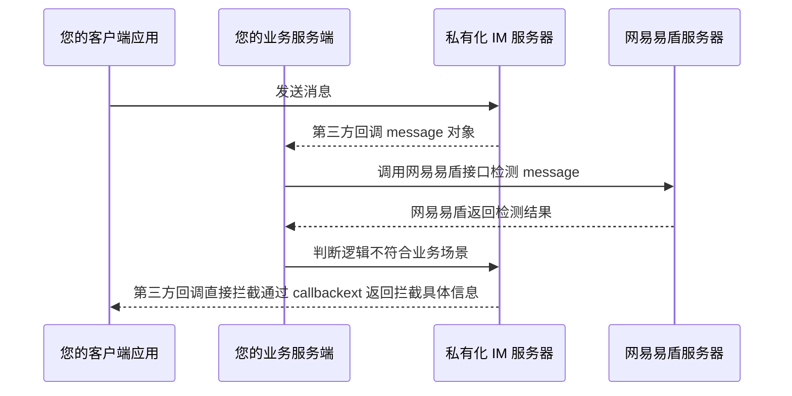

本文主要介绍社交行业业务面临的技术型黑色产业攻击者（简称黑产攻击）问题，以及如何结合网易云信提供的安全保障功能，同技术性黑产攻击进行有效的对抗博弈，增加其攻击难度，从而为业务健康度保驾护航。

## 行业现状

在社交行业的商业场景中，黑产攻击是一个普遍而又顽固的现象。例如，攻击者肆意发放广告、散播违法违禁消息、制作虚假引导流程抢夺客户等。社交平台商家常常深受其扰。

- 对于普通型的攻击者，通过调整和设计业务，再结合内容审核服务商的帮助，其行为可以得到有效规范。
- 对于技术型黑产攻击，虽然具有一定的技术难度，但趋利所致，依然有大量的专业的攻击者存在。普通业务形态和防治策略对其防不胜防，无法得到有效处理。

## 流程分析

如果一款应用成为攻击目标，技术型黑产攻击的常见流程可以总结为：



1. 攻击者模仿正常的用户行为，注册并登录您的业务平台账号。
2. 攻击者在本地缓存到关键的登录信息。其中包括登录网易云信 IM 即时通讯服务所需的开发者账号 AppKey、Token、accid（账号 ID）等。
3. 攻击者通过各种破解手段，分析获取这些关键登录信息，再通过网易云信即时通讯 SDK（下文简称 NIM SDK）另写集成了账号信息的伪装 App 或 Demo。
4. 攻击者利用准备好的伪装 App 或 Demo，直接登录 IM 应用。从而绕过您业务本身的登录鉴权逻辑、业务本身的消息送审逻辑、安全厂商的异常用户识别逻辑等。
5. 攻击者开始肆无忌惮的发送各种内容破环平台生态，影响项目运营。

## 方案分析

针对黑产攻击登录，因为存在利益驱动，黑产攻击登录千变万化，没有哪一种单一的方案是持续有效的。您需要不停提高安全意识，同时可能不定期切换安全方案。建议您根据本章节的分析，组合使用多种方法，有效防止黑产攻击。

基于黑产攻击的主要流程，可以在以下时机拦截黑产攻击登录。




1. 注册时拦截。

    鉴于会遇到账号被封禁的情况，黑产攻击一般拥有大量虚拟号，具备批量注册的能力。因此可以在注册登录时，判断手机号。如果是黑产攻击手机号，拒绝注册。

    您可以向安全厂商购买风险手机号集合包，定期更新。

2. App 加固防破解。

    您可以向安全厂商购买 App 加固服务，加大 App 被破解的难度。

3. 登录时拦截。

    - 采用 **动态 Token 登录** 方式。定期刷新 Token，增加黑产攻击获取 Token 的麻烦程度。
    - 采用 **第三方回调登录** 方式。自行设计登录检验规则，并定期更新规则。
    - 采用 **包名校验** 方式。登录网易云信 IM 服务器时，根据您在 [网易云信控制台](https://app.yunxin.163.com/global/home) 提交的安卓 Package Name、iOS Bundle Identifier 等包名进行校验。若不符合，则网易云信侧将拒绝登录请求。
    - 对 Web 平台进行封禁。Web 平台开放程度较深，很难有有效的防护手段，必要时可以将 Web 端整体封禁。如有需要，请 [提交工单](https://app.yunxin.163.com/global/service/ticket/create) 联系网易云信技术支持工程师。

4. 发消息前拦截。

    - 设计业务系统时，具备防范意识。例如，设计用户 ID 时，不建议用递增数字作为用户 ID 或是群 ID。否则，您的用户列表或是群列表很容易被遍历，从而自动化批量发送广告消息。
    - 设计 **好友机制** 进行拦截，账号之间不存在好友关系则不允许发送消息。

5. 发消息时拦截。

    - 采用网易云信 [**安全通**](https://doc.yunxin.163.com/messaging/server-apis/Dg0NDY2NzY?platform=server) 审核。App 发送的任何消息，都会经过安全通服务进行审核识别，对违规消息进行拦截。
    - 采用 **第三方消息回调**。您的业务服务器可以依赖回调进行异常行为判断。例如，某个 `accid`（账号 ID）短时间内发消息频率过高、消息内容不合规、或发送的消息体不带有业务方指定的扩展字段内容时，进行限流拦截。

6. 发消息后处理。

    当您的业务后台识别到某个用户为非法用户时，可以对其进行 **账号封禁**。

    直接封禁非法用户不是最佳方案。因为非法用户能立即感知被封禁，从而快速更换用户。通常黑产攻击者的新账号登录注册破解过程自动化完成的，将持续对被攻击者造成影响。

    建议您识别到非法用户后，通过业务逻辑，禁闭账号。即让非法用户的所有发消息等请求都是成功的，造成非法用户的假象。但其实际发出来的消息会被服务器丢弃，其他用户不再收到消息。

## 方案实施

下文介绍网易云信 IM 即时通讯围绕防黑产攻击提供的功能或方案，您可以参考相关内容，同时结合上文的方案分析以及自身的业务设计调整，为应用进行安全加固。

### 功能开通步骤

如果下文涉及到在网易云信控制台上开通功能的步骤，请统一参考 [开启或关闭功能](https://doc.yunxin.163.com/console/concept/TQ2NzE5MzQ?platform=console)。

<!-- 1. 登录 [网易云信控制台](https://app.yunxin.163.com/global/home)。
2. 选择并进入一款应用。
    - **应用配置**：切换不同的页签，实现应用配置。
        
    - **产品功能**：
        1. 在 **基本信息** 页面下的 **产品总览** 区域，选择 IM 即时通讯产品，单击 **功能配置**。
            
        3. 选择 **基础功能** 或其他页签，在列表中找到对应的功能，并进行开通。
        4. 如果功能涉及到子功能配置，则单击 **子功能配置** 进入配置页面。-->

### 1. 动态 Token 登录拦截

NIM SDK 从 8.3.0 版本开始支持动态 Token 的校验方式。

动态 Token 登录时，配置 `authtype` 为动态 Token。通过在初始化配置获取动态 Token 的回调，然后在回调里向您自己的业务服务器请求基于 `AppSecret` 计算的 Token 返回给客户端用于登录。具体实现，请参考以下文档：

- [动态 Token 登录（安卓）](https://doc.yunxin.163.com/messaging/guide/TI1MTU1NDc?platform=android#%E5%8A%A8%E6%80%81%20Token%20%E7%99%BB%E5%BD%95)
- [动态 Token 登录（iOS）](https://doc.yunxin.163.com/messaging/guide/TU3MTM2ODM?platform=iOS#%E5%8A%A8%E6%80%81%20Token%20%E7%99%BB%E5%BD%95)
- [动态 Token 登录（Web）](https://doc.yunxin.163.com/messaging/guide/zE0NDY4Njc?platform=web#%E5%8A%A8%E6%80%81%20Token%20%E7%99%BB%E5%BD%95)



### 2. 第三方回调登录拦截

您可以考虑在客户端登录的时候，传入自定义参数，第三方校验时如果没有携带对应的参数，那么就判断是异常登录，直接拦截。

第三方回调登录拦截在网易云信控制台上的开启路径为 **基础功能** > **第三方回调**，进入 **子功能配置**，勾选 **所有用户登录第三方服务器校验**。


:::note note
如果是聊天室应用，登录第三方回调拦截需要 [提交工单](https://app.yunxin.163.com/global/service/ticket/create) 联系网易云信技术支持工程师申请开通。
:::

开启后，客户端执行登录的操作的时候，会把登录时传入的参数通过第三方回调的形式返回给您的业务服务器。如果该次登录异常，就返回给网易云信客户端拒绝请求，从而拦截此次登录，并把对应的错误码返回给客户端。详情请参考 [第三方登录回调](https://doc.yunxin.163.com/messaging/server-apis/jc3MzA5NTk?platform=server)。



### 3. **包名校验拦截**

通过 **包名校验拦截**，客户端应用在请求登录网易云信 IM 服务端前，需要匹配您在 [网易云信控制台](https://app.yunxin.163.com/global/home) 配置应用的标识。当请求登录的客户端 App 标识不在列表中时，登录请求将被拒绝。开启路径为 **应用配置** > **标识管理**，开启 **进行标识安全验证** 开关。


在标识管理页签中，编辑如下信息：

配置 | 说明 |
--- | --- |
iOS Bundle Identifier | iOS 应用的标识。支持添加多个标识，标识之间使用英文半角逗号（`,`）隔开。 |
安卓 Package Name | 安卓应用的包名称。支持添加多个标识，标识之间使用英文半角逗号（`,`）隔开。 |
鸿蒙 Package Name | 鸿蒙应用的包名称。支持添加多个标识，标识之间使用英文半角逗号（`,`）隔开。 |

### 4. **好友机制拦截**

各个网易云信账号 ID（`accid`）之间，默认非好友之间是允许互发消息的。

付费开通 IM 之后，您在网易云信控制台可以勾选对应的开关，控制非好友不允许发送消息。客户端可以依赖好友的关系，限制新建账号以陌生人的身份发送消息。

- **限制好友关系**：开启路径为 **基础功能** > **单聊消息配置**，将该功能配置设置为 **不允许**。

    

- **拦截异常申请：正常的好友申请流程为**：

    ```mermaid
    graph LR
    A("A 发起好友申请") --> B("B 同意好友申请") --> C("双方成为好友")
    ```

    您可以在 [网易云信控制台](https://app.yunxin.163.com/global/home) 勾选 **基础功能** > **添加好友逻辑配置**，拦截异常的直接添加为好友的请求。

    

    开启后能有效拦截异常的好友添加请求，更多详情，请参考 [好友关系变更回调](https://doc.yunxin.163.com/messaging/server-apis/DI1NDU2MjI?platform=server#%E5%A5%BD%E5%8F%8B%E5%85%B3%E7%B3%BB%E5%8F%98%E6%9B%B4%E5%9B%9E%E8%B0%83)。

    ```mermaid
    sequenceDiagram
    title: 异常添加好友第三方回调拦截流程
    participant 您的客户端应用
    participant 您的业务服务端
    participant 网易云信 IM 服务端

    您的客户端应用 ->> 网易云信 IM 服务端 : 客户端调用接口异常添加为好友
    网易云信 IM 服务端 -->> 您的业务服务端 : 触发好友变更第三方回调，verifyType 为 3
    您的业务服务端 ->> 网易云信 IM 服务端 : 返回给网易云信服务器拦截
    网易云信 IM 服务端 -->> 您的客户端应用 : 异常添加好友失败
    ```

### 5. 安全通拦截

安全通是网易云信融合网易易盾的内容安全审核能力，对 IM 即时通讯内容进行有效的判别和筛选的额外收费功能。在 [网易云信控制台](https://app.yunxin.163.com/global/home) 上的开启路径为 **IM 即时通讯** > **安全通**。更多详情请参考 [开通和配置 IM 安全通](https://doc.yunxin.163.com/messaging/server-apis/jYxOTcyNzY?platform=server)。


开通安全通功能并配置安全通检测规则后，指定类型的消息经过相关的接口调用和配置后，都会先经由安全通进行内容安全检测，之后才会转发给接收端的用户。安全通支持单聊、群聊、聊天室和圈组的文本消息、图片消息、用户头像和用户资料等类型的内容安全检测以及自定义消息的内容安全检测。

**使用说明**

- 开通安全通之后，所有发送成功的消息默认就会开始反垃圾检测，服务器会默认按照国家的一些涉政涉黄的词汇做拦截。

- 如果需要检测拦截特定的词汇，或者某个词出现的频率，您也可以主动联系网易易盾技术支持工程师调整策略。

- 如果客户端有部分消息不希望过安全通的，也可以参考下文 **命中方式** 单独调整参数配置。

**命中方式**

开通安全通反垃圾后：

- 如果您使用的是 10.X.X 版本 NIM SDK，请参考 [反垃圾（内容审核）](https://doc.yunxin.163.com/messaging2/guide/zU4ODQ3OTc?platform=client#%E5%AE%9E%E7%8E%B0%E6%B5%81%E7%A8%8B)。
- **如果您使用的是 8.7.0 ~ 9.X.X 版本 NIM SDK，请参考以下内容**：

    ::: details 单击查看 8.7.0 ~ 9.X.X 版本 NIM SDK 的安全通反垃圾命中方式。
    网易云信 IM 消息抄送会通过 `antispam` 字段标记反垃圾需求。

    开通安全通反垃圾后，消息抄送会携带 `yidunRes` 字段，并通过其中 `action` 字段标记检测结果：

    - **0**：通过
    - **1**：嫌疑
    - **2**：不通过

    只有 `yidunBusType` 为 0 或 2 时，抄送时才有此字段。`yidunBusType` 枚举如下：

    - **0**：安全通文本反垃圾业务
    - **1**：安全通图片反垃圾业务
    - **2**：用户资料反垃圾业务
    - **3**：用户头像反垃圾业务

    对应的图片返回 `labels` 字段。

    - 文本类反垃圾请参考 [文本在线检测](https://support.dun.163.com/documents/2018041901?docId=150425947576913920)
    - 图片类反垃圾参考 [图片在线检测](https://support.dun.163.com/documents/2018041902?docId=150429557194936320)

    开通安全通后：

    - 如果您使用的是 10.X.X 版本 NIM SDK，请参考 [反垃圾（内容审核）](https://doc.yunxin.163.com/messaging2/guide/zU4ODQ3OTc?platform=client#%E5%AE%9E%E7%8E%B0%E6%B5%81%E7%A8%8B)。
    - **如果您使用的是 8.7.0 ~ 9.X.X 版本 NIM SDK，支持命中反垃圾后通知客户端结果**：
        - **安卓**：`IMMessage#getYidunAntiSpamRes`
        - **iOS**：`NIMMessage#yidunAntiSpamRes`

            而这个字段其实是有获取时机的。

        - **安卓 获取方式的回调**：`observeMsgStatus`。
        - **iOS 获取方式的回调**：`sendMessage:didCompleteWithError`。

            返回结果的字段解析，请参考 [安全通概述](https://doc.yunxin.163.com/messaging/server-apis/Dg0NDY2NzY?platform=server#%E5%AE%A1%E6%A0%B8%E7%BB%93%E6%9E%9C%E5%AD%97%E6%AE%B5%E8%AF%B4%E6%98%8E) 审核结果字段说明章节。

    此外只有被安全通拦截的消息才会返回 `yidunAntiSpamRes`，对于疑似消息请在 [网易云信控制台](https://app.yunxin.163.com/global/home) 为应用进行功能配置，路径为 *具体的应用* > **IM 即时通讯** > **安全通** > **子功能配置** > **疑似处理配置**：

    - 如果疑似消息被拦截，会有 `yidunAntiSpamRes` 返回。
    - 如果疑似消息放行则，没有 `yidunAntiSpamRes` 返回。
    :::

:::note note
语音、视频消息进行安全通反垃圾时，是异步检测的，并且检测结果是通过 IM 抄送通知开发者服务器。虽然命中后，网易云信会自动删除服务器上的文件，但是在检测结果出来前，消息可能已经被投递到接收方。因此，如果开发者收到命中抄送后：
- 对于点对点和群消息，建议通过 IM 服务端接口进行消息撤回。
- 对于聊天室消息，建议通过 IM 服务端接口删除聊天室云端历史消息。
:::

### 6. **消息第三方回调拦截**

消息第三方回调拦截在 [网易云信控制台](https://app.yunxin.163.com/global/home) 上的开启路径为 **基础功能** > **第三方回调**，进入 **子功能配置**，勾选 **所有用户发送点对点消息时第三方服务端校验** 和 **所有用户发送群聊消息时第三方服务端校验**。


:::note note
聊天室消息触发第三方回调，需要 [提交工单](https://app.yunxin.163.com/global/service/ticket/create) 联系网易云信技术支持工程师单独申请开通。
:::

开启后，客户端执行发送消息的操作的时候，会把发送的消息对象的参数通过第三方回调的形式返回给业务服务器。如果不符合正常的消息发送场景，就返回给网易云信拒绝请求。网易云信则会拦截此次发送请求，并返回对应的错误码给客户端。

一般情况下，第三方回调可以依赖以下方式判断是否是异常发送：

- 某个账号 ID `accid` 短时间内发送消息频率过高。
- 业务服务器基于第三方回调的消息体内容，解析消息内容是否包含违规内容。
- 第三方回调的消息体中，是否带有业务方的客户端特殊指定的扩展字段内容。



## **注意事项**

- 第三方回调中，如果设置了合法的自定义错误码 `responseCode`，则发送方会收到自定义错误码，否则会收到默认的 403 错误码。

    如果第三方回调不放行某消息，客户端 SDK 会返回 `{message: "sendMsg error: 非法操作或没有权限", code: responseCode}`。`

- 被好友拉黑后，给对方发消息，也会先进行第三方回调。如果不放行，SDK 会返回 `responseCode`。如果放行，SDK 会返回 `7101`。

- 如果第三方回调的最终结果是放行该消息，那么会触发消息抄送。如果是不放行，则不会触发消息抄送。

- 由于 NIM SDK 的判断条件，第三方回调的扩展信息字段 `callbackExt` 需要 `responseCode` 为 `200` 才能获取到。当 `errCode` 为 `0` 时，消息发送者和消息接收者均能获取该扩展字段（需要 NIM SDK 版本大于等于 v7.7.0）。若 `errCode` = `1`，需要设置 `responseCode` 为 `200`，发送方会认为消息发送成功，实际消息不会投递，此时只有消息发送者能获取到该字段。用户需要自定义 `code` 码可以在扩展字段中添加。

- 如果客户端连接没有断开的情况下，调用 `sendmessage` 返回 `200`，调用 `resend` 接口重新发送相同的 `message` 对象，不会重复触发第三方回调，服务器也不会更新 `resendmessage` 传入的 `message` 的时间戳为最新的。