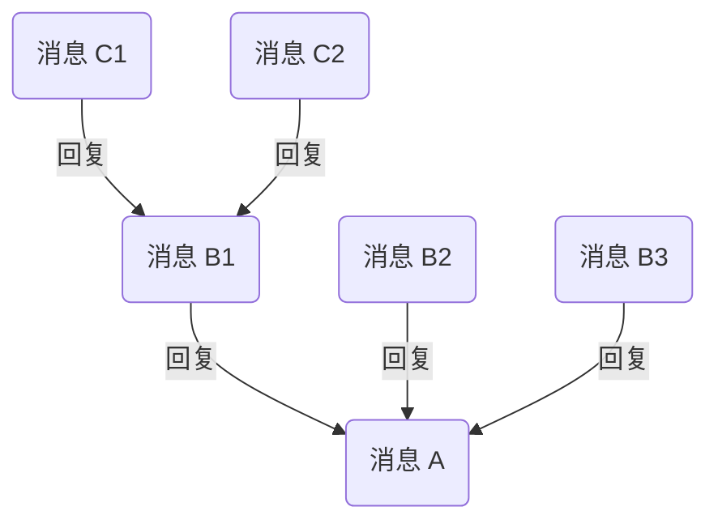
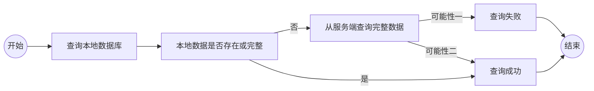

网易云信即时通讯 SDK（NetEase IM SDK，简称 NIM SDK）支持多种消息扩展功能，助您快速实现多样化的消息业务场景。

本文介绍通过 NIM SDK 实现消息扩展功能，包括消息回复、Pin 消息、消息快捷评论、消息收藏功能。

## 支持平台

本文内容适用的开发平台或框架如下表所示，涉及的接口请参考下文 [相关接口](#相关接口) 章节：

安卓 | iOS | macOS/Windows | Web/uni-app/小程序 | Node.js/Electron | 鸿蒙 | Flutter
:----: | :----: | :----: | :----: | :----: | :----: | :----:
✔️️️️️️️ | ✔️️️️️️️ | ✔️️️️️️️ | ✔️️️️️️️ | ✔️️️️️️️ | ✔️️️️️️️ | ✔️️️️️

## 开通功能

1. 在 [网易云信控制台](https://app.yunxin.163.com/global/home) 首页 **应用管理** 中选择应用，然后单击 **IM 即时通讯** 下的 **功能配置** 按钮进入功能配置页。

    

2. 在顶部选择 **全局功能** 页签，开启对应的消息扩展功能。需要开通以下功能：

    - 会话消息标记（Pin 消息）
    - 会话消息回复
    - 消息快捷评论

## 实现消息回复

消息回复指，引用收到的某条消息并进行针对性的回复，形成以该消息为根消息的 Thread 树状结构。通过该功能，用户可针对某一条消息进行提问、反馈或补充相关背景信息，且不会对会话造成干扰。

Thread 消息树状结构示例见下图：



<!--  -->

上图中：

- 消息 A 是消息 B 的 **父消息**，消息 B1 是消息 C 的 **父消息**
- 消息 C 是消息 B1 的 **子消息**
- 消息 A 是消息 B 和消息 C 的 **根消息**
- 消息 A、B、C 统称为 **Threaded Message（串联起来的消息）**

::: note note :::
一条 Threaded Message 必须有一条父消息或至少一条子消息。如果一条消息既没有父消息，也没有子消息，则为普通消息。
:::

### 回复一条消息

调用 `replyMessage` 方法发送一条回复消息。

示例代码如下：

:::::: div linked-codes
::: code 安卓
```Java
V2NIMMessageService v2MessageService = NIMClient.getService(V2NIMMessageService.class);
// 以文本消息为例，构建文本消息
V2NIMMessage v2Message = V2NIMMessageCreator.createTextMessage("xxx");
// V2NIMMessage replyMessage = ; // 被回复的消息

// 根据实际情况配置
V2NIMMessageAntispamConfig antispamConfig = V2NIMMessageAntispamConfig.V2NIMMessageAntispamConfigBuilder.builder()
.withAntispamBusinessId()
.withAntispamCheating()
.withAntispamCustomMessage()
.withAntispamEnabled()
.withAntispamExtension()
.build();

// 根据实际情况配置
V2NIMMessageConfig messageConfig = V2NIMMessageConfig.V2NIMMessageConfigBuilder.builder()
.withLastMessageUpdateEnabled()
.withHistoryEnabled()
.withOfflineEnabled()
.withOnlineSyncEnabled()
.withReadReceiptEnabled()
.withRoamingEnabled()
.withUnreadEnabled()
.build();

// 根据实际情况配置
V2NIMMessagePushConfig pushConfig = V2NIMMessagePushConfig.V2NIMMessagePushConfigBuilder.builder()
.withContent()
.withForcePush()
.withForcePushAccountIds()
.withForcePushContent()
.withPayload()
.withPushEnabled()
.withPushNickEnabled()
.build();

// 根据实际情况配置
V2NIMMessageRobotConfig robotConfig = V2NIMMessageRobotConfig.V2NIMMessageRobotConfigBuilder.builder()
.withAccountId()
.withCustomContent()
.withFunction()
.withTopic()
.build();

// 根据实际情况配置
V2NIMMessageRouteConfig routeConfig = V2NIMMessageRouteConfig.V2NIMMessageRouteConfigBuilder.builder()
.withRouteEnabled()
.withRouteEnvironment()
.build();

// 根据实际情况配置
V2NIMSendMessageParams sendMessageParams = V2NIMSendMessageParams.V2NIMSendMessageParamsBuilder.builder()
.withAntispamConfig(antispamConfig)
.withClientAntispamEnabled()
.withClientAntispamReplace()
.withMessageConfig(messageConfig)
.withPushConfig(pushConfig)
.withRobotConfig(robotConfig)
.withRouteConfig(routeConfig)
.build();

// 发送回复消息
v2MessageService.replyMessage(v2Message, replyMessage, sendMessageParams,
    new V2NIMSuccessCallback<V2NIMSendMessageResult>() {
        @Override
        public void onSuccess(V2NIMSendMessageResult v2NIMSendMessageResult) {
            // TODO: 发送成功
        }
    },
    new V2NIMFailureCallback() {
        @Override
        public void onFailure(V2NIMError error) {
            // TODO: 发送失败
        }
    },
    new V2NIMProgressCallback() {
        @Override
        public void onProgress(int progress) {
            // TODO: 发送进度
        }
    });
```
:::
::: code iOS
```Objective-C
// 以文本消息为例，构建文本消息
V2NIMMessage *replyMessage = [V2NIMMessageCreator createTextMessage:@"reply message"];
// 消息见参数设置文档
V2NIMSendMessageParams *params = [[V2NIMSendMessageParams alloc] init];

[[[NIMSDK sharedSDK] v2MessageService] sendMessage:replyMessage
                                    conversationId:@"conversationId"
                                            params:params
                                        success:^(V2NIMSendMessageResult * _Nonull result) {
                                            // 发送成功回调
                                            }
                                        failure:^(V2NIMError * _Nonnull error) {
                                            // 发送失败回调，error 包含错误原因
                                            }
                                        progress:^(NSUInteger progress) {
                                            // 发送进行
}];

V2NIMMessage *message = [V2NIMMessageCreator createTextMessage:@"message"];

// 发送回复消息
[[[NIMSDK sharedSDK] v2MessageService] replyMessage:message
                                    replyMessage:replyMessage
                                            params:params
                                            success:^(V2NIMSendMessageResult * _Nonnull result) {
                                            // 发送成功回调
                                            }
                                            failure:^(V2NIMError * _Nonnull error) {
                                            // 发送失败回调，error 包含错误原因
                                            }
                                        progress:^(NSUInteger progress) {
                                        // 发送进行
}];
```
:::
::: code macOS/Windows
```C++
// 以文本消息为例，构建文本消息
auto message = V2NIMMessageCreator::createTextMessage("hello world");
auto params = V2NIMSendMessageParams();
// 发送回复消息
messageService.replyMessage(
    message,
    replyMessage,
    params,
    [](V2NIMSendMessageResult result) {
        // reply message succeeded
    },
    [](V2NIMError error) {
        // reply message failed, handle error
    },
    [](uint32_t progress) {
        // upload progress
    });
```
:::
::: code Web/uni-app/小程序
```TypeScript
try {
// 以文本消息为例，构建文本消息
const message: V2NIMMessage = nim.V2NIMMessageCreator.createTextMessage("reply text")
const result: V2NIMSendMessageResult = await nim.V2NIMMessageService.replyMessage(message, repliedMessage)
// todo Success
} catch (err) {
// todo error
}
```
:::
::: code Node.js/Electron
```TypeScript
try {
  const replyMessage = v2.messageCreator.createTextMessage('Hello NTES IM')
  const result = await v2.messageService.replyMessage(message, replyMessage, params, progressCallback)
  // todo Success
} catch (err) {
  // todo error
}
```
:::
::: code 鸿蒙
```TypeScript
try {
const message: V2NIMMessage = nim.messageCreator.createTextMessage("reply text")
const result: V2NIMSendMessageResult = await nim.messageService.replyMessage(message, repliedMessage)
// todo Success
} catch (err) {
// todo error
}
```
:::
::: code Flutter
```Dart
await NimCore.instance.messageService.replyMessage(message, replyMessage, params);
```
:::
::::::

## 实现消息快捷评论

支持针对某条消息进行快捷评论，评论内容通常为表情、短文本，由应用层定义评论内容与 UI 展示之间的映射关系。

### 注册消息监听器

:::::: div linked-codes
::: code 安卓
调用 [`addMessageListener`](https://doc.yunxin.163.com/messaging2/client-apis/zIwODM2NTM?platform=client#addMessageListener) 方法注册消息监听器，监听消息快捷评论通知回调 `onMessageQuickCommentNotification`。
```Java
V2NIMMessageService v2MessageService = NIMClient.getService(V2NIMMessageService.class);

V2NIMMessageListener messageListener = new V2NIMMessageListener() {

    @Override
    public void onMessageQuickCommentNotification(V2NIMMessageQuickCommentNotification quickCommentNotification) {
    // receive message quick comment notification
    }
};
v2MessageService.addMessageListener(messageListener);
```
:::
::: code iOS
调用 [`addMessageListener`](https://doc.yunxin.163.com/messaging2/client-apis/zIwODM2NTM?platform=client#addMessageListener) 方法注册消息监听器，监听消息快捷评论通知回调 `onMessageQuickCommentNotification`。
```Objective-C
[[[NIMSDK sharedSDK] v2MessageService] addMessageListener:listener];
```
:::
::: code macOS/Windows
调用 [`addMessageListener`](https://doc.yunxin.163.com/messaging2/client-apis/zIwODM2NTM?platform=client#addMessageListener) 方法注册消息监听器，监听消息快捷评论通知回调 `onMessageQuickCommentNotification`。
```C++
V2NIMMessageListener listener;
listener.onMessageQuickCommentNotification = [](V2NIMMessageQuickCommentNotification quickCommentNotification) {
    // receive message quick comment notification
};
messageService.addMessageListener(listener);
```
:::
::: code Web/uni-app/小程序
调用 [`on("EventName")`](https://doc.yunxin.163.com/messaging2/client-apis/zIwODM2NTM?platform=client#on) 方法注册消息监听器，监听消息接收回调事件 `onMessageQuickCommentNotification`。
```TypeScript
nim.V2NIMMessageService.on("onMessageQuickCommentNotification", function (quickCommentNotification: V2NIMMessageQuickCommentNotification) {})
```
:::
::: code Node.js/Electron
调用 [`on("EventName")`](https://doc.yunxin.163.com/messaging2/client-apis/zIwODM2NTM?platform=client#on) 方法注册消息监听器，监听消息接收回调事件 `onMessageQuickCommentNotification`。
```TypeScript
v2.messageService.on("messageQuickCommentNotification", function (quickCommentNotification: V2NIMMessageQuickCommentNotification) {})
```
:::
::: code 鸿蒙
调用 [`on("EventName")`](https://doc.yunxin.163.com/messaging2/client-apis/zIwODM2NTM?platform=client#on) 方法注册消息监听器，监听消息接收回调事件 `onMessageQuickCommentNotification`。
```TypeScript
nim.messageService.on("onMessageQuickCommentNotification", function (quickCommentNotification: V2NIMMessageQuickCommentNotification) {})
```
:::
::: code Flutter

调用 [`listen`](https://doc.yunxin.163.com/messaging2/client-apis/TU1MDAxMjA?platform=client#listen) 方法注册消息监听器，监听消息接收回调事件 `onMessageQuickCommentNotification`。

```Dart
subsriptions.add(NimCore
    .instance.messageService.onMessageQuickCommentNotification
    .listen((event) {
//do something
}));
```
:::
::::::

### 添加快捷评论

调用 `addQuickComment` 方法针对指定消息添加一条快捷评论。添加成功后，消息发送方和消息接收方均会收到消息快捷评论操作通知回调 `onMessageQuickCommentNotification` 并通知 UI 界面更新。

示例代码

:::::: div linked-codes
::: code 安卓
```Java
V2NIMMessageService v2MessageService = NIMClient.getService(V2NIMMessageService.class);

V2NIMMessageQuickCommentPushConfig quickCommentPushConfig = V2NIMMessageQuickCommentPushConfig.V2NIMMessageQuickCommentPushConfigBuilder.builder()
// 根据实际情况设置
.withNeedBadge()
.withPushContent()
.withPushEnabled()
.withPushPayload()
.withPushTitle()
.build();

// V2NIMMessage quickCommentMessage = ; // 添加快捷评论的消息
// int quickCommentIndex = ; // 快捷评论的序号

// 添加快捷评论
v2MessageService.addQuickComment(quickCommentMessage, quickCommentIndex, "xxx", quickCommentPushConfig,
        new V2NIMSuccessCallback<Void>() {
            @Override
            public void onSuccess(Void unused) {

            }
        },
        new V2NIMFailureCallback() {
            @Override
            public void onFailure(V2NIMError error) {

            }
        });
```
:::
::: code iOS
```Objective-C
V2NIMMessageQuickCommentPushConfig *quickCommentPushConfig = [[V2NIMMessageQuickCommentPushConfig alloc] init];
// 添加快捷评论
[[[NIMSDK sharedSDK] v2MessageService] addQuickComment:message
                                                index:1
                                    serverExtension:@"serverExtension"
                                        pushConfig:quickCommentPushConfig
                                            success:^{
    // success
} failure:^(V2NIMError * _Nonnull error) {
    // error 包含错误原因
}];
```
:::
::: code macOS/Windows
```C++
V2NIMMessage message;

V2NIMMessageQuickCommentPushConfig pushConfig;
// 添加快捷评论
messageService.addQuickComment(
    message,
    1,
    "serverExtension",
    pushConfig,
    []() {
        // add quick comment succeeded
    },
    [](V2NIMError error) {
        // add quick comment failed, handle error
    });
```
:::
::: code Web/uni-app/小程序
```TypeScript
try {
// 添加快捷评论
await nim.V2NIMMessageService.addQuickComment(message, 1, 'serverExtension')
// todo Success
} catch (err) {
// todo error
}
```
:::
::: code Node.js/Electron
```TypeScript
try {
  await v2.messageService.addQuickComment(message, index, 'serverExtension', pushConfig)
  // todo Success
} catch (err) {
  // todo error
}
```
:::
::: code 鸿蒙
```TypeScript
try {
await nim.messageService.addQuickComment(message, 1, 'serverExtension')
// todo Success
} catch (err) {
// todo error
}
```
:::
::: code Flutter
```Dart
await NimCore.instance.messageService.addQuickComment(message, index, serverExtension, pushConfig);
```
:::
::::::

### 移除快捷评论

调用 `removeQuickComment` 方法移除一条快捷评论。移除成功后，消息发送方和消息接收方均会收到消息快捷评论操作通知回调 `onMessageQuickCommentNotification`。

示例代码

:::::: div linked-codes
::: code 安卓
```Java
V2NIMMessageService v2MessageService = NIMClient.getService(V2NIMMessageService.class);

// V2NIMMessageRefer quickCommentMessageRefer // 移除快捷评论的消息引用
// int quickCommentIndex // 快捷评论的序号

// 移除快捷评论
v2MessageService.removeQuickComment(quickCommentMessageRefer, quickCommentIndex, "xxx",
        new V2NIMSuccessCallback<Void>() {
            @Override
            public void onSuccess(Void unused) {
            // success
            }
        },
        new V2NIMFailureCallback() {
            @Override
            public void onFailure(V2NIMError error) {
            // failed, handle error
            }
        });
```
:::
::: code iOS
```Objective-C
V2NIMMessageRefer *refer = [[V2NIMMessageRefer alloc] init];
// 移除快捷评论
[[[NIMSDK sharedSDK] v2MessageService] removeQuickComment:refer index:1 serverExtension:@"serverExtension" success:^{
    // success
} failure:^(V2NIMError * _Nonnull error) {
    // error 包含错误原因
}];
```
:::
::: code macOS/Windows
```C++
V2NIMMessageRefer messageRefer;

// 移除快捷评论
messageService.removeQuickComment(
    messageRefer,
    1,
    "serverExtension",
    []() {
        // remove quick comment succeeded
    },
    [](V2NIMError error) {
        // remove quick comment failed, handle error
    });
```
:::
::: code Web/uni-app/小程序
```TypeScript
try {
// 移除快捷评论
await nim.V2NIMMessageService.removeQuickComment(messageRefer, 1, 'serverExtension')
// Update UI with success message.
} catch (err) {
// todo error
}
```
:::
::: code Node.js/Electron
```TypeScript
try {
  await v2.messageService.removeQuickComment(messageRefer, index, 'serverExtension')
  // todo Success
} catch (err) {
  // todo error
}
```
:::
::: code 鸿蒙
```TypeScript
try {
await nim.messageService.removeQuickComment(messageRefer, 1, 'serverExtension')
// todo Success
} catch (err) {
// todo error
}
```
:::
::: code Flutter
```Dart
await NimCore.instance.messageService.removeQuickComment(messageRefer, index, serverExtension);
```
:::
::::::

### 获取快捷评论列表

调用 `getQuickCommentList` 获取指定消息的所有快捷评论。获取结果不包含已删除消息的快捷评论，按照评论时间排序。

示例代码

:::::: div linked-codes
::: code 安卓
```Java
V2NIMMessageService v2MessageService = NIMClient.getService(V2NIMMessageService.class);

// List<V2NIMMessage> messages // 需要查询快捷评论的消息列表

v2MessageService.getQuickCommentList(messages,
        new V2NIMSuccessCallback<Map<String, List<V2NIMMessageQuickComment>>>() {
            @Override
            public void onSuccess(Map<String, List<V2NIMMessageQuickComment>> stringListMap) {
            // success
            }
        },
        new V2NIMFailureCallback() {
            @Override
            public void onFailure(V2NIMError error) {
            // failed, handle error
            }
        });
```
:::
::: code iOS
```Objective-C
[[[NIMSDK sharedSDK] v2MessageService] getQuickCommentList:@[message1, message2]
                                                success:^(NSDictionary<NSString *,NSArray<V2NIMMessageQuickComment *> *> * _Nonnull result) {
    // 返回 Dictionary 被快捷评论的消息
}
                                                failure:^(V2NIMError * _Nonnull error) {
    // error 包含错误原因
}];
```
:::
::: code macOS/Windows
```C++
nstd::vector<V2NIMMessage> messages
// ...
messageService.getQuickCommentList(
    messages,
    [](nstd::map<nstd::string, nstd::vector<V2NIMMessageQuickComment>> quiments) {
        for (auto&& quickComment : quickComments) {
            // do something
        }
    },
    [](V2NIMError error) {
        // get quick comment list failed, handle error
    });
```
:::
::: code Web/uni-app/小程序
```TypeScript
try {
const quickCommentList = await nim.V2NIMMessageService.getQuickCommentList(messages)
// Update UI with success message.
} catch (err) {
// todo error
}
```
:::
::: code Node.js/Electron
```TypeScript
try {
  const result = await v2.messageService.getQuickCommentList(messages)
  // todo Success
} catch (err) {
  // todo error
}
```
:::
::: code 鸿蒙
```TypeScript
try {
const quickCommentList = await nim.messageService.getQuickCommentList(messages)
// todo Success
} catch (err) {
// todo error
}
```
:::
::: code Flutter
```Dart
await NimCore.instance.messageService.getQuickCommentList(messages);
```
:::
::::::

## 实现收藏功能

支持收藏已发送成功的消息或其他自定义内容。

### 添加一条收藏

调用 `addCollection` 方法添加一条收藏。

示例代码

:::::: div linked-codes
::: code 安卓
```Java
V2NIMMessageService v2MessageService = NIMClient.getService(V2NIMMessageService.class);

// int collectionType = ;
// String collectionData = ;

V2NIMAddCollectionParams addCollectionParams = V2NIMAddCollectionParams.V2NIMAddCollectionParamsBuilder
// 必填
.builder(collectionType, collectionData)
// 根据实际情况配置
.withServerExtension()
.build();

v2MessageService.addCollection(addCollectionParams,
        new V2NIMSuccessCallback<V2NIMCollection>() {
            @Override
            public void onSuccess(V2NIMCollection v2NIMCollection) {
            // success
            }
        },
        new V2NIMFailureCallback() {
            @Override
            public void onFailure(V2NIMError error) {
            // failed, handle error
            }
        });
```
:::
::: code iOS
```Objective-C
V2NIMAddCollectionParams *addCollectionParams = [[V2NIMAddCollectionParams alloc] init];
[[[NIMSDK sharedSDK] v2MessageService] addCollection:addCollectionParams
                                            success:^(V2NIMCollection * _Nonnull result) {
    // V2NIMCollection
}
                                            failure:^(V2NIMError * _Nonnull error) {
    // error 包含错误原因
}];
```
:::
::: code macOS/Windows
```C++
V2NIMAddCollectionParams params;
params.collectionClientId = "id1";
params.collectionType = 1;
params.collectionData = "data";
params.serverExtension = "serverExtension";
messageService.addCollection(
    params,
    [](V2NIMCollection collection) {
        // add collection succeeded
    },
    [](V2NIMError error) {
        // add collection failed, handle error
    });
```
:::
::: code Web/uni-app/小程序
```TypeScript
try {
const res: V2NIMCollection = await nim.V2NIMMessageService.addCollection({
    collectionType: 1,
    collectionData: 'data',
    serverExtension: 'serverExtension'
})
// todo Success
} catch (err) {
// todo error
}
```
:::
::: code Node.js/Electron
```TypeScript
try {
  const result = await v2.messageService.addCollection(params)
  // todo Success
} catch (err) {
  // todo error
}
```
:::
::: code 鸿蒙
```TypeScript
try {
const res: V2NIMCollection = await nim.messageService.addCollection({
    collectionType: 1,
    collectionData: 'data',
    serverExtension: 'serverExtension'
})
// todo Success
} catch (err) {
// todo error
}
```
:::
::: code Flutter
```Dart
await NimCore.instance.messageService.addCollection(params);
```
:::
::::::

### 批量移除收藏

调用 `removeCollections` 批量移除收藏列表。

示例代码

:::::: div linked-codes
::: code 安卓
```Java
V2NIMMessageService v2MessageService = NIMClient.getService(V2NIMMessageService.class);

// List<V2NIMCollection> collections = ; // 需要移除的相关收藏
v2MessageService.removeCollections(collections,
    new V2NIMSuccessCallback<Void>() {
        @Override
        public void onSuccess(Void unused) {

        }
    },
    new V2NIMFailureCallback() {
        @Override
        public void onFailure(V2NIMError error) {

        }
    });
```
:::
::: code iOS
```Objective-C
V2NIMCollection *collection = [[V2NIMCollection alloc] init];
[[[NIMSDK sharedSDK] v2MessageService] removeCollections:@[collection]
                                                success:^(int count) {
    // count
}
                                                failure:^(V2NIMError * _Nonnull error) {
    // error 包含错误原因
}];
```
:::
::: code macOS/Windows
```C++
nstd::vector<V2NIMCollection> collections;
// ...
messageService.removeCollections(
    collections,
    []() {
        // remove collection succeeded
    },
    [](V2NIMError error) {
        // remove collection failed, handle error
    });
```
:::
::: code Web/uni-app/小程序
```TypeScript
try {
const res: number = await nim.V2NIMMessageService.removeCollections(collections)
// todo Success
} catch (err) {
// todo error
}
```
:::
::: code Node.js/Electron
```TypeScript
try {
  const count = await v2.messageService.removeCollections(collections)
  // todo Success
} catch (err) {
  // todo error
}
```
:::
::: code 鸿蒙
```TypeScript
try {
const res: number = await nim.messageService.removeCollections(collections)
// todo Success
} catch (err) {
// todo error
}
```
:::
::: code Flutter
```Dart
await NimCore.instance.messageService.removeCollections(collections);
```
:::
::::::

### 更新收藏的服务端扩展字段

调用 `updateCollectionExtension` 更新收藏的服务端扩展字段。

示例代码

:::::: div linked-codes
::: code 安卓
```Java
V2NIMMessageService v2MessageService = NIMClient.getService(V2NIMMessageService.class);

//V2NIMCollection collection = ; // 需要更新的收藏信息
v2MessageService.updateCollectionExtension(collection, "xxx",
new V2NIMSuccessCallback<V2NIMCollection>() {
    @Override
    public void onSuccess(V2NIMCollection v2NIMCollection) {
    // success
    }
},
    new V2NIMFailureCallback() {
    @Override
    public void onFailure(V2NIMError error) {
    // failed, handle error
    }
});
```
:::
::: code iOS
```Objective-C
[[[NIMSDK sharedSDK] v2MessageService] updateCollectionExtension:collection
                                            serverExtension:@"serverExtension"
                                                        success:^(V2NIMCollection * _Nonnull result) {
        // result 更新后的 collection
    }
                                                        failure:^(V2NIMError * _Nonnull error) {
        // error 包含错误原因
    }];
```
:::
::: code macOS/Windows
```C++
V2NIMCollection collection
// ...
messageService.updateCollectionExtension(
    collection,
    "serverExtension",
    [](V2NIMCollection collection) {
        // update collection succeeded
    },
    [](V2NIMError error) {
        // update collection failed, handle error
    });
```
:::
::: code Web/uni-app/小程序
```TypeScript
try {
const collection: V2NIMCollection = await nim.V2NIMMessageService.updateCollectionExtension(collection, 'newExtension')
// todo Success
} catch (err) {
// todo error
}
```
:::
::: code Node.js/Electron
```TypeScript
try {
  const result = await v2.messageService.updateCollectionExtension(collection, 'serverExtension')
  // todo Success
} catch (err) {
  // todo error
}
```
:::
::: code 鸿蒙
```TypeScript
try {
const collection: V2NIMCollection = await nim.messageService.updateCollectionExtension(collection, 'newExtension')
// todo Success
} catch (err) {
// todo error
}
```
:::
::: code Flutter
```Dart
await NimCore.instance.messageService.updateCollectionExtension(collection, serverExtension);
```
:::
::::::

### 按照查询条件分页获取收藏列表

调用 `getCollectionListExByOption` 或 `getCollectionListByOption` 方法按照查询条件分页获取收藏列表。

前者较后者回参新增 `totalCount` 字段，表示收藏总数，请优先使用 `getCollectionListExByOption`。

`getCollectionListExByOption` 示例代码如下：

:::::: div linked-codes
::: code 安卓
```Java
V2NIMCollectionOption option = V2NIMCollectionOption.V2NIMCollectionOptionBuilder.builder()
        // 按需设置
//                .withAnchorCollection()
//                .withBeginTime()
//                .withCollectionType()
//                .withDirection()
//                .withEndTime()
//                .withLimit()
        .build();

NIMClient.getService(V2NIMMessageService.class).getCollectionListExByOption(option,
        new V2NIMSuccessCallback<V2NIMCollectionListResult>() {
            @Override
            public void onSuccess(V2NIMCollectionListResult v2NIMCollectionListResult) {

            }
        }, new V2NIMFailureCallback() {
            @Override
            public void onFailure(V2NIMError error) {

            }
        });
```
:::
::: code iOS
```Objective-C
V2NIMCollectionOption *option = [[V2NIMCollectionOption alloc] init];
// 按需设置
//option.anchorCollection = nil;
//option.beginTime = 0;
//option.collectionType = 0;
//option.direction = 0;
//option.endTime = 0;
//option.limit = 0;
[[NIMSDK sharedSDK].v2MessageService getCollectionListExByOption:option success:^(V2NIMCollectionListResult * _Nonnull result) {

    } failure:^(V2NIMError * _Nonnull error) {

    }];
```
:::
::: code macOS/Windows
```C++
V2NIMCollectionOption option;
option.collectionType = 1;
option.limit = 10;
messageService.getCollectionListExByOption(
    option,
    [](V2NIMCollectionListResult result) {
        for (auto&& collection : result.collectionList) {
            // do something
        }
    },
    [](V2NIMError error) {
        // get collection list failed, handle error
    });
```
:::
::: code Web/uni-app/小程序
```TypeScript
try {
  const res: V2NIMCollectionListResult = await nim.V2NIMMessageService.getCollectionListExByOption({
    beginTime: 0,
    endTime: 0,
    direction: 0,
    limit: 100,
    collectionType: 0
  });
  // todo: Success
} catch (err) {
  // todo: error
}
```
:::
::: code Node.js/Electron
```TypeScript
const result = await v2.messageService.getCollectionListExByOption(option)
```
:::
<!--暂不支持
::: code 鸿蒙
```TypeScript

```
:::
-->
::: code Flutter
```dart
await NimCore.instance.messageService.getCollectionListExByOption(option);
```
:::
::::::

`getCollectionListByOption` 示例代码如下：

:::::: div linked-codes
::: code 安卓
```Java
V2NIMMessageService v2MessageService = NIMClient.getService(V2NIMMessageService.class);
// 根据实际情况配置
V2NIMCollectionOption option = V2NIMCollectionOption.V2NIMCollectionOptionBuilder.builder()
.withAnchorCollection()
.withBeginTime()
.withCollectionType()
.withDirection()
.withEndTime()
.withLimit()
.build();

v2MessageService.getCollectionListByOption(option,
        new V2NIMSuccessCallback<List<V2NIMCollection>>() {
            @Override
            public void onSuccess(List<V2NIMCollection> v2NIMCollections) {
            // success
            }
        },
        new V2NIMFailureCallback() {
            @Override
            public void onFailure(V2NIMError error) {
            // failed, handle error
            }
        });
```
:::
::: code iOS
```Objective-C
V2NIMCollectionOption *collectionOption = [[V2NIMCollectionOption alloc] init];
[[[NIMSDK sharedSDK] v2MessageService] getCollectionListByOption:collectionOption
                                                        success:^(NSArray<V2NIMCollection *> * _Nonnull result) {
    // result V2NIMCollection list
}
                                                        failure:^(V2NIMError * _Nonnull error) {
    // error 包含错误原因
}];
```
:::
::: code macOS/Windows
```C++
V2NIMCollectionOption option;
option.collectionType = 1;
option.limit = 10;
messageService.getCollectionListByOption(
    option,
    [](nstd::vector<V2NIMCollection> collections) {
        for (auto&& collection : collections) {
            // do something
        }
    },
    [](V2NIMError error) {
        // get collection list failed, handle error
    });
```
:::
::: code Web/uni-app/小程序
```TypeScript
try {
const res: V2NIMCollection[] = await nim.V2NIMMessageService.getCollectionListByOption({
    beginTime: 0,
    endTime: 0,
    direction: 0,
    limit: 100,
    collectionType: 0
})
// todo Success
} catch (err) {
// todo error
}
```
:::
::: code Node.js/Electron
```TypeScript
try {
  const result = await v2.messageService.getCollectionListByOption(option)
  // todo Success
} catch (err) {
  // todo error
}
```
:::
::: code 鸿蒙
```TypeScript
try {
const res: V2NIMCollection[] = await nim.messageService.getCollectionListByOption({
    beginTime: 0,
    endTime: 0,
    direction: 0,
    limit: 100,
    collectionType: 0
})
// todo Success
} catch (err) {
// todo error
}
```
:::
::: code Flutter
```Dart
await NimCore.instance.messageService.getCollectionListByOption(option);
```
:::
::::::

## 实现 PIN 消息

支持将会话中的重要消息执行 PIN 操作，被 PIN 的消息会以列表形式展示在 UI 界面。

一条消息可以被所在会话内的所有用户 执行 PIN 操作，PIN 消息对会话内的所有成员可见。如果多个用户对同一条消息执行 PIN 操作，较晚的 PIN 会覆盖之前的 PIN。

### 注册消息监听器

:::::: div linked-codes
::: code 安卓
调用 [`addMessageListener`](https://doc.yunxin.163.com/messaging2/client-apis/zIwODM2NTM?platform=client#addMessageListener) 方法注册消息监听器，监听消息快捷评论通知回调 `onMessagePinNotification`。
```Java
V2NIMMessageService v2MessageService = NIMClient.getService(V2NIMMessageService.class);

V2NIMMessageListener messageListener = new V2NIMMessageListener() {

    @Override
    public void onMessagePinNotification(V2NIMMessagePinNotification pinNotification) {
    // receive message pin notification
    }
};
v2MessageService.addMessageListener(messageListener);
```
:::
::: code iOS
调用 [`addMessageListener`](https://doc.yunxin.163.com/messaging2/client-apis/zIwODM2NTM?platform=client#addMessageListener) 方法注册消息监听器，监听消息快捷评论通知回调 `onMessagePinNotification`。
```Objective-C
[[[NIMSDK sharedSDK] v2MessageService] addMessageListener:listener];
```
:::
::: code macOS/Windows
调用 [`addMessageListener`](https://doc.yunxin.163.com/messaging2/client-apis/zIwODM2NTM?platform=client#addMessageListener) 方法注册消息监听器，监听消息快捷评论通知回调 `onMessagePinNotification`。
```C++
V2NIMMessageListener listener;
listener.onMessagePinNotification = [](V2NIMMessagePinNotification pinNotification) {
    // receive message pin notification
};
messageService.addMessageListener(listener);
```
:::
::: code Web/uni-app/小程序
调用 [`on("EventName")`](https://doc.yunxin.163.com/messaging2/client-apis/zIwODM2NTM?platform=client#on) 方法注册消息监听器，监听消息接收回调事件 `onMessagePinNotification`。
```TypeScript
nim.V2NIMMessageService.on("onMessagePinNotification", function (pinNotification: V2NIMMessagePinNotification) {})
```
:::
::: code Node.js/Electron
调用 [`on("EventName")`](https://doc.yunxin.163.com/messaging2/client-apis/zIwODM2NTM?platform=client#on) 方法注册消息监听器，监听消息接收回调事件 `onMessagePinNotification`。
```TypeScript
v2.messageService.on("messagePinNotification", function (pinNotification: V2NIMMessagePinNotification) {})
```
:::
::: code 鸿蒙
调用 [`on("EventName")`](https://doc.yunxin.163.com/messaging2/client-apis/zIwODM2NTM?platform=client#on) 方法注册消息监听器，监听消息接收回调事件 `onMessagePinNotification`。
```TypeScript
nim.messageService.on("onMessagePinNotification", function (pinNotification: V2NIMMessagePinNotification) {})
```
:::
::: code Flutter

调用 [`listen`](https://doc.yunxin.163.com/messaging2/client-apis/TU1MDAxMjA?platform=client#listen) 方法注册消息监听器，监听消息接收回调事件 `onMessagePinNotification`。

```Dart
subsriptions.add(NimCore
    .instance.messageService.onMessagePinNotification
    .listen((event) {
//do something
}));
```
:::
::::::

### PIN 一条消息

调用 `pinMessage` 方法针对指定消息执行 PIN 操作。PIN 成功后，消息发送方和消息接收方均会收到 PIN 消息状态变化通知回调 `onMessagePinNotification` 并通知 UI 界面更新。

示例代码

:::::: div linked-codes
::: code 安卓
```Java
V2NIMMessageService v2MessageService = NIMClient.getService(V2NIMMessageService.class);

// V2NIMMessage pinMessage = ; // 被 PIN 的消息
// PIN 一条消息
v2MessageService.pinMessage(pinMessage, "xxx",
        new V2NIMSuccessCallback<Void>() {
            @Override
            public void onSuccess(Void unused) {
            // success
            }
        },
        new V2NIMFailureCallback() {
            @Override
            public void onFailure(V2NIMError error) {
            // failed, handle error
            }
        });
```
:::
::: code iOS
```Objective-C
// PIN 一条消息
[[[NIMSDK sharedSDK] v2MessageService] pinMessage:message
                                serverExtension:@"json string"
                                        success:^{
    // success
}
                                        failure:^(V2NIMError * _Nonnull error) {
    // error 包含错误原因
}];
```
:::
::: code macOS/Windows
```C++
V2NIMMessage message;

// PIN 一条消息
messageService.pinMessage(
    message,
    "serverExtension",
    []() {
        // pin message succeeded
    },
    [](V2NIMError error) {
        // pin message failed, handle error
    });
```
:::
::: code Web/uni-app/小程序
```TypeScript
try {
// PIN 一条消息
await nim.V2NIMMessageService.pinMessage(message, 'serverExtension')
// Update UI with success message.
} catch (err) {
// todo error
}
```
:::
::: code Node.js/Electron
```TypeScript
try {
  await v2.messageService.pinMessage(message, 'serverExtension')
  // todo Success
} catch (err) {
  // todo error
}
```
:::
::: code 鸿蒙
```TypeScript
try {
await nim.messageService.pinMessage(message, 'serverExtension')
// todo Success
} catch (err) {
// todo error
}
```
:::
::: code Flutter
```Dart
await NimCore.instance.messageService.pinMessage(message, serverExtension);
```
:::
::::::

### 更新 PIN 消息服务端扩展字段

调用 `updatePinMessage` 方法更新 PIN 消息服务端扩展字段。更新 PIN 消息成功后，消息发送方和消息接收方均会收到 PIN 消息状态变化通知回调 `onMessagePinNotification` 并通知 UI 界面更新。

::: note note
如果更新 PIN 消息的操作人非当前登录账号，则 `operatorId` 变更为更新 PIN 消息的实际操作人。
:::

示例代码

:::::: div linked-codes
::: code 安卓
```Java
V2NIMMessageService v2MessageService = NIMClient.getService(V2NIMMessageService.class);

// V2NIMMessage updateMessage = ; // 被更新的消息
// 更新 PIN 消息服务端字段
v2MessageService.updatePinMessage(updateMessage, "xxx",
    new V2NIMSuccessCallback<Void>() {
        @Override
        public void onSuccess(Void unused) {

        }
    },
    new V2NIMFailureCallback() {
        @Override
        public void onFailure(V2NIMError error) {

        }
    });
```
:::
::: code iOS
```Objective-C
// 更新 PIN 消息服务端字段
[[[NIMSDK sharedSDK] v2MessageService] updatePinMessage:message
                                        serverExtension:@"json string"
                                                success:^{
    // success
}
                                                failure:^(V2NIMError * _Nonnull error) {
    //error 包含错误原因
}];
```
:::
::: code macOS/Windows
```C++
V2NIMMessage message;

// 更新 PIN 消息服务端字段
messageService.updatePinMessage(
    message,
    // 服务端字段
    "serverExtension",
    []() {
        // update pin message succeeded
    },
    [](V2NIMError error) {
        // update pin message failed, handle error
    });
```
:::
::: code Web/uni-app/小程序
```TypeScript
try {
// 更新 PIN 消息服务端字段
await nim.V2NIMMessageService.updatePinMessage(message, 'serverExtension')
// Update UI with success message.
} catch (err) {
// todo error
}
```
:::
::: code Node.js/Electron
```TypeScript
try {
  await v2.messageService.updatePinMessage(message, 'serverExtension')
  // todo Success
} catch (err) {
  // todo error
}
```
:::
::: code 鸿蒙
```TypeScript
try {
await nim.messageService.updatePinMessage(message, 'serverExtension')
// todo Success
} catch (err) {
// todo error
}
```
:::
::: code Flutter
```Dart
await NimCore.instance.messageService.updatePinMessage(message, serverExtension);
```
:::
::::::

### 取消 PIN 消息

调用 `unpinMessage` 方法取消 PIN 一条消息。取消 PIN 消息成功后，消息发送方和消息接收方均会收到 PIN 消息状态变化通知回调 `onMessagePinNotification` 并通知 UI 界面更新。

示例代码

:::::: div linked-codes
::: code 安卓
```Java
V2NIMMessageService v2MessageService = NIMClient.getService(V2NIMMessageService.class);

// V2NIMMessageRefer unpinMessageRefer // 被取消 PIN 的消息参考信息
v2MessageService.unpinMessage(unpinMessageRefer, "xxx",
        new V2NIMSuccessCallback<Void>() {
            @Override
            public void onSuccess(Void unused) {
            // success
            }
        },
        new V2NIMFailureCallback() {
            @Override
            public void onFailure(V2NIMError error) {
            // failed, handle error
            }
        });
```
:::
::: code iOS
```Objective-C
// 取消 PIN，传入 PIN 消息参考信息
[[[NIMSDK sharedSDK] v2MessageService] unpinMessage:messageRefer
                                    serverExtension:@"json string"
                                            success:^{
    // success
}
                                            failure:^(V2NIMError * _Nonnull error) {
    // error 包含错误原因
}];
```
:::
::: code macOS/Windows
```C++
V2NIMMessageRefer messageRefer;

messageService.unpinMessage(
    // 被取消 PIN 的消息参考信息
    messageRefer,
    "serverExtension",
    []() {
        // unpin message succeeded
    },
    [](V2NIMError error) {
        // unpin message failed, handle error
    });
```
:::
::: code Web/uni-app/小程序
```TypeScript
try {
await nim.V2NIMMessageService.unpinMessage(messageRefer, 'serverExtension')
// Update UI with success message.
} catch (err) {
// todo error
}
```
:::
::: code Node.js/Electron
```TypeScript
try {
  await v2.messageService.unpinMessage(messageRefer, 'serverExtension')
  // todo Success
} catch (err) {
  // todo error
}
```
:::
::: code 鸿蒙
```TypeScript
try {
await nim.messageService.unpinMessage(messageRefer, 'serverExtension')
// todo Success
} catch (err) {
// todo error
}
```
:::
::: code Flutter
```Dart
await NimCore.instance.messageService.unpinMessage(messageRefer, serverExtension);
```
:::
::::::

### 获取 PIN 消息列表

调用 `getPinnedMessageList` 获取会话内所有 PIN 消息。获取结果不包含已删除、已撤回的消息，结果按照更新时间排序。

示例代码

:::::: div linked-codes
::: code 安卓
```Java
V2NIMMessageService v2MessageService = NIMClient.getService(V2NIMMessageService.class);

// 以单聊为例
V2NIMConversationType conversationType = V2NIMConversationType.V2NIM_CONVERSATION_TYPE_P2P;
// 构建会话 ID
String conversationId = V2NIMConversationIdUtil.conversationId("xxx", conversationType);

v2MessageService.getPinnedMessageList(conversationId,
        new V2NIMSuccessCallback<List<V2NIMMessagePin>>() {
            @Override
            public void onSuccess(List<V2NIMMessagePin> v2NIMMessagePins) {
            // success, return V2NIMMessagePin list
            }
        },
        new V2NIMFailureCallback() {
            @Override
            public void onFailure(V2NIMError error) {
            // failed, handle error
            }
        });
```
:::
::: code iOS
```Objective-C
[[[NIMSDK sharedSDK] v2MessageService] getPinnedMessageList:@"conversationId"
                                                    success:^(NSArray<V2NIMMessagePin *> * _Nonnull result) {
    // success，返回 V2NIMMessagePin 数组
}
                                                    failure:^(V2NIMError * _Nonnull error) {
    // error 包含错误原因
}];
```
:::
::: code macOS/Windows
```C++
// 构建会话 ID
auto conversationId = V2NIMConversationIdUtil::p2pConversationId("target_account_id");
messageService.getPinnedMessageList(
    conversationId,
    [](std::vector<V2NIMMessagePin> pins) {
        for (auto&& pin : pins) {
            // do something
        }
    },
    [](V2NIMError error) {
        // get pin message list failed, handle error
    });
```
:::
::: code Web/uni-app/小程序
```TypeScript
try {
const messagePinArr = await nim.V2NIMMessageService.getPinnedMessageList('me|1|another')
// todo Success
} catch (err) {
// todo error
}
```
:::
::: code Node.js/Electron
```TypeScript
try {
  const result = await v2.messageService.getPinnedMessageList(conversationId)
  // todo Success
} catch (err) {
  // todo error
}
```
:::
::: code 鸿蒙
```TypeScript
try {
const messagePinArr = await nim.messageService.getPinnedMessageList('me|1|another')
// todo Success
} catch (err) {
// todo error
}
```
:::
::: code Flutter
```Dart
await NimCore.instance.messageService.getPinnedMessageList(conversationId);
```
:::
::::::

## 消息参考信息

### 根据消息参考信息获取消息列表

当消息数据不明确时，可使用该接口获取消息。推荐回复消息、PIN 消息场景下使用。

调用 `getMessageListByRefers` 方法根据参考信息获取消息列表。

SDK 查询策略如下：



<!--  -->

示例代码

:::::: div linked-codes
::: code 安卓
```Java
V2NIMMessageService v2MessageService = NIMClient.getService(V2NIMMessageService.class);

List<V2NIMMessageRefer> messageRefers = new ArrayList<>();
// 根据实际情况增加
// messageRefers.add(messageRefer);
v2MessageService.getMessageListByRefers(messageRefers,
        new V2NIMSuccessCallback<List<V2NIMMessage>>() {
            @Override
            public void onSuccess(List<V2NIMMessage> v2NIMMessages) {
            // success, return V2NIMMessage list
            }
        },
        new V2NIMFailureCallback() {
            @Override
            public void onFailure(V2NIMError error) {
            // failed, handle error
            }
        });
```
:::
::: code iOS
```Objective-C
V2NIMMessageRefer *refer1 = [[V2NIMMessageRefer alloc] init];
V2NIMMessageRefer *refer2 = [[V2NIMMessageRefer alloc] init];
V2NIMMessageRefer *refern = [[V2NIMMessageRefer alloc] init];
NSArray *refers = @[refer1, refer2, refern];

[[[NIMSDK sharedSDK] v2MessageService] getMessageListByRefers:refers
                                                      success:^(NSArray<V2NIMMessage *> *result) {
    // result 返回消息数组
}
                                                      failure:^(V2NIMError *error) {
    // error 包含错误原因
}];
```
:::
::: code macOS/Windows
```C++
nstd::vector<V2NIMMessageRefer> messageRefers;

messageService.getMessageListByRefers(
    messageRefers,
    [](nstd::vector<V2NIMMessage> messages) {
        for (auto&& message : messages) {
            // do something
        }
    },
    [](V2NIMError error) {
        // get message list by refers failed, handle error
    });
```
:::
::: code Web/uni-app/小程序
```TypeScript
try {
  const res: V2NIMMessage[] = await nim.V2NIMMessageService.getMessageListByRefers(
      [{
         senderId: 'me',
         receiverId: 'another',
         messageClientId: 'messageClientId',
         messageServerId: 'messageServerId',
         conversationType: 1,
         conversationId: 'me|1|another',
         createTime: 232312
      }]
  )
  // Update UI with success message.
} catch (err) {
  // todo error
}
```
:::
::: code Node.js/Electron
```TypeScript
try {
  const messages = await v2.messageService.getMessageListByRefers(messageRefers)
  // todo Success
} catch (err) {
  // todo error
}
```
:::
::: code 鸿蒙
```TypeScript
try {
  const res: V2NIMMessage[] = await nim.messageService.getMessageListByRefers(
      [{
         senderId: 'me',
         receiverId: 'another',
         messageClientId: 'messageClientId',
         messageServerId: 'messageServerId',
         conversationType: 1,
         conversationId: 'me|1|another',
         createTime: 232312
      }]
  )
  // todo Success
} catch (err) {
  // todo error
}
```
:::
::: code Flutter
```Dart
await NimCore.instance.messageService.getMessageListByRefers(messageRefers);
```
:::
::::::

## 查询 Thread 消息

### 分页查询 Thread 历史消息列表

调用 `getThreadMessageList` 方法分页获取云端 Thread 历史消息列表。

该方法用于根据 Thread 根消息分页获取所有 Thread 子消息。

::: note note
为避免触发请求频控，若云端会话数据同步已完成（收到 `onSyncFinished` 回调），建议您改用 `getLocalThreadMessageList` 方法获取本地 Thread 历史消息列表。
:::

示例代码

:::::: div linked-codes
::: code 安卓
```Java
V2NIMThreadMessageListOption option = new V2NIMThreadMessageListOption();
// messageRefer field is mandatory and is used to determine a root message. It can be filled directly with a message body or a V2NIMMessageRefer object can be constructed based on the message body's fields.
option.setMessageRefer(rootMessageRefer);
// The following fields are optional
// beginTime and endTime define the time range of the query. Fill with 0 to indicate no restriction.
option.setBeginTime(0L);
option.setEndTime(0L);
// For the first page, leave this field blank. When paging, fill in the serverId of the message closest to the target page's current page. For example, anchorMessage represents the earliest message on the current page, allowing the current request to page backward (earlier events). Query 20 messages earlier than anchorMessage (excluding itself).
option.setExcludeMessageServerId("123456");
// Maximum number of messages to be retrieved
option.setLimit(20);
// Query direction, default is V2NIM_QUERY_DIRECTION_DESC
option.setDirection(V2NIMQueryDirection.V2NIM_QUERY_DIRECTION_DESC);

NIMClient.getService(V2NIMMessageService.class).getThreadMessageList(option, v2NIMThreadMessageListResult -> {
    //Query successful
}, error -> {
    //Query failed
});
```
:::
::: code iOS
```Objective-C
V2NIMThreadMessageListOption *option = [[V2NIMThreadMessageListOption alloc] init];
// messageRefer 字段必填，此字段用于确定一条根消息。可以直接填消息体，也可以根据消息体的字段，构造一个 V2NIMMessageRefer 对象
option.messageRefer = rootMessage;
//下面的字段均为可选字段
// beginTime 和 endTime 划定了查询的时间范围，填 0 表示不做限制。
option.beginTime = 0;
option.endTime = 1715331571.927; //anchorMessage.createTime
// 第一页不填，翻页时填写距离目标页最近的当前页的消息的 serverId。
// 如 anchorMessage 表示当前页中最早的一条消息，则当前请求可以实现向前（事件更早）翻页。查询比 anchorMessage 早（不包括自己）的 20 条消息
option.excludeMessageServerId = @"123456"; //anchorMessage.messageServerId
// 查询出的消息条数上限
option.limit = 20;
// 查询方向。DESC 为按时间戳从大到小查询
option.direction = V2NIM_QUERY_DIRECTION_DESC;

// 调用接口查询消息
[[NIMSDK sharedSDK].v2MessageService getThreadMessageList:option success:^(V2NIMThreadMessageListResult *result) {
        // 查询成功
    } failure:^(V2NIMError *error) {
        // 查询失败
    }];
```
:::
::: code macOS/Windows
```C++
V2NIMTheadMessageListOption threadMessageListOption;
// ...
messageService.getThreadMessageList(
    threadMessageListOption,
    [](V2NIMThreadMessageListResult response) {
        // do something
    },
    [](V2NIMError error) {
        // get message list by refers failed, handle error
    });
```
:::
::: code Web/uni-app/小程序
```TypeScript
try {
    const result = await nim.V2NIMMessageService.getThreadMessageList({
    messageRefer: {
        "senderId": "account1",
        "receiverId": "account2",
        "messageClientId": "21a7e3d43a7afdf52e11f61d9753f99c",
        "messageServerId": "231689624",
        "createTime": 1715222453441,
        "conversationType": 1,
        "conversationId": "account1|1|account2"
    },
    "limit": 50
})
} catch(err) {
    console.error('getAddApplicationUnreadCount Error:', err)
}
```
:::
::: code Node.js/Electron
```TypeScript
try {
  const result = await v2.messageService.getThreadMessageList({
      messageRefer: {
          "senderId": "account1",
          "receiverId": "account2",
          "messageClientId": "21a7e3d43a7afdf52e11f61d9753f99c",
          "messageServerId": "231689624",
          "createTime": 1715222453441,
          "conversationType": 1,
          "conversationId": "account1|1|account2"
      },
      "limit": 50
  })
} catch(err) {
    console.error('getAddApplicationUnreadCount Error:', err)
}
```
:::
::: code 鸿蒙
```TypeScript
try {
    const result = await nim.messageService.getThreadMessageList({
      messageRefer: {
          "senderId": "account1",
          "receiverId": "account2",
          "messageClientId": "21a7e3d43a7afdf52e11f61d9753f99c",
          "messageServerId": "231689624",
          "createTime": 1715222453441,
          "conversationType": 1,
          "conversationId": "account1|1|account2"
      },
      "limit": 50
  })
} catch(err) {
    console.error('getAddApplicationUnreadCount Error:', err)
}
```
:::
::: code Flutter
```Dart
await NimCore.instance.messageService.getThreadMessageList(threadMessageListOption);
```
:::
::::::

### 查询本地 Thread 历史消息列表

调用 `getLocalThreadMessageList` 方法获取本地 Thread 历史消息列表。

该方法用于根据 Thread 根消息获取所有本地 Thread 子消息。

示例代码

:::::: div linked-codes
::: code 安卓
```Java
// messageRefer 字段用于确定一条根消息。可以直接填消息体，也可以根据消息体的字段，构造一个 V2NIMMessageRefer 对象
V2NIMMessageRefer messageRefer = rootMessage;
NIMClient.getService(V2NIMMessageService.class).getLocalThreadMessageList(messageRefer, v2NIMThreadMessageListResult -> {
    //Query successful
}, error -> {
    //Query failed
});
```
:::
::: code iOS
```Objective-C
// messageRefer 字段用于确定一条根消息。可以直接填消息体，也可以根据消息体的字段，构造一个 V2NIMMessageRefer 对象
V2NIMMessageRefer *messageRefer = rootMessage;
// 调用接口查询消息
[[NIMSDK sharedSDK].v2MessageService getLocalThreadMessageList:messageRefer success:^(V2NIMThreadMessageListResult *result) {
    // 查询成功
} failure:^(V2NIMError *error) {
    // 查询失败
}];
```
:::
::: code macOS/Windows
```C++
V2NIMMessageRefer messageRefer;
// ...
messageService.getLocalThreadMessageList(
    messageRefer,
    [](V2NIMThreadMessageListResult response) {
        // do something
    },
    [](V2NIMError error) {
        // get message list by refers failed, handle error
    });
```
:::
::: code Web/uni-app/小程序
因平台属性，暂不支持。
:::
::: code Node.js/Electron
```TypeScript
const result = await v2.messageService.getLocalThreadMessageList(messageRefer)
```
:::
::: code 鸿蒙
```TypeScript
const messageRefer = {
          "senderId": "account1",
          "receiverId": "account2",
          "messageClientId": "21a7e3d43a7afdf52e11f61d9753f99c",
          "messageServerId": "231689624",
          "createTime": 1715222453441,
          "conversationType": 1,
          "conversationId": "account1|1|account2"
      } as V2NIMMessageRefer

const result = await nim.messageService.getLocalThreadMessageList(messageRefer)
```
:::
::: code Flutter
```Dart
await NimCore.instance.messageService.getLocalThreadMessageList(messageRefer);
```
:::
::::::

## 业务场景扩展消息

NIM SDK 在 [`sendMessage`](https://doc.yunxin.163.com/messaging2/client-apis/zIwODM2NTM?platform=client#sendmessage)、[`modifyMessage`](https://doc.yunxin.163.com/messaging2/client-apis/zIwODM2NTM?platform=client#modifymessage)、[`deleteMessage`](https://doc.yunxin.163.com/messaging2/client-apis/zIwODM2NTM?platform=client#deletemessage)、[`deleteMessages`](https://doc.yunxin.163.com/messaging2/client-apis/zIwODM2NTM?platform=client#deletemessages) 等接口中设计了 `serverExtension` 字段。`serverExtension` 是一个用于在消息操作中传递自定义业务数据的字段。它具有以下特点：

- 必须为 JSON 格式封装。
- 长度上限通常为 1024 字节（在某些接口中可能有所不同）。
- 支持多端同步，所有端都可以获取到该字段的内容。
- 可用于在消息操作时附加业务上下文信息。

使用 `serverExtension` 时，建议遵循以下最佳实践：

- **保持结构一致性**：为特定类型的消息定义明确的 JSON 结构，便于解析和维护。
- **数据精简**：仅存储必要的业务数据，避免存储可通过其他方式获取的数据。
- **合理分层**：

    ```Java
    // 良好的 serverExtension 结构示例
    {
        "type": "gameGift",          // 消息类型
        "version": "1.0",            // 版本号，便于后续扩展
        "data": {                    // 具体业务数据
        "giftId": "coin_100",
        "amount": 100,
        "status": "pending"
        },
        "meta": {                    // 元数据
        "createTime": 1623456789,
        "updateTime": 1623456790
        }
    }
    ```

- **错误处理**：始终添加 JSON 解析的异常处理，防止因数据格式错误导致应用崩溃。
- **版本兼容**：添加版本号字段，便于后续处理格式变更的兼容性问题。

通过合理使用 `serverExtension` 字段，您可以在保持消息系统轻量化的同时，灵活地支持各种业务场景需求。

### 场景一：游戏应用中赠送虚拟物品

假设您正在开发一款游戏社交应用，用户可以在聊天中赠送虚拟物品或金币给好友。

**场景示例**

在游戏应用中，用户可以通过聊天发送金币赠送消息。当金币的赠送状态发生变化（如从 **待领取** 变为 **已领取**）时，需要更新消息以反映最新状态。

:::::: div linked-codes
::: code 安卓
```Java
// 原始赠送消息中的 serverExtension 示例
String originalServerExtension = "{\"giftType\":\"coins\",\"amount\":100,\"status\":\"pending\"}";

// 用户领取后，更新消息状态
String updatedServerExtension = "{\"giftType\":\"coins\",\"amount\":100,\"status\":\"claimed\",\"claimedTime\":1623456789}";

V2NIMModifyMessageParams modifyMessageParams = V2NIMModifyMessageParamsBuilder.builder()
    .withText("给您赠送了 100 金币 [已领取]") // 同时更新消息文本
    .withServerExtension(updatedServerExtension)
    .build();

V2NIMMessageService v2MessageService = NIMClient.getService(V2NIMMessageService.class);
v2MessageService.modifyMessage(giftMessage, modifyMessageParams, new V2NIMSuccessCallback<V2NIMModifyMessageResult>() {
    @Override
    public void onSuccess(V2NIMModifyMessageResult result) {
        if (result.getErrorCode() == 200) {
            // 金币赠送状态更新成功
            updateGiftMessageUI(giftMessage);
        }
    }
}, new V2NIMFailureCallback() {
    @Override
    public void onFailure(V2NIMError error) {
        // 处理更新失败情况
    }
});
```
:::
::: code iOS
```Objective-C
// 原始赠送消息中的 serverExtension 示例
NSString *originalServerExtension = @"{\"giftType\":\"coins\",\"amount\":100,\"status\":\"pending\"}";

// 用户领取后，更新消息状态
NSString *updatedServerExtension = @"{\"giftType\":\"coins\",\"amount\":100,\"status\":\"claimed\",\"claimedTime\":1623456789}";

V2NIMModifyMessageParams *modifyMessageParams = [[V2NIMModifyMessageParams alloc] init];
// 同时更新消息文本
modifyMessageParams.text = @"给您赠送了 100 金币 [已领取]";
modifyMessageParams.serverExtension = updatedServerExtension;

[[NIMSDK sharedSDK].v2MessageService modifyMessage:giftMessage
                                           params:modifyMessageParams
                                          success:^(V2NIMModifyMessageResult *result) {
    if (result.errorCode == 200) {
        // 金币赠送状态更新成功
        [self updateGiftMessageUI:giftMessage];
    }
} failure:^(V2NIMError *error) {
    // 处理更新失败情况
}];
```
:::
::: code macOS/Windows
```C++
// 原始赠送消息中的 serverExtension 示例
std::string originalServerExtension = "{\"giftType\":\"coins\",\"amount\":100,\"status\":\"pending\"}";

// 用户领取后，更新消息状态
std::string updatedServerExtension = "{\"giftType\":\"coins\",\"amount\":100,\"status\":\"claimed\",\"claimedTime\":1623456789}";

V2NIMModifyMessageParams modifyMessageParams;
// 同时更新消息文本
modifyMessageParams.text = "给您赠送了 100 金币 [已领取]";
modifyMessageParams.serverExtension = updatedServerExtension;

// 获取消息服务
auto& messageService = v2::V2NIMClient::get().getMessageService();
messageService->modifyMessage(
    giftMessage,
    modifyMessageParams,
    [this](const V2NIMModifyMessageResult& result) {
        if (result.errorCode == 200) {
            // 金币赠送状态更新成功
            updateGiftMessageUI(giftMessage);
        }
    },
    [](const V2NIMError& error) {
        // 处理更新失败情况
        std::cout << "更新失败: " << error.toString() << std::endl;
    }
);

```
:::
::: code Web/uni-app/小程序
```TypeScript
// 原始赠送消息中的 serverExtension 示例
const originalServerExtension = '{"giftType":"coins","amount":100,"status":"pending"}';

// 用户领取后，更新消息状态
const updatedServerExtension = '{"giftType":"coins","amount":100,"status":"claimed","claimedTime":1623456789}';

async function updateGiftMessage(giftMessage: V2NIMMessage): Promise<void> {
  try {
    // 创建更新参数
    const modifyMessageParams: V2NIMModifyMessageParams = {
      text: `给您赠送了 100 金币 [已领取]`,
      serverExtension: updatedServerExtension
    };

    // 更新消息
    const result = await nim.V2NIMMessageService.modifyMessage(giftMessage, modifyMessageParams);

    if (result.errorCode === 200) {
      // 金币赠送状态更新成功
      // updateGiftMessageUI(giftMessage);
      console.log('Modify success, updateGiftMessageUI')
    } else {
      console.error('Modify failed, please check message status', giftMessage);
    }
  } catch (error) {
    console.error('Modify exception:', error.toString());
  }
}

```
:::
::: code Node.js/Electron
```TypeScript
// 原始赠送消息中的 serverExtension 示例
const originalServerExtension = '{"giftType":"coins","amount":100,"status":"pending"}';

// 用户领取后，更新消息状态
const updatedServerExtension = '{"giftType":"coins","amount":100,"status":"claimed","claimedTime":1623456789}';

async function updateGiftMessage(giftMessage: V2NIMMessage): Promise<void> {
  try {
    // 创建更新参数
    const modifyMessageParams: V2NIMModifyMessageParams = {
      text: `给您赠送了 100 金币 [已领取]`,
      serverExtension: updatedServerExtension
    };

    // 更新消息
    const result = await v2.messageService.modifyMessage(giftMessage, modifyMessageParams);

    if (result.errorCode === 200) {
      // 金币赠送状态更新成功
      updateGiftMessageUI(giftMessage);
    }
  } catch (error) {
    console.error('更新礼物消息失败:', error);
  }
}
```
:::
::: code 鸿蒙
```TypeScript
// 原始赠送消息中的 serverExtension 示例
const originalServerExtension = '{"giftType":"coins","amount":100,"status":"pending"}';

// 用户领取后，更新消息状态
const updatedServerExtension = '{"giftType":"coins","amount":100,"status":"claimed","claimedTime":1623456789}';

async function updateGiftMessage(giftMessage: V2NIMMessage): Promise<void> {
  try {
    // 创建更新参数
    const modifyMessageParams = {
      text: `给您赠送了 100 金币 [已领取]`,
      serverExtension: updatedServerExtension
    };

    // 更新消息
    v2.messageService.modifyMessage(giftMessage, modifyMessageParams)
      .then((result) => {
        if (result.errorCode === 200) {
          // 金币赠送状态更新成功
          updateGiftMessageUI(giftMessage);
        }
      })
      .catch((error) => {
        console.error('更新礼物消息失败:', error);
      });
  } catch (error) {
    console.error('更新礼物消息失败:', error);
  }
}
```
:::
::: code Flutter
```Dart
// 原始赠送消息中的 serverExtension 示例
final String originalServerExtension = '{"giftType":"coins","amount":100,"status":"pending"}';

// 用户领取后，更新消息状态
final String updatedServerExtension = '{"giftType":"coins","amount":100,"status":"claimed","claimedTime":1623456789}';

void updateGiftMessage(NIMMessage giftMessage) {
    // 创建更新参数
    final params = NIMModifyMessageParams(
        text: '给您赠送了 100 金币 [已领取]',
        serverExtension: updatedServerExtension
    );

    // 更新消息
    NimCore.instance.messageService
        .modifyMessage(giftMessage, params)
        .then((result) {
        if (result.isSuccess) {
        // 金币赠送状态更新成功
        updateGiftMessageUI(giftMessage);
        }
    }).catchError((error) {
        print('更新礼物消息失败: $error');
    });
    }
```
:::
::::::

### 场景二：接受或拒绝活动邀请

使用 `serverExtension` 来记录和更新活动邀请的状态：

:::::: div linked-codes
::: code 安卓
```Java
// 初始发送活动邀请消息
public void sendActivityInvitation(String receiverId, ActivityInfo activityInfo) {
    // 构建邀请信息的服务端扩展字段
    JSONObject serverExtObj = new JSONObject();
    try {
        serverExtObj.put("type", "activityInvitation");
        serverExtObj.put("activityId", activityInfo.getId());
        serverExtObj.put("activityName", activityInfo.getName());
        serverExtObj.put("startTime", activityInfo.getStartTime());
        serverExtObj.put("location", activityInfo.getLocation());
        serverExtObj.put("status", "pending"); // 初始状态为 "待回应"
    } catch (JSONException e) {
        e.printStackTrace();
    }

    // 构建消息
    V2NIMMessageBuilder messageBuilder = V2NIMMessageBuilder.createTextMessage(
        receiverId, "邀请您参加活动: " + activityInfo.getName());
    messageBuilder.withServerExtension(serverExtObj.toString());

    // 发送消息
    V2NIMMessageService messageService = NIMClient.getService(V2NIMMessageService.class);
    messageService.sendMessage(messageBuilder.build(), null,
        new V2NIMSuccessCallback<V2NIMMessage>() {
            @Override
            public void onSuccess(V2NIMMessage message) {
                Log.d(TAG, "活动邀请发送成功");
            }
        },
        new V2NIMFailureCallback() {
            @Override
            public void onFailure(V2NIMError error) {
                Log.e(TAG, "活动邀请发送失败: " + error.toString());
            }
        }
    );
}

// 接受活动邀请
public void acceptActivityInvitation(V2NIMMessage invitationMessage) {
    try {
        // 解析原始的 serverExtension
        JSONObject serverExt = new JSONObject(invitationMessage.getServerExtension());
        // 更新状态为 "已接受"
        serverExt.put("status", "accepted");
        serverExt.put("responseTime", System.currentTimeMillis());

        // 创建更新参数
        V2NIMModifyMessageParams params = V2NIMModifyMessageParamsBuilder.builder()
            .withText("邀请您参加活动: " + serverExt.getString("activityName") + " [已接受]")
            .withServerExtension(serverExt.toString())
            .build();

        // 更新消息
        V2NIMMessageService messageService = NIMClient.getService(V2NIMMessageService.class);
        messageService.modifyMessage(invitationMessage, params,
            new V2NIMSuccessCallback<V2NIMModifyMessageResult>() {
                @Override
                public void onSuccess(V2NIMModifyMessageResult result) {
                    if (result.getErrorCode() == 200) {
                        Log.d(TAG, "活动邀请已接受");
                    }
                }
            },
            new V2NIMFailureCallback() {
                @Override
                public void onFailure(V2NIMError error) {
                    Log.e(TAG, "更新活动邀请状态失败: " + error.toString());
                }
            }
        );
    } catch (JSONException e) {
        e.printStackTrace();
    }
}
```
:::
::: code iOS
```Objective-C
// 初始发送活动邀请消息
- (void)sendActivityInvitation:(NSString *)receiverId activityInfo:(ActivityInfo *)activityInfo {
    // 构建邀请信息的服务端扩展字段
    NSMutableDictionary *serverExtDict = [NSMutableDictionary dictionary];
    [serverExtDict setObject:@"activityInvitation" forKey:@"type"];
    [serverExtDict setObject:activityInfo.activityId forKey:@"activityId"];
    [serverExtDict setObject:activityInfo.name forKey:@"activityName"];
    [serverExtDict setObject:@(activityInfo.startTime) forKey:@"startTime"];
    [serverExtDict setObject:activityInfo.location forKey:@"location"];
    [serverExtDict setObject:@"pending" forKey:@"status"]; // 初始状态为 "待回应"

    NSError *error;
    NSData *jsonData = [NSJSONSerialization dataWithJSONObject:serverExtDict
                                                      options:0
                                                        error:&error];
    NSString *serverExtension = [[NSString alloc] initWithData:jsonData encoding:NSUTF8StringEncoding];

    // 构建消息
    V2NIMMessageBuilder *messageBuilder = [V2NIMMessageBuilder createTextMessage:receiverId
                                                                           text:[NSString stringWithFormat:@"邀请您参加活动: %@", activityInfo.name]];
    messageBuilder.serverExtension = serverExtension;

    // 发送消息
    [[NIMSDK sharedSDK].v2MessageService sendMessage:[messageBuilder build]
                                              config:nil
                                            success:^(V2NIMMessage *message) {
        NSLog(@"活动邀请发送成功");
    } failure:^(V2NIMError *error) {
        NSLog(@"活动邀请发送失败: %@", error);
    }];
}

// 接受活动邀请
- (void)acceptActivityInvitation:(V2NIMMessage *)invitationMessage {
    NSError *error;
    NSData *jsonData = [invitationMessage.serverExtension dataUsingEncoding:NSUTF8StringEncoding];
    NSMutableDictionary *serverExt = [NSJSONSerialization JSONObjectWithData:jsonData
                                                                   options:NSJSONReadingMutableContainers
                                                                     error:&error];
    if (error) {
        NSLog(@"解析 serverExtension 失败: %@", error);
        return;
    }

    // 更新状态为 "已接受"
    [serverExt setObject:@"accepted" forKey:@"status"];
    [serverExt setObject:@([[NSDate date] timeIntervalSince1970]) forKey:@"responseTime"];

    // 重新序列化为 JSON 字符串
    NSData *updatedJsonData = [NSJSONSerialization dataWithJSONObject:serverExt
                                                             options:0
                                                               error:&error];
    NSString *updatedServerExtension = [[NSString alloc] initWithData:updatedJsonData
                                                            encoding:NSUTF8StringEncoding];

    // 创建更新参数
    V2NIMModifyMessageParams *params = [[V2NIMModifyMessageParams alloc] init];
    params.text = [NSString stringWithFormat:@"邀请您参加活动: %@ [已接受]", serverExt[@"activityName"]];
    params.serverExtension = updatedServerExtension;

    // 更新消息
    [[NIMSDK sharedSDK].v2MessageService modifyMessage:invitationMessage
                                               params:params
                                              success:^(V2NIMModifyMessageResult *result) {
        if (result.errorCode == 200) {
            NSLog(@"活动邀请已接受");
        }
    } failure:^(V2NIMError *error) {
        NSLog(@"更新活动邀请状态失败: %@", error);
    }];
}
```
:::
::: code macOS/Windows
```C++
// 初始发送活动邀请消息
void sendActivityInvitation(const std::string& receiverId, const ActivityInfo& activityInfo) {
    // 构建邀请信息的服务端扩展字段
    Json::Value serverExtObj;
    serverExtObj["type"] = "activityInvitation";
    serverExtObj["activityId"] = activityInfo.getId();
    serverExtObj["activityName"] = activityInfo.getName();
    serverExtObj["startTime"] = activityInfo.getStartTime();
    serverExtObj["location"] = activityInfo.getLocation();
    serverExtObj["status"] = "pending"; // 初始状态为 "待回应"

    Json::FastWriter writer;
    std::string serverExtension = writer.write(serverExtObj);

    // 构建消息
    V2NIMMessageBuilder messageBuilder;
    messageBuilder.createTextMessage(receiverId, "邀请您参加活动: " + activityInfo.getName());
    messageBuilder.withServerExtension(serverExtension);

    // 发送消息
    auto& messageService = v2::V2NIMClient::get().getMessageService();
    messageService->sendMessage(
        messageBuilder.build(),
        nullptr,
        [](const V2NIMMessage& message) {
            std::cout << "活动邀请发送成功" << std::endl;
        },
        [](const V2NIMError& error) {
            std::cout << "活动邀请发送失败: " << error.toString() << std::endl;
        }
    );
}

// 接受活动邀请
void acceptActivityInvitation(const V2NIMMessage& invitationMessage) {
    try {
        // 解析原始的 serverExtension
        Json::Value serverExt;
        Json::Reader reader;
        reader.parse(invitationMessage.getServerExtension(), serverExt);

        // 更新状态为 "已接受"
        serverExt["status"] = "accepted";
        serverExt["responseTime"] = Json::Value::Int64(std::time(nullptr) * 1000);

        // 重新序列化为 JSON 字符串
        Json::FastWriter writer;
        std::string updatedServerExtension = writer.write(serverExt);

        // 创建更新参数
        V2NIMModifyMessageParams params;
        params.text = "邀请您参加活动: " + serverExt["activityName"].asString() + " [已接受]";
        params.serverExtension = updatedServerExtension;

        // 更新消息
        auto& messageService = v2::V2NIMClient::get().getMessageService();
        messageService->modifyMessage(
            invitationMessage,
            params,
            [](const V2NIMModifyMessageResult& result) {
                if (result.errorCode == 200) {
                    std::cout << "活动邀请已接受" << std::endl;
                }
            },
            [](const V2NIMError& error) {
                std::cout << "更新活动邀请状态失败: " << error.toString() << std::endl;
            }
        );
    } catch (const std::exception& e) {
        std::cout << "解析 serverExtension 失败: " << e.what() << std::endl;
    }
}

```
:::
::: code Web/uni-app/小程序
```TypeScript
// 初始发送活动邀请消息
async function sendActivityInvitation(receiverId: string, activityInfo: ActivityInfo): Promise<void> {
  try {
    // 构建邀请信息的服务端扩展字段
    const serverExtObj = {
      type: 'activityInvitation',
      activityId: activityInfo.activityId,
      activityName: activityInfo.name,
      startTime: activityInfo.startTime,
      location: activityInfo.location,
      status: 'pending' // 初始状态为 "待回应"
    };

    const serverExtension = JSON.stringify(serverExtObj);

    // 构建消息并发送
    const messageBuilder = nim.V2NIMMessageCreator.createTextMessage(
      `邀请您参加活动: ${activityInfo.name}`
    );
    messageBuilder.serverExtension = serverExtension;

    // 发送消息
    await nim.V2NIMMessageService.sendMessage(messageBuilder, receiverId);
    console.log('活动邀请发送成功');
  } catch (error) {
    console.error('活动邀请发送失败:', error);
  }
}

// 接受活动邀请
async function acceptActivityInvitation(invitationMessage: V2NIMMessage): Promise<void> {
  try {
    // 解析原始的 serverExtension
    const serverExt = JSON.parse(invitationMessage.serverExtension);

    // 更新状态为 "已接受"
    serverExt.status = 'accepted';
    serverExt.responseTime = Date.now();

    // 重新序列化为 JSON 字符串
    const updatedServerExtension = JSON.stringify(serverExt);

    // 创建更新参数
    const params: V2NIMModifyMessageParams = {
      text: `邀请您参加活动: ${serverExt.activityName} [已接受]`,
      serverExtension: updatedServerExtension
    };

    // 更新消息
    const result = await nim.V2NIMMessageService.modifyMessage(invitationMessage, params);
    if (result.errorCode === 200) {
      console.log('活动邀请已接受');
    }
  } catch (error) {
    console.error('更新活动邀请状态失败:', error);
  }
}
```
:::
::: code Node.js/Electron
```TypeScript
// 初始发送活动邀请消息
async function sendActivityInvitation(receiverId: string, activityInfo: ActivityInfo): Promise<void> {
  try {
    // 构建邀请信息的服务端扩展字段
    const serverExtObj = {
      type: 'activityInvitation',
      activityId: activityInfo.activityId,
      activityName: activityInfo.name,
      startTime: activityInfo.startTime,
      location: activityInfo.location,
      status: 'pending' // 初始状态为 "待回应"
    };

    const serverExtension = JSON.stringify(serverExtObj);

    // 构建消息并发送
    const message = {
      text: `邀请您参加活动: ${activityInfo.name}`,
      serverExtension: serverExtension
    };

    // 发送消息
    const sentMessage = await v2.messageService.sendMessage(message, receiverId);
    console.log('活动邀请发送成功');
    return sentMessage;
  } catch (error) {
    console.error('活动邀请发送失败:', error);
    throw error;
  }
}

// 接受活动邀请
async function acceptActivityInvitation(invitationMessage: V2NIMMessage): Promise<void> {
  try {
    // 解析原始的 serverExtension
    const serverExt = JSON.parse(invitationMessage.serverExtension);

    // 更新状态为 "已接受"
    serverExt.status = 'accepted';
    serverExt.responseTime = Date.now();

    // 重新序列化为 JSON 字符串
    const updatedServerExtension = JSON.stringify(serverExt);

    // 创建更新参数
    const params = {
      text: `邀请您参加活动: ${serverExt.activityName} [已接受]`,
      serverExtension: updatedServerExtension
    };

    // 更新消息
    const result = await v2.messageService.modifyMessage(invitationMessage, params);
    if (result.errorCode === 200) {
      console.log('活动邀请已接受');
    }
  } catch (error) {
    console.error('更新活动邀请状态失败:', error);
  }
}
```
:::
::: code 鸿蒙
```TypeScript
// 初始发送活动邀请消息
function sendActivityInvitation(receiverId: string, activityInfo: ActivityInfo): void {
  try {
    // 构建邀请信息的服务端扩展字段
    const serverExtObj = {
      type: 'activityInvitation',
      activityId: activityInfo.activityId,
      activityName: activityInfo.name,
      startTime: activityInfo.startTime,
      location: activityInfo.location,
      status: 'pending' // 初始状态为 "待回应"
    };

    const serverExtension = JSON.stringify(serverExtObj);

    // 构建消息并发送
    const message = {
      text: `邀请您参加活动: ${activityInfo.name}`,
      serverExtension: serverExtension
    };

    // 发送消息
    v2.messageService.sendMessage(message, receiverId)
      .then((sentMessage) => {
        console.log('活动邀请发送成功');
      })
      .catch((error) => {
        console.error('活动邀请发送失败:', error);
      });
  } catch (error) {
    console.error('活动邀请发送失败:', error);
  }
}

// 接受活动邀请
function acceptActivityInvitation(invitationMessage: V2NIMMessage): void {
  try {
    // 解析原始的 serverExtension
    const serverExt = JSON.parse(invitationMessage.serverExtension);

    // 更新状态为 "已接受"
    serverExt.status = 'accepted';
    serverExt.responseTime = Date.now();

    // 重新序列化为 JSON 字符串
    const updatedServerExtension = JSON.stringify(serverExt);

    // 创建更新参数
    const params = {
      text: `邀请您参加活动: ${serverExt.activityName} [已接受]`,
      serverExtension: updatedServerExtension
    };

    // 更新消息
    v2.messageService.modifyMessage(invitationMessage, params)
      .then((result) => {
        if (result.errorCode === 200) {
          console.log('活动邀请已接受');
        }
      })
      .catch((error) => {
        console.error('更新活动邀请状态失败:', error);
      });
  } catch (error) {
    console.error('更新活动邀请状态失败:', error);
  }
}
```
:::
::: code Flutter
```Dart
// 初始发送活动邀请消息
void sendActivityInvitation(String receiverId, ActivityInfo activityInfo) async {
    // 构建邀请信息的服务端扩展字段
    final Map<String, dynamic> serverExtObj = {
    'type': 'activityInvitation',
    'activityId': activityInfo.activityId,
    'activityName': activityInfo.name,
    'startTime': activityInfo.startTime,
    'location': activityInfo.location,
    'status': 'pending' // 初始状态为 "待回应"
    };

    final String serverExtension = jsonEncode(serverExtObj);

    // 构建消息并发送

    final message = (await MessageCreator.createTextMessage('邀请您参加活动: ${activityInfo.name}')).data;
    message?.serverExtension = serverExtension;

    if(message != null){
    // 发送消息
    NimCore.instance.messageService
        .sendMessage(message: message, conversationId: receiverId)
        .then((sendMessageResult) {
        if (sendMessageResult.isSuccess) {
        print('活动邀请发送成功');
        }
    }).catchError((error) {
        print('活动邀请发送失败: $error');
    });
    }
}

// 接受活动邀请
void acceptActivityInvitation(NIMMessage invitationMessage) {

    if(invitationMessage.serverExtension?.isNotEmpty != true){
    return;
    }

    // 解析原始的 serverExtension
    final Map<String, dynamic> serverExt = jsonDecode(invitationMessage.serverExtension!);

    // 更新状态为 "已接受"
    serverExt['status'] = 'accepted';
    serverExt['responseTime'] = DateTime.now().millisecondsSinceEpoch;

    // 重新序列化为 JSON 字符串
    final String updatedServerExtension = jsonEncode(serverExt);

    // 创建更新参数
    final params = NIMModifyMessageParams(
        text: '邀请您参加活动: ${serverExt['activityName']} [已接受]',
        serverExtension: updatedServerExtension
    );

    // 更新消息
    NimCore.instance.messageService
        .modifyMessage(invitationMessage, params)
        .then((result) {
    if (result.isSuccess) {
        print('活动邀请已接受');
    }
    }).catchError((error) {
    print('更新活动邀请状态失败: $error');
    });
}
```
:::
::::::

### 场景三：商品订单状态同步

在电商应用的聊天功能中，使用 `serverExtension` 来同步订单状态：

:::::: div linked-codes
::: code 安卓
```Java
// 发送带有订单信息的消息
public void sendOrderMessage(String buyerId, OrderInfo orderInfo) {
    // 构建订单信息的服务端扩展字段
    JSONObject serverExtObj = new JSONObject();
    try {
        serverExtObj.put("type", "order");
        serverExtObj.put("orderId", orderInfo.getOrderId());
        serverExtObj.put("productId", orderInfo.getProductId());
        serverExtObj.put("productName", orderInfo.getProductName());
        serverExtObj.put("price", orderInfo.getPrice());
        serverExtObj.put("quantity", orderInfo.getQuantity());
        serverExtObj.put("status", "created");
        serverExtObj.put("createTime", System.currentTimeMillis());
    } catch (JSONException e) {
        e.printStackTrace();
    }

    // 构建消息并发送
    V2NIMMessageBuilder messageBuilder = V2NIMMessageBuilder.createTextMessage(
        buyerId, "订单创建成功: " + orderInfo.getProductName());
    messageBuilder.withServerExtension(serverExtObj.toString());

    // 发送消息
    V2NIMMessageService messageService = NIMClient.getService(V2NIMMessageService.class);
    messageService.sendMessage(messageBuilder.build(), null,
        new V2NIMSuccessCallback<V2NIMMessage>() {
            @Override
            public void onSuccess(V2NIMMessage message) {
                Log.d(TAG, "订单消息发送成功");
            }
        },
        new V2NIMFailureCallback() {
            @Override
            public void onFailure(V2NIMError error) {
                Log.e(TAG, "订单消息发送失败: " + error.toString());
            }
        }
    );
}

// 当订单发货时更新消息
public void updateOrderShipped(V2NIMMessage orderMessage, String trackingNumber) {
    try {
        // 解析原始的 serverExtension
        JSONObject serverExt = new JSONObject(orderMessage.getServerExtension());
        // 更新订单状态
        serverExt.put("status", "shipped");
        serverExt.put("trackingNumber", trackingNumber);
        serverExt.put("shipTime", System.currentTimeMillis());

        // 创建更新参数
        V2NIMModifyMessageParams params = V2NIMModifyMessageParamsBuilder.builder()
            .withText("订单已发货: " + serverExt.getString("productName"))
            .withServerExtension(serverExt.toString())
            .build();

        // 更新消息
        V2NIMMessageService messageService = NIMClient.getService(V2NIMMessageService.class);
        messageService.modifyMessage(orderMessage, params,
            new V2NIMSuccessCallback<V2NIMModifyMessageResult>() {
                @Override
                public void onSuccess(V2NIMModifyMessageResult result) {
                    if (result.getErrorCode() == 200) {
                        Log.d(TAG, "订单状态已更新为已发货");
                    }
                }
            },
            new V2NIMFailureCallback() {
                @Override
                public void onFailure(V2NIMError error) {
                    Log.e(TAG, "更新订单状态失败: " + error.toString());
                }
            }
        );
    } catch (JSONException e) {
        e.printStackTrace();
    }
}
```
:::
::: code iOS
```Objective-C
// 发送带有订单信息的消息
- (void)sendOrderMessage:(NSString *)buyerId orderInfo:(OrderInfo *)orderInfo {
    // 构建订单信息的服务端扩展字段
    NSMutableDictionary *serverExtDict = [NSMutableDictionary dictionary];
    [serverExtDict setObject:@"order" forKey:@"type"];
    [serverExtDict setObject:orderInfo.orderId forKey:@"orderId"];
    [serverExtDict setObject:orderInfo.productId forKey:@"productId"];
    [serverExtDict setObject:orderInfo.productName forKey:@"productName"];
    [serverExtDict setObject:@(orderInfo.price) forKey:@"price"];
    [serverExtDict setObject:@(orderInfo.quantity) forKey:@"quantity"];
    [serverExtDict setObject:@"created" forKey:@"status"];
    [serverExtDict setObject:@([[NSDate date] timeIntervalSince1970]) forKey:@"createTime"];

    NSError *error;
    NSData *jsonData = [NSJSONSerialization dataWithJSONObject:serverExtDict
                                                      options:0
                                                        error:&error];
    NSString *serverExtension = [[NSString alloc] initWithData:jsonData encoding:NSUTF8StringEncoding];

    // 构建消息并发送
    V2NIMMessageBuilder *messageBuilder = [V2NIMMessageBuilder createTextMessage:buyerId
                                                                           text:[NSString stringWithFormat:@"订单创建成功: %@", orderInfo.productName]];
    messageBuilder.serverExtension = serverExtension;

    // 发送消息
    [[NIMSDK sharedSDK].v2MessageService sendMessage:[messageBuilder build]
                                              config:nil
                                            success:^(V2NIMMessage *message) {
        NSLog(@"订单消息发送成功");
    } failure:^(V2NIMError *error) {
        NSLog(@"订单消息发送失败: %@", error);
    }];
}

// 当订单发货时更新消息
- (void)updateOrderShipped:(V2NIMMessage *)orderMessage trackingNumber:(NSString *)trackingNumber {
    NSError *error;
    NSData *jsonData = [orderMessage.serverExtension dataUsingEncoding:NSUTF8StringEncoding];
    NSMutableDictionary *serverExt = [NSJSONSerialization JSONObjectWithData:jsonData
                                                                    options:NSJSONReadingMutableContainers
                                                                      error:&error];
    if (error) {
        NSLog(@"解析 serverExtension 失败: %@", error);
        return;
    }

    // 更新订单状态
    [serverExt setObject:@"shipped" forKey:@"status"];
    [serverExt setObject:trackingNumber forKey:@"trackingNumber"];
    [serverExt setObject:@([[NSDate date] timeIntervalSince1970]) forKey:@"shipTime"];

    // 重新序列化为 JSON 字符串
    NSData *updatedJsonData = [NSJSONSerialization dataWithJSONObject:serverExt
                                                             options:0
                                                               error:&error];
    NSString *updatedServerExtension = [[NSString alloc] initWithData:updatedJsonData
                                                            encoding:NSUTF8StringEncoding];

    // 创建更新参数
    V2NIMModifyMessageParams *params = [[V2NIMModifyMessageParams alloc] init];
    params.text = [NSString stringWithFormat:@"订单已发货: %@", serverExt[@"productName"]];
    params.serverExtension = updatedServerExtension;

    // 更新消息
    [[NIMSDK sharedSDK].v2MessageService modifyMessage:orderMessage
                                               params:params
                                              success:^(V2NIMModifyMessageResult *result) {
        if (result.errorCode == 200) {
            NSLog(@"订单状态已更新为已发货");
        }
    } failure:^(V2NIMError *error) {
        NSLog(@"更新订单状态失败: %@", error);
    }];
}
```
:::
::: code macOS/Windows
```C++
// 发送带有订单信息的消息
void sendOrderMessage(const std::string& buyerId, const OrderInfo& orderInfo) {
    // 构建订单信息的服务端扩展字段
    Json::Value serverExtObj;
    serverExtObj["type"] = "order";
    serverExtObj["orderId"] = orderInfo.getOrderId();
    serverExtObj["productId"] = orderInfo.getProductId();
    serverExtObj["productName"] = orderInfo.getProductName();
    serverExtObj["price"] = orderInfo.getPrice();
    serverExtObj["quantity"] = orderInfo.getQuantity();
    serverExtObj["status"] = "created";
    serverExtObj["createTime"] = Json::Value::Int64(std::time(nullptr) * 1000);

    Json::FastWriter writer;
    std::string serverExtension = writer.write(serverExtObj);

    // 构建消息并发送
    V2NIMMessageBuilder messageBuilder;
    messageBuilder.createTextMessage(buyerId, "订单创建成功: " + orderInfo.getProductName());
    messageBuilder.withServerExtension(serverExtension);

    // 发送消息
    auto& messageService = v2::V2NIMClient::get().getMessageService();
    messageService->sendMessage(
        messageBuilder.build(),
        nullptr,
        [](const V2NIMMessage& message) {
            std::cout << "订单消息发送成功" << std::endl;
        },
        [](const V2NIMError& error) {
            std::cout << "订单消息发送失败: " << error.toString() << std::endl;
        }
    );
}

// 当订单发货时更新消息
void updateOrderShipped(const V2NIMMessage& orderMessage, const std::string& trackingNumber) {
    try {
        // 解析原始的 serverExtension
        Json::Value serverExt;
        Json::Reader reader;
        reader.parse(orderMessage.getServerExtension(), serverExt);

        // 更新订单状态
        serverExt["status"] = "shipped";
        serverExt["trackingNumber"] = trackingNumber;
        serverExt["shipTime"] = Json::Value::Int64(std::time(nullptr) * 1000);

        // 重新序列化为 JSON 字符串
        Json::FastWriter writer;
        std::string updatedServerExtension = writer.write(serverExt);

        // 创建更新参数
        V2NIMModifyMessageParams params;
        params.text = "订单已发货: " + serverExt["productName"].asString();
        params.serverExtension = updatedServerExtension;

        // 更新消息
        auto& messageService = v2::V2NIMClient::get().getMessageService();
        messageService->modifyMessage(
            orderMessage,
            params,
            [](const V2NIMModifyMessageResult& result) {
                if (result.errorCode == 200) {
                    std::cout << "订单状态已更新为已发货" << std::endl;
                }
            },
            [](const V2NIMError& error) {
                std::cout << "更新订单状态失败: " << error.toString() << std::endl;
            }
        );
    } catch (const std::exception& e) {
        std::cout << "解析 serverExtension 失败: " << e.what() << std::endl;
    }
```
:::
::: code Web/uni-app/小程序
```TypeScript
// 发送带有订单信息的消息
async function sendOrderMessage(buyerId: string, orderInfo: OrderInfo): Promise<void> {
  try {
    // 构建订单信息的服务端扩展字段
    const serverExtObj = {
      type: 'order',
      orderId: orderInfo.orderId,
      productId: orderInfo.productId,
      productName: orderInfo.productName,
      price: orderInfo.price,
      quantity: orderInfo.quantity,
      status: 'created',
      createTime: Date.now()
    };

    const serverExtension = JSON.stringify(serverExtObj);

    // 构建消息并发送
    const messageBuilder = nim.V2NIMMessageCreator.createTextMessage(
      `订单创建成功: ${orderInfo.productName}`
    );
    messageBuilder.serverExtension = serverExtension;

    // 发送消息
    await nim.V2NIMMessageService.sendMessage(messageBuilder, buyerId);
    console.log('订单消息发送成功');
  } catch (error) {
    console.error('订单消息发送失败:', error);
  }
}

// 当订单发货时更新消息
async function updateOrderShipped(orderMessage: V2NIMMessage, trackingNumber: string): Promise<void> {
  try {
    // 解析原始的 serverExtension
    const serverExt = JSON.parse(orderMessage.serverExtension);

    // 更新订单状态
    serverExt.status = 'shipped';
    serverExt.trackingNumber = trackingNumber;
    serverExt.shipTime = Date.now();

    // 重新序列化为 JSON 字符串
    const updatedServerExtension = JSON.stringify(serverExt);

    // 创建更新参数
    const params: V2NIMModifyMessageParams = {
      text: `订单已发货: ${serverExt.productName}`,
      serverExtension: updatedServerExtension
    };

    // 更新消息
    const result = await nim.V2NIMMessageService.modifyMessage(orderMessage, params);
    if (result.errorCode === 200) {
      console.log('订单状态已更新为已发货');
    }
  } catch (error) {
    console.error('更新订单状态失败:', error);
  }
}
```
:::
::: code Node.js/Electron
```TypeScript
// 发送带有订单信息的消息
async function sendOrderMessage(buyerId: string, orderInfo: OrderInfo): Promise<V2NIMMessage> {
  try {
    // 构建订单信息的服务端扩展字段
    const serverExtObj = {
      type: 'order',
      orderId: orderInfo.orderId,
      productId: orderInfo.productId,
      productName: orderInfo.productName,
      price: orderInfo.price,
      quantity: orderInfo.quantity,
      status: 'created',
      createTime: Date.now()
    };

    const serverExtension = JSON.stringify(serverExtObj);

    // 构建消息并发送
    const message = {
      text: `订单创建成功: ${orderInfo.productName}`,
      serverExtension: serverExtension
    };

    // 发送消息
    const sentMessage = await v2.messageService.sendMessage(message, buyerId);
    console.log('订单消息发送成功');
    return sentMessage;
  } catch (error) {
    console.error('订单消息发送失败:', error);
    throw error;
  }
}

// 当订单发货时更新消息
async function updateOrderShipped(orderMessage: V2NIMMessage, trackingNumber: string): Promise<void> {
  try {
    // 解析原始的 serverExtension
    const serverExt = JSON.parse(orderMessage.serverExtension);

    // 更新订单状态
    serverExt.status = 'shipped';
    serverExt.trackingNumber = trackingNumber;
    serverExt.shipTime = Date.now();

    // 重新序列化为 JSON 字符串
    const updatedServerExtension = JSON.stringify(serverExt);

    // 创建更新参数
    const params = {
      text: `订单已发货: ${serverExt.productName}`,
      serverExtension: updatedServerExtension
    };

    // 更新消息
    const result = await v2.messageService.modifyMessage(orderMessage, params);
    if (result.errorCode === 200) {
      console.log('订单状态已更新为已发货');
    }
  } catch (error) {
    console.error('更新订单状态失败:', error);
  }
}
```
:::
::: code 鸿蒙
```TypeScript
// 发送带有订单信息的消息
function sendOrderMessage(buyerId: string, orderInfo: OrderInfo): void {
  try {
    // 构建订单信息的服务端扩展字段
    const serverExtObj = {
      type: 'order',
      orderId: orderInfo.orderId,
      productId: orderInfo.productId,
      productName: orderInfo.productName,
      price: orderInfo.price,
      quantity: orderInfo.quantity,
      status: 'created',
      createTime: Date.now()
    };

    const serverExtension = JSON.stringify(serverExtObj);

    // 构建消息并发送
    const message = {
      text: `订单创建成功: ${orderInfo.productName}`,
      serverExtension: serverExtension
    };

    // 发送消息
    v2.messageService.sendMessage(message, buyerId)
      .then((sentMessage) => {
        console.log('订单消息发送成功');
      })
      .catch((error) => {
        console.error('订单消息发送失败:', error);
      });
  } catch (error) {
    console.error('订单消息发送失败:', error);
  }
}

// 当订单发货时更新消息
function updateOrderShipped(orderMessage: V2NIMMessage, trackingNumber: string): void {
  try {
    // 解析原始的 serverExtension
    const serverExt = JSON.parse(orderMessage.serverExtension);

    // 更新订单状态
    serverExt.status = 'shipped';
    serverExt.trackingNumber = trackingNumber;
    serverExt.shipTime = Date.now();

    // 重新序列化为 JSON 字符串
    const updatedServerExtension = JSON.stringify(serverExt);

    // 创建更新参数
    const params = {
      text: `订单已发货: ${serverExt.productName}`,
      serverExtension: updatedServerExtension
    };

    // 更新消息
    v2.messageService.modifyMessage(orderMessage, params)
      .then((result) => {
        if (result.errorCode === 200) {
          console.log('订单状态已更新为已发货');
        }
      })
      .catch((error) => {
        console.error('更新订单状态失败:', error);
      });
  } catch (error) {
    console.error('更新订单状态失败:', error);
  }
}
```
:::
::: code Flutter
```Dart
// 发送带有订单信息的消息
void sendOrderMessage(String buyerId, OrderInfo orderInfo) async {
    // 构建订单信息的服务端扩展字段
    final Map<String, dynamic> serverExtObj = {
    'type': 'order',
    'orderId': orderInfo.orderId,
    'productId': orderInfo.productId,
    'productName': orderInfo.productName,
    'price': orderInfo.price,
    'quantity': orderInfo.quantity,
    'status': 'created',
    'createTime': DateTime.now().millisecondsSinceEpoch
    };

    final String serverExtension = jsonEncode(serverExtObj);

    // 构建消息并发送
    final message = (await MessageCreator.createTextMessage(
        '订单创建成功: ${orderInfo.productName}'
    )).data;

    if(message != null){
    message.serverExtension = serverExtension;
    // 发送消息
    NimCore.instance.messageService
        .sendMessage(message: message, conversationId: buyerId)
        .then((sendMessageResult) {
        if (sendMessageResult.isSuccess) {
        print('订单消息发送成功');
        }
    }).catchError((error) {
        print('订单消息发送失败: $error');
    });
    }
}

// 当订单发货时更新消息
void updateOrderShipped(NIMMessage orderMessage, String trackingNumber) {

    if(orderMessage.serverExtension?.isNotEmpty != true){
    return;
    }

    // 解析原始的 serverExtension
    final Map<String, dynamic> serverExt = jsonDecode(orderMessage.serverExtension!);

    // 更新订单状态
    serverExt['status'] = 'shipped';
    serverExt['trackingNumber'] = trackingNumber;
    serverExt['shipTime'] = DateTime.now().millisecondsSinceEpoch;

    // 重新序列化为 JSON 字符串
    final String updatedServerExtension = jsonEncode(serverExt);

    // 创建更新参数
    final params = NIMModifyMessageParams(
        text: '订单已发货: ${serverExt['productName']}',
        serverExtension: updatedServerExtension
    );

    // 更新消息
    NimCore.instance.messageService
        .modifyMessage(orderMessage, params)
        .then((result) {
    if (result.isSuccess) {
        print('订单状态已更新为已发货');
    }
    }).catchError((error) {
    print('更新订单状态失败: $error');
    });
}
```
:::
::::::

### 场景四：PIN 消息中添加重要标记

在团队协作场景中，使用 `serverExtension` 为 PIN 消息添加重要程度标记：

:::::: div linked-codes
::: code 安卓
```Java
// PIN 一条重要消息
public void pinImportantMessage(V2NIMMessage message, int importanceLevel) {
    // 构建 PIN 消息的服务端扩展字段
    JSONObject serverExtObj = new JSONObject();
    try {
        serverExtObj.put("importance", importanceLevel); // 1-5 的重要程度
        serverExtObj.put("pinnedBy", getCurrentUserId());
        serverExtObj.put("pinnedTime", System.currentTimeMillis());
        serverExtObj.put("reason", "重要团队信息");
    } catch (JSONException e) {
        e.printStackTrace();
    }

    // PIN 消息
    V2NIMMessageService messageService = NIMClient.getService(V2NIMMessageService.class);
    messageService.pinMessage(message, serverExtObj.toString(),
        new V2NIMSuccessCallback<Void>() {
            @Override
            public void onSuccess(Void unused) {
                Log.d(TAG, "消息已成功标记为重要");
            }
        },
        new V2NIMFailureCallback() {
            @Override
            public void onFailure(V2NIMError error) {
                Log.e(TAG, "标记重要消息失败: " + error.toString());
            }
        }
    );
}
```
:::
::: code iOS
```Objective-C
// PIN 一条重要消息
- (void)pinImportantMessage:(V2NIMMessage *)message importanceLevel:(int)importanceLevel {
    // 构建 PIN 消息的服务端扩展字段
    NSMutableDictionary *serverExtDict = [NSMutableDictionary dictionary];
    [serverExtDict setObject:@(importanceLevel) forKey:@"importance"]; // 1-5 的重要程度
    [serverExtDict setObject:[self getCurrentUserId] forKey:@"pinnedBy"];
    [serverExtDict setObject:@([[NSDate date] timeIntervalSince1970]) forKey:@"pinnedTime"];
    [serverExtDict setObject:@"重要团队信息" forKey:@"reason"];

    NSError *error;
    NSData *jsonData = [NSJSONSerialization dataWithJSONObject:serverExtDict
                                                      options:0
                                                        error:&error];
    NSString *serverExtension = [[NSString alloc] initWithData:jsonData encoding:NSUTF8StringEncoding];

    // PIN 消息
    [[NIMSDK sharedSDK].v2MessageService pinMessage:message
                                   serverExtension:serverExtension
                                          success:^(id _Nullable result) {
        NSLog(@"消息已成功标记为重要");
    } failure:^(V2NIMError *error) {
        NSLog(@"标记重要消息失败: %@", error);
    }];
}
```
:::
::: code macOS/Windows
```C++
// PIN 一条重要消息
void pinImportantMessage(const V2NIMMessage& message, int importanceLevel) {
    // 构建 PIN 消息的服务端扩展字段
    Json::Value serverExtObj;
    serverExtObj["importance"] = importanceLevel; // 1-5 的重要程度
    serverExtObj["pinnedBy"] = getCurrentUserId();
    serverExtObj["pinnedTime"] = Json::Value::Int64(std::time(nullptr) * 1000);
    serverExtObj["reason"] = "重要团队信息";

    Json::FastWriter writer;
    std::string serverExtension = writer.write(serverExtObj);

    // PIN 消息
    auto& messageService = v2::V2NIMClient::get().getMessageService();
    messageService->pinMessage(
        message,
        serverExtension,
        [](const V2NIMVoid&) {
            std::cout << "消息已成功标记为重要" << std::endl;
        },
        [](const V2NIMError& error) {
            std::cout << "标记重要消息失败: " << error.toString() << std::endl;
        }
    );
}
```
:::
::: code Web/uni-app/小程序
```TypeScript
// PIN 一条重要消息
async function pinImportantMessage(message: V2NIMMessage, importanceLevel: number): Promise<void> {
  try {
    // 构建 PIN 消息的服务端扩展字段
    const serverExtObj = {
      importance: importanceLevel, // 1-5 的重要程度
      pinnedBy: getCurrentUserId(),
      pinnedTime: Date.now(),
      reason: '重要团队信息'
    };

    const serverExtension = JSON.stringify(serverExtObj);

    // PIN 消息
    await nim.V2NIMMessageService.pinMessage(message, {
      serverExtension: serverExtension
    });

    console.log('消息已成功标记为重要');
  } catch (error) {
    console.error('标记重要消息失败:', error);
  }
}
```
:::
::: code Node.js/Electron
```TypeScript
// PIN 一条重要消息
async function pinImportantMessage(message: V2NIMMessage, importanceLevel: number): Promise<void> {
  try {
    // 构建 PIN 消息的服务端扩展字段
    const serverExtObj = {
      importance: importanceLevel, // 1-5 的重要程度
      pinnedBy: getCurrentUserId(),
      pinnedTime: Date.now(),
      reason: '重要团队信息'
    };

    const serverExtension = JSON.stringify(serverExtObj);

    // PIN 消息
    await v2.messageService.pinMessage(message, {
      serverExtension: serverExtension
    });

    console.log('消息已成功标记为重要');
  } catch (error) {
    console.error('标记重要消息失败:', error);
  }
}
```
:::
::: code 鸿蒙
```TypeScript
// PIN 一条重要消息
function pinImportantMessage(message: V2NIMMessage, importanceLevel: number): void {
  try {
    // 构建 PIN 消息的服务端扩展字段
    const serverExtObj = {
      importance: importanceLevel, // 1-5 的重要程度
      pinnedBy: getCurrentUserId(),
      pinnedTime: Date.now(),
      reason: '重要团队信息'
    };

    const serverExtension = JSON.stringify(serverExtObj);

    // PIN 消息
    v2.messageService.pinMessage(message, {
      serverExtension: serverExtension
    })
    .then(() => {
      console.log('消息已成功标记为重要');
    })
    .catch((error) => {
      console.error('标记重要消息失败:', error);
    });
  } catch (error) {
    console.error('标记重要消息失败:', error);
  }
}
```
:::
::: code Flutter
```Dart
// PIN 一条重要消息
void pinImportantMessage(NIMMessage message, int importanceLevel) {
  try {
    // 构建 PIN 消息的服务端扩展字段
    final Map<String, dynamic> serverExtObj = {
      'importance': importanceLevel, // 1-5 的重要程度
      'pinnedBy': getCurrentUserId(),
      'pinnedTime': DateTime.now().millisecondsSinceEpoch,
      'reason': '重要团队信息'
    };

    final String serverExtension = jsonEncode(serverExtObj);

    // PIN 消息
    NimCore.instance.messageService
        .pinMessage(message, NIMPinMessageParams(
          serverExtension: serverExtension
        ))
        .then((_) {
      print('消息已成功标记为重要');
    }).catchError((error) {
      print('标记重要消息失败: $error');
    });
  } catch (error) {
    print('标记重要消息失败: $error');
  }
}
```
:::
::::::

## 相关接口

:::::: div linked-codes
::: code 安卓/iOS/macOS/Windows
API | 说明
--- | ---
[`addMessageListener`](https://doc.yunxin.163.com/messaging2/client-apis/zIwODM2NTM?platform=client#addMessageListener) | 注册消息监听器
[`removeMessageListener`](https://doc.yunxin.163.com/messaging2/client-apis/zIwODM2NTM?platform=client#removeMessageListener) | 取消注册消息监听器
[`replyMessage`](https://doc.yunxin.163.com/messaging2/client-apis/zIwODM2NTM?platform=client#replyMessage) | 回复消息
[`addQuickComment`](https://doc.yunxin.163.com/messaging2/client-apis/zIwODM2NTM?platform=client#addQuickComment) | 添加指定消息的快捷评论
[`removeQuickComment`](https://doc.yunxin.163.com/messaging2/client-apis/zIwODM2NTM?platform=client#removeQuickComment) | 移除指定消息的快捷评论
[`getQuickCommentList`](https://doc.yunxin.163.com/messaging2/client-apis/zIwODM2NTM?platform=client#getQuickCommentList) | 查询指定消息的快捷评论
[`addCollection`](https://doc.yunxin.163.com/messaging2/client-apis/zIwODM2NTM?platform=client#addCollection) | 添加进收藏夹
[`removeCollections`](https://doc.yunxin.163.com/messaging2/client-apis/zIwODM2NTM?platform=client#removeCollections) | 移除收藏列表
[`updateCollectionExtension`](https://doc.yunxin.163.com/messaging2/client-apis/zIwODM2NTM?platform=client#updateCollectionExtension) | 更新收藏的服务端扩展字段
[`getCollectionListByOption`](https://doc.yunxin.163.com/messaging2/client-apis/zIwODM2NTM?platform=client#getCollectionListByOption) | 获取收藏列表
[`pinMessage`](https://doc.yunxin.163.com/messaging2/client-apis/zIwODM2NTM?platform=client#pinMessage) | PIN 一条消息
[`updatePinMessage`](https://doc.yunxin.163.com/messaging2/client-apis/zIwODM2NTM?platform=client#updatePinMessage) | 更新指定 PIN 消息的服务端扩展字段
[`unpinMessage`](https://doc.yunxin.163.com/messaging2/client-apis/zIwODM2NTM?platform=client#unpinMessage) | 取消一条 PIN 消息
[`getPinnedMessageList`](https://doc.yunxin.163.com/messaging2/client-apis/zIwODM2NTM?platform=client#getPinnedMessageList) | 查询已 PIN 消息列表
[`getMessageListByRefers`](https://doc.yunxin.163.com/messaging2/client-apis/zIwODM2NTM?platform=client#getMessageListByRefers) | 根据消息参考信息批量查询消息列表
[`getThreadMessageList`](https://doc.yunxin.163.com/messaging2/client-apis/zIwODM2NTM?platform=client#getThreadMessageList) | 查询云端 Thread 历史消息列表
[`getLocalThreadMessageList`](https://doc.yunxin.163.com/messaging2/client-apis/zIwODM2NTM?platform=client#getLocalThreadMessageList) | 查询本地 Thread 历史消息列表
:::
::: code Web/uni-app/小程序/Node.js/Electron/鸿蒙
API | 说明
--- | ---
[`on("EventName")`](https://doc.yunxin.163.com/messaging2/client-apis/zIwODM2NTM?platform=client#on) | 注册消息监听器
[`off("EventName")`](https://doc.yunxin.163.com/messaging2/client-apis/zIwODM2NTM?platform=client#off) | 取消注册消息监听器
[`replyMessage`](https://doc.yunxin.163.com/messaging2/client-apis/zIwODM2NTM?platform=client#replyMessage) | 回复消息
[`addQuickComment`](https://doc.yunxin.163.com/messaging2/client-apis/zIwODM2NTM?platform=client#addQuickComment) | 添加指定消息的快捷评论
[`removeQuickComment`](https://doc.yunxin.163.com/messaging2/client-apis/zIwODM2NTM?platform=client#removeQuickComment) | 移除指定消息的快捷评论
[`getQuickCommentList`](https://doc.yunxin.163.com/messaging2/client-apis/zIwODM2NTM?platform=client#getQuickCommentList) | 查询指定消息的快捷评论
[`addCollection`](https://doc.yunxin.163.com/messaging2/client-apis/zIwODM2NTM?platform=client#addCollection) | 添加进收藏夹
[`removeCollections`](https://doc.yunxin.163.com/messaging2/client-apis/zIwODM2NTM?platform=client#removeCollections) | 移除收藏列表
[`updateCollectionExtension`](https://doc.yunxin.163.com/messaging2/client-apis/zIwODM2NTM?platform=client#updateCollectionExtension) | 更新收藏的服务端扩展字段
[`getCollectionListByOption`](https://doc.yunxin.163.com/messaging2/client-apis/zIwODM2NTM?platform=client#getCollectionListByOption) | 获取收藏列表
[`pinMessage`](https://doc.yunxin.163.com/messaging2/client-apis/zIwODM2NTM?platform=client#pinMessage) | PIN 一条消息
[`updatePinMessage`](https://doc.yunxin.163.com/messaging2/client-apis/zIwODM2NTM?platform=client#updatePinMessage) | 更新指定 PIN 消息的服务端扩展字段
[`unpinMessage`](https://doc.yunxin.163.com/messaging2/client-apis/zIwODM2NTM?platform=client#unpinMessage) | 取消一条 PIN 消息
[`getPinnedMessageList`](https://doc.yunxin.163.com/messaging2/client-apis/zIwODM2NTM?platform=client#getPinnedMessageList) | 查询已 PIN 消息列表
[`getMessageListByRefers`](https://doc.yunxin.163.com/messaging2/client-apis/zIwODM2NTM?platform=client#getMessageListByRefers) | 根据消息参考信息批量查询消息列表
[`getThreadMessageList`](https://doc.yunxin.163.com/messaging2/client-apis/zIwODM2NTM?platform=client#getThreadMessageList) | 查询云端 Thread 历史消息列表
[`getLocalThreadMessageList`](https://doc.yunxin.163.com/messaging2/client-apis/zIwODM2NTM?platform=client#getLocalThreadMessageList) | 查询本地 Thread 历史消息列表
:::
::: code Flutter
API | 说明
--- | ---
[`listen`](https://doc.yunxin.163.com/messaging2/client-apis/TU1MDAxMjA?platform=client#listen) | 注册消息监听器
[`cancel`](https://doc.yunxin.163.com/messaging2/client-apis/TU1MDAxMjA?platform=client#cancel) | 取消注册消息监听器
[`replyMessage`](https://doc.yunxin.163.com/messaging2/client-apis/TU1MDAxMjA?platform=client#replyMessage) | 回复消息
[`addQuickComment`](https://doc.yunxin.163.com/messaging2/client-apis/TU1MDAxMjA?platform=client#addQuickComment) | 添加指定消息的快捷评论
[`removeQuickComment`](https://doc.yunxin.163.com/messaging2/client-apis/TU1MDAxMjA?platform=client#removeQuickComment) | 移除指定消息的快捷评论
[`getQuickCommentList`](https://doc.yunxin.163.com/messaging2/client-apis/TU1MDAxMjA?platform=client#getQuickCommentList) | 查询指定消息的快捷评论
[`addCollection`](https://doc.yunxin.163.com/messaging2/client-apis/TU1MDAxMjA?platform=client#addCollection) | 添加进收藏夹
[`removeCollections`](https://doc.yunxin.163.com/messaging2/client-apis/TU1MDAxMjA?platform=client#removeCollections) | 移除收藏列表
[`updateCollectionExtension`](https://doc.yunxin.163.com/messaging2/client-apis/TU1MDAxMjA?platform=client#updateCollectionExtension) | 更新收藏的服务端扩展字段
[`getCollectionListByOption`](https://doc.yunxin.163.com/messaging2/client-apis/TU1MDAxMjA?platform=client#getCollectionListByOption) | 获取收藏列表
[`pinMessage`](https://doc.yunxin.163.com/messaging2/client-apis/TU1MDAxMjA?platform=client#pinMessage) | PIN 一条消息
[`updatePinMessage`](https://doc.yunxin.163.com/messaging2/client-apis/TU1MDAxMjA?platform=client#updatePinMessage) | 更新指定 PIN 消息的服务端扩展字段
[`unpinMessage`](https://doc.yunxin.163.com/messaging2/client-apis/TU1MDAxMjA?platform=client#unpinMessage) | 取消一条 PIN 消息
[`getPinnedMessageList`](https://doc.yunxin.163.com/messaging2/client-apis/TU1MDAxMjA?platform=client#getPinnedMessageList) | 查询已 PIN 消息列表
[`getMessageListByRefers`](https://doc.yunxin.163.com/messaging2/client-apis/TU1MDAxMjA?platform=client#getMessageListByRefers) | 根据消息参考信息批量查询消息列表
[`getThreadMessageList`](https://doc.yunxin.163.com/messaging2/client-apis/TU1MDAxMjA?platform=client#getThreadMessageList) | 查询云端 Thread 历史消息列表
[`getLocalThreadMessageList`](https://doc.yunxin.163.com/messaging2/client-apis/TU1MDAxMjA?platform=client#getLocalThreadMessageList) | 查询本地 Thread 历史消息列表
:::
::::::