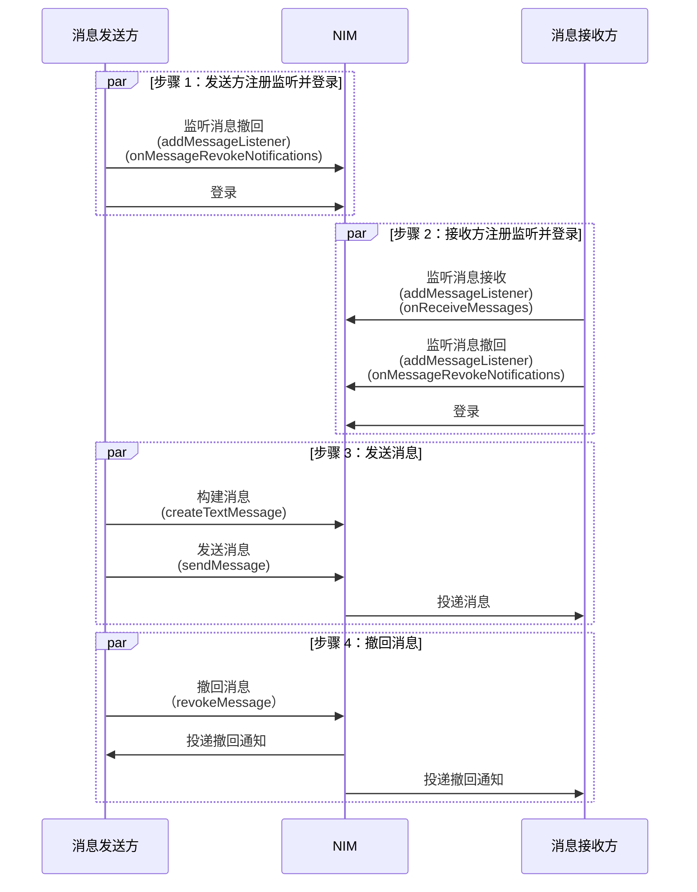

<!--keywords: 消息撤回、撤回、撤回通知、消息撤回通知 -->

网易云信即时通讯 SDK（NetEase IM SDK，简称 NIM SDK） 支持消息撤回，包括单聊消息撤回和群聊消息撤回。

本文介绍如何调用 NIM SDK 的接口实现消息撤回。

:::note notice
- 除通知消息（`Notification`）类型外，其他消息类型都可被撤回。
- 撤回的消息必须是已发送成功的消息。
:::

## 支持平台

本文内容适用的开发平台或框架如下表所示，涉及的接口请参考下文 [相关接口](#相关接口) 章节：

安卓 | iOS | macOS/Windows | Web/uni-app/小程序 | Node.js/Electron | 鸿蒙 | Flutter
:----: | :----: | :----: | :----: | :----: | :----: | :----:
✔️️️️ | ✔️️️️ | ✔️️️️ | ✔️️️️ | ✔️️️️ | ✔️️️️ | ✔️️️️

## 功能描述

网易云信 IM 支持两种消息撤回类型：单向撤回和双向撤回。

客户端的撤回操作默认是 **双向撤回** 类型，单向撤回需要通过新版服务端 API 实现，具体请参考 [消息撤回](https://doc.yunxin.163.com/messaging2/guide/jAwNTEzODQ?platform=server)。

撤回类型 | 说明
--- | ---
双向撤回 | 可双向撤回一定时间内（默认 2 分钟，可在 [网易云信控制台](https://app.yunxin.163.com/global/home) 配置）的单聊消息与群聊消息。撤回之后，消息接收者和发送者都将收到一条消息撤回通知，并删除对应的离线消息、漫游消息和历史消息。
单向撤回 | 可以单向撤回 30 天内的单聊消息和高级群消息。撤回之后，消息接收者会收到一条单向撤回的通知，并删除对应的离线消息、漫游消息和历史消息。撤回之后，消息发送者无感知，可以正常使用漫游消息和历史消息。

::: note notice
- 若撤回的消息，接收者还未读，那么对于接收者来说，应用内的总未读数会减 1。
- 单聊和群聊消息的撤回功能存在些许区别：
    - **单聊**：用户只能撤回自己发送的消息。支持撤回自己发送给自己的消息。
    - **群聊**：普通群成员只能撤回自己发送的消息。客户端 SDK 支持管理员撤回其他群成员的消息（服务端 API 不支持）。
:::

## 准备工作

根据本文操作前，请确保您已经完成了以下设置：

- 需要撤回的消息已发送成功，消息发送具体请参考 [消息收发](https://doc.yunxin.163.com/messaging2/guide/DYzMjA0Njc?platform=client)。

- 已在 [网易云信控制台](https://app.yunxin.163.com/global/home) 开通消息撤回相关功能，具体请参考 [配置消息功能](https://doc.yunxin.163.com/messaging2/guide/jU0Mzg0MTU?platform=client#基础功能)。

    - 撤回消息覆盖策略（默认不覆盖原始消息的推送）
    - 消息撤回时长（默认 2 分钟）

- 已完成 SDK 初始化。

## 撤回消息

本节以单聊场景的交互为例，介绍消息撤回的实现流程。

### API 调用时序



### 实现流程

以下仅介绍主要步骤，登录，消息发送等常见步骤省略，具体请参考 [登录 IM](https://doc.yunxin.163.com/messaging2/guide/Dk1MTY4MzA?platform=client) 和 [消息收发](https://doc.yunxin.163.com/messaging2/guide/DYzMjA0Njc?platform=client) 文档。

1. 消息发送者和接收者在登录 IM 前监听消息撤回回调事件，消息接收者还需监听消息接收回调事件。

    :::::: div linked-codes
    ::: code 安卓
    调用 [`addMessageListener`](https://doc.yunxin.163.com/messaging2/client-apis/zIwODM2NTM?platform=client#addMessageListener) 方法注册消息监听器，监听消息撤回回调事件 `onMessageRevokeNotifications` 和消息接收回调事件 `onReceiveMessages`。
    ```Java
    V2NIMMessageService v2MessageService = NIMClient.getService(V2NIMMessageService.class);

    V2NIMMessageListener messageListener = new V2NIMMessageListener() {
        @Override
        public void onMessageRevokeNotifications(List<V2NIMMessageRevokeNotification> revokeNotifications) {

        }

        @Override
        public void onReceiveMessages(List<V2NIMMessage> messages) {

        }
    };

    v2MessageService.addMessageListener(messageListener);
    ```
    :::
    ::: code iOS
    调用 [`addMessageListener`](https://doc.yunxin.163.com/messaging2/client-apis/zIwODM2NTM?platform=client#addMessageListener) 方法注册消息监听器，监听消息撤回回调事件 `onMessageRevokeNotifications` 和消息接收回调事件 `onReceiveMessages`。
    ```Objective-C
    [[[NIMSDK sharedSDK] v2MessageService] addMessageListener:listener];
    ```
    :::
    ::: code macOS/Windows
    调用 [`addMessageListener`](https://doc.yunxin.163.com/messaging2/client-apis/zIwODM2NTM?platform=client#addMessageListener) 方法注册消息监听器，监听消息撤回回调事件 `onMessageRevokeNotifications` 和消息接收回调事件 `onReceiveMessages`。
    ```C++
    V2NIMMessageListener listener;
    listener.onMessageRevokeNotifications = [](std::vector<V2NIMMessageRevokeNotification> revokeNotifications) {
        // receive message revoke notifications
    };
    listener.onReceiveMessages = [](std::vector<V2NIMMessage> messages) {
        // receive messages
    };
    messageService.addMessageListener(listener);
    ```
    :::
    ::: code Web/uni-app/小程序
    调用 [`on("EventName")`](https://doc.yunxin.163.com/messaging2/client-apis/zIwODM2NTM?platform=client#on) 方法注册消息相关监听器，监听消息撤回事件 `onMessageRevokeNotifications`　和消息接收回调事件 `onReceiveMessages`。
    ```TypeScript
    nim.V2NIMMessageService.on("onMessageRevokeNotifications", function(revokeNotifications: V2NIMMessageRevokeNotification[]) {})
    nim.V2NIMMessageService.on("onReceiveMessages", function(messages: V2NIMMessage[]) {})
    ```
    :::
    ::: code Node.js/Electron
    调用 [`on("EventName")`](https://doc.yunxin.163.com/messaging2/client-apis/zIwODM2NTM?platform=client#on) 方法注册消息相关监听器，监听消息撤回事件 `onMessageRevokeNotifications`　和消息接收回调事件 `onReceiveMessages`。
    ```TypeScript
    v2.messageService.on("messageRevokeNotifications", function (revokeNotifications: V2NIMMessageRevokeNotification[]) {})
    v2.messageService.on("receiveMessages", function (messages: V2NIMMessage[]) {})
    ```
    :::
    ::: code 鸿蒙
    调用 [`on("EventName")`](https://doc.yunxin.163.com/messaging2/client-apis/zIwODM2NTM?platform=client#on) 方法注册消息相关监听器，监听消息撤回事件 `onMessageRevokeNotifications`　和消息接收回调事件 `onReceiveMessages`。
    ```TypeScript
    nim.messageService.on("onMessageRevokeNotifications", function(revokeNotifications: V2NIMMessageRevokeNotification[]) {})
    nim.messageService.on("onReceiveMessages", function(messages: V2NIMMessage[]) {})
    ```
    :::
    ::: code Flutter

    调用 [`listen`](https://doc.yunxin.163.com/messaging2/client-apis/TU1MDAxMjA?platform=client#listen) 方法注册消息监听器，监听消息撤回事件 `onMessageRevokeNotifications` 和消息接收回调事件 `onReceiveMessages`。

    ```Dart
    subsriptions.add(NimCore
        .instance.messageService.onMessageRevokeNotifications
        .listen((event) {
    //do something
    }));
    subsriptions.add(
        NimCore.instance.messageService.onReceiveMessages.listen((event) {
    //do something
    }));
    ```
    :::
    ::::::

2. 消息发送者在发送消息成功后，调用 `revokeMessage` 方法撤回该条已发送成功的消息。撤回成功后，SDK 会先触发回调通知应用上层消息撤回成功，再自动将本地的该条消息删除。

    如果需要在撤回后显示一条本方已撤回的提示，可自行构造一条提示消息（`createTipsMessage`）并调用 `insertMessageToLocal` 方法在本地插入一条提示，具体可参考 [插入本地消息](https://doc.yunxin.163.com/messaging2/client-apis/DYzMjA0Njc?platform=client#插入本地消息)。

    ::: note notice
    以下情况消息撤回会失败：
    - 消息为空
    - 消息未发送成功
    - 消息超过撤回时限
    - 消息被反垃圾（内容审核）命中
    :::

    示例代码：

    :::::: div linked-codes
    ::: code 安卓
    ```
    V2NIMMessageService v2MessageService = NIMClient.getService(V2NIMMessageService.class);
    V2NIMMessage revokeMessage = ; // 被撤回的消息
    // TODO: 根据实际情况配置
    V2NIMMessageRevokeParams revokeParams = V2NIMMessageRevokeParams.V2NIMMessageRevokeParamsBuilder.builder()
    .withEnv()
    .withExtension()
    .withPostscript()
    .withPushContent()
    .withPushPayload()
    .build();

    v2MessageService.revokeMessage(revokeMessage, revokeParams,
        new V2NIMSuccessCallback<Void>() {
            @Override
            public void onSuccess(Void unused) {
                // TODO: 撤回成功
            }
        },
        new V2NIMFailureCallback() {
            @Override
            public void onFailure(V2NIMError error) {
                // TODO: 撤回失败
            }
        }
    );
    ```
    :::
    ::: code iOS
    ```
    // 参数设置文档 V2NIMMessageRevokeParams
    V2NIMMessageRevokeParams *revokeParams = [[V2NIMMessageRevokeParams alloc] init];

    [[[NIMSDK sharedSDK] v2MessageService] revokeMessage:message
                                            revokeParams:revokeParams
                                                success:^{
                                                // 发送成功回调
                                                }
                                                failure:^(V2NIMError * _Nonnull error) {
                                                // 发送失败回调，error 包含错误原因
    }];
    ```
    :::
    ::: code macOS/Windows
    ```C++
    V2NIMMessage message;
    // ...

    V2NIMMessageRevokeParams params;
    messageService.revokeMessage(
        message,
        params,
        []() {
            // revoke message succeeded
        },
        [](V2NIMError error) {
            // revoke message failed, handle error
        }
    );
    ```
    :::
    ::: code Web/uni-app/小程序
    ```
    try {
    await nim.V2NIMMessageService.revokeMessage(message)
    // todo Success
    } catch (err) {
    // todo error
    }
    ```
    :::
    ::: code Node.js/Electron
    ```TypeScript
    try {
    await v2.messageService.revokeMessage(message, {})
    // todo Success
    } catch (err) {
    // todo error
    }
    ```
    :::
    ::: code 鸿蒙
    ```
    try {
    await nim.messageService.revokeMessage(message)
    // todo Success
    } catch (err) {
    // todo error
    }
    ```
    :::
    ::: code Flutter
    ```Dart
    await NimCore.instance.messageService.revokeMessage(message, revokeParams);
    ```
    :::
    ::::::

3. 撤回成功后，消息发送者和接收者会通过回调接收到消息撤回通知。

    :::note note
    撤回消息后，网易云信会删除对应的离线消息、漫游消息和历史消息。
    :::

<!--初始化参数未知

## 消息撤回的通知栏文案说明

针对撤回场景的通知栏内容覆盖需求（具体为：发送者发消息给接收者，触发第三方推送，推送文案内容为 **您好**。然后发送者撤回该消息，此时通知栏中的 **您好** 变为预设的 **对方撤回了一条消息**），建议的实现方式如下：

1. 发送消息时，在 `sendMessage` 方法的入参 `params` 中设置消息体的推送属性 `pushCofig.pushPayload`，中写入 `key-value` 键值对。

2. 当要撤回该条消息时，在 `revokeMessage` 方法的入参 `params` 中设置推送属性 `pushPayload`，插入与被撤回消息相同的 `key-value` 键值对，也可以自定义预设的推送文案 `pushContent`。

**示例代码**：

:::::: div linked-codes
::: code 安卓
```
```
:::
::: code iOS
```
```
:::
::: code macOS/Windows
```
```
:::
::: code Web/uni-app/小程序
```
```
:::
::: code Node.js/Electron
```

```
:::
::: code 鸿蒙
```
```
:::
::: code Flutter
```Dart
```
:::
::::::
-->

## 相关接口

:::::: div custom-tabs
::: tab 安卓/iOS/macOS/Windows
API | 说明
--- | ---
[`addMessageListener`](https://doc.yunxin.163.com/messaging2/client-apis/zIwODM2NTM?platform=client#addMessageListener) | 注册消息相关监听器
[`removeMessageListener`](https://doc.yunxin.163.com/messaging2/client-apis/zIwODM2NTM?platform=client#removeMessageListener) | 取消注册消息相关监听器
[`revokeMessage`](https://doc.yunxin.163.com/messaging2/client-apis/zIwODM2NTM?platform=client#revokeMessage) | 撤回消息
[`createTipsMessage`](https://doc.yunxin.163.com/messaging2/client-apis/TY4MDg4MTk?platform=client#createTipsMessage) | 创建一条提示消息
[`insertMessageToLocal`](https://doc.yunxin.163.com/messaging2/client-apis/zIwODM2NTM?platform=client#insertMessageToLocal) | 插入一条消息到本地数据库
[`V2NIMMessageRevokeNotification`](https://doc.yunxin.163.com/messaging2/client-apis/DAxNjk0Mzc?platform=client#V2NIMMessageRevokeNotification) | 撤回通知对象
:::
::: tab Web/uni-app/小程序/Node.js/Electron/鸿蒙
API | 说明
--- | ---
[`on("EventName")`](https://doc.yunxin.163.com/messaging2/client-apis/zIwODM2NTM?platform=client#on) | 注册消息相关监听器
[`off("EventName")`](https://doc.yunxin.163.com/messaging2/client-apis/zIwODM2NTM?platform=client#off) | 取消注册消息相关监听器
[`revokeMessage`](https://doc.yunxin.163.com/messaging2/client-apis/zIwODM2NTM?platform=client#revokeMessage) | 撤回消息
[`createTipsMessage`](https://doc.yunxin.163.com/messaging2/client-apis/TY4MDg4MTk?platform=client#createTipsMessage) | 创建一条提示消息
[`insertMessageToLocal`](https://doc.yunxin.163.com/messaging2/client-apis/zIwODM2NTM?platform=client#insertMessageToLocal) | 插入一条消息到本地数据库<note type=note>Web/uni-app/小程序 不支持该接口。
[`V2NIMMessageRevokeNotification`](https://doc.yunxin.163.com/messaging2/client-apis/DAxNjk0Mzc?platform=client#V2NIMMessageRevokeNotification) | 撤回通知对象
:::
::: tab Flutter
API | 说明
--- | ---
[`listen`](https://doc.yunxin.163.com/messaging2/client-apis/TU1MDAxMjA?platform=client#listen) | 注册消息相关监听器
[`cancel`](https://doc.yunxin.163.com/messaging2/client-apis/TU1MDAxMjA?platform=client#cancel) | 取消注册消息相关监听器
[`revokeMessage`](https://doc.yunxin.163.com/messaging2/client-apis/TU1MDAxMjA?platform=client#revokeMessage) | 撤回消息
[`createTipsMessage`](https://doc.yunxin.163.com/messaging2/client-apis/zc4MjgwMTM?platform=client#createTipsMessage) | 创建一条提示消息
[`insertMessageToLocal`](https://doc.yunxin.163.com/messaging2/client-apis/TU1MDAxMjA?platform=client#insertMessageToLocal) | 插入一条消息到本地数据库
[`NIMMessageRevokeNotification`](https://doc.yunxin.163.com/messaging2/client-apis/zExMjk2NzY?platform=client#NIMMessageRevokeNotification) | 撤回通知对象
:::
::::::