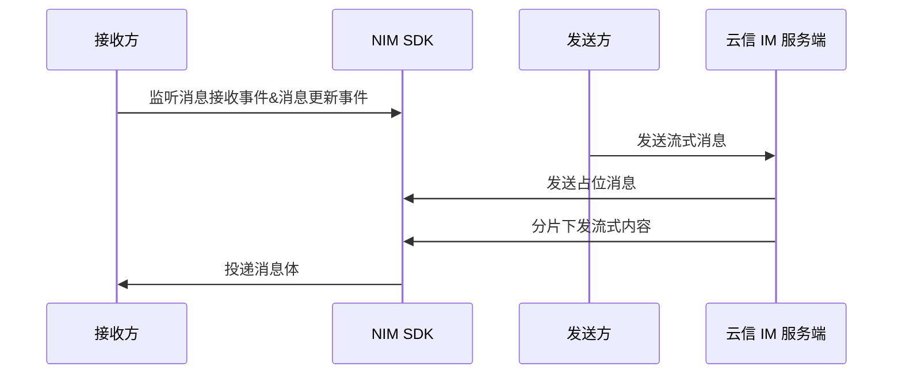
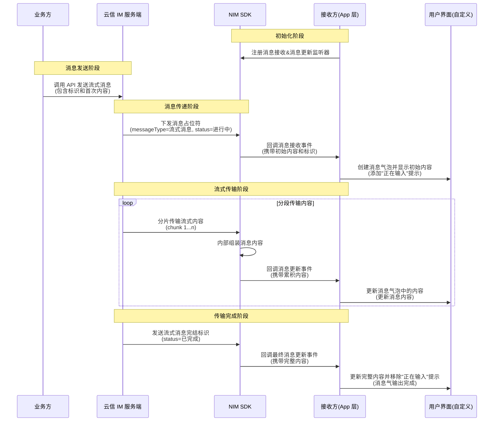

本文介绍通过网易云信即时通讯 SDK（NetEase IM SDK，简称 NIM SDK）实现消息流式输出的具体流程，通过实时分片传输接收到的内容，显著改善用户交互体验。

## 支持平台

本文内容适用的开发平台或框架如下表所示，涉及的接口请参考下文 [相关接口](#相关接口) 章节：

安卓 | iOS | macOS/Windows | Web/uni-app/小程序 | Node.js/Electron | 鸿蒙 | Flutter
:----: | :----: | :----: | :----: | :----: | :----: | :----:
✔️ | ✔️ | ✔️ | ✔️️️️ | ✔️ | ✔️ | ✔️

## 效果展示

消息流式输出的效果如下（以 Web 端为例）：


## 准备工作

在功能开发前，请确保：

- 已初始化 SDK，详情请参考各端 [SDK 初始化文档](https://doc.yunxin.163.com/messaging2/guide/TY4OTgyMDk?platform=client)。
- 已登录 IM，详情请参考 [登录及登出 IM](https://doc.yunxin.163.com/messaging2/guide/Dk1MTY4MzA?platform=client)。

## 注意事项

- 目前支持调用服务端 API [发送流式消息](https://doc.yunxin.163.com/messaging2/server-apis/TgyMTY2NzE?platform=server)，客户端支持接收流式消息，实时分片传输接收到的内容。
- 目前 IM 消息的流式输出支持 **文本** 类型的 **单聊消息**。
- 针对 Web/uni-app/小程序/RN 平台，当选择通过 ESM 引入方式时，需要提前引入 AI 数字人模块（`V2NIMAIService`）才能正常接收流式消息。具体请参考 [ESM 引入](https://doc.yunxin.163.com/messaging2/guide/DcyMjA1Njk?platform=client#方式二esm-引入)。

## 实现流程

### API 调用时序

<!--简易版

-->

<!--详细版


-->


### 实现步骤

1. **接收方** 注册消息监听器，监听消息接收事件和消息更新事件。

:::::: div linked-codes
::: code 安卓
接收方调用 [`addMessageListener`](https://doc.yunxin.163.com/messaging2/client-apis/zIwODM2NTM?platform=client#addMessageListener) 方法注册消息监听器，监听消息接收回调事件 `onReceiveMessages` 和消息更新回调事件 `onReceiveMessagesModified`。
```Java
V2NIMMessageService v2MessageService = NIMClient.getService(V2NIMMessageService.class);
V2NIMMessageListener messageListener = new V2NIMMessageListener() {

    @Override
    public void onReceiveMessages(List<V2NIMMessage> messages) {
    }

    @Override
    public void onReceiveMessagesModified(List<V2NIMMessage> messages) {
    }
};
v2MessageService.addMessageListener(messageListener);
```
:::
::: code iOS
接收方调用 [`addMessageListener`](https://doc.yunxin.163.com/messaging2/client-apis/zIwODM2NTM?platform=client#addMessageListener) 方法注册消息监听器，监听消息接收回调事件 `onReceiveMessages` 和消息更新回调事件 `onReceiveMessagesModified`。

```Objective-C
@interface MessageListener : NSObject <V2NIMMessageListener>
@end

@implementation MessageListener
- (void)onReceiveMessages:(NSArray<V2NIMMessage *> *)messages
{
    //
}
- (void)onReceiveMessagesModified:(NSArray<V2NIMMessage *> *)messages
{
    //
}
@end
```
:::
::: code macOS/Windows
接收方调用 [`addMessageListener`](https://doc.yunxin.163.com/messaging2/client-apis/zIwODM2NTM?platform=client#addMessageListener) 方法注册消息监听器，监听消息接收回调事件 `onReceiveMessages` 和消息更新回调事件 `onReceiveMessagesModified`。
```C++
V2NIMMessageListener listener;
listener.onReceiveMessages = [](nstd::vector<V2NIMMessage> messages) {
    // receive messages
};
listener.onReceiveMessagesModified = [](nstd::vector<V2NIMMessage> messages) {
    // modify messages
};
messageService.addMessageListener(listener);
```
:::
::: code Web/uni-app/小程序
调用 [`on("EventName")`](https://doc.yunxin.163.com/messaging2/client-apis/zIwODM2NTM?platform=client#on) 方法注册消息监听器，监听消息接收回调事件 `onReceiveMessages` 和消息更新回调事件 `onReceiveMessagesModified`。
```TypeScript
nim.V2NIMMessageService.on("onReceiveMessages", function (messages: V2NIMMessage[]) {})
nim.V2NIMMessageService.on("onReceiveMessagesModified", function (messages: V2NIMMessage[]) {})
```
:::
::: code Node.js/Electron
调用 [`on("EventName")`](https://doc.yunxin.163.com/messaging2/client-apis/zIwODM2NTM?platform=client#on) 方法注册消息监听器，监听消息接收回调事件 `receiveMessages` 和消息更新回调事件 `receiveMessagesModified`。
```TypeScript
v2.messageService.on("receiveMessages", function (messages: V2NIMMessage[]) {})
v2.messageService.on("receiveMessagesModified", function (messages: V2NIMMessage[]) {})
```
:::
::: code 鸿蒙
调用 [`on("EventName")`](https://doc.yunxin.163.com/messaging2/client-apis/zIwODM2NTM?platform=client#on) 方法注册消息监听器，监听消息接收回调事件 `onReceiveMessages` 和消息更新回调事件 `onReceiveMessagesModified`。
```TypeScript
nim.messageService.on("onReceiveMessages", function (messages: V2NIMMessage[]) {})
nim.messageService.on("onReceiveMessagesModified", function (messages: V2NIMMessage[]) {})
```
:::
::: code Flutter
调用 [`listen`](https://doc.yunxin.163.com/messaging2/client-apis/TU1MDAxMjA?platform=client#listen) 方法注册消息监听器，监听消息接收回调事件 `onReceiveMessages` 和消息更新回调事件 `onReceiveMessagesModified`。

```Dart
subsriptions.add(
    NimCore.instance.messageService.onReceiveMessages.listen((event) {
    //do something
    })
    NimCore.instance.messageService.onReceiveMessagesModified.listen((event) {
    //do something
    })
);
```
:::
::::::

2. **发送方** 调用服务端 API [发送流式消息](https://doc.yunxin.163.com/messaging2/server-apis/TgyMTY2NzE?platform=server)。

    ::: note note
    根据调用返回的状态，处理输出的流式消息。
    :::

3. **接收方** 处理流式消息。

    - 通过 `onReceiveMessages` 回调收到占位消息。
    - 通过 `onReceiveMessagesModified` 回调持续收到分片消息，直到消息接收完毕。
    - 解析收到的 `V2NIMMessage.streamConfig`（`V2NIMMessageStreamConfig`）。通过 `streamStatus` 字段判断相应状态来不断刷新和展示 UI。

:::::: div linked-codes
::: code 安卓
```Java
public class MessageListenerImpl implements V2NIMMessageListener {
    private List<String> streamMessageIds = new ArrayList<>();
    
    @Override
    public void onReceiveMessages(List<V2NIMMessage> messages) {
        for (V2NIMMessage message : messages) {
            handleReceivedMessage(message);
        }
    }

    @Override
    public void onReceiveMessagesModified(List<V2NIMMessage> messages) {
        for (V2NIMMessage message : messages) {
            handleModifiedMessage(message);
        }
    }

    private void handleReceivedMessage(V2NIMMessage message) {
        // 检查是否为流式消息
        if (message.getStreamConfig() != null) {
            V2NIMMessageStreamConfig streamConfig = message.getStreamConfig();

            // 流式消息占位输出，status 为 V2NIM_MESSAGE_STREAM_STATUS_PLACEHOLDER 代表消息占位
            if (streamConfig.getStatus() == V2NIMMessageStreamStatus.V2NIM_MESSAGE_STREAM_STATUS_PLACEHOLDER) {
                streamMessageIds.add(message.getMessageClientId());
                System.out.println("收到流式消息占位：" + message.getMessageClientId());

                // 占位插入到消息列表里渲染
                renderPlaceholderToChatBox(message);
            }
        } else if (streamMessageIds.contains(message.getMessageClientId())) {
            // 最终结束后会输出完整消息体
            System.out.println("收到流式消息完整内容：" + message.getText());

            // 更新UI显示完整消息
            updateStreamMessageInChatBox(message);

            // 从流式消息ID列表中移除
            streamMessageIds.remove(message.getMessageClientId());
        } else {
            // 非流式的普通消息
            System.out.println("收到普通消息：" + message.getText());
            renderNormalMessageToChatBox(message);
        }
    }

    private void handleModifiedMessage(V2NIMMessage message) {
        // 客户端在此回调中收到流式消息的分片更新
        if (message.getStreamConfig() != null) {
            V2NIMMessageStreamConfig streamConfig = message.getStreamConfig();

            System.out.println("流式消息更新，状态：" + streamConfig.getStatus());

            // status 为 V2NIM_MESSAGE_STREAM_STATUS_STREAMING 代表正在流式输出中
            if (streamConfig.getStatus() == V2NIMMessageStreamStatus.V2NIM_MESSAGE_STREAM_STATUS_STREAMING) {
                System.out.println("流式消息正在更新：" + message.getText());
                V2NIMMessageStreamChunk lastChunk = streamConfig.getLastChunk();
                // 可以找到此消息然后更新
                updateStreamingMessageInChatBox(message,lastChunk);
            }
        }
    }

    // 渲染占位消息到聊天界面
    private void renderPlaceholderToChatBox(V2NIMMessage message) {
        System.out.println("渲染占位消息：" + message.getMessageClientId());
        // 实际UI更新逻辑
    }

    // 渲染普通消息到聊天界面
    private void renderNormalMessageToChatBox(V2NIMMessage message) {
        System.out.println("渲染普通消息：" + message.getText());
        // 实际UI更新逻辑
    }

    // 更新流式消息内容
    private void updateStreamingMessageInChatBox(V2NIMMessage message,V2NIMMessageStreamChunk lastChunk) {
        System.out.println("当前流式消息完整内容：" + message.getText()+"，最后一条分片内容："+lastChunk.getContent());
        // 实际UI更新逻辑
    }

    // 更新流式消息为最终完整内容
    private void updateStreamMessageInChatBox(V2NIMMessage message) {
        System.out.println("更新为完整消息：" + message.getText());
        // 实际UI更新逻辑
    }
}
```
:::
::: code iOS
```Objective-C
@interface MessageHandler : NSObject <V2NIMMessageListener>
@property (nonatomic, strong) NSMutableSet<NSString *> *streamMessageIds;
@end

@implementation MessageHandler

- (void)onReceiveMessages:(NSArray<V2NIMMessage *> *)messages {
    for (V2NIMMessage *message in messages) {
        if (message.streamConfig && message.streamConfig.status == V2NIM_MESSAGE_STREAM_STATUS_PLACEHOLDER) {
            // 流式消息占位
            [self.streamMessageIds addObject:message.messageClientId];
            [self renderPlaceholder:message];
        } else if ([self.streamMessageIds containsObject:message.messageClientId]) {
            // 流式消息完整内容
            [self updateStreamMessage:message];
            [self.streamMessageIds removeObject:message.messageClientId];
        } else {
            // 普通消息
            [self renderNormalMessage:message];
        }
    }
}

- (void)onReceiveMessagesModified:(NSArray<V2NIMMessage *> *)messages {
    for (V2NIMMessage *message in messages) {
        if (message.streamConfig && message.streamConfig.status == V2NIM_MESSAGE_STREAM_STATUS_UPDATING) {
            // 更新流式消息分片
            [self updateStreamMessage:message];
        }
    }
}

@end
```
:::
::: code Web/uni-app/小程序
```TypeScript
const streamMessageIds = []

// 客户端会在回调收到流式消息
nim.V2NIMMessageService.on("onReceiveMessages", function (messages: V2NIMMessage[]) {
  messages.forEach(message => {
    // 流式消息占位输出, streamConfig.status 为 1 代表消息占位
    if (message.streamConfig) {
      if (message.streamConfig.status === 1) {
        streamMessageIds.push(message.messageClientId)
        console.log(message)
        // renderToChatBox(message) // 占位插入到消息列表里渲染
      }
    } else if (streamMessageIds.includes(message.messageClientId)) {
       // 最终结束后会输出完整消息体
       
    } else {
      // 非流失的普通消息            
    }
  });
});

// 客户端在此回调中收到流式消息的分片更新
nim.V2NIMMessageService.on("onReceiveMessagesModified", function (messages: V2NIMMessage[]) {
  messages.forEach(message => {
    if (message.streamConfig) {
      // todo: 流式消息更新
      console.log(message) 
      // streamConfig: {status: -1, lastChunk: {…}}
      // -streamConfig.status 为 -1 代表正在流式输出中
      // 可以找到此消息然后更新
      // findMessage(message.messageClientId) -> updateMessageBody(message.text)
    }
  });
});
```
:::
::: code macOS/Windows
```C++
V2NIMMessageListener messageListener;
messageListener.onReceiveMessages = [=](nstd::vector<V2NIMMessage> messages) {
    // Push messages to UI list
};
messageListener.onReceiveMessagesModified = [=](const std::vector<V2NIMMessage>& messages) {
    for (const auto& message : messages) {
        // Find message from UI list and update
    }
};
auto& messageService = v2::V2NIMClient::get().getMessageService();
messageService.addMessageListener(messageListener);
```
:::
::: code Node.js/Electron
```TypeScript
import { v2 } from 'node-nim'
import { V2NIMMessage } from 'node-nim/types/v2_def/v2_nim_struct_def'

// Handle receive message event
v2.messageService?.on('receiveMessages', (messages: V2NIMMessage[]) => {
  // push messages to UI list
  messageList.value.push(...messages)
})

// Handle message modified event
v2.messageService?.on('receiveMessagesModified', (messages: V2NIMMessage[]) => {
  messages.forEach((modifiedMessage) => {
    if (modifiedMessage.conversationId === conversationStore.currentConversation?.conversationId) {
      // Find the corresponding message in the message list
      const index = messageList.value.findIndex(
        (msg) => msg.messageClientId === modifiedMessage.messageClientId
      )
      // If the message is found, update it
      if (index !== -1) {
        messageList.value[index] = modifiedMessage
      }
    }
  })
})
```  
:::
::: code 鸿蒙
```TypeScript
const streamMessageIds = []

// 客户端会在回调收到流式消息
nim.messageService.on('onReceiveMessages', (messages: V2NIMMessage[]) => {
  messages.forEach(message => {
    // 流式消息占位输出, streamConfig.status 为 1 代表消息占位
    if (message.streamConfig) {
      if (message.streamConfig.status === 1) { 
        streamMessageIds.push(message.messageClientId)
        console.log(message)
        // renderToChatBox(message) // 占位插入到消息列表里渲染
      }
    } else if (streamMessageIds.includes(message.messageClientId)) {
       // 最终结束后会输出完整消息体
    } else {
      // 非流式的普通消息            
    }
    
  });
});

// 客户端在此回调中收到流式消息的分片更新
nim.messageService.on('onReceiveMessagesModified', (messages: V2NIMMessage[]) => {
  messages.forEach(message => {
    if (message.streamConfig) {
      // todo: 流式消息更新
      console.log(message) 
      // streamConfig: {status: -1, lastChunk: {…}}
      // -streamConfig.status 为 -1 代表正在流式输出中
      // 可以找到此消息然后更新
      // findMessage(message.messageClientId) -> updateMessageBody(message.text)
    }
  });
});
```
:::
::: code Flutter
```Dart
class MessageHandler {
  final List<String> _streamMessageIds = [];

  void setupMessageListeners() {
    // 监听接收消息
    NimCore.instance.messageService.onReceiveMessages.listen((messages) {
      for (var message in messages) {
        _handleReceivedMessage(message);
      }
    });

    // 监听消息修改
    NimCore.instance.messageService.onReceiveMessagesModified.listen((messages) {
      for (var message in messages) {
        _handleModifiedMessage(message);
      }
    });
  }

  void _handleReceivedMessage(NIMMessage message) {
    // 检查是否为流式消息
    if (message.streamConfig != null) {
      final streamConfig = message.streamConfig!;

      // 流式消息占位输出，status 为 1 代表消息占位
      if (streamConfig.status == V2NIMMessageStreamStatus.V2NIM_MESSAGE_STREAM_STATUS_PLACEHOLDER) {
        _streamMessageIds.add(message.messageClientId ?? '');
        print('收到流式消息占位：${message.messageClientId}');

        // 占位插入到消息列表里渲染
        _renderPlaceholderToChatBox(message);
      }
    } else if (_streamMessageIds.contains(message.messageClientId)) {
      // 最终结束后会输出完整消息体
      print('收到流式消息完整内容：${message.text}');

      // 更新UI显示完整消息
      _updateStreamMessageInChatBox(message);

      // 从流式消息ID列表中移除
      _streamMessageIds.remove(message.messageClientId);
    } else {
      // 非流式的普通消息
      print('收到普通消息：${message.text}');
      _renderNormalMessageToChatBox(message);
    }
  }

  void _handleModifiedMessage(NIMMessage message) {
    // 客户端在此回调中收到流式消息的分片更新
    if (message.streamConfig != null) {
      final streamConfig = message.streamConfig!;

      print('流式消息更新，状态：${streamConfig.status}');

      // status 为 -1 代表正在流式输出中
      if (streamConfig.status == V2NIMMessageStreamStatus.V2NIM_MESSAGE_STREAM_STATUS_STREAMING) {
        print('流式消息正在更新：${message.text}');
        final lastChunk = streamConfig.lastChunk;
        // 可以找到此消息然后更新
        _updateStreamingMessageInChatBox(message, lastChunk);
      }
    }
  }

  // 渲染占位消息到聊天界面
  void _renderPlaceholderToChatBox(NIMMessage message) {
    print('渲染占位消息：${message.messageClientId}');
    // 实际UI更新逻辑
  }

  // 渲染普通消息到聊天界面
  void _renderNormalMessageToChatBox(NIMMessage message) {
    print('渲染普通消息：${message.text}');
    // 实际UI更新逻辑
  }

  // 更新流式消息内容
  void _updateStreamingMessageInChatBox(
      NIMMessage message,
      V2NIMMessageStreamChunk? lastChunk,
      ) {
    print('当前流式消息完整内容：${message.text}，最后一条分片内容：${lastChunk?.content}');
    // 实际UI更新逻辑
  }

  // 更新流式消息为最终完整内容
  void _updateStreamMessageInChatBox(NIMMessage message) {
    print('更新为完整消息：${message.text}');
    // 实际UI更新逻辑
  }
}
```
:::
::::::  

## 相关接口

:::::: div linked-codes
::: code 安卓/iOS/macOS/Windows
API	| 说明
--- | ---
[`addMessageListener`](https://doc.yunxin.163.com/messaging2/client-apis/zIwODM2NTM?platform=client#addMessageListener) | 注册消息相关监听器。
[`V2NIMMessageStreamConfig`](https://doc.yunxin.163.com/messaging2/client-apis/DAxNjk0Mzc?platform=client#V2NIMMessageStreamConfig) | 消息体中的流式输出相关配置信息。若存在该配置信息说明是流式消息，否则是非流式消息。
[`V2NIMMessageStreamStatus`](https://doc.yunxin.163.com/messaging2/client-apis/DAxNjk0Mzc?platform=client#V2NIMMessageStreamStatus) | 消息的流式输出状态。
[`V2NIMMessageStreamChunk`](https://doc.yunxin.163.com/messaging2/client-apis/DAxNjk0Mzc?platform=client#V2NIMMessageStreamChunk) | 消息的流式输出最近分片信息。
:::
::: code Web/uni-app/小程序/Node.js/Electron/鸿蒙
API	| 说明
--- | ---
[`on("EventName")`](https://doc.yunxin.163.com/messaging2/client-apis/zIwODM2NTM?platform=client#on) | 注册消息相关监听器。
[`V2NIMMessageStreamConfig`](https://doc.yunxin.163.com/messaging2/client-apis/DAxNjk0Mzc?platform=client#V2NIMMessageStreamConfig) | 消息体中的流式输出相关配置信息。若存在该配置信息说明是流式消息，否则是非流式消息。
[`V2NIMMessageStreamStatus`](https://doc.yunxin.163.com/messaging2/client-apis/DAxNjk0Mzc?platform=client#V2NIMMessageStreamStatus) | 消息的流式输出状态。
[`V2NIMMessageStreamChunk`](https://doc.yunxin.163.com/messaging2/client-apis/DAxNjk0Mzc?platform=client#V2NIMMessageStreamChunk) | 消息的流式输出最近分片信息。 
:::
::: code Flutter
[`listen`](https://doc.yunxin.163.com/messaging2/client-apis/TU1MDAxMjA?platform=client#listen) | 注册消息相关监听器。
[`V2NIMMessageStreamConfig`](https://doc.yunxin.163.com/messaging2/client-apis/zExMjk2NzY?platform=client#V2NIMMessageStreamConfig) | 消息体中的流式输出相关配置信息。若存在该配置信息说明是流式消息，否则是非流式消息。
[`V2NIMMessageStreamStatus`](https://doc.yunxin.163.com/messaging2/client-apis/zExMjk2NzY?platform=client#V2NIMMessageStreamStatus) | 消息的流式输出状态。
[`V2NIMMessageStreamChunk`](https://doc.yunxin.163.com/messaging2/client-apis/zExMjk2NzY?platform=client#V2NIMMessageStreamChunk) | 消息的流式输出最近分片信息。
:::
::::::

## 参考文档

- [服务端 API：发送流式消息](https://doc.yunxin.163.com/messaging2/server-apis/TgyMTY2NzE?platform=server) 
- [错误码](https://doc.yunxin.163.com/messaging2/client-apis/DUxNjU3MzU?platform=client)