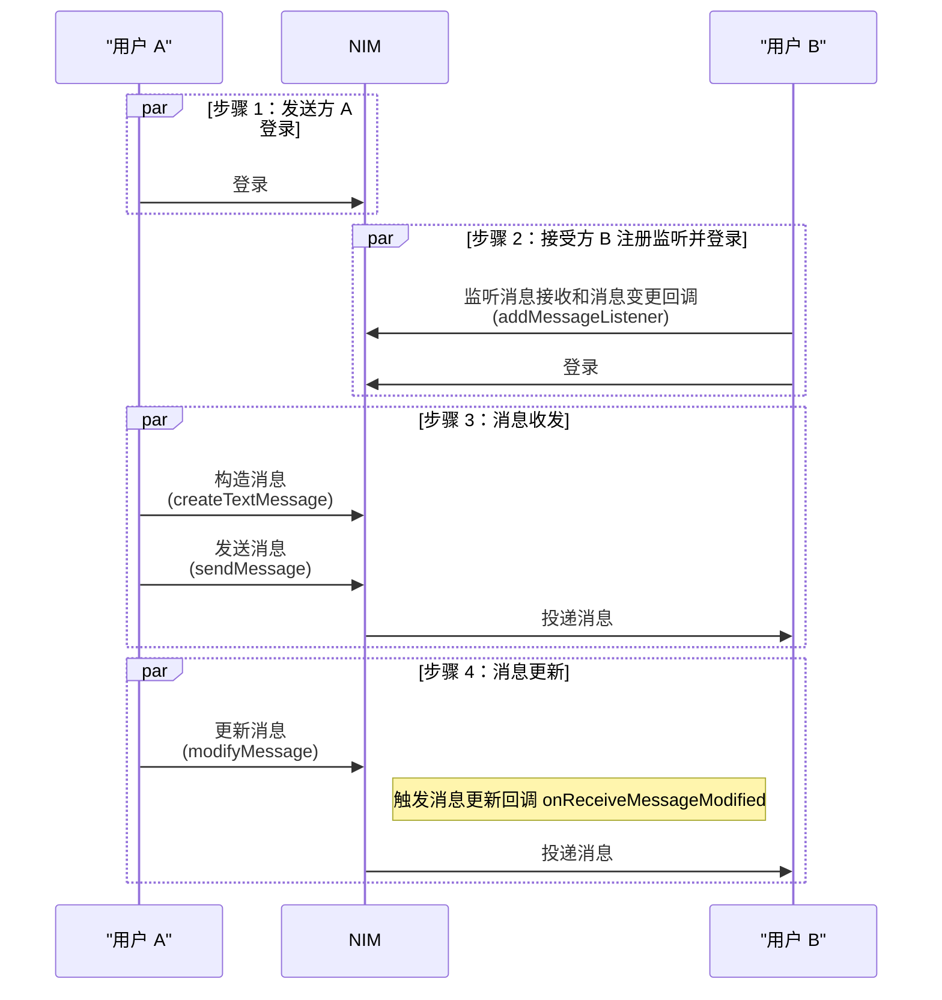

网易云信即时通讯 SDK（NetEase IM SDK，简称 NIM SDK）支持消息更新功能，支持对七天内已发送成功的消息进行二次编辑，从而更新消息。
## 功能简介

在部分涉及状态迁移的场景下，需要变更消息内容以满足业务场景需要，否则就需要多条消息来管理相关业务流程。为了控制消息量以及提升沟通效率，网易云信 IM 自 V10.4.0 起支持消息更新功能，用于消息内容的二次编辑。

您可以将消息更新功能用于以下场景：

- **协同办公场景**：团队成员之间更新项目进展，调整项目计划，可以直接调整原始消息内容二次更新，减少消息量，明确管理整个项目进展。
- **客户场景**：客服成员在解答完客户问题或给出相应解决方案后，更新相关消息，例如订单状态更新，发货流程进展更新。
- **文件消息场景**：原始文件内容更新，可以通知接受成员同步更新文件。

## 支持平台

本文内容适用的开发平台或框架如下表所示，涉及的接口请参考下文 [相关接口](#相关接口) 章节：

安卓 | iOS | macOS/Windows | Web/uni-app/小程序 | Node.js/Electron | 鸿蒙 | Flutter
:----: | :----: | :----: | :----: | :----: | :----: | :----:
✔️️️️ | ✔️️️️ | ✔️️️️ | ✔️️️️ | ️✔️️ | ️✔️️ | ✔️ |

<a id="技术原理"></a>

## 技术原理

对于会话中 **已发送成功** 的消息（七天内），会话参与者可以对消息做二次修改，修改成功后会同步给会话的所有参与者。

- **单聊会话**：只有发送者可以对已发送成功的消息进行二次编辑，更新成功后，同步给消息接受方。
- **群聊会话**：只有消息发送者和群主可以对已发送成功的消息进行二次编辑，更新成功后，同步给群组所有成员。

消息体中只有以下字段支持更新：

- **`subType`**：自定义消息子类型
- **`text`**：消息文本内容
- **`attachment`**：消息附件
- **`serverExtension`**：消息服务端扩展字段

且对于不同消息类型（消息类型不允许修改），部分字段也无法更新，具体如下表所示：

| 消息类型 | 枚举值 | `subType` | `text` | `attachment` | `serverExtension` |
| ---- | ---- | ---- | ---- | ---- | ---- |
| 文本（TEXT） | 0 | ✔️️️ | ✔️️️ | - | ✔️️️ |
| 图片（IMAGE）|1|✔️️️ | ✔️️️ | - | ✔️️️ |
| 音频（AUDIO）|2|✔️️️ | ✔️️️ | - | ✔️️️ |
| 视频（VIDEO） | 3 | ✔️️️ | ✔️️️ | - | ✔️️️ |
| 地理位置（LOCATION） | 4 | ✔️️️ | ✔️️️ | ✔️️️ | ✔️️️ |
| 通知（NOTIFICATION） | 5 | - | - | - | - |
| 文件（FILE） | 6 | ✔️️️ | ✔️️️ | - | ✔️️️ |
| 音视频通话（AVCHAT） | 7 | - | - | - | - |
| 提示（TIPS） | 10 | ✔️️️ | ✔️️️ | - | ✔️️️ |
| 机器人（ROBOT） | 11 | - | - | - | - |
| 话单（CALL） | 12 | ✔️️️ | ✔️️️ | - | ✔️️️ |
| 自定义（CUSTOM） | 100 | ✔️️️ | ✔️️️ | ✔️️️ | ✔️️️ |

::: note note
更新时可以配置反垃圾，反垃圾配置可以和原消息不一致。
:::

## 前提条件

在实现消息更新之前，请确保：

- 消息已发送成功。具体请参考 [消息收发](https://doc.yunxin.163.com/messaging2/guide/DYzMjA0Njc?platform=client)。
- 已了解各消息类型的 [修改范围](#技术原理)。

## API 调用时序



## 实现流程

本文主要介绍 **修改单聊场景下的文本消息** 为例的消息更新实现过程。以下仅介绍主要步骤，登录以及消息收发等常见步骤省略，具体请参考 [登录 IM](https://doc.yunxin.163.com/messaging2/guide/Dk1MTY4MzA?platform=client) 和 [消息收发](https://doc.yunxin.163.com/messaging2/guide/DYzMjA0Njc?platform=client)。

1. 接收方注册消息监听器，监听消息接收（`onReceiveMessages`）和消息更新（`onReceiveMessageModified`）回调事件。

    :::::: div linked-codes
    ::: code 安卓
    调用 [`addMessageListener`](https://doc.yunxin.163.com/messaging2/client-apis/zIwODM2NTM?platform=client#addMessageListener) 方法。
    ```Java
    V2NIMMessageService v2MessageService = NIMClient.getService(V2NIMMessageService.class);

    V2NIMMessageListener messageListener = new V2NIMMessageListener() {

        @Override
        public void onReceiveMessages(List<V2NIMMessage> messages) {

        }

        @Override
        public void onReceiveMessagesModified(List<V2NIMMessage> messages){

        }
    };
    v2MessageService.addMessageListener(messageListener);
    ```
    :::
    ::: code iOS
    调用 [`addMessageListener`](https://doc.yunxin.163.com/messaging2/client-apis/zIwODM2NTM?platform=client#addMessageListener) 方法。
    ```Objective-C
    [[[NIMSDK sharedSDK] v2MessageService] addMessageListener:listener];

    - (void)onReceiveMessages:(NSArray<V2NIMMessage *> *)messages {

    };

    - (void)onReceiveMessagesModified:(NSArray<V2NIMMessage *>)messages {

    }
    ```
    :::
    ::: code macOS/Windows
    调用 [`addMessageListener`](https://doc.yunxin.163.com/messaging2/client-apis/zIwODM2NTM?platform=client#addMessageListener) 方法。
    ```C++
    V2NIMMessageListener listener;
    listener.onReceiveMessages = [](nstd::vector<V2NIMMessage> messages) {
        // receive messages
    };
    istener.onReceiveMessagesModified = [](nstd::vector<V2NIMMessage> messages) {
        // update messages
    };
    messageService.addMessageListener(listener);
    ```
    :::
    ::: code Web/uni-app/小程序
    调用 [`on("EventName")`](https://doc.yunxin.163.com/messaging2/client-apis/zIwODM2NTM?platform=client#on) 方法。
    ```TypeScript
    nim.V2NIMMessageService.on("onReceiveMessages", function (messages: V2NIMMessage[]) {});
    nim.V2NIMMessageService.on("onReceiveMessagesModified", function (messages: V2NIMMessage[]) {});
    ```
    :::
    ::: code Node.js/Electron
    调用 [`on("EventName")`](https://doc.yunxin.163.com/messaging2/client-apis/zIwODM2NTM?platform=client#on) 方法。
    ```TypeScript
    v2.messageService.on("receiveMessages", function (messages: V2NIMMessage[]) {})
    v2.messageService.on("receiveMessagesModified", function (messages: V2NIMMessage[]) {});
    ```
    :::
    ::: code 鸿蒙
    调用 [`on("EventName")`](https://doc.yunxin.163.com/messaging2/client-apis/zIwODM2NTM?platform=client#on) 方法。
    ```TypeScript
    nim.messageService.on("onReceiveMessages", function (messages: V2NIMMessage[]) {});
    nim.messageService.on("onReceiveMessagesModified", function (messages: V2NIMMessage[]) {});
    ```
    :::
    ::: code Flutter
    调用 [`listen`](https://doc.yunxin.163.com/messaging2/client-apis/TU1MDAxMjA?platform=client#listen) 方法。
    ```Dart
    subsriptions.add(
        NimCore.instance.messageService.onReceiveMessages.listen((event) {
        //do something
    }));
    subsriptions.add(
        NimCore.instance.messageService.onReceiveMessagesModified.listen((event) {
        //do something
    }));
    ```
    :::
    ::::::

2. 发送方调用 `modifyMessage` 方法更新已发送成功的消息的内容。

    本端更新消息成功后，会话参与者以及登录的其他客户端会收到消息更新回调 `onReceiveMessagesModified`，回调结果中包含更新的消息列表。示例代码：

    :::::: div linked-codes
    ::: code 安卓
    ```Java
    String newMessageText = "new message text";
    int newSubType = 1;
    String newServerExtension = "{\"key\":\"value\"}";
    boolean clientAntispamEnabled = true;
    String clientAntispamReplace = "replace text";

    V2NIMMessageAntispamConfig antispamConfig = V2NIMMessageAntispamConfig.V2NIMMessageAntispamConfigBuilder.builder()
    // TODO: 根据实际情况配置
    //                .withAntispamBusinessId()
    //                .withAntispamCheating()
    //                .withAntispamCustomMessage()
    //                .withAntispamEnabled()
    //                .withAntispamExtension()
    .build();

    V2NIMMessagePushConfig pushConfig = V2NIMMessagePushConfig.V2NIMMessagePushConfigBuilder.builder()
    // TODO: 根据实际情况配置
    //                .withContent()
    //                .withForcePush()
    //                .withForcePushAccountIds()
    //                .withForcePushContent()
    //                .withPayload()
    //                .withPushEnabled()
    //                .withPushNickEnabled()
    .build();

    V2NIMMessageRouteConfig routeConfig = V2NIMMessageRouteConfig.V2NIMMessageRouteConfigBuilder.builder()
    // TODO: 根据实际情况配置
    //                .withRouteEnabled()
    //                .withRouteEnvironment()
    .build();

    V2NIMModifyMessageParams modifyMessageParams = V2NIMModifyMessageParamsBuilder.builder()
    .withText(newMessageText)
    .withSubType(newSubType)
    .withServerExtension(newServerExtension)
    //仅支持地理位置消息附件和自定义消息附件的修改
    .withAttachment(createLocationMessageAttachment())
    .withAntispamConfig(antispamConfig)
    .withRouteConfig(routeConfig)
    .withPushConfig(pushConfig)
    .withClientAntispamEnabled(clientAntispamEnabled)
    .withClientAntispamReplace(clientAntispamReplace)
    .build();
    V2NIMMessageService v2MessageService = NIMClient.getService(V2NIMMessageService.class);
    v2MessageService.modifyMessage(getMessage(), modifyMessageParams, new V2NIMSuccessCallback<V2NIMModifyMessageResult>() {
    @Override
    public void onSuccess(V2NIMModifyMessageResult v2NIMModifyMessageResult) {
    if (v2NIMModifyMessageResult.getErrorCode() == 200) {
        //修改成功
    }else{
        //修改失败,可能触发的反垃圾
    }
    }
    }, new V2NIMFailureCallback() {
    @Override
    public void onFailure(V2NIMError error) {
    //修改失败
    }
    });
    ```
    :::
    ::: code iOS
    ```Objective-C
    V2NIMModifyMessageParams *params = [[V2NIMModifyMessageParams alloc] init];
    // 更新消息内容
    params.text = @"modified text";
    // 仅位置消息和自定义消息可以更新附件
    params.attachment = modifiedAttachment;
    // 更新消息的服务器扩展字段
    params.serverExtension = @"{\"key\": \"value\"}";
    [[NIMSDK sharedSDK].v2MessageService modifyMessage:message params:params success:^(V2NIMModifyMessageResult *result) {
            // 更新消息成功
        } failure:^(V2NIMError *error) {
            // 更新消息失败
        }];
    ```
    :::
    ::: code macOS/Windows
    ```C++
    auto params = V2NIMModifyMessageParams();
    messageService.modifyMessage(
        message,
        params,
        [](V2NIMModifyMessageResult result) {
            // modify message succeeded
        },
        [](V2NIMError error) {
            // modify message failed, handle error
        });
    ```
    :::
    ::: code Web/uni-app/小程序
    ```TypeScript
    let message = nim.V2NIMMessageCreator.createTextMessage("origin text")
    const res: V2NIMSendMessageResult = await nim.V2NIMMessageService.sendMessage(message, 'YOUR_CONVERSATION_ID')
    await nim.V2NIMMessageService.modifyMessage(res.message, {
        "text": "modified text"
    })
    ```
    :::
    ::: code Node.js/Electron
    ```TypeScript
    const message = v2.messageCreator.createTextMessage('Hello NTES IM')
    const result = await v2.messageService.sendMessage(message, conversationId, params, progressCallback)
    ```
    :::
    ::: code 鸿蒙
    ```TypeScript
    let message = nim.messageCreator.createTextMessage("origin text")
    const params: V2NIMModifyMessageParams = {
    subType: this.subType,
    text: this.text,
    serverExtension: this.serverExtension
    } as V2NIMModifyMessageParams

    const result = await nim.messageService.modifyMessage(message, params)
    ```
    :::
    ::: code Flutter
    ```Dart
    final sendMessageResult = await NimCore.instance.messageService
            .sendMessage(message: textMessage, conversationId: conversationId);
        if (sendMessageResult.isSuccess) {
            final sentMessage = sendMessageResult.data!.message!;
            final params = NIMModifyMessageParams(text: 'test text message modify');
            NimCore.instance.messageService
                .modifyMessage(sentMessage, params)
                .then((result) {
            print('modifyMessage result: ${result.data?.toJson()}');
            });
        }
        }
    ```
    :::
    ::::::

## 相关接口

:::::: div linked-codes
::: code 安卓/iOS/macOS/Windows
API | 说明
--- | ---
[`addMessageListener`](https://doc.yunxin.163.com/messaging2/client-apis/zIwODM2NTM?platform=client#addMessageListener) | 注册消息相关监听器
[`removeMessageListener`](https://doc.yunxin.163.com/messaging2/client-apis/zIwODM2NTM?platform=client#removeMessageListener) | 取消注册消息相关监听器
[`modifyMessage`](https://doc.yunxin.163.com/messaging2/client-apis/zIwODM2NTM?platform=client#modifymessage) | 更新消息
:::
::: code Web/uni-app/小程序/Node.js/Electron/鸿蒙
API | 说明
--- | ---
[`on("EventName")`](https://doc.yunxin.163.com/messaging2/client-apis/zIwODM2NTM?platform=client#on) | 注册消息相关监听器
[`off("EventName")`](https://doc.yunxin.163.com/messaging2/client-apis/zIwODM2NTM?platform=client#off) | 取消注册消息相关监听器
[`modifyMessage`](https://doc.yunxin.163.com/messaging2/client-apis/zIwODM2NTM?platform=client#modifymessage) | 更新消息
:::
::: code Flutter
API | 说明
--- | ---
[`listen`](https://doc.yunxin.163.com/messaging2/client-apis/TU1MDAxMjA?platform=client#listen) | 注册消息相关监听器
[`cancel`](https://doc.yunxin.163.com/messaging2/client-apis/TU1MDAxMjA?platform=client#cancel) | 取消注册消息相关监听器
[`modifyMessage`](https://doc.yunxin.163.com/messaging2/client-apis/TU1MDAxMjA?platform=client#modifymessage) | 更新消息
:::
::::::