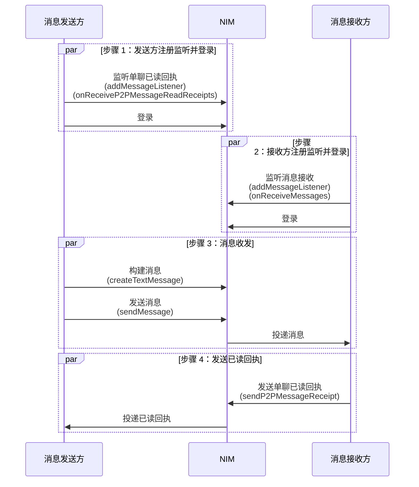
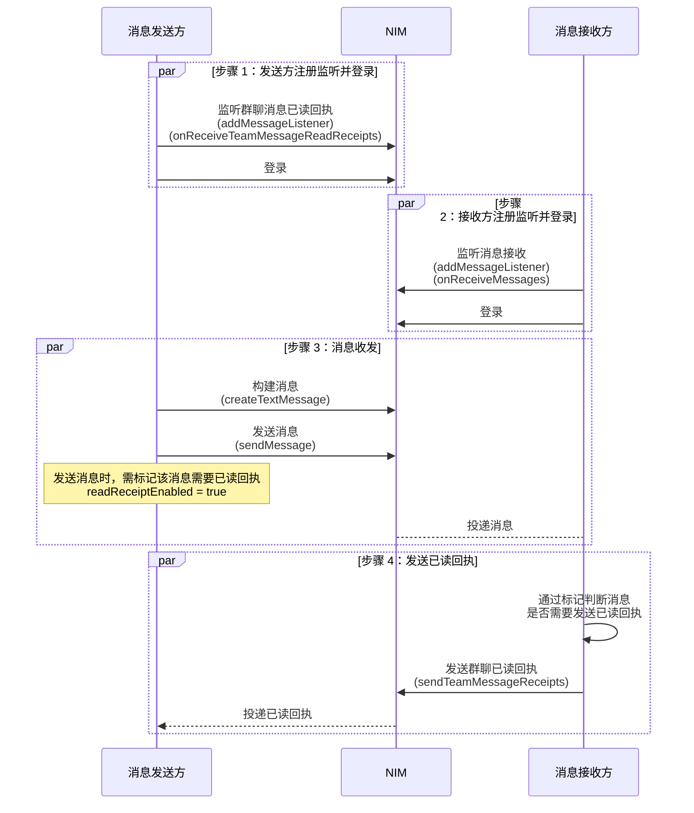

<!--keywords: 已读、已读回执、消息已读回执 -->

当消息接收方收到消息并阅读后，可以将该消息标记为已读（发送已读回执），消息发送方会通过已读回执的回调知晓接收方是否已读。

本端发送已读回执成功后，其他登录客户端和消息发送方均会收到已读回执回调。

目前 NIM SDK 支持单聊消息已读回执和高级群消息已读回执功能。

## 支持平台

本文内容适用的开发平台或框架如下表所示，涉及的接口请参考下文 [相关接口](#相关接口) 章节：

安卓 | iOS | macOS/Windows | Web/uni-app/小程序 | Node.js/Electron | 鸿蒙 | Flutter
:----: | :----: | :----: | :----: | :----: | :----: | :----:
✔️️️️ | ✔️️️️ | ✔️️️️ | ✔️️️️ | ✔️️️️ | ✔️️️️ | ✔️️️️

## 单聊消息已读回执

### 前提条件

在实现单聊消息已读回执之前，请确保已初始化 SDK。

### API 调用时序



### 实现步骤

以下仅介绍主要步骤，登录等常见步骤省略，具体请参考 [登录 IM](https://doc.yunxin.163.com/messaging2/guide/Dk1MTY4MzA?platform=client) 章节。

1. **消息发送方** 需要注册消息监听器，监听单聊已读回执回调事件。**消息接收方** 需要注册消息监听器，监听消息接收回调事件。


    :::::: div linked-codes
    ::: code 安卓
    调用 [`addMessageListener`](https://doc.yunxin.163.com/messaging2/client-apis/zIwODM2NTM?platform=client#addMessageListener) 方法注册消息监听器，监听单聊已读回执回调事件 `onReceiveP2PMessageReadReceipts` 和消息接收回调事件 `onReceiveMessages`。
    ```Java
    V2NIMMessageService v2MessageService = NIMClient.getService(V2NIMMessageService.class);

    V2NIMMessageListener messageListener = new V2NIMMessageListener() {
        @Override
        public void onReceiveP2PMessageReadReceipts(List<V2NIMP2PMessageReadReceipt> readReceipts) {

        }

        @Override
        public void onReceiveMessages(List<V2NIMMessage> messages) {

        }
    };

    v2MessageService.addMessageListener(messageListener);
    ```
    :::
    ::: code iOS
    调用 [`addMessageListener`](https://doc.yunxin.163.com/messaging2/client-apis/zIwODM2NTM?platform=client#addMessageListener) 方法注册消息监听器，监听单聊已读回执回调事件 `onReceiveP2PMessageReadReceipts` 和消息接收回调事件 `onReceiveMessages`。
    ```Objective-C
    [[[NIMSDK sharedSDK] v2MessageService] addMessageListener:listener];
    ```
    :::
    ::: code macOS/Windows
    调用 [`addMessageListener`](https://doc.yunxin.163.com/messaging2/client-apis/zIwODM2NTM?platform=client#addMessageListener) 方法注册消息监听器，监听单聊已读回执回调事件 `onReceiveP2PMessageReadReceipts` 和消息接收回调事件 `onReceiveMessages`。
    ```C++
    V2NIMMessageListener listener;
    listener.onReceiveP2PMessageReadReceipts = [](std::vector<V2NIMP2PMessageReadReceipt> readReceipts) {
        // receive p2p message read receipts
    };
    listener.onReceiveMessages = [](std::vector<V2NIMMessage> messages) {
        // receive messages
    };
    messageService.addMessageListener(listener);
    ```
    :::
    ::: code Web/uni-app/小程序
    调用 [`on("EventName")`](https://doc.yunxin.163.com/messaging2/client-apis/zIwODM2NTM?platform=client#on) 方法注册消息相关监听器，监听单聊已读回执事件 `onReceiveP2PMessageReadReceipts` 和消息接收回调事件 `onReceiveMessages`。
    ```TypeScript
    nim.V2NIMMessageService.on("onReceiveP2PMessageReadReceipts", function (readReceipts: V2NIMP2PMessageReadReceipt[]) {})
    nim.V2NIMMessageService.on("onReceiveMessages", function (messages: V2NIMMessage[]) {})
    ```
    :::
    ::: code Node.js/Electron
    调用 [`on("EventName")`](https://doc.yunxin.163.com/messaging2/client-apis/zIwODM2NTM?platform=client#on) 方法注册消息相关监听器，监听单聊已读回执事件 `onReceiveP2PMessageReadReceipts` 和消息接收回调事件 `onReceiveMessages`。
    ```TypeScript
    v2.messageService.on("receiveP2PMessageReadReceipts", function (readReceipts: V2NIMP2PMessageReadReceipt[]) {})
    v2.messageService.on("receiveMessages", function (messages: V2NIMMessage[]) {})
    ```
    :::
    ::: code 鸿蒙
    调用 [`on("EventName")`](https://doc.yunxin.163.com/messaging2/client-apis/zIwODM2NTM?platform=client#on) 方法注册消息相关监听器，监听单聊已读回执事件 `onReceiveP2PMessageReadReceipts` 和消息接收回调事件 `onReceiveMessages`。
    ```TypeScript
    nim.messageService.on("onReceiveP2PMessageReadReceipts", function (readReceipts: V2NIMP2PMessageReadReceipt[]) {})
    nim.messageService.on("onReceiveMessages", function (messages: V2NIMMessage[]) {})
    ```
    :::
    ::: code Flutter

    调用 [`listen`](https://doc.yunxin.163.com/messaging2/client-apis/TU1MDAxMjA?platform=client#listen) 方法注册消息相关监听器，监听单聊已读回执事件 `onReceiveP2PMessageReadReceipts` 和消息接收回调事件 `onReceiveMessages`。

    ```Dart
    subsriptions.add(NimCore
        .instance.messageService.onReceiveP2PMessageReadReceipts
        .listen((event) {
    //do something
    }));
    subsriptions.add(
        NimCore.instance.messageService.onReceiveMessages.listen((event) {
    //do something
    }));
    ```
    :::
    ::::::

2. 消息发送方调用 `createTextMessage` 方法构造一条文本消息，然后调用 `sendMessage` 方法发送给接收方。

    接收方会通过回调接收到消息。

    示例代码：

    :::::: div linked-codes
    ::: code 安卓
    ```Java
    V2NIMMessageService v2MessageService = NIMClient.getService(V2NIMMessageService.class);
    // 创建一条文本消息
    V2NIMMessage v2Message = V2NIMMessageCreator.createTextMessage("xxx");
    // 以单聊类型为例
    String conversationId = V2NIMConversationIdUtil.conversationId("xxx", V2NIMConversationType.V2NIM_CONVERSATION_TYPE_P2P);
    // 发送消息
    v2MessageService.sendMessage(v2Message, conversationId, sendMessageParams,
            new V2NIMSuccessCallback<V2NIMSendMessageResult>() {
                @Override
                public void onSuccess(V2NIMSendMessageResult v2NIMSendMessageResult) {
                    // TODO: 发送成功
                }
            },
            new V2NIMFailureCallback() {
                @Override
                public void onFailure(V2NIMError error) {
                    // TODO: 发送失败
                }
            }
    );
    ```
    :::
    ::: code iOS
    ```Objective-C
    // 创建一条文本消息
    V2NIMMessage *message = [V2NIMMessageCreator createTextMessage:@"v2 message"];
    V2NIMSendMessageParams *params = [[V2NIMSendMessageParams alloc] init];
    // 发送消息
    [[[NIMSDK sharedSDK] v2MessageService] sendMessage:message
                                        conversationId:@"conversationId"
                                                params:params
                                            success:^(V2NIMSendMessageResult * _Nonull result) {
                                                // 发送成功回调
                                                }
                                            failure:^(V2NIMError * _Nonnull error) {
                                                // 发送失败回调，error 包含错误原因
                                                }
    }];
    ```
    :::
    ::: code macOS/Windows
    ```C++
    // 以单聊类型为例
    auto conversationId = V2NIMConversationIdUtil::p2pConversationId("target_account_id");
    // 创建一条文本消息
    auto message = V2NIMMessageCreator::createTextMessage("hello world");
    auto params = V2NIMSendMessageParams();
    // 发送消息
    messageService.sendMessage(
        message,
        conversationId,
        params,
        [](V2NIMSendMessageResult result) {
            // send message succeeded
        },
        [](V2NIMError error) {
            // send message failed, handle error
        });
    ```
    :::
    ::: code Web/uni-app/小程序
    ```Typescript
    try {
    // 创建一条文本消息
    const message: V2NIMMessage = nim.V2NIMMessageCreator.createTextMessage("hello");
    // 发送消息
    const res: V2NIMSendMessageResult = await nim.V2NIMMessageService.sendMessage(message, 'test1|1|test2');
    // Update UI with success message.
    } catch (err) {
    // todo error
    }
    ```
    :::
    ::: code Node.js/Electron
    ```TypeScript
    const message = v2.messageCreator.createTextMessage('Hello NTES IM')
    const result = await v2.messageService.sendMessage(message, conversationId, params, progressCallback)
    ```
    :::
    ::: code 鸿蒙
    ```TypeScript
    try {
    // 创建一条文本消息
    const message: V2NIMMessage = nim.messageCreator.createTextMessage("hello")
    // 发送消息
    const res: V2NIMSendMessageResult = await nim.messageService.sendMessage(message, 'test1|1|test2')
    // todo Success
    } catch (err) {
    // todo error
    }
    ```
    :::
    ::: code Flutter
    ```Dart
    await MessageCreator.createTextMessage(text);
    await NimCore.instance.messageService.sendMessage(message, conversationId, params);
    ```
    ::::::

3. (可选)消息发送方在发送消息后，可调用 `isPeerRead` 方法主动查询接收方是否已读。

    示例代码：

    :::::: div linked-codes
    ::: code 安卓
    ```Java
    V2NIMMessageService v2MessageService = NIMClient.getService(V2NIMMessageService.class);
    boolean isPeerRead = v2MessageService.isPeerRead(v2Message);
    ```
    :::
    ::: code iOS
    ```Objective-C
    [[[NIMSDK sharedSDK] v2MessageService] isPeerRead:message];
    ```
    :::
    ::: code macOS/Windows
    ```C++
    V2NIMMessage message;
    // ...
    bool peerRead = messageService.isPeerRead(message);
    ```
    :::
    ::: code Web/uni-app/小程序
    ```Typescript
    try {
    const res: boolean = nim.V2NIMMessageService.isPeerRead(message)
    // todo Success
    } catch (err) {
    // todo error
    }
    ```
    :::
    ::: code Node.js/Electron
    ```TypeScript
    try {
    const result = v2.messageService.isPeerRead(message)
    // todo Success
    } catch (err) {
    // todo error
    }
    ```
    :::
    ::: code 鸿蒙
    ```Typescript
    try {
    const res: boolean = await nim.messageService.isPeerRead(message)
    // todo Success
    } catch (err) {
    // todo error
    }
    ```
    :::
    ::: code Flutter
    ```Dart
    await NimCore.instance.messageService.isPeerRead(message);
    ```
    ::::::

4. 消息接收方阅读消息后，调用 `sendP2PMessageReceipt`，给消息发送方发送单聊消息已读回执。调用时，传入接收方通过回调接收到的消息。

    示例代码：

    :::::: div linked-codes
    ::: code 安卓
    ```Java
    V2NIMMessageService v2MessageService = NIMClient.getService(V2NIMMessageService.class);

    // V2NIMMessage v2Message
    v2MessageService.sendP2PMessageReceipt(v2Message,
        new V2NIMSuccessCallback<Void>() {
            @Override
            public void onSuccess(Void unused) {

            }
        },
        new V2NIMFailureCallback() {
            @Override
            public void onFailure(V2NIMError error) {

            }
        }
    );
    ```
    :::
    ::: code iOS
    ```Objective-C
    [[[NIMSDK sharedSDK] v2MessageService] sendP2PMessageReceipt:message
                                                         success:^{
        //发送成功
        }
                                                         failure:^(V2NIMError * _Nonnull error) {
        //error 包含错误原因
    }];
    ```
    :::
    ::: code macOS/Windows
    ```C++
    V2NIMMessage message;
    // ...
    messageService.sendP2PMessageReceipt(
        message,
        []() {
            // send p2p message receipt succeeded
        },
        [](V2NIMError error) {
            // send p2p message receipt failed, handle error
        });
    ```
    :::
    ::: code Web/uni-app/小程序
    ```Typescript
    try {
    await nim.V2NIMMessageService.sendP2PMessageReceipt(message)
    // todo Success
    } catch (err) {
    // todo error
    }
    ```
    :::
    ::: code Node.js/Electron
    ```TypeScript
    try {
    await v2.messageService.sendP2PMessageReceipt(message)
    // todo Success
    } catch (err) {
    // todo error
    }
    ```
    :::
    ::: code 鸿蒙
    ```Typescript
    try {
    await nim.messageService.sendP2PMessageReceipt(message)
    // todo Success
    } catch (err) {
    // todo error
    }
    ```
    :::
    ::: code Flutter
    ```Dart
    await NimCore.instance.messageService.sendP2PMessageReceipt(message);
    ```
    ::::::

5. 消息发送方会通过回调接收到消息已读回执。

## 高级群消息已读回执

:::note important
群消息已读回执功能仅支持 200 人以内的高级群。
:::

### 前提条件

在实现高级群消息已读回执之前，请确保：

- 已初始化 SDK。

- 已在 [网易云信控制台](https://app.yunxin.163.com/global/home) 开通群聊消息已读回执功能，具体请参考 [配置群组功能](https://doc.yunxin.163.com/messaging2/guide/TU0MzcyNjA?platform=client)。

- 已创建群组且消息发送方和接收方已加入群组。

### API 调用时序



### 实现步骤

以下仅介绍主要步骤，登录等常见步骤省略，具体请参考 [登录 IM](https://doc.yunxin.163.com/messaging2/guide/Dk1MTY4MzA?platform=client) 章节。

1. **消息发送方** 需要注册消息监听器，监听高级群已读回执回调事件。**消息接收方** 需要注册消息监听器，监听消息接收回调事件。


    :::::: div linked-codes
    ::: code 安卓
    调用 [`addMessageListener`](https://doc.yunxin.163.com/messaging2/client-apis/zIwODM2NTM?platform=client#addMessageListener) 方法注册消息监听器，监听高级群已读回执回调事件 `onReceiveTeamMessageReadReceipts` 和消息接收回调事件 `onReceiveMessages`。
    ```Java
    V2NIMMessageService v2MessageService = NIMClient.getService(V2NIMMessageService.class);

    V2NIMMessageListener messageListener = new V2NIMMessageListener() {
        @Override
        public void onReceiveTeamMessageReadReceipts(List<V2NIMTeamMessageReadReceipt> readReceipts) {
            // TODO: 处理接收到的群消息已读回执
        }

        @Override
        public void onReceiveMessages(List<V2NIMMessage> messages) {
            // TODO: 处理接收到的消息
        }
    };

    v2MessageService.addMessageListener(messageListener);
    ```
    :::
    ::: code iOS
    调用 [`addMessageListener`](https://doc.yunxin.163.com/messaging2/client-apis/zIwODM2NTM?platform=client#addMessageListener) 方法注册消息监听器，监听高级群已读回执回调事件 `onReceiveTeamMessageReadReceipts` 和消息接收回调事件 `onReceiveMessages`。
    ```Objective-C
    [[[NIMSDK sharedSDK] v2MessageService] addMessageListener:listener];
    ```
    :::
    ::: code macOS/Windows
    调用 [`addMessageListener`](https://doc.yunxin.163.com/messaging2/client-apis/zIwODM2NTM?platform=client#addMessageListener) 方法注册消息监听器，监听高级群已读回执回调事件 `onReceiveTeamMessageReadReceipts` 和消息接收回调事件 `onReceiveMessages`。
    ```C++
    V2NIMMessageListener listener;
    listener.onReceiveTeamMessageReadReceipts = [](std::vector<V2NIMTeamMessageReadReceipt> readReceipts) {
        // receive team message read receipts
    };
    listener.onReceiveMessages = [](std::vector<V2NIMMessage> messages) {
        // receive messages
    };
    messageService.addMessageListener(listener);
    ```
    :::
    ::: code Web/uni-app/小程序
    调用 [`on("EventName")`](https://doc.yunxin.163.com/messaging2/client-apis/zIwODM2NTM?platform=client#on) 方法注册消息相关监听器，监听高级群已读回执事件 `onReceiveTeamMessageReadReceipts` 和消息接收回调事件 `onReceiveMessages`。
    ```TypeScript
    nim.V2NIMMessageService.on("onReceiveTeamMessageReadReceipts", function (readReceipts: V2NIMTeamMessageReadReceipt[]) {})
    nim.V2NIMMessageService.on("onReceiveMessages", function(messages: V2NIMMessage[]) {})
    ```
    :::
    ::: code Node.js/Electron
    调用 [`on("EventName")`](https://doc.yunxin.163.com/messaging2/client-apis/zIwODM2NTM?platform=client#on) 方法注册消息相关监听器，监听高级群已读回执事件 `onReceiveTeamMessageReadReceipts` 和消息接收回调事件 `onReceiveMessages`。
    ```TypeScript
    v2.messageService.on("receiveTeamMessageReadReceipts", function (readReceipts: V2NIMTeamMessageReadReceipt[]) {})
    v2.messageService.on("receiveMessages", function (messages: V2NIMMessage[]) {})
    ```
    :::
    ::: code 鸿蒙
    调用 [`on("EventName")`](https://doc.yunxin.163.com/messaging2/client-apis/zIwODM2NTM?platform=client#on) 方法注册消息相关监听器，监听高级群已读回执事件 `onReceiveTeamMessageReadReceipts` 和消息接收回调事件 `onReceiveMessages`。
    ```TypeScript
    nim.messageService.on("onReceiveTeamMessageReadReceipts", function (readReceipts: V2NIMTeamMessageReadReceipt[]) {})
    nim.messageService.on("onReceiveMessages", function(messages: V2NIMMessage[]) {})
    ```
    :::
    ::: code Flutter

    调用 [`listen`](https://doc.yunxin.163.com/messaging2/client-apis/TU1MDAxMjA?platform=client#listen) 方法注册消息相关监听器，监听高级群已读回执事件 `onReceiveTeamMessageReadReceipts` 和消息接收回调事件 `onReceiveMessages`。

    ```Dart
    subsriptions.add(
        NimCore.instance.messageService.onReceiveMessages.listen((event) {
    //do something
    }));
    subsriptions.add(NimCore
        .instance.messageService.onReceiveTeamMessageReadReceipts
        .listen((event) {
    //do something
    }));
    ```
    :::
    ::::::

2. 消息发送方调用 `createTextMessage` 方法构造一条文本消息，然后调用 `sendMessage` 方法在群组中发送该消息。

    接收方会通过回调接收到群消息。

    示例代码：

    :::::: div linked-codes
    ::: code 安卓
    ```Java
    V2NIMMessageService v2MessageService = NIMClient.getService(V2NIMMessageService.class);
    // 创建一条文本消息
    V2NIMMessage v2Message = V2NIMMessageCreator.createTextMessage("xxx");
    // 群聊类型
    String conversationId = V2NIMConversationIdUtil.conversationId("xxx", V2NIMConversationType.V2NIM_CONVERSATION_TYPE_TEAM);
    // 发送消息
    v2MessageService.sendMessage(v2Message, conversationId, sendMessageParams,
            new V2NIMSuccessCallback<V2NIMSendMessageResult>() {
                @Override
                public void onSuccess(V2NIMSendMessageResult v2NIMSendMessageResult) {
                    // TODO: 发送成功
                }
            },
            new V2NIMFailureCallback() {
                @Override
                public void onFailure(V2NIMError error) {
                    // TODO: 发送失败
                }
            }
    );
    ```
    :::
    ::: code iOS
    ```Objective-C
    // 创建一条文本消息
    V2NIMMessage *message = [V2NIMMessageCreator createTextMessage:@"v2 message"];
    V2NIMSendMessageParams *params = [[V2NIMSendMessageParams alloc] init];
    // 发送消息
    [[[NIMSDK sharedSDK] v2MessageService] sendMessage:message
                                        conversationId:@"conversationId"
                                                params:params
                                            success:^(V2NIMSendMessageResult * _Nonull result) {
                                                // 发送成功回调
                                                }
                                            failure:^(V2NIMError * _Nonnull error) {
                                                // 发送失败回调，error 包含错误原因
                                                }
    }];
    ```
    :::
    ::: code macOS/Windows
    ```C++
    // 群聊类型
    auto conversationId = V2NIMConversationIdUtil::teamConversationId("target_team_id");
    // 创建一条文本消息
    auto message = V2NIMMessageCreator::createTextMessage("hello world");
    auto params = V2NIMSendMessageParams();
    // 发送消息
    messageService.sendMessage(
        message,
        conversationId,
        params,
        [](V2NIMSendMessageResult result) {
            // send message succeeded
        },
        [](V2NIMError error) {
            // send message failed, handle error
        });
    ```
    :::
    ::: code Web/uni-app/小程序
    ```TypeScript
    try {
    // 创建一条文本消息
    const message: V2NIMMessage = nim.V2NIMMessageCreator.createTextMessage("hello");
    // 发送消息
    const res: V2NIMSendMessageResult = await nim.V2NIMMessageService.sendMessage(message, 'test1|1|test2');
    // Update UI with success message.
    } catch (err) {
    // todo error
    }
    ```
    :::
    ::: code Node.js/Electron
    ```TypeScript
    const message = v2.messageCreator.createTextMessage('Hello NTES IM')
    const result = await v2.messageService.sendMessage(message, conversationId, params, progressCallback)
    ```
    :::
    ::: code 鸿蒙
    ```TypeScript
    try {
    // 创建一条文本消息
    const message: V2NIMMessage = nim.messageCreator.createTextMessage("hello")
    // 发送消息
    const res: V2NIMSendMessageResult = await nim.messageService.sendMessage(message, 'test1|1|test2')
    // todo Success
    } catch (err) {
    // todo error
    }
    ```
    :::
    ::: code Flutter
    ```Dart
    await MessageCreator.createTextMessage(text);
    await NimCore.instance.messageService.sendMessage(message, conversationId, params);
    ```
    ::::::

3. 消息接收方阅读消息后，通过判断该消息是否需要已读回执（`readReceiptEnabled`），若需要，则调用 `sendTeamMessageReceipts`，给消息发送方发送群聊消息已读回执。

    ::: note note
    单次最多发送 50 条群聊已读回执。
    :::

    示例代码：

    :::::: div linked-codes
    ::: code 安卓
    ```Java
    V2NIMMessageService v2MessageService = NIMClient.getService(V2NIMMessageService.class);

    List<V2NIMMessage> v2Messages = ; // 需要发送已读回执的消息列表
    v2MessageService.sendTeamMessageReceipts(v2Messages,
            new V2NIMSuccessCallback<Void>() {
                @Override
                public void onSuccess(Void unused) {

                }
            },
            new V2NIMFailureCallback() {
                @Override
                public void onFailure(V2NIMError error) {

                }
            });
    ```
    :::
    ::: code iOS
    ```Objective-C
    [[[NIMSDK sharedSDK] v2MessageService] sendTeamMessageReceipts:@[message]
                                                           success:^{
        //发送成功
        }
                                                           failure:^(V2NIMError * _Nonnull error) {
        //error 包含错误原因
    }];
    ```
    :::
    ::: code macOS/Windows
    ```C++
    nstd::vector<V2NIMMessage> messages;
    // ...
    messageService.sendTeamMessageReceipts(
        messages,
        []() {
            // send team message receipts succeeded
        },
        [](V2NIMError error) {
            // send team message receipts failed, handle error
        });
    ```
    :::
    ::: code Web/uni-app/小程序
    ```TypeScript
    try {
    await nim.V2NIMMessageService.sendTeamMessageReceipts(messages)
    // todo Success
    } catch (err) {
    // todo error
    }
    ```
    :::
    ::: code Node.js/Electron
    ```TypeScript
    try {
    await v2.messageService.sendTeamMessageReceipts(messages)
    // todo Success
    } catch (err) {
    // todo error
    }
    ```
    :::
    ::: code 鸿蒙
    ```TypeScript
    try {
    await nim.messageService.sendTeamMessageReceipts(messages)
    // todo Success
    } catch (err) {
    // todo error
    }
    ```
    :::
    ::: code Flutter
    ```Dart
    await NimCore.instance.messageService.sendTeamMessageReceipts(message);
    ```
    :::
    ::::::

4. 消息发送方会通过回调接收到消息已读回执。

## 已读回执其他操作

### 查询单聊消息的已读回执

在单聊会话中，消息发送方可以主动调用 `getP2PMessageReceipt` 接口查询指定消息的已读回执。

**示例代码**

:::::: div linked-codes
::: code 安卓
```Java
V2NIMMessageService v2MessageService = NIMClient.getService(V2NIMMessageService.class);

v2MessageService.getP2PMessageReceipt("x|x|x",
        new V2NIMSuccessCallback<V2NIMP2PMessageReadReceipt>() {
            @Override
            public void onSuccess(V2NIMP2PMessageReadReceipt v2NIMP2PMessageReadReceipt) {

            }
        },
        new V2NIMFailureCallback() {
            @Override
            public void onFailure(V2NIMError error) {

            }
        });
```
:::
::: code iOS
```Objective-C
[[[NIMSDK sharedSDK] v2MessageService] getP2PMessageReceipt:@"conversationId"
                                                     success:^(V2NIMP2PMessageReadReceipt * _Nonnull receipt) {
    //receipt 请参考 V2NIMP2PMessageReadReceipt
}
                                                     failure:^(V2NIMError * _Nonnull error) {
    //error 包含错误原因
}];
```
:::
::: code macOS/Windows
```C++
auto conversationId = V2NIMConversationIdUtil::p2pConversationId("target_account_id");
messageService.getP2PMessageReceipt(
    conversationId,
    [](V2NIMP2PMessageReadReceipt receipt) {
        // get p2p message receipt succeeded
    },
    [](V2NIMError error) {
        // get p2p message receipt failed, handle error
    }
);
```
:::
::: code Web/uni-app/小程序
```TypeScript
try {
  const res: V2NIMP2PMessageReadReceipt = await nim.V2NIMMessageService.getP2PMessageReceipt('me|1|another');
  // todo: Success
} catch (err) {
  // todo: error
}
```
:::
::: code Node.js/Electron
```TypeScript
try {
  const result = await v2.messageService.getP2PMessageReceipt(conversationId)
  // todo Success
} catch (err) {
  // todo error
}
```
:::
::: code 鸿蒙
```TypeScript
try {
  const res: V2NIMP2PMessageReadReceipt = await nim.messageService.getP2PMessageReceipt('me|1|another')
  // todo Success
} catch (err) {
  // todo error
}
```
:::
::: code Flutter
```Dart
await NimCore.instance.messageService.getP2PMessageReceipt(conversationId);
```
:::
::::::

### 查询群聊消息的已读回执

在高级群会话中，消息发送方可以主动调用 `getTeamMessageReceipts` 方法查询多条消息的已读回执数量。

:::note notice
- 一次最多查询 50 条消息，且所有消息必须属于同一个会话，即一次只能查询一个会话中的 50 条消息，否则将报 191001 错误。
- 调用成功后，只返回存在且有效的消息的已读回执。
:::

**示例代码**

:::::: div linked-codes
::: code 安卓
```Java
V2NIMMessageService v2MessageService = NIMClient.getService(V2NIMMessageService.class);

// List<V2NIMMessage> v2Messages = ; // 需要查询已读回执状态的消息
v2MessageService.getTeamMessageReceipts(v2Messages,
        new V2NIMSuccessCallback<List<V2NIMTeamMessageReadReceipt>>() {
            @Override
            public void onSuccess(List<V2NIMTeamMessageReadReceipt> v2NIMTeamMessageReadReceipts) {

            }
        },
        new V2NIMFailureCallback() {
            @Override
            public void onFailure(V2NIMError error) {

            }
        });
```
:::
::: code iOS
```Objective-C
[[[NIMSDK sharedSDK] v2MessageService] getTeamMessageReceipts:@[message]
                                                       success:^(NSArray<V2NIMTeamMessageReadReceipt *> * _Nonnull readReceipts) {
    //readReceipts 请参考 V2NIMTeamMessageReadReceipt
}
                                                       failure:^(V2NIMError * _Nonnull error) {
    //error 包含错误原因
}];
```
:::
::: code macOS/Windows
```C++
nstd::vector<V2NIMMessage> messages;
// ...
messageService.getTeamMessageReceipts(
    messages,
    [](nstd::vector<V2NIMTeamMessageReadReceipt> receipts) {
        for (auto&& receipt : receipts) {
            // do something
        }
    },
    [](V2NIMError error) {
        // get team message receipts failed, handle error
    });
```
:::
::: code Web/uni-app/小程序
```TypeScript
try {
  const res: V2NIMTeamMessageReadReceipt[] = await nim.V2NIMMessageService.getTeamMessageReceipts(messages);
  // todo: Success
} catch (err) {
  // todo: Error
}
```
:::
::: code Node.js/Electron
```TypeScript
try {
  const result = await v2.messageService.getTeamMessageReceipts(messages)
  // todo Success
} catch (err) {
  // todo error
}
```
:::
::: code 鸿蒙
```TypeScript
try {
  const res: V2NIMTeamMessageReadReceipt[] = await nim.messageService.getTeamMessageReceipts(messages)
  // todo Success
} catch (err) {
  // todo error
}
```
:::
::: code Flutter
```Dart
await NimCore.instance.messageService.getTeamMessageReceipts(messages);
```
:::
::::::

### 查询群聊消息的已读/未读状态

调用 `getTeamMessageReceiptDetail` 方法可查询群成员对指定群聊消息的已读/未读状态。

可以查询所有群成员对某消息的已读/未读状态，也可以查询部分群成员对某消息的已读/未读状态。

**示例代码**

:::::: div linked-codes
::: code 安卓
```Java
V2NIMMessageService v2MessageService = NIMClient.getService(V2NIMMessageService.class);

// V2NIMMessage message = ; // 需要查询已读回执状态的消息
// Set<String> memberAccountIds = ; // 指定账号列表
v2MessageService.getTeamMessageReceiptDetail(message, memberAccountIds,
        new V2NIMSuccessCallback<V2NIMTeamMessageReadReceiptDetail>() {
            @Override
            public void onSuccess(V2NIMTeamMessageReadReceiptDetail v2NIMTeamMessageReadReceiptDetail) {

            }
        },
        new V2NIMFailureCallback() {
            @Override
            public void onFailure(V2NIMError error) {

            }
        }
);
```
:::
::: code iOS
```Objective-C
[[[NIMSDK sharedSDK] v2MessageService] getTeamMessageReceiptDetail:message
                                                      memberAccountIds:@[@"user1"]
                                                               success:^(V2NIMTeamMessageReadReceiptDetail * _Nonnull detail) {
        //detail 请参考 V2NIMTeamMessageReadReceiptDetail
    }
                                                               failure:^(V2NIMError * _Nonnull error) {
        //error 包含错误原因
}];
```
:::
::: code macOS/Windows
```C++
V2NIMMessage message;
// ...
messageService.getTeamMessageReceiptDetail(
    message,
    {},
    [](V2NIMTeamMessageReadReceiptDetail readReceiptDetial) {
        // get team message receipt detail succeeded
    },
    [](V2NIMError error) {
        // get team message receipt detail failed, handle error
    }
);
```
:::
::: code Web/uni-app/小程序
```TypeScript
try {
  const res: V2NIMTeamMessageReadReceiptDetail = await nim.V2NIMMessageService.getTeamMessageReceiptDetail(message);
  // todo: Success
} catch (err) {
  // todo: error
}
```
:::
::: code Node.js/Electron
```TypeScript
try {
  const result = await v2.messageService.getTeamMessageReceiptDetail(message, memberAccountIds)
  // todo Success
} catch (err) {
  // todo error
}
```
:::
::: code 鸿蒙
```TypeScript
try {
  const res: V2NIMTeamMessageReadReceiptDetail = await nim.messageService.getTeamMessageReceiptDetail(message)
  // todo Success
} catch (err) {
  // todo error
}
```
:::
::: code Flutter
```Dart
await NimCore.instance.messageService.getTeamMessageReceiptDetail(message, memberAccountIds);
```
:::
::::::

## 相关信息

### 相关接口

:::::: div custom-tabs
::: tab 安卓/iOS/macOS/Windows
API | 说明
--- | ---
[`addMessageListener`](https://doc.yunxin.163.com/messaging2/client-apis/zIwODM2NTM?platform=client#addMessageListener) | 注册消息相关监听器
[`removeMessageListener`](https://doc.yunxin.163.com/messaging2/client-apis/zIwODM2NTM?platform=client#removeMessageListener) | 取消注册消息相关监听器
[`createXXXMessage`](https://doc.yunxin.163.com/messaging2/client-apis/TY4MDg4MTk?platform=client) | 消息构建，包括创建一条文本/图片/语音/视频/文件/地理/提示/自定义消息
[`sendMessage`](https://doc.yunxin.163.com/messaging2/client-apis/zIwODM2NTM?platform=client#sendMessage) | 发送消息
[`isPeerRead`](https://doc.yunxin.163.com/messaging2/client-apis/zIwODM2NTM?platform=client#isPeerRead) | 查询单聊消息是否已读
[`sendP2PMessageReceipt`](https://doc.yunxin.163.com/messaging2/client-apis/zIwODM2NTM?platform=client#sendP2PMessageReceipt) | 发送单聊消息已读回执
[`sendTeamMessageReceipts`](https://doc.yunxin.163.com/messaging2/client-apis/zIwODM2NTM?platform=client#sendTeamMessageReceipts) | 发送群聊消息已读回执
[`getP2PMessageReceipt`](https://doc.yunxin.163.com/messaging2/client-apis/zIwODM2NTM?platform=client#getP2PMessageReceipt) | 查询单聊消息已读回执
[`getTeamMessageReceipts`](https://doc.yunxin.163.com/messaging2/client-apis/zIwODM2NTM?platform=client#getTeamMessageReceipts) | 查询群聊消息已读回执
[`getTeamMessageReceiptDetail`](https://doc.yunxin.163.com/messaging2/client-apis/zIwODM2NTM?platform=client#getTeamMessageReceiptDetail) | 查询群聊消息已读回执详情
:::
::: tab Web/uni-app/小程序/Node.js/Electron/鸿蒙
API | 说明
--- | ---
[`on("EventName")`](https://doc.yunxin.163.com/messaging2/client-apis/zIwODM2NTM?platform=client#on) | 注册消息相关监听器
[`off("EventName")`](https://doc.yunxin.163.com/messaging2/client-apis/zIwODM2NTM?platform=client#off) | 取消注册消息相关监听器
[`createXXXMessage`](https://doc.yunxin.163.com/messaging2/client-apis/TY4MDg4MTk?platform=client) | 消息构建，包括创建一条文本/图片/语音/视频/文件/地理/提示/自定义消息
[`sendMessage`](https://doc.yunxin.163.com/messaging2/client-apis/zIwODM2NTM?platform=client#sendMessage) | 发送消息
[`isPeerRead`](https://doc.yunxin.163.com/messaging2/client-apis/zIwODM2NTM?platform=client#isPeerRead) | 查询单聊消息是否已读
[`sendP2PMessageReceipt`](https://doc.yunxin.163.com/messaging2/client-apis/zIwODM2NTM?platform=client#sendP2PMessageReceipt) | 发送单聊消息已读回执
[`sendTeamMessageReceipts`](https://doc.yunxin.163.com/messaging2/client-apis/zIwODM2NTM?platform=client#sendTeamMessageReceipts) | 发送群聊消息已读回执
[`getP2PMessageReceipt`](https://doc.yunxin.163.com/messaging2/client-apis/zIwODM2NTM?platform=client#getP2PMessageReceipt) | 查询单聊消息已读回执
[`getTeamMessageReceipts`](https://doc.yunxin.163.com/messaging2/client-apis/zIwODM2NTM?platform=client#getTeamMessageReceipts) | 查询群聊消息已读回执
[`getTeamMessageReceiptDetail`](https://doc.yunxin.163.com/messaging2/client-apis/zIwODM2NTM?platform=client#getTeamMessageReceiptDetail) | 查询群聊消息已读回执详情
:::
::: tab Flutter
API | 说明
--- | ---
[`listen`](https://doc.yunxin.163.com/messaging2/client-apis/TU1MDAxMjA?platform=client#listen) | 注册消息相关监听器
[`cancel`](https://doc.yunxin.163.com/messaging2/client-apis/TU1MDAxMjA?platform=client#cancel) | 取消注册消息相关监听器
[`createXXXMessage`](https://doc.yunxin.163.com/messaging2/client-apis/zc4MjgwMTM?platform=client) | 消息构建，包括创建一条文本/图片/语音/视频/文件/地理/提示/自定义消息
[`sendMessage`](https://doc.yunxin.163.com/messaging2/client-apis/TU1MDAxMjA?platform=client#sendMessage) | 发送消息
[`isPeerRead`](https://doc.yunxin.163.com/messaging2/client-apis/TU1MDAxMjA?platform=client#isPeerRead) | 查询单聊消息是否已读
[`sendP2PMessageReceipt`](https://doc.yunxin.163.com/messaging2/client-apis/TU1MDAxMjA?platform=client#sendP2PMessageReceipt) | 发送单聊消息已读回执
[`sendTeamMessageReceipts`](https://doc.yunxin.163.com/messaging2/client-apis/TU1MDAxMjA?platform=client#sendTeamMessageReceipts) | 发送群聊消息已读回执
[`getP2PMessageReceipt`](https://doc.yunxin.163.com/messaging2/client-apis/TU1MDAxMjA?platform=client#getP2PMessageReceipt) | 查询单聊消息已读回执
[`getTeamMessageReceipts`](https://doc.yunxin.163.com/messaging2/client-apis/TU1MDAxMjA?platform=client#getTeamMessageReceipts) | 查询群聊消息已读回执
[`getTeamMessageReceiptDetail`](https://doc.yunxin.163.com/messaging2/client-apis/TU1MDAxMjA?platform=client#getTeamMessageReceiptDetail) | 查询群聊消息已读回执详情
:::
::::::