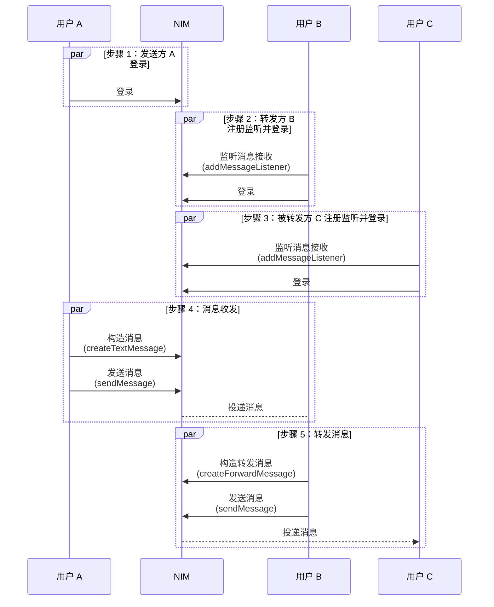

<!--keywords: 转发消息,转发合并消息,转发多条消息,合并转发 -->

网易云信即时通讯 SDK（NetEase IM SDK，简称 NIM SDK）支持消息转发。

消息转发与发送不同类型（如文本、音频、视频等）的消息的方法一致，需要先构建待转发的消息（`createForwardMessage`），再调用 `sendMessage` 方法将其发送至目标会话。

本文主要介绍 **转发单条消息** 场景的实现过程。

::: note notice
- 除了 **通知消息**、**提示消息**、**机器人消息** 以及 **音视频通话** 外，其他类型消息均支持转发给其他会话。
- 转发的消息必须是已发送成功的消息。
:::

## 支持平台

本文内容适用的开发平台或框架如下表所示，涉及的接口请参考下文 [相关接口](#相关接口) 章节：

安卓 | iOS | macOS/Windows | Web/uni-app/小程序 | Node.js/Electron | 鸿蒙 | Flutter
:----: | :----: | :----: | :----: | :----: | :----: | :----:
✔️️️️ | ✔️️️️ | ✔️️️️ | ✔️️️️ | ✔️️️️ | ✔️️️️ | ✔️️️️

## 前提条件

在实现消息转发之前，请确保：

- 已初始化 SDK。
- （如需转发消息至群组会话）已创建群组。
- 已了解各消息类型的 [使用限制](https://doc.yunxin.163.com/messaging2/guide/Dk0MDg4Njk?platform=client)。

## 频控限制

::: note important :::
发送消息（`sendMessage`）方法一分钟内默认最多可调用 300 次。
:::

## 转发单条消息

本节通过以下 API 时序图中用户 A、B、C 的消息交互场景为例，介绍转发单条消息的实现流程。

::: note note
转发不同类型消息的实现方法类似，本节仅以转发一条文本消息为例进行介绍。
:::

### API 调用时序



### 实现流程

以下仅介绍主要步骤，登录等常见步骤省略，具体请参考 [登录 IM](https://doc.yunxin.163.com/messaging2/guide/Dk1MTY4MzA?platform=client) 章节。

1. 用户 B 和 C 注册消息监听器，监听消息接收回调事件。

    :::::: div linked-codes
    ::: code 安卓
    用户 B 和 C 调用 [`addMessageListener`](https://doc.yunxin.163.com/messaging2/client-apis/zIwODM2NTM?platform=client#addMessageListener) 方法注册消息监听器，监听消息接收回调事件 `onReceiveMessages`。
    ```Java
    V2NIMMessageService v2MessageService = NIMClient.getService(V2NIMMessageService.class);

    V2NIMMessageListener messageListener = new V2NIMMessageListener() {

        @Override
        public void onReceiveMessages(List<V2NIMMessage> messages) {

        }
    };
    v2MessageService.addMessageListener(messageListener);
    ```
    :::
    ::: code iOS
    用户 B 和 C 调用 [`addMessageListener`](https://doc.yunxin.163.com/messaging2/client-apis/zIwODM2NTM?platform=client#addMessageListener) 方法注册消息监听器，监听消息接收回调事件 `onReceiveMessages`。
    ```Objective-C
    [[[NIMSDK sharedSDK] v2MessageService] addMessageListener:listener];
    ```
    :::
    ::: code macOS/Windows
    用户 B 和 C 调用 [`addMessageListener`](https://doc.yunxin.163.com/messaging2/client-apis/zIwODM2NTM?platform=client#addMessageListener) 方法注册消息监听器，监听消息接收回调事件 `onReceiveMessages`。
    ```C++
    V2NIMMessageListener listener;
    listener.onReceiveMessages = [](nstd::vector<V2NIMMessage> messages) {
        // receive messages
    };
    messageService.addMessageListener(listener);
    ```
    :::
    ::: code Web/uni-app/小程序

    用户 B 和 C 调用 [`on("EventName")`](https://doc.yunxin.163.com/messaging2/client-apis/zIwODM2NTM?platform=client#on) 方法注册消息监听器，监听消息接收回调事件 `onReceiveMessages`。
    ```TypeScript
    nim.V2NIMMessageService.on("onReceiveMessages", function (messages: V2NIMMessage[]) {});
    ```
    :::
    ::: code Node.js/Electron

    用户 B 和 C 调用 [`on("EventName")`](https://doc.yunxin.163.com/messaging2/client-apis/zIwODM2NTM?platform=client#on) 方法注册消息监听器，监听消息接收回调事件 `onReceiveMessages`。
    ```TypeScript
    v2.messageService.on("receiveMessages", function (messages: V2NIMMessage[]) {})
    ```
    :::
    ::: code 鸿蒙

    用户 B 和 C 调用 [`on("EventName")`](https://doc.yunxin.163.com/messaging2/client-apis/zIwODM2NTM?platform=client#on) 方法注册消息监听器，监听消息接收回调事件 `onReceiveMessages`。
    ```TypeScript
    nim.messageService.on("onReceiveMessages", function (messages: V2NIMMessage[]) {})
    ```
    :::
    ::: code Flutter

    调用 [`listen`](https://doc.yunxin.163.com/messaging2/client-apis/TU1MDAxMjA?platform=client#listen) 方法注册消息监听器，监听消息接收回调事件 `onReceiveMessages`。

    ```Dart
    subsriptions.add(
        NimCore.instance.messageService.onReceiveMessages.listen((event) {
    //do something
    }));
    ```
    :::
    ::::::

2. 用户 A 调用 `createTextMessage` 方法构造一条文本消息，然后调用 `sendMessage` 方法发送给用户 B。

    用户 B 会通过回调接收到用户 A 发送的消息。

    示例代码：

    :::::: div linked-codes
    ::: code 安卓
    ```Java
    V2NIMMessageService v2MessageService = NIMClient.getService(V2NIMMessageService.class);
    // 创建一条文本消息
    V2NIMMessage v2Message = V2NIMMessageCreator.createTextMessage("xxx");
    // 以单聊类型为例
    String conversationId = V2NIMConversationIdUtil.conversationId("xxx", V2NIMConversationType.V2NIM_CONVERSATION_TYPE_P2P);
    // 发送消息
    v2MessageService.sendMessage(v2Message, conversationId, sendMessageParams,
            new V2NIMSuccessCallback<V2NIMSendMessageResult>() {
                @Override
                public void onSuccess(V2NIMSendMessageResult v2NIMSendMessageResult) {
                    // TODO: 发送成功
                }
            },
            new V2NIMFailureCallback() {
                @Override
                public void onFailure(V2NIMError error) {
                    // TODO: 发送失败
                }
            }
    );
    ```
    :::
    ::: code iOS
    ```Objective-C
    // 创建一条文本消息
    V2NIMMessage *message = [V2NIMMessageCreator createTextMessage:@"v2 message"];
    V2NIMSendMessageParams *params = [[V2NIMSendMessageParams alloc] init];
    // 发送消息
    [[[NIMSDK sharedSDK] v2MessageService] sendMessage:message
                                        conversationId:@"conversationId"
                                                params:params
                                            success:^(V2NIMSendMessageResult * _Nonull result) {
                                                // 发送成功回调
                                                }
                                            failure:^(V2NIMError * _Nonnull error) {
                                                // 发送失败回调，error 包含错误原因
                                                }
    }];
    ```
    :::
    ::: code macOS/Windows
    ```C++
    // 以单聊类型为例
    auto conversationId = V2NIMConversationIdUtil::p2pConversationId("target_account_id");
    // 创建一条文本消息
    auto message = V2NIMMessageCreator::createTextMessage("hello world");
    auto params = V2NIMSendMessageParams();
    // 发送消息
    messageService.sendMessage(
        message,
        conversationId,
        params,
        [](V2NIMSendMessageResult result) {
            // send message succeeded
        },
        [](V2NIMError error) {
            // send message failed, handle error
        });
    ```
    :::
    ::: code Web/uni-app/小程序
    ```TypeScript
    try {
    // 创建一条文本消息
    const message: V2NIMMessage = nim.V2NIMMessageCreator.createTextMessage("hello");
    // 发送消息
    const res: V2NIMSendMessageResult = await nim.V2NIMMessageService.sendMessage(message, 'test1|1|test2');
    // Update UI with success message.
    } catch (err) {
    // todo error
    }
    ```
    :::
    ::: code Node.js/Electron
    ```TypeScript
    const message = v2.messageCreator.createTextMessage('Hello NTES IM')
    const result = await v2.messageService.sendMessage(message, conversationId, params, progressCallback)
    ```
    :::
    ::: code 鸿蒙
    ```TypeScript
    try {
    // 创建一条文本消息
    const message: V2NIMMessage = nim.messageCreator.createTextMessage("hello")
    // 发送消息
    const res: V2NIMSendMessageResult = await nim.messageService.sendMessage(message, 'test1|1|test2')
    // todo Success
    } catch (err) {
    // todo error
    }
    ```
    :::
    ::: code Flutter
    ```Dart
    await MessageCreator.createTextMessage(text);
    await NimCore.instance.messageService.sendMessage(message, conversationId, params);
    ```
    :::
    ::::::

3. 用户 B 调用 `createForwardMessage` 构建一条转发消息，调用时将 `message` 参数设置为接收到的消息。

    调用 `createForwardMessage` 方法成功后，会重新返回一个消息体（转发消息体）。

    示例代码：

    :::::: div linked-codes
    ::: code 安卓
    ```Java
    // V2NIMMessage v2Message = ; // 被转发的消息
    V2NIMMessage v2ForwardMessage = V2NIMMessageCreator.createForwardMessage(v2Message);
    ```
    :::
    ::: code iOS
    ```Objective-C
    V2NIMMessage *message = [V2NIMMessageCreator createForwardMessage:originalMessage];
    ```
    :::
    ::: code macOS/Windows
    ```C++
    auto forwardMessage = V2NIMMessageCreator::createForwardMessage(message);
    if (!forwardMessage) {
        // create forward message failed
    }
    ```
    :::
    ::: code Web/uni-app/小程序
    ```JavaScript
    try {
        const newMessage = nim.V2NIMMessageCreator.createForwardMessage(message);
    } catch (err) {
        // todo: error
    }
    ```
    :::
    ::: code Node.js/Electron
    ```TypeScript
    try {
        const message = v2.messageCreator.createForwardMessage(message)
    } catch(err) {
        // todo error
    }
    ```
    :::
    ::: code 鸿蒙
    ```JavaScript
    try {
        const newMessage = nim.messageCreator.createForwardMessage(message)
    } catch(err) {
        // todo error
    }
    ```
    :::
    ::: code Flutter
    ```Dart
    await MessageCreator.createForwardMessage(message);
    ```
    :::
    ::::::

4. 用户 B 调用 `sendMessage` 方法，将转发消息发送给用户 C。

    :::::: div linked-codes
    ::: code 安卓
    ```Java
    V2NIMMessageService v2MessageService = NIMClient.getService(V2NIMMessageService.class);
    // V2NIMMessage v2Message = ; // 被转发的消息
    V2NIMMessage v2ForwardMessage = V2NIMMessageCreator.createForwardMessage(v2Message);
    // 以单聊类型为例
    String conversationId = V2NIMConversationIdUtil.conversationId("xxx", V2NIMConversationType.V2NIM_CONVERSATION_TYPE_P2P);
    // 发送消息
    v2MessageService.sendMessage(v2ForwardMessage, conversationId, sendMessageParams,
            new V2NIMSuccessCallback<V2NIMSendMessageResult>() {
                @Override
                public void onSuccess(V2NIMSendMessageResult v2NIMSendMessageResult) {
                    // TODO: 发送成功
                }
            },
            new V2NIMFailureCallback() {
                @Override
                public void onFailure(V2NIMError error) {
                    // TODO: 发送失败
                }
            }
    );
    ```
    :::
    ::: code iOS
    ```Objective-C
    // 被转发的消息
    V2NIMMessage *message = [V2NIMMessageCreator createForwardMessage:originalMessage];
    V2NIMSendMessageParams *params = [[V2NIMSendMessageParams alloc] init];
    // 发送消息
    [[[NIMSDK sharedSDK] v2MessageService] sendMessage:message
                                    conversationId:@"conversationId"
                                            params:params
                                            success:^(V2NIMSendMessageResult * _Nonnull result) {
                                                // 发送成功回调
                                            }
                                            failure:^(V2NIMError * _Nonnull error) {
                                                // 发送失败回调，error 包含错误原因
                                            }];
    ```
    :::
    ::: code macOS/Windows
    ```C++
    // 以单聊类型为例
    auto conversationId = V2NIMConversationIdUtil::p2pConversationId("target_account_id");
    // 被转发的消息
    auto forwardMessage = V2NIMMessageCreator::createForwardMessage(message);
    auto params = V2NIMSendMessageParams();
    // 发送消息
    messageService.sendMessage(
        forwardMessage,
        conversationId,
        params,
        [](V2NIMSendMessageResult result) {
            // send message succeeded
        },
        [](V2NIMError error) {
            // send message failed, handle error
        });
    ```
    :::
    ::: code Web/uni-app/小程序
    ```JavaScript
    try {
        // 被转发的消息
        const forwardMessage = nim.V2NIMMessageCreator.createForwardMessage(message);
        // 发送消息
        const res = await nim.V2NIMMessageService.sendMessage(forwardMessage, 'test1|1|test2');
        // Update UI with success message.
    } catch (err) {
        // todo error
    }
    ```
    :::
    ::: code Node.js/Electron
    ```TypeScript
    const forwardMessage = v2.messageCreator.createForwardMessage(message)
    const result = await v2.messageService.sendMessage(forwardMessage, conversationId, params, progressCallback)
    ```
    :::
    ::: code 鸿蒙
    ```JavaScript
    try {
        // 被转发的消息
        const forwardMessage = nim.messageCreator.createForwardMessage(message)
        // 发送消息
        const res = await nim.messageService.sendMessage(forwardMessage, 'test1|1|test2');
        // Update UI with success message.
    } catch (err) {
        // todo error
    }
    ```
    :::
    ::: code Flutter
    ```Dart
    await NimCore.instance.messageService.sendMessage(forwardMessage, conversationId, params);
    ```
    :::
    ::::::

5. 用户 C 会通过回调接收到用户 B 转发的消息。

## 相关接口

:::::: div custom-tabs
::: tab 安卓/iOS/macOS/Windows
API | 说明
--- | ---
[`addMessageListener`](https://doc.yunxin.163.com/messaging2/client-apis/zIwODM2NTM?platform=client#addMessageListener) | 注册消息相关监听器
[`removeMessageListener`](https://doc.yunxin.163.com/messaging2/client-apis/zIwODM2NTM?platform=client#removeMessageListener) | 取消注册消息相关监听器
[`createXXXMessage`](https://doc.yunxin.163.com/messaging2/client-apis/TY4MDg4MTk?platform=client) | 消息构建，包括创建一条文本/图片/语音/视频/文件/地理/提示/自定义消息
[`createForwardMessage`](https://doc.yunxin.163.com/messaging2/client-apis/TY4MDg4MTk?platform=client#createForwardMessage) | 构建一条转发消息
[`sendMessage`](https://doc.yunxin.163.com/messaging2/client-apis/zIwODM2NTM?platform=client#sendMessage) | 发送消息
:::
::: tab Web/uni-app/小程序/Node.js/Electron/鸿蒙
API | 说明
--- | ---
[`on("EventName")`](https://doc.yunxin.163.com/messaging2/client-apis/zIwODM2NTM?platform=client#on) | 注册消息相关监听器
[`off("EventName")`](https://doc.yunxin.163.com/messaging2/client-apis/zIwODM2NTM?platform=client#off) | 取消注册消息相关监听器
[`createXXXMessage`](https://doc.yunxin.163.com/messaging2/client-apis/TY4MDg4MTk?platform=client) | 消息构建，包括创建一条文本/图片/语音/视频/文件/地理/提示/自定义消息
[`createForwardMessage`](https://doc.yunxin.163.com/messaging2/client-apis/TY4MDg4MTk?platform=client#createForwardMessage) | 构建一条转发消息
[`sendMessage`](https://doc.yunxin.163.com/messaging2/client-apis/zIwODM2NTM?platform=client#sendMessage) | 发送消息
:::
::: tab Flutter
API | 说明
--- | ---
[`listen`](https://doc.yunxin.163.com/messaging2/client-apis/TU1MDAxMjA?platform=client#listen) | 注册消息相关监听器
[`cancel`](https://doc.yunxin.163.com/messaging2/client-apis/TU1MDAxMjA?platform=client#cancel) | 取消注册消息相关监听器
[`createXXXMessage`](https://doc.yunxin.163.com/messaging2/client-apis/zc4MjgwMTM?platform=client) | 消息构建，包括创建一条文本/图片/语音/视频/文件/地理/提示/自定义消息
[`createForwardMessage`](https://doc.yunxin.163.com/messaging2/client-apis/zc4MjgwMTM?platform=client#createForwardMessage) | 构建一条转发消息
[`sendMessage`](https://doc.yunxin.163.com/messaging2/client-apis/TU1MDAxMjA?platform=client#sendMessage) | 发送消息
:::
::::::