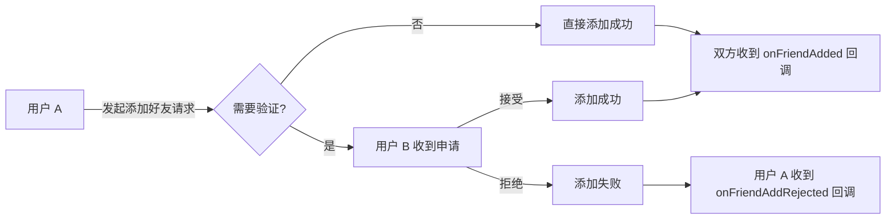

网易云信即时通讯 SDK（NetEase IM SDK，简称 NIM SDK）提供完整的好友关系管理功能，包括添加/删除好友、设置好友信息、查询好友状态和信息等操作。本文将详细介绍如何使用这些功能，以及相关的技术原理和最佳实践。

## 支持平台

本文内容适用的开发平台或框架如下表所示，涉及的接口请参考下文 [相关接口](#相关接口) 章节：

安卓 | iOS | macOS/Windows | Web/uni-app/小程序 | Node.js/Electron | 鸿蒙 | Flutter
:----: | :----: | :----: | :----: | :----: | :----: | :----:
✔️️️ | ✔️️️ | ✔️️️ | ✔️️️ | ✔️️️ | ✔️️ | ✔️️ |

## 技术原理

NIM SDK 支持添加/删除好友，设置好友信息，查询好友状态和信息等操作。好友关系的实现主要主要涉及以下几个方面：

| 功能 | 描述
| --- | ---
| 双向好友关系 | 添加或删除好友时，双方的好友关系都会同步更新。
| 验证机制 | 支持直接添加和需要验证的两种添加好友方式。
| 实时同步 | 好友关系变更会通过回调机制实时通知应用。
| 本地缓存 | 好友列表会在本地缓存，提高查询效率。

添加好友的基本流程如下：



## 前提条件

在使用好友功能之前，请确保您已完成以下步骤:

- 已实现 [登录 IM](https://doc.yunxin.163.com/messaging2/guide/Dk1MTY4MzA?platform=client)。
- 了解 NIM SDK 中好友功能的原理。

## 注意事项

单个用户的好友数量上限与 IM 套餐相关。若需要调整好友数量上限，请自行前往 [网易云信控制台](https://app.yunxin.163.com/global/home) 进行套餐升级。

| IM 标准版 | IM 高级版 | IM 旗舰版 | IM 专属版 | 
| :---: | :---: | :---: | :---: |
| 3000 | 5000 | 8000 | 10000 |

<!--实现逻辑bug

服务端逻辑：用户B没有收到用户A的添加好友的申请，但是用户B直接调 acceptAddApplication 也能加成好友。
控制台的 *添加好友逻辑配置** 开关用来判断对方是否发起好友申请


-->

## 监听好友相关事件

在进行好友相关操作前，您可以提前注册相关事件。注册成功后，当好友相关事件发生时，SDK 会触发对应回调通知。

### 注册监听

好友相关回调：

- **`onFriendAdded`**：添加好友成功回调，返回添加成功的好友信息列表。当客户端本端直接添加好友，或者其他端同步添加好友时触发该回调。
- **`onFriendDeleted`**：删除好友回调，返回删除的好友信息。当客户端本端直接删除好友，或者其他端同步删除的好友，或者对方好友删除自己时触发该回调。
- **`onFriendAddApplication`**：申请添加好友回调，返回申请添加为好友的信息。
- **`onFriendAddRejected`**：被对方拒绝好友添加申请的回调，被拒绝的好友申请信息。
- **`onFriendInfoChanged`**：好友信息更新回调，返回变更的好友信息。当客户端本端直接更新的好友信息，或者其他端同步更新好友信息时触发该回调。

**示例代码**：

:::::: div linked-codes
::: code 安卓
调用 [`addFriendListener`](https://doc.yunxin.163.com/messaging2/client-apis/jM1MTQ0NDQ?platform=client#addFriendListener) 方法注册好友相关监听器，监听添加好友、删除好友、好友信息更新、接受或拒绝好友申请等事件。

```Java
NIMClient.getService(V2NIMFriendService.class).addFriendListener(new V2NIMFriendListener() {
    @Override
    public void onFriendAdded(V2NIMFriend friendInfo) {
    }
    @Override
    public void onFriendDeleted(String accountId, V2NIMFriendDeletionType deletionType) {
    }
    @Override
    public void onFriendAddApplication(V2NIMFriendAddApplication applicationInfo) {
    }
    @Override
    public void onFriendAddRejected(V2NIMFriendAddRejection rejectionInfo) {
    }
    @Override
    public void onFriendInfoChanged(V2NIMFriend friendInfo) {
    }
});
```
:::
::: code iOS
调用 [`addFriendListener`](https://doc.yunxin.163.com/messaging2/client-apis/jM1MTQ0NDQ?platform=client#addFriendListener) 方法注册好友相关监听器，监听添加好友、删除好友、好友信息更新、接受或拒绝好友申请等事件。

```Objective-C
[[[NIMSDK sharedSDK] v2FriendService] addFriendListener:self];
- (void)onFriendAdded:(V2NIMFriend *)friendInfo{};
- (void)onFriendDeleted:(NSString *)accountId deletionType:(V2NIMFriendDeletionType)deletionType{}};
- (void)onFriendAddApplication:(V2NIMFriendAddApplication *)application{}};
- (void)onFriendAddRejected:(V2NIMFriendAddRejection *)rejectionInfo{}};
- (void)onFriendInfoChanged:(V2NIMFriend *)friendInfo{}};
```
:::
::: code macOS/Windows
调用 [`addFriendListener`](https://doc.yunxin.163.com/messaging2/client-apis/jM1MTQ0NDQ?platform=client#addFriendListener) 方法注册好友相关监听器，监听添加好友、删除好友、好友信息更新、接受或拒绝好友申请等事件。

```C++
V2NIMFriendListener listener;
listener.onSyncStarted = []() {
    // sync friend started
};
listener.onSyncFinished = []() {
    // sync friend finished
};
listener.onSyncFailed = [](V2NIMError error) {
    // sync friend failed, handle error
};
listener.onFriendAdded = [](V2NIMFriend friendInfo) {
    // friend added, handle friendInfo
};
listener.onFriendDeleted = [](nstd::string accountId, V2NIMFriendDeletionType deletionType) {
    // friend deleted
};
listener.onFriendAddApplication = [](V2NIMFriendAddApplication applicationInfo) {
    // friend add application, handle applicationInfo
};
listener.onFriendAddRejected = [](V2NIMFriendAddRejection rejectionInfo) {
    // friend add rejected, handle rejectionInfo
};
listener.onFriendInfoChanged = [](V2NIMFriend friendInfo) {
    // friend info changed, handle friendInfo
};
friendService.addFriendListener(listener);
:::
::: code Web/uni-app/小程序
调用 [`on("EventName")`](https://doc.yunxin.163.com/messaging2/client-apis/jM1MTQ0NDQ?platform=client#on) 方法注册好友相关监听器，监听添加好友、删除好友、好友信息更新、接受或拒绝好友申请等事件。

```TypeScript
nim.V2NIMFriendService.on("onFriendAdded", function (friend: V2NIMFriend) {})
nim.V2NIMFriendService.on("onFriendDeleted", function (accountId: string, deletionType: V2NIMFriendDeletionType) {})
nim.V2NIMFriendService.on("onFriendAddApplication", function (application: V2NIMFriendAddApplication) {})
nim.V2NIMFriendService.on("onFriendAddRejected", function (rejection: V2NIMFriendAddRejection) {})
nim.V2NIMFriendService.on("onFriendInfoChanged", function (friend: V2NIMFriend) {})
```
:::
::: code Node.js/Electron
调用 [`on("EventName")`](https://doc.yunxin.163.com/messaging2/client-apis/jM1MTQ0NDQ?platform=client#on) 方法注册好友相关监听器，监听添加好友、删除好友、好友信息更新、接受或拒绝好友申请等事件。

```TypeScript
v2.friendService.on("friendAdded", function (friend: V2NIMFriend) {})
v2.friendService.on("friendDeleted", function (accountId: string, deletionType: V2NIMFriendDeletionType) {})
v2.friendService.on("friendAddApplication", function (application: V2NIMFriendAddApplication) {})
v2.friendService.on("friendAddRejected", function (rejection: V2NIMFriendAddRejection) {})
v2.friendService.on("friendInfoChanged", function (friend: V2NIMFriend) {})
```
:::
::: code 鸿蒙
调用 [`on("EventName")`](https://doc.yunxin.163.com/messaging2/client-apis/jM1MTQ0NDQ?platform=client#on) 方法注册好友相关监听器，监听添加好友、删除好友、好友信息更新、接受或拒绝好友申请等事件。

```TypeScript
nim.friendService.on("onFriendAdded", function (friend: V2NIMFriend) {})
nim.friendService.on("onFriendDeleted", function (accountId: string, deletionType: V2NIMFriendDeletionType) {})
nim.friendService.on("onFriendAddApplication", function (application: V2NIMFriendAddApplication) {})
nim.friendService.on("onFriendAddRejected", function (rejection: V2NIMFriendAddRejection) {})
nim.friendService.on("onFriendInfoChanged", function (friend: V2NIMFriend) {})
```
:::
::: code Flutter
调用 [`listen`](https://doc.yunxin.163.com/messaging2/client-apis/TU2MTgyNzg?platform=client#listen) 方法注册好友相关监听器，监听添加好友、删除好友、好友信息更新、接受或拒绝好友申请等事件。

```Dart
subsriptions.add(NimCore.instance.friendService.onFriendAddApplication.listen((e){
    //do something
  }));
subsriptions.add(NimCore.instance.friendService.onFriendAdded.listen((e){
//do something
}));
subsriptions.add(NimCore.instance.friendService.onFriendAddRejected.listen((e){
//do something
}));
subsriptions.add(NimCore.instance.friendService.onFriendDeleted.listen((e){
//do something
}));
subsriptions.add(NimCore.instance.friendService.onFriendInfoChanged.listen((e){
//do something
}));
```
:::
::::::

### 移除监听

:::::: div linked-codes
::: code 安卓
如需移除好友相关监听器，可调用 [`removeFriendListener`](https://doc.yunxin.163.com/messaging2/client-apis/jM1MTQ0NDQ?platform=client#removeFriendListener) 方法。

```Java
NIMClient.getService(V2NIMFriendService.class).removeFriendListener(listener);
```
:::
::: code iOS
如需移除好友相关监听器，可调用 [`removeFriendListener`](https://doc.yunxin.163.com/messaging2/client-apis/jM1MTQ0NDQ?platform=client#removeFriendListener) 方法。

```Objective-C
[[[NIMSDK sharedSDK] v2FriendService] removeFriendListener:self];
```
:::
::: code macOS/Windows
如需移除好友相关监听器，可调用 [`removeFriendListener`](https://doc.yunxin.163.com/messaging2/client-apis/jM1MTQ0NDQ?platform=client#removeFriendListener) 方法。

```C++
V2NIMFriendListener listener;
// ...
friendService.addFriendListener(listener);
// ...
friendService.removeFriendListener(listener);
```
:::
::: code Web/uni-app/小程序
如需移除好友相关监听器，可调用 [`off("EventName")`](https://doc.yunxin.163.com/messaging2/client-apis/jM1MTQ0NDQ?platform=client#off) 方法。

```TypeScript
nim.V2NIMFriendService.off("onFriendAdded", function (friend: V2NIMFriend) {})
nim.V2NIMFriendService.off("onFriendDeleted", function (accountId: string, deletionType: V2NIMFriendDeletionType) {})
nim.V2NIMFriendService.off("onFriendAddApplication", function (application: V2NIMFriendAddApplication) {})
nim.V2NIMFriendService.off("onFriendAddRejected", function (rejection: V2NIMFriendAddRejection) {})
nim.V2NIMFriendService.off("onFriendInfoChanged", function (friend: V2NIMFriend) {})
```
:::
::: code Node.js/Electron
如需移除好友相关监听器，可调用 [`off("EventName")`](https://doc.yunxin.163.com/messaging2/client-apis/jM1MTQ0NDQ?platform=client#off) 方法。

```TypeScript
v2.friendService.off("friendAdded", function (friend: V2NIMFriend) {})
v2.friendService.off("friendDeleted", function (accountId: string, deletionType: V2NIMFriendDeletionType) {})
v2.friendService.off("friendAddApplication", function (application: V2NIMFriendAddApplication) {})
v2.friendService.off("friendAddRejected", function (rejection: V2NIMFriendAddRejection) {})
v2.friendService.off("friendInfoChanged", function (friend: V2NIMFriend) {})
```
:::
::: code 鸿蒙
如需移除好友相关监听器，可调用 [`off("EventName")`](https://doc.yunxin.163.com/messaging2/client-apis/jM1MTQ0NDQ?platform=client#off) 方法。

```TypeScript
nim.friendService.off("onFriendAdded", function (friend: V2NIMFriend) {})
nim.friendService.off("onFriendDeleted", function (accountId: string, deletionType: V2NIMFriendDeletionType) {})
nim.friendService.off("onFriendAddApplication", function (application: V2NIMFriendAddApplication) {})
nim.friendService.off("onFriendAddRejected", function (rejection: V2NIMFriendAddRejection) {})
nim.friendService.off("onFriendInfoChanged", function (friend: V2NIMFriend) {})
```
:::
::: code Flutter
如需移除好友相关监听器，可调用 [`cancel`](https://doc.yunxin.163.com/messaging2/client-apis/TU2MTgyNzg?platform=client#cancel) 方法。

```Dart
subsriptions.forEach((subsription) {
      subsription.cancel();
    });
```
:::
::::::

## 添加好友

调用 `addFriend` 方法添加好友。

NIM SDK 添加好友分为以下两种模式：

- （默认）直接添加为好友，不需要对方同意。（在添加时将 `V2NIMFriendAddParams.addMode` 设置为 `V2NIM_FRIEND_MODE_TYPE_ADD`。）

    该模式下，调用接口成功后，本端和对端（被添加的好友）都会收到 `onFriendAdded` 回调。

- 请求添加对方为好友，需要对方验证通过才能添加。（在添加时将 `V2NIMFriendAddParams.addMode` 设置为 `V2NIM_FRIEND_MODE_TYPE_APPLY`。）

    该模式下，调用接口成功后，即向对方发送添加好友的申请，对端（被添加的好友）会收到 `onFriendAddApplication` 回调。对端可以选择接受或拒绝好友申请。

**示例代码**：

:::::: div linked-codes
::: code 安卓
```Java
V2NIMFriendAddParams addParams = V2NIMFriendAddParams.V2NIMFriendAddParamsBuilder.builder(addMode)
        .withPostscript("xxx")
        .build();
NIMClient.getService(V2NIMFriendService.class).addFriend("accoundId", addParams,
        new V2NIMSuccessCallback<Void>() {
            @Override
            public void onSuccess(Void unused) {
                // addMode == V2NIM_FRIEND_MODE_TYPE_ADD **添加好友成功**
                // addMode == V2NIM_FRIEND_MODE_TYPE_APPLY **添加好友请求发送成功**
            }
        },
        new V2NIMFailureCallback() {
            @Override
            public void onFailure(V2NIMError error) {

            }
        });
```
:::
::: code iOS
```Objective-C
V2NIMFriendAddParams *addParams = [V2NIMFriendAddParams new];
addParams.addMode = V2NIM_FRIEND_MODE_TYPE_ADD;
addParams.postscript = @"您好，我是 XXX";
[[[NIMSDK sharedSDK] v2FriendService] addFriend:@"accountId" params:addParams success:^{
} failure:^(V2NIMError * _Nonnull error) {
}];
```
:::
::: code macOS/Windows
```C++
V2NIMFriendAddParams params;
params.addMode = V2NIM_FRIEND_MODE_TYPE_ADD;
params.postscript = "hello";
friendService.addFriend(
    "account",
    params,
    []() {
        // add friend success
    },
    [](V2NIMError error) {
        // add friend failed, handle error
    }
);
```
:::
::: code Web/uni-app/小程序
```TypeScript
nim.V2NIMFriendService.addFriend('accid', {
    addMode: 2,
    postscript: '您好，我是 xxx'
});
```
:::
::: code Node.js/Electron
```TypeScript
await v2.friendService.addFriend('accountId', {
    addMode: 1
})
```
:::
::: code 鸿蒙
```TypeScript
nim.friendService.addFriend('accid', {
    addMode: 2,
    postscript: '您好，我是 xxx'
})
```
:::
::: code Flutter
```Dart
await NimCore.instance.friendService.addFriend(accountId, params);
```
:::
::::::

## 接受好友申请

如果添加好友时，选择了 **需要对方（被添加的好友）验证通过才能成功添加为好友** 的方式。

收到添加好友申请的用户可以调用 `acceptAddApplication` 方法接受好友申请。调用接口成功后，本端和对端（发起好友申请的用户）都会收到 `onFriendAdded` 回调。

操作完成后，SDK 内部会更新申请添加好友信息（`applicationInfo`）相关操作的状态并处理相关错误码。

**示例代码**：

:::::: div linked-codes
::: code 安卓
```Java
// V2NIMFriendAddApplication application 无法构造，从查询接口获得
NIMClient.getService(V2NIMFriendService.class).acceptAddApplication(application,
        new V2NIMSuccessCallback<Void>() {
            @Override
            public void onSuccess(Void unused) {

            }
        },
        new V2NIMFailureCallback() {
            @Override
            public void onFailure(V2NIMError error) {

            }
        });
```
:::
::: code iOS
```Objective-C
[[[NIMSDK sharedSDK] v2FriendService] acceptAddApplication:application success:^{
} failure:^(V2NIMError * _Nonnull error) {
}];
```
:::
::: code macOS/Windows
```C++
V2NIMFriendAddApplication application;
// get application from listener or query
// ...
friendService.acceptAddApplication(
    application,
    []() {
        // accept friend request success
    },
    [](V2NIMError error) {
        // accept friend request failed, handle error
    }
);
```
:::
::: code Web/uni-app/小程序
```TypeScript
nim.V2NIMFriendService.acceptAddApplication(application);
```
:::
::: code Node.js/Electron
```TypeScript
await v2.friendService.acceptAddApplication(application)
```
:::
::: code 鸿蒙
```TypeScript
nim.friendService.acceptAddApplication(application)
```
:::
::: code Flutter
```Dart
await NimCore.instance.friendService.acceptAddApplication(application);
```
:::
::::::

## 拒绝好友申请

如果添加好友时，选择了 **需要对方（被添加的好友）验证通过才能成功添加为好友** 的方式。

收到添加好友申请的用户可以调用 `rejectAddApplication` 方法拒绝好友申请。调用接口成功后，对端（发起好友申请的用户）会收到 `onFriendAddRejected` 回调。

操作完成后，SDK 内部会更新申请添加好友信息（`applicationInfo`）相关操作的状态并处理相关错误码。

**示例代码**：

:::::: div linked-codes
::: code 安卓
```Java
// V2NIMFriendAddApplication application 无法构造，从查询接口获得
NIMClient.getService(V2NIMFriendService.class).rejectAddApplication(application,
        new V2NIMSuccessCallback<Void>() {
            @Override
            public void onSuccess(Void unused) {
            }
        },
        new V2NIMFailureCallback() {
            @Override
            public void onFailure(V2NIMError error) {
            }
        });
```
:::
::: code iOS
```Objective-C
[[[NIMSDK sharedSDK] v2FriendService] rejectAddApplication:application postscript:@"XXX" success:^{
    } failure:^(V2NIMError * _Nonnull error) {
}];
```
:::
::: code macOS/Windows
```C++
V2NIMFriendAddApplication application;
// get application from listener or query
// ...
friendService.rejectAddApplication(
    application,
    "postscript",
    []() {
        // reject friend request success
    },
    [](V2NIMError error) {
        // reject friend request failed, handle error
    }
);
```
:::
::: code Web/uni-app/小程序
```TypeScript
nim.V2FriendService.rejectAddApplication(application, 'ps');
```
:::
::: code Node.js/Electron
```TypeScript
await v2.friendService.rejectAddApplication(application, 'reason')
```
:::
::: code 鸿蒙
```TypeScript
nim.friendService.rejectAddApplication(application, 'ps')
```
:::
::: code Flutter
```Dart
await NimCore.instance.friendService.rejectAddApplication(application, postscript);
```
:::
::::::

## 删除好友

调用 `deleteFriend` 方法删除好友。调用接口成功后，本端和对端（被删除的好友）都会收到 `onFriendDeleted` 回调。

NIM SDK 当前的删除是指双向删除，即用户 A 将用户 B 从好友列表中删除时，双方的好友关系都会被解除，即用户 B 的好友列表中也删除了用户 A。

**示例代码**：

:::::: div linked-codes
::: code 安卓
```Java
V2NIMFriendDeleteParams deleteParams = V2NIMFriendDeleteParams.V2NIMFriendDeleteParamsBuilder.builder()
        .withDeleteAlias(deleteAlias)
        .build();
NIMClient.getService(V2NIMFriendService.class).deleteFriend("accoundId", deleteParams,
        new V2NIMSuccessCallback<Void>() {
            @Override
            public void onSuccess(Void unused) {
            }
        },
        new V2NIMFailureCallback() {
            @Override
            public void onFailure(V2NIMError error) {
            }
        });
```
:::
::: code iOS
```Objective-C
V2NIMFriendDeleteParams *deleteParams = [V2NIMFriendDeleteParams new];
deleteParams.deleteAlias = YES;
[[[NIMSDK sharedSDK] v2FriendService] deleteFriend:@"accountId" params:deleteParams success:^{
} failure:^(V2NIMError * _Nonnull error) {
}];
```
:::
::: code macOS/Windows
```C++
V2NIMFriendDeleteParams params;
params.deleteAlias = true;
friendService.deleteFriend(
    "account",
    params,
    []() {
        // delete friend success
    },
    [](V2NIMError error) {
        // delete friend failed, handle error
    }
);
```
:::
::: code Web/uni-app/小程序
```TypeScript
nim.V2NIMFriendService.deleteFriend('accid', {
    deleteAlias: true
});
```
:::
::: code Node.js/Electron
```TypeScript
await v2.friendService.deleteFriend('accountId', {
    deleteAlias: true
})
```
:::
::: code 鸿蒙
```TypeScript
nim.friendService.deleteFriend('accid', {
    deleteAlias: true
})
```
:::
::: code Flutter
```Dart
await NimCore.instance.friendService.deleteFriend(accountId, params);
```
:::
::::::

## 设置好友信息

调用 `setFriendInfo` 方法设置好友的信息，只能更新好友的备注信息（`alias`）和扩展信息（`serverExtension`）。

调用该接口成功后，本端会收到 `onFriendsInfoChanged` 回调。

**示例代码**：

:::::: div linked-codes
::: code 安卓
```Java
V2NIMFriendSetParams setParams = V2NIMFriendSetParams.V2NIMFriendSetParamsBuilder.builder()
        .withAlias(alias)
        .withServerExtension(serverExtension)
        .build();
NIMClient.getService(V2NIMFriendService.class).setFriendInfo("accountId", setParams,
        new V2NIMSuccessCallback<Void>() {
            @Override
            public void onSuccess(Void unused) {
            }
        },
        new V2NIMFailureCallback() {
            @Override
            public void onFailure(V2NIMError error) {
            }
        });
```
:::
::: code iOS
```Objective-C
V2NIMFriendSetParams *setParams = [V2NIMFriendSetParams new];
setParams.alias = @"XXX";
setParams.serverExtension = @"XXX";
[[[NIMSDK sharedSDK] v2FriendService] setFriendInfo:@"accountId" params:setParams success:^{
} failure:^(V2NIMError * _Nonnull error) {
}];
```
:::
::: code macOS/Windows
```C++
V2NIMFriendSetParams params;
params.alias = "alias";
friendService.setFriendInfo(
    "account",
    params,
    []() {
        // set friend info success
    },
    [](V2NIMError error) {
        // set friend info failed, handle error
    });
```
:::
::: code Web/uni-app/小程序
```TypeScript
nim.V2NIMFriendService.setFriendInfo('accid', {
    alias: 'alias',
    serverExtension: 'serverExtension'
});
```
:::
::: code Node.js/Electron
```TypeScript
await v2.friendService.setFriendInfo('accountId', {
    alias: 'alias'
})
```
:::
::: code 鸿蒙
```TypeScript
nim.friendService.setFriendInfo('accid', {
    alias: 'alias',
    serverExtension: 'serverExtension'
})
```
:::
::: code Flutter
```Dart
await NimCore.instance.friendService.setFriendInfo(accountId, params);
```
:::
::::::

## 查询好友列表

调用 `getFriendList` 方法本地查询好友列表。

用户登录后，SDK 开始同步好友信息，建议同步完成后，调用该接口拉取完整的好友信息列表。

**示例代码**：

:::::: div linked-codes
::: code 安卓
```Java
NIMClient.getService(V2NIMFriendService.class).getFriendList(
        new V2NIMSuccessCallback<List<V2NIMFriend>>() {
            @Override
            public void onSuccess(List<V2NIMFriend> v2NIMFriends) {
            }
        },
        new V2NIMFailureCallback() {
            @Override
            public void onFailure(V2NIMError error) {
            }
        });
```
:::
::: code iOS
```Objective-C
[[[NIMSDK sharedSDK] v2FriendService] getFriendList:^(NSArray<V2NIMFriend *> * _Nonnull result) {
} failure:^(V2NIMError * _Nonnull error) {
}];
```
:::
::: code macOS/Windows
```C++
friendService.getFriendList(
    [](std::vector<V2NIMFriend> friends) {
        // get friend list success, handle friends
    },
    [](V2NIMError error) {
        // get friend list failed, handle error
    }
);
```
:::
::: code Web/uni-app/小程序
```TypeScript
const friends = nim.V2NIMFriendService.getFriendList();
```
:::
::: code Node.js/Electron
```TypeScript
const friends = await v2.friendService.getFriendList()
```
:::
::: code 鸿蒙
```TypeScript
const friends = nim.friendService.getFriendList()
```
:::
::: code Flutter
```Dart
await NimCore.instance.friendService.getFriendList();
```
:::
::::::

## 查询指定好友信息

调用 `getFriendByIds` 方法根据账号 ID 查询指定好友的信息列表，只返回账号 ID 存在的好友信息。

**示例代码**：

:::::: div linked-codes
::: code 安卓
```Java
NIMClient.getService(V2NIMFriendService.class).getFriendByIds(accountIds,
        new V2NIMSuccessCallback<List<V2NIMFriend>>() {
            @Override
            public void onSuccess(List<V2NIMFriend> v2NIMFriends) {
            }
        },
        new V2NIMFailureCallback() {
            @Override
            public void onFailure(V2NIMError error) {
            }
        });
```
:::
::: code iOS
```Objective-C
[[[NIMSDK sharedSDK] v2FriendService] getFriendByIds:@[@"accountId1",@"accountId2"] success:^(NSArray<V2NIMFriend *> * _Nonnull result) {
    } failure:^(V2NIMError * _Nonnull error) {
    }];
```
:::
::: code macOS/Windows
```C++
friendService.getFriendByIds(
    {"account1", "account2"},
    [](std::vector<V2NIMFriend> friends) {
        // get friend list success, handle friends
    },
    [](V2NIMError error) {
        // get friend list failed, handle error
    });
```
:::
::: code Web/uni-app/小程序
```TypeScript
const friends = await nim.V2NIMFriendService.getFriendByIds(['accid1', 'accid2']);
```
:::
::: code Node.js/Electron
```TypeScript
const friends = await v2.friendService.getFriendByIds(['accountId1', 'accountId2'])
```
:::
::: code 鸿蒙
```TypeScript
const friends = await nim.friendService.getFriendByIds(['accid1', 'accid2'])
```
:::
::: code Flutter
```Dart
await NimCore.instance.friendService.getFriendByIds(accountIds);
```
:::
::::::

## 根据关键字搜索好友信息

调用 `searchFriendByOption` 方法根据关键字信息搜索好友的信息。

该方法默认搜索好友的备注，若有需要，也可以指定同时搜索用户账号。

**示例代码**：

:::::: div linked-codes
::: code 安卓
```Java
// 按需配置
// .withSearchAccountId()
// .withSearchAlias()
.build();
NIMClient.getService(V2NIMFriendService.class).searchFriendByOption(option,
new V2NIMSuccessCallback<List<V2NIMFriend>>() {
    @Override
    public void onSuccess(List<V2NIMFriend> v2NIMFriends) {
    }
},
new V2NIMFailureCallback() {
    @Override
    public void onFailure(V2NIMError error) {
    }
});
```
:::
::: code iOS
```Objective-C
// 按需配置
option.searchAlias = YES;
option.searchAccountId = YES;
[NIMSDK.sharedSDK.v2FriendService searchFriendByOption:option
                                            success:^(NSArray <V2NIMFriend *> *result)
                                            {
                                            }
                                            failure:^(V2NIMError *error)
                                            {
                                            }];
```
:::
::: code macOS/Windows
```C++
V2NIMFriendSearchOption option;
option.keyword = "keyword";
friendService.searchFriendByOption(
option,
[](nstd::vector<V2NIMFriend> friends) {
// search friend success, handle friends
},
[](V2NIMError error) {
// search friend failed, handle error
});
```
:::
::: code Web/uni-app/小程序
```TypeScript
try {
    const friends = await nim.V2NIMFriendService.searchFriendByOption({
        keyword: 'nick',
        searchAlias: true,
        searchAccountId: false
    });
} catch(err) {
    console.error('searchFriendByOption Error:', err);
}
```
:::
::: code Node.js/Electron
```TypeScript
try {
    const friends = await v2.friendService.searchFriendByOption({
        keyword: 'nick',
        searchAlias: true,
        searchAccountId: false
    });
} catch(err) {
    console.error('searchFriendByOption Error:', err);
}
```
:::
::: code 鸿蒙
```TypeScript
try {
    const friends = await nim.friendService.searchFriendByOption({
        keyword: 'nick',
        searchAlias: true,
        searchAccountId: false
    })
} catch(err) {
    console.error('searchFriendByOption Error:', err)
}
```
:::
::: code Flutter
```Dart
await NimCore.instance.friendService.searchFriendByOption(friendSearchOption);
```
:::
::::::

## 查询好友状态

调用 `checkFriend` 方法根据账号 ID 查询好友的状态。

调用接口成功后，会返回一个 key 为 accountId，value 为好友状态的 Map。

**示例代码**：

:::::: div linked-codes
::: code 安卓
```Java
NIMClient.getService(V2NIMFriendService.class).checkFriend(accountIds, new V2NIMSuccessCallback<Map<String, Boolean>>() {
    @Override
    public void onSuccess(Map<String, Boolean> stringBooleanMap) {
    }
}, new V2NIMFailureCallback() {
    @Override
    public void onFailure(V2NIMError error) {
    }
});
```
:::
::: code iOS
```Objective-C
[[[NIMSDK sharedSDK] v2FriendService] checkFriend:@[@"accountId1",@"accountId2"] success:^(NSDictionary<NSString *,NSNumber *> * _Nonnull result) {
    } failure:^(V2NIMError * _Nonnull error) {
}];
```
:::
::: code macOS/Windows
```C++
friendService.checkFriend(
    {"account1", "account2"},
    [](nstd::map<nstd::string, bool> checkList) {
        // check friend success, handle checkList
    },
    [](V2NIMError error) {
        // check friend failed, handle error
    });
```
:::
::: code Web/uni-app/小程序
```TypeScript
const res = await nim.V2NIMFriendService.checkFriend(['accid1', 'accid2']);
```
:::
::: code Node.js/Electron
```TypeScript
const res = await v2.friendService.checkFriend(['accountId1', 'accountId2'])
```
:::
::: code 鸿蒙
```TypeScript
const res = await nim.friendService.checkFriend(['accid1', 'accid2'])
```
:::
::: code Flutter
```Dart
await NimCore.instance.friendService.checkFriend(accountIds);
```
:::
::::::

## 查询好友申请信息

调用 `getAddApplicationList` 方法查询好友申请信息列表。

NIM SDK 将按照从新到旧的顺序进行查询。

::: note note
Web/uni-app/小程序由于没有本地数据库持久化存储，申请通知只下发一次，重新登录后不再下发。
:::

**示例代码**：

:::::: div linked-codes
::: code 安卓
```Java
V2NIMFriendAddApplicationQueryOption option = V2NIMFriendAddApplicationQueryOption.V2NIMFriendAddApplicationQueryOptionBuilder.builder()
        .withLimit(limit)
        .withOffset(offset)
        .withStatus(statuses)
        .build();
NIMClient.getService(V2NIMFriendService.class).getAddApplicationList(option,
        new V2NIMSuccessCallback<V2NIMFriendAddApplicationResult>() {
            @Override
            public void onSuccess(V2NIMFriendAddApplicationResult v2NIMFriendAddApplicationResult) {
            }
        },
        new V2NIMFailureCallback() {
            @Override
            public void onFailure(V2NIMError error) {
            }
        }
);
```
:::
::: code iOS
```Objective-C
V2NIMFriendAddApplicationQueryOption *queryOption = [V2NIMFriendAddApplicationQueryOption new];
queryOption.offset = 0;
queryOption.limit = 50;
[[[NIMSDK sharedSDK] v2FriendService] getAddApplicationList:queryOption success:^(V2NIMFriendAddApplicationResult * _Nonnull result) {
} failure:^(V2NIMError * _Nonnull error) {
}];
```
:::
::: code macOS/Windows
```C++
V2NIMFriendAddApplicationQueryOption option;
option.offset = 0;
option.limit = 10;
friendService.getAddApplicationList(
    option,
    [](V2NIMFriendAddApplicationResult result) {
        // 查询添加申请列表成功，处理结果
    },
    [](V2NIMError error) {
        // 查询添加申请列表失败，处理错误
    });
```
:::
::: code Web/uni-app/小程序
```TypeScript
const applicationList = await nim.V2NIMFriendService.getAddApplicationList({
    offset: 0,
    limit: 50
});
```
:::
::: code Node.js/Electron
```TypeScript
const applicationList = await v2.friendService.getAddApplicationList({
    offset: 0,
    limit: 50
});
```
:::
::: code 鸿蒙
```TypeScript
const applicationList = await nim.friendService.getAddApplicationList({
    offset: 0,
    limit: 50
})
```
:::
::: code Flutter
```Dart
await NimCore.instance.friendService.getAddApplicationList(option);
```
:::
::::::

## 查询未读的好友申请数量

调用 `getAddApplicationUnreadCount` 方法获取未读的好友申请（状态为未处理）数量。

**示例代码**：

:::::: div linked-codes
::: code 安卓
```Java
NIMClient.getService(V2NIMFriendService.class).getAddApplicationUnreadCount(
new V2NIMSuccessCallback<Integer>() {
    @Override
    public void onSuccess(Integer count) {
        // 查询结果为 count
    }
}, new V2NIMFailureCallback() {
    @Override
    public void onFailure(V2NIMError error) {
        // 查询失败
    }
});
```
:::
::: code iOS
```Objective-C
[[[NIMSDK sharedSDK] v2FriendService] getAddApplicationUnreadCount:^(NSInteger count) {
    // 获取未读数，成功回调
} failure:^(V2NIMError * _Nonnull error) {
    // 取未读数，失败回调
}];
```
:::
::: code macOS/Windows
```C++
friendService.getAddApplicationUnreadCount(
[](uint32_t count) {
    // get add application unread count success, handle count
},
[](V2NIMError error) {
    // get add application unread count failed, handle error
});
```
:::
::: code Web/uni-app/小程序
```TypeScript
try {
    const count = await nim.V2NIMFriendService.getAddApplicationUnreadCount()
} catch(err) {
    console.error('getAddApplicationUnreadCount Error:', err)
}
```
:::
::: code Node.js/Electron
```TypeScript
try {
    const count = await nim.V2NIMFriendService.getAddApplicationUnreadCount()
} catch(err) {
    console.error('getAddApplicationUnreadCount Error:', err)
}
```
:::
::: code 鸿蒙
```TypeScript
try {
    const count = await nim.friendService.getAddApplicationUnreadCount()
} catch(err) {
    console.error('getAddApplicationUnreadCount Error:', err)
}
```
:::
::: code Flutter
```Dart
await NimCore.instance.friendService.getAddApplicationUnreadCount();
```
:::
::::::

## 设置好友申请已读

调用 `setAddApplicationReadEx` 方法将未读的好友申请设置为已读。

调用该方法，历史所有未读的好友申请数据将均标记为已读。

**示例代码**：

:::::: div linked-codes
::: code Android
```Java
/**
     * 标记特定好友申请为已读
     * 将指定的好友申请标记为已读状态
     */
    public void markSpecificApplicationAsRead(V2NIMFriendAddApplication application) {
        NIMClient.getService(V2NIMFriendService.class).setAddApplicationReadEx(
                application, // 传入具体的好友申请信息
                new V2NIMSuccessCallback<Void>() {
                    @Override
                    public void onSuccess(Void result) {
                        System.out.println("成功标记好友申请为已读");
                        // 更新UI，移除该申请的未读标识
                        onApplicationReadSuccess(application);
                    }
                },
                new V2NIMFailureCallback() {
                    @Override
                    public void onFailure(int code, String desc) {
                        System.err.println("标记好友申请已读失败，错误码: " + code + ", 错误描述: " + desc);
                        // 处理失败情况
                        onApplicationReadFailed(application, code, desc);
                    }
                }
        );
    }
```
:::
::: code iOS
```Objective-C
- (void)markApplicationAsRead:(V2NIMFriendAddApplication *)application {
    [[NIMSDK sharedSDK].V2NIMFriendService setAddApplicationReadEx:application 
                                                        success:^{
        NSLog(@"成功标记好友申请为已读");
    } failure:^(NSInteger code, NSString * _Nullable desc) {
        NSLog(@"标记好友申请已读失败，错误码: %ld, 错误描述: %@", (long)code, desc);
    }];
}
```
:::
::: code macOS/Windows
```C++
friendService.setAddApplicationReadEx(
    application,
    []() {
        // set add application read success
    },
    [](V2NIMError error) {
        // set add application read failed, handle error
    });
```
:::
::: code Web/uni-app/小程序
```TypeScript
// 全量已读
await nim.V2NIMFriendService.setAddApplicationReadEx(undefined)

// 单挑已读
const res: V2NIMFriendAddApplicationResult = await nim.V2NIMFriendService.getAddApplicationList({
  status: [] // means all status
})

if (res.infos.length > 0) {
  const lastAction = res.infos[0]
  await nim.V2NIMFriendService.setAddApplicationReadEx(lastAction)
}
```
:::
::: code Node.js/Electron
```TypeScript
await v2.friendService.setAddApplicationReadEx(application)
```
:::
::: code 鸿蒙
```TypeScript
// 全量已读
await nim.friendService.setAddApplicationReadEx(undefined)

// 单挑已读
const res: V2NIMFriendAddApplicationResult = await nim.friendService.getAddApplicationList({
  status: [] // means all status
})

if (res.infos.length > 0) {
  const lastAction = res.infos[0]
  await friendService.setAddApplicationReadEx(lastAction)
}
```
:::
<!--
::: code Flutter
```dart
```
:::
-->
::::::

<!--setAddApplicationRead 示例
:::::: div linked-codes
::: code 安卓
```Java
NIMClient.getService(V2NIMFriendService.class).setAddApplicationRead(
new V2NIMSuccessCallback<Void>() {
    @Override
    public void onSuccess(Void unused) {
        // 设置已读成功
    }
}, new V2NIMFailureCallback() {
    @Override
    public void onFailure(V2NIMError error) {
        // 设置已读失败
    }
});
```
:::
::: code iOS
```Objective-C
[[[NIMSDK sharedSDK] v2FriendService] setAddApplicationRead:^(BOOL success) {
    // 设置已读，成功回调
} failure:^(V2NIMError * _Nonnull error) {
    // 失败回调
}];
```
:::
::: code macOS/Windows
```C++
friendService.setAddApplicationRead(
    []() {
        // set add application read success
    },
    [](V2NIMError error) {
        // set add application read failed, handle error
    });
```
:::
::: code Web/uni-app/小程序
```TypeScript
try {
    await nim.V2NIMFriendService.setAddApplicationRead()
} catch(err) {
    console.error('setAddApplicationRead Error:', err)
}
```
:::
::: code Node.js/Electron
```TypeScript
try {
    await v2.friendService.setAddApplicationRead()
} catch(err) {
    console.error('setAddApplicationRead Error:', err)
}
```
:::
::: code 鸿蒙
```TypeScript
try {
    await nim.friendService.setAddApplicationRead()
} catch(err) {
    console.error('setAddApplicationRead Error:', err)
}
```
:::
::: code Flutter
```Dart
await NimCore.instance.friendService.setAddApplicationRead();
```
:::
::::::
-->

## 清空好友申请

调用 `clearAllAddApplication` 方法清空所有好友申请。

调用该方法，历史所有的好友申请数据均被清空。

**示例代码**：

:::::: div linked-codes
::: code 安卓
```Java
NIMClient.getService(V2NIMFriendService.class).clearAllAddApplication(new V2NIMSuccessCallback<Void>() {
  @Override
  public void onSuccess(Void unused) {
   //success
  }
}, new V2NIMFailureCallback() {
  @Override
  public void onFailure(V2NIMError error) {
   //failed
  }
});
```
:::
::: code iOS
```Objective-C
[[NIMSDK sharedSDK].v2FriendService clearAllAddApplication:^() {
    //success
} failure:^(V2NIMError *error) {
    //failed
}];
```
:::
::: code macOS/Windows
```C++
friendService.clearAllAddApplication(
[]() {
    // clear all add application success
},
[](V2NIMError error) {
    // clear all add application failed, handle error
});
```
:::
::: code Web/uni-app/小程序
```TypeScript
await nim.V2NIMFriendService.clearAllAddApplication()
```
:::
::: code Node.js/Electron
```TypeScript
await v2.friendService.clearAllAddApplication()
```
:::
::: code 鸿蒙
```TypeScript
await nim.friendService.clearAllAddApplication()
```
:::
::: code Flutter 
```Dart
await NimCore.instance.friendService.clearAllAddApplication();
```
:::
::::::

## 删除指定的好友申请

调用 `deleteAddApplication` 方法删除指定的好友申请。

**示例代码**

:::::: div linked-codes
::: code 安卓
```Java
NIMClient.getService(V2NIMFriendService.class).deleteAddApplication(application,new V2NIMSuccessCallback<Void>() {
  @Override
  public void onSuccess(Void unused) {
   //success
  }
}, new V2NIMFailureCallback() {
  @Override
  public void onFailure(V2NIMError error) {
   //failed
  }
});
```
:::
::: code iOS
```Objective-C
[NIMSDK sharedSDK].v2FriendService deleteAddApplication:application success:^() {
    //success
} failure:^(V2NIMError *error) {
    //failed
}];
```
:::
::: code macOS/Windows
```C++
V2NIMFriendAddApplication application;
// get application from listener or query
// ...
friendService.deleteAddApplication(
    application,
    []() {
        // delete add application success
    },
    [](V2NIMError error) {
        // delete add application failed, handle error
    });
```
:::
::: code Web/uni-app/小程序
```TypeScript
await nim.V2NIMFriendService.deleteAddApplication(applicationInfo)
```
:::
::: code Node.js/Electron
```TypeScript
await v2.friendService.deleteAddApplication(application)
```
:::
::: code 鸿蒙
```TypeScript
const params = {
  applicantAccountId: 'a',
  recipientAccountId: 'b',
  operatorAccountId: 'c',
  postscript: 'd',
  status: V2NIMFriendAddApplicationStatus.V2NIM_FRIEND_ADD_APPLICATION_STATUS_INIT,
  timestamp: 1234567,
  read: true
} as V2NIMFriendAddApplication

await nimfriendService.deleteAddApplication(params)
```
:::
::: code Flutter
```dart
NimCore.instance.friendService.deleteAddApplication(application).then((result) {

});
```
:::
::::::

## 相关接口

:::::: div linked-codes
::: code 安卓/iOS/macOS/Windows
API | 说明
--- | ---
[`addFriendListener`](https://doc.yunxin.163.com/messaging2/client-apis/jM1MTQ0NDQ?platform=client#addFriendListener) | 注册好友关系相关监听器
[`removeFriendListener`](https://doc.yunxin.163.com/messaging2/client-apis/jM1MTQ0NDQ?platform=client#removeFriendListener) | 取消注册好友关系相关监听器
[`addFriend`](https://doc.yunxin.163.com/messaging2/client-apis/jM1MTQ0NDQ?platform=client#addFriend) | 添加好友
[`acceptAddApplication`](https://doc.yunxin.163.com/messaging2/client-apis/jM1MTQ0NDQ?platform=client#acceptAddApplication) | 接受好友申请
[`rejectAddApplication`](https://doc.yunxin.163.com/messaging2/client-apis/jM1MTQ0NDQ?platform=client#rejectAddApplication) | 拒绝好友申请
[`deleteFriend`](https://doc.yunxin.163.com/messaging2/client-apis/jM1MTQ0NDQ?platform=client#deleteFriend) | 删除好友
[`setFriendInfo`](https://doc.yunxin.163.com/messaging2/client-apis/jM1MTQ0NDQ?platform=client#setFriendInfo) | 设置好友信息
[`getFriendList`](https://doc.yunxin.163.com/messaging2/client-apis/jM1MTQ0NDQ?platform=client#getFriendList) | 获取好友列表
[`getFriendByIds`](https://doc.yunxin.163.com/messaging2/client-apis/jM1MTQ0NDQ?platform=client#getFriendByIds) | 根据账号 ID 获取好友列表
[`searchFriendByOption`](https://doc.yunxin.163.com/messaging2/client-apis/jM1MTQ0NDQ?platform=client#searchFriendByOption) | 根据条件搜索好友
[`checkFriend`](https://doc.yunxin.163.com/messaging2/client-apis/jM1MTQ0NDQ?platform=client#checkFriend) | 根据账号 ID 查询好友关系
[`getAddApplicationList`](https://doc.yunxin.163.com/messaging2/client-apis/jM1MTQ0NDQ?platform=client#getAddApplicationList) | 获取申请添加好友信息列表
[`getAddApplicationUnreadCount`](https://doc.yunxin.163.com/messaging2/client-apis/jM1MTQ0NDQ?platform=client#getAddApplicationUnreadCount) | 获取未读的好友申请（状态为未处理）数量
[`setAddApplicationRead`](https://doc.yunxin.163.com/messaging2/client-apis/jM1MTQ0NDQ?platform=client#setAddApplicationRead) | 设置好友申请已读
[`clearAllAddApplication`](https://doc.yunxin.163.com/messaging2/client-apis/jM1MTQ0NDQ?platform=client#clearAllAddApplication) | 清空所有好友申请
[`deleteAddApplication`](https://doc.yunxin.163.com/messaging2/client-apis/jM1MTQ0NDQ?platform=client#deleteAddApplication) | 删除指定的好友申请
[`setAddApplicationReadEx`](https://doc.yunxin.163.com/messaging2/client-apis/jM1MTQ0NDQ?platform=client#setAddApplicationReadEx) |  设置好友申请已读
:::
::: code Web/uni-app/小程序/Node.js/Electron/鸿蒙
API | 说明
--- | ---
[`on("EventName")`](https://doc.yunxin.163.com/messaging2/client-apis/jM1MTQ0NDQ?platform=client#on) | 注册好友关系相关监听器
[`off("EventName")`](https://doc.yunxin.163.com/messaging2/client-apis/jM1MTQ0NDQ?platform=client#off) | 取消注册好友关系相关监听器
[`addFriend`](https://doc.yunxin.163.com/messaging2/client-apis/jM1MTQ0NDQ?platform=client#addFriend) | 添加好友
[`acceptAddApplication`](https://doc.yunxin.163.com/messaging2/client-apis/jM1MTQ0NDQ?platform=client#acceptAddApplication) | 接受好友申请
[`rejectAddApplication`](https://doc.yunxin.163.com/messaging2/client-apis/jM1MTQ0NDQ?platform=client#rejectAddApplication) | 拒绝好友申请
[`deleteFriend`](https://doc.yunxin.163.com/messaging2/client-apis/jM1MTQ0NDQ?platform=client#deleteFriend) | 删除好友
[`setFriendInfo`](https://doc.yunxin.163.com/messaging2/client-apis/jM1MTQ0NDQ?platform=client#setFriendInfo) | 设置好友信息
[`getFriendList`](https://doc.yunxin.163.com/messaging2/client-apis/jM1MTQ0NDQ?platform=client#getFriendList) | 获取好友列表
[`getFriendByIds`](https://doc.yunxin.163.com/messaging2/client-apis/jM1MTQ0NDQ?platform=client#getFriendByIds) | 根据账号 ID 获取好友列表
[`searchFriendByOption`](https://doc.yunxin.163.com/messaging2/client-apis/jM1MTQ0NDQ?platform=client#searchFriendByOption) | 根据条件搜索好友
[`checkFriend`](https://doc.yunxin.163.com/messaging2/client-apis/jM1MTQ0NDQ?platform=client#checkFriend) | 根据账号 ID 查询好友关系
[`getAddApplicationList`](https://doc.yunxin.163.com/messaging2/client-apis/jM1MTQ0NDQ?platform=client#getAddApplicationList) | 获取申请添加好友信息列表
[`getAddApplicationUnreadCount`](https://doc.yunxin.163.com/messaging2/client-apis/jM1MTQ0NDQ?platform=client#getAddApplicationUnreadCount) | 获取未读的好友申请（状态为未处理）数量
[`setAddApplicationRead`](https://doc.yunxin.163.com/messaging2/client-apis/jM1MTQ0NDQ?platform=client#setAddApplicationRead) | 设置好友申请已读
[`clearAllAddApplication`](https://doc.yunxin.163.com/messaging2/client-apis/jM1MTQ0NDQ?platform=client#clearAllAddApplication) | 清空所有好友申请
[`deleteAddApplication`](https://doc.yunxin.163.com/messaging2/client-apis/jM1MTQ0NDQ?platform=client#deleteAddApplication) | 删除指定的好友申请
[`setAddApplicationReadEx`](https://doc.yunxin.163.com/messaging2/client-apis/jM1MTQ0NDQ?platform=client#setAddApplicationReadEx) |  设置好友申请已读
:::
::: code Flutter
API | 说明
--- | ---
[`listen`](https://doc.yunxin.163.com/messaging2/client-apis/TU2MTgyNzg?platform=client#listen) | 注册好友关系相关监听器
[`cancel`](https://doc.yunxin.163.com/messaging2/client-apis/TU2MTgyNzg?platform=client#cancel) | 取消注册好友关系相关监听器
[`addFriend`](https://doc.yunxin.163.com/messaging2/client-apis/TU2MTgyNzg?platform=client#addFriend) | 添加好友
[`acceptAddApplication`](https://doc.yunxin.163.com/messaging2/client-apis/TU2MTgyNzg?platform=client#acceptAddApplication) | 接受好友申请
[`rejectAddApplication`](https://doc.yunxin.163.com/messaging2/client-apis/TU2MTgyNzg?platform=client#rejectAddApplication) | 拒绝好友申请
[`deleteFriend`](https://doc.yunxin.163.com/messaging2/client-apis/TU2MTgyNzg?platform=client#deleteFriend) | 删除好友
[`setFriendInfo`](https://doc.yunxin.163.com/messaging2/client-apis/TU2MTgyNzg?platform=client#setFriendInfo) | 设置好友信息
[`getFriendList`](https://doc.yunxin.163.com/messaging2/client-apis/TU2MTgyNzg?platform=client#getFriendList) | 获取好友列表
[`getFriendByIds`](https://doc.yunxin.163.com/messaging2/client-apis/TU2MTgyNzg?platform=client#getFriendByIds) | 根据账号 ID 获取好友列表
[`searchFriendByOption`](https://doc.yunxin.163.com/messaging2/client-apis/TU2MTgyNzg?platform=client#searchFriendByOption) | 根据条件搜索好友
[`checkFriend`](https://doc.yunxin.163.com/messaging2/client-apis/TU2MTgyNzg?platform=client#checkFriend) | 根据账号 ID 查询好友关系
[`getAddApplicationList`](https://doc.yunxin.163.com/messaging2/client-apis/TU2MTgyNzg?platform=client#getAddApplicationList) | 获取申请添加好友信息列表
[`getAddApplicationUnreadCount`](https://doc.yunxin.163.com/messaging2/client-apis/TU2MTgyNzg?platform=client#getAddApplicationUnreadCount) | 获取未读的好友申请（状态为未处理）数量
[`setAddApplicationRead`](https://doc.yunxin.163.com/messaging2/client-apis/TU2MTgyNzg?platform=client#setAddApplicationRead) | 设置好友申请已读
[`clearAllAddApplication`](https://doc.yunxin.163.com/messaging2/client-apis/TU2MTgyNzg?platform=client#clearAllAddApplication) | 清空所有好友申请
[`deleteAddApplication`](https://doc.yunxin.163.com/messaging2/client-apis/TU2MTgyNzg?platform=client#deleteAddApplication) | 删除指定的好友申请
:::
::::::