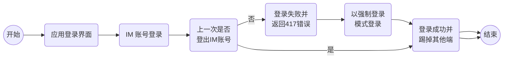
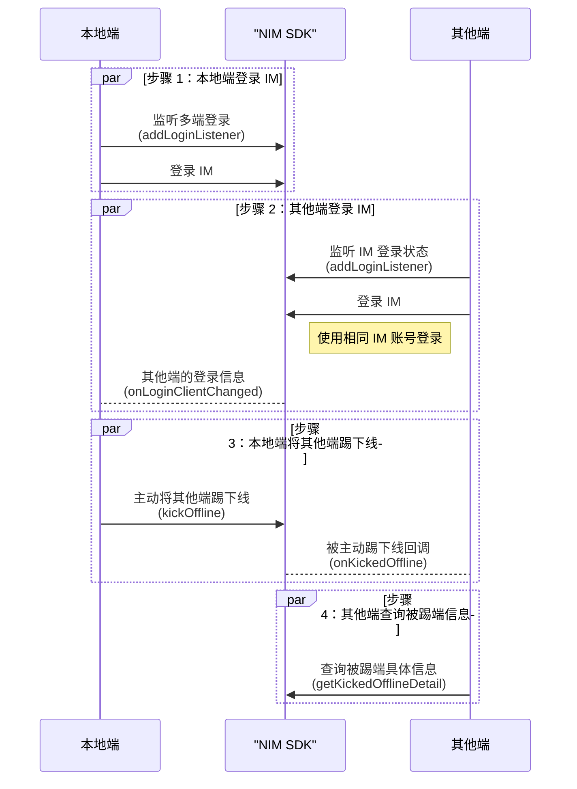

<!-- keywords: 即时通讯,IM,登录, 多端登录, 互踢, 多个设备端同时在线 -->

网易云信即时通讯 IM 支持多客户端同时登录，同时支持设置客户端之间的互斥关系。您可以通过 **自动** 和 **手动** 两种方式实现应用在不同客户端间的登录制约，让账号在多余的客户端强制下线，避免重复登录，简称 **多端登录互踢**。

## 支持平台

本文内容适用的开发平台或框架如下表所示，涉及的接口请参考下文 [相关接口](#相关接口) 章节：

安卓 | iOS | macOS/Windows | Web/uni-app/小程序 | Node.js/Electron | 鸿蒙 | Flutter
:----: | :----: | :----: | :----: | :----: | :----: | :----:
✔️️ | ✔️️ | ✔️️ | ✔️️ | ✔️️ | ✔️️ | ✔️️

## 前提条件

根据本文操作前，请确保您已经实现了 [登录 IM](https://doc.yunxin.163.com/messaging2/guide/Dk1MTY4MzA?platform=client)。

## 方式一：多端登录自动互踢

在 [网易云信控制台](https://app.netease.im/login) 首页 **应用管理** 选择应用，进入 <b>产品功能 > IM 即时通讯 > 基础功能 > 多端登录模式</b>，配置四种不同的多端登录互踢策略。


### **<span id='只允许一端登录'>策略一：只允许一端登录</span>**

同一账号仅允许在一台设备上登录。当该账号在另一台设备上成功登录时，新设备会将旧设备踢下线。

### **<span id='桌面端互踢、移动端互踢、桌面与移动端同时登录'>策略二：桌面端互踢、移动端互踢、桌面与移动端同时登录</span>**

- 同类客户端之间互踢，即桌面端之间互踢，移动端之间互踢。

    以下情况下新设备会将旧设备踢下线：

    - 已经有一台桌面端设备（PC 与 Web）在线，在另一台桌面端设备（PC 与 Web）上成功登录。
    - 已经有一台移动端设备（iOS、安卓、鸿蒙）在线，在另一台移动端设备（iOS、安卓、鸿蒙）上成功登录。

- 桌面端和移动端可同时在线。

    以下情况下新设备和旧设备可以共存：

    - 已经有一台移动端设备（iOS、安卓、鸿蒙）在线，在另一台桌面端设备（PC 与 Web）上登录。
    - 已经有一台桌面端设备（PC 与 Web）在线，在另一台移动端设备（iOS、安卓、鸿蒙）上登录。

    同一账号最多允许在 1 台桌面端设备（PC 与 Web）和 1 台移动端设备（iOS、安卓、鸿蒙）上同时登录并收发消息。

### **<span id='各端均可以同时登录在线'>策略三：各端均可以同时登录在线</span>**

各端均可以同时登录在线，最多可支持 10 个设备同时在线。在设备数上限内，所有的新设备再次登录，均不会将在线的旧设备踢下线。

### **<span id='自定义多端登录'>策略四：自定义多端登录</span>**

网易云信提供六种内置终端类型，分别是 iOS、AOS（安卓）、Mac、PC、Web、鸿蒙。配置自定义多端登录步骤如下：

1. 在 [网易云信控制台](https://app.yunxin.163.com/global/home) 选择 **自定义多端登录配置** 后，单击 **子功能配置**。

    

2. 终端类型之间，如有互踢要求，可在对应的行列中勾选互踢，保存后方可生效。

    例如，下图勾选方式表示需要将 iOS 与安卓之间实现互踢。

    

2. （可选）如果内置的终端类型不足以覆盖所有终端，支持添加新的终端类型。
    1. 单击下方 **添加** 按钮，选择 **自定义** 终端类型。
    2. 以整数数字命名新的终端类型名称。
    3. 单击 **确定** 即可添加自定义的终端类型。

        

3. （可选）如需删除某一类终端，可以勾选左侧复选框，单击删除去掉该类型。

    

4. 配置完成后，单击 **保存**。

    ::: note note
    如果在初始化时配置了自定义客户端类型（`customClientType`），则登录时遵循自定义多端登录逻辑。如果没有设置该字段，则认为是预定义的客户端类型（PC、AOS、PC、IOS、WEB）。
    :::

### **被下线后强制登录**

在 [网易云信控制台](https://app.yunxin.163.com/global/home) 配置多端互踢策略后，若登录失败或并返回 417 错误码（禁止多端登录），再次登录时您可以通过设置 `forceMode` 为 `true` 来实现强制登录，将其他在线端踢下线。

实现流程图如下：

<!--  -->



示例代码如下（以静态登录为例）：

:::::: div linked-codes
::: code 安卓
```Java
V2NIMLoginOption option = new V2NIMLoginOption();
option.setForceMode(true);

NIMClient.getService(V2NIMLoginService.class).login("accountId", "token", option, new V2NIMSuccessCallback<Void>() {
    @Override
    public void onSuccess(Void unused) {
        // TODO
    }
}, new V2NIMFailureCallback() {
    @Override
    public void onFailure(V2NIMError error) {
        int code = error.getCode();
        String desc = error.getDesc();
        // TODO
    }
});
```
:::
::: code iOS
```Objective-C
- (id<V2NIMLoginService>)getV2LoginService
{
    return [[NIMSDK sharedSDK] v2LoginService];
}

- (void)login
{
    NSString *accountId = @"accountId";
    NSString *token = @"token";
    id<V2NIMLoginService> service = [self getV2LoginService];
    V2NIMLoginOption *option = [[V2NIMLoginOption alloc] init];
    option.forcemode = YES;
    [service login:accountId token:token
            option:nil
              success:^{
        NSLog(@"login succ");
    }
              failure:^(V2NIMError * _Nonnull error) {
        NSLog(@"login fail: error = %@", error);
    }];
}
```
:::
::: code macOS/Windows
```C++
V2NIMLoginOption option;
option.forceMode = true;

loginService.login(
    "accountId",
    "token",
    option,
    []() {
        // login succeeded
    },
    [](V2NIMError error) {
        // login failed, handle error
    });
```
:::
::: code Web/uni-app/小程序
```TypeScript
try {
  await nim1.V2NIMLoginService.login("ACCOUNT_ID", "TOKEN", {
    "forceMode": true
  })
} catch (err) {
  // TODO failed, check code
  // console.log(err.code)
}
```
:::
::: code Node.js/Electron
```TypeScript
await v2.loginService.login('accountId', 'token', {})
```
:::
::: code 鸿蒙
```TypeScript
try {
  await nim.loginService.login("ACCOUNT_ID", "TOKEN", {
    forceMode: true
  } as V2NIMLoginOption)
} catch (err) {
  // TODO failed, check code
  // console.log(err.code)
}
```
:::
::: code Flutter
```Dart
var options = NIMLoginOption();
options.forceMode = true; // 设置 forceMode 为 true

final loginResult = await NimCore.instance.loginService.login(
    accountId, token, options);
```
:::
::::::

## 方式二：多端手动互踢

调用 `kickOffline` 方法主动将当前登录的其他客户端踢下线，API 调用时序如下：



## 踢方操作

### **<span id="多端登录相关监听">第一步：注册多端登录相关监听</span>**

注册多端登录相关监听。注册成功后，当事件发生时，SDK 会触发相关回调通知。

:::::: div linked-codes
::: code 安卓
可调用 [`addLoginListener`](https://doc.yunxin.163.com/messaging2/client-apis/TQ5NTUwNzQ?platform=client#addLoginListener) 方法注册登录相关监听器。监听以下登录事件：

- `onKickedOffline`：客户端被踢回调，返回被踢详细信息。
- `onLoginClientChanged`：监听其他在线客户端的登录状态变化。
    - 本地端未登录时，如有其他端使用相同的 IM 账号登录或注销，本地端会收到通知。
    - 本地端登录成功后，当有其他端登录或者注销时，本地端也会收到通知。
    ```Java
    V2NIMLoginListener yourLoginClientChangedListener = new V2NIMLoginListener() {
        @Override
        public void onLoginStatus(V2NIMLoginStatus status) {

        }

        @Override
        public void onLoginFailed(V2NIMError error) {

        }

        @Override
        public void onKickedOffline(V2NIMKickedOfflineDetail detail) {

        }

        @Override
        public void onLoginClientChanged(V2NIMLoginClientChange change, List<V2NIMLoginClient> clients) {
            switch (change) {
                case V2NIM_LOGIN_CLIENT_CHANGE_LIST:
                    // TODO
                    break;
                case V2NIM_LOGIN_CLIENT_CHANGE_LOGIN:
                    // TODO
                    break;
                case V2NIM_LOGIN_CLIENT_CHANGE_LOGOUT:
                    // TODO
                    break;
            }
        }
    };
    NIMClient.getService(V2NIMLoginService.class).addLoginListener(yourLoginClientChangedListener);
    ```
:::
::: code iOS
可调用 [`addLoginListener`](https://doc.yunxin.163.com/messaging2/client-apis/TQ5NTUwNzQ?platform=client#addLoginListener) 方法注册登录相关监听器。监听以下登录事件：

- `onKickedOffline`：客户端被踢回调，返回被踢详细信息。
- `onLoginClientChanged`：监听其他在线客户端的登录状态变化。
    - 本地端未登录时，如有其他端使用相同的 IM 账号登录或注销，本地端会收到通知。
    - 本地端登录成功后，当有其他端登录或者注销时，本地端也会收到通知。
    ```Objective-C
    @interface YourLoginClientChangedListener : NSObject <V2NIMLoginListener>

    @end

    @implementation YourLoginClientChangedListener

    - (void)onLoginClientChanged:(V2NIMLoginClientChange)change
                        clients:(NSArray<V2NIMLoginClient *> *)clients
    {
        switch (change) {
            case V2NIM_LOGIN_CLIENT_CHANGE_LIST:
                NSLog(@"other logined clients: %@", clients);
                break;
            case V2NIM_LOGIN_CLIENT_CHANGE_LOGIN:
                NSLog(@"other clients: %@ login", clients);
                break;
            case V2NIM_LOGIN_CLIENT_CHANGE_LOGOUT:
                NSLog(@"other clients: %@ logout", clients);
                break;
            default:
                NSLog(@"unknown change = %ld", change);
        }
    }

    @end

    - (void)listenLoginClientChanged
    {
        [[NIMSDK sharedSDK].v2LoginService addLoginListener:[[YourLoginClientChangedListener alloc] init]];
    }

    @interface YourKickedOfflineListener : NSObject <V2NIMLoginListener>

    @end

    @implementation YourKickedOfflineListener

    - (void)onKickedOffline:(V2NIMKickedOfflineDetail *)detail
    {
        NSLog(@"kicked detail = %@", detail);
    }

    @end

    - (void)listenKickedOffline
    {
        [[NIMSDK sharedSDK].v2LoginService addLoginListener:[[YourKickedOfflineListener alloc] init]];
    }
    ```
:::
::: code macOS/Windows
可调用 [`addLoginListener`](https://doc.yunxin.163.com/messaging2/client-apis/TQ5NTUwNzQ?platform=client#addLoginListener) 方法注册登录相关监听器。监听以下登录事件：

- `onKickedOffline`：客户端被踢回调，返回被踢详细信息。
- `onLoginClientChanged`：监听其他在线客户端的登录状态变化。
    - 本地端未登录时，如有其他端使用相同的 IM 账号登录或注销，本地端会收到通知。
    - 本地端登录成功后，当有其他端登录或者注销时，本地端也会收到通知。
    ```C++
    auto& instance = v2::V2NIMInstance::get();
    auto& loginService = instance.getLoginService();
    V2NIMLoginListener listener;
    // listener.onLoginStatus
    // listener.onLoginFailed
    // listener.onKickedOffline
    listener.onLoginClientChanged = [](V2NIMLoginClientChange change, nstd::vector<V2NIMLoginClient> clients) {
        // handle login client change
    };
    loginService.addLoginListener(listener);
    ```
:::
::: code Web/uni-app/小程序
可调用 [`on("EventName")`](https://doc.yunxin.163.com/messaging2/client-apis/TQ5NTUwNzQ?platform=client#on) 方法注册登录相关监听器。监听以下登录事件：

- `onKickedOffline`：客户端被踢回调，返回被踢详细信息。
- `onLoginClientChanged`：监听其他在线客户端的登录状态变化。
    - 本地端未登录时，如有其他端使用相同的 IM 账号登录或注销，本地端会收到通知。
    - 本地端登录成功后，当有其他端登录或者注销时，本地端也会收到通知。
    ```TypeScript
    //登录状态变化回调
    nim.V2NIMLoginService.on("onLoginStatus", theListnerFn)
    //登录失败回调
    nim.V2NIMLoginService.on("onLoginFailed", theListnerFn)
    //登录终端被其他端踢下线回调
    nim.V2NIMLoginService.on("onKickedOffline", theListnerFn)
    //登录终端登录信息变更回调
    nim.V2NIMLoginService.on("onLoginClientChanged", theListnerFn)
    ```
:::
::: code Node.js/Electron
可调用 [`on("EventName")`](https://doc.yunxin.163.com/messaging2/client-apis/TQ5NTUwNzQ?platform=client#on) 方法注册登录相关监听器。监听以下登录事件：

- `onKickedOffline`：客户端被踢回调，返回被踢详细信息。
- `onLoginClientChanged`：监听其他在线客户端的登录状态变化。
    - 本地端未登录时，如有其他端使用相同的 IM 账号登录或注销，本地端会收到通知。
    - 本地端登录成功后，当有其他端登录或者注销时，本地端也会收到通知。
    ```TypeScript
    v2.loginService.on("loginStatus", theListnerFn)
    v2.loginService.on("loginFailed", theListnerFn)
    v2.loginService.on("kickedOffline", theListnerFn)
    v2.loginService.on("loginClientChanged", theListnerFn)
    ```
:::
::: code 鸿蒙
可调用 [`on("EventName")`](https://doc.yunxin.163.com/messaging2/client-apis/TQ5NTUwNzQ?platform=client#on) 方法注册登录相关监听器。监听以下登录事件：

- `onKickedOffline`：客户端被踢回调，返回被踢详细信息。
- `onLoginClientChanged`：监听其他在线客户端的登录状态变化。
    - 本地端未登录时，如有其他端使用相同的 IM 账号登录或注销，本地端会收到通知。
    - 本地端登录成功后，当有其他端登录或者注销时，本地端也会收到通知。
    ```TypeScript
    //登录状态变化回调
    nim.loginService.on("onLoginStatus", (status: V2NIMLoginStatus) => {})
    //登录失败回调
    nim.loginService.on("onLoginFailed", (error: V2NIMError) => {})
    //登录终端被其他端踢下线回调
    nim.loginService.on("onKickedOffline", (detail: V2NIMKickedOfflineDetail) => {})
    //登录终端登录信息变更回调
    nim.loginService.on("onLoginClientChanged", (change: V2NIMLoginClientChange, clients: V2NIMLoginClient[]) => {})
    ```
:::
::: code Flutter
可调用 [`listen`](https://doc.yunxin.163.com/messaging2/client-apis/Dc3NDM0NTI?platform=client#listen) 方法注册登录相关监听器。监听以下登录事件：

- `onKickedOffline`：客户端被踢回调，返回被踢详细信息。
- `onLoginClientChanged`：监听其他在线客户端的登录状态变化。
    - 本地端未登录时，如有其他端使用相同的 IM 账号登录或注销，本地端会收到通知。
    - 本地端登录成功后，当有其他端登录或者注销时，本地端也会收到通知。

    ```Dart
    final subsriptions = <StreamSubscription>[];
    subsriptions.add(NimCore.instance.loginService.onLoginStatus.listen((event) {
    }));
    subsriptions.add(NimCore.instance.loginService.onLoginFailed.listen((event) {
    }));
    subsriptions.add(NimCore.instance.loginService.onKickedOffline.listen((event) {
    }));
    subsriptions.add(NimCore.instance.loginService.onLoginClientChanged.listen((event) {
    }));
    ```
:::
::::::

### **<span id="互踢">第二步：下线其他客户端</span>**

本地端调用 `kickOffline` 方法主动将使用相同 IM 账号登录的其他设备端踢下线。

:::::: div linked-codes
::: code 安卓
```Java
List<V2NIMLoginClient> loginClients = NIMClient.getService(V2NIMLoginService.class).getLoginClients();
if (loginClients.size() > 0) {
    // example: pick first
    V2NIMLoginClient client = loginClients.get(0);
    NIMClient.getService(V2NIMLoginService.class).kickOffline(client, new V2NIMSuccessCallback<Void>() {
        @Override
        public void onSuccess(Void unused) {
            // TODO
        }
    },
    new V2NIMFailureCallback() {
        @Override
        public void onFailure(V2NIMError error) {
            int code = error.getCode();
            String desc = error.getDesc();
            // TODO
        }
    });
}
```
:::
::: code iOS
```Objective-C
- (void)kickOffline
{
    NSArray<V2NIMLoginClient *> *clients = [[NIMSDK sharedSDK].v2LoginService getLoginClients];
    V2NIMLoginClient *client = nil;
    // pick client to kick
    // put your code here
    // pick first
    client = [clients firstObject];

    [[NIMSDK sharedSDK].v2LoginService kickOffline:client success:^{
        NSLog(@"kick offline succ");
        } failure:^(V2NIMError * _Nonnull error) {
            NSLog(@"kick offline fail: error = %@", error);
        }];
}
```
:::
::: code macOS/Windows
```C++
loginService.kickOffline(client, []() {
    // kick client succeeded
}, [](V2NIMError error) {
    // kick client failed, handle error
});
```
:::
::: code Web/uni-app/小程序
```TypeScript
const loginClients = nim.V2NIMLoginService.getLoginClients()
try {
  if (loginClients && loginClients.length > 0) {
    const loginClient = await nim.V2NIMLoginService.kickOffline(loginClients[0])
    // todo, success
  }
} catch (err) {
  // TODO failed, check code
  // console.log(err.code)
}
```
:::
::: code Node.js/Electron
```TypeScript
const otherClients = v2.loginService.getLoginClients()
await v2.loginService.kickOffline(otherClients[0])
```
:::
::: code 鸿蒙
```TypeScript
const loginClients = nim.loginService.getLoginClients()
try {
  if (loginClients && loginClients.length > 0) {
    const loginClient = await nim.loginService.kickOffline(loginClients[0])
    // todo, success
  }
} catch (err) {
  // TODO failed, check code
  // console.log(err.code)
}
```
:::
::: code Flutter
```Dart
await NimCore.instance.loginService.kickOffline();
```
:::
::::::

## 被踢方操作

1. 被踢的客户端可在登录 IM 前，监听本地登录状态变化。收到被踢下线回调（`onKickedOffline`）后，建议 [登出](https://doc.yunxin.163.com/messaging2/guide/Dk1MTY4MzA?platform=client#登出-im) 并切换到登录界面。


2. 被踢下线后，被踢端可以调用 `getKickedOfflineDetail` 方法获取被踢详情，包括被踢具体原因、将其踢下线的设备端的客户端类型等。

    :::::: div linked-codes
    ::: code 安卓
    ```Java
    // get back detail anywhere
    // detail will be cleared after next call to login
    V2NIMKickedOfflineDetail kickedOfflineDetail = NIMClient.getService(V2NIMLoginService.class).getKickedOfflineDetail();
    ```
    :::
    ::: code iOS
    ```Objective-C
    // get back detail anywhere
    // detail will be cleared after next call to login
    V2NIMKickedOfflineDetail *detail = [[NIMSDK sharedSDK].v2LoginService getKickedOfflineDetail];
    ```
    :::
    ::: code macOS/Windows
    ```C++
    auto kickedOfflineDetail = loginService.getKickedOfflineDetail();
    ```
    :::
    ::: code Web/uni-app/小程序
    ```TypeScript
    const detail = nim.V2NIMLoginService.getKickedOfflineDetail()
    ```
    :::
    :::
    ::: code Node.js/Electron
    ```TypeScript
    const detail = v2.loginService.getKickedOfflineDetail()
    ```
    :::
    ::: code 鸿蒙
    ```TypeScript
    const detail = nim.loginService.getKickedOfflineDetail()
    ```
    :::
    ::: code Flutter
    ```Dart
    await NimCore.instance.loginService.getKickedOfflineDetail();
    ```
    :::
    ::::::

    ::: note notice
    如果当前状态不是被其他端主动踢下线，例如 [被服务端禁用并踢出](https://doc.yunxin.163.com/messaging2/server-apis/TIxMzI4MjE?platform=server) 和自动登录监听到 417，则这两个方法的返回值无效。
    :::

## 相关接口

实现多端登录互踢涉及到以下客户端 SDK 接口：

:::::: div custom-tabs
::: tab 安卓/iOS/macOS/Windows
API | 说明
--- | ---
[`addLoginListener`](https://doc.yunxin.163.com/messaging2/client-apis/TQ5NTUwNzQ?platform=client#addLoginListener) | 注册本地登录状态变化事件监听
[`kickOffline`](https://doc.yunxin.163.com/messaging2/client-apis/TQ5NTUwNzQ?platform=client#kickOffline) | 主动将同时在线的其他客户端踢下线
[`getKickedOfflineDetail`](https://doc.yunxin.163.com/messaging2/client-apis/TQ5NTUwNzQ?platform=client#getKickedOfflineDetail) | 获取被踢详情，如被踢具体原因、将其踢下线的客户端类型等
[`V2NIMLoginOption.forceMode`](https://doc.yunxin.163.com/messaging2/client-apis/DAxNjk0Mzc?platform=client#V2NIMLoginOption) | 强制登录配置参数
[`V2NIMLoginService`](https://doc.yunxin.163.com/messaging2/client-apis/TQ5NTUwNzQ?platform=client#接口类) | 提供登录、登出、踢出其他设备端、注册登录连接状态监听器等接口类
:::
::: tab Web/uni-app/小程序/Node.js/Electron/鸿蒙
API | 说明
--- | ---
[`on`](https://doc.yunxin.163.com/messaging2/client-apis/TQ5NTUwNzQ?platform=client#on) | 注册本地登录状态变化事件监听
[`kickOffline`](https://doc.yunxin.163.com/messaging2/client-apis/TQ5NTUwNzQ?platform=client#kickOffline) | 主动将同时在线的其他客户端踢下线
[`getKickedOfflineDetail`](https://doc.yunxin.163.com/messaging2/client-apis/TQ5NTUwNzQ?platform=client#getKickedOfflineDetail) | 获取被踢详情，如被踢具体原因、将其踢下线的客户端类型等
[`V2NIMLoginOption.forceMode`](https://doc.yunxin.163.com/messaging2/client-apis/DAxNjk0Mzc?platform=client#V2NIMLoginOption) | 强制登录配置参数
[`V2NIMLoginService`](https://doc.yunxin.163.com/messaging2/client-apis/TQ5NTUwNzQ?platform=client#接口类) | 提供登录、登出、踢出其他设备端、注册登录连接状态监听器等接口类
:::
::: tab Flutter
API | 说明
--- | ---
[`listen`](https://doc.yunxin.163.com/messaging2/client-apis/Dc3NDM0NTI?platform=client#listen) | 注册本地登录状态变化事件监听
[`kickOffline`](https://doc.yunxin.163.com/messaging2/client-apis/Dc3NDM0NTI?platform=client#kickOffline) | 主动将同时在线的其他客户端踢下线
[`getKickedOfflineDetail`](https://doc.yunxin.163.com/messaging2/client-apis/Dc3NDM0NTI?platform=client#getKickedOfflineDetail) | 获取被踢详情，如被踢具体原因、将其踢下线的客户端类型等
[`NIMLoginOption.forceMode`](https://doc.yunxin.163.com/messaging2/client-apis/zExMjk2NzY?platform=client#NIMLoginOption) | 强制登录配置参数
[`NIMLoginService`](https://doc.yunxin.163.com/messaging2/client-apis/Dc3NDM0NTI?platform=client#接口类) | 提供登录、登出、踢出其他设备端、注册登录连接状态监听器等接口类
:::
::::::