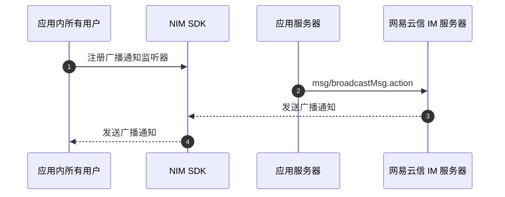

<!--keywords: 广播消息、所有用户、消息收发 -->

本文介绍通过网易云信即时通讯 IM SDK（以下简称 NIM SDK）接收广播通知的技术原理、实现流程。

## 支持平台

本文内容适用的开发平台或框架如下表所示，涉及的接口请参考下文 [相关接口](#相关接口) 章节：

安卓 | iOS | macOS/Windows | Web/uni-app/小程序 | Node.js/Electron | 鸿蒙 | Flutter
:----: | :----: | :----: | :----: | :----: | :----: | :----:
✔️️️ | ✔️️️ | ✔️️️ | ✔️️️ | ✔️️️ | ✔️️ | ✔️️

## 技术原理

广播通知由网易云信 IM 服务端 API [发送广播消息](https://doc.yunxin.163.com/messaging2/server-apis/zMzMzUxODQ?platform=server) 发起，客户端 SDK 接收到广播通知后通知应用层，并对应用内所有用户发送一条广播通知。



<!--  -->

## 前提条件

根据本文操作前，请确保您已经实现了以下设置：

- 前往 [网易云信控制台](https://app.yunxin.163.com/)，为应用开通即时通讯产品，并开通 **全局功能 > 全员广播** 功能。
- [登录 IM](https://doc.yunxin.163.com/messaging2/guide/Dk1MTY4MzA?platform=client)。否则，未登录 IM 的用户接收不到广播消息。

## 使用限制

- NIM SDK 不支持发送广播通知，仅支持通过服务端 API 发送，且一个应用一分钟最多发起 10 次，一天最多发起 1000000 次，超出频控会返回 416 错误码。如需修改服务端频控请至 [网易云信控制台](https://app.yunxin.163.com/) IM 即时通讯下的 **服务端频控 > 发送广播消息** 进行编辑修改。
- 广播通知不支持本地存储、第三方推送、漫游和生成会话。
- 最多保留最近 10000 条离线广播通知。

## 实现流程

1. 通知接收方监听广播通知接收回调。

    注册系统通知监听器的广播通知接收事件 `onReceiveBroadcastNotifications`。

    :::::: div linked-codes
    ::: code 安卓
    若自定义的系统通知需要作用于全局，不依赖某个特定的 Activity，那么需要提前在 Application 的 `onCreate` 中调用该监听接口。
    ```Java
    V2NIMNotificationService v2NotificationService = NIMClient.getService(V2NIMNotificationService.class);

    V2NIMNotificationListener notificationListener = new V2NIMNotificationListener() {
        @Override
        // 广播通知接收回调
        public void onReceiveBroadcastNotifications(List<V2NIMBroadcastNotification> broadcastNotifications) {
        // your code
        }
    };

    v2NotificationService.addNotificationListener(notificationListener);
    ```
    :::
    ::: code iOS
    ```Objective-C
    // listener 实现 V2NIMNotificationListener 协议
    [[[NIMSDK sharedSDK] v2NotificationService] addNoticationListener:listener]
    ```
    :::
    ::: code macOS/Windows
    ```C++
    V2NIMNotificationListener notificationListener;
    notificationListener.onReceiveBroadcastNotifications = [=](nstd::vector<V2NIMBroadcastNotification> broadcastNotifications) {
        // process broadcast notifications
    };
    v2::V2NIMClient::get().getNotificationService().addNotificationListener(notificationListener);
    ```
    :::
    ::: code Web/uni-app/小程序
    ```TypeScript
    nim.V2NIMNotificationService.on("onReceiveBroadcastNotifications", function (broadcastNotification: V2NIMBroadcastNotification[]) {})
    ```
    :::
    ::: code Node.js/Electron
    ```TypeScript
    v2.notificationService.on("receiveBroadcastNotifications", function (broadcastNotification: V2NIMBroadcastNotification[]) {})
    ```
    :::
    ::: code 鸿蒙
    ```TypeScript
    nim.notificationService.on("onReceiveBroadcastNotifications", function (broadcastNotification: V2NIMBroadcastNotification[]) {})
    ```
    :::
    ::: code Flutter
    ```Dart
    subsriptions.add(
        NimCore.instance.notificationService.onReceiveBroadcastNotifications.listen((notify){
        //do something
        })
    );
    ```
    :::
    ::::::

2. 通知发送方调用 [新版服务端 API](https://doc.yunxin.163.com/messaging2/server-apis/zMzMzUxODQ?platform=server) 发送一条广播通知。

3. SDK 触发 `onReceiveBroadcastNotifications` 回调事件，通知接收方接收广播通知。

## 相关接口

:::::: div custom-tabs
::: tab 安卓/iOS/macOS/Windows
API | 说明
--- | ---
[`addNoticationListener`](https://doc.yunxin.163.com/messaging2/client-apis/zk5MTUxMzA?platform=client#addNoticationListener) | 注册系统通知相关监听器
[`removeNotificationListener`](https://doc.yunxin.163.com/messaging2/client-apis/zk5MTUxMzA?platform=client#removeNotificationListener) | 取消注册系统通知相关监听器
:::
::: tab Web/uni-app/小程序/Node.js/Electron/鸿蒙
API | 说明
--- | ---
[`on("EventName")`](https://doc.yunxin.163.com/messaging2/client-apis/zk5MTUxMzA?platform=client#on) | 注册消息相关监听器
[`off("EventName")`](https://doc.yunxin.163.com/messaging2/client-apis/zk5MTUxMzA?platform=client#off) | 取消注册消息相关监听器
:::
::: tab Flutter
API | 说明
--- | ---
[`listen`](https://doc.yunxin.163.com/messaging2/client-apis/DQ5OTgxNjE?platform=client#listen) | 注册消息相关监听器
[`cancel`](https://doc.yunxin.163.com/messaging2/client-apis/DQ5OTgxNjE?platform=client#cancel) | 取消注册消息相关监听器
:::
::::::