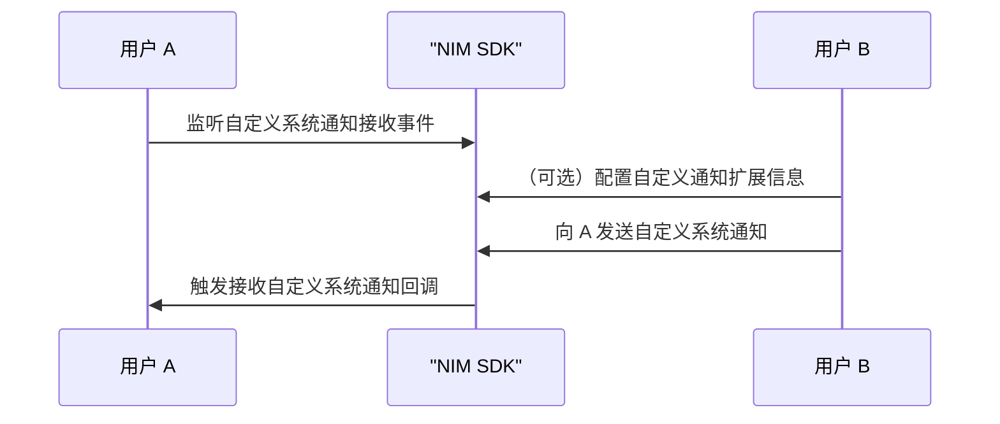

<!--keywords: 自定义系统通知,构造,发送,接收,推送-->

本文介绍通过网易云信即时通讯 IM SDK（以下简称 NIM SDK） 实现自定义系统通知的技术原理、实现流程。

## 支持平台

本文内容适用的开发平台或框架如下表所示，涉及的接口请参考下文 [相关接口](#相关接口) 章节：

安卓 | iOS | macOS/Windows | Web/uni-app/小程序 | Node.js/Electron | 鸿蒙 | Flutter
:----: | :----: | :----: | :----: | :----: | :----: | :----:
✔️️️ | ✔️️️ | ✔️️️ | ✔️️️ | ✔️️️ | ✔️️ | ✔️️

## 技术原理

自定义系统通知仅适用于单聊和群聊场景，由开发者根据其具体业务场景自行定义并下发，SDK 仅负责透传，不负责解析和存储。

发送自定义通知不支持重试机制，您需要自行实现重试。若 2 分钟内未收到服务器的 ACK，SDK 则上报发送失败。

## 前提条件

根据本文操作前，请确保您已经初始化 SDK。

## <span id="实现流程">实现流程</span>



1. 通知接收方监听自定义系统通知接收回调。

    注册系统通知监听器的自定义通知接收事件 `onReceiveCustomNotifications`。

    ::::: div linked-codes
    ::: code 安卓

    若自定义的系统通知需要作用于全局，不依赖某个特定的 Activity，那么需要提前在 Application 的 `onCreate` 中调用该监听接口。

    ```Java
    V2NIMNotificationService v2NotificationService = NIMClient.getService(V2NIMNotificationService.class);

    V2NIMNotificationListener notificationListener = new V2NIMNotificationListener() {
        @Override
        // 自定义通知接收回调
        public void onReceiveCustomNotifications(List<V2NIMCustomNotification> customNotifications) {
        // your code
        }
    };

    v2NotificationService.addNotificationListener(notificationListener);
    ```
    :::
    ::: code iOS
    ```Objective-C
    // listener 实现 V2NIMNotificationListener 协议
    [[[NIMSDK sharedSDK] v2NotificationService] addNoticationListener:listener]
    ```
    :::
    ::: code macOS/Windows
    ```C++
    V2NIMNotificationListener listener;
    // 自定义通知接收回调
    listener.onReceiveCustomNotifications = [](nstd::vector<V2NIMCustomNotification> customNotifications) {
        // handle custom notifications
    };
    notificationService.addNotificationListener(listener);
    ```
    :::
    ::: code Web/uni-app/小程序
    ```TypeScript
    // 自定义通知接收回调
    nim.V2NIMNotificationService.on("onReceiveCustomNotifications", function (customNotification: V2NIMCustomNotification[]) {})
    ```
    :::
    ::: code Node.js/Electron
    ```TypeScript
    v2.notificationService.on("receiveCustomNotifications", function (customNotification: V2NIMCustomNotification[]) {})
    ```
    :::
    ::: code 鸿蒙
    ```TypeScript
    // 自定义通知接收回调
    nim.notificationService.on("onReceiveCustomNotifications", function (customNotification: V2NIMCustomNotification[]) {})
    ```
    :::
    ::: code Flutter
    ```Dart
    subsriptions.add(
        NimCore.instance.notificationService.onReceiveCustomNotifications.listen((notify){
        //do something
        })
    );
    ```
    :::
    ::::::

2. （可选）通知发送方配置自定义系统通知扩展信息。

3. 通知发送方调用 `sendCustomNotification` 方法发送自定义系统通知。

    指定具体会话 ID，构建自定义通知的具体内容。为了可扩展性，必须采用 JSON 格式。

    ::: note notice
    一秒内默认最多调用该接口 100 次。如需上调上限，请 [提交工单](https://app.yunxin.163.com/global/service/ticket/create) 联系网易云信技术支持工程师。
    :::

    :::::: div linked-codes
    ::: code 安卓
    ```Java
    V2NIMNotificationService v2NotificationService = NIMClient.getService(V2NIMNotificationService.class);

    V2NIMNotificationAntispamConfig antispamConfig = V2NIMNotificationAntispamConfig.V2NIMNotificationAntispamConfigBuilder.builder()
    // .withAntispamCustomNotification()
    // .withAntispamEnabled()
    .build();

    V2NIMNotificationConfig config = V2NIMNotificationConfig.V2NIMNotificationConfigBuilder.builder()
    // .withOfflineEnabled()
    // .withUnreadEnabled()
    .build();

    V2NIMNotificationPushConfig pushConfig = V2NIMNotificationPushConfig.V2NIMNotificationPushConfigBuilder.builder()
    // .withForcePush()
    // .withForcePushAccountIds()
    // .withForcePushContent()
    // .withPushContent()
    // .withPushEnabled()
    // .withPushNickEnabled()
    // .withPushPayload()
    .build();

    V2NIMNotificationRouteConfig routeConfig = V2NIMNotificationRouteConfig.V2NIMNotificationRouteConfigBuilder.builder()
    // .withRouteEnabled()
    // .withRouteEnvironment()
    .build();

    V2NIMSendCustomNotificationParams params = V2NIMSendCustomNotificationParams.V2NIMSendCustomNotificationParamsBuilder.builder()
    // .withAntispamConfig(antispamConfig)
    // .withNotificationConfig(config)
    // .withPushConfig(pushConfig)
    // .withRouteConfig(routeConfig)
    .build();
    v2NotificationService.sendCustomNotification("x|x|x", "xxx", params,
    new V2NIMSuccessCallback<Void>() {
        @Override
        public void onSuccess(Void unused) {
        // success
        }
    },
    new V2NIMFailureCallback() {
        @Override
        public void onFailure(V2NIMError error) {
        // failed, handle error
        }
    });
    ```
    :::
    ::: code iOS
    ```Objective-C
    V2NIMSendCustomNotificationParams *notifyParams = [[V2NIMSendCustomNotificationParams alloc] init];

    [[[NIMSDK sharedSDK] v2NotificationService] sendCustomNotification:@"conversationId"
                                                            content:@"custom notification"
                                                                params:notifyParams
                                                            success:^{
        // success
    }
                                                            failure:^(V2NIMError * _Nonnull error) {
        // failed, handle error
    }];
    ```
    :::
    ::: code macOS/Windows
    ```C++
    auto conversationId = V2NIMConversationIdUtil::p2pConversationId("target_account_id");
    V2NIMSendCustomNotificationParams params;
    notificationService.sendCustomNotification(
    conversationId,
    "hello world",
    params,
    []() {
        // send notification succeeded
    },
    [](V2NIMError error) {
        // send notification failed
    });
    ```
    :::
    ::: code Web/uni-app/小程序
    ```TypeScript
    await nim.V2NIMNotificationService.sendCustomNotification(
    "me|1|another",
    "content",
    {
        "notificationConfig": {},
        "pushConfig": {},
        "antispamConfig": {},
        "routeConfig": {}
    }
    )
    ```
    :::
    ::: code Node.js/Electron
    ```TypeScript
    await v2.notificationService.sendCustomNotification(
    "me|1|another",
    "content",
    {
        "notificationConfig": {},
        "pushConfig": {},
        "antispamConfig": {},
        "routeConfig": {}
    }
    )
    ```
    :::
    ::: code 鸿蒙
    ```TypeScript
    await nim.notificationService.sendCustomNotification(
    "me|1|another",
    "content",
    {
        "notificationConfig": {},
        "pushConfig": {},
        "antispamConfig": {},
        "routeConfig": {}
    }
    )
    ```
    :::
    ::: code Flutter
    ```Dart
    await NimCore.instance.notificationService.sendCustomNotification(conversationId, content, params);
    ```
    :::
    ::::::

4. SDK 触发 `onReceiveCustomNotifications` 回调事件，通知接收方接收自定义系统通知。

## 相关接口

:::::: div custom-tabs
::: tab 安卓/iOS/macOS/Windows
API | 说明
--- | ---
[`addNoticationListener`](https://doc.yunxin.163.com/messaging2/client-apis/zk5MTUxMzA?platform=client#addNoticationListener) | 注册系统通知相关监听器
[`removeNotificationListener`](https://doc.yunxin.163.com/messaging2/client-apis/zk5MTUxMzA?platform=client#removeNotificationListener) | 取消注册系统通知相关监听器
[`sendCustomNotification`](https://doc.yunxin.163.com/messaging2/client-apis/zk5MTUxMzA?platform=client#sendCustomNotification) | 发送自定义系统通知
:::
::: tab Web/uni-app/小程序/Node.js/Electron/鸿蒙
API | 说明
--- | ---
[`on("EventName")`](https://doc.yunxin.163.com/messaging2/client-apis/zk5MTUxMzA?platform=client#on) | 注册消息相关监听器
[`off("EventName")`](https://doc.yunxin.163.com/messaging2/client-apis/zk5MTUxMzA?platform=client#off) | 取消注册消息相关监听器
[`sendCustomNotification`](https://doc.yunxin.163.com/messaging2/client-apis/zk5MTUxMzA?platform=client#sendCustomNotification) | 发送自定义系统通知
:::
::: tab Flutter
API | 说明
--- | ---
[`listen`](https://doc.yunxin.163.com/messaging2/client-apis/DQ5OTgxNjE?platform=client#listen) | 注册消息相关监听器
[`cancel`](https://doc.yunxin.163.com/messaging2/client-apis/DQ5OTgxNjE?platform=client#cancel) | 取消注册消息相关监听器
[`sendCustomNotification`](https://doc.yunxin.163.com/messaging2/client-apis/DQ5OTgxNjE?platform=client#sendCustomNotification) | 发送消息
:::
::::::