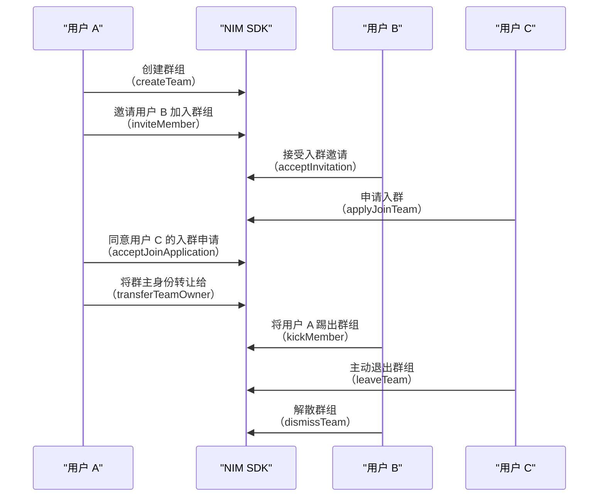
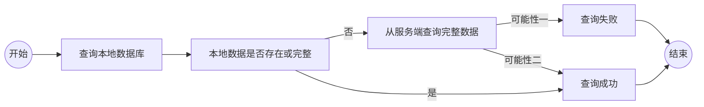

<!-- keywords: IM 群组,高级群,群组管理,创建,解散,转让,更新,退出 -->

网易云信 IM 提供了高级群和超大群形式的群组功能，支持用户创建、加入、退出、转让、修改、查询、解散群组，拥有完善的管理功能。

本文介绍如何通过 网易云信即时通讯 SDK（NetEase IM SDK，简称 NIM SDK）实现和管理群组。

## 支持平台

本文内容适用的开发平台或框架如下表所示，涉及的接口请参考下文 [相关接口](#相关接口) 章节：

安卓 | iOS | macOS/Windows | Web/uni-app/小程序 | Node.js/Electron | 鸿蒙 | Flutter
:----: | :----: | :----: | :----: | :----: | :----: | :----:
✔️️️️️ | ✔️️️️️ | ✔️️️️️ | ✔️️️️️ | ✔️️️️️ | ✔️️️️️ | ✔️️️️️

## 群组相关事件监听

在进行群组操作前，您可以注册监听群相关事件。监听后，在进行群组管理相关操作时，会收到对应的通知。相关回调：

- **`onSyncStarted`**：群组数据同步开始回调。
- **`onSyncFinished`**：群组数据同步结束回调。请在收到该回调之后进行群组相关操作，否则可能导致数据不完整。
- **`onSyncFailed`**：群组数据同步失败回调。如果在收到该回调之后进行群组相关操作，群组数据可能不完整。相关错误恢复后，会逐步按需重建数据。
- **`onTeamCreated`**：群组成功创建回调，返回群组信息。当本地端或多端同步创建群组成功时会触发该回调。
- **`onTeamDismissed`**：群组解散回调，返回群组信息。当本地端或多端同步解散群组成功时会触发该回调。群组内所有成员均会收到该回调。
- **`onTeamJoined`**：加入群组回调，返回群组信息。当本地端或多端同步加入群组时会触发该回调。
- **`onTeamLeft`**：离开群组回调，返回群组信息。当本地端或多端主动离开群组或被踢出群组时会触发该回调。
- **`onTeamInfoUpdated`**：群组信息更新回调，返回群组信息。群组内所有成员均会收到该回调。
- **`onTeamMemberJoined`**：成员加入群组回调，返回群成员信息。群组内所有成员均会收到该回调。
- **`onTeamMemberKicked`**：群成员被踢出群组回调，返回群成员列表。群组内所有成员均会收到该回调。
- **`onTeamMemberLeft`**：群成员离开群组回调，返回群成员列表。群组内所有成员均会收到该回调。
- **`onTeamMemberInfoUpdated`**：群成员信息变更回调，返回群成员列表。群组内所有成员均会收到该回调。
- **`onReceiveTeamJoinActionInfo`**：收到入群操作信息回调，返回入群操作信息。


:::::: div linked-codes
::: code 安卓
调用 [`addTeamListener`](https://doc.yunxin.163.com/messaging2/client-apis/TU0MTQ3MTg?platform=client#addTeamListener) 方法注册群组相关监听器，监听群组相关事件。
```Java
V2NIMTeamService v2TeamService = NIMClient.getService(V2NIMTeamService.class);
V2NIMTeamListener listener = new V2NIMTeamListener() {
    @Override
    public void onSyncStarted() {
        // 开始同步群组信息
    }

    @Override
    public void onSyncFinished() {
        // 同步群组信息完成
    }

    @Override
    public void onSyncFailed(V2NIMError error) {
        // 同步群组信息失败
    }

    @Override
    public void onTeamCreated(V2NIMTeam team) {
        // 创建群组成功
    }

    @Override
    public void onTeamDismissed(V2NIMTeam team) {
        // 解散群组成功
    }

    @Override
    public void onTeamJoined(V2NIMTeam team) {
        // 加入群组成功
    }

    @Override
    public void onTeamLeft(V2NIMTeam team, boolean isKicked) {
        // 离开群组成功
    }

    @Override
    public void onTeamInfoUpdated(V2NIMTeam team) {
        // 群组信息更新回调
    }

    @Override
    public void onTeamMemberJoined(List<V2NIMTeamMember> teamMembers) {
        // 群组成员加入回调
    }

    @Override
    public void onTeamMemberKicked(String operatorAccountId, List<V2NIMTeamMember> teamMembers) {
        // 群组成员被踢回调
    }

    @Override
    public void onTeamMemberLeft(List<V2NIMTeamMember> teamMembers) {
        // 群组成员退出群组回调
    }

    @Override
    public void onTeamMemberInfoUpdated(List<V2NIMTeamMember> teamMembers) {
        // 群组成员信息更新回调
    }

    @Override
    public void onReceiveTeamJoinActionInfo(V2NIMTeamJoinActionInfo joinActionInfo) {
        // 入群操作回调
    }
};
v2TeamService.addTeamListener(listener);
```
:::
::: code iOS
调用 [`addTeamListener`](https://doc.yunxin.163.com/messaging2/client-apis/TU0MTQ3MTg?platform=client#addTeamListener) 方法注册群组相关监听器，监听群组相关事件。
```Objective-C
[[[NIMSDK sharedSDK] v2TeamService] addTeamListener:self];

// 同步开始
- (void)onSyncStarted{};

// 同步完成
- (void)onSyncFinished{};

// 同步失败
- (void)onSyncFailed:(V2NIMError *)error{};

// 群组创建回调
- (void)onTeamCreated:(V2NIMTeam *)team{};

// 群组解散回调
- (void)onTeamDismissed:(V2NIMTeam *)team{};

// 加入群组回调
- (void)onTeamJoined:(V2NIMTeam *)team{};

// 离开群组回调
- (void)onTeamLeft:(V2NIMTeam *)team
          isKicked:(BOOL)isKicked{};

// 群组信息更新回调
- (void)onTeamInfoUpdated:(V2NIMTeam *)team{};

// 群组成员加入回调
- (void)onTeamMemberJoined:(NSArray<V2NIMTeamMember *> *)teamMembers{};

// 群组成员被踢回调
- (void)onTeamMemberKicked:(NSString *)operatorAccountId
               teamMembers:(NSArray<V2NIMTeamMember *> *)teamMembers{};

// 群组成员退出回调
- (void)onTeamMemberLeft:(NSArray<V2NIMTeamMember *> *)teamMembers{};

// 群组成员信息变更回调
- (void)onTeamMemberInfoUpdated:(NSArray<V2NIMTeamMember *> *)teamMembers{};

// 收到入群操作信息回调
- (void)onReceiveTeamJoinActionInfo:(V2NIMTeamJoinActionInfo *)joinActionInfo{};
```
:::
::: code macOS/Windows
调用 [`addTeamListener`](https://doc.yunxin.163.com/messaging2/client-apis/TU0MTQ3MTg?platform=client#addTeamListener) 方法注册群组相关监听器，监听群组相关事件。
```C++
V2NIMTeamListener listener;
listener.onSyncStarted = []() {
    // team sync started
};
listener.onSyncFinished = []() {
    // team sync finished
};
listener.onSyncFailed = [](V2NIMError error) {
    // team sync failed, handle error
};
listener.onTeamCreated = [](V2NIMTeam team) {
    // team created
};
listener.onTeamDismissed = [](nstd::vector<V2NIMTeam> teams) {
    // team dismissed
};
listener.onTeamJoined = [](V2NIMTeam team) {
    // team joined
};
listener.onTeamLeft = [](V2NIMTeam team, bool isKicked) {
    // team left
};
listener.onTeamInfoUpdated = [](V2NIMTeam team) {
    // team info updated
};
listener.onTeamMemberJoined = [](nstd::vector<V2NIMTeamMember> teamMembers) {
    // team member joined
};
listener.onTeamMemberKicked = [](nstd::string operateAccountId, nstd::vector<V2NIMTeamMember> teamMembers) {
    team member kicked
};
listener.onTeamMemberLeft = [](nstd::vector<V2NIMTeamMember> teamMembers) {
    // team member left
};
listener.onTeamMemberInfoUpdated = [](nstd::vector<V2NIMTeamMember> teamMembers) {
    // team member info updated
};
listener.onReceiveTeamJoinActionInfo = [](V2NIMTeamJoinActionInfo joinActionInfo) {
    // receive team join action info
};
teamService.addTeamListener(listener);
```
:::
::: code Web/uni-app/小程序
调用 [`on("EventName")`](https://doc.yunxin.163.com/messaging2/client-apis/TU0MTQ3MTg?platform=client#on("EventName")) 方法注册群组相关监听器，监听群组相关事件。
```TypeScript
nim.V2NIMTeamService.on('onSyncStarted', () => { console.log("recv onSyncStarted") })
nim.V2NIMTeamService.on('onSyncFinished', () => { console.log("recv onSyncFinished") })
nim.V2NIMTeamService.on('onSyncFailed', (error) => { console.log("recv onSyncFailed", error) })
nim.V2NIMTeamService.on('onTeamCreated', (team) => { console.log("recv onTeamCreated", team) })
nim.V2NIMTeamService.on('onTeamDismissed', (team) => { console.log("recv onTeamDismissed", team) })
nim.V2NIMTeamService.on('onTeamJoined', (team) => { console.log("recv onTeamJoined", team) })
nim.V2NIMTeamService.on('onTeamLeft', (team, isKicked) => { console.log("recv onTeamLeft", team, isKicked) })
nim.V2NIMTeamService.on('onTeamInfoUpdated', (team) => { console.log("recv onTeamInfoUpdated", team) })
nim.V2NIMTeamService.on('onTeamMemberJoined', (teamMembers) => { console.log("recv onTeamMemberJoined", teamMembers) })
nim.V2NIMTeamService.on('onTeamMemberKicked', (operateAccountId, teamMembers) => { console.log("recv onTeamMemberKicked", operateAccountId, teamMembers) })
nim.V2NIMTeamService.on('onTeamMemberLeft', (teamMembers) => { console.log("recv onTeamMemberLeft", teamMembers) })
nim.V2NIMTeamService.on('onTeamMemberInfoUpdated', (teamMembers) => { console.log("recv onTeamMemberInfoUpdated", teamMembers) })
nim.V2NIMTeamService.on('onReceiveTeamJoinActionInfo', (joinActionInfo) => { console.log("recv onReceiveTeamJoinActionInfo", joinActionInfo) })
```
:::
::: code Node.js/Electron
调用 [`on("EventName")`](https://doc.yunxin.163.com/messaging2/client-apis/TU0MTQ3MTg?platform=client#on("EventName")) 方法注册群组相关监听器，监听群组相关事件。
```TypeScript
v2.teamService.on('syncStarted', () => { console.log("recv onSyncStarted") })
v2.teamService.on('syncFinished', () => { console.log("recv onSyncFinished") })
v2.teamService.on('syncFailed', (error) => { console.log("recv onSyncFailed", error) })
v2.teamService.on('teamCreated', (team) => { console.log("recv onTeamCreated", team) })
v2.teamService.on('teamDismissed', (team) => { console.log("recv onTeamDismissed", team) })
v2.teamService.on('teamJoined', (team) => { console.log("recv onTeamJoined", team) })
v2.teamService.on('teamLeft', (team, isKicked) => { console.log("recv onTeamLeft", team, isKicked) })
v2.teamService.on('teamInfoUpdated', (team) => { console.log("recv onTeamInfoUpdated", team) })
v2.teamService.on('teamMemberJoined', (teamMembers) => { console.log("recv onTeamMemberJoined", teamMembers) })
v2.teamService.on('teamMemberKicked', (operateAccountId, teamMembers) => { console.log("recv onTeamMemberKicked", operateAccountId, teamMembers) })
v2.teamService.on('teamMemberLeft', (teamMembers) => { console.log("recv onTeamMemberLeft", teamMembers) })
v2.teamService.on('teamMemberInfoUpdated', (teamMembers) => { console.log("recv onTeamMemberInfoUpdated", teamMembers) })
v2.teamService.on('receiveTeamJoinActionInfo', (joinActionInfo) => { console.log("recv onReceiveTeamJoinActionInfo", joinActionInfo) })
```
:::
::: code 鸿蒙
调用 [`on("EventName")`](https://doc.yunxin.163.com/messaging2/client-apis/TU0MTQ3MTg?platform=client#on("EventName")) 方法注册群组相关监听器，监听群组相关事件。
```TypeScript
nim.teamService.on('onSyncStarted', () => { console.log("recv onSyncStarted") })
nim.teamService.on('onSyncFinished', () => { console.log("recv onSyncFinished") })
nim.teamService.on('onSyncFailed', (error) => { console.log("recv onSyncFailed", error) })
nim.teamService.on('onTeamCreated', (team) => { console.log("recv onTeamCreated", team) })
nim.teamService.on('onTeamDismissed', (team) => { console.log("recv onTeamDismissed", team) })
nim.teamService.on('onTeamJoined', (team) => { console.log("recv onTeamJoined", team) })
nim.teamService.on('onTeamLeft', (team, isKicked) => { console.log("recv onTeamLeft", team, isKicked) })
nim.teamService.on('onTeamInfoUpdated', (team) => { console.log("recv onTeamInfoUpdated", team) })
nim.teamService.on('onTeamMemberJoined', (teamMembers) => { console.log("recv onTeamMemberJoined", teamMembers) })
nim.teamService.on('onTeamMemberKicked', (operateAccountId, teamMembers) => { console.log("recv onTeamMemberKicked", operateAccountId, teamMembers) })
nim.teamService.on('onTeamMemberLeft', (teamMembers) => { console.log("recv onTeamMemberLeft", teamMembers) })
nim.teamService.on('onTeamMemberInfoUpdated', (teamMembers) => { console.log("recv onTeamMemberInfoUpdated", teamMembers) })
nim.teamService.on('onReceiveTeamJoinActionInfo', (joinActionInfo) => { console.log("recv onReceiveTeamJoinActionInfo", joinActionInfo) })
```
:::
::: code Flutter
调用 [`listen`](https://doc.yunxin.163.com/messaging2/client-apis/DE1MjU0NzY?platform=client#listen) 方法注册群组相关监听器，监听群组相关事件。

```Dart
subsriptions.add(NimCore.instance.teamService.onSyncStarted.listen((e) {
      //do something
    }));
    subsriptions.add(NimCore.instance.teamService.onSyncFinished.listen((e) {
      //do something
    }));
    subsriptions.add(NimCore.instance.teamService.onSyncFailed.listen((e) {
      //do something
    }));
    subsriptions.add(NimCore.instance.teamService.onTeamCreated.listen((e) {
      //do something
    }));
    subsriptions.add(NimCore.instance.teamService.onTeamDismissed.listen((e) {
      //do something
    }));
    subsriptions.add(NimCore.instance.teamService.onTeamJoined.listen((e) {
      //do something
    }));
    subsriptions.add(NimCore.instance.teamService.onTeamLeft.listen((e) {
      //do something
    }));
    subsriptions.add(NimCore.instance.teamService.onTeamInfoUpdated.listen((e) {
      //do something
    }));
    subsriptions.add(NimCore.instance.teamService.onTeamMemberJoined.listen((e) {
      //do something
    }));
    subsriptions.add(NimCore.instance.teamService.onTeamMemberKicked.listen((e) {
      //do something
    }));
    subsriptions.add(NimCore.instance.teamService.onTeamMemberLeft.listen((e) {
      //do something
    }));
    subsriptions.add(NimCore.instance.teamService.onTeamMemberInfoUpdated.listen((e) {
      //do something
    }));
    subsriptions.add(NimCore.instance.teamService.onReceiveTeamJoinActionInfo.listen((e) {
      //do something
    }));
```
:::
::::::

:::note note
由于获取群组信息和群成员信息需要跨进程异步调用，开发者最好能在第三方 App 中做好群组和群成员信息缓存，查询群组和群成员信息时都从本地缓存中访问。在群组或者群成员信息有变化时，SDK 会告诉注册的观察者，此时，第三方 App 可更新缓存，并刷新界面。
:::

## 实现流程

本节通过群主、管理员、普通成员之间的交互为例，介绍群组管理的实现流程。



## 创建群组

通过调用 `createTeam` 方法创建一个群组，创建者即为该群群主。

示例代码如下：

:::::: div linked-codes
::: code 安卓
```Java
V2NIMTeamService v2TeamService = NIMClient.getService(V2NIMTeamService.class);
// 创建群组参数
V2NIMCreateTeamParams createTeamParams = new V2NIMCreateTeamParams();
createTeamParams.setName("test");
createTeamParams.setTeamType(V2NIMTeamType.V2NIM_TEAM_TYPE_NORMAL);
createTeamParams.setMemberLimit(100);
createTeamParams.setIntro("test");
createTeamParams.setAnnouncement("test");
createTeamParams.setAvatar("http://test.png");
createTeamParams.setServerExtension("test");
createTeamParams.setAgreeMode(V2NIMTeamAgreeMode.V2NIM_TEAM_AGREE_MODE_AUTH);
createTeamParams.setJoinMode(V2NIMTeamJoinMode.V2NIM_TEAM_JOIN_MODE_INVITE);
createTeamParams.setInviteMode(V2NIMTeamInviteMode.V2NIM_TEAM_INVITE_MODE_MANAGER);
createTeamParams.setUpdateInfoMode(V2NIMTeamUpdateInfoMode.V2NIM_TEAM_UPDATE_INFO_MODE_MANAGER);
createTeamParams.setUpdateExtensionMode(V2NIMTeamUpdateExtensionMode.V2NIM_TEAM_UPDATE_EXTENSION_MODE_MANAGER);
// 创建群组时，同时被邀请加入群的成员列表
List<String> inviteeAccountIds = new ArrayList<>();
inviteeAccountIds.add("test1");
inviteeAccountIds.add("test2");
String postscript = "test";
v2TeamService.createTeam(createTeamParams, inviteeAccountIds, postscript, result -> {
    // 创建群组成功
}, error -> {
    // 创建群组失败
});
```
:::
::: code iOS
```Objective-C
V2NIMCreateTeamParams *teamParams = [V2NIMCreateTeamParams new];
    teamParams.name = @"test";
    teamParams.teamType = V2NIM_TEAM_TYPE_NORMAL;
    teamParams.memberLimit = 100;
    teamParams.intro = @"test";
    teamParams.announcement = @"test";
    teamParams.avatar = @"http://test.png";
    teamParams.agreeMode = V2NIM_TEAM_AGREE_MODE_AUTH;
    teamParams.joinMode = V2NIM_TEAM_JOIN_MODE_FREE;
    teamParams.inviteMode = V2NIM_TEAM_INVITE_MODE_MANAGER;
    teamParams.updateInfoMode = V2NIM_TEAM_UPDATE_INFO_MODE_MANAGER;
    teamParams.updateExtensionMode = V2NIM_TEAM_UPDATE_EXTENSION_MODE_MANAGER;
    [[[NIMSDK sharedSDK] v2TeamService] createTeam:teamParams inviteeAccountIds:@[@"test1",@"test2"] postscript:@"test" success:^(V2NIMCreateTeamResult * _Nonnull result) {
            // 群组创建成功
        } failure:^(V2NIMError * _Nonnull error) {
            // 群组创建失败
        }];
```
:::
::: code macOS/Windows
```C++
V2NIMCreateTeamParams createTeamParams;
createTeamParams.name = "teamName";
nstd::vector<nstd::string> inviteeAccountIds;
inviteeAccountIds.push_back("account1");
teamService.createTeam(
    createTeamParams,
    inviteeAccountIds,
    "postscript",
    [](V2NIMCreateTeamResult result) {
        // do something
    },
    [](V2NIMError error) {
        // get message list failed, handle error
    });
```
:::
::: code Web/uni-app/小程序
```TypeScript
await nim.V2NIMTeamService.createTeam(
  {
    "name": "群名",
    "teamType": 1,
    "memberLimit": 200,
  }
)
```
:::
::: code Node.js/Electron
```TypeScript
const result = await v2.teamService.createTeam({
    name: 'team1',
    teamType: 0
}, inviteeAccountIds, postscript);
```
:::
::: code 鸿蒙
```TypeScript
try {
    const params: V2NIMCreateTeamParams = {
    name: this.name,
    teamType: this.teamType,
    memberLimit: this.memberLimit,
    intro: this.intro,
    announcement: this.announcement,
    avatar: this.avatar,
    serverExtension: this.serverExtension,
    joinMode: this.joinMode,
    agreeMode: this.agreeMode,
    inviteMode: this.inviteMode,
    updateInfoMode: this.updateInfoMode,
    updateExtensionMode: this.updateExtensionMode,
    chatBannedMode: this.chatBannedMode
  }

  const result:V2NIMCreateTeamResult = await nim.teamService.createTeam(params, [], '')
  // success
} catch (error) {
  // fail
}
```
:::
::: code Flutter
```Dart
await NimCore.instance.teamService.createTeam(createTeamParams, inviteeAccountIds, postscript);
```
:::
::::::

## 加入群组

加入群组可以通过以下两种方式：
- 接受邀请入群。
- 主动申请入群。

### 邀请入群

通过调用 `inviteMemberEx` 方法邀请用户进入群组。
  - 若群组的被邀请方同意模式（`agreeMode`）为 0，那么需要被邀请用户同意才能加入群组，被邀请方会收到邀请入群回调 `onReceiveTeamJoinActionInfo`。
  - 若群组的被邀请方同意模式（`agreeMode`） 为 1，那么无需验证，被邀请用户可直接加入群组，此时被邀请方会收到 `onTeamJoined` 回调，其他群成员会收到 `onTeamMemberJoined` 回调。

本地端或多端同步邀请成功后，群组内其他成员收到一条通知类消息，类型为 **邀请成员入群**。

::: note note
- 如果被邀请用户中存在拥有群组数量已达上限的用户，则会返回邀请失败用户的账号列表。
- 邀请入群的权限可以通过 `inviteMode` 来定义，设为 `MANAGER`，那么仅限群主和管理员有邀请入群权限。设为 `ALL`，那么群组内所有成员均有邀请入群权限。
:::

**示例代码**

:::::: div linked-codes
::: code 安卓
```Java
String teamId = "123";
V2NIMTeamType teamType = V2NIMTeamType.V2NIM_TEAM_TYPE_NORMAL;
List<String> inviteeAccountIds = Arrays.asList("aaa", "bbb");
String postscript = "postscript";
String serverExtension = "serverExtension";

V2NIMTeamInviteParams inviteParams = new V2NIMTeamInviteParams();
inviteParams.setInviteeAccountIds(inviteeAccountIds);
inviteParams.setPostscript(postscript);
inviteParams.setServerExtension(serverExtension);

// 调用接口
NIMClient.getService(V2NIMTeamService.class).inviteMemberEx(teamId, teamType, inviteParams,
   new V2NIMSuccessCallback<List<String>>() {
    @Override
    public void onSuccess(List<String> param) {
     System.out.println("Invite member success");
     if (!param.isEmpty()) {
      System.out.println("Failed to invite members: " + param);
     }
    }
   },
   new V2NIMFailureCallback() {
    @Override
    public void onFailure(V2NIMError error) {
     System.out.println("Invite member failed, code: " + error.getCode() + ", message: " + error.getMessage());
    }
   }
);
```
:::
::: code iOS
```Objective-C
NSString *teamId = @"123";
V2NIMTeamType teamType = V2NIM_TEAM_TYPE_NORMAL;
NSArray<NSString *> *inviteeAccountIds = @[@"aaa", @"bbb"];
NSString *postscript = @"postscript";
NSString *serverExtension = @"serverExtension";

V2NIMTeamInviteParams *inviteParams = [[V2NIMTeamInviteParams alloc] init];
[inviteParams setInviteeAccountIds:inviteeAccountIds];
[inviteParams setPostscript:postscript];
[inviteParams setServerExtension:serverExtension];

[[NIMSDK sharedSDK].v2TeamService inviteMemberEx:teamId teamType:teamType inviteeParams:inviteParams success:^(NSArray<NSString *> * _Nonnull failedList)
 {
    if (failedList.count > 0)
    {
        NSLog(@"InviteMemberEx partially success. Failed account ids: %@", failedList);
    } else
    {
       NSLog(@"InviteMemberEx success");
    }
} failure:^(V2NIMError * _Nonnull error)
 {
    NSLog(@"Invite member failed. error: %@", error);
}];
```
:::
::: code macOS/Windows
```C++
nstd::vector<nstd::string> inviteeAccountIds;
inviteeAccountIds.push_back("account1");
V2NIMTeamInviteParams inviteeParams;
inviteeParams.inviteeAccountIds = inviteeAccountIds;
inviteeParams.postscript = "postscript";
inviteeParams.serverExtension = "serverExtension";
teamService.inviteMemberEx(
    "teamId",
    V2NIM_TEAM_TYPE_NORMAL,
    inviteeParams,
    [](nstd::vector<nstd::string> failedList) {
        // invite member success
    },
    [](V2NIMError error) {
        // invite member failed, handle error
    });
```
:::
::: code Web/uni-app/小程序
```TypeScript
await nim.V2NIMTeamService.inviteMemberEx("123456", 1, { inviteeAccountIds: ["accountId1"] })
```
:::
::: code Node.js/Electron
```TypeScript
const accountIds = await v2.teamService.inviteMemberEx(teamId, teamType, inviteeParams)
```
:::
::: code 鸿蒙
```TypeScript
// input
const teamId: string = '123'
const teamType: V2NIMTeamType = V2NIMTeamType.V2NIM_TEAM_TYPE_NORMAL
const inviteeAccountIds: string[] = ['aaa', 'bbb']
const postscript: string | undefined = 'postscript'
const serverExtension: string | undefined = 'serverExtension'

// call interface
const res = await teamService.inviteMemberEx(teamId, teamType, {
  inviteeAccountIds,
  postscript,
  serverExtension
})
```
:::
::: code Flutter
```Dart
NimCore.instance.teamService.inviteMemberEx(teamId, NIMTeamType.typeNormal, inviteeParams).then((result) {

});
```
:::
::::::

<!--inviteMember
:::::: div linked-codes
::: code 安卓
```Java
V2NIMTeamService v2TeamService = NIMClient.getService(V2NIMTeamService.class);
String teamId = "123456";
V2NIMTeamType teamType = V2NIMTeamType.V2NIM_TEAM_TYPE_NORMAL;
List<String> invitorAccountIds = new ArrayList<>();
invitorAccountIds.add("test1");
invitorAccountIds.add("test2");
String postscript = "test";
v2TeamService.inviteMember(teamId,teamType, invitorAccountIds, postscript, result -> {
    // 邀请成员加入群组成功
}, error -> {
    // 邀请成员加入群组失败
});
```
:::
::: code iOS
```Objective-C
[[[NIMSDK sharedSDK] v2TeamService] inviteMember:@"teamId" teamType:V2NIM_TEAM_TYPE_NORMAL inviteeAccountIds:@[@"accountId1"] postscript:@"test" success:^(NSArray<NSString *> * _Nonnull failedList) {
        // 邀请成员加入群组成功
    } failure:^(V2NIMError * _Nonnull error) {
        // 邀请成员加入群组失败
    }];
```
:::
::: code macOS/Windows
```C++
nstd::vector<nstd::string> inviteeAccountIds;
inviteeAccountIds.push_back("account1");
teamService.inviteMember(
    "teamId",
    V2NIM_TEAM_TYPE_NORMAL,
    inviteeAccountIds,
    "postscript",
    [](nstd::vector<nstd::string> failedList) {
        // invite member success
    },
    [](V2NIMError error) {
        // invite member failed, handle error
    });
```
:::
::: code Web/uni-app/小程序
```TypeScript
await nim.V2NIMTeamService.inviteMember("123456", 1, ["accountId1"])
```
:::
::: code Node.js/Electron
```TypeScript
const accountIds = await v2.teamService.inviteMember("123456", 1, ["accountId1"])
```
:::
::: code 鸿蒙
```TypeScript
try {
  const teamId: string = "123456"
  const teamType: V2NIMTeamType = V2NIMTeamType.V2NIM_TEAM_TYPE_NORMAL
  const inviteeAccountIds: string[] = ["acc1", "acc2"]
  const postscript: string | undefined = "postscript"

  const res = await teamService.inviteMember(teamId, teamType, inviteeAccountIds, postscript)
  // success
}
catch (err) {
  // fail
}
```
:::
::: code Flutter
```Dart
await NimCore.instance.teamService.inviteMember(teamId, teamType, inviteeAccountIds, postscript);
```
:::
::::::
-->

**接受入群邀请**

收到邀请入群的通知消息后，可以调用 `acceptInvitation` 方法接受入群邀请。

本地端或多端同步接受入群邀请成功后：

- 本地端收到加入群组成功回调 `onTeamJoined`。
- 群组内其他成员收到一条通知类消息，类型为 **接收入群邀请**。收到其他用户加入群组回调 `onTeamMemberJoined`。

**示例代码**

:::::: div linked-codes
::: code 安卓
```Java
V2NIMTeamService v2TeamService = NIMClient.getService(V2NIMTeamService.class);
// 收到的邀请信息
V2NIMTeamJoinActionInfo invitationInfo = getInvitationInfo();
v2TeamService.acceptInvitation(invitationInfo, result -> {
    // 同意邀请入群成功
}, error -> {
    // 同意邀请入群失败
});
```
:::
::: code iOS
```Objective-C
[[[NIMSDK sharedSDK] v2TeamService] acceptInvitation:invitationInfo success:^(V2NIMTeam * _Nonnull team) {
    // 同意邀请入群成功
} failure:^(V2NIMError * _Nonnull error) {
    // 同意邀请入群失败
}];
```
:::
::: code macOS/Windows
```C++
V2NIMTeamJoinActionInfo invitationInfo;
// get invitationInfo from notification or query
// ...
teamService.acceptInvitation(
    invitationInfo,
    [](V2NIMTeam team) {
        // accept invitation success
    },
    [](V2NIMError error) {
        // accept invitation failed, handle error
    });
```
:::
::: code Web/uni-app/小程序
```TypeScript
await nim.V2NIMTeamService.acceptInvitation(
  {
    "teamId": "123456",
    "teamType": 1,
    "operatorAccountId": "accountId1",
    "actionType": 2
  }
)
```
:::
::: code Node.js/Electron
```TypeScript
const team = await v2.teamService.acceptInvitation(
  {
    "teamId": "123456",
    "teamType": 1,
    "operatorAccountId": "accountId1",
    "actionType": 2
  }
)
```
:::
::: code 鸿蒙
```TypeScript
try{
  const invitationInfo: V2NIMTeamJoinActionInfo = {
    actionType: V2NIMTeamJoinActionType.V2NIM_TEAM_JOIN_ACTION_TYPE_INVITATION,
    teamId: "123456",
    teamType: V2NIMTeamType.V2NIM_TEAM_TYPE_NORMAL,
    operatorAccountId: "account1",
  }

  const team: V2NIMTeam = await nim.teamService.acceptInvitation(invitationInfo)
  // success
}
catch (err) {
  // fail
}
```
:::
::: code Flutter
```Dart
await NimCore.instance.teamService.acceptInvitation(invitationInfo);
```
:::
::::::

**拒绝入群邀请**

收到邀请入群的通知消息后，可以调用 `rejectInvitation` 方法拒绝入群邀请。

本地端或多端拒绝入群邀请成功后，群主和群管理员收到 `onReceiveTeamJoinActionInfo` 回调。

**示例代码**

:::::: div linked-codes
::: code 安卓
```Java
V2NIMTeamService v2TeamService = NIMClient.getService(V2NIMTeamService.class);
// 收到的邀请信息
V2NIMTeamJoinActionInfo invitationInfo = getInvitationInfo();
String postscript = "test";
v2TeamService.rejectInvitation(invitationInfo, postscript, result -> {
    // 拒绝邀请入群成功
}, error -> {
    // 拒绝邀请入群失败
});
```
:::
::: code iOS
```Objective-C
[[[NIMSDK sharedSDK] v2TeamService] rejectInvitation:invitationInfo postscript:@"test" success:^{
    // 拒绝邀请入群成功
} failure:^(V2NIMError * _Nonnull error) {
    // 拒绝邀请入群失败
}];
```
:::
::: code macOS/Windows
```C++
V2NIMTeamJoinActionInfo invitationInfo;
// get invitationInfo from notification or query
// ...
teamService.rejectInvitation(
    invitationInfo,
    "postscript",
    []() {
        // reject invitation success
    },
    [](V2NIMError error) {
        // reject invitation failed, handle error
    });
```
:::
::: code Web/uni-app/小程序
```TypeScript
await nim.V2NIMTeamService.rejectInvitation(
  {
    "teamId": "123456",
    "teamType": 1,
    "operatorAccountId": "accountId1",
    "actionType": 2
  },
  "test postscript"
)
```
:::
::: code Node.js/Electron
```TypeScript
await v2.teamService.rejectInvitation(
  {
    "teamId": "123456",
    "teamType": 1,
    "operatorAccountId": "accountId1",
    "actionType": 2
  },
  "test postscript"
)
```
:::
::: code 鸿蒙
```TypeScript
try{
  const invitationInfo: V2NIMTeamJoinActionInfo = {
    actionType: V2NIMTeamJoinActionType.V2NIM_TEAM_JOIN_ACTION_TYPE_INVITATION,
    teamId: "123456",
    teamType: V2NIMTeamType.V2NIM_TEAM_TYPE_NORMAL,
    operatorAccountId: "account1",
  }

  await nim.teamService.rejectInvitation(invitationInfo)
  // success
}
catch (err) {
  // fail
}
```
:::
::: code Flutter
```Dart
await NimCore.instance.teamService.rejectInvitation(invitationInfo, postscript);
```
:::
::::::

### 主动申请入群

通过调用 [`applyJoinTeam`](https://doc.yunxin.163.com/messaging2/client-apis/TU0MTQ3MTg?platform=client#applyJoinTeam) 方法申请加入群组。
  - 若群组的加入模式 `joinMode` 为 `FREE`，那么无需验证，用户可直接加入群组。
  - 若群组的加入模式 `joinMode` 为 `APPLY`，那么需要群主或者群管理员同意才能加入群组。
  - 若群组的加入模式 `joinMode` 为 `INVITE`，那么该群组不接受入群申请，仅能通过邀请方式入群。

:::note note
直接加入群组或者进入等待验证状态时，返回群组信息。
:::

**示例代码**

:::::: div linked-codes
::: code 安卓
```Java
V2NIMTeamService v2TeamService = NIMClient.getService(V2NIMTeamService.class);
String teamId = "123456";
V2NIMTeamType teamType = V2NIMTeamType.V2NIM_TEAM_TYPE_NORMAL;
String postscript = "test";
v2TeamService.applyJoinTeam(teamId, teamType, postscript, result -> {
    // 申请加入群组成功
}, error -> {
    // 申请加入群组失败
});
```
:::
::: code iOS
```Objective-C
[[[NIMSDK sharedSDK] v2TeamService] applyJoinTeam:@"teamId" teamType:V2NIM_TEAM_TYPE_NORMAL postscript:@"test" success:^(V2NIMTeam * _Nonnull team) {
    // 申请加入群组成功
} failure:^(V2NIMError * _Nonnull error) {
    // 申请加入群组失败
}];
```
:::
::: code macOS/Windows
```C++
teamService.applyJoinTeam(
    "teamId",
    V2NIM_TEAM_TYPE_NORMAL,
    "postscript",
    [](V2NIMTeam team) {
        // apply join team success
    },
    [](V2NIMError error) {
        // apply join team failed, handle error
    }
);
```
:::
::: code Web/uni-app/小程序
```TypeScript
await nim.V2NIMTeamService.applyJoinTeam("123456", 1, "test postscript")
```
:::
::: code Node.js/Electron
```TypeScript
const team = await v2.teamService.applyJoinTeam(teamId, teamType, postscript)
```
:::
::: code 鸿蒙
```TypeScript
try{
  const teamId = "123456",
  const teamType = V2NIMTeamType.V2NIM_TEAM_TYPE_NORMAL,
  const postscript = "postscript"

  await nim.teamService.applyJoinTeam(teamId, teamType, postscript)
  // success
}
catch (err) {
  // fail
}
```
:::
::: code Flutter
```Dart
await NimCore.instance.teamService.applyJoinTeam(teamId, teamType, postscript);
```
:::
::::::

**接受入群申请**

若群组的加入模式 `joinMode` 为 `APPLY`，那么需要群主或者群管理员同意才能加入群组。

群主或管理员收到入群申请通知后，可以调用 `acceptJoinApplication` 方法接受入群申请。

本地端或多端同步同意入群申请成功后：

- 群主和群管理员收到一条通知类消息，类型为 **通过入群申请**。
- 申请方加入群组，收到加入群组成功回调 `onTeamJoined`。群组内所有成员收到群成员入群回调 `onTeamMemberJoined` 和群信息更新回调 `onTeamInfoUpdated`。

::: note note
只有群主和管理管理员才能通过入群申请。
:::

**示例代码**

:::::: div linked-codes
::: code 安卓
```Java
V2NIMTeamService v2TeamService = NIMClient.getService(V2NIMTeamService.class);
// 收到的入群申请信息
V2NIMTeamJoinActionInfo applicationInfo = getApplicationInfo();
v2TeamService.acceptJoinApplication(applicationInfo, result -> {
    // 接受入群申请成功
}, error -> {
    // 接受入群申请失败
});
```
:::
::: code iOS
```Objective-C
[[[NIMSDK sharedSDK] v2TeamService] acceptJoinApplication:info success:^{
    // 接受入群申请成功
} failure:^(V2NIMError * _Nonnull error) {
    // 接受入群申请失败
}];
```
:::
::: code macOS/Windows
```C++
V2NIMTeamJoinActionInfo applicationInfo;
// get applicationInfo from notification or query
// ...
teamService.acceptJoinApplication(
    applicationInfo,
    []() {
        // accept join application success
    },
    [](V2NIMError error) {
        // accept join application failed, handle error
    });
```
:::
::: code Web/uni-app/小程序
```TypeScript
await nim.V2NIMTeamService.acceptJoinApplication(
  {
    "teamId": "123456",
    "teamType": 1,
    "operatorAccountId": "accountId1",
    "actionType": 0
  }
)
```
:::
::: code Node.js/Electron
```TypeScript
await v2.teamService.acceptJoinApplication(
  {
    "teamId": "123456",
    "teamType": 1,
    "operatorAccountId": "accountId1",
    "actionType": 0
  }
)
```
:::
::: code 鸿蒙
```TypeScript
try{
  const applicationInfo: V2NIMTeamJoinActionInfo = {
    actionType: V2NIMTeamJoinActionType.V2NIM_TEAM_JOIN_ACTION_TYPE_APPLICATION,
    teamId: "123456",
    teamType: V2NIMTeamType.V2NIM_TEAM_TYPE_NORMAL,
    operatorAccountId: "account1",
  }

  await nim.teamService.acceptJoinApplication(applicationInfo)
  // success
}
catch (err) {
  // fail
}
```
:::
::: code Flutter
```Dart
await NimCore.instance.teamService.acceptJoinApplication(applicationInfo);
```
:::
::::::

**拒绝入群申请**

群主或管理员收到入群申请通知后，可以调用 `rejectJoinApplication` 方法拒绝入群申请。

本地端或多端同步拒绝入群申请成功后：入群申请方会收到 `onReceiveTeamJoinActionInfo` 回调。

::: note note
只有群主和管理管理员才能拒绝入群申请。
:::

**示例代码**

:::::: div linked-codes
::: code 安卓
```Java
V2NIMTeamService v2TeamService = NIMClient.getService(V2NIMTeamService.class);
// 收到的入群申请信息
V2NIMTeamJoinActionInfo applicationInfo = getApplicationInfo();
String postscript = "test";
v2TeamService.rejectInvitation(applicationInfo, postscript, result -> {
    // 拒绝入群申请成功
}, error -> {
    // 拒绝入群申请失败
});
```
:::
::: code iOS
```Objective-C
[[[NIMSDK sharedSDK] v2TeamService] rejectJoinApplication:@"teamId"
                                                teamType:V2NIM_TEAM_TYPE_NORMAL
                                         applyAccountId:@"accountId"
                                             postscript:@"test"
                                                 success:^{
                                                     // 拒绝入群申请成功
                                                 }
                                                 failure:^(V2NIMError * _Nonnull error) {
                                                     // 拒绝入群申请失败
                                                 }];
```
:::
::: code macOS/Windows
```C++
V2NIMTeamJoinActionInfo applicationInfo;
// get applicationInfo from notification or query
// ...
teamService.rejectJoinApplication(
    applicationInfo,
    "postscript",
    []() {
        // reject join application success
    },
    [](V2NIMError error) {
        // reject join application failed, handle error
    });
```
:::
::: code Web/uni-app/小程序
```TypeScript
await nim.V2NIMTeamService.rejectJoinApplication(
  {
    "teamId": "123456",
    "teamType": 1,
    "operatorAccountId": "accountId1",
    "actionType": 0
  },
  "test postscript"
)
```
:::
::: code Node.js/Electron
```TypeScript
await v2.teamService.rejectJoinApplication(
  {
    "teamId": "123456",
    "teamType": 1,
    "operatorAccountId": "accountId1",
    "actionType": 0
  },
  "test postscript"
)
```
:::
::: code 鸿蒙
```TypeScript
try{
  const applicationInfo: V2NIMTeamJoinActionInfo = {
    actionType: V2NIMTeamJoinActionType.V2NIM_TEAM_JOIN_ACTION_TYPE_APPLICATION,
    teamId: "123456",
    teamType: V2NIMTeamType.V2NIM_TEAM_TYPE_NORMAL,
    operatorAccountId: "account1",
  }
  const postscript = "postscript"

  await nim.teamService.rejectJoinApplication(applicationInfo, postscript)
  // success
}
catch (err) {
  // fail
}
```
:::
::: code Flutter
```Dart
await NimCore.instance.teamService.rejectJoinApplication(applicationInfo, postscript);
```
:::
::::::

## 转让群组

通过调用 `transferTeamOwner` 方法将群组转让给其他成员。

本地端或多端同步转让群主身份成功后：

- 群主身份转移，所有群成员会收到群组通知消息，通知消息类型为 **群主身份转移**。以及群信息更新回调 `onTeamInfoUpdated` 和群成员信息变更回调 `onTeamMemberInfoUpdated`。
- 如果转让群的同时离开群，那么相当于同时调用 `leaveTeam` 主动退群。所有群成员会收到群组通知消息，通知消息类型为 **退出群组**。以及群成员退出群组回调 `onTeamMemberLeft`。

::: note note
只有群主才有转让群组的权限。
:::

**示例代码**

:::::: div linked-codes
::: code 安卓
```Java
V2NIMTeamService v2TeamService = NIMClient.getService(V2NIMTeamService.class);
String teamId = "123456";
V2NIMTeamType teamType = V2NIMTeamType.NORMAL;
String account = "test";
boolean leave = false;
v2TeamService.transferTeamOwner(teamId, teamType, account, leave, result -> {
    // 转移群组群主成功
}, error -> {
    // 转移群组群主失败
});
```
:::
::: code iOS
```Objective-C
[[[NIMSDK sharedSDK] v2TeamService] transferTeamOwner:@"teamId" teamType:V2NIM_TEAM_TYPE_NORMAL accountId:@"accountId" leave:YES success:^{
    // 转移群组群主成功
} failure:^(V2NIMError * _Nonnull error) {
    // 转移群组群主失败
}];
```
:::
::: code macOS/Windows
```C++
teamService.transferTeamOwner(
    "teamId",
    V2NIM_TEAM_TYPE_NORMAL,
    "accountId",
    false,
    []() {
        // transfer team owner success
    },
    [](V2NIMError error) {
        // transfer team owner failed, handle error
    });
```
:::
::: code Web/uni-app/小程序
```TypeScript
await nim.V2NIMTeamService.transferTeamOwner("123456", 1, "accountId1", true)
```
:::
::: code Node.js/Electron
```TypeScript
await v2.teamService.transferTeamOwner(teamId, teamType, accountId, leave)
```
:::
::: code 鸿蒙
```TypeScript
try {
  const teamId: string = "123456"
  const teamType: V2NIMTeamType = V2NIMTeamType.V2NIM_TEAM_TYPE_NORMAL
  const newAccountId: string = "aaa"
  const isLeave: boolean = true

  await nim.teamService.transferTeamOwner(teamId, teamType, newAccountId, isLeave)
  // success
} catch (error) {
  // fail
}
```
:::
::: code Flutter
```Dart
await NimCore.instance.teamService.transferTeamOwner(teamId, teamType, accountId, leave);
```
:::
::::::

## 退出群组

退出群组可以通过以下两种方式：
- 群主或群组管理员将群成员踢出群组。
- 用户主动退出群组。

### 将群成员踢出群组

通过调用 `kickMember` 方法批量移除群成员。

本地端或多端同步踢出群组成员成功后：

- 被踢方收到离开群组回调 `onTeamLeft`。
- 群组内所有成员收到一条通知类消息，类型为 **被踢出群组**。收到群成员被踢回调 `onTeamMemberKicked`。

::: note note
- 只有群主和管理员才能将成员踢出群组。
- 管理员不能踢群主和其他管理员。
:::

**示例代码**

:::::: div linked-codes
::: code 安卓
```Java
V2NIMTeamService v2TeamService = NIMClient.getService(V2NIMTeamService.class);
String teamId = "123456";
V2NIMTeamType teamType = V2NIMTeamType.V2NIM_TEAM_TYPE_NORMAL;
List<String> memberAccountIds = new ArrayList<>();
memberAccountIds.add("test1");
memberAccountIds.add("test2");
v2TeamService.kickMember(teamId,teamType, memberAccountIds, result -> {
    // 踢出群组成员成功
}, error -> {
    // 踢出群组成员失败
});
```
:::
::: code iOS
```Objective-C
[[[NIMSDK sharedSDK] v2TeamService] kickMember:@"teamId" teamType:V2NIM_TEAM_TYPE_NORMAL memberAccountIds:@[@"accountId1"] success:^{
    // 踢出群组成员成功
} failure:^(V2NIMError * _Nonnull error) {
    // 踢出群组成员失败
}];
```
:::
::: code macOS/Windows
```C++
nstd::vector<nstd::string> memberAccountIds;
memberAccountIds.push_back("account1");
teamService.kickMember(
    "teamId",
    V2NIM_TEAM_TYPE_NORMAL,
    memberAccountIds,
    []() {
        // kick member success
    },
    [](V2NIMError error) {
        // kick member failed, handle error
    });
```
:::
::: code Web/uni-app/小程序
```TypeScript
await nim.V2NIMTeamService.kickMember("123456", 1, ["accountId1"])
```
:::
::: code Node.js/Electron
```TypeScript
await v2.teamService.kickMember(teamId, teamType, memberAccountIds)
```
:::
::: code 鸿蒙
```TypeScript
try{
  const teamId = "123456",
  const teamType = V2NIMTeamType.V2NIM_TEAM_TYPE_NORMAL,
  const accounts = ["aaa", "bbb"]

  await nim.teamService.kickMember(teamId, teamType, accounts)
  // success
}
catch (err) {
  // fail
}
```
:::
::: code Flutter
```Dart
await NimCore.instance.teamService.kickMember(teamId, teamType, memberAccountIds);
```
:::
::::::

### 主动退群

通过调用 `leaveTeam` 方法主动退出群组。

本地端或多端同步退出群组成功后：

- 本端 SDK 会触发退出群组回调 `onTeamLeft`。
- 群组内所有成员会收到通知消息，通知消息类型为 **退出群组**。以及 `onTeamMemberLeft` 回调。

::: note note
除群主外，其他用户均可以直接主动退群，群主需先转让群主身份后才能退群。
:::

**示例代码**

:::::: div linked-codes
::: code 安卓
```Java
V2NIMTeamService v2TeamService = NIMClient.getService(V2NIMTeamService.class);
String teamId = "123456";
V2NIMTeamType teamType = V2NIMTeamType.V2NIM_TEAM_TYPE_NORMAL;
v2TeamService.leaveTeam(teamId,teamType, result -> {
    // 离开群组成功
}, error -> {
    // 离开群组失败
});
```
:::
::: code iOS
```Objective-C
[[[NIMSDK sharedSDK] v2TeamService] leaveTeam:@"teamId" teamType:V2NIM_TEAM_TYPE_NORMAL success:^{
        // 离开群组成功
    } failure:^(V2NIMError * _Nonnull error) {
        // 离开群组失败
    }];
```
:::
::: code macOS/Windows
```C++
teamService.leaveTeam(
    "teamId",
    V2NIM_TEAM_TYPE_NORMAL,
    []() {
        // leave team success
    },
    [](V2NIMError error) {
        // leave team failed, handle error
    }
);
```
:::
::: code Web/uni-app/小程序
```TypeScript
await nim.V2NIMTeamService.leaveTeam("123456", 1)
```
:::
::: code 鸿蒙
```TypeScript
const teamId = "123456"
const teamType: V2NIMTeamType = V2NIMTeamType.V2NIM_TEAM_TYPE_NORMAL
try {
  await nim.teamService.leaveTeam(teamId, teamType)
  // success
} catch (error) {
  // fail
}
```
:::
::: code Node.js/Electron
```TypeScript
await v2.teamService.leaveTeam(teamId, teamType)
```
:::
::: code Flutter
```Dart
await NimCore.instance.teamService.leaveTeam(teamId, teamType);
```
:::
::::::

## 解散群组

通过调用 `dismissTeam` 方法解散群组。

本地端或多端同步解散群组成功后：

- 本地端 SDK 会返回删除成功 `onTeamDismissed` 回调。
- 群组内所有成员会收到通知消息，通知消息类型为 **解散群组**。

::: note note
只有群主才能解散群组。
:::

**示例代码**

:::::: div linked-codes
::: code 安卓
```Java
V2NIMTeamService v2TeamService = NIMClient.getService(V2NIMTeamService.class);
String teamId = "123456";
V2NIMTeamType teamType = V2NIMTeamType.V2NIM_TEAM_TYPE_NORMAL;
v2TeamService.dismissTeam(teamId,teamType, result -> {
    // 解散群组成功
}, error -> {
    // 解散群组失败
});
```
:::
::: code iOS
```Objective-C
[[[NIMSDK sharedSDK] v2TeamService] dismissTeam:@"teamId" teamType:V2NIM_TEAM_TYPE_NORMAL success:^{
    // 解散群组成功
} failure:^(V2NIMError * _Nonnull error) {
    // 解散群组失败
}];
```
:::
::: code macOS/Windows
```C++
teamService.dismissTeam(
    "teamId",
    V2NIM_TEAM_TYPE_NORMAL,
    []() {
        // dismiss team success
    },
    [](V2NIMError error) {
        // dismiss team failed, handle error
    });
```
:::
::: code Web/uni-app/小程序
```TypeScript
await nim.V2NIMTeamService.dismissTeam("123456", 1)
```
:::
::: code Node.js/Electron
```TypeScript
await v2.teamService.dismissTeam(teamId, teamType)
```
:::
::: code 鸿蒙
```TypeScript
const teamId = "123456"
const teamType: V2NIMTeamType = V2NIMTeamType.V2NIM_TEAM_TYPE_NORMAL
try {
  await nim.teamService.dismissTeam(teamId, teamType)
  // success
} catch (error) {
  // fail
}
```
:::
::: code Flutter
```Dart
await NimCore.instance.teamService.dismissTeam(teamId, teamType);
```
:::
::::::

## 修改群组信息

通过调用 `updateTeamInfo` 方法修改群组信息。

本地端或多端同步更新成功后，群组内所有成员会收到群组信息变更回调 `onTeamInfoUpdated`，以及群组信息更新的通知消息，通知消息类型为 **更新群组信息**。

::: note note
- 修改群组资料需要权限，通过 `updateInfoMode` 来控制权限，若为 `MANAGER`，那么只有群主或管理员才能修改群组资料。若为 `ALL`，则群组内所有成员都可以修改群组资料。
- 修改群组扩展字段也需要权限，通过 `updateExtensionMode` 来控制权限，若为 `MANAGER`，那么只有群主或管理员才能修改群组扩展字段。若为 `ALL`，则群组内所有成员都可以修改群组扩展字段。
:::

**示例代码**

:::::: div linked-codes
::: code 安卓
```Java
V2NIMTeamService v2TeamService = NIMClient.getService(V2NIMTeamService.class);
String teamId = "123456";
V2NIMTeamType teamType = V2NIMTeamType.V2NIM_TEAM_TYPE_NORMAL;
V2NIMUpdateTeamInfoParams updateTeamInfoParams = new V2NIMUpdateTeamInfoParams();
updateTeamInfoParams.setName("test_update");
updateTeamInfoParams.setMemberLimit(100);
updateTeamInfoParams.setIntro("test");
updateTeamInfoParams.setAnnouncement("test");
updateTeamInfoParams.setAvatar("http://test.png");
updateTeamInfoParams.setServerExtension("test");
updateTeamInfoParams.setAgreeMode(V2NIMTeamAgreeMode.V2NIM_TEAM_AGREE_MODE_AUTH);
updateTeamInfoParams.setJoinMode(V2NIMTeamJoinMode.V2NIM_TEAM_JOIN_MODE_INVITE);
updateTeamInfoParams.setInviteMode(V2NIMTeamInviteMode.V2NIM_TEAM_INVITE_MODE_MANAGER);
updateTeamInfoParams.setUpdateInfoMode(V2NIMTeamUpdateInfoMode.V2NIM_TEAM_UPDATE_INFO_MODE_MANAGER);
updateTeamInfoParams.setUpdateExtensionMode(V2NIMTeamUpdateExtensionMode.V2NIM_TEAM_UPDATE_EXTENSION_MODE_MANAGER);
v2TeamService.updateTeamInfo(teamId,teamType, updateTeamInfoParams, result -> {
    // 修改群组信息成功
}, error -> {
    // 修改群组信息失败
});
```
:::
::: code iOS
```Objective-C
[[[NIMSDK sharedSDK] v2TeamService] updateTeamInfo:@"teamId" teamType:V2NIM_TEAM_TYPE_NORMAL updateTeamInfoParams:infoParams success:^{
    // 修改群组信息成功
} failure:^(V2NIMError * _Nonnull error) {
    // 修改群组信息失败
}];
```
:::
::: code macOS/Windows
```C++
V2NIMUpdateTeamInfoParams updateTeamInfoParams;
updateTeamInfoParams.name = "new team name";
teamService.updateTeamInfo(
    "teamId",
    V2NIM_TEAM_TYPE_NORMAL,
    updateTeamInfoParams,
    []() {
        // update team info success
    },
    [](V2NIMError error) {
        // update team info failed, handle error
    });
```
:::
::: code Web/uni-app/小程序
```TypeScript
await nim.V2NIMTeamService.updateTeamInfo(
  "123456",
  1,
  {
    "name": "群名 1",
    "memberLimit": 200,
    "joinMode": 0,
    "agreeMode": 0,
    "inviteMode": 0,
    "updateInfoMode": 0,
    "updateExtensionMode": 0,
    "chatBannedMode": 0
  }
)
```
:::
::: code Node.js/Electron
```TypeScript
await v2.teamService.updateTeamInfo(teamId, teamType, {
    "name": "群名 1",
    "memberLimit": 200,
    "joinMode": 0,
    "agreeMode": 0,
    "inviteMode": 0,
    "updateInfoMode": 0,
    "updateExtensionMode": 0,
    "chatBannedMode": 0
})
```
:::
::: code 鸿蒙
```TypeScript
try {
  console.info(`----update team---- \n`)
  const params: V2NIMUpdateTeamInfoParams = {
    name: this.name,
    memberLimit: this.memberLimit,
    intro: this.intro,
    announcement: this.announcement,
    avatar: this.avatar,
    serverExtension: this.serverExtension,
    joinMode: this.joinMode,
    agreeMode: this.agreeMode,
    inviteMode: this.inviteMode,
    updateInfoMode: this.updateInfoMode,
    updateExtensionMode: this.updateExtensionMode,
  }

  await nim.teamService.updateTeamInfo(this.teamId, this.teamType, params )
  // success
} catch (error) {
  // fail
}
```
:::
::: code Flutter
```Dart
await NimCore.instance.teamService.updateTeamInfo(teamId, teamType, updateTeamInfoParams);
```
:::
::::::

## 获取群组信息

### 获取自己加入的所有群组

通过调用 `getJoinedTeamList` 方法获取自己加入的所有群组。

::: note notice
如果群组数据同步已开始，请在群组数据同步结束后进行该操作，否则可能获取不到完整数据。
:::

**示例代码**

:::::: div linked-codes
::: code 安卓
```Java
V2NIMTeamService v2TeamService = NIMClient.getService(V2NIMTeamService.class);
List<V2NIMTeamType> teamTypes = new ArrayList<>();
teamTypes.add(V2NIMTeamType.V2NIM_TEAM_TYPE_NORMAL);
teamTypes.add(V2NIMTeamType.V2NIM_TEAM_TYPE_SUPER);
v2TeamService.getJoinedTeamList(teamTypes, result -> {
    // 获取当前已经加入的群组列表成功
}, error -> {
    // 获取当前已经加入的群组列表失败
});
```
:::
::: code iOS
```Objective-C
[[[NIMSDK sharedSDK] v2TeamService] getJoinedTeamList:nil success:^(NSArray<V2NIMTeam *> * _Nonnull teamList) {
    // 获取当前已经加入的群组列表成功
} failure:^(V2NIMError * _Nonnull error) {
    // 获取当前已经加入的群组列表失败
}];
```
:::
::: code macOS/Windows
```C++
nstd::vector<V2NIMTeamType> teamTypes;
teamTypes.push_back(V2NIM_TEAM_TYPE_NORMAL);
teamService.getJoinedTeamList(
    teamTypes,
    [](nstd::vector<V2NIMTeam> teamList) {
        // get joined team list success
    },
    [](V2NIMError error) {
        // get joined team list failed, handle error
    }
);
```
:::
::: code Web/uni-app/小程序
```TypeScript
await nim.V2NIMTeamService.getJoinedTeamList([1])
```
:::
::: code Node.js/Electron
```TypeScript
const teams = await v2.teamService.getJoinedTeamList([1])
```
:::
::: code 鸿蒙
```TypeScript
try {
    const teamTypes: V2NIMTeamType[] = [V2NIMTeamType.V2NIM_TEAM_TYPE_NORMAL, V2NIMTeamType.V2NIM_TEAM_TYPE_SUPER]
    const teams: V2NIMTeam[] = await nim.teamService.getJoinedTeamList(this.teamType)
    // success
} catch (e) {
    // fail
}
```
:::
::: code Flutter
```Dart
await NimCore.instance.teamService.getJoinedTeamList(teamTypes);
```
:::
::::::

### 获取自己加入的群组数量

通过调用 `getJoinedTeamCount` 方法查询自己加入的群组数量。

::: note notice
- 该方法为同步。
- 如果群组数据同步已开始，请在群组数据同步结束后进行该操作，否则可能获取不到完整数据。
:::

**示例代码**

:::::: div linked-codes
::: code 安卓
```Java
V2NIMTeamService v2TeamService = NIMClient.getService(V2NIMTeamService.class);
List<V2NIMTeamType> teamTypes = new ArrayList<>();
teamTypes.add(V2NIMTeamType.V2NIM_TEAM_TYPE_NORMAL);
teamTypes.add(V2NIMTeamType.V2NIM_TEAM_TYPE_SUPER);
int joinedTeamCount = v2TeamService.getJoinedTeamCount(teamTypes);
```
:::
::: code iOS
```Objective-C
NSInteger allJoinedTeamCount = [[[NIMSDK sharedSDK] v2TeamService] getJoinedTeamCount:nil];
```
:::
::: code macOS/Windows
```C++
nstd::vector<V2NIMTeamType> teamTypes;
teamTypes.push_back(V2NIM_TEAM_TYPE_NORMAL);
auto count = teamService.getJoinedTeamCount(teamTypes);
```
:::
::: code Web/uni-app/小程序
```TypeScript
nim.V2NIMTeamService.getJoinedTeamCount([1])
```
:::
::: code Node.js/Electron
```TypeScript
const count = v2.teamService.getJoinedTeamCount([1])
```
:::
::: code 鸿蒙
```TypeScript
try {
    const teamTypes: V2NIMTeamType[] = [V2NIMTeamType.V2NIM_TEAM_TYPE_NORMAL, V2NIMTeamType.V2NIM_TEAM_TYPE_SUPER]
    const count: number = await nim.teamService.getJoinedTeamCount(this.teamType)
    // success
} catch (e) {
    // fail
}
```
:::
::: code Flutter
```Dart
await NimCore.instance.teamService.getJoinedTeamCount(teamTypes);
```
:::
::::::

### 获取单个群组信息

通过调用 `getTeamInfo` 方法获取指定群组信息。

::: note notice
如果群组数据同步已开始，请在群组数据同步结束后进行该操作，否则可能获取不到完整数据。
:::

**示例代码**

:::::: div linked-codes
::: code 安卓
```Java
V2NIMTeamService v2TeamService = NIMClient.getService(V2NIMTeamService.class);
String teamId = "123456";
V2NIMTeamType teamType = V2NIMTeamType.V2NIM_TEAM_TYPE_NORMAL;
v2TeamService.getTeamInfo(teamId,teamType, result -> {
    // 获取群组信息成功
}, error -> {
    // 获取群组信息失败
});
```
:::
::: code iOS
```Objective-C
[[[NIMSDK sharedSDK] v2TeamService] getTeamInfo:@"teamId" teamType:V2NIM_TEAM_TYPE_NORMAL success:^(V2NIMTeam * _Nonnull team) {
    // 获取群组信息成功
} failure:^(V2NIMError * _Nonnull error) {
    // 获取群组信息失败
}];
```
:::
::: code macOS/Windows
```C++
teamService.getTeamInfo(
    "teamId",
    V2NIM_TEAM_TYPE_NORMAL,
    [](V2NIMTeam team) {
        // get team info success
    },
    [](V2NIMError error) {
        // get team info failed, handle error
    });
```
:::
::: code Web/uni-app/小程序
```TypeScript
await nim.V2NIMTeamService.getTeamInfo("123456", 1)
```
:::
::: code Node.js/Electron
```TypeScript
const team = await v2.teamService.getTeamInfo(teamId, teamType)
```
:::
::: code 鸿蒙
```TypeScript
const teamId = "123456"
const teamType: V2NIMTeamType = V2NIMTeamType.V2NIM_TEAM_TYPE_NORMAL
try {
  const team: V2NIMTeam = await nim.teamService.getTeamInfo(teamId, teamType)
  // success
} catch (error) {
  // fail
}
```
:::
::: code Flutter
```Dart
await NimCore.instance.teamService.getTeamInfo(teamId, teamType);
```
:::
::::::

### 批量获取指定群组

通过调用 `getTeamInfoByIds` 方法，根据群组 ID 批量获取群组信息列表（包含已退出或已被解散的群组）。
SDK 获取策略如下：



<!--  -->

::: note notice
如果群组数据同步已开始，请在群组数据同步结束后进行该操作，否则可能获取不到完整数据。
:::

**示例代码**

:::::: div linked-codes
::: code 安卓
```Java
V2NIMTeamService v2TeamService = NIMClient.getService(V2NIMTeamService.class);
List<String> teamIds = new ArrayList<>();
teamIds.add("123456");
teamIds.add("654321");
V2NIMTeamType teamType = V2NIMTeamType.V2NIM_TEAM_TYPE_NORMAL;
v2TeamService.getTeamInfoByIds(teamIds,teamType, result -> {
    // 根据群组 ID 获取群组信息成功
}, error -> {
    // 根据群组 ID 获取群组信息失败
});
```
:::
::: code iOS
```Objective-C
[[[NIMSDK sharedSDK] v2TeamService]getTeamInfoByIds:@[@"teamId1",@"teamId2"] teamType:V2NIM_TEAM_TYPE_NORMAL success:^(NSArray<V2NIMTeam *> * _Nonnull teamList) {
        // 根据群组 ID 获取群组信息成功
    } failure:^(V2NIMError * _Nonnull error) {
        // 根据群组 ID 获取群组信息失败
    }];
```
:::
::: code macOS/Windows
```C++
nstd::vector<nstd::string> teamIds;
teamIds.push_back("teamId1");
teamIds.push_back("teamId2");
teamService.getTeamInfoByIds(
    teamIds,
    V2NIM_TEAM_TYPE_NORMAL,
    [](nstd::vector<V2NIMTeam> teamList) {
        // get team info success
    },
    [](V2NIMError error) {
        // get team info failed, handle error
    });
```
:::
::: code Web/uni-app/小程序
```TypeScript
await nim.V2NIMTeamService.getTeamInfoByIds(["123456"], 1)
```
:::
::: code Node.js/Electron
```TypeScript
const teams = await v2.teamService.getTeamInfoByIds(teamIds, teamType)
```
:::
::: code 鸿蒙
```TypeScript
const teamIds = ["123456", "7890"]
const teamType: V2NIMTeamType = V2NIMTeamType.V2NIM_TEAM_TYPE_NORMAL
try {
  const teams: V2NIMTeam[] = await nim.teamService.getTeamInfoByIds(teamIds, teamType)
  // success
} catch (error) {
  // fail
}
```
:::
::: code Flutter
```Dart
await NimCore.instance.teamService.getTeamInfoByIds(teamIds, teamType);
```
:::
::::::

### 根据关键字搜索群组

通过调用 `searchTeamByKeyword` 方法，根据关键词搜索群组信息。

- 关键词仅匹配群组名称。
- 不检验群组的有效性、是否加入。
- 仅查询本地数据。

::: note notice
如果群组数据同步已开始，请在群组数据同步结束后进行该操作，否则可能获取不到完整数据。
:::

**示例代码**

:::::: div linked-codes
::: code 安卓
```Java
String keyword = "搜索关键字" ;
NIMClient.getService(V2NIMTeamService.class).searchTeamByKeyword(keyword,
        new V2NIMSuccessCallback<List<V2NIMTeam>>() {
            @Override
            public void onSuccess(List<V2NIMTeam> v2NIMTeams) {

            }
        },
        new V2NIMFailureCallback() {
            @Override
            public void onFailure(V2NIMError error) {

            }
        });
```
:::
::: code iOS
```Objective-C
- (void)searchTeam
{
    [NIMSDK.sharedSDK.v2TeamService searchTeamByKeyword:@"keyword" success:^(NSArray<V2NIMTeam *> * _Nonnull teamList) {
        // result
    } failure:^(V2NIMError * _Nonnull error) {
        // error
    }];
}
```
:::
::: code macOS/Windows
```C++
teamService.searchTeamByKeyword(
    "keyword",
    [](nstd::vector<V2NIMTeam> teamList) {
        // search team by keyword success
    },
    [](V2NIMError error) {
        // search team by keyword failed, handle error
    });
```
:::
::: code Web/uni-app/小程序
```TypeScript
const teams = await nim.V2NIMTeamService.searchTeamByKeyword('keyword')
```
:::
::: code Node.js/Electron
```TypeScript
const teams = await v2.teamService.searchTeamByKeyword(keyword)
```
:::
::: code 鸿蒙
```TypeScript
const teams = await nim.V2NIMTeamService.searchTeamByKeyword('keyword')
```
:::
::: code Flutter
```Dart
await NimCore.instance.teamService.searchTeamByKeyword(keyword);
```
:::
::::::

## 管理入群申请

### 查询入群申请

调用 `getTeamJoinActionInfoList` 方法分页获取入群申请列表。返回列表按照入群请求时间戳（V2NIMTeamJoinActionInfo.timestamp）逆序排序。

::: note note
- 仅查询本地数据。
- Web/uni-app/小程序由于没有本地数据库持久化存储，申请通知只下发一次，重新登录后不再下发。
:::

**示例代码**

:::::: div linked-codes
::: code 安卓
```Java
V2NIMTeamService v2TeamService = NIMClient.getService(V2NIMTeamService.class);
V2NIMTeamJoinActionInfoQueryOption option = new V2NIMTeamJoinActionInfoQueryOption();
option.setOffset(0L);
option.setLimit(50);
List<V2NIMTeamJoinActionType> types = new ArrayList<>();
types.add(V2NIMTeamJoinActionType.V2NIM_TEAM_JOIN_ACTION_TYPE_APPLICATION);
types.add(V2NIMTeamJoinActionType.V2NIM_TEAM_JOIN_ACTION_TYPE_INVITATION);
option.setTypes(types);
List<V2NIMTeamJoinActionStatus> status = new ArrayList<>();
status.add(V2NIMTeamJoinActionStatus.V2NIM_TEAM_JOIN_ACTION_STATUS_INIT);
option.setStatus(status);
v2TeamService.getTeamJoinActionInfoList(option, result -> {
    // 获取群加入相关信息成功
}, error -> {
    // 获取群加入相关信息失败
});
```
:::
::: code iOS
```Objective-C
[[[NIMSDK sharedSDK] v2TeamService] getTeamJoinActionInfoList:queryParam success:^(V2NIMTeamJoinActionInfoResult * _Nonnull result) {
        // 获取群加入相关信息成功
    } failure:^(V2NIMError * _Nonnull error) {
        // 获取群加入相关信息失败
    }];
```
:::
::: code macOS/Windows
```C++
V2NIMTeamJoinActionInfoQueryOption option;
option.offset = 0;
option.limit = 10;
teamService.getTeamJoinActionInfoList(
    option,
    [](V2NIMTeamJoinActionInfoResult result) {
        // get team join action info list success
    },
    [](V2NIMError error) {
        // get team join action info list failed, handle error
    });
```
:::
::: code Web/uni-app/小程序
```TypeScript
await nim.V2NIMTeamService.getTeamJoinActionInfoList(
  {
    "offset": 0,
    "limit": 50
  }
)
```
:::
::: code Node.js/Electron
```TypeScript
const result = await v2.teamService.getTeamJoinActionInfoList(
  {
    "offset": 0,
    "limit": 50
  }
)
```
:::
::: code 鸿蒙
```TypeScript
try {
  const params = {
    types: [V2NIMTeamJoinActionType.V2NIM_TEAM_JOIN_ACTION_TYPE_APPLICATION],
    status: [V2NIMTeamJoinActionStatus.V2NIM_TEAM_JOIN_ACTION_STATUS_INIT],
    offset: 0,
    limit: 50
  } as V2NIMTeamJoinActionInfoQueryOption

  const actionList: V2NIMTeamJoinActionInfoResult = await nim.teamService.getTeamJoinActionInfoList(params)
  // success
} catch (error) {
  // fail
}
```
:::
::: code Flutter
```dart
await NimCore.instance.teamService.getTeamJoinActionInfoList(queryOption);
```
:::
::::::

### 清空入群申请

调用 `clearAllTeamJoinActionInfo` 方法清空所有入群申请。

调用该方法，历史所有的入群申请数据均被清空。

**示例代码**

:::::: div linked-codes
::: code 安卓
```Java
NIMClient.getService(V2NIMTeamService.class).clearAllTeamJoinActionInfo(new V2NIMSuccessCallback<Void>() {
  @Override
  public void onSuccess(Void unused) {
   //success
  }
}, new V2NIMFailureCallback() {
  @Override
  public void onFailure(V2NIMError error) {
   //failed
  }
});
```
:::
::: code iOS
```Objective-C
[[NIMSDK sharedSDK].v2TeamService clearAllTeamJoinActionInfo:^() {
    //success
} failure:^(V2NIMError *error) {
    //failed
}];
```
:::
::: code macOS/Windows
```C++
teamService.clearAllTeamJoinActionInfo(
    []() {
        // clear all team join action info success
    },
    [](V2NIMError error) {
        // clear all team join action info failed, handle error
    });
```
:::
::: code Web/uni-app/小程序
```TypeScript
await nim.V2NIMTeamService.clearAllTeamJoinActionInfo()
```
:::
::: code Node.js/Electron
```TypeScript
await v2.teamService.clearAllTeamJoinActionInfo()
```
:::
::: code 鸿蒙
```TypeScript
await nim.teamService.clearAllTeamJoinActionInfo()
```
:::
::: code Flutter
```dart
NimCore.instance.teamService.clearAllTeamJoinActionInfo().then((result) {

});
```
:::
::::::

### 删除指定的入群申请

调用 `deleteTeamJoinActionInfo` 方法删除指定的入群申请。

**示例代码**

:::::: div linked-codes
::: code 安卓
```Java
NIMClient.getService(V2NIMTeamService.class).deleteTeamJoinActionInfo(actionInfo,new V2NIMSuccessCallback<Void>() {
  @Override
  public void onSuccess(Void unused) {
   //success
  }
}, new V2NIMFailureCallback() {
  @Override
  public void onFailure(V2NIMError error) {
   //failed
  }
});
```
:::
::: code iOS
```Objective-C
[[NIMSDK sharedSDK].v2TeamService deleteTeamJoinActionInfo:actionInfo success:^() {
    //success
} failure:^(V2NIMError *error) {
    //failed
}];
```
:::
::: code macOS/Windows
```C++
V2NIMTeamJoinActionInfo applicationInfo;
// get applicationInfo from notification or query
// ...
teamService.deleteTeamJoinActionInfo(
    applicationInfo,
    []() {
        // delete team join action info success
    },
    [](V2NIMError error) {
        // delete team join action info failed, handle error
    });
```
:::
::: code Web/uni-app/小程序
```TypeScript
await nim.V2NIMTeamService.deleteTeamJoinActionInfo(applicationInfo)
```
:::
::: code Node.js/Electron
```TypeScript
await v2.teamService.deleteTeamJoinActionInfo(applicationInfo)
```
:::
::: code 鸿蒙
```TypeScript
const info: V2NIMTeamJoinActionInfo = {
  actionType: V2NIMTeamJoinActionType.V2NIM_TEAM_JOIN_ACTION_TYPE_INVITATION,
  teamId: '123456',
  teamType: V2NIMTeamType.V2NIM_TEAM_TYPE_NORMAL,
  operatorAccountId: 'ccc',
  // 无用参数
  timestamp: 123,
  actionStatus: V2NIMTeamJoinActionStatus.V2NIM_TEAM_JOIN_ACTION_STATUS_INIT
}
await nim.teamService.deleteTeamJoinActionInfo(info)
```
:::
::: code Flutter
```dart
NimCore.instance.teamService.deleteTeamJoinActionInfo(info).then((result) {

});
```
:::
::::::

### 查询未读的群申请/邀请数量

调用 `getTeamJoinActionInfoUnreadCount` 方法获取未读的群申请/邀请（状态为未处理）数量。

**示例代码**

:::::: div linked-codes
::: code Android
```Java
NIMClient.getService(V2NIMTeamService.class).getTeamJoinActionInfoUnreadCount(
                new V2NIMSuccessCallback<Integer>() {
                    @Override
                    public void onSuccess(Integer unreadCount) {
                        System.out.println("群申请/邀请未读数量: " + unreadCount);
                        // 更新UI显示未读数量
                        updateUnreadCountUI(unreadCount);
                    }
                },
                new V2NIMFailureCallback() {
                    @Override
                    public void onFailure(int code, String desc) {
                        System.err.println("获取未读数量失败，错误码: " + code + ", 错误描述: " + desc);
                        // 处理获取失败的情况
                        onGetUnreadCountFailed(code, desc);
                    }
                }
        );
```
:::
::: code iOS
```Objective-C
[[NIMSDK sharedSDK].V2NIMTeamService getTeamJoinActionInfoUnreadCount:^(NSInteger unreadCount) {
    NSLog(@"群申请/邀请未读数量: %ld", (long)unreadCount);
} failure:^(NSInteger code, NSString * _Nullable desc) {
    NSLog(@"获取未读数量失败，错误码: %ld, 错误描述: %@", (long)code, desc);
}];
```
:::
::: code macOS/Windows
```C++
teamService.getTeamJoinActionInfoUnreadCount([](uint32_t code) {
    // get team join action info unread count success
}, [](V2NIMError error) {
    // handle error
});
```
:::
::: code Web/uni-app/小程序
```TypeScript
const unreadCount = await nim.V2NIMTeamService.getTeamJoinActionInfoUnreadCount();
```
:::
::: code Node.js/Electron
```TypeScript
const count = await v2.teamService.getTeamJoinActionInfoUnreadCount()
```
:::
::: code 鸿蒙
```TypeScript
const unreadCount = await nim.teamService.getTeamJoinActionInfoUnreadCount()
```
:::
<!--暂不支持
::: code Flutter
```dart

```
:::
-->
::::::

### 设置群申请/邀请已读

调用 `setTeamJoinActionInfoRead` 方法将未读的群申请/邀请设置为已读。

调用该方法，历史所有未读的群申请/邀请数据将均标记为已读。

**示例代码**

:::::: div linked-codes
::: code Android
```Java
/**
     * 示例1：标记特定群申请为已读
     * 标记同一组(群ID,群type,且申请者相同)相关申请信息为已读
     */
    public void markSpecificTeamJoinActionAsRead(V2NIMTeamJoinActionInfo actionInfo) {
        NIMClient.getService(V2NIMTeamService.class).setTeamJoinActionInfoRead(
                actionInfo, // 传入具体的申请信息
                new V2NIMSuccessCallback<Void>() {
                    @Override
                    public void onSuccess(Void result) {
                        System.out.println("成功标记群申请为已读");
                        // 这里可以更新UI，比如刷新申请列表，移除未读标识等
                        onTeamJoinActionReadSuccess(actionInfo);
                    }
                },
                new V2NIMFailureCallback() {
                    @Override
                    public void onFailure(int code, String desc) {
                        System.err.println("标记群申请已读失败，错误码: " + code + ", 错误描述: " + desc);
                        // 处理失败情况，可能需要提示用户或重试
                        onTeamJoinActionReadFailed(code, desc);
                    }
                }
        );
    }
```
:::
::: code iOS
```Objective-C
- (void)markTeamJoinActionAsRead:(V2NIMTeamJoinActionInfo *)actionInfo {
    [[NIMSDK sharedSDK].V2NIMTeamService setTeamJoinActionInfoRead:actionInfo
                                                       success:^(id result) {
        NSLog(@"成功标记群申请为已读");
    } failure:^(NSInteger code, NSString * _Nullable desc) {
        NSLog(@"标记群申请已读失败，错误码: %ld, 错误描述: %@", (long)code, desc);
    }];
}
```
:::
::: code macOS/Windows
```C++
V2NIMTeamJoinActionInfo applicationInfo;
// get applicationInfo from notification or query
// ...
teamService.setTeamJoinActionInfoRead(
    applicationInfo,
    []() {
        // set team join action info read success
    },
    [](V2NIMError error) {
        // set team join action info read failed, handle error
    });
```
:::
::: code Web/uni-app/小程序
```TypeScript
// 1. 全量已读
await nim.V2NIMTeamService.setTeamJoinActionInfoRead()

// 2. 单条已读
const res: V2NIMTeamJoinActionInfoResult = await nim.V2NIMTeamService.getTeamJoinActionInfoList({})
if (res.infos.length > 0) {
  const lastAction = res.infos[0] // get last join action info
  await nim.V2NIMTeamService.setTeamJoinActionInfoRead(lastAction)
}
```
:::
::: code Node.js/Electron
```TypeScript
await v2.teamService.setTeamJoinActionInfoRead()
```
:::
::: code 鸿蒙
```TypeScript
// 1. 全量已读
await nim.teamService.setTeamJoinActionInfoRead()

// 2. 单条已读
const res: V2NIMTeamJoinActionInfoResult = await nim.teamService.getTeamJoinActionInfoList({})
if (res.infos.length > 0) {
  const lastAction = res.infos[0] // get last join action info
  await nim.teamService.setTeamJoinActionInfoRead(lastAction)
}
```
:::
<!--暂不支持
::: code Flutter
```dart

```
:::
-->
::::::

## 相关接口

:::::: div linked-codes
::: code 安卓/iOS/macOS/Windows
API | 说明
--- | ---
[`addTeamListener`](https://doc.yunxin.163.com/messaging2/client-apis/TU0MTQ3MTg?platform=client#addTeamListener) | 注册群组相关监听器
[`removeTeamListener`](https://doc.yunxin.163.com/messaging2/client-apis/TU0MTQ3MTg?platform=client#removeTeamListener) | 取消注册群组相关监听器
[`createTeam`](https://doc.yunxin.163.com/messaging2/client-apis/TU0MTQ3MTg?platform=client#createTeam) | 创建群组
[`inviteMemberEx`](https://doc.yunxin.163.com/messaging2/client-apis/TU0MTQ3MTg?platform=client#inviteMemberEx) | 邀请用户加入群组
[`V2NIMTeam`](https://doc.yunxin.163.com/messaging2/client-apis/DAxNjk0Mzc?platform=client#V2NIMTeam) | 群组对象
[`acceptInvitation`](https://doc.yunxin.163.com/messaging2/client-apis/TU0MTQ3MTg?platform=client#acceptInvitation) | 接受入群邀请
[`rejectInvitation`](https://doc.yunxin.163.com/messaging2/client-apis/TU0MTQ3MTg?platform=client#rejectInvitation) | 拒绝入群邀请
[`applyJoinTeam`](https://doc.yunxin.163.com/messaging2/client-apis/TU0MTQ3MTg?platform=client#applyJoinTeam) | 申请加入群组
[`acceptJoinApplication`](https://doc.yunxin.163.com/messaging2/client-apis/TU0MTQ3MTg?platform=client#acceptJoinApplication) | 接受入群申请
[`rejectJoinApplication`](https://doc.yunxin.163.com/messaging2/client-apis/TU0MTQ3MTg?platform=client#rejectJoinApplication) | 拒绝入群申请
[`transferTeamOwner`](https://doc.yunxin.163.com/messaging2/client-apis/TU0MTQ3MTg?platform=client#transferTeamOwner) | 转让群组身份
[`leaveTeam`](https://doc.yunxin.163.com/messaging2/client-apis/TU0MTQ3MTg?platform=client#leaveTeam) | 退出群组
[`kickMember`](https://doc.yunxin.163.com/messaging2/client-apis/TU0MTQ3MTg?platform=client#kickMember) | 踢人出群
[`dismissTeam`](https://doc.yunxin.163.com/messaging2/client-apis/TU0MTQ3MTg?platform=client#dismissTeam) | 解散群组
[`updateTeamInfo`](https://doc.yunxin.163.com/messaging2/client-apis/TU0MTQ3MTg?platform=client#updateTeamInfo) | 更新群组信息
[`getJoinedTeamList`](https://doc.yunxin.163.com/messaging2/client-apis/TU0MTQ3MTg?platform=client#getJoinedTeamList) | 获取自己加入的所有群组
[`getJoinedTeamCount`](https://doc.yunxin.163.com/messaging2/client-apis/TU0MTQ3MTg?platform=client#getJoinedTeamCount) | 获取自己加入的群组数量
[`getTeamInfo`](https://doc.yunxin.163.com/messaging2/client-apis/TU0MTQ3MTg?platform=client#getTeamInfo) | 获取单个群组信息
[`getTeamInfoByIds`](https://doc.yunxin.163.com/messaging2/client-apis/TU0MTQ3MTg?platform=client#getTeamInfoByIds) | 批量获取指定群组
[`searchTeamByKeyword`](https://doc.yunxin.163.com/messaging2/client-apis/TU0MTQ3MTg?platform=client#searchTeamByKeyword) | 根据关键字搜索群组
[`getTeamJoinActionInfoList`](https://doc.yunxin.163.com/messaging2/client-apis/TU0MTQ3MTg?platform=client#getTeamJoinActionInfoList) | 查询入群申请列表
[`clearAllTeamJoinActionInfo`](https://doc.yunxin.163.com/messaging2/client-apis/TU0MTQ3MTg?platform=client#clearAllTeamJoinActionInfo) | 清空所有入群申请
[`deleteTeamJoinActionInfo`](https://doc.yunxin.163.com/messaging2/client-apis/TU0MTQ3MTg?platform=client#deleteTeamJoinActionInfo) | 删除指定的入群申请
[`setTeamJoinActionInfoRead`](https://doc.yunxin.163.com/messaging2/client-apis/TU0MTQ3MTg?platform=client#setTeamJoinActionInfoRead) | 设置群申请已读 
[`getTeamJoinActionInfoUnreadCount`](https://doc.yunxin.163.com/messaging2/client-apis/TU0MTQ3MTg?platform=client#getTeamJoinActionInfoUnreadCount) | 获取未读的群申请/邀请数量
:::
::: code Web/uni-app/小程序/Node.js/Electron/鸿蒙
API | 说明
--- | ---
[`on("EventName")`](https://doc.yunxin.163.com/messaging2/client-apis/TU0MTQ3MTg?platform=client#on) | 注册群组相关监听器
[`off("EventName")`](https://doc.yunxin.163.com/messaging2/client-apis/TU0MTQ3MTg?platform=client#off) | 取消注册群组相关监听器
[`createTeam`](https://doc.yunxin.163.com/messaging2/client-apis/TU0MTQ3MTg?platform=client#createTeam) | 创建群组
[`inviteMemberEx`](https://doc.yunxin.163.com/messaging2/client-apis/TU0MTQ3MTg?platform=client#inviteMemberEx) | 邀请用户加入群组
[`V2NIMTeam`](https://doc.yunxin.163.com/messaging2/client-apis/DAxNjk0Mzc?platform=client#V2NIMTeam) | 群组对象
[`acceptInvitation`](https://doc.yunxin.163.com/messaging2/client-apis/TU0MTQ3MTg?platform=client#acceptInvitation) | 接受入群邀请
[`rejectInvitation`](https://doc.yunxin.163.com/messaging2/client-apis/TU0MTQ3MTg?platform=client#rejectInvitation) | 拒绝入群邀请
[`applyJoinTeam`](https://doc.yunxin.163.com/messaging2/client-apis/TU0MTQ3MTg?platform=client#applyJoinTeam) | 申请加入群组
[`acceptJoinApplication`](https://doc.yunxin.163.com/messaging2/client-apis/TU0MTQ3MTg?platform=client#acceptJoinApplication) | 接受入群申请
[`rejectJoinApplication`](https://doc.yunxin.163.com/messaging2/client-apis/TU0MTQ3MTg?platform=client#rejectJoinApplication) | 拒绝入群申请
[`transferTeamOwner`](https://doc.yunxin.163.com/messaging2/client-apis/TU0MTQ3MTg?platform=client#transferTeamOwner) | 转让群组身份
[`leaveTeam`](https://doc.yunxin.163.com/messaging2/client-apis/TU0MTQ3MTg?platform=client#leaveTeam) | 退出群组
[`kickMember`](https://doc.yunxin.163.com/messaging2/client-apis/TU0MTQ3MTg?platform=client#kickMember) | 踢人出群
[`dismissTeam`](https://doc.yunxin.163.com/messaging2/client-apis/TU0MTQ3MTg?platform=client#dismissTeam) | 解散群组
[`updateTeamInfo`](https://doc.yunxin.163.com/messaging2/client-apis/TU0MTQ3MTg?platform=client#updateTeamInfo) | 更新群组信息
[`getJoinedTeamList`](https://doc.yunxin.163.com/messaging2/client-apis/TU0MTQ3MTg?platform=client#getJoinedTeamList) | 获取自己加入的所有群组
[`getJoinedTeamCount`](https://doc.yunxin.163.com/messaging2/client-apis/TU0MTQ3MTg?platform=client#getJoinedTeamCount) | 获取自己加入的群组数量
[`getTeamInfo`](https://doc.yunxin.163.com/messaging2/client-apis/TU0MTQ3MTg?platform=client#getTeamInfo) | 获取单个群组信息
[`getTeamInfoByIds`](https://doc.yunxin.163.com/messaging2/client-apis/TU0MTQ3MTg?platform=client#getTeamInfoByIds) | 批量获取指定群组
[`searchTeamByKeyword`](https://doc.yunxin.163.com/messaging2/client-apis/TU0MTQ3MTg?platform=client#searchTeamByKeyword) | 根据关键字搜索群组
[`getTeamJoinActionInfoList`](https://doc.yunxin.163.com/messaging2/client-apis/TU0MTQ3MTg?platform=client#getTeamJoinActionInfoList) | 查询入群申请列表
[`clearAllTeamJoinActionInfo`](https://doc.yunxin.163.com/messaging2/client-apis/TU0MTQ3MTg?platform=client#clearAllTeamJoinActionInfo) | 清空所有入群申请
[`deleteTeamJoinActionInfo`](https://doc.yunxin.163.com/messaging2/client-apis/TU0MTQ3MTg?platform=client#deleteTeamJoinActionInfo) | 删除指定的入群申请
[`setTeamJoinActionInfoRead`](https://doc.yunxin.163.com/messaging2/client-apis/TU0MTQ3MTg?platform=client#setTeamJoinActionInfoRead) | 设置群申请已读 
[`getTeamJoinActionInfoUnreadCount`](https://doc.yunxin.163.com/messaging2/client-apis/TU0MTQ3MTg?platform=client#getTeamJoinActionInfoUnreadCount) | 获取未读的群申请/邀请数量
:::
::: code Flutter
API | 说明
--- | ---
[`listen`](https://doc.yunxin.163.com/messaging2/client-apis/DE1MjU0NzY?platform=client#listen) | 注册群组相关监听器
[cancel](https://doc.yunxin.163.com/messaging2/client-apis/DE1MjU0NzY?platform=client#cancel) | 取消注册群组相关监听器
[`createTeam`](https://doc.yunxin.163.com/messaging2/client-apis/DE1MjU0NzY?platform=client#createTeam) | 创建群组
[`inviteMemberEx`](https://doc.yunxin.163.com/messaging2/client-apis/DE1MjU0NzY?platform=client#inviteMemberEx) | 邀请用户加入群组
[`NIMTeam`](https://doc.yunxin.163.com/messaging2/client-apis/zExMjk2NzY?platform=client#NIMTeam) | 群组对象
[`acceptInvitation`](https://doc.yunxin.163.com/messaging2/client-apis/DE1MjU0NzY?platform=client#acceptInvitation) | 接受入群邀请
[`rejectInvitation`](https://doc.yunxin.163.com/messaging2/client-apis/DE1MjU0NzY?platform=client#rejectInvitation) | 拒绝入群邀请
[`applyJoinTeam`](https://doc.yunxin.163.com/messaging2/client-apis/DE1MjU0NzY?platform=client#applyJoinTeam) | 申请加入群组
[`acceptJoinApplication`](https://doc.yunxin.163.com/messaging2/client-apis/DE1MjU0NzY?platform=client#acceptJoinApplication) | 接受入群申请
[`rejectJoinApplication`](https://doc.yunxin.163.com/messaging2/client-apis/DE1MjU0NzY?platform=client#rejectJoinApplication) | 拒绝入群申请
[`transferTeamOwner`](https://doc.yunxin.163.com/messaging2/client-apis/DE1MjU0NzY?platform=client#transferTeamOwner) | 转让群组身份
[`leaveTeam`](https://doc.yunxin.163.com/messaging2/client-apis/DE1MjU0NzY?platform=client#leaveTeam) | 退出群组
[`kickMember`](https://doc.yunxin.163.com/messaging2/client-apis/DE1MjU0NzY?platform=client#kickMember) | 踢人出群
[`dismissTeam`](https://doc.yunxin.163.com/messaging2/client-apis/DE1MjU0NzY?platform=client#dismissTeam) | 解散群组
[`updateTeamInfo`](https://doc.yunxin.163.com/messaging2/client-apis/DE1MjU0NzY?platform=client#updateTeamInfo) | 更新群组信息
[`getJoinedTeamList`](https://doc.yunxin.163.com/messaging2/client-apis/DE1MjU0NzY?platform=client#getJoinedTeamList) | 获取自己加入的所有群组
[`getJoinedTeamCount`](https://doc.yunxin.163.com/messaging2/client-apis/DE1MjU0NzY?platform=client#getJoinedTeamCount) | 获取自己加入的群组数量
[`getTeamInfo`](https://doc.yunxin.163.com/messaging2/client-apis/DE1MjU0NzY?platform=client#getTeamInfo) | 获取单个群组信息
[`getTeamInfoByIds`](https://doc.yunxin.163.com/messaging2/client-apis/DE1MjU0NzY?platform=client#getTeamInfoByIds) | 批量获取指定群组
[`searchTeamByKeyword`](https://doc.yunxin.163.com/messaging2/client-apis/DE1MjU0NzY?platform=client#searchTeamByKeyword) | 根据关键字搜索群组
[`getTeamJoinActionInfoList`](https://doc.yunxin.163.com/messaging2/client-apis/DE1MjU0NzY?platform=client#getTeamJoinActionInfoList) | 查询入群申请列表
[`clearAllTeamJoinActionInfo`](https://doc.yunxin.163.com/messaging2/client-apis/DE1MjU0NzY?platform=client#clearAllTeamJoinActionInfo) | 清空所有入群申请
[`deleteTeamJoinActionInfo`](https://doc.yunxin.163.com/messaging2/client-apis/DE1MjU0NzY?platform=client#deleteTeamJoinActionInfo) | 删除指定的入群申请
:::
::::::