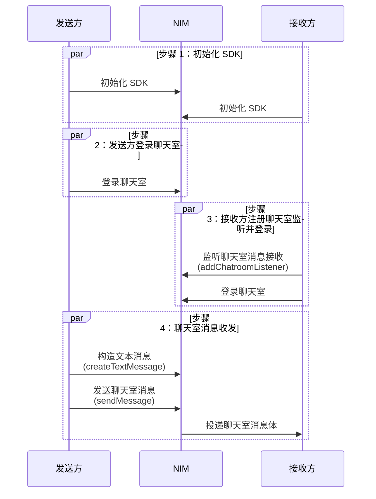

网易云信 IM 支持聊天室中各种类型消息的收发，聊天室相关操作的通知类消息的接收。

本文介绍如何实现聊天室消息收发，及聊天室历史消息查询。

## 支持平台

本文内容适用的开发平台或框架如下表所示，涉及的接口请参考下文 [相关接口](#相关接口) 章节：

安卓 | iOS | macOS/Windows | Web/uni-app/小程序 | Node.js/Electron | 鸿蒙 | Flutter
:----: | :----: | :----: | :----: | :----: | :----: | :----:
✔️️️️️ | ✔️️️️️ | ✔️️️️️ | ✔️️️️️ | ✔️️️️️ | ✔️️️️️ | ✔️️️️️ 

## 前提条件

在实现消息收发之前，请确保：

- 已 [实现聊天室登录](https://doc.yunxin.163.com/messaging2/guide/DI2NDc1NzQ?platform=client)。
- 已了解各消息类型的 [使用限制](https://doc.yunxin.163.com/messaging2/guide/TQyODQ2ODQ?platform=client#消息功能)。
- 在使用聊天室服务中的 API 前，需要先调用 `getChatroomService` 方法获取聊天室服务类。

## 聊天室消息收发

### 消息流控机制

为保证用户体验（如避免服务器过载），聊天室存在流量控制机制（以下简称 **流控机制**）：

- **针对普通消息**：聊天室用户每秒至多可接收 20 条，超过部分会因为流控随机丢弃。
- **针对高优先级消息**：聊天室用户每秒至多接收 10 条，超过部分可能会丢失。为避免丢失重要消息（通常为服务端消息），可将重要消息设置为高优先级消息，进而保证高优先级消息流控上限内（每秒 10 条）的消息不丢失。如何 **实现高优先级消息** 请参考 [消息发送配置选项](#消息发送配置选项)。

### API 调用时序

以收发聊天室文本消息为例，API 调用时序如下图：



### 实现步骤

1. **接收方** 注册聊天室监听器，监听聊天室消息接收回调事件 `onReceiveMessages`。

    :::::: div linked-codes
    ::: code 安卓
    ```Java
    V2NIMChatroomClient v2ChatroomClient = V2NIMChatroomClient.getInstance(instanceId);
    V2NIMChatroomService v2ChatroomService = v2ChatroomClient.getChatroomService();

    V2NIMChatroomListener listener = new V2NIMChatroomListener() {
        @Override
        public void onReceiveMessages(List<V2NIMChatroomMessage> messages) {

        }
    };

    v2ChatroomService.addChatroomListener(listener);
    ```
    :::
    ::: code iOS
    ```Objective-C
    @interface Listener: NSObject<V2NIMChatroomListener>
    - (void)addToService;
    @end

    @implementation Listener

    - (void)addToService
    {
        id <V2NIMChatroomService> service = [[V2NIMChatroomClient getInstance:1] getChatroomService];
        [service addChatroomListener:self];
    }

    - (void)onReceiveMessages:(NSArray *)messages
    {

    }
    @end
    ```
    :::
    ::: code macOS/Windows
    ```C++
    V2NIMChatroomListener listener;
    listener.onReceiveMessages = [](nstd::vector<V2NIMChatroomMessage> messages) {
        // handle receive messages
    };
    chatroomService.addChatroomListener(listener);
    ```
    :::
    ::: code Web/uni-app/小程序
    ```TypeScript
    chatroom.V2NIMChatroomService.on('onReceiveMessages', function (messages: V2NIMChatroomMessage[]){})
    ```
    :::
    ::: code Node.js/Electron
    ```TypeScript
    chatroom.chatroomService.on('receiveMessages', function (messages: V2NIMChatroomMessage[]){})
    ```
    :::
    ::: code 鸿蒙
    ```TypeScript
    chatroom.chatroomService.on('onReceiveMessages', (messages: V2NIMChatroomMessage[]) => {})
    ```
    :::
    ::: code Flutter
    ```Dart
    //首先添加监听
    await chatroomClient?.getChatroomService().addChatroomListener();
    //然后设置监听
    chatroomClient!.getChatroomService().onReceiveMessages.listen((event) {
            print('getChatroomService:onReceiveMessages');
        });
    ```
    :::
    ::::::

2. **发送方** 调用 `createTextMessage` 方法，构建一条文本消息。

    :::::: div linked-codes
    ::: code 安卓
    ```Java
    V2NIMChatroomMessage v2TextMessage = V2NIMChatroomMessageCreator.createTextMessage("text content");
    ```
    :::
    ::: code iOS
    ```Objective-C
    V2NIMChatroomMessage *v2TextMessage = [V2NIMChatroomMessageCreator createTextMessage:@"text content"];
    ```
    :::
    ::: code macOS/Windows
    ```C++
    auto textMessage = V2NIMChatroomMessageCreator::createTextMessage("hello world");
    if(!textMessage) {
        // create text message failed
    }
    ```
    :::
    ::: code Web/uni-app/小程序
    ```TypeScript
    try {
        const message = chatroom.V2NIMChatroomMessageCreator.createTextMessage('hello world')
    } catch(err) {
        // todo error
    }
    ```
    :::
    ::: code Node.js/Electron
    ```TypeScript
    try {
        const message = v2.chatroomMessageCreator.createTextMessage(text)
    } catch(err) {
        // todo error
    }
    ```
    :::
    ::: code 鸿蒙
    ```TypeScript
    const message: V2NIMChatroomMessage = this.chatroomClient.messageCreator.createTextMessage('hello world')
    ```
    :::
    ::: code Flutter
    ```Dart
    final message = (await V2NIMChatroomMessageCreator.createTextMessage(
                'test text chatroom message'))
            .data;
    ```
    :::
    ::::::

3. 根据自身业务需求，配置消息发送参数，包括发送、抄送、反垃圾、标签、空间位置等配置。支持设置聊天室消息为高优先级消息、是否保存在在服务端。

<div id="消息发送配置选项">

名称 | 是否必填 | 默认值 | 说明 |
:--- | :--- | :--- | :--- |
`messageConfig` | 否 | - | 聊天室消息相关配置 |
`routeConfig` | 否 | - | 消息事件抄送相关配置 |
`antispamConfig` | 否 | - | 消息反垃圾相关配置，包括本地反垃圾或安全通配置，均需要在 [网易云信控制台](https://app.yunxin.163.com/global/home) [开通](https://doc.yunxin.163.com/messaging2/client-apis/zU4ODQ3OTc?platform=client) |
`clientAntispamEnabled` | 否 | false | 是否启用本地反垃圾<li>仅对文本消息生效<li>如果开启本地发垃圾，发送消息时会进行本地反垃圾检测，完成后返回检测结果：<ul><li>0：检测通过，可以发送该消息<li>1：发送替换后的文本消息<li>2：检测不通过，消息发送失败，返回本地错误码<li>3：消息发送后，由服务端拦截</ul> |
`clientAntispamReplace` | 若 `clientAntispamEnabled` 为 true 则必填 | "" | 反垃圾命中后替换的文本 |
`receiverIds` | 否 | null | 定向消息接收者账号列表。<br>若该字段不为空，则表示该消息为聊天室定向消息，**不在服务端进行存储**。 |
`notifyTargetTags` | 否 | null | 消息接收通知的标签，请参考 [标签表达式](https://doc.yunxin.163.com/messaging2/client-apis/TkxNTg3NTk?platform=client#标签表达式) |
`locationInfo` | 否 | null | 消息空间位置信息配置

</div>

4. **发送方** 调用 `sendMessage` 方法，发送已构建的文本消息。

    发送消息时，设置消息发送成功回调参数 `success` 和消息发送失败回调参数 `failure`，监听消息发送是否成功。若消息发送成功，则通过成功回调返回接收消息对象。若消息发送失败，则通过失败回调获取相关错误码。

    示例代码如下：

    :::::: div linked-codes
    ::: code 安卓
    ```Java
    // 新建一个聊天室实例，注意：每次 newInstance 都会返回一个新的实例，实际使用中请一个聊天室对应一个 V2NIMChatroomClient 实例，使用中需要临时缓存
    V2NIMChatroomClient v2ChatroomClient = V2NIMChatroomClient.newInstance();
    // 获取聊天室服务
    V2NIMChatroomService v2ChatroomService = v2ChatroomClient.getChatroomService();
    // 创建一条文本消息
    V2NIMChatroomMessage v2Message = V2NIMChatroomMessageCreator.createTextMessage("xxx");

    V2NIMChatroomMessageConfig messageConfig = new V2NIMChatroomMessageConfig();
    // 根据实际情况配置
    // 设置是否需要在服务端保存历史消息，默认 true
    // messageConfig.setHistoryEnabled(true);
    // 设置是否是高优先级消息，默认 false
    // messageConfig.setHighPriority(false);

    V2NIMMessageRouteConfig routeConfig = V2NIMMessageRouteConfig.V2NIMMessageRouteConfigBuilder.builder()
    // 根据实际情况配置
    // .withRouteEnabled()
    // .withRouteEnvironment()
    .build();

    V2NIMMessageAntispamConfig antispamConfig = V2NIMMessageAntispamConfig.V2NIMMessageAntispamConfigBuilder.builder()
    // 根据实际情况配置
    // .withAntispamBusinessId()
    // .withAntispamCheating()
    // .withAntispamCustomMessage()
    // .withAntispamEnabled()
    // .withAntispamExtension()
    .build();

    V2NIMSendChatroomMessageParams params = new V2NIMSendChatroomMessageParams();
    // 设置消息相关配置
    // params.setMessageConfig(messageConfig);
    // 设置路由抄送相关配置
    // params.setRouteConfig(routeConfig);
    // 设置反垃圾相关配置
    // params.setAntispamConfig(antispamConfig);
    // 是否开启本地反垃圾，默认 false
    // params.setClientAntispamEnabled(false);
    // 本地反垃圾的替换文本
    // params.setClientAntispamReplace("xxx");
    //设置聊天室定向消息接收者账号 ID 列表
    // params.setReceiverIds(receiverIds);
    // 设置消息的目标标签表达式
    // params.setNotifyTargetTags("xxx");
    // 设置位置信息
    // params.setLocationInfo(locationInfo);
    v2ChatroomService.sendMessage(v2Message,params,
    new V2NIMSuccessCallback<V2NIMSendChatroomMessageResult>() {
        @Override
        public void onSuccess(V2NIMSendChatroomMessageResult result) {
            // 发送成功
        }
    },
    new V2NIMFailureCallback() {
        @Override
        public void onFailure(V2NIMError error) {
            // 发送失败
        }
    },
    new V2NIMProgressCallback() {
        @Override
        public void onProgress(int progress) {
            // 发送进度
        }
    });
    ```
    :::
    ::: code iOS
    ```Objective-C
    // 通过实例 ID 获取聊天室服务
    id <V2NIMChatroomService> service = [[V2NIMChatroomClient getInstance:instanceId] getChatroomService];
    // 创建一条文本消息
    V2NIMChatroomMessage *message = [V2NIMChatroomMessageCreator createTextMessage:@"xxx"];
    V2NIMChatroomMessageConfig *messageConfig = [V2NIMChatroomMessageConfig new];
    // 根据实际情况配置
    // 设置是否需要在服务端保存历史消息，默认 true
    // messageConfig.historyEnabled = YES;
    // 设置是否是高优先级消息，默认 false
    // messageConfig.highPriority = NO;
    V2NIMMessageRouteConfig *routeConfig = [V2NIMMessageRouteConfig new];
    // 根据实际情况配置
    // routeConfig.routeEnabled
    // routeConfig.routeEnvironment
    V2NIMMessageAntispamConfig *antispamConfig = [V2NIMMessageAntispamConfig new];
    // 根据实际情况配置
    // antispamConfig.antispamBusinessId
    // antispamConfig.antispamCheating
    // antispamConfig.antispamCustomMessage
    // antispamConfig.antispamEnabled
    // antispamConfig.antispamExtension

    V2NIMSendChatroomMessageParams *params = [V2NIMSendChatroomMessageParams new];
    // 设置消息相关配置
    // params.messageConfig = messageConfig;
    // 设置路由抄送相关配置
    // params.routeConfig = routeConfig;
    // 设置反垃圾相关配置
    // params.antispamConfig = antispamConfig;
    // 是否开启本地反垃圾，默认 false
    // params.clientAntispamEnabled = false;
    // 本地反垃圾的替换文本
    // params.clientAntispamReplace = @"xxx";
    // 设置聊天室定向消息接收者账号 ID 列表
    // params.receiverIds = receiverIds;
    // 设置消息的目标标签表达式
    // params.notifyTargetTags = @"xxx";
    // 设置位置信息
    // params.locationInfo = locationInfo;
    [service sendMessage:message
                params:params
                success:^(V2NIMSendChatroomMessageResult *result)
                {
                    // 发送成功
                }
                failure:^(V2NIMError *error)
                {
                    // 发送失败
                }
                progress:^(NSUInteger progress)
                {
                    // 上传进度
                }];
    ```
    :::
    ::: code macOS/Windows
    ```C++
    // 创建一条文本消息
    auto message = V2NIMChatroomMessageCreator::createTextMessage("hello world");
    auto params = V2NIMSendChatroomMessageParams();
    // 发送消息
    chatroomService.sendMessage(
        message,
        params,
        [](V2NIMSendChatroomMessageResult result) {
            // send message succeeded
        },
        [](V2NIMError error) {
            // send message failed, handle error
        },
        [](uint32_t progress) {
            // upload progress
        });
    ```
    :::
    ::: code Web/uni-app/小程序
    ```TypeScript
    await chatroom.V2NIMChatroomService.sendMessage(
        message,
        // V2NIMSendChatroomMessageParams
        {
            locationInfo: {x: 0, y: 100, z: 0}
        },
        progress: (percentage) => {console.log('上传进度: ' + percentage)}
    )
    ```
    :::
    ::: code Node.js/Electron
    ```TypeScript
    const message = V2NIMChatroomMessageCreator.createTextMessage('Hello NTES IM')
    await chatroomService.sendMessage(message, {})
    ```
    :::
    ::: code 鸿蒙
    ```TypeScript
    // 准备代发送的消息
    const msg: V2NIMChatroomMessage = this.chatroomClient.messageCreator.createTextMessage(text)
    // 发送聊天室消息时的参数
    const params: V2NIMSendChatroomMessageParams = {
    // 配置参数，如
    locationInfo: {x: 0, y: 100, z: 0}
    }
    // 发送进度回调，如上传附件时由该 cb 回调
    const progressCb = (percentage: number) => {
    this.messageSetProgress(imgMsg, percentage)
    console.info(`onUploadProgress: ${JSON.stringify(percentage)}`)
    }
    // send
    const msgRes: V2NIMSendChatroomMessageResult = await this.chatroomClient.chatroomService.sendMessage(msg, params, progressCb)
    ```
    :::
    ::: code Flutter
    ```Dart
    V2NIMSendChatroomMessageParams params = V2NIMSendChatroomMessageParams();
    final messageSender = await chatroomService?.sendMessage(message, params);
    ```
    :::
    ::::::

5. **接收方** 通过 `onReceiveMessages` 回调收到聊天室消息。

    如果是富媒体消息（图片/音频/视频/文件消息），您需要 **自行实现** 富媒体消息资源下载。

6. （可选）如发送富媒体消息，发送后可调用 `cancelMessageAttachmentUpload` 方法取消附件的上传。

    如果附件已经上传成功，操作将会失败。如果成功取消了附件的上传，对应的消息会发送失败，消息状态是 `SENDING_STATE_FAILED`，附件上传状态是 `ATTACHMENT_UPLOAD_STATE_FAILED`。

    :::::: div linked-codes
    ::: code 安卓
    ```Java
    // 通过实例 ID 获取聊天室实例
    V2NIMChatroomClient v2ChatroomClient = V2NIMChatroomClient.getInstance(instanceId);
    V2NIMChatroomService v2ChatroomService = v2ChatroomClient.getChatroomService();
    v2ChatroomService.cancelMessageAttachmentUpload(v2Message, new V2NIMSuccessCallback<Void>() {
        @Override
        public void onSuccess(Void unused) {
            // 取消成功
        }
    }, new V2NIMFailureCallback() {
        @Override
        public void onFailure(V2NIMError error) {
            // 取消失败
        }
    });
    ```
    :::
    ::: code iOS
    ```Objective-C
    // 通过实例 ID 获取聊天室服务
    id<V2NIMChatroomService> service = [[V2NIMChatroomClient getInstance:1] getChatroomService];
    [service cancelMessageAttachmentUpload:message
                                success:^{
                                    // 取消成功
                                }
                                failure:^(V2NIMError *error) {
                                    // 取消失败
                                }];
    ```
    :::
    ::: code macOS/Windows
    ```C++
    V2NIMChatroomMessage message;
    // ...
    chatroomService.cancelMessageAttachmentUpload(
        message,
        []() {
            // cancel message attachment upload succeeded
        },
        [](V2NIMError error) {
            // cancel message attachment upload failed, handle error
        });
    ```
    :::
    ::: code Web/uni-app/小程序
    ```TypeScript
    await chatroom.V2NIMChatroomService.cancelMessageAttachmentUpload(message)
    ```
    :::
    ::: code Node.js/Electron
    ```TypeScript
    await chatroomService.cancelMessageAttachmentUpload(message)
    ```
    :::
    ::: code 鸿蒙
    ```TypeScript
    await this.chatroomClient.chatroomService.cancelMessageAttachmentUpload(message)
    ```
    :::
    ::: code Flutter
    ```Dart
    chatroomService?.cancelMessageAttachmentUpload(message);
    ```
    :::
    ::::::

## <span id="发送带位置信息的消息">聊天室空间位置消息</span>

空间位置消息功能，用于聊天室空间坐标场景下，给指定范围内的聊天室用户发送消息，例如在游戏地图内指定范围的区域内互发消息。

### 预设聊天室空间位置信息

在调用 `enter` 方法进入聊天室时，您可以通过配置进入聊天室参数中的空间位置配置字段 `locationConfig`，来预设进入聊天室时的初始空间坐标位置，并且可以订阅接收指定距离内的消息。

名称 | 是否必填 | 说明 |
:--- | :--- | :---
`locationInfo` | 是 | 聊天室空间位置坐标信息，配置 x、y、z 坐标值 |
`distance` | 是 | 订阅聊天室消息的距离 |

`enter` 方法其他参数设置及示例代码请参考 [聊天室登录文档](https://doc.yunxin.163.com/messaging2/client-apis/DI2NDc1NzQ?platform=client)。

### 发送聊天室空间位置消息

调用 `sendMessage` 方法发送聊天室消息时，您可以通过配置聊天室消息发送配置参数中的空间位置信息字段 `locationInfo`，设置该消息的空间坐标信息属性。

名称 | 类型 | 是否必填 | 描述
:--- | :--- | :--- | :--- | :---
`x` | Double | 是 | 聊天室空间 x 坐标
`y` | Double | 是 | 聊天室空间 y 坐标
`z` | Double | 是 | 聊天室空间 z 坐标

示例代码如下：

:::::: div linked-codes
::: code 安卓
```Java
// 新建一个聊天室实例，注意：每次 newInstance 都会返回一个新的实例，实际使用中请一个聊天室对应一个 V2NIMChatroomClient 实例，使用中需要临时缓存
V2NIMChatroomClient v2ChatroomClient = V2NIMChatroomClient.newInstance();
// 获取聊天室服务
V2NIMChatroomService v2ChatroomService = v2ChatroomClient.getChatroomService();
// 创建一条文本消息
V2NIMChatroomMessage v2Message = V2NIMChatroomMessageCreator.createTextMessage("xxx");

V2NIMChatroomMessageConfig messageConfig = new V2NIMChatroomMessageConfig();
// 根据实际情况配置
// 设置是否需要在服务端保存历史消息，默认 true
// messageConfig.setHistoryEnabled(true);
// 设置是否是高优先级消息，默认 false
// messageConfig.setHighPriority(false);

V2NIMMessageRouteConfig routeConfig = V2NIMMessageRouteConfig.V2NIMMessageRouteConfigBuilder.builder()
// 根据实际情况配置
// .withRouteEnabled()
// .withRouteEnvironment()
.build();

V2NIMMessageAntispamConfig antispamConfig = V2NIMMessageAntispamConfig.V2NIMMessageAntispamConfigBuilder.builder()
// 根据实际情况配置
// .withAntispamBusinessId()
// .withAntispamCheating()
// .withAntispamCustomMessage()
// .withAntispamEnabled()
// .withAntispamExtension()
.build();

V2NIMSendChatroomMessageParams params = new V2NIMSendChatroomMessageParams();
// 设置位置信息
// params.setLocationInfo(locationInfo);
v2ChatroomService.sendMessage(v2Message,params,
new V2NIMSuccessCallback<V2NIMSendChatroomMessageResult>() {
    @Override
    public void onSuccess(V2NIMSendChatroomMessageResult result) {
        // 发送成功
    }
},
new V2NIMFailureCallback() {
    @Override
    public void onFailure(V2NIMError error) {
        // 发送失败
    }
},
new V2NIMProgressCallback() {
    @Override
    public void onProgress(int progress) {
        // 发送进度
    }
});
```
:::
::: code iOS
```Objective-C
// 通过实例 ID 获取聊天室服务
id <V2NIMChatroomService> service = [[V2NIMChatroomClient getInstance:instanceId] getChatroomService];
// 创建一条文本消息
V2NIMChatroomMessage *message = [V2NIMChatroomMessageCreator createTextMessage:@"xxx"];
V2NIMChatroomMessageConfig *messageConfig = [V2NIMChatroomMessageConfig new];
// 根据实际情况配置
// 设置是否需要在服务端保存历史消息，默认 true
// messageConfig.historyEnabled = YES;
// 设置是否是高优先级消息，默认 false
// messageConfig.highPriority = NO;
V2NIMMessageRouteConfig *routeConfig = [V2NIMMessageRouteConfig new];
// 根据实际情况配置
// routeConfig.routeEnabled
// routeConfig.routeEnvironment
V2NIMMessageAntispamConfig *antispamConfig = [V2NIMMessageAntispamConfig new];
// 根据实际情况配置
// antispamConfig.antispamBusinessId
// antispamConfig.antispamCheating
// antispamConfig.antispamCustomMessage
// antispamConfig.antispamEnabled
// antispamConfig.antispamExtension

V2NIMSendChatroomMessageParams *params = [V2NIMSendChatroomMessageParams new];
// 设置位置信息
// params.locationInfo = locationInfo;
[service sendMessage:message
            params:params
            success:^(V2NIMSendChatroomMessageResult *result)
            {
                // 发送成功
            }
            failure:^(V2NIMError *error)
            {
                // 发送失败
            }
            progress:^(NSUInteger progress)
            {
                // 上传进度
            }];
```
:::
::: code macOS/Windows
```C++
// 创建一条文本消息
auto message = V2NIMChatroomMessageCreator::createTextMessage("hello world");
auto params = V2NIMSendChatroomMessageParams();
// 发送消息
chatroomService.sendMessage(
    message,
    params,
    [](V2NIMSendChatroomMessageResult result) {
        // send message succeeded
    },
    [](V2NIMError error) {
        // send message failed, handle error
    },
    [](uint32_t progress) {
        // upload progress
    });
```
:::
::: code Web/uni-app/小程序
```TypeScript
await chatroom.V2NIMChatroomService.sendMessage(
    message,
    // V2NIMSendChatroomMessageParams
    {
        locationInfo: {x: 0, y: 100, z: 0}
    },
    progress: (percentage) => {console.log('上传进度: ' + percentage)}
)
```
:::
::: code Node.js/Electron
```TypeScript
const message = V2NIMChatroomMessageCreator.createTextMessage('Hello NTES IM')
await chatroomService.sendMessage(message, {})
```
:::
::: code 鸿蒙
```TypeScript
// 准备代发送的消息
const msg: V2NIMChatroomMessage = this.chatroomClient.messageCreator.createTextMessage(text)
// 发送聊天室消息时的参数
const params: V2NIMSendChatroomMessageParams = {
// 配置参数，如
locationInfo: {x: 0, y: 100, z: 0}
}
// 发送进度回调，如上传附件时由该 cb 回调
const progressCb = (percentage: number) => {
this.messageSetProgress(imgMsg, percentage)
console.info(`onUploadProgress: ${JSON.stringify(percentage)}`)
}
// send
const msgRes: V2NIMSendChatroomMessageResult = await this.chatroomClient.chatroomService.sendMessage(msg, params, progressCb)
```
:::    
::: code Flutter
```Dart
V2NIMSendChatroomMessageParams params = V2NIMSendChatroomMessageParams();
      params.locationInfo = V2NIMLocationInfo(
        x: 100,y: 100,z: 100,
      );
      final messageSender = await chatroomService?.sendMessage(message, params);
```
:::
::::::

### <span id="更新位置信息">更新聊天室空间位置信息</span>

您可以调用 `updateChatroomLocationInfo` 方法更新当前在聊天室的空间坐标位置，及消息订阅范围。

名称 | 是否必填 | 描述
:--- | :--- | :--- | :---
`locationInfo` | 是 | 聊天室空间位置坐标信息，配置 x、y、z 坐标值
`distance` | 是 | 基于空间位置订阅聊天室消息的距离

示例代码如下：

:::::: div linked-codes
::: code 安卓
```Java
V2NIMChatroomClient v2ChatroomClient = V2NIMChatroomClient.getInstance(instanceId);
V2NIMChatroomService v2ChatroomService = v2ChatroomClient.getChatroomService();

V2NIMChatroomLocationConfig locationConfig = new V2NIMChatroomLocationConfig();
V2NIMLocationInfo locationInfo = new V2NIMLocationInfo(0.0, 0.0, 0,0);

locationConfig.setLocationInfo(locationInfo);
locationConfig.setDistance(100);
// 以上两个字段必填，否则会返回参数错误

v2ChatroomService.updateChatroomLocationInfo(locationConfig, new V2NIMSuccessCallback<Void>() {
    @Override
    public void onSuccess(Void unused) {
        // 更新成功
    }
}, new V2NIMFailureCallback() {
    @Override
    public void onFailure(V2NIMError error) {
        // 更新失败
    }
});
```
:::
::: code iOS
```Objective-C
// 通过实例 ID 获取聊天室实例
id <V2NIMChatroomService> service = [[V2NIMChatroomClient getInstance:1] getChatroomService];

V2NIMChatroomLocationConfig *locationConfig = [[V2NIMChatroomLocationConfig alloc] init];
V2NIMLocationInfo *locationInfo = [[V2NIMLocationInfo alloc] init];

locationConfig.locationInfo = locationInfo;
locationConfig.distance = 100;
// 以上两个字段必填，否则会返回参数错误
[service updateChatroomLocationInfo:locationConfig
                success:^()
                {
                    // 更新成功
                }
                failure:^(V2NIMError *error)
                {
                    // 更新失败
                }];
```
:::
::: code macOS/Windows
```C++
V2NIMChatroomLocationConfig locationConfig;
locationConfig.locationInfo.x = 1.0;
locationConfig.locationInfo.y = 1.0;
locationConfig.locationInfo.z = 1.0;
locationConfig.distance = 100;
chatroomService.updateChatroomLocationInfo(
    locationConfig,
    []() {
        // update chatroom location info succeeded
    },
    [](V2NIMError error) {
        // update chatroom location info failed, handle error
    });
```
:::
::: code Web/uni-app/小程序
```TypeScript
await chatroomV2.V2NIMChatroomService.updateChatroomLocationInfo(
{
    "locationInfo": {
    "x": 33,
    "y": 44,
    "z": 55
    },
    "distance": 77
}
)
```
:::
::: code Node.js/Electron
```TypeScript
await chatroomService.updateChatroomLocationInfo({
    latitude: 30.5,
    longitude: 120.5
})
```
:::
::: code 鸿蒙
```TypeScript
await this.chatroomClient.chatroomService.updateChatroomLocationInfo(
{
    "locationInfo": {
    "x": 33,
    "y": 44,
    "z": 55
    },
    "distance": 77
}
)
```
:::
::: code Flutter
```Dart
final chatroomService = chatroomClient?.getChatroomService();
final params = V2NIMChatroomLocationConfig(
        distance: 100,
        locationInfo:  V2NIMLocationInfo(
          x: 100,y: 100,z: 100,
        )
      );
var result = await chatroomService?.updateChatroomLocationInfo(params);
```
:::
::::::

## <span id="发送定向消息">聊天室定向消息</span>

聊天室定向消息功能支持发送聊天室消息给聊天室中的指定对象，而非聊天室中所有人。

调用 `sendMessage` 方法发送聊天室消息时，您可以通过配置聊天室消息发送配置参数中的字段 `receiverIds`，指定接收定向消息的聊天室用户列表。最多支持指定 100 个用户。

::: note note
定向消息不支持保存离线消息（服务端存储），若发送定向消息时接收者处于离线状态，则后续重连后也无法收到该定向消息。
:::

示例代码如下：

:::::: div linked-codes
::: code 安卓
```Java
// 新建一个聊天室实例，注意：每次 newInstance 都会返回一个新的实例，实际使用中请一个聊天室对应一个 V2NIMChatroomClient 实例，使用中需要临时缓存
V2NIMChatroomClient v2ChatroomClient = V2NIMChatroomClient.newInstance();
// 获取聊天室服务
V2NIMChatroomService v2ChatroomService = v2ChatroomClient.getChatroomService();
// 创建一条文本消息
V2NIMChatroomMessage v2Message = V2NIMChatroomMessageCreator.createTextMessage("xxx");

V2NIMChatroomMessageConfig messageConfig = new V2NIMChatroomMessageConfig();
// 根据实际情况配置
// 设置是否需要在服务端保存历史消息，默认 true
// messageConfig.setHistoryEnabled(true);
// 设置是否是高优先级消息，默认 false
// messageConfig.setHighPriority(false);

V2NIMMessageRouteConfig routeConfig = V2NIMMessageRouteConfig.V2NIMMessageRouteConfigBuilder.builder()
// 根据实际情况配置
// .withRouteEnabled()
// .withRouteEnvironment()
.build();

V2NIMMessageAntispamConfig antispamConfig = V2NIMMessageAntispamConfig.V2NIMMessageAntispamConfigBuilder.builder()
// 根据实际情况配置
// .withAntispamBusinessId()
// .withAntispamCheating()
// .withAntispamCustomMessage()
// .withAntispamEnabled()
// .withAntispamExtension()
.build();

V2NIMSendChatroomMessageParams params = new V2NIMSendChatroomMessageParams();
// params.setReceiverIds(receiverIds);
v2ChatroomService.sendMessage(v2Message,params,
new V2NIMSuccessCallback<V2NIMSendChatroomMessageResult>() {
    @Override
    public void onSuccess(V2NIMSendChatroomMessageResult result) {
        // 发送成功
    }
},
new V2NIMFailureCallback() {
    @Override
    public void onFailure(V2NIMError error) {
        // 发送失败
    }
},
new V2NIMProgressCallback() {
    @Override
    public void onProgress(int progress) {
        // 发送进度
    }
});
```
:::
::: code iOS
```Objective-C
// 通过实例 ID 获取聊天室服务
id <V2NIMChatroomService> service = [[V2NIMChatroomClient getInstance:instanceId] getChatroomService];
// 创建一条文本消息
V2NIMChatroomMessage *message = [V2NIMChatroomMessageCreator createTextMessage:@"xxx"];
V2NIMChatroomMessageConfig *messageConfig = [V2NIMChatroomMessageConfig new];
// 根据实际情况配置
// 设置是否需要在服务端保存历史消息，默认 true
// messageConfig.historyEnabled = YES;
// 设置是否是高优先级消息，默认 false
// messageConfig.highPriority = NO;
V2NIMMessageRouteConfig *routeConfig = [V2NIMMessageRouteConfig new];
// 根据实际情况配置
// routeConfig.routeEnabled
// routeConfig.routeEnvironment
V2NIMMessageAntispamConfig *antispamConfig = [V2NIMMessageAntispamConfig new];
// 根据实际情况配置
// antispamConfig.antispamBusinessId
// antispamConfig.antispamCheating
// antispamConfig.antispamCustomMessage
// antispamConfig.antispamEnabled
// antispamConfig.antispamExtension

V2NIMSendChatroomMessageParams *params = [V2NIMSendChatroomMessageParams new];
// 设置聊天室定向消息接收者账号 ID 列表
// params.receiverIds = receiverIds;
[service sendMessage:message
            params:params
            success:^(V2NIMSendChatroomMessageResult *result)
            {
                // 发送成功
            }
            failure:^(V2NIMError *error)
            {
                // 发送失败
            }
            progress:^(NSUInteger progress)
            {
                // 上传进度
            }];
```
:::
::: code macOS/Windows
```C++
// 创建一条文本消息
auto message = V2NIMChatroomMessageCreator::createTextMessage("hello world");
auto params = V2NIMSendChatroomMessageParams();
// 发送消息
chatroomService.sendMessage(
    message,
    params,
    [](V2NIMSendChatroomMessageResult result) {
        // send message succeeded
    },
    [](V2NIMError error) {
        // send message failed, handle error
    },
    [](uint32_t progress) {
        // upload progress
    });
```
:::
::: code Web/uni-app/小程序
```TypeScript
await chatroom.V2NIMChatroomService.sendMessage(
    message,
    // V2NIMSendChatroomMessageParams
    {
        receiverIds: ["account1", "account2", "account3"]
    },
    progress: (percentage) => {console.log('上传进度: ' + percentage)}
)
```
:::
::: code Node.js/Electron
```TypeScript
const message = V2NIMChatroomMessageCreator.createTextMessage('Hello NTES IM')
await chatroomService.sendMessage(message, {})
```
:::
::: code 鸿蒙
```TypeScript
// 准备代发送的消息
const msg: V2NIMChatroomMessage = this.chatroomClient.messageCreator.createTextMessage(text)
// 发送聊天室消息时的参数
const params: V2NIMSendChatroomMessageParams = {
  // 配置参数，如
  locationInfo: {x: 0, y: 100, z: 0}
}
// 发送进度回调，如上传附件时由该 cb 回调
const progressCb = (percentage: number) => {
  this.messageSetProgress(imgMsg, percentage)
  console.info(`onUploadProgress: ${JSON.stringify(percentage)}`)
}
// send
const msgRes: V2NIMSendChatroomMessageResult = await this.chatroomClient.chatroomService.sendMessage(msg, params, progressCb)
```
:::
::: code Flutter
```Dart
V2NIMSendChatroomMessageParams params = V2NIMSendChatroomMessageParams();
params.receiverIds = ['user1', 'user2'];
final messageSender = await chatroomService?.sendMessage(message, params);
```
:::
::::::

## <span id="聊天室通知消息">聊天室通知消息</span>

在聊天室中进行部分操作会产生聊天室通知消息。

### 聊天室通知消息类型

目前当出现以下事件，会产生通知消息：

| 聊天室通知消息枚举 | 对应值 | 描述
| :--- | :--- | :---
| MEMBER_ENTER | 0 | 成员进入聊天室，可通过网易云信控制台 [聊天室子功能配置](https://doc.yunxin.163.com/messaging2/guide/DUyMzAxNzg?platform=client#配置聊天室子功能)是否开启 **聊天室用户进出消息系统下发** （默认不开启） |
| MEMBER_EXIT | 1 | 成员退出聊天室，可通过网易云信控制台 [聊天室子功能配置](https://doc.yunxin.163.com/messaging2/guide/DUyMzAxNzg?platform=client#配置聊天室子功能)是否开启 **聊天室用户进出消息系统下发** （默认不开启） |
| MEMBER_BLOCK_ADDED | 2 | 聊天室成员被加入黑名单 |
| MEMBER_BLOCK_REMOVED | 3 | 聊天室成员被移除黑名单 |
| MEMBER_CHAT_BANNED_ADDED | 4 | 聊天室成员被禁言 |
| MEMBER_CHAT_BANNED_REMOVED | 5 | 聊天室成员被取消禁言 |
| ROOM_INFO_UPDATED | 6 | 聊天室信息更新 |
| MEMBER_KICKED | 7 | 聊天室成员被踢 |
| MEMBER_TEMP_CHAT_BANNED_ADDED | 8 | 聊天室成员被临时禁言 |
| MEMBER_TEMP_CHAT_BANNED_REMOVED | 9 | 聊天室成员被解除临时禁言 |
| MEMBER_INFO_UPDATED | 10 | 聊天室成员信息更新（nick/avatar/extension） |
| QUEUE_CHANGE | 11 | 聊天室队列变更 |
| CHAT_BANNED | 12 | 聊天室处于禁言状态 |
| CHAT_BANNED_REMOVED | 13 | 聊天室处于非禁言状态 |
| TAG_TEMP_CHAT_BANNED_ADDED | 14 | 聊天室标签成员被临时禁言 |
| TAG_TEMP_CHAT_BANNED_REMOVED | 15 | 聊天室标签成员被解除临时禁言 |
| MESSAGE_REVOKE | 16 | 聊天室消息撤回 |
| TAGS_UPDATE | 17 | 聊天室标签更新 |
| ROLE_UPDATE | 18 | 聊天室成员角色更新 |

::: note note
支持设置成员进出聊天室通知是否下发：
- **应用级别**：
    - 网易云信控制台 [聊天室子功能配置](https://doc.yunxin.163.com/messaging2/guide/DUyMzAxNzg?platform=client#配置聊天室子功能)是否开启 **聊天室用户进出消息系统下发**（默认不开启）
    - 网易云信控制台 [聊天室子功能配置](https://doc.yunxin.163.com/messaging2/guide/DUyMzAxNzg?platform=client#配置聊天室子功能)是否开启 **聊天室用户进出消息历史存储**（默认开启）
- **单个聊天室**：调用新版服务端 API [开启/关闭进出聊天室事件通知](https://doc.yunxin.163.com/messaging2/server-apis/DEyMDExMTU?platform=server)
:::

### 聊天室通知消息解析

所有的聊天室通知消息都以 `V2NIMChatroomMessage` 的形式封装。聊天室通知消息的解析如下：

聊天室通知消息解析步骤如下：

1. 通过 `V2NIMChatroomMessage.messageType` 判断是否为聊天室通知消息（`V2NIM_MESSAGE_TYPE_NOTIFICATION`）。

2. 将 `V2NIMChatroomMessage.attachment` 附件对象强类型转换为 `V2NIMChatroomNotificationAttachment`。

3. 通过 `V2NIMChatroomNotificationAttachment.type` 获取具体的通知类型 `V2NIMChatroomMessageNotificationType`。

4. 根据对应的 `V2NIMChatroomMessageNotificationType` 的类型构造相应的展示信息：

    - **`V2NIMChatroomNotificationAttachment.operatorId`**：事件的操作者 ID，表示是谁主动执行了该操作。
    - **`V2NIMChatroomNotificationAttachment.targetIds`**：事件的被操作者 ID 列表，表示该操作的承受者。(事件类型 0、1、5、6、7、8、9、10 有该字段)

    `V2NIMChatroomNotificationAttachment` 参数说明：

    名称 | 类型 | 是否必填 | 默认值 | 描述
    :--- | :--- | :--- | :--- | :--- |
    `type` | `V2NIMChatroomMessageNotificationType` | 是 | - | 通知类型
    `targetIds` | List<String> | 否 | null | 被操作者账号（accountId）列表 |
    `targetNicks` | List<String> | 否 | null | 被操作者昵称列表 |
    `targetTag` | String | 否 | null | 被操作者标签 |
    `operatorId` | String | 否 | null | 操作者账号（accountId） |
    `operatorNick` | String | 否 | null | 操作者昵称 |
    `notificationExtension` | String | 否 | null | 通知扩展字段 |
    `tags` | List<String> | 否 | null | 通知标签列表 |

## <span id="聊天室历史消息">聊天室历史消息</span>

聊天室默认保存最近 10 天的聊天室历史消息，不支持保存离线消息和漫游消息。您可以在 [网易云信控制台](https://app.yunxin.163.com/) IM 即时通讯的 **聊天室子功能配置** 下自行设置 **聊天室历史消息天数**。

::: note note
10 天之前发送的消息附件（图片、音频、视频等），其 URL 链接地址仍有效，但不支持查询，您需要自行保存 URL。
:::

### <span id="查询云端历史消息">查询聊天室历史消息</span>

通过调用 `getMessageList` 方法分页获取所有聊天室历史消息，包含聊天室通知消息。

示例代码如下：

:::::: div linked-codes
::: code 安卓
```Java
// 通过实例 ID 获取聊天室实例
V2NIMChatroomClient v2ChatroomClient = V2NIMChatroomClient.getInstance(instanceId);
V2NIMChatroomService v2ChatroomService = v2ChatroomClient.getChatroomService();

V2NIMChatroomMessageListOption option = new V2NIMChatroomMessageListOption();
// 设置查询数量
option.setLimit(100);
// 设置消息查询起始时间
option.setBeginTime(0L);
// 设置消息查询方向
option.setDirection(V2NIMMessageQueryDirection.V2NIM_QUERY_DIRECTION_DESC);
// 设置查询的消息类型，如果列表为空，表示查询所有类型的消息
List<V2NIMMessageType> messageTypes = getMessageTypes();
option.setMessageTypes(messageTypes);

v2ChatroomService.getMessageList(option, new V2NIMSuccessCallback<List<V2NIMChatroomMessage>>() {
    @Override
    public void onSuccess(List<V2NIMChatroomMessage> v2NIMChatroomMessages) {
        //查询成功
    }
}, new V2NIMFailureCallback() {
    @Override
    public void onFailure(V2NIMError error) {
        //查询失败
    }
});
```
:::
::: code iOS
```Objective-C
// 通过实例 ID 获取聊天室服务
id <V2NIMChatroomService> service = [[V2NIMChatroomClient getInstance:1] getChatroomService];

V2NIMChatroomMessageListOption *option = [[V2NIMChatroomMessageListOption alloc] init];
// 设置查询数量
option.limit = 100;
// 设置消息查询起始时间
option.beginTime = 0L;
// 设置消息查询方向
option.direction = V2NIM_QUERY_DIRECTION_DESC;
// 设置查询的消息类型，如果列表为空，表示查询所有类型的消息
option.messageTypes = @[
    @(V2NIM_MESSAGE_TYPE_TEXT),
    @(V2NIM_MESSAGE_TYPE_IMAGE),
    @(V2NIM_MESSAGE_TYPE_LOCATION),
    @(V2NIM_MESSAGE_TYPE_NOTIFICATION),
    @(V2NIM_MESSAGE_TYPE_FILE),
    @(V2NIM_MESSAGE_TYPE_TIP),
    @(V2NIM_MESSAGE_TYPE_CUSTOM)
];
[service getMessageList:option
                success:^(NSArray<V2NIMChatroomMessage *> *messages)
                {
                    // 查询成功
                }
                failure:^(V2NIMError *error)
                {
                    // 查询失败
                }];
```
:::
::: code macOS/Windows
```C++
V2NIMChatroomMessageListOption option;
option.beginTime = 0;
option.limit = 10;
chatroomService.getMessageList(
    option,
    [](nstd::vector<V2NIMChatroomMessage> messages) {
        // get message list succeeded
    },
    [](V2NIMError error) {
        // get message list failed, handle error
    });
```
:::
::: code Web/uni-app/小程序
```TypeScript
const messageArr = await chatroom.V2NIMChatroomService.getMessageList({
    // 0 是降序查找。从最新的消息开始查询
    direction: V2NIMQueryDirection.V2NIM_QUERY_DIRECTION_DESC,
    // 查询开始时间
    beginTime: 0,
    limit: 100
})
```
:::
::: code Node.js/Electron
```TypeScript
const result = await chatroomService.getMessageList({
    limit: 10
})
console.log(result)
```
:::
::: code 鸿蒙
```TypeScript
const messages: V2NIMChatroomMessage[] = await this.chatroomClient.chatroomService.getMessageList({
    // 0 是降序查找。从最新的消息开始查询
    direction: V2NIMQueryDirection.V2NIM_QUERY_DIRECTION_DESC,
    // 查询开始时间
    beginTime: 0,
    limit: 100
})
```
:::
::: code Flutter
```Dart
final option = V2NIMChatroomMessageListOption(limit: 100);
final messageList = (await chatroomService.getMessageList(option));
```
:::
::::::

### <span id="根据标签查询历史消息">按照标签查询聊天室历史消息</span>

通过调用 `getMessageListByTag` 方法按照标签信息分页获取所有聊天室历史消息，包含聊天室通知消息。

示例代码如下：

:::::: div linked-codes
::: code 安卓
```Java
V2NIMChatroomClient v2ChatroomClient = V2NIMChatroomClient.getInstance(instanceId);
V2NIMChatroomService v2ChatroomService = v2ChatroomClient.getChatroomService();

V2NIMChatroomTagMessageOption messageOption = new V2NIMChatroomTagMessageOption();
// tag 列表
List<String> tags = getTags();
// 设置查询的 tag 列表，必传字段，传 null 或者 size 为 0，会返回参数错误
messageOption.setTags(tags);
// 设置查询数量
messageOption.setLimit(100);
List<V2NIMMessageType> messageTypes = getMessageTypes();
// 设置查询的消息类型，如果列表为空，表示查询所有类型的消息
messageOption.setMessageTypes(messageTypes);
messageOption.setDirection(V2NIMMessageQueryDirection.V2NIM_QUERY_DIRECTION_DESC);
// 设置查询开始时间，首次传 0，单位毫秒
messageOption.setBeginTime(0L);
// 设置查询结束时间，默认 0 表示当前时间，单位毫秒
messageOption.setEndTime(0L);

v2ChatroomService.getMessageListByTag(messageOption, new V2NIMSuccessCallback<List<V2NIMChatroomMessage>>() {
    @Override
    public void onSuccess(List<V2NIMChatroomMessage> v2NIMChatroomMessages) {
        // 查询成功
    }
}, new V2NIMFailureCallback() {
    @Override
    public void onFailure(V2NIMError error) {
        // 查询失败
    }
});
```
:::
::: code iOS
```Objective-C
// 通过实例 ID 获取聊天室实例
id <V2NIMChatroomService> service = [[V2NIMChatroomClient getInstance:1] getChatroomService];
V2NIMChatroomTagMessageOption *messageOption = [[V2NIMChatroomTagMessageOption alloc] init];
// 设置查询的 tag 列表，必传字段，传 null 或者 size 为 0，会返回参数错误
messageOption.tags = @[@"tag1", @"tag2"];
// 设置查询数量
messageOption.limit = 100;
// 设置查询的消息类型，如果列表为空，表示查询所有类型的消息
messageOption.messageTypes = @[@(V2NIM_MESSAGE_TYPE_TEXT), @(V2NIM_MESSAGE_TYPE_FILE)];
// 设置查询方向
messageOption.direction = V2NIM_QUERY_DIRECTION_DESC;
// 设置查询开始时间，单位秒
messageOption.beginTime = 0;
// 设置查询结束时间，默认 0 表示当前时间，单位秒
messageOption.endTime = 0;
[service getMessageListByTag:messageOption
                    success:^(NSArray<V2NIMChatroomMessage *> *messages)
                    {
                        // 查询成功
                    }
                    failure:^(V2NIMError *error)
                    {
                        // 查询失败
                    }];
```
:::
::: code macOS/Windows
```C++
V2NIMChatroomTagMessageOption messageOption;
messageOption.tags = {"tag1", "tag2"};
messageOption.limit = 10;
chatroomService.getMessageListByTag(
    messageOption,
    [](nstd::vector<V2NIMChatroomMessage> messages) {
        // get message list by tag succeeded
    },
    [](V2NIMError error) {
        // get message list by tag failed, handle error
    });
```
:::
::: code Web/uni-app/小程序
```TypeScript
const messages = await chatroom.V2NIMChatroomService.getMessageListByTag({
    tags: ['tag1', 'tag2'], // 查询的 tags
    limit: 100,
    direction: V2NIMQueryDirection.V2NIM_QUERY_DIRECTION_DESC
})
```
:::
::: code Node.js/Electron
```TypeScript
const result = await chatroomService.getMessageListByTag({
    tags: ['tag1', 'tag2'],
    limit: 10
})
```
:::
::: code 鸿蒙
```TypeScript
const messages = await this.chatroomClient.chatroomService.getMessageListByTag({
    tags: ['tag1', 'tag2'], //查询的 tags
    limit: 100,
    direction: V2NIMQueryDirection.V2NIM_QUERY_DIRECTION_DESC
})
```
:::
::: code Flutter
```Dart
final option = V2NIMChatroomTagMessageOption();
final messageList = (await chatroomService.getMessageListByTag(option));
```
:::
::::::

### 聊天室消息撤回

目前仅支持调用新版服务端 API [撤回/删除聊天室历史消息](https://doc.yunxin.163.com/messaging2/server-apis/Tk5MTE3MDY?platform=server) 实现消息撤回功能。您需要提前注册聊天室监听器，监听聊天室消息撤回回调 `onMessageRevokedNotification`。

:::::: div linked-codes
::: code 安卓
```Java
V2NIMChatroomClient v2ChatroomClient = V2NIMChatroomClient.getInstance(instanceId);
V2NIMChatroomService v2ChatroomService = v2ChatroomClient.getChatroomService();

V2NIMChatroomListener listener = new V2NIMChatroomListener() {

    @Override
    public void onMessageRevokedNotification(String messageClientId, long messageTime) {

    }
};

v2ChatroomService.addChatroomListener(listener);
```
:::
::: code iOS
```Objective-C
@interface Listener: NSObject<V2NIMChatroomListener>
- (void)addToService;
@end

@implementation Listener

- (void)addToService
{
    id <V2NIMChatroomService> service = [[V2NIMChatroomClient getInstance:1] getChatroomService];
    [service addChatroomListener:self];
}

- (void)onMessageRevokedNotification:(NSString *)messageClientId
                         messageTime:(NSTimeInterval)messageTime
{

}

@end
```
:::
::: code macOS/Windows
```C++
V2NIMChatroomListener listener;
listener.onMessageRevokedNotification = [](nstd::string messageClientId, uint64_t messageTime) {
    // handle message revoked notification
};
chatroomService.addChatroomListener(listener);
```
:::
::: code Web/uni-app/小程序
```TypeScript
chatroom.V2NIMChatroomService.on('onMessageRevokedNotification', function (messageClientId: string, messageTime: number){})
```
:::
::: code Node.js/Electron
```TypeScript
chatroom.chatroomService.on('messageRevokedNotification', function (messageClientId: string, messageTime: number){})
```
:::
::: code 鸿蒙
```TypeScript
chatroom.chatroomService.on('onMessageRevokedNotification', (messageClientId: string, messageTime: number) => {})
```
:::
::: code Flutter
```Dart
//首先添加监听
await chatroomClient?.getChatroomService().addChatroomListener();
//然后设置监听
chatroomClient!.getChatroomService().onMessageRevokedNotification.listen((event) {
//todo something
});
```
:::
::::::

## 相关信息

- [聊天室相关 API](https://doc.yunxin.163.com/messaging2/client-apis/DQyODIyODI?platform=client)
- [聊天室相关错误码](https://doc.yunxin.163.com/messaging2/client-apis/DUxNjU3MzU?platform=client#聊天室错误)

## 相关接口

:::::: div linked-codes
::: code 安卓/iOS/macOS/Windows
API |　说明
--- | ---
[`V2NIMChatroomClient.getChatroomService`](https://doc.yunxin.163.com/messaging2/client-apis/DYyMTk0NjE?platform=client#getChatroomService) | 获取聊天室服务类
[`addChatroomListener`](https://doc.yunxin.163.com/messaging2/client-apis/DQyODIyODI?platform=client#addChatroomListener) | 注册聊天室监听器
[`removeChatroomListener`](https://doc.yunxin.163.com/messaging2/client-apis/DQyODIyODI?platform=client#removeChatroomListener) | 取消注册聊天室监听器
[`V2NIMChatroomMessageCreator.createTextMessage`](https://doc.yunxin.163.com/messaging2/client-apis/jE1MTA1MDY?platform=client#createTextMessage) | 构建一条聊天室文本消息
[`V2NIMSendChatroomMessageParams`](https://doc.yunxin.163.com/messaging2/client-apis/DAxNjk0Mzc?platform=client#V2NIMSendChatroomMessageParams) | 发送消息的配置参数
[`V2NIMChatroomMessageConfig`](https://doc.yunxin.163.com/messaging2/client-apis/DAxNjk0Mzc?platform=client#V2NIMChatroomMessageConfig) | 聊天室消息相关配置
[`V2NIMMessageRouteConfig`](https://doc.yunxin.163.com/messaging2/client-apis/DAxNjk0Mzc?platform=client#V2NIMMessageRouteConfig) | 消息事件抄送相关配置
[`V2NIMMessageAntispamConfig`](https://doc.yunxin.163.com/messaging2/client-apis/DAxNjk0Mzc?platform=client#V2NIMMessageAntispamConfig) | 消息反垃圾相关配置
[`V2NIMLocationInfo`](https://doc.yunxin.163.com/messaging2/client-apis/DAxNjk0Mzc?platform=client#V2NIMLocationInfo) | 消息空间位置信息配置
[`V2NIMChatroomService.sendMessage`](https://doc.yunxin.163.com/messaging2/client-apis/DQyODIyODI?platform=client#sendMessage) | 发送聊天室消息
[`V2NIMMessageAttachment`](https://doc.yunxin.163.com/messaging2/client-apis/DAxNjk0Mzc?platform=client#V2NIMMessageAttachment) | 消息附件类
[`V2NIMChatroomService.cancelMessageAttachmentUpload`](https://doc.yunxin.163.com/messaging2/client-apis/DQyODIyODI?platform=client#cancelMessageAttachmentUpload) | 取消附件上传
[`enter`](https://doc.yunxin.163.com/messaging2/client-apis/DYyMTk0NjE?platform=client#enter) | 进入聊天室
[`V2NIMChatroomEnterParams`](https://doc.yunxin.163.com/messaging2/client-apis/DAxNjk0Mzc?platform=client#V2NIMChatroomEnterParams) | 进入聊天室配置参数
[`updateChatroomLocationInfo`](https://doc.yunxin.163.com/messaging2/client-apis/DQyODIyODI?platform=client#updateChatroomLocationInfo) | 更新在当前聊天室中的空间位置坐标
[`V2NIMChatroomMessage`](https://doc.yunxin.163.com/messaging2/client-apis/DAxNjk0Mzc?platform=client#V2NIMChatroomMessage) | 聊天室消息对象
[`V2NIMChatroomNotificationAttachment`](https://doc.yunxin.163.com/messaging2/client-apis/DAxNjk0Mzc?platform=client#V2NIMChatroomNotificationAttachment) | 聊天室通知消息附件对象
[`V2NIMChatroomMessageNotificationType`](https://doc.yunxin.163.com/messaging2/client-apis/DAxNjk0Mzc?platform=client#V2NIMChatroomMessageNotificationType) | 聊天室通知类消息类型
[`getMessageList`](https://doc.yunxin.163.com/messaging2/client-apis/DQyODIyODI?platform=client#getMessageList) | 分页获取所有聊天室历史消息
[`getMessageListByTag`](https://doc.yunxin.163.com/messaging2/client-apis/DQyODIyODI?platform=client#getMessageListByTag) | 按照标签信息分页获取所有聊天室历史消息
[`V2NIMClientAntispamOperateType`](https://doc.yunxin.163.com/messaging2/client-apis/DAxNjk0Mzc?platform=client#V2NIMClientAntispamOperateType) | 客户端本地反垃圾命中后的操作类型
:::
::: code Web/uni-app/小程序/Node.js/Electron
API | 说明
--- | ---
[`V2NIMChatroomClient.getChatroomService`](https://doc.yunxin.163.com/messaging2/client-apis/DYyMTk0NjE?platform=client#getChatroomService) | 获取聊天室服务类
[`on("EventName")`](https://doc.yunxin.163.com/messaging2/client-apis/DQyODIyODI?platform=client#on) | 注册聊天室监听器
[`off("EventName")`](https://doc.yunxin.163.com/messaging2/client-apis/DQyODIyODI?platform=client#off) | 取消注册聊天室监听器
[`V2NIMChatroomMessageCreator.createTextMessage`](https://doc.yunxin.163.com/messaging2/client-apis/jE1MTA1MDY?platform=client#createTextMessage) | 构建一条聊天室文本消息
[`V2NIMSendChatroomMessageParams`](https://doc.yunxin.163.com/messaging2/client-apis/DAxNjk0Mzc?platform=client#V2NIMSendChatroomMessageParams) | 发送消息的配置参数
[`V2NIMChatroomMessageConfig`](https://doc.yunxin.163.com/messaging2/client-apis/DAxNjk0Mzc?platform=client#V2NIMChatroomMessageConfig) | 聊天室消息相关配置
[`V2NIMMessageRouteConfig`](https://doc.yunxin.163.com/messaging2/client-apis/DAxNjk0Mzc?platform=client#V2NIMMessageRouteConfig) | 消息事件抄送相关配置
[`V2NIMMessageAntispamConfig`](https://doc.yunxin.163.com/messaging2/client-apis/DAxNjk0Mzc?platform=client#V2NIMMessageAntispamConfig) | 消息反垃圾相关配置
[`V2NIMLocationInfo`](https://doc.yunxin.163.com/messaging2/client-apis/DAxNjk0Mzc?platform=client#V2NIMLocationInfo) | 消息空间位置信息配置
[`V2NIMChatroomService.sendMessage`](https://doc.yunxin.163.com/messaging2/client-apis/DQyODIyODI?platform=client#sendMessage) | 发送聊天室消息
[`V2NIMMessageAttachment`](https://doc.yunxin.163.com/messaging2/client-apis/DAxNjk0Mzc?platform=client#V2NIMMessageAttachment) | 消息附件类
[`V2NIMChatroomService.cancelMessageAttachmentUpload`](https://doc.yunxin.163.com/messaging2/client-apis/DQyODIyODI?platform=client#cancelMessageAttachmentUpload) | 取消附件上传
[`enter`](https://doc.yunxin.163.com/messaging2/client-apis/DYyMTk0NjE?platform=client#enter) | 进入聊天室
[`V2NIMChatroomEnterParams`](https://doc.yunxin.163.com/messaging2/client-apis/DAxNjk0Mzc?platform=client#V2NIMChatroomEnterParams) | 进入聊天室配置参数
[`updateChatroomLocationInfo`](https://doc.yunxin.163.com/messaging2/client-apis/DQyODIyODI?platform=client#updateChatroomLocationInfo) | 更新在当前聊天室中的空间位置坐标
[`V2NIMChatroomMessage`](https://doc.yunxin.163.com/messaging2/client-apis/DAxNjk0Mzc?platform=client#V2NIMChatroomMessage) | 聊天室消息对象
[`V2NIMChatroomNotificationAttachment`](https://doc.yunxin.163.com/messaging2/client-apis/DAxNjk0Mzc?platform=client#V2NIMChatroomNotificationAttachment) | 聊天室通知消息附件对象
[`V2NIMChatroomMessageNotificationType`](https://doc.yunxin.163.com/messaging2/client-apis/DAxNjk0Mzc?platform=client#V2NIMChatroomMessageNotificationType) | 聊天室通知类消息类型
[`getMessageList`](https://doc.yunxin.163.com/messaging2/client-apis/DQyODIyODI?platform=client#getMessageList) | 分页获取所有聊天室历史消息
[`getMessageListByTag`](https://doc.yunxin.163.com/messaging2/client-apis/DQyODIyODI?platform=client#getMessageListByTag) | 按照标签信息分页获取所有聊天室历史消息
[`V2NIMClientAntispamOperateType`](https://doc.yunxin.163.com/messaging2/client-apis/DAxNjk0Mzc?platform=client#V2NIMClientAntispamOperateType) | 客户端本地反垃圾命中后的操作类型
:::
::: code Flutter
API |　说明
--- | ---
[`V2NIMChatroomClient.getChatroomService`](https://doc.yunxin.163.com/messaging2/client-apis/zE5NTI4MjU?platform=client#getChatroomService) | 获取聊天室服务类
[`addChatroomListener`](https://doc.yunxin.163.com/messaging2/client-apis/TQzMTI2MjU?platform=client#addChatroomListener) | 注册聊天室监听器
[`removeChatroomListener`](https://doc.yunxin.163.com/messaging2/client-apis/TQzMTI2MjU?platform=client#removeChatroomListener) | 取消注册聊天室监听器
[`V2NIMChatroomMessageCreator.createTextMessage`](https://doc.yunxin.163.com/messaging2/client-apis/TAxMjQ2Mzk?platform=client#createTextMessage) | 构建一条聊天室文本消息
[`V2NIMSendChatroomMessageParams`](https://doc.yunxin.163.com/messaging2/client-apis/zExMjk2NzY?platform=client#V2NIMSendChatroomMessageParams) | 发送消息的配置参数
[`V2NIMChatroomMessageConfig`](https://doc.yunxin.163.com/messaging2/client-apis/zExMjk2NzY?platform=client#V2NIMChatroomMessageConfig) | 聊天室消息相关配置
[`NIMMessageRouteConfig`](https://doc.yunxin.163.com/messaging2/client-apis/zExMjk2NzY?platform=client#NIMMessageRouteConfig) | 消息事件抄送相关配置
[`NIMMessageAntispamConfig`](https://doc.yunxin.163.com/messaging2/client-apis/zExMjk2NzY?platform=client#NIMMessageAntispamConfig) | 消息反垃圾相关配置
[`V2NIMLocationInfo`](https://doc.yunxin.163.com/messaging2/client-apis/zExMjk2NzY?platform=client#V2NIMLocationInfo) | 消息空间位置信息配置
[`V2NIMChatroomService.sendMessage`](https://doc.yunxin.163.com/messaging2/client-apis/TQzMTI2MjU?platform=client#sendMessage) | 发送聊天室消息
[`NIMMessageAttachment`](https://doc.yunxin.163.com/messaging2/client-apis/zExMjk2NzY?platform=client#NIMMessageAttachment) | 消息附件类
[`V2NIMChatroomService.cancelMessageAttachmentUpload`](https://doc.yunxin.163.com/messaging2/client-apis/TQzMTI2MjU?platform=client#cancelMessageAttachmentUpload) | 取消附件上传
[`enter`](https://doc.yunxin.163.com/messaging2/client-apis/zE5NTI4MjU?platform=client#enter) | 进入聊天室
[`V2NIMChatroomEnterParams`](https://doc.yunxin.163.com/messaging2/client-apis/zExMjk2NzY?platform=client#V2NIMChatroomEnterParams) | 进入聊天室配置参数
[`updateChatroomLocationInfo`](https://doc.yunxin.163.com/messaging2/client-apis/TQzMTI2MjU?platform=client#updateChatroomLocationInfo) | 更新在当前聊天室中的空间位置坐标
[`V2NIMChatroomMessage`](https://doc.yunxin.163.com/messaging2/client-apis/zExMjk2NzY?platform=client#V2NIMChatroomMessage) | 聊天室消息对象
[`V2NIMChatroomNotificationAttachment`](https://doc.yunxin.163.com/messaging2/client-apis/zExMjk2NzY?platform=client#V2NIMChatroomNotificationAttachment) | 聊天室通知消息附件对象
[`V2NIMChatroomMessageNotificationType`](https://doc.yunxin.163.com/messaging2/client-apis/zExMjk2NzY?platform=client#V2NIMChatroomMessageNotificationType) | 聊天室通知类消息类型
[`getMessageList`](https://doc.yunxin.163.com/messaging2/client-apis/TQzMTI2MjU?platform=client#getMessageList) | 分页获取所有聊天室历史消息
[`getMessageListByTag`](https://doc.yunxin.163.com/messaging2/client-apis/TQzMTI2MjU?platform=client#getMessageListByTag) | 按照标签信息分页获取所有聊天室历史消息
[`NIMClientAntispamOperateType`](https://doc.yunxin.163.com/messaging2/client-apis/zExMjk2NzY?platform=client#NIMClientAntispamOperateType) | 客户端本地反垃圾命中后的操作类型
:::
::::::