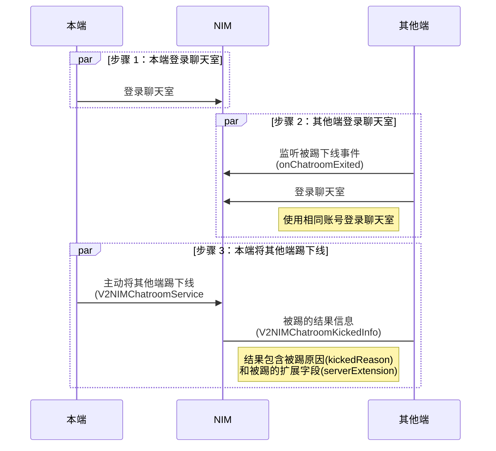

用户在聊天室收发消息前需要先创建聊天室实例并调用 SDK 的聊天室登录接口进入聊天室。登录成功后，用户才能正常在聊天室收发消息并使用其他聊天室相关功能。

本文介绍创建聊天室实例与实现聊天室登录的流程以及相关常见问题。

## 支持平台

本文内容适用的开发平台或框架如下表所示，涉及的接口请参考下文 [相关接口](#相关接口) 章节：

安卓 | iOS | macOS/Windows | Web/uni-app/小程序 | Node.js/Electron | 鸿蒙 | Flutter
:----: | :----: | :----: | :----: | :----: | :----: | :----:
✔️️️ | ✔️️️ | ✔️️️ | ✔️️️ | ✔️️️ | ✔️️️ | ✔️️️

## 技术原理

聊天室的登录过程包括以下三阶段：


上述任一过程失败，都会触发进入聊天室失败回调。

本地端或多端同步进入聊天室成功后，会收到 `onChatroomEntered` 回调。如果已在 [网易云信控制台](https://app.yunxin.163.com/global/home) 开启了 **聊天室用户进出消息系统下发** 功能，聊天室内所有其他成员会收到回调 `onChatroomMemberEnter`。如未开启，可参考 [开通和配置聊天室功能](https://doc.yunxin.163.com/console/concept/zYyMjAzNDY?platform=console#%E9%85%8D%E7%BD%AE%E8%81%8A%E5%A4%A9%E5%AE%A4%E5%AD%90%E5%8A%9F%E8%83%BD)。

根据鉴权方式，登录方式分为静态 Token 登录、动态 Token 登录和通过第三方回调登录。

您可按需实现 **一种或多种** 登录方式。

登录方式 | 鉴权方式 | 描述
---- | ---- | ----
[静态 Token 登录](#静态-token-登录) | [静态 Token 鉴权](https://doc.yunxin.163.com/messaging2/server-apis/jA1MTQ4MDU?platform=server#静态-token-鉴权) | 静态 Token 默认永久有效，且恒定不变，除非主动调用 [服务端接口](https://doc.yunxin.163.com/messaging2/server-apis/DUwODIwMTg?platform=server) 刷新。
[动态 Token 登录](#动态-token-登录) | [动态 Token 鉴权](https://doc.yunxin.163.com/messaging2/server-apis/jA1MTQ4MDU?platform=server#动态-token-鉴权) | 动态 Token 具备时效性，适用于对于用户信息安全有较高要求的业务场景。
[通过第三方回调登录](#第三方回调登录) | [通过第三方回调鉴权](https://doc.yunxin.163.com/messaging2/server-apis/jA1MTQ4MDU?platform=server#基于第三方回调的鉴权) | 用户登录聊天室时的鉴权工作由指定的第三方服务器（可以是应用服务器）进行，**网易云信服务端不做聊天室登录鉴权**。

## 前提条件

实现登录聊天室前，请确保：

- 已 [开通和配置聊天室功能](https://doc.yunxin.163.com/messaging2/guide/DUyMzAxNzg?platform=client)。
- 已创建聊天室，目前只能通过服务端 API [创建聊天室](https://doc.yunxin.163.com/messaging2/server-apis/DU5NjcwNTk?platform=server)。

## 第一步：配置聊天室登录策略

登录策略指您的应用需要采用的一种或多种聊天室登录方式。登录聊天室前，您需要在网易云信控制台配置应用的聊天室登录策略。如未配置相应的登录策略，后续调用登录接口时可能因无登录权限而报错（状态码：403）。

1. 在 [网易云信控制台](https://app.yunxin.163.com/global/home) 首页 **应用管理** 中选择应用，然后单击 **IM 即时通讯** 下的 **功能配置** 按钮进入功能配置页。

    

2. 在顶部选择 **聊天室** 页签，开启聊天室功能，然后单击 **子功能配置**。

    

3. 在子功能配置页选择配置 **聊天室登录策略**。

    

## 第二步：准备 Token

根据以上配置的登录策略，您需要获取对应的 Token 以供后续鉴权。

- **静态 Token**：默认永久有效。如有需要，可通过网易云信新版服务端 API [主动刷新 Token](https://doc.yunxin.163.com/messaging2/server-apis/DUwODIwMTg?platform=server)。
- **动态 Token**：具备时效性，可在生成时设置 token 的有效期。
- **动态登录扩展数据（`LoginExtension`）**：适用于所有登录模式。如果在第三方回调登录模式中设置动态登录扩展数据，第三方服务器可使用该值来进行鉴权。

### 获取静态 Token

您可以通过以下两种方式获取静态 Token，用于静态 Token 登录的鉴权。

- **方式一**：在 [网易云信控制台](https://app.yunxin.163.com/global/home) 获取静态 Token

    如果您只需要进行简单的 **体验或者快速测试**，那么可以在 **网易云信控制台** 创建测试用的 IM 账号，并获取与该 IM 账号相应的 **静态 token**，获取方式请参考 [注册 IM 账号](https://doc.yunxin.163.com/messaging2/guide/jU0Mzg0MTU?platform=client#第二步注册-im-账号)。

- **方式二**：调用服务端 API 获取静态 Token

    如果您在正式的 **生产环境**，为了 **保障用户的信息安全**，那么需要通过网易云信新版服务端 API 注册 IM 账号，并获取与之相对应的 **静态 token**。获取方式请参考 [注册 IM 账号](https://doc.yunxin.163.com/messaging2/server-apis/TQyNjgyMzc?platform=server)。

### 获取动态 Token

如果您有正式的 **生产环境**，且您的业务 **对用户信息安全有较高的要求**，可选择动态 Token 登录。获取动态 Token 步骤如下：

1. 注册 IM 账号，获取 `accountId`。

    - **方式一**：在 [网易云信控制台](https://app.yunxin.163.com/global/home) 注册 IM 测试账号

        如果您只需要进行简单的 **体验或者快速测试**，那么可以在 **网易云信控制台** 创建测试用的 IM 账号，获取方式请参考 [注册 IM 账号](https://doc.yunxin.163.com/messaging2/guide/jU0Mzg0MTU?platform=client#第二步注册-im-账号)。

    - **方式二**：调用服务端 API 注册 IM 正式账号

        如果您在正式的 **生产环境**，为了 **保障用户的信息安全**，那么可通过网易云信 IM 新版服务端 API [注册 IM 账号](https://doc.yunxin.163.com/messaging2/server-apis/TQyNjgyMzc?platform=server)。

2. 基于 App Key、App Secret 和 `accountId`，通过 [约定算法](https://doc.yunxin.163.com/messaging2/server-apis/jA1MTQ4MDU?platform=server#动态token鉴权) 在 **应用服务端** 生成 **动态 token**。

3. 客户端可通过在登录聊天室时实现 `tokenProvider` 方法，从回调中获取聊天室动态 token。具体实现方式请参考下文 [动态 Token 登录](#动态-token-登录)。

### 获取动态登录扩展数据

客户端可通过在登录聊天室时实现 `loginExtensionProvider` 方法，从回调中获取聊天室动态扩展数据 `loginExtension`。具体实现方式请参考下文 [通过第三方回调登录](第三方回调登录)。

## 第三步：创建聊天室实例

调用 `newInstance` 方法创建聊天室实例。调用成功后，返回聊天室实例（`instanceId`），聊天室实例与聊天室（`roomId`）形成一一绑定关系。

:::::: div linked-codes
::: code 安卓
```Java
V2NIMChatroomClient chatroomClient = V2NIMChatroomClient.newInstance();
```
:::
::: code iOS
```Objective-C
V2NIMChatroomClient *chatroomClient = [V2NIMChatroomClient newInstance];
```
:::
::: code macOS/Windows
```C++
auto chatroomClient = V2NIMChatroomClient::newInstance();
if (!chatroomClient) {
    // create instance failed
    // ...
    return;
}
auto instanceId = chatroomClient->getInstanceId();
// save instanceId to cache
// ...
```
:::

::: code Web/uni-app/小程序
需要在创建实例时传入聊天室初始化参数。

参数名称 | 类型 | 是否必填 | 描述
--- | --- | --- | ---
initParams | `V2NIMChatroomInitParams` | 是 | 聊天室初始化参数，包括应用 AppKey 和自定义的设备类型。
```TypeScript
const chatroom = V2NIMChatroomClient.newInstance(
    {
        appkey: 'YOUR_APPKEY'
    }
)
```
:::
::: code Node.js/Electron
```TypeScript
// 引入 node-nim
const NIM = require('node-nim')

const appkey = 'Your appkey'
const account = 'Your account ID'
const token = 'Token of your account ID'
const chatroomId = 'Chatroom ID'

// 初始化聊天室
NIM.V2NIMChatroomClient.init({ appkey })

// 创建聊天室实例
const chatroomInstance = NIM.V2NIMChatroomClient.newInstance()
```
:::
::: code 鸿蒙
需要在创建实例时传入聊天室初始化参数。

参数名称 | 类型 | 是否必填 | 描述
--- | --- | --- | ---
initParams | `V2NIMChatroomInitParams` | 是 | 聊天室初始化参数，包括应用 AppKey 和自定义的设备类型。
```TypeScript
const context: common.Context = getContext(this).getApplicationContext()
const chatroom = V2NIMChatroomClient.newInstance(context，
    {
        appkey: 'YOUR_APPKEY'
    }
)
```
:::
::: code Flutter
```Dart
chatroomClient = (await V2NIMChatroomClient.newInstance()).data;
```
:::
::::::

## 第四步：注册聊天室登录相关事件监听

聊天室实例相关回调：

- **`onChatroomStatus`**：聊天室连接状态变更回调。聊天室内所有成员均会收到该回调。
- **`onChatroomEntered`**：进入聊天室回调。
- **`onChatroomKicked`**：被踢出聊天室回调。被踢出聊天室后，会同时触发 `onChatroomExited` 回调。
- **`onChatroomExited`**：退出聊天室回调。退出聊天室后，不会继续重连。退出聊天室包括以下场景：

    - 账号变更后登录失败导致退出聊天室。
    - 被加入聊天室黑名单导致退出聊天室。
    - 由于账号被封禁导致退出聊天室。
    - 由于聊天室被关闭导致退出聊天室。

:::::: div linked-codes
::: code 安卓
调用 [`addChatroomClientListener`](https://doc.yunxin.163.com/messaging2/client-apis/DYyMTk0NjE?platform=client#addChatroomClientListener) 方法注册聊天室实例监听器，包括聊天室连接状态变更、进出聊天室、被踢出聊天室。
```Java
chatroomClient.addChatroomClientListener(new V2NIMChatroomClientListener() {
    @Override
    public void onChatroomStatus(V2NIMChatroomStatus status, V2NIMError error) {
    }
    @Override
    public void onChatroomEntered() {
    }
    @Override
    public void onChatroomExited(V2NIMError error) {
    }
    @Override
    public void onChatroomKicked(V2NIMChatroomKickedInfo kickedInfo) {
    }
});
```
:::
::: code iOS
调用 [`addChatroomClientListener`](https://doc.yunxin.163.com/messaging2/client-apis/DYyMTk0NjE?platform=client#addChatroomClientListener) 方法注册聊天室实例监听器，包括聊天室连接状态变更、进出聊天室、被踢出聊天室。
```Objective-C
@interface ClientListener : NSObject <V2NIMChatroomClientListener>
- (void)addToClient:(NSInteger)clientId;
@end

@implementation ClientListener
- (void)addToClient:(NSInteger)clientId
{
    V2NIMChatroomClient *instance = [V2NIMChatroomClient getInstance:clientId];
    [instance addChatroomClientListener:self];
}
- (void)onChatroomStatus:(V2NIMChatroomStatus)status
                   error:(nullable V2NIMError *)error
{
}
- (void)onChatroomEntered
{
}
- (void)onChatroomExited:(nullable V2NIMError *)error
{
}
- (void)onChatroomKicked:(V2NIMChatroomKickedInfo *)kickedInfo
{
}
@end
```
:::
::: code macOS/Windows
调用 [`addChatroomClientListener`](https://doc.yunxin.163.com/messaging2/client-apis/DYyMTk0NjE?platform=client#addChatroomClientListener) 方法注册聊天室实例监听器，包括聊天室连接状态变更、进出聊天室、被踢出聊天室。
```C++
V2NIMChatroomClientListener listener;
listener.onChatroomStatus = [](V2NIMChatroomStatus status, nstd::optional<V2NIMError> error) {
    // handle chatroom status
};
listener.onChatroomEntered = []() {
    // handle chatroom entered
};
listener.onChatroomExited = [](nstd::optional<V2NIMError> error) {
   // handle chatroom exited
};
listener.onChatroomKicked = [](V2NIMChatroomKickedInfo kickedInfo) {
    // handle chatroom kicked
};
chatroomClient.addChatroomClientListener(listener);
```
:::

::: code Web/uni-app/小程序
调用 [`on("EventName")`](https://doc.yunxin.163.com/messaging2/client-apis/DYyMTk0NjE?platform=client#on) 方法注册聊天室实例监听器，包括聊天室连接状态变更、进出聊天室、被踢出聊天室。
```TypeScript
chatroom.on("onChatroomStatus", function (status: V2NIMChatroomStatus, err?: V2NIMError) {})
chatroom.on("onChatroomEntered", function () {})
chatroom.on("onChatroomExited", function (err?: V2NIMError) {})
chatroom.on("onChatroomKicked", function (kickedInfo: V2NIMChatroomKickedInfo) {})
```
:::
::: code Node.js/Electron
调用 [`on("EventName")`](https://doc.yunxin.163.com/messaging2/client-apis/DYyMTk0NjE?platform=client#on) 方法注册聊天室实例监听器，包括聊天室连接状态变更、进出聊天室、被踢出聊天室。
```TypeScript
// 在创建的实例对象上监听事件
chatroomInstance.on('chatroomStatus', (status, error) => {
    console.log('Chatroom status:', status, error)
})
chatroomInstance.on('chatroomEntered', () => {
    console.log('Chatroom entered successfully')
})
chatroomInstance.on('chatroomExited', (error) => {
    console.log('Chatroom exited:', error)
})
chatroomInstance.on('chatroomKicked', (kickedInfo) => {
    console.log('Chatroom kicked:', kickedInfo)
})
```
:::
::: code 鸿蒙
调用 [`on("EventName")`](https://doc.yunxin.163.com/messaging2/client-apis/DYyMTk0NjE?platform=client#on) 方法注册聊天室实例监听器，包括聊天室连接状态变更、进出聊天室、被踢出聊天室。
```TypeScript
const chatroom = this.getInstance(instanceId)
chatroom.on("onChatroomStatus", (status: V2NIMChatroomStatus, err?: V2NIMError) => {
})
chatroom.on("onChatroomEntered", ()=> {
})
chatroom.on("onChatroomExited", (err?: V2NIMError) => {
})
chatroom.on("onChatroomKicked", (kickedInfo: V2NIMChatroomKickedInfo)=> {
})
```
:::
::: code Flutter
调用 [`addChatroomClientListener`](https://doc.yunxin.163.com/messaging2/client-apis/zE5NTI4MjU?platform=client#addChatroomClientListener) 方法注册聊天室实例监听器，包括聊天室连接状态变更、进出聊天室、被踢出聊天室。

```Dart
//首先添加监听
await chatroomClient.addChatroomClientListener();
//添加成功后可以监听回到
chatroomClient!.onChatroomEntered.listen((event) {
    //print('ChatroomClient:onChatroomEntered');
}),
chatroomClient!.onChatroomExited.listen((event) {
    // print('ChatroomClient:onChatroomExited');
}),
chatroomClient!.onChatroomStatus.listen((event) {
    //print('ChatroomClient:onChatroomStatus');
}),
chatroomClient!.onChatroomKicked.listen((event) {
    // print('ChatroomClient:onChatroomKicked');
})
```
:::
::::::

:::::: div linked-codes
::: code 安卓
如需移除聊天室实例相关监听器，可调用 [`removeChatroomClientListener`](https://doc.yunxin.163.com/messaging2/client-apis/DYyMTk0NjE?platform=client#removeChatroomClientListener)。
```Java
chatroomClient.removeChatroomClientListener(chatroomClientListener);
```
:::
::: code iOS
如需移除聊天室实例相关监听器，可调用 [`removeChatroomClientListener`](https://doc.yunxin.163.com/messaging2/client-apis/DYyMTk0NjE?platform=client#removeChatroomClientListener)。
```Objective-C
@interface ClientListener : NSObject <V2NIMChatroomClientListener>
- (void)addToClient:(NSInteger)clientId;
- (void)removeFromClient:(NSInteger)clientId;
@end

@implementation ClientListener
- (void)addToClient:(NSInteger)clientId
{
    V2NIMChatroomClient *instance = [V2NIMChatroomClient getInstance:clientId];
    [instance addChatroomClientListener:self];
}
- (void)removeFromClient:(NSInteger)clientId
{
    V2NIMChatroomClient *instance = [V2NIMChatroomClient getInstance:clientId];
    [instance removeChatroomClientListener:self];
}
- (void)onChatroomStatus:(V2NIMChatroomStatus)status
                   error:(nullable V2NIMError *)error
{
}
- (void)onChatroomEntered
{
}
- (void)onChatroomExited:(nullable V2NIMError *)error
{
}
- (void)onChatroomKicked:(V2NIMChatroomKickedInfo *)kickedInfo
{
}
@end
```
:::
::: code macOS/Windows
如需移除聊天室实例相关监听器，可调用 [`removeChatroomClientListener`](https://doc.yunxin.163.com/messaging2/client-apis/DYyMTk0NjE?platform=client#removeChatroomClientListener)。
```C++
V2NIMChatroomClientListener listener;
// ...
chatroomClient.addChatroomClientListener(listener);
// ...
chatroomClient.removeChatroomClientListener(listener);
```
:::
::: code Web/uni-app/小程序
如需移除登录相关监听器，可调用 [`off("EventName")`](https://doc.yunxin.163.com/messaging2/client-apis/DYyMTk0NjE?platform=client#off)。
```TypeScript
chatroom.off("onChatroomStatus", function (status: V2NIMChatroomStatus, err?: V2NIMError) {})
chatroom.off("onChatroomEntered", function () {})
chatroom.off("onChatroomExited", function (err?: V2NIMError) {})
chatroom.off("onChatroomKicked", function (kickedInfo: V2NIMChatroomKickedInfo) {})
```
:::
::: code Node.js/Electron
如需移除登录相关监听器，可调用 [`off("EventName")`](https://doc.yunxin.163.com/messaging2/client-apis/DYyMTk0NjE?platform=client#off)。
```TypeScript
// 在已有实例上取消监听事件
chatroomInstance.off('chatroomStatus')
chatroomInstance.off('chatroomEntered')
chatroomInstance.off('chatroomExited')
chatroomInstance.off('chatroomKicked')
// 或移除所有事件监听
chatroomInstance.removeAllListeners()
```
:::
::: code 鸿蒙
如需移除登录相关监听器，可调用 [`off("EventName")`](https://doc.yunxin.163.com/messaging2/client-apis/DYyMTk0NjE?platform=client#off)。
```TypeScript
chatroom.off("onChatroomStatus", function (status: V2NIMChatroomStatus, err?: V2NIMError) {})
chatroom.off("onChatroomEntered", function () {})
chatroom.off("onChatroomExited", function (err?: V2NIMError) {})
chatroom.off("onChatroomKicked", function (kickedInfo: V2NIMChatroomKickedInfo) {})
```
:::
::: code Flutter
如需移除登录相关监听器，可调用 [`removeChatroomClientListener`](https://doc.yunxin.163.com/messaging2/client-apis/zE5NTI4MjU?platform=client#removeChatroomClientListener)。

```Dart
//取消后 SDK 将不会再触发回调
chatroomClient!.removeChatroomClientListener();
```
:::
::::::

## 第五步：获取聊天室地址

在登录聊天室之前，需要先提前获取聊天室地址。可以通过以下方式获取：

### 方式一（推荐）：通过 LBS 自动获取（安卓/iOS）

从 10.9.20 版本开始，NIM SDK 安卓和 iOS 版支持通过 LBS (Location Based Service) 自动获取最优聊天室地址，您无需手动获取地址。在第六步登录聊天室时设置 `enableLbs = true` 即可。

<!--
默认的 LBS 地址：chatlink-cn.yunxinfw.com:443（国内）、chatlink-sg.yunxinfw.com:443（新加坡）
-->

### 方式二：通过 LinkProvider 获取

- **场景一**：若当前客户端已 [登录 IM](https://doc.yunxin.163.com/messaging2/guide/Dk1MTY4MzA?platform=client)，那么可以通过 `getChatroomLinkAddress` 方法获取指定聊天室的地址。

    :::::: div linked-codes
    ::: code 安卓
    ```Java
    NIMClient.getService(V2NIMLoginService.class).getChatroomLinkAddress("123", new V2NIMSuccessCallback<List<String>>() {
                @Override
                public void onSuccess(List<String> result) {
                    // get success
                }
            }, new V2NIMFailureCallback() {
                @Override
                public void onFailure(V2NIMError error) {
                    // get failed
                }
            });
    ```
    :::
    ::: code iOS
    ```Objective-C
    NSString *roomId = @"36";
    [NIMSDK.sharedSDK.v2LoginService getChatroomLinkAddress:roomId
                                                    success:^(NSArray<NSString *> *links) {
                                                        // get success
                                                    }
                                                    failure:^(V2NIMError *error) {
                                                        // get failed
                                                    }];
    ```
    :::
    ::: code macOS/Windows
    ```C++
    loginService.getChatroomLinkAddress(
        "roomId",
        [](nstd::vector<nstd::string> linkAddresses) {
            // handle link addresses
        },
        [](V2NIMError error) {
            // handle error
        });
    ```
    :::
    ::: code Web/uni-app/小程序
    ```TypeScript
    const addressArray = await nim.V2NIMLoginService.getChatroomLinkAddress('36', isMiniApp)
    ```
    :::
    ::: code Node.js/Electron
    ```TypeScript
    // 如果要通过客户端获取聊天室 Link 地址，需要先登录 IM
    // 创建 IM Client 实例
    const nimClient = new NIM.V2NIMClient()
    // 初始化 IM SDK
    nimClient.init({ appkey })
    // 登录 IM SDK
    try {
        await nimClient.getLoginService().login(account, token, {})
    } catch (error) {
        console.error('Login failed:', error)
        return
    }
    // 获取聊天室 Link 地址
    let chatroomLinkAddresses;
    try {
        chatroomLinkAddresses = await nimClient.getLoginService().getChatroomLinkAddress(chatroomId)
    } catch (error) {
        console.error('Get chatroom link address failed:', error)
    }
    ```
    :::
    ::: code 鸿蒙
    ```TypeScript
    const addressArray = await nim.V2NIMLoginService.getChatroomLinkAddress('36')
    ```
    :::
    ::: code Flutter
    ```Dart
    final links = await NimCore.instance.loginService
    .getChatroomLinkAddress(chatroomId1);
    ```
    :::
    ::::::

- **场景二**：若当前客户端未登录 IM，通过服务端 API 获取，因为此时 NIM SDK 无法获取聊天室服务器的地址，需要客户端向开发者应用服务器请求该地址，而应用服务器需要向网易云信服务器请求，然后将请求结果原路返回给客户端。具体请参考 [获取聊天室地址](https://doc.yunxin.163.com/messaging2/server-apis/DU5MDQ1MDQ?platform=server) 服务端 API。

## 第六步：登录聊天室

通过调用 `enter` 方法建立聊天室长连接，登录聊天室，对应用户手动输入登录账号密码的场景。

调用后，SDK 会自动连接聊天室，传递用户信息并返回登录结果。登录过程中用户可主动取消登录。如果因为网络或其他原因导致服务端长时间未响应，用户未主动取消登录，SDK 将在 45 秒后自动重连，并返回错误码，详情请参考 [错误码](https://doc.yunxin.163.com/messaging2/client-apis/DUxNjU3MzU?platform=client)。

:::::: div linked-codes
::: code 安卓
从 10.9.20 版本开始，NIM SDK 支持以下两种地址获取方式：

- **LBS 自动获取**：设置 `enableLbs = true`，NIM SDK 自动获取最优服务器地址。
- **Link Provider**：自定义地址提供器，作为备用方案。

**配置规则：**

1. `enableLbs` 和 `linkProvider` 不能同时为空，至少必须指定其一。
2. 建议同时配置 LBS 和 Link Provider 确保连接稳定性。启用 LBS 后，如果 LBS 获取地址失败，将自动降级使用 `linkProvider`。

```Java
// 方式一：推荐配置（LBS + Link Provider 双重保障）
V2NIMChatroomEnterParams params =
        V2NIMChatroomEnterParams.V2NIMChatroomEnterParamsBuilder.builder(linkProvider)
                .withEnableLbs(true) // 启用 LBS 自动获取最优地址
                .withLoginOption(loginOption)
                .build();

// 方式二：仅使用 LBS（不推荐，缺少备用方案）
V2NIMChatroomEnterParams params =
        V2NIMChatroomEnterParams.V2NIMChatroomEnterParamsBuilder.builder(null)
                .withEnableLbs(true)
                .withLoginOption(loginOption)
                .build();

// 方式三：传统方式（仅使用 Link Provider）
V2NIMChatroomEnterParams params =
        V2NIMChatroomEnterParams.V2NIMChatroomEnterParamsBuilder.builder(linkProvider)
                .withLoginOption(loginOption)
                .build();

V2NIMChatroomClient.getInstance(client.getInstanceId()).enter(roomId, params, success, failure);
```

参数名称 | 类型 | 是否必填 | 默认值 | 说明 |
--- | --- | --- | --- | --- |
`roomId` | String | 是 | - | 聊天室 ID。如果为空、不合法、不存在则返回 191004 参数错误。 |
`enterParams` | `V2NIMChatroomEnterParams` | 是 | - | 进入聊天室相关参数。 |
`success` | `V2NIMSuccessCallback` | 是 | - | 进入聊天室成功回调，返回 `V2NIMChatroomEnterResult`。 |
`failure` | `V2NIMFailureCallback` | 是 | - | 进入聊天室失败回调，返回 [错误码](https://doc.yunxin.163.com/messaging2/client-apis/DUxNjU3MzU?platform=client)。 |
:::
::: code iOS

从 10.9.20 版本开始，NIM SDK 支持以下两种地址获取方式：

- **LBS 自动获取**：设置 `enableLbs = true`，NIM SDK 自动获取最优服务器地址。
- **Link Provider**：自定义地址提供器，作为备用方案。

**配置规则：**

1. `enableLbs` 和 `linkProvider` 不能同时为空，至少必须指定其一。
2. 建议同时配置 LBS 和 Link Provider 确保连接稳定性。启用 LBS 后，如果 LBS 获取地址失败，将自动降级使用 `linkProvider`。

```Objective-C
// 方式一：推荐配置（LBS + Link Provider 双重保障）
id<V2NIMChatroomLinkProvider> linkProvider = // NIM SDK 发起或通过服务端 API 获取

V2NIMChatroomEnterParams *params = [[V2NIMChatroomEnterParams alloc] init];
params.enableLbs = YES; // 启用 LBS 自动获取最优地址
params.linkProvider = linkProvider; // 备用地址提供器
params.loginOption = loginOption;

// 方式二：仅使用 LBS（不推荐，缺少备用方案）
V2NIMChatroomEnterParams *params = [[V2NIMChatroomEnterParams alloc] init];
params.linkProvider = nil;
params.loginOption = loginOption;

// 方式三：传统方式（仅使用 Link Provider）
V2NIMChatroomEnterParams *params = [[V2NIMChatroomEnterParams alloc] init];
params.linkProvider = linkProvider;
params.loginOption = loginOption;

[client enter:roomId
  enterParams:params
      success:^(V2NIMChatroomEnterResult * _Nonnull result) {
    // 登录成功
} failure:^(V2NIMError * _Nonnull error) {
    // 登录失败
}];
```

参数名称 | 类型 | 是否必填 | 默认值 | 说明 |
--- | --- | --- | --- | --- |
`roomId` | NSString * | 是 | - | 聊天室 ID。如果为空、不合法、不存在则返回 191004 参数错误。 |
`enterParams` | `V2NIMChatroomEnterParams` | 是 | - | 进入聊天室相关参数。 |
`success` | `V2NIMChatroomEnterResultCallback` | 是 | - | 进入聊天室成功回调，可自定义。 |
`failure` | `V2NIMFailureCallback` | 是 | - | 进入聊天室失败回调，返回 [错误码](https://doc.yunxin.163.com/messaging2/client-apis/DUxNjU3MzU?platform=client)。 |
:::
::: code macOS/Windows
```C++
virtual void enter(std::string roomId,
                   V2NIMChatroomEnterParams enterParams,
                   V2NIMSuccessCallback<V2NIMChatroomEnterResult> success,
                   V2NIMFailureCallback failure) = 0;
```
参数名称 | 类型 | 是否必填 | 默认值 | 说明 |
--- | --- | --- | --- | --- |
`roomId` | std::string | 是 | - | 聊天室 ID。如果为空、不合法、不存在则返回 191004 参数错误。 |
`enterParams` | `V2NIMChatroomEnterParams` | 是 | - | 进入聊天室相关参数。 |
`success` | `V2NIMSuccessCallback` | 是 | - | 进入聊天室成功回调，返回 `V2NIMChatroomEnterResult`。 |
`failure` | `V2NIMFailureCallback` | 是 | - | 进入聊天室失败回调，返回 [错误码](https://doc.yunxin.163.com/messaging2/client-apis/DUxNjU3MzU?platform=client)。 |
:::
::: code Web/uni-app/小程序
```TypeScript
enter(roomId: string, enterParams: V2NIMChatroomEnterParams): Promise<V2NIMChatroomEnterResult>
```
参数名称 | 类型 | 是否必填 | 默认值 | 说明 |
--- | --- | --- | --- | --- |
`roomId` | string | 是 | - | 聊天室 ID。如果为空、不合法、不存在则返回 191004 参数错误。 |
`enterParams` | `V2NIMChatroomEnterParams` | 是 | - | 进入聊天室相关参数。 |
:::
::: code Node.js/Electron
```TypeScript
enter(roomId, enterParams): Promise<V2NIMChatroomEnterResult>
```
参数名称 | 类型 | 是否必填 | 默认值 | 说明 |
--- | --- | --- | --- | --- |
`roomId` | string | 是 | - | 聊天室 ID。如果为空、不合法、不存在则返回 191004 参数错误。 |
`enterParams` | `V2NIMChatroomEnterParams` | 是 | - | 进入聊天室相关参数。 |
:::
::: code 鸿蒙
```TypeScript
// 登录聊天室
try {
    const result = await chatroomInstance.enter(chatroomId, {
        accountId: account,
        token: token,
        roomNick: 'Your nickname',
        roomAvatar: 'https://example.com/your-avatar.png',
        linkProvider: (roomId, account) => {
            return chatroomLinkAddresses
        }
    })
    console.log(result)
} catch (error) {
    console.error('Enter chatroom failed:', error)
}
```
参数名称 | 类型 | 是否必填 | 默认值 | 说明 |
--- | --- | --- | --- | --- |
`roomId` | string | 是 | - | 聊天室 ID。如果为空、不合法、不存在则返回 191004 参数错误。 |
`enterParams` | `V2NIMChatroomEnterParams` | 是 | - | 进入聊天室相关参数。 |
:::
::: code Flutter
```Dart
Future<NIMResult<V2NIMChatroomEnterResult>> enter(String roomId,V2NIMChatroomEnterParams enterParams)
```
参数名称 | 类型 | 是否必填 | 默认值 | 说明 |
--- | --- | --- | --- | --- |
`roomId` | string | 是 | - | 聊天室 ID。如果为空、不合法、不存在则返回 191004 参数错误。 |
`enterParams` | `V2NIMChatroomEnterParams` | 是 | - | 进入聊天室相关参数。 |
:::
::::::

`V2NIMChatroomEnterParams` 的参数说明：

参数名称 | 类型 | 是否必填 | 默认值 | 说明 |
--- | --- | --- | --- | --- |
`anonymousMode` | Boolean | 否 | false | 是否为匿名模式进入聊天室。<br>在匿名模式下不能发消息，只能收消息。 |
`accountId` | String | 否 | null | 用户账号。<li>若为匿名模式，则可以不填，SDK 内部会生成账号。规则：nimanon_ UUID.randomUUID().toString()，建议全局缓存。<li>如果为非匿名模式，则该参数必填，且必须为合法账号。 |
`token` | String | 否 | null | 静态 token，静态 Token 鉴权（V2NIMChatroomLoginOption.authType=0）时必填，否则可以不填。 |
`roomNick` | String | 否 | 账号对应信息 | 进入聊天室后显示的昵称。<br>可以不填，默认显示账号对应相关信息，例如：匿名模式则默认昵称为账号名称。 |
`roomAvatar` | String | 否 | 账号对应信息 | 进入聊天室后显示的头像，可通过 `V2NIMStorageService.uploadFile` 方法上传头像。<br>可以不填，默认显示账号对应相关信息，例如：匿名模式则默认头像为空。 |
`timeout` | Integer | 否 | 60 | 调用 `enter` 方法进入聊天室的超时时间。<br>若超过该时间未成功进入聊天室，则返回失败回调。 |
`loginOption` | `V2NIMChatroomLoginOption` | 否 | null | 聊天室登录配置。包括：<li>鉴权方式 `authType`（`V2NIMLoginAuthType`），包括静态 Token 鉴权（默认）、动态 Token 鉴权、通过第三方回调鉴权。<li>动态 Token 回调 `tokenProvider`（`V2NIMChatroomTokenProvider`），若使用动态 Token 鉴权（authType=1）则为必填。该回调在登录连接完成、登录鉴权校验前触发。若函数执行有异常或返回非预期内容（非法字符串），则登录中止并报错。<li>用户登录业务扩展数据回调 `loginExtensionProvider`（`V2NIMChatroomLoginExtensionProvider`），若使用第三方回调鉴权（authType=2）则为必填。该回调在登录连接完成、登录鉴权校验前触发。若函数执行有异常或返回非预期内容（非法字符串），则登录中止并报错。 |
`enableLbs` | Boolean | 否 | false | 是否启用 LBS。<br>若开启，则 SDK 会自动获取最优服务器地址。<br>若不开启，则 SDK 会使用 `linkProvider`（`V2NIMChatroomLinkProvider`）获取服务器地址。
`linkProvider` | `V2NIMChatroomLinkProvider` | 否 | - | 若开启 LBS，则 SDK 会自动获取最优服务器地址。<br>若不开启 LBS，则 SDK 会使用 `linkProvider`（`V2NIMChatroomLinkProvider`）获取服务器地址，此时 NIM SDK 通过两种方式获取地址：<li>若已登录 IM 且在线，则调用 `V2NIMLoginService.getChatroomLinkAddress` 方法获取聊天室连接地址。<li>若未登录 IM，则请求业务服务器，通过新版服务端 API [获取聊天室地址](https://doc.yunxin.163.com/messaging2/client-apis/DU5MDQ1MDQ?platform=server)。 |
`serverExtension` | String | 否 | null | 服务端扩展字段，建议使用 JSON 格式，多端同步。 |
`notificationExtension` | String | 否 | null | 进入聊天室通知的扩展字段，长度上限为 2048 字符。 |
`tagConfig` | `V2NIMChatroomTagConfig` | 否 | null | 进入聊天室的标签信息配置。 |
`locationConfig` | `V2NIMChatroomLocationConfig` | 否 | null | 进入聊天室的空间位置信息配置。 |
`antispamConfig` | `V2NIMAntispamConfig` | 否 | null | 易盾反垃圾检测。<li>若不需要反垃圾检测，或已开启安全通，则不需要配置。<li>若不使用安全通默认配置，需要定制审核规则，则配置该字段。 |

### 静态 Token 登录

使用静态 Token 登录时，`V2NIMChatroomEnterParams.token` 必填，`V2NIMChatroomLoginOption.authType` 设置为 0（默认）。

:::::: div linked-codes
::: code 安卓
```Java
//创建 V2NIMChatroomClient 注：不要每次都 newInstance，用完不再使用需要 destroyInstance
V2NIMChatroomClient chatroomClient = V2NIMChatroomClient.newInstance();
//获取 chatroomClient 的实例 ID，可以缓存起来，后面通过 instanceId 可以得到 V2NIMChatroomClient
int instanceId = chatroomClient.getInstanceId()

……

V2NIMChatroomLinkProvider chatroomLinkProvider = new V2NIMChatroomLinkProvider() {
    @Override
    public List<String> getLinkAddress(String roomId, String accountId) {
        return "聊天室 Link 地址";
    }
};
V2NIMChatroomEnterParams enterParams = V2NIMChatroomEnterParams.V2NIMChatroomEnterParamsBuilder.builder(chatroomLinkProvider)
.withAccountId("账号名")
.withToken("静态 token")
// 按需设置
//.withRoomNick("进入聊天室后显示的昵称")
//.withRoomAvatar("进入聊天室后显示的头像")
//.withTimeout("进入方法超时时间")
//.withServerExtension("用户扩展字段")
//.withNotificationExtension("通知扩展字段，进入聊天室通知开发者扩展字段")
//.withTagConfig("进入聊天室标签信息配置")
//.withLocationConfig("进入聊天室空间位置信息配置")
//.withAntispamConfig("用户资料反垃圾检测配置");
.build();

V2NIMChatroomClient chatroomClient = V2NIMChatroomClient.getInstance(instanceId);
if(chatroomClient != null){
    chatroomClient.enter(roomId, enterParams,
        new V2NIMSuccessCallback<V2NIMChatroomEnterResult>() {
            @Override
            public void onSuccess(V2NIMChatroomEnterResult result) {
                //进入成功
            }
        },
        new V2NIMFailureCallback() {
            @Override
            public void onFailure(V2NIMError error) {
                //进入失败
            }
        });
}
```
:::
::: code iOS
```Objective-C
@interface V2NIMEnterChatroom: NSObject <V2NIMChatroomLinkProvider>
@end
@implementation V2NIMEnterChatroom
- (void)enter
{
NSString *roomId = @"36";
//创建 V2NIMChatroomClient 注：不要每次都 newInstance，用完不再使用需要 destroyInstance
V2NIMChatroomClient *client = [V2NIMChatroomClient newInstance];
//获取 chatroomClient 的实例 ID，可以缓存起来，后面通过 instanceId 可以得到 V2NIMChatroomClient
NSInteger instanceId = client.getInstanceId;

V2NIMChatroomEnterParams *enterParams = [[V2NIMChatroomEnterParams alloc] init];
enterParams.linkProvider = self;
enterParams.accountId = @"账号名";
enterParams.token = @"静态 token";
// 按需设置
// enterParams.roomNick: 进入聊天室后显示的昵称
// enterParams.roomAvatar: 进入聊天室后显示的头像
// enterParams.timeout: 进入方法超时时间
// enterParams.serverExtension: 用户扩展字段
// enterParams.notificationExtension: 通知扩展字段，进入聊天室通知开发者扩展字段
// enterParams.tagConfig: 进入聊天室标签信息配置
// enterParams.locationConfig: 进入聊天室空间位置信息配置
// enterParams.antispamConfig: 用户资料反垃圾检测配置

V2NIMChatroomClient *chatroomClient = [V2NIMChatroomClient getInstance:instanceId];
[chatroomClient enter:roomId
          enterParams:enterParams
              success:^(V2NIMChatroomEnterResult *result)
              {
                  //进入成功
              }
              failure:^(V2NIMError *error)
              {
                    //进入失败
              }];
}
- (nullable NSArray<NSString *> *)getLinkAddress:(NSString *)roomId
                                       accountId:(NSString *)accountId
{
    return @[@"聊天室 Link 地址"];
}
@end
```
:::
::: code macOS/Windows
```C++
V2NIMChatroomEnterParams enterParams;
enterParams.accountId = "accountId";
enterParams.token = "token";
enterParams.roomNick = "nick";
enterParams.roomAvatar = "avatar";
enterParams.linkProvider = [](nstd::string roomId, nstd::string account) {
    nstd::vector<nstd::string> linkAddresses;
    // get link addresses
    // ...
    return linkAddresses;
};
enterParams.serverExtension = "server extension";
enterParams.notificationExtension = "notification extension";
chatroomClient.enter(
    "roomId",
    enterParams,
    [](V2NIMChatroomEnterResult result) {
        // enter succeeded
    },
    [](V2NIMError error) {
        // enter failed, handle error
    });
```
:::
::: code Web/uni-app/小程序
```TypeScript
try {
    const chatroom = V2NIMChatroomClient.newInstance({
      appkey: 'YOUR_APPKEY',
      debugLevel: 'debug'
    })
    await chatroom.enter('YOUR_ROOM_ID', {
        accountId: 'YOUR_ACCOUNT_ID',
        token: 'YOUR_TOKEN'
    })
} catch (err) {
    // TODO failed, check code
    // console.log(err.code)
}
```
:::
::: code Node.js/Electron
```TypeScript
try {
    const result = await chatroomInstance.enter(chatroomId, {
        accountId: account,
        token: token,
        roomNick: 'Your nickname',
        roomAvatar: 'https://example.com/your-avatar.png',
        linkProvider: (roomId, account) => {
            return chatroomLinkAddresses
        }
    })
    console.log(result)
} catch (error) {
    console.error('Enter chatroom failed:', error)
    return
}
```
:::
::: code 鸿蒙
```TypeScript
try {
    const chatroom = V2NIMChatroomClient.newInstance({
      appkey: 'YOUR_APPKEY',
      debugLevel: 'debug'
    })
    await chatroom.enter('YOUR_ROOM_ID', {
        accountId: 'YOUR_ACCOUNT_ID',
        token: 'YOUR_TOKEN'
    })
} catch (err) {
    // TODO failed, check code
    // console.log(err.code)
}
```
:::
::: code Flutter
```Dart
final links = await NimCore.instance.loginService
          .getChatroomLinkAddress(chatroomId1);

      final enterParams = V2NIMChatroomEnterParams(
          authType: NIMLoginAuthType.authTypeDefault,
          accountId: 'account',
          token: 'token');

      chatroomClient!.linkProvider =
          (int instanceId, String roomId, String accountId) async {
        return links.data!;
      };

      final enterResult = await chatroomClient!.enter(chatroomId1, enterParams);

```
:::
::::::

### 动态 Token 登录

使用动态 Token 登录时，`V2NIMChatroomLoginOption.authType` 设置为 1，并设置获取动态 Token 回调 `V2NIMChatroomLoginOption.tokenProvider`。

:::::: div linked-codes
::: code 安卓
```Java
//创建 V2NIMChatroomClient 注：不要每次都 newInstance，用完不再使用需要 destroyInstance
V2NIMChatroomClient chatroomClient = V2NIMChatroomClient.newInstance();
//获取 chatroomClient 的实例 ID，可以缓存起来，后面通过 instanceId 可以得到 V2NIMChatroomClient
int instanceId = chatroomClient.getInstanceId()

……

V2NIMChatroomLinkProvider chatroomLinkProvider = new V2NIMChatroomLinkProvider() {
    @Override
    public List<String> getLinkAddress(String roomId, String accountId) {
        return "聊天室 Link 地址";
    }
};
V2NIMChatroomLoginOption loginOption = V2NIMChatroomLoginOption.V2NIMChatroomLoginOptionBuilder.builder()
.withAuthType(V2NIMLoginAuthType.V2NIM_LOGIN_AUTH_TYPE_DYNAMIC_TOKEN)
.withTokenProvider(new V2NIMChatroomTokenProvider() {
    @Override
    public String getToken(String roomId, String account) {
        return "动态登录 Token"
    }
})
.build();

V2NIMChatroomEnterParams enterParams = V2NIMChatroomEnterParams.V2NIMChatroomEnterParamsBuilder.builder(chatroomLinkProvider)
.withAccountId("账号名")
.withLoginOption(loginOption)
// 按需设置
//.withRoomNick("进入聊天室后显示的昵称")
//.withRoomAvatar("进入聊天室后显示的头像")
//.withTimeout("进入方法超时时间")
//.withServerExtension("用户扩展字段")
//.withNotificationExtension("通知扩展字段，进入聊天室通知开发者扩展字段")
//.withTagConfig("进入聊天室标签信息配置")
//.withLocationConfig("进入聊天室空间位置信息配置")
//.withAntispamConfig("用户资料反垃圾检测配置");
.build();

V2NIMChatroomClient chatroomClient = V2NIMChatroomClient.getInstance(instanceId);
if(chatroomClient != null){
    chatroomClient.enter(roomId, enterParams,
        new V2NIMSuccessCallback<V2NIMChatroomEnterResult>() {
            @Override
            public void onSuccess(V2NIMChatroomEnterResult result) {
                //进入成功
            }
        },
        new V2NIMFailureCallback() {
            @Override
            public void onFailure(V2NIMError error) {
                //进入失败
            }
        });
}
```
:::
::: code iOS
```Objective-C
@interface V2NIMEnterChatroom: NSObject <V2NIMChatroomLinkProvider, V2NIMChatroomTokenProvider>
@end
@implementation V2NIMEnterChatroom
- (void)enter
{
    NSString *roomId = @"36";
    //创建 V2NIMChatroomClient 注：不要每次都 newInstance，用完不再使用需要 destroyInstance
    V2NIMChatroomClient *client = [V2NIMChatroomClient newInstance];
    //获取 chatroomClient 的实例 ID，可以缓存起来，后面通过 instanceId 可以得到 V2NIMChatroomClient
    NSInteger instanceId = client.getInstanceId;

    ……

    V2NIMChatroomLoginOption *option = [[V2NIMChatroomLoginOption alloc] init];
    option.authType = V2NIM_LOGIN_AUTH_TYPE_DYNAMIC_TOKEN;
    option.tokenProvider = self;

    V2NIMChatroomEnterParams *enterParams = [[V2NIMChatroomEnterParams alloc] init];
    enterParams.linkProvider = self;
    enterParams.accountId = @"账号名";
    enterParams.loginOption = option;
    // 按需设置
    // enterParams.roomNick: 进入聊天室后显示的昵称
    // enterParams.roomAvatar: 进入聊天室后显示的头像
    // enterParams.timeout: 进入方法超时时间
    // enterParams.serverExtension: 用户扩展字段
    // enterParams.notificationExtension: 通知扩展字段，进入聊天室通知开发者扩展字段
    // enterParams.tagConfig: 进入聊天室标签信息配置
    // enterParams.locationConfig: 进入聊天室空间位置信息配置
    // enterParams.antispamConfig: 用户资料反垃圾检测配置

    V2NIMChatroomClient *chatroomClient = [V2NIMChatroomClient getInstance:instanceId];
    [chatroomClient enter:roomId
              enterParams:enterParams
                  success:^(V2NIMChatroomEnterResult *result)
                  {
                      //进入成功
                  }
                  failure:^(V2NIMError *error)
                  {
                        //进入失败
                  }];
    }

- (nullable NSArray<NSString *> *)getLinkAddress:(NSString *)roomId
                                       accountId:(NSString *)accountId
{
    return @[@"聊天室 Link 地址"];
}
- (nullable NSString *)getToken:(NSString *)roomId accountId:(NSString *)accountId {
    return @"动态登录 Token";
}
@end
```
:::
::: code macOS/Windows
```C++
V2NIMChatroomEnterParams enterParams;
enterParams.accountId = "accountId";
enterParams.roomNick = "nick";
enterParams.roomAvatar = "avatar";
enterParams.linkProvider = [](nstd::string roomId, nstd::string account) {
    nstd::vector<nstd::string> linkAddresses;
    // get link addresses
    // ...
    return linkAddresses;
};
enterParams.loginOption.authType = V2NIM_LOGIN_AUTH_TYPE_DYNAMIC_TOKEN;
enterParams.loginOption.tokenProvider = [](nstd::string roomId, nstd::string account) {
    nstd::string dynamicToken;
    // get dynamic token
    // ...
    // return null on fail
    return dynamicToken;
};
enterParams.serverExtension = "server extension";
enterParams.notificationExtension = "notification extension";
chatroomClient.enter(
    "roomId",
    enterParams,
    [](V2NIMChatroomEnterResult result) {
        // enter succeeded
    },
    [](V2NIMError error) {
        // enter failed, handle error
    });
```
:::
::: code Web/uni-app/小程序
```TypeScript
try {
    const chatroom = V2NIMChatroomClient.newInstance({
      appkey: 'YOUR_APPKEY',
      debugLevel: 'debug'
    })
    await chatroom.enter('YOUR_ROOM_ID', {
        accountId: 'YOUR_ACCOUNT_ID',
        loginOption: {
            // authType == 1 时，登录方式为动态 token
            authType: 1,
            // 服务器动态签算动态 token
            tokenProvider: async function(appkey, roomId, account) {
                return await fetch('YOUR_SERVER_URL', {
                    body: JSON.stringify({
                        appkey, roomId, account
                    })
                })
            }
        }
    })
} catch (err) {
    // TODO failed, check code
    // console.log(err.code)
}
```
:::
::: code Node.js/Electron
```TypeScript
try {
    const result = await chatroomInstance.enter(chatroomId, {
        accountId: account,
        roomNick: 'Your nickname',
        roomAvatar: 'https://example.com/your-avatar.png',
        linkProvider: (roomId, account) => {
            return chatroomLinkAddresses
        },
        loginOption: {
            authType: 1, // V2NIMLoginAuthType.V2NIM_LOGIN_AUTH_TYPE_DYNAMIC_TOKEN
            tokenProvider: async () => {
                // 从应用服务器获取动态Token
                const response = await fetch('https://your-server.com/api/get-dynamic-token', {
                    method: 'POST',
                    headers: { 'Content-Type': 'application/json' },
                    body: JSON.stringify({ roomId, accountId })
                })
                const data = await response.json()
                return data.token
            }
        }
    })
    console.log(result)
} catch (error) {
    console.error('Enter chatroom failed:', error)
    return
}
```
:::
::: code 鸿蒙
```TypeScript
try {
    const chatroom = V2NIMChatroomClient.newInstance({
      appkey: 'YOUR_APPKEY',
      debugLevel: 'debug'
    })
    await chatroom.enter('YOUR_ROOM_ID', {
        accountId: 'YOUR_ACCOUNT_ID',
        loginOption: {
            // authType == 1 时，登录方式为动态 token
            authType: 1,
            // 服务器动态签算动态 token
            tokenProvider: async function(appkey, roomId, account) {
                return await fetch('YOUR_SERVER_URL', {
                    body: JSON.stringify({
                        appkey, roomId, account
                    })
                })
            }
        }
    })
} catch (err) {
    // TODO failed, check code
    // console.log(err.code)
}
```
:::
::: code Flutter
```Dart
 final links = await NimCore.instance.loginService
          .getChatroomLinkAddress(chatroomId1);

      final enterParams = V2NIMChatroomEnterParams(
          authType: NIMLoginAuthType.authTypeDynamicToken,
          accountId: 'account');

      chatroomClient!.linkProvider =
          (int instanceId, String roomId, String accountId) async {
        return links.data!;
      };

      chatroomClient!.tokenProvider = (int instanceId, String roomId, String accountId) async {
        return 'token';
      };

      final enterResult = await chatroomClient!.enter(chatroomId1, enterParams);

```
:::
::::::

### 第三方回调登录

如采用该登录方式，网易云信聊天室不做登录鉴权，鉴权工作需由指定的第三方服务器（可以是应用服务器）进行。

1. 需要先在网易云信控制台 [开通和配置第三方服务](https://doc.yunxin.163.com/messaging/server-apis/jI3ODc2ODE?platform=server#开通和配置第三方回调)。

2. 调用 `enter` 登录聊天室。

3. 在服务端发起 [登录相关回调](https://doc.yunxin.163.com/messaging2/server-apis/jc3MzA5NTk?platform=server) 请求，由第三方服务器进行鉴权并判定聊天室登录事件是否放行通过。若不通过，网易云信服务端将返回 302 错误码。

需要采用第三方服务器的动态登录扩展数据或动态 Token 进行鉴权，那么需要将 `V2NIMChatroomLoginOption.authType` 设置为 2，并设置获取动态登录扩展数据 `V2NIMChatroomLoginOption.loginExtensionProvider` 回调和动态 Token 回调 `V2NIMChatroomLoginOption.tokenProvider`，SDK 会在登录过程中获取第三方回调的动态扩展数据和动态 Token。

:::::: div linked-codes
::: code 安卓
```Java
//创建 V2NIMChatroomClient 注：不要每次都 newInstance，用完不再使用需要 destroyInstance
V2NIMChatroomClient chatroomClient = V2NIMChatroomClient.newInstance();
//获取 chatroomClient 的实例 ID，可以缓存起来，后面通过 instanceId 可以得到 V2NIMChatroomClient
int instanceId = chatroomClient.getInstanceId()

……

V2NIMChatroomLinkProvider chatroomLinkProvider = new V2NIMChatroomLinkProvider() {
    @Override
    public List<String> getLinkAddress(String roomId, String accountId) {
        return "聊天室 Link 地址";
    }
};
V2NIMChatroomLoginOption loginOption = V2NIMChatroomLoginOption.V2NIMChatroomLoginOptionBuilder.builder()
.withAuthType(V2NIMLoginAuthType.V2NIM_LOGIN_AUTH_TYPE_THIRD_PARTY)
.withTokenProvider(new V2NIMChatroomTokenProvider() {
    @Override
    public String getToken(String roomId, String account) {
        return "第三方登录 Token"
    }
})
.withLoginExtensionProvider(new V2NIMChatroomLoginExtensionProvider() {
    @Override
    public String getLoginExtension(String roomId, String accountId) {
        return "聊天室登录扩展"
    }
});
.build();

V2NIMChatroomEnterParams enterParams = V2NIMChatroomEnterParams.V2NIMChatroomEnterParamsBuilder.builder(chatroomLinkProvider)
.withAccountId("账号名")
.withLoginOption(loginOption)
// 按需设置
//.withRoomNick("进入聊天室后显示的昵称")
//.withRoomAvatar("进入聊天室后显示的头像")
//.withTimeout("进入方法超时时间")
//.withServerExtension("用户扩展字段")
//.withNotificationExtension("通知扩展字段，进入聊天室通知开发者扩展字段")
//.withTagConfig("进入聊天室标签信息配置")
//.withLocationConfig("进入聊天室空间位置信息配置")
//.withAntispamConfig("用户资料反垃圾检测配置");
.build();

V2NIMChatroomClient chatroomClient = V2NIMChatroomClient.getInstance(instanceId);
if(chatroomClient != null){
    chatroomClient.enter(roomId, enterParams,
        new V2NIMSuccessCallback<V2NIMChatroomEnterResult>() {
            @Override
            public void onSuccess(V2NIMChatroomEnterResult result) {
                //进入成功
            }
        },
        new V2NIMFailureCallback() {
            @Override
            public void onFailure(V2NIMError error) {
                //进入失败
            }
        });
}
```
:::
::: code iOS
```Objective-C
@interface V2NIMEnterChatroom: NSObject <V2NIMChatroomLinkProvider, V2NIMChatroomTokenProvider, V2NIMChatroomLoginExtensionProvider>
@end
@implementation V2NIMEnterChatroom

- (void)enter
{
    NSString *roomId = @"36";
    //创建 V2NIMChatroomClient 注：不要每次都 newInstance，用完不再使用需要 destroyInstance
    V2NIMChatroomClient *client = [V2NIMChatroomClient newInstance];
    //获取 chatroomClient 的实例 ID，可以缓存起来，后面通过 instanceId 可以得到 V2NIMChatroomClient
    NSInteger instanceId = client.getInstanceId;

    V2NIMChatroomLoginOption *option = [[V2NIMChatroomLoginOption alloc] init];
    option.authType = V2NIM_LOGIN_AUTH_TYPE_THIRD_PARTY;
    option.tokenProvider = self;
    option.loginExtensionProvider = self;

    V2NIMChatroomEnterParams *enterParams = [[V2NIMChatroomEnterParams alloc] init];
    enterParams.linkProvider = self;
    enterParams.accountId = @"账号名";
    enterParams.loginOption = option;
    // 按需设置
    // enterParams.roomNick: 进入聊天室后显示的昵称
    // enterParams.roomAvatar: 进入聊天室后显示的头像
    // enterParams.timeout: 进入方法超时时间
    // enterParams.serverExtension: 用户扩展字段
    // enterParams.notificationExtension: 通知扩展字段，进入聊天室通知开发者扩展字段
    // enterParams.tagConfig: 进入聊天室标签信息配置
    // enterParams.locationConfig: 进入聊天室空间位置信息配置
    // enterParams.antispamConfig: 用户资料反垃圾检测配置

    V2NIMChatroomClient *chatroomClient = [V2NIMChatroomClient getInstance:instanceId];
    [chatroomClient enter:roomId
              enterParams:enterParams
                  success:^(V2NIMChatroomEnterResult *result)
                  {
                      //进入成功
                  }
                  failure:^(V2NIMError *error)
                  {
                        //进入失败
                  }];
    }

- (nullable NSArray<NSString *> *)getLinkAddress:(NSString *)roomId
                                       accountId:(NSString *)accountId
{
    return @[@"聊天室 Link 地址"];
}
- (nullable NSString *)getToken:(NSString *)roomId accountId:(NSString *)accountId {
    return @"动态登录 Token";
}
- (nullable NSString *)getLoginExtension:(NSString *)roomId accountId:(NSString *)accountId {
    return @"聊天室登录扩展";
}
@end
```
:::
::: code macOS/Windows
```C++
V2NIMChatroomEnterParams enterParams;
enterParams.accountId = "accountId";
enterParams.roomNick = "nick";
enterParams.roomAvatar = "avatar";
enterParams.linkProvider = [](nstd::string roomId, nstd::string account) {
    nstd::vector<nstd::string> linkAddresses;
    // get link addresses
    // ...
    return linkAddresses;
};
enterParams.loginOption.authType = V2NIM_LOGIN_AUTH_TYPE_THIRD_PARTY;
enterParams.loginOption.loginExtensionProvider = [](nstd::string roomId, nstd::string account) {
    nstd::string loginExtension;
    // get login extension
    // ...
    // return null on fail
    return loginExtension;
};
enterParams.serverExtension = "server extension";
enterParams.notificationExtension = "notification extension";
chatroomClient.enter(
    "roomId",
    enterParams,
    [](V2NIMChatroomEnterResult result) {
        // enter succeeded
    },
    [](V2NIMError error) {
        // enter failed, handle error
    });
```
:::
::: code Web/uni-app/小程序
```TypeScript
try {
    const chatroom = V2NIMChatroomClient.newInstance({
      appkey: 'YOUR_APPKEY',
      debugLevel: 'debug'
    })
    await chatroom.enter('YOUR_ROOM_ID', {
        accountId: 'YOUR_ACCOUNT_ID',
        loginOption: {
            // authType == 2 时，登录方式为通过第三方回调鉴权
            authType: 2,
            // 服务器动态签算动态 token
            loginExtensionProvider: async function(account) {
                return await fetch('YOUR_SERVER_URL', {
                    body: JSON.stringify({
                        account
                    })
                })
            }
        }
    })
} catch (err) {
    // TODO failed, check code
    // console.log(err.code)
}
```
:::
::: code Node.js/Electron
```TypeScript
try {
    const result = await chatroomInstance.enter(chatroomId, {
        accountId: account,
        roomNick: 'Your nickname',
        roomAvatar: 'https://example.com/your-avatar.png',
        linkProvider: (roomId, account) => {
            return chatroomLinkAddresses
        },
        loginOption: {
            authType: 2, // V2NIMLoginAuthType.V2NIM_LOGIN_AUTH_TYPE_THIRD_PARTY
            tokenProvider: async () => {
                // 获取登录扩展数据用于第三方服务器鉴权
                const response = await fetch('https://your-server.com/api/get-login-extension', {
                    method: 'POST',
                    headers: { 'Content-Type': 'application/json' },
                    body: JSON.stringify({ roomId, accountId })
                })
                const data = await response.json()
                return data.loginExtension
            }
        }
    })
    console.log(result)
} catch (error) {
    console.error('Enter chatroom failed:', error)
    return
}
```
:::
::: code 鸿蒙
```TypeScript
try {
    const chatroom = V2NIMChatroomClient.newInstance({
      appkey: 'YOUR_APPKEY',
      debugLevel: 'debug'
    })
    await chatroom.enter('YOUR_ROOM_ID', {
        accountId: 'YOUR_ACCOUNT_ID',
        loginOption: {
            // authType == 2 时，登录方式为通过第三方回调鉴权
            authType: 2,
            // 服务器动态签算动态 token
            loginExtensionProvider: async function(account) {
                return await fetch('YOUR_SERVER_URL', {
                    body: JSON.stringify({
                        account
                    })
                })
            }
        }
    })
} catch (err) {
    // TODO failed, check code
    // console.log(err.code)
}
```
:::
::: code Flutter
```Dart
final links = await NimCore.instance.loginService
          .getChatroomLinkAddress(chatroomId1);

      final enterParams = V2NIMChatroomEnterParams(
          authType: NIMLoginAuthType.authTypeThirdParty,
          accountId: 'account');

      chatroomClient!.linkProvider =
          (int instanceId, String roomId, String accountId) async {
        return links.data!;
      };

      chatroomClient!.tokenProvider = (int instanceId, String roomId, String accountId) async {
        return 'third token';
      };

      final enterResult = await chatroomClient!.enter(chatroomId1, enterParams);

```
:::
::::::

## 第七步：获取聊天室服务

登录聊天室成功后，调用 `getChatroomService` 方法获取聊天室服务。后续聊天室相关操作（聊天室成员、消息等）均在返回的 `V2NIMChatroomService` 类中实现。

:::::: div linked-codes
::: code 安卓
```Java
V2NIMChatroomService chatroomService = chatroomClient.getChatroomService()
```
:::
::: code iOS
```Objective-C
[[V2NIMChatroomClient getInstance:instanceId] getChatroomService];
```
:::
::: code macOS/Windows
```C++
auto& chatroomService = client.getChatroomService();
```
:::
::: code Web/uni-app/小程序
Web/uni-app/小程序可跳过此步骤。
:::
::: code Node.js/Electron
```TypeScript
const chatroomService = chatroomInstance.getChatroomService()
```
:::
::: code 鸿蒙
```TypeScript
const client: V2NIMChatroomClient = this.getInstance(instanceId)
const ret = client.chatroomService
```
:::
::: code Flutter
```Dart
var chatroomService = chatroomClient?.getChatroomService()
```
:::
::::::

## 第八步：登出聊天室

注销聊天室登录（即退出聊天室）后，会断开聊天室对应的连接，不再接收关于此聊天室的任何消息。如果应用退出时聊天室仍处于登录状态，请手动调用 `exit` 方法退出聊天室。

调用 `exit` 方法退出聊天室成功后，会收到 `onChatroomExited` 回调。如果已在网易云信控制台开启了聊天室用户进出消息系统下发功能，聊天室内所有其他成员会收到回调 `onChatroomMemberExit`。如未开启，可参考 [开通和配置聊天室功能](https://doc.yunxin.163.com/messaging2/guide/DUyMzAxNzg?platform=client#配置聊天室子功能)。

退出聊天室后，聊天室实例（instanceId）将与聊天室（roomId）解除绑定关系。

:::::: div linked-codes
::: code 安卓
```Java
chatroomCore.exit();
```
:::
::: code iOS
```Objective-C
[[V2NIMChatroomClient getInstance:instanceId] exit];
```
:::
::: code macOS/Windows
```C++
chatroomClient.exit();
```
:::
::: code Web/uni-app/小程序
```TypeScript
chatroom.exit()
```
:::
::: code Node.js/Electron
```TypeScript
chatroomInstance.exit()
```
:::
::: code 鸿蒙
```TypeScript
const client = this.getInstance(instanceId)
client.exit()
```
:::
::: code Flutter
```Dart
chatroomClient!.exit();
```
:::
::::::

## 第九步：销毁聊天室实例

调用 `destroyInstance` 方法销毁聊天室实例。

:::::: div linked-codes
::: code 安卓
```Java
V2NIMChatroomClient.destroyInstance(instanceId);
```
:::
::: code iOS
```Objective-C
[V2NIMChatroomClient destroyInstance:instanceId];
```
:::
::: code macOS/Windows
```C++
uint32_t instanceId{0};
// get instanceId from cache
// ...
V2NIMChatroomClient::destroyInstance(instanceId);
```
:::
::: code Web/uni-app/小程序
```TypeScript
V2NIMChatroomClient.destroyInstance(this.instanceId)
```
:::
::: code Node.js/Electron
```TypeScript
// 销毁聊天室实例，NIM is required from node-nim
NIM.V2NIMChatroomClient.destroyInstance(chatroomInstance.getInstanceId())
NIM.V2NIMChatroomClient.uninit()
```
:::
::: code 鸿蒙
```TypeScript
V2NIMChatroomClient.destroyInstance(this.instanceId)
```
:::
::: code Flutter
```Dart
V2NIMChatroomClient.destroyInstance(instanceId);
```
:::
::::::

## 相关信息

### 断网重连

SDK 提供了自动重连机制（自动重新建立与网易云信服务器的连接并重新登录）。

当成功登录聊天室后，若因为网络状态差或其他问题导致网络超时时，SDK 会持续有策略地进行自动重连，**此时不需要上层开发者去做额外的重登逻辑**。

### 多端登录与互踢

当前 NIM SDK 支持配置两种不同的聊天室多端登录与互踢策略：只允许一端登录、各端均可以同时登录在线。

您可通过两种方式实现聊天室的多端登录与互踢。

**方式一：通过网易云信控制台配置**

当前 NIM SDK 支持通过网易云信控制台配置两种不同的聊天室多端登录策略：

- 只允许一端登录，Windows、Web、Android、iOS 彼此互踢。同一账号仅允许在一台设备上登录。当该账号在另一台设备上成功登录时，新设备会将旧设备踢下线。
- 各端均可以同时登录在线。最多可支持 10 个设备同时在线，在设备数上限内，所有的新设备再次登录，均不会将在线的旧设备踢下线。

通过该方式的配置，可实现自动管控聊天室的多端登录。具体如何配置，请参考 [开通和配置聊天室功能](https://doc.yunxin.163.com/messaging2/guide/DUyMzAxNzg?platform=client#配置聊天室子功能)。

::: note note
- 控制台修改多端互踢的逻辑之后，下次新的设备登录时才会基于新的多端互踢策略进行校验，已经建立连接的设备不会因为策略的修改被强制踢出。
- 如果某台设备重复登录同一个聊天室，后登录的会将前面的长连接断开，此时会再触发一次进入聊天室的抄送，但是不会触发退出聊天室的抄送。关于进出聊天室（eventType=9）的抄送请参考 [聊天室成员进出聊天室事件抄送](https://doc.yunxin.163.com/messaging/server-apis/TcxNzU4NzU?platform=server#聊天室成员进出聊天室事件抄送)。
:::

**方式二：主动将其他端踢下线**



1. 本端（踢人方）登录聊天室。

2. 同一账号的其他客户端（被踢方）注册 `onChatroomExited` 事件回调并登录聊天室。

3. 本端（踢人方）调用 `V2NIMChatroomService#kickMember` 方法将其他同时登录的客户端踢下线。

    :::::: div linked-codes
    ::: code 安卓
    ```Java
    V2NIMChatroomClient v2ChatroomClient = V2NIMChatroomClient.getInstance(instanceId);
    V2NIMChatroomService v2ChatroomService = v2ChatroomClient.getChatroomService();

    // 被踢的成员 ID
    String accountId = "test";
    // 设置通知扩展字段，可不传
    String notificationExtension = "xxx";

    v2ChatroomService.kickMember(accountId, notificationExtension, new V2NIMSuccessCallback<Void>() {
        @Override
        public void onSuccess(Void unused) {
            // 踢出成功
        }
    }, new V2NIMFailureCallback() {
        @Override
        public void onFailure(V2NIMError error) {
            // 踢出失败
        }
    });
    ```
    :::
    ::: code iOS
    ```Objective-C
    // 通过实例 ID 获取聊天室实例
    id <V2NIMChatroomService> service = [[V2NIMChatroomClient getInstance:1] getChatroomService];

    // 被踢的成员 ID
    NSString *accountId = @"accountId";
    // 设置通知扩展字段，可不传
    NSString *notificationExtension = @"xxx";
    [service kickMember:accountId
    notificationExtension:notificationExtension
                success:^() {
                    // 踢出成功
                }
                failure:^(V2NIMError *error) {
                    // 踢出失败
                }];
    ```
    :::
    ::: code macOS/Windows
    ```C++
    chatroomService.kickMember(
        "accountId",
        "notificationExtension",
        []() {
            // kick member succeeded
        },
        [](V2NIMError error) {
            // kick member failed, handle error
        });
    ```
    :::
    ::: code Web/uni-app/小程序
    ```TypeScript
    await chatroom.V2NIMChatroomService.kickMember('account', 'notificationExtension')
    ```
    :::
    ::: code Node.js/Electron
    ```TypeScript
    await chatroomService.kickMember('accountId', 'your notification extension')
    ```
    :::
    ::: code 鸿蒙
    ```TypeScript
    await this.chatroomClient.chatroomService.kickMember('account', 'notificationExtension')
    ```
    :::
    ::: code Flutter
    ```
    final chatroomService = chatroomClient?.getChatroomService();
        chatroomService?.kickMember('accountId');
    ```
    :::
    ::::::

4. 其他客户端（被踢方）被踢下线后，会收到被踢回调信息（`V2NIMChatroomKickedInfo`），包含被踢原因（`kickedReason`）和被踢的扩展字段（`serverExtension`）。

    收到被踢回调后，建议进行注销并切换到登录界面。

## 涉及接口

:::::: div linked-codes
::: code 安卓/iOS/macOS/Windows
API | 说明
--- | ---
[`newInstance`](https://doc.yunxin.163.com/messaging2/client-apis/DYyMTk0NjE?platform=client#newInstance) | 创建聊天室实例
[`addChatroomClientListener`](https://doc.yunxin.163.com/messaging2/client-apis/DYyMTk0NjE?platform=client#addChatroomClientListener) | 注册聊天室实例监听器
[`removeChatroomClientListener`](https://doc.yunxin.163.com/messaging2/client-apis/DYyMTk0NjE?platform=client#removeChatroomClientListener) | 取消注册聊天室实例监听器
[`getChatroomLinkAddress`](https://doc.yunxin.163.com/messaging2/client-apis/TQ5NTUwNzQ?platform=client#getChatroomLinkAddress) | 获取指定聊天室的地址
[`enter`](https://doc.yunxin.163.com/messaging2/client-apis/DYyMTk0NjE?platform=client#enter) | 进入聊天室
[`V2NIMStorageService.uploadFile`](https://doc.yunxin.163.com/messaging2/client-apis/zQ0MDc5MjI?platform=client#uploadFile) | 上传文件
[`V2NIMChatroomLoginOption.tokenProvider`](https://doc.yunxin.163.com/messaging2/client-apis/DAxNjk0Mzc?platform=client#V2NIMChatroomLoginOption) | 获取动态 Token
[`V2NIMChatroomLoginOption.loginExtensionProvider`](https://doc.yunxin.163.com/messaging2/client-apis/DAxNjk0Mzc?platform=client#V2NIMChatroomLoginOption) | 获取动态登录扩展字段
[`getChatroomService`](https://doc.yunxin.163.com/messaging2/client-apis/DYyMTk0NjE?platform=client#getChatroomService) | 获取聊天室服务
[`exit`](https://doc.yunxin.163.com/messaging2/client-apis/DYyMTk0NjE?platform=client#exit) | 退出聊天室
[`destroyInstance`](https://doc.yunxin.163.com/messaging2/client-apis/DYyMTk0NjE?platform=client#destroyInstance) | 销毁聊天室实例
[`V2NIMChatroomService#kickMember`](https://doc.yunxin.163.com/messaging2/client-apis/DQyODIyODI?platform=client#kickMember) | 将其他同时登录的客户端踢下线
[`V2NIMChatroomService`](https://doc.yunxin.163.com/messaging2/client-apis/DQyODIyODI?platform=client) | 聊天室服务类
[`V2NIMChatroomEnterParams`](https://doc.yunxin.163.com/messaging2/client-apis/DAxNjk0Mzc?platform=client#V2NIMChatroomEnterParams) | 进入聊天室相关参数
[`V2NIMChatroomEnterResult`](https://doc.yunxin.163.com/messaging2/client-apis/DAxNjk0Mzc?platform=client#V2NIMChatroomEnterResult) | 进入聊天室成功回调结果
[`V2NIMChatroomLoginOption`](https://doc.yunxin.163.com/messaging2/client-apis/DAxNjk0Mzc?platform=client#V2NIMChatroomLoginOption) | 聊天室登录配置
[`V2NIMLoginAuthType`](https://doc.yunxin.163.com/messaging2/client-apis/DAxNjk0Mzc?platform=client#V2NIMLoginAuthType) | 登录鉴权方式
[`V2NIMChatroomTokenProvider`](https://doc.yunxin.163.com/messaging2/client-apis/DAxNjk0Mzc?platform=client#V2NIMChatroomTokenProvider) | 动态 Token 回调
[`V2NIMChatroomLoginExtensionProvider`](https://doc.yunxin.163.com/messaging2/client-apis/DAxNjk0Mzc?platform=client#V2NIMChatroomLoginExtensionProvider) | 动态登录扩展数据回调
[`V2NIMChatroomLinkProvider`](https://doc.yunxin.163.com/messaging2/client-apis/DAxNjk0Mzc?platform=client#V2NIMChatroomLinkProvider) | 聊天室连接地址回调
[`V2NIMChatroomTagConfig`](https://doc.yunxin.163.com/messaging2/client-apis/DAxNjk0Mzc?platform=client#V2NIMChatroomTagConfig) | 进入聊天室的标签信息配置
[`V2NIMChatroomLocationConfig`](https://doc.yunxin.163.com/messaging2/client-apis/DAxNjk0Mzc?platform=client#V2NIMChatroomLocationConfig) | 进入聊天室的空间位置信息配置
[`V2NIMAntispamConfig`](https://doc.yunxin.163.com/messaging2/client-apis/DAxNjk0Mzc?platform=client#V2NIMAntispamConfig) | 易盾反垃圾检测配置信息
[`V2NIMChatroomKickedInfo`](https://doc.yunxin.163.com/messaging2/client-apis/DAxNjk0Mzc?platform=client#V2NIMChatroomKickedInfo) | 被踢出聊天室的回调信息
:::
::: code Web/uni-app/小程序/鸿蒙/Node.js/Electron
API | 说明
--- | ---
[`newInstance`](https://doc.yunxin.163.com/messaging2/client-apis/DYyMTk0NjE?platform=client#newInstance) | 创建聊天室实例
[`on("EventName")`](https://doc.yunxin.163.com/messaging2/client-apis/DYyMTk0NjE?platform=client#on) | 注册聊天室实例监听器
[`off("EventName")`](https://doc.yunxin.163.com/messaging2/client-apis/DYyMTk0NjE?platform=client#off) | 取消注册聊天室实例监听器
[`getChatroomLinkAddress`](https://doc.yunxin.163.com/messaging2/client-apis/TQ5NTUwNzQ?platform=client#getChatroomLinkAddress) | 获取指定聊天室的地址
[`enter`](https://doc.yunxin.163.com/messaging2/client-apis/DYyMTk0NjE?platform=client#enter) | 进入聊天室
[`V2NIMStorageService.uploadFile`](https://doc.yunxin.163.com/messaging2/client-apis/zQ0MDc5MjI?platform=client#uploadFile) | 上传文件
[`V2NIMChatroomLoginOption.tokenProvider`](https://doc.yunxin.163.com/messaging2/client-apis/DAxNjk0Mzc?platform=client#V2NIMChatroomLoginOption) | 获取动态 Token
[`V2NIMChatroomLoginOption.loginExtensionProvider`](https://doc.yunxin.163.com/messaging2/client-apis/DAxNjk0Mzc?platform=client#V2NIMChatroomLoginOption) | 获取动态登录扩展字段
[`getChatroomService`](https://doc.yunxin.163.com/messaging2/client-apis/DYyMTk0NjE?platform=client#getChatroomService) | 获取聊天室服务
[`exit`](https://doc.yunxin.163.com/messaging2/client-apis/DYyMTk0NjE?platform=client#exit) | 退出聊天室
[`destroyInstance`](https://doc.yunxin.163.com/messaging2/client-apis/DYyMTk0NjE?platform=client#destroyInstance) | 销毁聊天室实例
[`V2NIMChatroomService#kickMember`](https://doc.yunxin.163.com/messaging2/client-apis/DQyODIyODI?platform=client#kickMember) | 将其他同时登录的客户端踢下线
[`V2NIMChatroomService`](https://doc.yunxin.163.com/messaging2/client-apis/DQyODIyODI?platform=client) | 聊天室服务类
[`V2NIMChatroomInitParams`](https://doc.yunxin.163.com/messaging2/client-apis/DAxNjk0Mzc?platform=client#V2NIMChatroomInitParams) | 聊天室初始化参数（仅 Web 和 鸿蒙）
[`V2NIMChatroomEnterParams`](https://doc.yunxin.163.com/messaging2/client-apis/DAxNjk0Mzc?platform=client#V2NIMChatroomEnterParams) | 进入聊天室相关参数
[`V2NIMChatroomEnterResult`](https://doc.yunxin.163.com/messaging2/client-apis/DAxNjk0Mzc?platform=client#V2NIMChatroomEnterResult) | 进入聊天室成功回调结果
[`V2NIMChatroomLoginOption`](https://doc.yunxin.163.com/messaging2/client-apis/DAxNjk0Mzc?platform=client#V2NIMChatroomLoginOption) | 聊天室登录配置
[`V2NIMLoginAuthType`](https://doc.yunxin.163.com/messaging2/client-apis/DAxNjk0Mzc?platform=client#V2NIMLoginAuthType) | 登录鉴权方式
[`V2NIMChatroomTokenProvider`](https://doc.yunxin.163.com/messaging2/client-apis/DAxNjk0Mzc?platform=client#V2NIMChatroomTokenProvider) | 动态 Token 回调
[`V2NIMChatroomLoginExtensionProvider`](https://doc.yunxin.163.com/messaging2/client-apis/DAxNjk0Mzc?platform=client#V2NIMChatroomLoginExtensionProvider) | 动态登录扩展数据回调
[`V2NIMChatroomLinkProvider`](https://doc.yunxin.163.com/messaging2/client-apis/DAxNjk0Mzc?platform=client#V2NIMChatroomLinkProvider) | 聊天室连接地址回调
[`V2NIMChatroomTagConfig`](https://doc.yunxin.163.com/messaging2/client-apis/DAxNjk0Mzc?platform=client#V2NIMChatroomTagConfig) | 进入聊天室的标签信息配置
[`V2NIMChatroomLocationConfig`](https://doc.yunxin.163.com/messaging2/client-apis/DAxNjk0Mzc?platform=client#V2NIMChatroomLocationConfig) | 进入聊天室的空间位置信息配置
[`V2NIMAntispamConfig`](https://doc.yunxin.163.com/messaging2/client-apis/DAxNjk0Mzc?platform=client#V2NIMAntispamConfig) | 易盾反垃圾检测配置信息
[`V2NIMChatroomKickedInfo`](https://doc.yunxin.163.com/messaging2/client-apis/DAxNjk0Mzc?platform=client#V2NIMChatroomKickedInfo) | 被踢出聊天室的回调信息
:::
::: code Flutter
API | 说明
--- | ---
[`newInstance`](https://doc.yunxin.163.com/messaging2/client-apis/zE5NTI4MjU?platform=client#newInstance) | 创建聊天室实例
[`addChatroomClientListener`](https://doc.yunxin.163.com/messaging2/client-apis/zE5NTI4MjU?platform=client#addChatroomClientListener) | 注册聊天室实例监听器
[`removeChatroomClientListener`](https://doc.yunxin.163.com/messaging2/client-apis/zE5NTI4MjU?platform=client#removeChatroomClientListener) | 取消注册聊天室实例监听器
[`LoginService.getChatroomLinkAddress`](https://doc.yunxin.163.com/messaging2/client-apis/Dc3NDM0NTI?platform=client#getChatroomLinkAddress) | 获取指定聊天室的地址
[`enter`](https://doc.yunxin.163.com/messaging2/client-apis/zE5NTI4MjU?platform=client#enter) | 进入聊天室
[`StorageService.uploadFile`](https://doc.yunxin.163.com/messaging2/client-apis/zQ0MDc5MjI?platform=client#uploadFile) | 上传文件
[`V2NIMChatroomTokenProvider`](https://doc.yunxin.163.com/messaging2/client-apis/zExMjk2NzY?platform=client#V2NIMChatroomTokenProvider) | 获取动态 Token
[`V2NIMChatroomLoginExtensionProvider`](https://doc.yunxin.163.com/messaging2/client-apis/zExMjk2NzY?platform=client#V2NIMChatroomLoginExtensionProvider) | 获取动态登录扩展字段
[`getChatroomService`](https://doc.yunxin.163.com/messaging2/client-apis/zE5NTI4MjU?platform=client#getChatroomService) | 获取聊天室服务
[`exit`](https://doc.yunxin.163.com/messaging2/client-apis/zE5NTI4MjU?platform=client#exit) | 退出聊天室
[`destroyInstance`](https://doc.yunxin.163.com/messaging2/client-apis/zE5NTI4MjU?platform=client#destroyInstance) | 销毁聊天室实例
[`V2NIMChatroomService#kickMember`](https://doc.yunxin.163.com/messaging2/client-apis/TQzMTI2MjU?platform=client#kickMember) | 将其他同时登录的客户端踢下线
[`V2NIMChatroomService`](https://doc.yunxin.163.com/messaging2/client-apis/TQzMTI2MjU?platform=client) | 聊天室服务类
[`V2NIMChatroomEnterParams`](https://doc.yunxin.163.com/messaging2/client-apis/zExMjk2NzY?platform=client#V2NIMChatroomEnterParams) | 进入聊天室相关参数
[`V2NIMChatroomEnterResult`](https://doc.yunxin.163.com/messaging2/client-apis/zExMjk2NzY?platform=client#V2NIMChatroomEnterResult) | 进入聊天室成功回调结果
[`NIMLoginAuthType`](https://doc.yunxin.163.com/messaging2/client-apis/zExMjk2NzY?platform=client#V2NIMLoginAuthType) | 登录鉴权方式
[`V2NIMChatroomTokenProvider`](https://doc.yunxin.163.com/messaging2/client-apis/zExMjk2NzY?platform=client#V2NIMChatroomTokenProvider) | 动态 Token 回调
[`V2NIMChatroomLoginExtensionProvider`](https://doc.yunxin.163.com/messaging2/client-apis/zExMjk2NzY?platform=client#V2NIMChatroomLoginExtensionProvider) | 动态登录扩展数据回调
[`V2NIMChatroomLinkProvider`](https://doc.yunxin.163.com/messaging2/client-apis/zExMjk2NzY?platform=client#V2NIMChatroomLinkProvider) | 聊天室连接地址回调
[`V2NIMChatroomTagConfig`](https://doc.yunxin.163.com/messaging2/client-apis/zExMjk2NzY?platform=client#V2NIMChatroomTagConfig) | 进入聊天室的标签信息配置
[`V2NIMChatroomLocationConfig`](https://doc.yunxin.163.com/messaging2/client-apis/zExMjk2NzY?platform=client#V2NIMChatroomLocationConfig) | 进入聊天室的空间位置信息配置
[`NIMAntispamConfig`](https://doc.yunxin.163.com/messaging2/client-apis/zExMjk2NzY?platform=client#V2NIMAntispamConfig) | 易盾反垃圾检测配置信息
[`V2NIMChatroomKickedInfo`](https://doc.yunxin.163.com/messaging2/client-apis/zExMjk2NzY?platform=client#V2NIMChatroomKickedInfo) | 被踢出聊天室的回调信息
<!--
[`V2NIMChatroomLoginOption`](https://doc.yunxin.163.com/messaging2/client-apis/zExMjk2NzY?platform=client#V2NIMChatroomLoginOption) | 聊天室登录配置
-->
:::
::::::

## 常见问题

### 如何处理登录请求被拒绝问题

若您开启了应用标识安全验证，需要在将列表中写入允许的客户端应用标识。当请求登录的客户端应用标识不在列表中时，登录请求将被拒绝。

在 [网易云信控制台](https://app.yunxin.163.com/global/home) 首页 **应用管理** 选择应用进入 **应用配置** 页面，顶部选择 **标识管理** 页签，添加对应的客户端应用标识。


### 日活计算

- 非匿名登录，同一个账号同一天无论进入多少个聊天室，进入多少次，都只计算一个日活。
- 匿名登录，每进入一次聊天室，就计算一个日活。