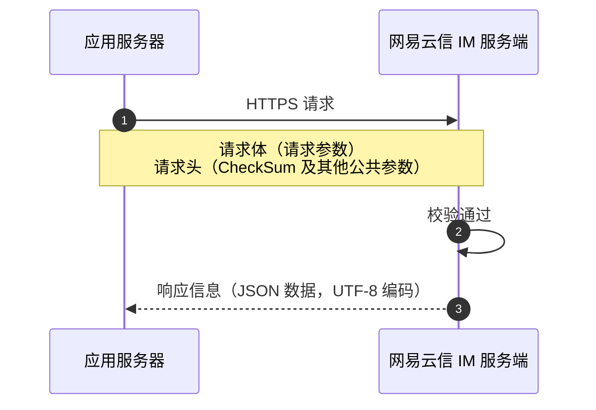

<!--keywords: IM,即时通讯,服务端 API,服务端,API 调用,请求结构,CheckSum,CheckSum 校验,请求头,Header,header,Body,body-->

应用服务端调用 API 向网易云信 IM 服务端发起的请求需遵循固定的请求结构和请求方式。

## 请求概述

应用服务端调用 API 向网易云信 IM 服务端发起的请求需遵循固定的请求结构和请求方式。

<style>
table th:first-of-type {
    width: 17%;
}
</style>



### 请求方式

- **通信协议**：IM 服务端 API 是简单的 HTTP/HTTPS 接口，适配各种语言。

- **请求方式**：应用服务端向 IM 服务端发起的所有请求都只支持 **POST** 方式。

### <span id="endpoint">**服务地址**</span>

为保障业务稳定性，网易云信 IM 服务提供了主备域名机制。当主域名发生故障时，您可以使用备用域名继续访问 API 服务。有关海外业务接入相关说明，请参考 [接入海外数据中心](https://doc.yunxin.163.com/messaging/concept/zA5OTg4Njc?platform=client)。

服务区域 | 主域名 | 备用域名 |
---- | ---- | ---- |
国内 | api.yunxinapi.com | api-cn-bak.yunxinapi.com |
海外 | api-sg.yunxinapi.com | api-sg-bak.yunxinapi.com |

:::note note
为确保服务的高可用性，网易云信建议：

- **配置多域名访问**：在业务系统中同时配置主备域名，当检测到主域名无法访问时，自动切换至备用域名。

- **使用 SDK 自动切换功能**：如果您使用 Java 开发语言，强烈建议通过网易云信提供的 [Server SDK](https://doc.yunxin.163.com/messaging2/server-apis/jQxNjEwMjI?platform=server) 接入，该 SDK 已内置多域名自动故障切换能力，无需您手动实现域名切换逻辑。

- **定期检查域名可用性**：建议在应用中实现定期检查域名可用性的机制，以便及时发现并应对可能的域名访问问题。
:::

## **请求结构**

IM 服务端 API 请求结构主要由下表所示三部分组成。

<div style="width:100px">组成部分</div> | 说明
:---- | :----
URL | 指向具体的业务请求，请参考各 API 文档。<note type="note"> 如果您的应用主要服务于海外用户，需将 URL 中的国内数据中心域名（`api.yunxinapi.com`）替换为海外数据中心域名（`api-sg.yunxinapi.com`）。详情请参考上文 [服务地址](#endpoint)。</note>
Header | 请求头，包含网易云信 App Key、CheckSum 等在内的 **公共请求参数**，用于鉴权。应用服务端请求 IM 服务端的所有 API 调用均采用 **相同** 的 Header 公共请求参数配置
Body | 请求体，包含 API 对应的业务参数，具体参考各 API 文档的 **请求参数** 小节

### 请求头参数

Header 参数为 **公共请求参数**，应用服务端请求网易云信 IM 服务端，都需在 Header 中配置如下参数。

参数名称 | 类型 | 是否必选 | 描述
---- | ---- | ---- | ----
`AppKey` | String | 是 | 通过网易云信控制台获取，请参考 <a href="https://doc.yunxin.163.com/console/concept/TIzMDE4NTA?platform=console">获取 App key</a>。
`Nonce` | String | 是 | 随机数（最大长度 128 个字符）。
`CurTime` | String | 是 | 当前 UTC 时间戳，从 1970 年 1 月 1 日 0 时 0 分 0 秒开始到 **现在** 的秒数。该时间用于计算 CheckSum 的有效期，请确保与标准时间同步。
`CheckSum` | String | 是 | SHA1(AppSecret + Nonce + CurTime)，将该三个参数拼接的字符串进行 SHA1 哈希计算从而生成 16 进制字符（小写）。<ul><li>出于安全性考虑，每个 `CheckSum` 的 **有效期** 为 **5 分钟**，即服务端接收到请求的时间与请求中的 `CurTime` 相差不能超过 5 分钟，建议每次请求都生成新的 `CheckSum`，同时 **请确认** 发起请求的服务器是与标准时间同步的，例如有 NTP 服务。</li><li>`CheckSum` 检验失败时会返回 414 错误码。更多错误码信息请参考 <a href="https://doc.yunxin.163.com/messaging/server-apis/TM5NTk2Mzc?platform=server" target="_blank">状态码</a>。</li> </ul>
`Content-Type` | String | 是 | 请求体的数据类型，类型均为 `application/x-www-form-urlencoded;charset=utf-8`。

<p hidden="hidden"> `RequestId`:（可选）请求的唯一标识，即相同的 `RequestId` 表示同一个请求。随机数，最大长度 128 位字符。</p>
<ul hidden="hidden"><li>`RequestId` 字段是用来防止服务端接口被重复调用，为非必填参数，服务器所有接口都支持此功能。</li><li>去重原理：当同一个用户（`AppKey` 相同）在 60 秒内访问同一个接口，并且 `RequestId` 相同，则服务端认为是重复请求，为了防止服务端重复处理，对业务造成影响（如重发消息），服务端会直接返回上次保存在缓存中的结果（重复访问的响应体中会增加 `duplicate=true` 的标识），而不做重复业务处理，需要注意的是服务端只缓存 `code=200` 的结果，对于状态码为 3XX、4XX、5XX 的结果不进行缓存。</li><li>适用场景：客户应用服务器调用网易云信服务端接口超时需要重试的场景（可以在 `HttpHeader` 中增加 `RequestId` 字段，重试请求的 `RequestId` 字段的值需与之前保持一致）。</li> </ul>

### **CheckSum 计算示例**

调用 IM 服务端 API 的请求，都需要在请求头（Header）中传入 `CheckSum` 进行鉴权。计算 `CheckSum` 的示例代码如下：

:::::: div linked-codes
::: code Java
```Java
import java.security.MessageDigest;

public class CheckSumBuilder {
    // 计算并获取 CheckSum
    public static String getCheckSum(String appSecret, String nonce, String curTime) {
        return encode("sha1", appSecret + nonce + curTime);
    }

    // 计算并获取 md5 值
    public static String getMD5(String requestBody) {
        return encode("md5", requestBody);
    }

    private static String encode(String algorithm, String value) {
        if (value == null) {
            return null;
        }
        try {
            MessageDigest messageDigest
                    = MessageDigest.getInstance(algorithm);
            messageDigest.update(value.getBytes());
            return getFormattedText(messageDigest.digest());
        } catch (Exception e) {
            throw new RuntimeException(e);
        }
    }
    private static String getFormattedText(byte[] bytes) {
        int len = bytes.length;
        StringBuilder buf = new StringBuilder(len * 2);
        for (int j = 0; j < len; j++) {
            buf.append(HEX_DIGITS[(bytes[j] >> 4) & 0x0f]);
            buf.append(HEX_DIGITS[bytes[j] & 0x0f]);
        }
        return buf.toString();
    }
    private static final char[] HEX_DIGITS = { '0', '1', '2', '3', '4', '5',
            '6', '7', '8', '9', 'a', 'b', 'c', 'd', 'e', 'f' };
}
```
:::
::: code Node.js
```JavaScript
const { SHA1 } = require("crypto-js");

function randString(x) {
  let s = "";
  while (s.length < x && x > 0) {
    const v = Math.random() < 0.5 ? 32 : 0;
    s += String.fromCharCode(
      Math.round(Math.random() * (122 - v - (97 - v)) + (97 - v))
    );
  }
  return s;
}

const [Nonce, CurTime] = [randString(20), new Date().getTime().toString().slice(0, 10)];

function CheckSum(AppSecret, Nonce, CurTime) {
  return SHA1(AppSecret + Nonce + CurTime);
}
```
:::
::::::

::: note important
- 请妥善保管用于计算 `CheckSum` 的 `AppSecret`，可在应用服务器存储和使用，但不应存储或传递到客户端，也不应在网页等前端代码中嵌入。
- 由于网络原因，网易云信服务器可能会重复请求，开发者请注意进行去重操作。
:::

### 请求体参数

传入请求体（Body）的 **具体业务参数** 请参考各 API 文档。以注册 IM 账号为例，对应的业务参数配置说明请参考 <a href="https://doc.yunxin.163.com/messaging/server-apis/DQ3Nzk1MTY?platform=server#请求参数" target="_blank">注册 IM 账号</a>。

::: note notice
请求参数（即传入 Body 的具体业务参数）无论为何类型，实际传入时都需要转为 String 格式，否则将报错。具体的案例请参考 [新手指南中的常见问题](https://doc.yunxin.163.com/messaging/docs/TE0ODUzMDI?platform=server#为什么按照-boolean-格式传入参数最终调用-api-失败)。
:::

## 响应概述

调用 IM 服务端 API 的返回类型均为 JSON，同时进行 UTF-8 编码。

如调用成功，则返回状态码 `200`。表示调用异常的具体状态码及相应的排查指引请参考 <a href="https://doc.yunxin.163.com/messaging/server-apis/TM5NTk2Mzc?platform=server" target="_blank">状态码</a>。

::: note notice
状态码的含义均为开放式，不同接口返回的相同状态码，含义可能略有不同。因此 **不建议** 您针对状态码开发业务逻辑。如果对状态码存在依赖，会有风险。
:::