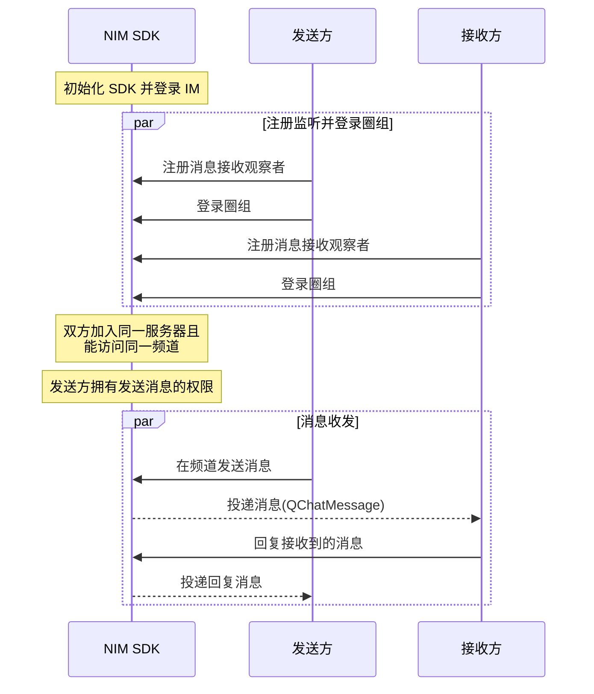

NIM SDK 提供会话消息回复（Thread）功能，可引用接收到的某一条消息进行针对性的回复，形成起始于该消息的消息回复树状结构。通过该功能，用户可针对某一条消息进行提问、反馈或补充相关背景信息，且不会对频道内的会话流造成干扰。


:::note notice
圈组的会话消息回复功能只能在圈组内使用，且相关接口和即时通讯 IM 的不一样。
:::

## 功能介绍

### **什么是 Thread**

Thread 指以一条消息作为根消息的消息回复树状结构，示例见下图。


上图中：

- 消息 A 是消息 B 的**父消息**，消息 B1 是消息 C 的**父消息**
- 消息 C 是消息 B1 的**子消息**
- 消息 A 是消息 B 和消息 C 的**根消息**
- 消息 A、B、C 统称为 **Threaded Message（串联起来的消息）**

::: note note :::
- 一条 Threaded Message 必须有一条父消息或至少一条子消息。如果一条消息既没有父消息，也没有子消息，则为普通消息。
- 若未开通会话消息回复功能，回复时系统会自动将所发消息转换为一条普通消息。
:::

### **UI 示例**

会话消息回复（Thread）的 UI 示例如下：


## 前提条件

开始会话消息回复相关功能集成前，请确保：

- 已[开通圈组的消息回复功能](https://doc.yunxin.163.com/messaging/guide/TU3MjAzMjE?platform=android#圈组子功能列表说明)。圈组的会话消息回复功能需要在开通圈组功能的基础上额外开通后才能使用。
- 已完成圈组初始化。

## 实现方法

### **实现会话消息回复**

#### **API调用时序**
以下时序图可能因为网络问题而显示异常。如显示异常，一般刷新当前页面即可正常显示。




#### **具体流程**


::: note note 
本节仅对上图中标为部分的流程进行说明，其他流程请参考相关文档。例如：
- 服务器成员相关说明，可参见<a href="https://doc.yunxin.163.com/messaging/guide/DIzODU1MDQ?platform=android" target="_blank">圈组服务器成员管理</a>。
- 用户是否能访问某频道的相关说明，可参见<a href="https://doc.yunxin.163.com/messaging/guide/zI4MTQ4ODU?platform=android" target="_blank">频道黑白名单</a>。
- 权限相关配置说明，可参见[身份组相关](https://doc.yunxin.163.com/messaging/guide/DU4NzI0NjU?platform=android)。
:::
<br>

1. 发送方和接收方在登录圈组前，注册<a href="https://doc.yunxin.163.com/docs/interface/messaging/android/doxygen/Latest/zh/interfacecom_1_1netease_1_1nimlib_1_1sdk_1_1qchat_1_1_q_chat_service_observer.html#a0283c8f5f0af88406669413f4f6ff044" target="_blank">`observeReceiveMessage`</a>消息接收观察者，监听消息接收。

    示例代码如下：

    ```
    NIMClient.getService(QChatServiceObserver.class).observeReceiveMessage(new Observer<List<QChatMessage>>() {
        @Override
        public void onEvent(List<QChatMessage> qChatMessages) {
            //收到消息qChatMessages
            for (QChatMessage qChatMessage : qChatMessages) {
                //处理消息
            }
        }
    }, true);
    ```

2. 接收方在收到消息后，调用<a href="https://doc.yunxin.163.com/docs/interface/messaging/android/doxygen/Latest/zh/interfacecom_1_1netease_1_1nimlib_1_1sdk_1_1qchat_1_1_q_chat_message_service.html#a3791428e26b1e95bff7c76662fcccf27" target="_blank">`replyMessage`</a>方法发送回复消息。

    ::: note notice
    - 需要拥有发送消息的权限才能回复消息。
    - 两条消息的`serverId` 和 `channelId` 必须相同，因为只能在同一个服务器和频道内回复消息。
    :::

    示例代码如下：


    ```
    QChatSendMessageParam param = new QChatSendMessageParam(1607312,1492446, MsgTypeEnum.text);
    param.setBody("回复消息测试");

    QChatMessage replyMessage = getMessage();

    NIMClient.getService(QChatMessageService.class).replyMessage(new QChatReplyMessageParam(param,replyMessage)).setCallback(
            new RequestCallback<QChatSendMessageResult>() {
            @Override
            public void onSuccess(QChatSendMessageResult result) {
                //回复消息成功,返回发送成功的消息具体信息
                QChatMessage message = result.getSentMessage();
            }

            @Override
            public void onFailed(int code) {
                //回复消息失败，返回错误code
            }

            @Override
            public void onException(Throwable exception) {
                //回复消息异常
            }
        });

    ```
3. `observeReceiveMessage`观察者回调函数触发，发送方收到接收方回复的消息。

### **相关查询**

#### **根据消息 ID 批量查询回复消息**


调用<a href="https://doc.yunxin.163.com/docs/interface/messaging/android/doxygen/Latest/zh/interfacecom_1_1netease_1_1nimlib_1_1sdk_1_1qchat_1_1_q_chat_message_service.html#a85c459cec8b49592cb797814b5b078df" target="_blank">`getMessageHistoryByIds`</a>，可根据回复消息的`msgIdServer`查询历史回复消息。查询结果不分页，一次最多查询 100 条。

该方法的入参结构`QChatGetMessageHistoryByIdsParam`中需要传入需要查询的`serverId`、`channelId`和回复消息列表`QChatMessageRefer`。该方法的回参结构`QChatGetMessageHistoryResult`中返回查询到的消息列表。


示例代码
```
List<QChatMessageRefer> messageReferList = getMessageRefersList();
QChatGetMessageHistoryByIdsParam param = new QChatGetMessageHistoryByIdsParam(1607312,1492446,messageReferList);
NIMClient.getService(QChatMessageService.class).getMessageHistoryByIds(param).setCallback(
        new RequestCallback<QChatGetMessageHistoryResult>() {
            @Override
            public void onSuccess(QChatGetMessageHistoryResult param) {
                //查询成功，返回查询到的消息列表
                List<QChatMessage> messages = param.getMessages();
            }

            @Override
            public void onFailed(int code) {
                //查询失败，返回错误code
            }

            @Override
            public void onException(Throwable exception) {
                //查询异常
            }
        });
```

#### **查询某消息的父消息以及根消息**

调用<a href="https://doc.yunxin.163.com/docs/interface/messaging/android/doxygen/Latest/zh/interfacecom_1_1netease_1_1nimlib_1_1sdk_1_1qchat_1_1_q_chat_message_service.html#af9505ade1bcead6eec4c05ef03c3fa77" target="_blank">`getReferMessages`</a>查询 Thread 中某条消息的父消息和根消息。 

- 该方法入参结构`QChatGetReferMessagesParam`中需要传入的消息引用类型`QChatMessageReferType`三种选择：
    * `REPLAY`：只查询父消息
    * `THREAD`：只查询根消息
    * `ALL`：同时查询父消息消息和根消息


    ::: note notice :::
    `QChatGetReferMessagesParam`传入的需要查询的消息不能是根消息，否则会返回 414 错误码。
    :::

- 该方法入参结构`QChatGetReferMessagesResult`中返回父消息和根消息。
    * 如果`QChatMessageReferType`为`REPLAY`或`ALL`才返回父消息，否则`getReplyMessage`返回为 null
    * 如果`QChatMessageReferType`为`THREAD`或`ALL`才返回根消息，否则`getThreadMessage`返回为 null


- 示例代码

    ```
    QChatMessage message = getQueryMessage();
    QChatMessageReferType referType = QChatMessageReferType.REPLAY;

    NIMClient.getService(QChatMessageService.class).getReferMessages(new QChatGetReferMessagesParam(message,referType)).setCallback(
            new RequestCallback<QChatGetReferMessagesResult>() {
                @Override
                public void onSuccess(QChatGetReferMessagesResult result) {
                    //查询成功
                    //如果QChatMessageReferType为REPLAY或ALL才有，否则为null
                    QChatMessage replyMessage = result.getReplyMessage();
                    //如果QChatMessageReferType为THREAD或ALL才有，否则为null
                    QChatMessage threadMessage = result.getThreadMessage();
                }

                @Override
                public void onFailed(int code) {
                    //查询失败，返回错误code
                }

                @Override
                public void onException(Throwable exception) {
                    //查询异常
                }
            });
    ```

#### **查询 Thread 的消息列表**

调用<a href="https://doc.yunxin.163.com/docs/interface/messaging/android/doxygen/Latest/zh/interfacecom_1_1netease_1_1nimlib_1_1sdk_1_1qchat_1_1_q_chat_message_service.html#a24b720cf8bf1daf457171be31ad36557" target="_blank">`getThreadMessages`</a>方法，可根据某个 Thread 中的任意一条消息分页查询该 Thread 的消息列表（即该 Thread 的聊天历史）。


- 该方法的入参结构`QChatGetThreadMessagesParam`需要传入待查询的消息和消息查询选项`QChatMessageQueryOption`；回参结构`QChatGetThreadMessagesResult`会返回根消息、Thread 聊天信息 `QChatMessageThreadInfo` 和查询到的消息列表。其中`QChatMessageThreadInfo`中返回 Thread 的总回复数和最后一条消息的时间戳。


    `QChatMessageQueryOption`的参数说明如下：
    类型  | 参数  | 说明     
    ----  | ----  | --------- 
    Long|`fromTime`|起始时间
    Long|`toTime`|结束时间，如果设置为 0 则为当前时间
    Long|`excludeMessageId`|排除消息ID。如果`fromTime`上有多条消息，可以通过该参数指定实际的起始时间为 `excludeMsgId` 对应的消息的下一条消息的时间
    Integer|`limit`| 查询结果条数限制，默认 100 条。如果`fromTime`到 `toTime` 之间消息大于 `limit` 条，返回 `limit` 条记录；如果小于 `limit` 条，返回实际条数；当已经查询到头时，返回的结果列表的 size 可能会比 `limit` 小
    Boolean|`reverse`| 是否反向查询（默认 false ，表示从 `toTime` 开始往前查找历史消息），可以通过 `setReverse` 设置是否反向。<br><p>如果17:00:00 到18:00:00的消息总共有200条，查询该时段最多返回 100 条：<p><ul><li>如果`isReverse() ==false`（即默认方式），则返回后100条，时间逆序排列，时间从新到旧</li><li>如果`isReverse() ==true`（反向方式），则前100条，时间正序排列，时间从旧到新</li></ul>


    ::: note notice
    当进行首次查询时，如果要查最新的100条，则`fromTime=0`, `toTime=0`, `limit=0`。
    :::


- 示例代码

    ```
    QChatMessage message = getQueryMessage();
    QChatMessageQueryOption messageQueryOption = new QChatMessageQueryOption();
    //查询最新的100条Thread聊天消息
    NIMClient.getService(QChatMessageService.class).getThreadMessages(new QChatGetThreadMessagesParam(message,messageQueryOption)).setCallback(
            new RequestCallback<QChatGetThreadMessagesResult>() {
                @Override
                public void onSuccess(QChatGetThreadMessagesResult result) {
                    //查询成功
                    //根消息
                    QChatMessage threadMessage = result.getThreadMessage();
                    //Thread聊天信息,包含Thread聊天的总回复数和Thread聊天中最后一条消息的时间戳
                    QChatMessageThreadInfo threadInfo = result.getThreadInfo();
                    //Thread聊天中的回复消息列表（不包含根消息）
                    List<QChatMessage> messages = result.getMessages();
                }

                @Override
                public void onFailed(int code) {
                    //查询失败，返回错误code
                }

                @Override
                public void onException(Throwable exception) {
                    //查询异常
                }
            });
    ```

#### **批量查询根消息meta信息**

调用<a href="https://doc.yunxin.163.com/docs/interface/messaging/android/doxygen/Latest/zh/interfacecom_1_1netease_1_1nimlib_1_1sdk_1_1qchat_1_1_q_chat_message_service.html#ac4d4fa8247d0d82bd5c88726876c5882" target="_blank">`getMessageThreadInfos`</a>方法，可批量查询某个频道下的多个 Thread 的根消息的 meta 信息（如总回复数和最后回复时间）。


该方法的入参结构`QChatGetMessageThreadInfosParam`中需要传入需要查询的`serverId`、`channelId`和根消息列表。该方法的回参结构`QChatGetMessageThreadInfosResult`返回 Thread 聊天信息 Map，key 为传入的根消息的 uuid，value 为 `QChatMessageThreadInfo`。

示例代码如下：

```
List<QChatMessage> msgList = getThreadMsgList();
NIMClient.getService(QChatMessageService.class).getMessageThreadInfos(new QChatGetMessageThreadInfosParam(1607312,1492446,msgList)).setCallback(
        new RequestCallback<QChatGetMessageThreadInfosResult>() {
            @Override
            public void onSuccess(QChatGetMessageThreadInfosResult result) {
                //查询成功,返回Thread聊天信息Map，key为传入根消息的uuid，value为QChatMessageThreadInfo
                Map<String, QChatMessageThreadInfo> messageThreadInfoMap = result.getMessageThreadInfoMap();
            }

            @Override
            public void onFailed(int code) {
                //查询失败，返回错误code
            }

            @Override
            public void onException(Throwable exception) {
                //查询异常
            }
        });
```


    
    

