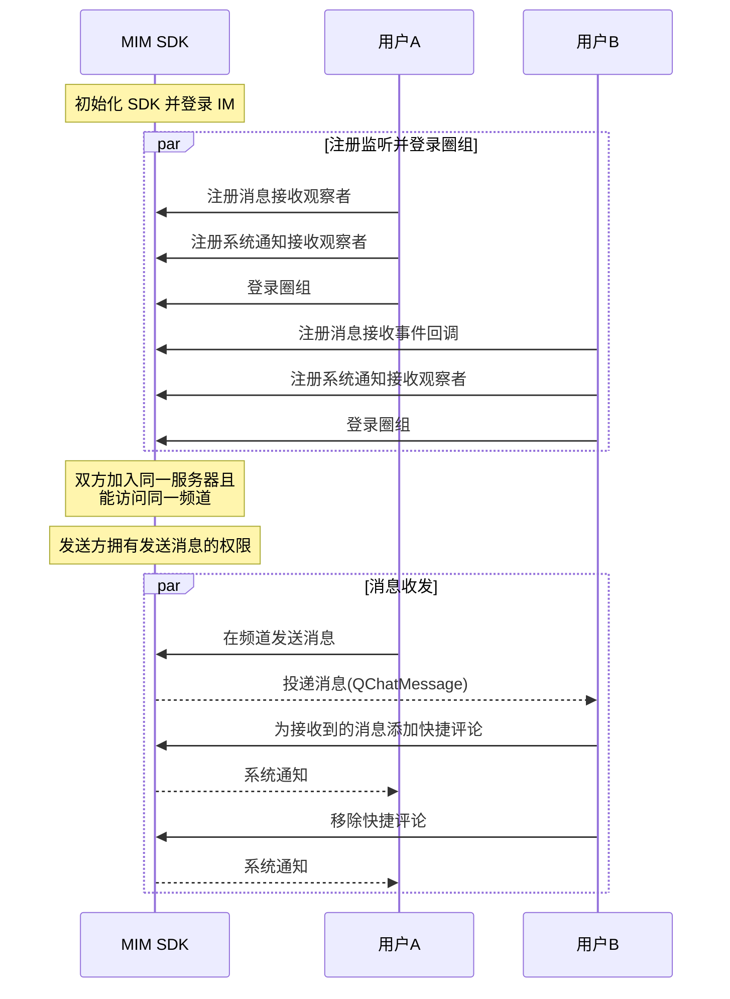

快捷评论是一个操作功能，并非一种消息类型。评论内容并非一条消息，而是一个 int 类型，由开发者指定评论内容与界面展示之间的联系。

快捷评论的 UI 示例见下图。


## 前提条件

开始圈组快捷评论相关集成前，请确保：

- 已[开通圈组的快捷评论功能](https://doc.yunxin.163.com/messaging/guide/TU3MjAzMjE?platform=android)。圈组的快捷评论功能需要在开通圈组功能的基础上额外开通后才能使用。
- 已完成圈组初始化。


## 实现方法

### 添加/移除快捷评论

#### **API 调用时序**
以下时序图可能因为网络问题而显示异常。如显示异常，一般刷新当前页面即可正常显示。




#### **具体流程**

::: note note 
本节仅对上图中标为部分的流程进行说明，其他流程请参考相关文档。例如：
- 服务器成员相关说明，可参见<a href="https://doc.yunxin.163.com/messaging/guide/DIzODU1MDQ?platform=android" target="_blank">圈组服务器成员管理</a>。
- 用户是否能访问某频道的相关说明，可参见<a href="https://doc.yunxin.163.com/messaging/guide/zI4MTQ4ODU?platform=android" target="_blank">频道黑白名单</a>。
- 权限相关配置说明，可参见[身份组相关](https://doc.yunxin.163.com/messaging/guide/DU4NzI0NjU?platform=android)。
:::
<br>

1. 用户A和用户B注册回调函数并登录。

    - 注册<a href="https://doc.yunxin.163.com/docs/interface/messaging/android/doxygen/Latest/zh/interfacecom_1_1netease_1_1nimlib_1_1sdk_1_1qchat_1_1_q_chat_service_observer.html#a0283c8f5f0af88406669413f4f6ff044" target="_blank">`observeReceiveMessage`</a>消息接收观察者，监听消息接收。
    - 注册<a href="https://doc.yunxin.163.com/docs/interface/messaging/android/doxygen/Latest/zh/interfacecom_1_1netease_1_1nimlib_1_1sdk_1_1qchat_1_1_q_chat_service_observer.html#a243ce250bbef08d40a52f24f12d1007c" target="_blank">`observeReceiveSystemNotification`</a>系统通知接收观察者，监听快捷评论添加和移除。

    示例代码如下：
    :::::: div custom-tabs
    ::: tab 注册消息接收观察者

    ```
    NIMClient.getService(QChatServiceObserver.class).observeReceiveMessage(new Observer<List<QChatMessage>>() {
        @Override
        public void onEvent(List<QChatMessage> qChatMessages) {
            //收到消息qChatMessages
            for (QChatMessage qChatMessage : qChatMessages) {
                //处理消息
            }
        }
    }, true);
    ```
    :::
    ::: tab 注册系统通知接收观察者
    ```
    NIMClient.getService(QChatServiceObserver.class).observeReceiveSystemNotification(new Observer<List<QChatSystemNotification>>() {
    @Override
    public void onEvent(List<QChatSystemNotification> qChatSystemNotifications) {
      //收到系统通知
      for (QChatSystemNotification qChatSystemNotification : qChatSystemNotifications) {
      //处理系统通知
      }
    }
    }, true);
    ```
    :::
    ::::::

2. 用户B在收到消息后，调用<a href="https://doc.yunxin.163.com/docs/interface/messaging/android/doxygen/Latest/zh/interfacecom_1_1netease_1_1nimlib_1_1sdk_1_1qchat_1_1_q_chat_message_service.html#a64c330cfa28962962be4108efd3bb7fa" target="_blank">`addQuickComment`</a>方法为接收到的消息添加快捷评论。调用成功后，系统通知接收观察者的回调触发，用户A收到系统通知（`QChatSystemNotificationType.UPDATE_QUICK_COMMENT`）。

    该方法的入参结构`QChatRemoveQuickCommentParam`需要传入待评论的消息`QChatMessage`和评论类型（int类型）。


    ::: note note 
    用户也可在搜索/查询消息后为消息添加快捷评论，本文仅以接收消息后添加快捷评论作为示例进行说明。
    :::


    ::: note notice
    云信服务端**不会**下发相关系统通知给发起“添加快捷评论”操作的设备，因为操作者不需要接收当前操作的通知。但如果操作者使用相同 IM 账号在其他设备登录，将收到该通知。
    :::


    <br>

    示例代码如下：

    ```
    QChatMessage message = getMessage();
    int type = 1;
    NIMClient.getService(QChatMessageService.class).addQuickComment(new QChatAddQuickCommentParam(message,type)).setCallback(
            new RequestCallback<Void>() {
                @Override
                public void onSuccess(Void param) {
                    //添加成功
                }

                @Override
                public void onFailed(int code) {
                    //添加失败，返回错误code
                }

                @Override
                public void onException(Throwable exception) {
                    //添加异常
                }
            });

    ```


3. （可选）用户B调用<a href="https://doc.yunxin.163.com/docs/interface/messaging/android/doxygen/Latest/zh/interfacecom_1_1netease_1_1nimlib_1_1sdk_1_1qchat_1_1_q_chat_message_service.html#a5d9e949fd1156b0d6d00063ec13d66f6" target="_blank">`removeQuickComment`</a> 方法移除快捷评论。调用成功后，系统通知接收观察者的回调函数触发，用户A收到系统通知（`QChatSystemNotificationType.UPDATE_QUICK_COMMENT`）。

    该方法的入参结构`QChatRemoveQuickCommentParam`需要传入待评论的消息`QChatMessage`和评论类型（int类型）。

    ::: note notice
    云信服务端**不会**下发相关系统通知给发起“移除快捷评论”操作的设备，因为操作者不需要接收当前操作的通知。但如果操作者使用相同 IM 账号在其他设备登录，将收到该通知。
    :::

    <br>


    示例代码如下：

    
    ```
    QChatMessage message = getMessage();
    int type = 1;
    NIMClient.getService(QChatMessageService.class).removeQuickComment(new QChatRemoveQuickCommentParam(message,type)).setCallback(
            new RequestCallback<Void>() {
                @Override
                public void onSuccess(Void param) {
                    //删除成功
                }

                @Override
                public void onFailed(int code) {
                    //删除失败，返回错误code
                }

                @Override
                public void onException(Throwable exception) {
                    //删除异常
                }
            });

    ```
### 查询快捷评论列表

调用<a href="https://doc.yunxin.163.com/docs/interface/messaging/android/doxygen/Latest/zh/interfacecom_1_1netease_1_1nimlib_1_1sdk_1_1qchat_1_1_q_chat_message_service.html#a07c0c111ae6de37667f7d7c0d4413c1a" target="_blank">`getQuickComments`</a>可查询指定消息所包含的快捷评论列表。

- 该方法的入参结构`QChatGetQuickCommentsParam`中需要传入需要查询的`serverId`、`channelId`和消息列表。回参结构`QChatGetQuickCommentsResult`返回快捷评论详情 Map，key 为消息的`msgIdServer`，value 为`QChatMessageQuickCommentDetail`。

    其中`QChatMessageQuickCommentDetail`的方法说明如下：

    返回值  | 方法 | 说明     
    ----  | ----  | --------- 
    Long|`getServerId`|获取服务器Id
    Long|`getChannelId`|获取channelId
    Long|`getMsgIdServer`|获取消息服务端Id
    int|`getTotalCount`|获取总评论数
    Long|`getLastUpdateTime`|获取消息评论最后一次操作的时间
    `List<QChatQuickCommentDetail>`|`getDetails`|获取评论详情列表

    其中`QChatQuickCommentDetail`的参数说明如下：
    
    返回值  | 参数  | 说明     
    ---- | ----  | --------- 
    int|`getType`|获取评论类型
    int|`getCount`|获取评论数量
    boolean|`hasSelf`|自己是否添加了该类型评论
    `List<String>`|`getSeveralAccids`|获取若干个添加了此类型评论的用户 ID （`accid`）列表，随机获取结果
    Long|`getCreateTime`|获取评论的创建时间

- 示例代码
    ```
    List<QChatMessage> messages = getQueryMessages();
    NIMClient.getService(QChatMessageService.class).getQuickComments(new QChatGetQuickCommentsParam(currentChannel.getServerId(),
            currentChannel.getChannelId(),messages)).setCallback(
            new RequestCallback<QChatGetQuickCommentsResult>() {
                @Override
                public void onSuccess(QChatGetQuickCommentsResult result) {
                    //查询成功,获取消息快捷评论详情Map，key为MsgIdServer
                    Map<Long, QChatMessageQuickCommentDetail> messageQuickCommentDetailMap = result.getMessageQuickCommentDetailMap();
                }

                @Override
                public void onFailed(int code) {
                    //查询失败，返回错误code
                }

                @Override
                public void onException(Throwable exception) {
                    //查询异常
                }
            });
    ```

### <span id="分页获取评论者列表">分页获取评论者列表</span>


调用 [`QChatMessageService#getCommentators`](https://doc.yunxin.163.com/docs/interface/messaging/android/doxygen/Latest/zh/interfacecom_1_1netease_1_1nimlib_1_1sdk_1_1qchat_1_1_q_chat_message_service.html#a38c57f8cf0d96866712fedd8e4ffcb85) 方法可查询快捷评论消息的评论者列表。

- 参数说明

| 参数名称| 类型   | 是否必填| 默认值| 描述   |
| :------- | :----------------- | :------ | :-------- | :---------------------------------------------------------- |
|  `param` | @NonNull [`QChatGetCommentatorsParam`](https://doc.yunxin.163.com/docs/interface/messaging/android/doxygen/Latest/zh/classcom_1_1netease_1_1nimlib_1_1sdk_1_1qchat_1_1param_1_1_q_chat_get_commentators_param.html)  |   是    |     -    |  快捷评论者查询参数  |

`QChatGetCommentatorsParam` 说明：

| 参数名称|  是否必填| 描述   |
| :-------  | :-------- | :-------- | 
|  `serverId` | 是 | 圈组服务器 ID，必须大于 0。  | 
|  `channelId` |  是 |  圈组频道 ID，必须大于 0。  | 
|  `messageServerId` |  是 |  圈组消息的服务端 ID，必须大于 0。  | 
|  `type` |  是 | 快捷评论的类型  | 
|  `limit` |  否 | 本次查询的最大数量，默认 100，不可超过 100。  | 
|  `pageToken` |  否 | 分页标识，首页不传，获取下一页时传入上一页返回的 `QChatGetCommentatorsResult#getPageToken`。  | 

- 返回值

    - 查询成功，返回 [`QChatGetCommentatorsResult`](https://doc.yunxin.163.com/docs/interface/messaging/android/doxygen/Latest/zh/classcom_1_1netease_1_1nimlib_1_1sdk_1_1qchat_1_1result_1_1_q_chat_get_commentators_result.html)。
    - 查询失败，返回错误码。


- 示例代码

```java
// Set QChatGetCommentatorsParam
QChatGetCommentatorsParam param = new QChatGetCommentatorsParam(serverId, channelId, messageServerId, type);
param.setLimit(limit);            // limit 选填
param.setPageToken(pageToken);    // pageToken 选填

// Call QChatMessageService.getCommentators(param)
NIMClient.getService(QChatMessageService.class).getCommentators(param)
    .setCallback(new RequestCallbackWrapper<QChatGetCommentatorsResult>() {
        /**
         * 调用结果回调函数
         * @param code
         * @param result
         * @param exception
         */
        @Override
        public void onResult(int code, QChatGetCommentatorsResult result, Throwable exception) {
            // Get code/result/exception
        }
    });
```


