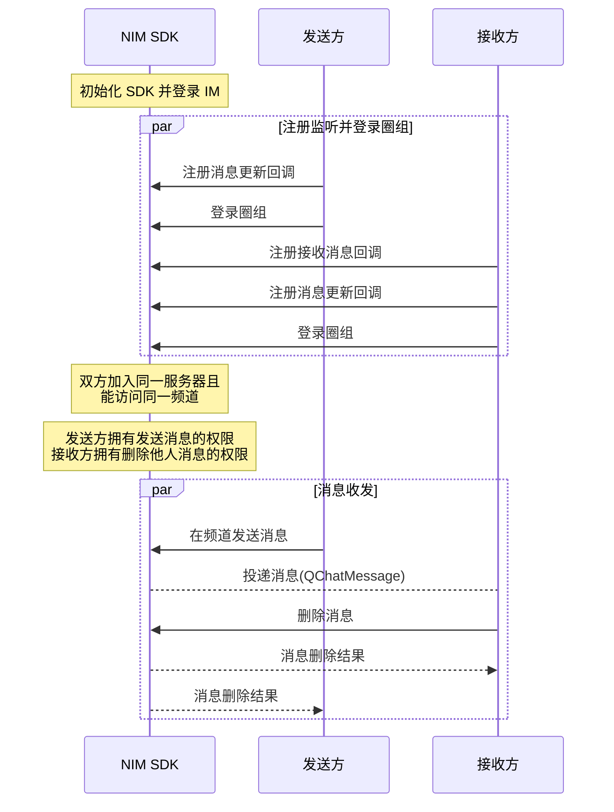

NIM SDK 的<a href="https://doc.yunxin.163.com/docs/interface/messaging/android/doxygen/Latest/zh/interfacecom_1_1netease_1_1nimlib_1_1sdk_1_1qchat_1_1_q_chat_message_service.html" target="_blank">`QChatMessageService`</a>接口提供方法支持在发送消息后删除消息。

::: note notice
消息发送方和拥有删除他人消息权限（`DELETE_MSG`）的频道成员都可删除消息。 
:::

## 前提条件

- 已[开通圈组功能](https://doc.yunxin.163.com/messaging/guide/TU3MjAzMjE?platform=android)。
- 已完成圈组初始化。

## 实现流程

### API 调用时序
以下时序图可能因为网络问题而显示异常。如显示异常，一般刷新当前页面即可正常显示。



### 具体流程

::: note note 
本节仅对上图中标为部分的流程进行说明，其他流程请参考相关文档。例如：
- 服务器成员相关说明，可参见<a href="https://doc.yunxin.163.com/messaging/guide/DIzODU1MDQ?platform=android" target="_blank">圈组服务器成员管理</a>。
- 用户是否能访问某频道的相关说明，可参见<a href="https://doc.yunxin.163.com/messaging/guide/zI4MTQ4ODU?platform=android" target="_blank">频道黑白名单</a>。
- 权限相关配置说明，可参见[身份组相关](https://doc.yunxin.163.com/messaging/guide/DU4NzI0NjU?platform=android)。
:::
<br>

1. 注册回调函数并登录。
    - 发送方在登录圈组前，注册<a href="https://doc.yunxin.163.com/docs/interface/messaging/android/doxygen/Latest/zh/interfacecom_1_1netease_1_1nimlib_1_1sdk_1_1qchat_1_1_q_chat_service_observer.html#a8a3bd8f0fdfd0467e74ffd1bab6796f7" target="_blank">`observeMessageDelete`</a>消息删除观察者，监听消息删除。
    - 接收方在登录圈组前，注册<a href="https://doc.yunxin.163.com/docs/interface/messaging/android/doxygen/Latest/zh/interfacecom_1_1netease_1_1nimlib_1_1sdk_1_1qchat_1_1_q_chat_service_observer.html#a0283c8f5f0af88406669413f4f6ff044" target="_blank">`observeReceiveMessage`</a>消息接收观察者和`observeMessageDelete`消息删除观察者，分别监听消息接收和消息删除。

    示例代码如下：

    :::::: div custom-tabs
    ::: tab 注册消息接收观察者

    ```
    NIMClient.getService(QChatServiceObserver.class).observeReceiveMessage(new Observer<List<QChatMessage>>() {
        @Override
        public void onEvent(List<QChatMessage> qChatMessages) {
            //收到消息qChatMessages
            for (QChatMessage qChatMessage : qChatMessages) {
                //处理消息
            }
        }
    }, true);
    ```
    :::
    ::: tab 注册消息删除观察者
    ```
    NIMClient.getService(QChatServiceObserver.class).observeMessageDelete(new Observer<QChatMessageDeleteEvent>() {
        @Override
        public void onEvent(QChatMessageDeleteEvent event) {
            //收到删除后的消息qChatMessage
            QChatMessage message = event.getMessage();

        }
    }, true);
    ```
    :::
    ::::::
    
2. 接收方在收到消息后，调用<a href="https://doc.yunxin.163.com/docs/interface/messaging/android/doxygen/Latest/zh/interfacecom_1_1netease_1_1nimlib_1_1sdk_1_1qchat_1_1_q_chat_message_service.html#aa1395253d485995be23c3d792040633a" target="_blank">`deleteMessage`</a>方法删除消息。

    该方法入参结构`QChatDeleteMessageParam` 必须传入更新操作通用参数、消息所属的服务器的 ID、消息所属的频道的 ID、消息发送时间以及消息服务端 ID。

    ::: note notice
    删除未读消息将影响未读数。
    :::

    <br>
    
    示例代码如下：

    ```
    QChatUpdateParam updateParam = new QChatUpdateParam();
    updateParam.setPostscript("附言");
    updateParam.setExtension("操作扩展字段");
    NIMClient.getService(QChatMessageService.class).deleteMessage(new QChatDeleteMessageParam(updateParam,943445L,885305L,currentMessage.getTime(),currentMessage.getMsgIdServer()))
            .setCallback(new RequestCallback<QChatDeleteMessageResult>() {
                @Override
                public void onSuccess(QChatDeleteMessageResult result) {
                    //删除成功，返回删除后的消息
                    QChatMessage message = result.getMessage();
                }

                @Override
                public void onFailed(int code) {
                    //删除失败，返回错误code
                }

                @Override
                public void onException(Throwable exception) {
                    //删除异常
                }
            });

    ```

3. `observeMessageDelete`观察者回调函数触发，将消息删除结果投递至接收方和发送方。

## 相关信息
圈组各端 （Android、iOS、Windows 和 含圈组版 Web）监听消息更新、消息撤回和消息删除的方式略有差异，具体为：Android 将消息更新、消息撤回和消息删除三个事件进行区分；而其他端的消息撤回和消息删除事件，都并入消息更新事件，不进行区分。

各端的相关事件回调接口如下：

|  | Android | iOS | Windows  | 含圈组版 Web |
|---- | -------- | ------| ---|
|**监听消息更新** | [`observeMessageUpdate`](https://doc.yunxin.163.com/docs/interface/messaging/android/doxygen/Latest/zh/interfacecom_1_1netease_1_1nimlib_1_1sdk_1_1qchat_1_1_q_chat_service_observer.html#a9db8d9bcafa0f15b402cd9941e8ec874) | [`onMessageUpdate:`](https://doc.yunxin.163.com/docs/interface/messaging/iOS/doxygen/Latest/zh/d4/d3f/protocol_n_i_m_q_chat_message_manager_delegate-p.html#a4ae4b554d71de6b99f5428c38bd7824d)  | [`RegUpdatedCb`](https://doc.yunxin.163.com/docs/interface/messaging/pc/doxygen/Latest/zh/classnim_1_1_message.html#a0d47693a07a9eb59072054e71dbc46bf)  |  [`messageUpdate`](https://doc.yunxin.163.com/docs/interface/messaging-enhanced/web/typedoc/Latest/zh/QChat/interfaces/QChatInterface.QChatEventInterface.html#messageUpdate) |
|**监听消息撤回** | [`observeMessageRevoke`](https://doc.yunxin.163.com/docs/interface/messaging/android/doxygen/Latest/zh/interfacecom_1_1netease_1_1nimlib_1_1sdk_1_1qchat_1_1_q_chat_service_observer.html#aa45c9939e58acf7867853e87d5460680)  | ^^ |   ^^ |  ^^ |
|**监听消息删除** | [`observeMessageDelete`](https://doc.yunxin.163.com/docs/interface/messaging/android/doxygen/Latest/zh/interfacecom_1_1netease_1_1nimlib_1_1sdk_1_1qchat_1_1_q_chat_service_observer.html#a8a3bd8f0fdfd0467e74ffd1bab6796f7)| ^^ |  ^^ | ^^  |