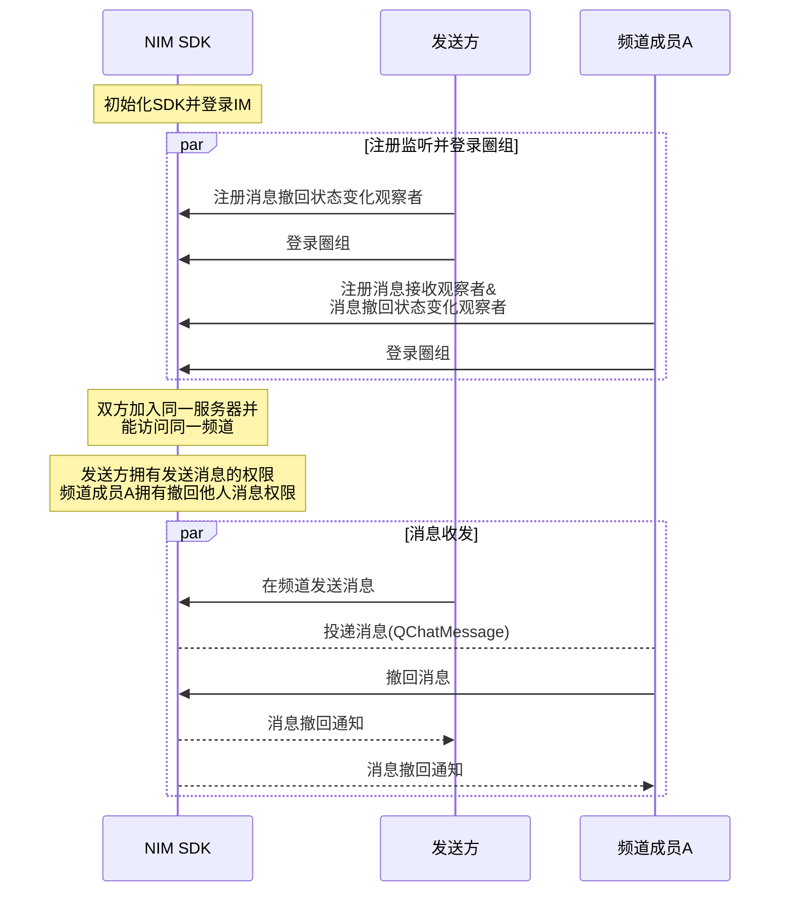

NIM SDK 的<a href="https://doc.yunxin.163.com/docs/interface/messaging/android/doxygen/Latest/zh/interfacecom_1_1netease_1_1nimlib_1_1sdk_1_1qchat_1_1_q_chat_message_service.html" target="_blank">`QChatMessageService`</a>接口提供圈组消息撤回的方法，支持在消息发送后将消息撤回。圈组的消息撤回功能属于双向撤回。撤回之后，消息接收者和发送者都将收到一条消息撤回通知。

::: note notice
消息发送方和拥有撤回他人消息权限（`RECALL_MSG`）的频道成员都可撤回消息。 
:::


## 前提条件

- 已[开通圈组功能](https://doc.yunxin.163.com/messaging/guide/TU3MjAzMjE?platform=android)。
- 已完成圈组初始化。


## 使用限制

圈组消息可撤回时长默认为 120s，即默认只能在消息发送后 2 分钟内撤回消息。

若需要扩展上限，可在控制台配置圈组子功能项（**圈组消息可撤回时长**），具体请参考[开通和配置圈组功能](https://doc.yunxin.163.com/messaging/guide/TU3MjAzMjE?platform=android)。


## 实现流程

### 流程概览

::: note note 
本文以 **发送方的消息被频道成员A 撤回** 为例进行介绍，即发送方在下文中为消息被撤回的一方。
:::

<br>

以下时序图可能因为网络问题而显示异常。如显示异常，一般刷新当前页面即可正常显示。



### 具体流程
::: note note 
本节仅对上图中标为部分的流程进行说明，其他流程请参考相关文档。例如：
- 服务器成员相关说明，可参见<a href="https://doc.yunxin.163.com/messaging/guide/DIzODU1MDQ?platform=android" target="_blank">圈组服务器成员管理</a>。
- 用户是否能访问某频道的相关说明，可参见<a href="https://doc.yunxin.163.com/messaging/guide/zI4MTQ4ODU?platform=android" target="_blank">频道黑白名单</a>。
- 权限相关配置说明，可参见[身份组相关](https://doc.yunxin.163.com/messaging/guide/DU4NzI0NjU?platform=android)。
:::
<br>

1. 注册回调函数并登录。
    - 双方在登录圈组前，注册<a href="https://doc.yunxin.163.com/docs/interface/messaging/android/doxygen/Latest/zh/interfacecom_1_1netease_1_1nimlib_1_1sdk_1_1qchat_1_1_q_chat_service_observer.html#aa45c9939e58acf7867853e87d5460680" target="_blank">`observeMessageRevoke`</a>消息撤回状态观察者，监听消息撤回状态变化。
    - 频道成员A 在登录圈组前，注册<a href="https://doc.yunxin.163.com/docs/interface/messaging/android/doxygen/Latest/zh/interfacecom_1_1netease_1_1nimlib_1_1sdk_1_1qchat_1_1_q_chat_service_observer.html#a0283c8f5f0af88406669413f4f6ff044" target="_blank">`observeReceiveMessage`</a>消息接收观察者，监听圈组消息接收。

    示例代码如下：

    :::::: div custom-tabs
    ::: tab 注册消息接收观察者

    ```
    NIMClient.getService(QChatServiceObserver.class).observeReceiveMessage(new Observer<List<QChatMessage>>() {
        @Override
        public void onEvent(List<QChatMessage> qChatMessages) {
            //收到消息qChatMessages
            for (QChatMessage qChatMessage : qChatMessages) {
                //处理消息
            }
        }
    }, true);
    ```
    :::
    ::: tab 注册消息撤回状态变化观察者
    ```
    NIMClient.getService(QChatServiceObserver.class).observeMessageRevoke(new Observer<QChatMessageRevokeEvent>() {
        @Override
        public void onEvent(QChatMessageRevokeEvent event) {
            //收到撤回后的消息qChatMessage
            QChatMessage message = event.getMessage();

        }
    }, true);

    ```
    :::
    ::::::

2. 频道成员A 接收到消息后，调用<a href="https://doc.yunxin.163.com/docs/interface/messaging/android/doxygen/Latest/zh/interfacecom_1_1netease_1_1nimlib_1_1sdk_1_1qchat_1_1_q_chat_message_service.html#a4bd10fde58d2e65e348217732d48610f" target="_blank">`revokeMessage`</a>方法撤回消息。

    该方法入参结构`QChatRevokeMessageParam`必须传入更新操作通用参数、消息所属的服务器的ID（`serverId`）、消息所属的频道的 ID（`channelId`）、**消息发送时间**（注：并非当前时间）以及消息服务端ID。

    <note type=note>非消息发送方需要拥有撤回他人消息的权限，才能撤回消息。</note>

    示例代码如下：


    ```
    NIMClient.getService(QChatMessageService.class).revokeMessage(new QChatRevokeMessageParam(updateParam,943445L,885305L,currentMessage.getTime(),currentMessage.getMsgIdServer()))
            .setCallback(new RequestCallback<QChatRevokeMessageResult>() {
                @Override
                public void onSuccess(QChatRevokeMessageResult result) {
                    //撤回成功，返回撤回后的消息
                    QChatMessage message = result.getMessage();
                }

                @Override
                public void onFailed(int code) {
                    //撤回失败，返回错误code
                }

                @Override
                public void onException(Throwable exception) {
                    //撤回异常
                }
            });

    ```

3. `observeMessageRevoke`观察者回调函数触发，发送方和频道成员A 可通过该回调获取消息撤回通知。

    ::: note notice
    云信服务端**不会**下发“消息撤回通知”给发起撤回操作的设备，因为操作者不需要接收当前操作的通知。但如果操作者使用相同 IM 账号在其他设备登录，将收到该通知。
    :::

## 相关信息


圈组各端 （Android、iOS、Windows 和 含圈组版 Web）监听消息更新、消息撤回和消息删除的方式略有差异，具体为：Android 将消息更新、消息撤回和消息删除三个事件进行区分；而其他端的消息撤回和消息删除事件，都并入消息更新事件，不进行区分。

各端的相关事件回调接口如下：

|  | Android | iOS | Windows  | 含圈组版 Web |
|---- | -------- | ------| ---|
|**监听消息更新** | [`observeMessageUpdate`](https://doc.yunxin.163.com/docs/interface/messaging/android/doxygen/Latest/zh/interfacecom_1_1netease_1_1nimlib_1_1sdk_1_1qchat_1_1_q_chat_service_observer.html#a9db8d9bcafa0f15b402cd9941e8ec874) | [`onMessageUpdate:`](https://doc.yunxin.163.com/docs/interface/messaging/iOS/doxygen/Latest/zh/d4/d3f/protocol_n_i_m_q_chat_message_manager_delegate-p.html#a4ae4b554d71de6b99f5428c38bd7824d)  | [`RegUpdatedCb`](https://doc.yunxin.163.com/docs/interface/messaging/pc/doxygen/Latest/zh/classnim_1_1_message.html#a0d47693a07a9eb59072054e71dbc46bf)  |  [`messageUpdate`](https://doc.yunxin.163.com/docs/interface/messaging-enhanced/web/typedoc/Latest/zh/QChat/interfaces/QChatInterface.QChatEventInterface.html#messageUpdate) |
|**监听消息撤回** | [`observeMessageRevoke`](https://doc.yunxin.163.com/docs/interface/messaging/android/doxygen/Latest/zh/interfacecom_1_1netease_1_1nimlib_1_1sdk_1_1qchat_1_1_q_chat_service_observer.html#aa45c9939e58acf7867853e87d5460680)  | ^^ |   ^^ |  ^^ |
|**监听消息删除** | [`observeMessageDelete`](https://doc.yunxin.163.com/docs/interface/messaging/android/doxygen/Latest/zh/interfacecom_1_1netease_1_1nimlib_1_1sdk_1_1qchat_1_1_q_chat_service_observer.html#a8a3bd8f0fdfd0467e74ffd1bab6796f7)| ^^ |  ^^ | ^^  |