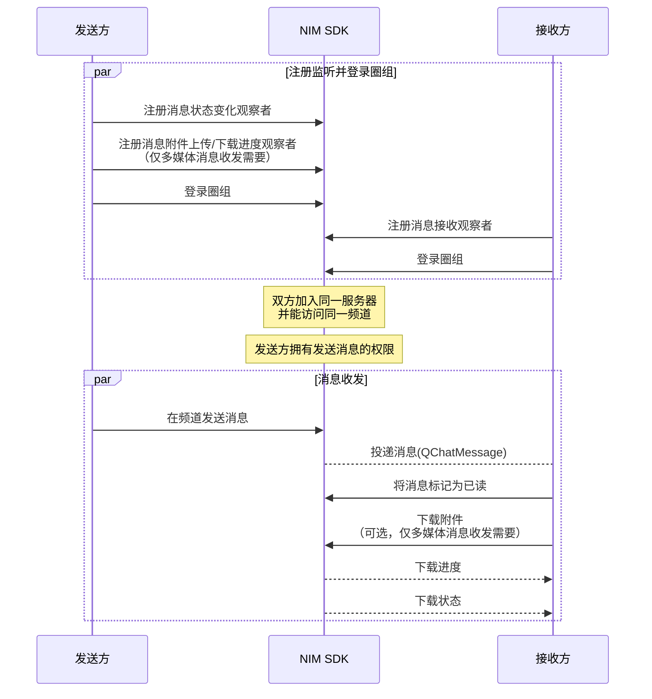

NIM SDK 的<a href="https://doc.yunxin.163.com/docs/interface/messaging/android/doxygen/Latest/zh/interfacecom_1_1netease_1_1nimlib_1_1sdk_1_1qchat_1_1_q_chat_message_service.html" target="_blank">`QChatMessageService`</a>接口提供圈组消息收发的方法，支持支持文本、图片、语音、视频、文件、地理位置和自定义等消息类型。定义圈组消息的结构体为<a href="https://doc.yunxin.163.com/docs/interface/messaging/android/doxygen/Latest/zh/interfacecom_1_1netease_1_1nimlib_1_1sdk_1_1qchat_1_1model_1_1_q_chat_message.html" target="_blank">`QChatMessage`</a>。

## 功能介绍

| <div style="width:100px">消息类型</div> | <div style="width:100px">API关键字</div>  | 说明    |             
| :---------- | :----------|:----------------------------- |:----------------------------- |
| 文本消息        | `text` | 消息内容为普通文本 |  
| 图片消息        | `image`  | 消息内容为图片 URL 地址、尺寸、图片大小等信息               |  
| 语音消息        | `audio` | 消息内容为语音文件的 URL 地址、时长、大小、格式等信息 | 
| 视频消息        | `video` | 消息内容为视频文件的 URL 地址、时长、大小、格式等信息 | 
| 文件消息        |  `file` | 消息内容为文件的 URL 地址、大小、格式等信息         | 
| 位置消息      | `location`  | 消息内容为地理位置标题、经度、纬度信息         | 
| 提示消息        | `tip` | 又叫做 Tip 消息，没有推送和通知栏提醒，主要用于会话内的通知提醒，例如进入会话时出现的欢迎消息，或是会话过程中命中敏感词后的提示消息等场景 |
|  通知消息  |  `notification`  | 主要用于圈组的事件通知 | 
| 自定义消息       | `custom` | 开发者自定义的消息类型，例如红包消息、石头剪子布等形式的消息           | 

## 技术原理

下图展示了集成并初始化 NIM SDK 后，实现圈组消息收发的基本工作流。图中的 QChat 即为 NIM SDK 的圈组组件，云信服务端包含 IM 服务端和圈组服务端。


::: note notice 
- 上图仅以静态 Token 登录为例展示消息收发流程。网易云信 IM 还支持动态 Token 登录鉴权和第三方回调登录鉴权，相关详情请参见<a href="https://doc.yunxin.163.com/docs/TM5MzM5Njk/zE2NzA3Mjc?platformId=60353" target="_blank">登录鉴权</a>。
- **圈组服务端**与**圈组服务器**是两个不同概念，前者指云信服务器内提供圈组功能的服务端，后者为圈组的特殊概念，对应 Discord 的 Server, 为社群本身。
:::

<br>

上图中的流程可归纳为如下 5 步：

1. 账号集成与登录。
    1. 开发者将应用的用户账号传入云信 IM 服务端，注册云信 IM 账号。
    2. 云信 IM 服务端返回 Token 给应用服务端。
    3. 应用客户端登录应用服务端。
    4. 应用服务端将 Token 返回给应用客户端。
    5. 用户A 和用户B 带 Token 登录云信 IM 服务端。
    6. 用户A 和用户B 登录云信圈组服务端，此时无需再传入 Token 等参数。
7. 用户A 创建圈组服务器，并在服务器内创建频道。
8. 用户B 加入圈组服务器。
8. 用户A 在频道发送一条消息到云信圈组服务端。 
7. 云信圈组服务端投递消息至频道，用户B 接收消息。


## 前提条件

- 已[开通圈组功能](https://doc.yunxin.163.com/messaging/guide/TU3MjAzMjE?platform=android)。
- 已完成圈组初始化。

::: note important
如果频道所属的服务器的成员人数超过 2000 人阈值，接收方还必须先订阅该频道，才能收到该频道的消息。如果未超过 2000 人阈值，无需订阅也能收到消息。订阅相关说明，请参见<a href="https://doc.yunxin.163.com/messaging/guide/zgwMzQ5MDk?platform=android" target="_blank">圈组订阅机制</a>。
:::


## 实现消息收发


### **API 调用时序**

以下时序图可能因网络问题而显示异常。如显示异常，一般刷新当前页面即可正常显示。 




### **具体流程**
::: note note 
本节仅对上图中标为部分的流程进行说明，其他流程请参考相关文档。例如：
- 服务器成员相关说明，可参见<a href="https://doc.yunxin.163.com/messaging/guide/DIzODU1MDQ?platform=android" target="_blank">圈组服务器成员管理</a>。
- 用户是否能访问某频道的相关说明，可参见<a href="https://doc.yunxin.163.com/messaging/guide/zI4MTQ4ODU?platform=android" target="_blank">频道黑白名单</a>。
- 权限相关配置说明，可参见[身份组相关](https://doc.yunxin.163.com/messaging/guide/DU4NzI0NjU?platform=android)。
:::
<br>

1. 发送方在登录圈组前，注册<a href="https://doc.yunxin.163.com/docs/interface/messaging/android/doxygen/Latest/zh/interfacecom_1_1netease_1_1nimlib_1_1sdk_1_1qchat_1_1_q_chat_service_observer.html#aecf5180ba5f36899935bfdcc01bf4de1">`observeMessageStatusChange`</a>消息状态变化观察者，监听圈组消息状态(`MsgStatusEnum`)和消息附件传输状态(`AttachStatusEnum`)的变化。

    如果发送的是**多媒体消息**（包括图片、语音、视频和文件消息），还需注册<a href="https://doc.yunxin.163.com/docs/interface/messaging/android/doxygen/Latest/zh/interfacecom_1_1netease_1_1nimlib_1_1sdk_1_1qchat_1_1_q_chat_service_observer.html#a6252d8c573d99df97ce442d3036926c7" target="_blank">`observeAttachmentProgress`</a>消息附件上传/下载进度观察者。

    <br>

    示例代码如下：
    :::::: div custom-tabs
    ::: tab 注册消息状态变化观察者
    ```
    NIMClient.getService(QChatServiceObserver.class).observeMessageStatusChange(new Observer<QChatMessage>() {
        @Override
        public void onEvent(QChatMessage qChatMessage) {
            //收到状态变化的消息qChatMessage
            
        }
    }, true);
    ```
    :::
    ::: tab 注册消息附件上传/下载进度观察者
    ```
    NIMClient.getService(QChatServiceObserver.class).observeAttachmentProgress(new Observer<AttachmentProgress>() {
        @Override
        public void onEvent(AttachmentProgress attachmentProgress) {
            //消息uuid
            String uuid = attachmentProgress.getUuid();
            //已传输字节数
            long transferred = attachmentProgress.getTransferred();
            //文件总大小
            long total = attachmentProgress.getTotal();

        }
    },true);
    ```
    :::
    ::::::
2. 接收方在登录圈组前，注册<a href="https://doc.yunxin.163.com/docs/interface/messaging/android/doxygen/Latest/zh/interfacecom_1_1netease_1_1nimlib_1_1sdk_1_1qchat_1_1_q_chat_service_observer.html#a0283c8f5f0af88406669413f4f6ff044" target="_blank">`observeReceiveMessage`</a>消息接收观察者，监听圈组消息接收。


    示例代码如下：

    ```
    NIMClient.getService(QChatServiceObserver.class).observeReceiveMessage(new Observer<List<QChatMessage>>() {
        @Override
        public void onEvent(List<QChatMessage> qChatMessages) {
            //收到消息qChatMessages
            for (QChatMessage qChatMessage : qChatMessages) {
                //处理消息
            }
        }
    }, true);
    ```
2. 发送方调用<a href="https://doc.yunxin.163.com/docs/interface/messaging/android/doxygen/Latest/zh/interfacecom_1_1netease_1_1nimlib_1_1sdk_1_1qchat_1_1_q_chat_message_service.html#a50851a1367f29b3162f2ae3afcf48624" target="_blank">`sendMessage`</a>方法发送消息，调用时通过`getType`的<a href="https://doc.yunxin.163.com/docs/interface/messaging/android/doxygen/Latest/zh/enumcom_1_1netease_1_1nimlib_1_1sdk_1_1msg_1_1constant_1_1_msg_type_enum.html" target="_blank">`MsgTypeEnum`</a>枚举设置消息的类型。


    ::: note notice
    消息发送方需要拥有发送消息的权限（`SEND_MSG`）。
    :::


    <br>

    `QChatSendMessageParam` 为该方法的入参结构，必须传入`ServerId`、`ChannelId`和消息类型。

    `QChatSendMessageParam`的部分重要方法说明如下：
    
    <div style="width:100px">返回值</div>  | 方法  | 说明     
    ----  | ----  | --------- 
    void | <a href="https://doc.yunxin.163.com/docs/interface/messaging/android/doxygen/Latest/zh/classcom_1_1netease_1_1nimlib_1_1sdk_1_1qchat_1_1param_1_1_q_chat_send_message_param.html#a8227bcb5dafe9a3b92b1f8574c771abc" target="_blank">`setAntiSpamOption`</a> | 配置安全通（易盾反垃圾）相关的各项参数。如果您配置了这些参数，在发送消息时，会对发送的文本和附件进行内容审核（反垃圾检测）。根据您在控制台预设的拦截/过滤规则，如果检测到违规内容，消息可能发送失败或者敏感信息被过滤。 <note type=notice>圈组的安全通功能属于增值功能，需要在开通圈组功能后再额外开通，具体请参考[开通 IM 安全通](https://doc.yunxin.163.com/messaging/guide/jYxOTcyNzY?platform=server)。更多相关说明请参见<a href="_blank">圈组内容审核</a>。</note>
    void|`setMentionedAccidList(List<String> mentionedAccidList)`| @部分人，如果将该消息设置为@所有人或者@身份组，则本参数无效）<note type=notice>用户需要拥有@某个人权限（`REMIND_OTHER`）才能@部分人。</note>
    void|`setMentionedAll(boolean mentionedAll)`|设置是否@所有人  <note type=notice>用户需要拥有@所有人权限（`REMIND_EVERYONE`）才能@所有人</note>
    void | `setMentionedRoleIdList(List<String> mentionedRoleIdList)` | @身份组，最多@ 10 个身份组。如果将该消息设置为@所有人，则本参数无效 <note type=notice>用户需要拥有@身份组权限（`MENTIONED_ROLE`）才能@身份组。</note>
    void|`setHistoryEnable(boolean historyEnable)`|设置是否消息是否存储云端历史
    void|`setNeedBadge(boolean needBadge)`|设置是否需要消息计数
    `QChatMessage`|	`toQChatMessage`	|将`QChatSendMessageParam`转换成`QChatMessage`。如果需要在发送消息前提前构造一个`QChatMessage`，可以通过该方法构造。

    <div>
    
    发送各类型消息的示例代码如下：

    :::::: div custom-tabs

    ::: tab 文本

    ```
    QChatSendMessageParam param = new QChatSendMessageParam(943445L,885305L, MsgTypeEnum.text);
    param.setBody("测试消息");
    param.setMentionedAll(false);
    param.setHistoryEnable(true);
    param.setExtension(getExtension());
    param.setPushPayload(getPushPayload());
    param.setPushContent("测试推送消息");
    param.setMentionedAccidList(mentionedAccidList);
    param.setPushEnable(true);
    param.setNeedBadge(true);
    param.setNeedPushNick(true);
    //通过QChatSendMessageParam构造一个QChatMessage
    QChatMessage currentMessage = param.toQChatMessage();

    NIMClient.getService(QChatMessageService.class).sendMessage(param).setCallback(new RequestCallback<QChatSendMessageResult>() {
        @Override
        public void onSuccess(QChatSendMessageResult result) {
            //发送消息成功,返回发送成功的消息具体信息
            QChatMessage message = result.getSentMessage();
        }

        @Override
        public void onFailed(int code) {
            //发送消息失败，返回错误code
        }

        @Override
        public void onException(Throwable exception) {
            //发送消息异常
        }
    });
    ```
    :::
    ::: tab 图片
    ```
    QChatSendMessageParam param = new QChatSendMessageParam(943445L,885305L,MsgTypeEnum.image);
    param.setMentionedAll(false);
    param.setHistoryEnable(true);
    param.setExtension(getExtension());
    param.setPushPayload(getPushPayload());
    param.setPushContent("测试图片消息");
    param.setMentionedAccidList(mentionedAccidList);
    param.setPushEnable(true);
    param.setNeedBadge(true);
    param.setNeedPushNick(true);
    //创建图片附件
    File file = getImageFile();
    final ImageAttachment attachment = new ImageAttachment();
    attachment.setPath(file.getPath());
    attachment.setSize(file.length());
    int[] dimension = BitmapDecoder.decodeBound(file);
    attachment.setWidth(dimension[0]);
    attachment.setHeight(dimension[1]);
    attachment.setDisplayName(file.getName());
    attachment.setExtension(StringUtil.getExtension(file.getName()));
    //设置图片附件
    param.setAttachment(attachment);

    NIMClient.getService(QChatMessageService.class).sendMessage(param).setCallback(new RequestCallback<QChatSendMessageResult>() {
        @Override
        public void onSuccess(QChatSendMessageResult result) {
            //发送消息成功,返回发送成功的消息具体信息
            QChatMessage message = result.getSentMessage();
        }

        @Override
        public void onFailed(int code) {
            //发送消息失败，返回错误code
        }

        @Override
        public void onException(Throwable exception) {
            //发送消息异常
        }
    });
    ```
    :::

    ::: tab 语音
    ```
    QChatSendMessageParam param = new QChatSendMessageParam(943445L,885305L,MsgTypeEnum.audio);
    param.setMentionedAll(false);
    param.setHistoryEnable(true);
    param.setExtension(getExtension());
    param.setPushPayload(getPushPayload());
    param.setPushContent("测试语音消息");
    param.setMentionedAccidList(mentionedAccidList);
    param.setPushEnable(true);
    param.setNeedBadge(true);
    param.setNeedPushNick(true);
    //创建音频附件
    File file = getAudioFile();
    long duration = getAudioDuration();
    final AudioAttachment attachment = new AudioAttachment();
    attachment.setPath(file.getPath());
    attachment.setSize(file.length());
    if (duration > 0 && duration < 1000) {// 最低显示1秒
        duration = 1000;
    }
    attachment.setDuration(duration);// ms
    attachment.setExtension(StringUtil.getExtension(file.getName()));
    //设置附件
    param.setAttachment(attachment);

    NIMClient.getService(QChatMessageService.class).sendMessage(param).setCallback(new RequestCallback<QChatSendMessageResult>() {
        @Override
        public void onSuccess(QChatSendMessageResult result) {
            //发送消息成功,返回发送成功的消息具体信息
            QChatMessage message = result.getSentMessage();
        }

        @Override
        public void onFailed(int code) {
            //发送消息失败，返回错误code
        }

        @Override
        public void onException(Throwable exception) {
            //发送消息异常
        }
    });
    ```

    :::

    ::: tab 视频
    ```
    QChatSendMessageParam param = new QChatSendMessageParam(943445L,885305L,MsgTypeEnum.video);
    param.setMentionedAll(false);
    param.setHistoryEnable(true);
    param.setExtension(getExtension());
    param.setPushPayload(getPushPayload());
    param.setPushContent("测试视频消息");
    param.setMentionedAccidList(mentionedAccidList);
    param.setPushEnable(true);
    param.setNeedBadge(true);
    param.setNeedPushNick(true);
    //创建视频附件
    File file = getVideoFile();
    MediaPlayer mediaPlayer = null;
    try {
        mediaPlayer = MediaPlayer.create(context, Uri.fromFile(file));
    } catch (Exception e) {
        e.printStackTrace();
    }
    long duration = mediaPlayer == null ? 0 : mediaPlayer.getDuration();
    int height = mediaPlayer == null ? 0 : mediaPlayer.getVideoHeight();
    int width = mediaPlayer == null ? 0 : mediaPlayer.getVideoWidth();
    final VideoAttachment attachment = new VideoAttachment();
    attachment.setPath(file.getPath());
    attachment.setSize(file.length());
    attachment.setDuration(duration);
    attachment.setWidth(width);
    attachment.setHeight(height);
    attachment.setDisplayName(file.getName());
    attachment.setExtension(StringUtil.getExtension(file.getName()));
    //设置附件
    param.setAttachment(attachment);

    NIMClient.getService(QChatMessageService.class).sendMessage(param).setCallback(new RequestCallback<QChatSendMessageResult>() {
        @Override
        public void onSuccess(QChatSendMessageResult result) {
            //发送消息成功,返回发送成功的消息具体信息
            QChatMessage message = result.getSentMessage();
        }

        @Override
        public void onFailed(int code) {
            //发送消息失败，返回错误code
        }

        @Override
        public void onException(Throwable exception) {
            //发送消息异常
        }
    });
    ```
    :::

    ::: tab 文件
    ```
    QChatSendMessageParam param = new QChatSendMessageParam(943445L,885305L,MsgTypeEnum.file);
    param.setMentionedAll(false);
    param.setHistoryEnable(true);
    param.setExtension(getExtension());
    param.setPushPayload(getPushPayload());
    param.setPushContent("测试语音消息");
    param.setMentionedAccidList(mentionedAccidList);
    param.setPushEnable(true);
    param.setNeedBadge(true);
    param.setNeedPushNick(true);
    //创建文件附件
    File file = getFile();
    final FileAttachment attachment = new FileAttachment();
    attachment.setPath(file.getPath());
    attachment.setSize(file.length());
    attachment.setDisplayName(file.getName());
    attachment.setExtension(StringUtil.getExtension(file.getName()));
    //设置附件
    param.setAttachment(attachment);

    NIMClient.getService(QChatMessageService.class).sendMessage(param).setCallback(new RequestCallback<QChatSendMessageResult>() {
        @Override
        public void onSuccess(QChatSendMessageResult result) {
            //发送消息成功,返回发送成功的消息具体信息
            QChatMessage message = result.getSentMessage();
        }

        @Override
        public void onFailed(int code) {
            //发送消息失败，返回错误code
        }

        @Override
        public void onException(Throwable exception) {
            //发送消息异常
        }
    });
    ```

    :::

    ::: tab 提示
    ```
    QChatSendMessageParam param = new QChatSendMessageParam(943445L,885305L,MsgTypeEnum.tip);
    param.setBody("测试提示消息");
    param.setMentionedAll(false);
    param.setHistoryEnable(true);
    param.setExtension(getExtension());

    NIMClient.getService(QChatMessageService.class).sendMessage(param).setCallback(new RequestCallback<QChatSendMessageResult>() {
        @Override
        public void onSuccess(QChatSendMessageResult result) {
            //发送消息成功,返回发送成功的消息具体信息
            QChatMessage message = result.getSentMessage();
        }

        @Override
        public void onFailed(int code) {
            //发送消息失败，返回错误code
        }

        @Override
        public void onException(Throwable exception) {
            //发送消息异常
        }
    });
    ```

    :::

    ::: tab 自定义
    ```
    QChatSendMessageParam param = new QChatSendMessageParam(943445L,885305L,MsgTypeEnum.custom);
    param.setBody("测试自定义消息");
    param.setMentionedAll(false);
    param.setHistoryEnable(true);
    param.setExtension(getExtension());
    //自定义消息附件，非必须
    MsgAttachment customAttachment = getCustomAttachment();
    param.setAttachment(customAttachment);

    NIMClient.getService(QChatMessageService.class).sendMessage(param).setCallback(new RequestCallback<QChatSendMessageResult>() {
        @Override
        public void onSuccess(QChatSendMessageResult result) {
            //发送消息成功,返回发送成功的消息具体信息
            QChatMessage message = result.getSentMessage();
        }

        @Override
        public void onFailed(int code) {
            //发送消息失败，返回错误code
        }

        @Override
        public void onException(Throwable exception) {
            //发送消息异常
        }
    });
    ```
    :::
    
3. 消息接收观察者的回调函数触发，接收方通过回调收到消息。


4. 接收方调用<a href="https://doc.yunxin.163.com/docs/interface/messaging/android/doxygen/Latest/zh/interfacecom_1_1netease_1_1nimlib_1_1sdk_1_1qchat_1_1_q_chat_message_service.html#a428085ca0d6d28eefdd33def4c831ceb" target="_blank">`markMessageRead`</a>方法将接收到的消息标记为已读。

    ::: note notice
    - 将消息标记为已读后，该消息之前接收到的消息全部变为已读状态。
    - 如果传入的时间戳参数为 0，则频道内所有消息将被标记为未读。
    - 该方法调用存在频控，300ms 内最多可调用一次。
    :::

    <br>

    示例代码如下：

    ```
    NIMClient.getService(QChatMessageService.class).markMessageRead(new QChatMarkMessageReadParam(943445L,885305L,currentMessage.getTime())).setCallback(
            new RequestCallback<Void>() {
                @Override
                public void onSuccess(Void param) {
                    //标记已读成功
                }

                @Override
                public void onFailed(int code) {
                    //标记已读失败，返回错误code
                }

                @Override
                public void onException(Throwable exception) {
                    //标记已读异常
                }
            });
    ```
5. 如果接收方接收到的是多媒体消息，可调用<a href="https://doc.yunxin.163.com/docs/interface/messaging/android/doxygen/Latest/zh/interfacecom_1_1netease_1_1nimlib_1_1sdk_1_1qchat_1_1_q_chat_message_service.html#af4ad675965690a2e1e6f1ec9e80b6dfd" target="_blank">`downloadAttachment`</a>方法下载附件。

    下载附件会触发`QChatServiceObserver`的`observeAttachmentProgress`通知下载进度，同时触发`observeMessageStatusChange`通知下载状态。


    ::: note note 
    默认情况下（即 SDK 初始化时将`SDKOPtions#preloadAttach`设置为`true`，开启预加载多媒体消息附件），当 SDK 收到多媒体消息后，如果附件是图片或视频，会自动下载图片或视频的缩略图；如果附件是音频，SDK 会自动下载音频文件。如果需要下载原图或者原视频等，可调用该方法下载附件。
    :::

    <br>


    示例代码如下：

    
    ```
    QChatMessage message = getMessage();
    //是否下载缩略图
    boolean thumb = false;
    QChatDownloadAttachmentParam param = new QChatDownloadAttachmentParam(message,thumb);
    NIMClient.getService(QChatMessageService.class).downloadAttachment(param).setCallback(new RequestCallback<Void>() {
        @Override
        public void onSuccess(Void result) {
            //下载成功
        }

        @Override
        public void onFailed(int code) {
            //下载失败
        }

        @Override
        public void onException(Throwable exception) {
            //下载异常
        }
    });
    ```

:::note note
圈组自定义消息的解析流程，请参考 [自定义消息收发](https://doc.yunxin.163.com/messaging/guide/DY3Mjg5NjE?platform=android#实现方法) 的示例。
:::

## 实现消息重发


如果因为网络等原因消息发送失败，可以调用<a href="https://doc.yunxin.163.com/docs/interface/messaging/android/doxygen/Latest/zh/interfacecom_1_1netease_1_1nimlib_1_1sdk_1_1qchat_1_1_q_chat_message_service.html#a07825c1e43fdda2cdb354ac7ba3611c3" target="_blank">`resendMessage`</a>方法重发消息。该方法的入参`QChatResendMessageParam`需传入待重发的消息体（`QChatMessage`）。

示例代码如下：

```
NIMClient.getService(QChatMessageService.class).resendMessage(new QChatResendMessageParam(currentMessage)).setCallback(new RequestCallback<QChatSendMessageResult>() {
    @Override
    public void onSuccess(QChatSendMessageResult result) {
        //重发消息成功,返回发送成功的消息具体信息
        QChatMessage message = result.getSentMessage();
    }

    @Override
    public void onFailed(int code) {
        //重发消息失败，返回错误code
    }

    @Override
    public void onException(Throwable exception) {
        //重发消息异常
    }
});
```


## 相关参考

### 消息未读数限制


- 所有未读消息（包括@消息）的消息阈值默认为 99 条。
- @消息的未读数的有效期，默认为 7 天，即默认存储 7 天。

若需要扩展上限，可在控制台配置圈组子功能项（**未读的@消息数-周期** 和 **所有未读消息（包括@）的消息计数-阈值**），具体请参考[开通和配置圈组功能](https://doc.yunxin.163.com/messaging/guide/TM1OTU0MTM?platform=iOS)。

## 常见问题

在圈组中发送消息时，若返回 404 错误码。可能的原因包括但不限于：

404 都是对象不存在的情况，因此可能是圈组服务器或者频道不存在，请确保当前圈组服务器和频道存在，并且确保发送消息的用户在当前圈组服务器中。
