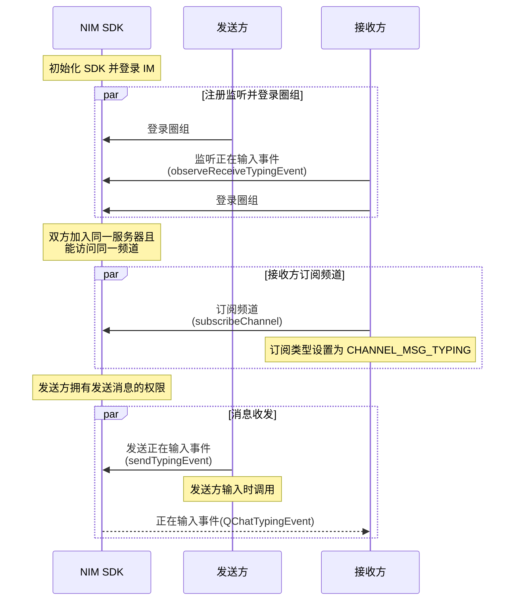

<!--keywords: 正在输入, 消息正在输入, 频道消息 -->

网易云信即时通讯 NIM Android SDK 中的[`QChatMessageService`](https://doc.yunxin.163.com/docs/interface/messaging/android/doxygen/Latest/zh/interfacecom_1_1netease_1_1nimlib_1_1sdk_1_1qchat_1_1_q_chat_message_service.html)接口，提供[`sendTypingEvent`](https://doc.yunxin.163.com/docs/interface/messaging/android/doxygen/Latest/zh/interfacecom_1_1netease_1_1nimlib_1_1sdk_1_1qchat_1_1_q_chat_message_service.html#a22a757a1719d4b901d0b036ca5d73069)方法发送“正在输入事件”。接收方只有在监听该事件且订阅消息所在频道后，才能在消息输入方发送该事件后，接收到该事件。 


## **前提条件**


发送方和接收方都在频道内，即频道对两者都可见, 且发送方拥有发送频道消息权限（即[`QChatRoleResource`](https://doc.yunxin.163.com/docs/interface/messaging/android/doxygen/Latest/zh/classcom_1_1netease_1_1nimlib_1_1sdk_1_1qchat_1_1enums_1_1_q_chat_role_resource.html)中的`SEND_MSG`）。

- 要实现频道对发送方和接收方都可见，需确保两者都在私密频道的白名单内，或者都没有被加入公开频道的黑名单，具体参见[频道黑白名单](https://doc.yunxin.163.com/messaging/guide/zI4MTQ4ODU?platform=android)。
- 用户的操作权限通过身份组进行管控，具体参见[身份组相关](https://doc.yunxin.163.com/messaging/guide/DU4NzI0NjU?platform=android)。

## 实现流程


### 流程概览

::: note note 
下图可能因为网络问题而显示异常。如显示异常，一般尝试刷新当前页面即可正常显示。
:::



### 流程说明

::: note note 
本节仅对上图中标为部分的流程进行说明，其他流程请参考相关文档。例如：
- 服务器成员相关说明，可参见<a href="https://doc.yunxin.163.com/messaging/guide/DIzODU1MDQ?platform=android" target="_blank">圈组服务器成员管理</a>。
- 用户是否能访问某频道的相关说明，可参见<a href="https://doc.yunxin.163.com/messaging/guide/zI4MTQ4ODU?platform=android" target="_blank">频道黑白名单</a>。
- 权限相关配置说明，可参见[身份组相关](https://doc.yunxin.163.com/messaging/guide/DU4NzI0NjU?platform=android)。
:::
<br>

1. 接收方调用[`observeReceiveTypingEvent`](https://doc.yunxin.163.com/docs/interface/messaging/android/doxygen/Latest/zh/interfacecom_1_1netease_1_1nimlib_1_1sdk_1_1qchat_1_1_q_chat_service_observer.html#ad3499a69f8dc2a124ab01783da68913a)方法监听正在输入事件（`QChatTypingEvent`）。 
2. 接收方调用[`subscribeChannel`](https://doc.yunxin.163.com/docs/interface/messaging/android/doxygen/Latest/zh/interfacecom_1_1netease_1_1nimlib_1_1sdk_1_1qchat_1_1_q_chat_channel_service.html#afce5d8bbe2541d92194cdf8303bb6332)方法，调用时将入参`QChatSubscribeType`设为`CHANNEL_MSG_TYPING`，实现对正在输入事件的订阅。

    ::: note notice :::
    如果断线重连，SDK 会自动再次订阅正在输入事件。但如果用户调用 `logout` 方法切断与圈组服务端的连接或销毁 SDK 实例后重建实例，那么用户需要再度调`subscribeChannel`方法重新订阅该事件。
    :::

3. 发送方调用[`sendTypingEvent`](https://doc.yunxin.163.com/docs/interface/messaging/android/doxygen/Latest/zh/interfacecom_1_1netease_1_1nimlib_1_1sdk_1_1qchat_1_1_q_chat_message_service.html#a22a757a1719d4b901d0b036ca5d73069)方法发送正在输入事件。

    发送该事件后，SDK 会触发用户A 在`observeReceiveTypingEvent`方法中设置的回调，将`QChatTypingEvent`投递至用户A。
    
    ::: note notice :::
    该方法有调用频率上限，目前默认 3,000 ms 一次。
    :::


### **示例代码**
```
//************************接收方设置正在输入事件监听回调************************/
NIMClient.getService(QChatServiceObserver.class).observeReceiveTypingEvent(new Observer<QChatTypingEvent>() {
    @Override
    public void onEvent(QChatTypingEvent qChatTypingEvent) {
        //收到正在输入事件
    }
},true);

//************************接收方订阅某正在输入事件************************/
//服务器Id
long serviceId = 2114708;
//频道Id
long channelId = 233479;

List<QChatChannelIdInfo> channelIdInfos = new ArrayList<>();
channelIdInfos.add(new QChatChannelIdInfo(serviceId,channelId));

QChatSubscribeChannelParam subscribeChannelParam = new QChatSubscribeChannelParam(QChatSubscribeType.CHANNEL_MSG_TYPING,
        QChatSubscribeOperateType.SUB,channelIdInfos);
NIMClient.getService(QChatChannelService.class).subscribeChannel(subscribeChannelParam).setCallback(
        new RequestCallback<QChatSubscribeChannelResult>() {
            @Override
            public void onSuccess(QChatSubscribeChannelResult result) {
                //订阅正在输入事件为空，正在输入事件订阅成功后不会返回未读信息，result.getUnreadInfoList()中的数据为空
            }

            @Override
            public void onFailed(int code) {

            }

            @Override
            public void onException(Throwable exception) {

            }
        });

//************************发送方发送正在输入事件************************/
QChatSendTypingEventParam sendTypingEventParam = new QChatSendTypingEventParam(serviceId,channelId);
//可以设置自定义扩展字段
Map<String, Object> extension = new HashMap<>();
extension.put("test","extension info");
sendTypingEventParam.setExtension(extension);

NIMClient.getService(QChatMessageService.class).sendTypingEvent(sendTypingEventParam).setCallback(
        new RequestCallback<QChatSendTypingEventResult>() {
            @Override
            public void onSuccess(QChatSendTypingEventResult result) {
                //发送成功，返回发送成功的正在输入事件
                QChatTypingEvent typingEvent = result.getTypingEvent();
            }

            @Override
            public void onFailed(int code) {

            }

            @Override
            public void onException(Throwable exception) {

            }
        });
```


