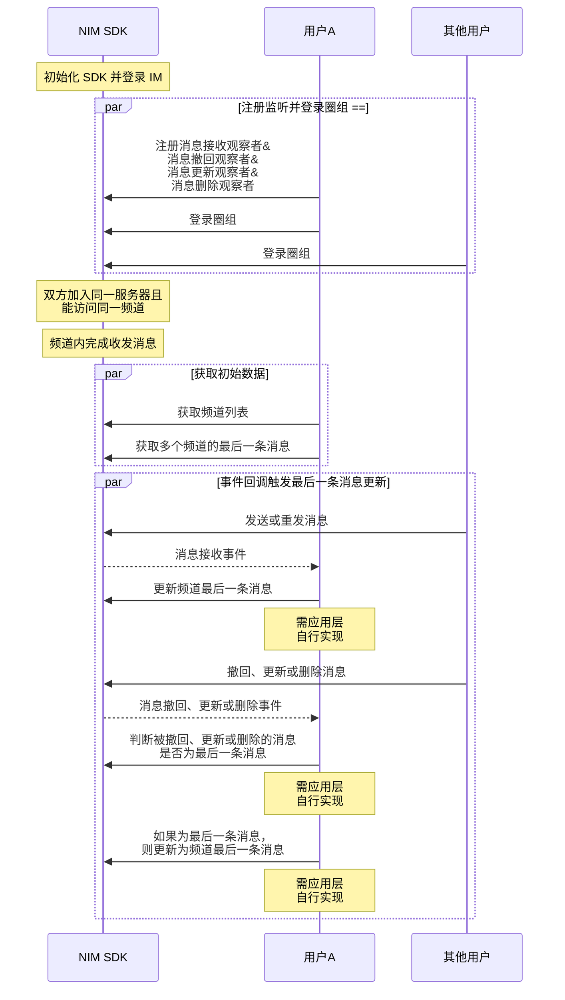
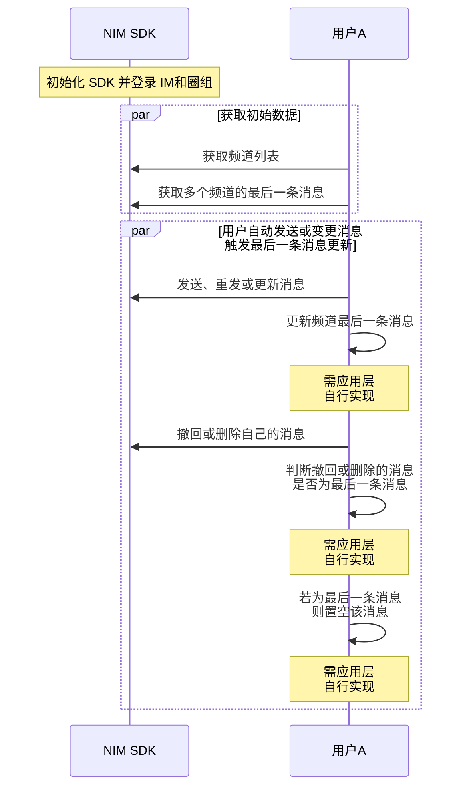

<!--keywords: 最后一条消息, 频道最后一条消息, 最后一条 -->


网易云信 NIM SDK 的[`QChatMessageService`](https://doc.yunxin.163.com/docs/interface/messaging/android/doxygen/Latest/zh/interfacecom_1_1netease_1_1nimlib_1_1sdk_1_1qchat_1_1_q_chat_message_service.html)类提供[`getLastMessageOfChannels`](https://doc.yunxin.163.com/docs/interface/messaging/android/doxygen/Latest/zh/interfacecom_1_1netease_1_1nimlib_1_1sdk_1_1qchat_1_1_q_chat_message_service.html#a5c371b7ee198ca040897d2ac41c3254f)方法，用于获取多个频道的最后一条消息，该方法的响应[`QChatGetLastMessageOfChannelsResult`](https://doc.yunxin.163.com/docs/interface/messaging/android/doxygen/Latest/zh/classcom_1_1netease_1_1nimlib_1_1sdk_1_1qchat_1_1result_1_1_q_chat_get_last_message_of_channels_result.html)返回的结果为 map, key 值对应每一个`channelId`，value 值是消息体`QChatMessage`。基于该方法的调用，您可通过在应用上层自行开发相关业务逻辑，实现频道列表动态更新各频道的最后一条消息。


## UI 示例
频道列表显示最后一条消息的简易 UI 示例如下：


## 前提条件

已登录圈组，并已创建圈组服务器和频道。


## 实现流程


### API 调用时序

频道最后一条消息动态更新的业务场景，可分为如下两种。


::: note note
以下时序图可能因为网络问题而显示异常。如果显示异常，一般刷新当前页面即可正常显示。
:::

<br>

:::::: div custom-tabs
::: tab 场景1：事件回调触发更新 


:::
::: tab 场景2：自己发送或变更消息触发更新


:::
::::::

### 流程说明

::: note note 
本节仅对上图中标为部分的流程进行说明，其他流程请参考相关文档。例如：
- 服务器成员相关说明，可参见<a href="https://doc.yunxin.163.com/messaging/guide/DIzODU1MDQ?platform=android" target="_blank">圈组服务器成员管理</a>。
- 用户是否能访问某频道的相关说明，可参见<a href="https://doc.yunxin.163.com/messaging/guide/zI4MTQ4ODU?platform=android" target="_blank">频道黑白名单</a>。
:::
<br>

1. 登录圈组前，注册如下观察者：
    - 调用[`observeReceiveMessage`](https://doc.yunxin.163.com/docs/interface/messaging/android/doxygen/Latest/zh/interfacecom_1_1netease_1_1nimlib_1_1sdk_1_1qchat_1_1_q_chat_service_observer.html#a0283c8f5f0af88406669413f4f6ff044)方法注册消息接收观察者，监听消息接收事件。
    - 调用[`observeMessageRevoke`](https://doc.yunxin.163.com/docs/interface/messaging/android/doxygen/Latest/zh/interfacecom_1_1netease_1_1nimlib_1_1sdk_1_1qchat_1_1_q_chat_service_observer.html#aa45c9939e58acf7867853e87d5460680)方法注册消息撤回状态变化观察者，监听消息撤回事件。
    - 调用[`observeMessageUpdate`](https://doc.yunxin.163.com/docs/interface/messaging/android/doxygen/Latest/zh/interfacecom_1_1netease_1_1nimlib_1_1sdk_1_1qchat_1_1_q_chat_service_observer.html#a9db8d9bcafa0f15b402cd9941e8ec874)方法注册消息更新观察者，监听消息更新事件。
    - 调用[`observeMessageDelete`](https://doc.yunxin.163.com/docs/interface/messaging/android/doxygen/Latest/zh/interfacecom_1_1netease_1_1nimlib_1_1sdk_1_1qchat_1_1_q_chat_service_observer.html#a8a3bd8f0fdfd0467e74ffd1bab6796f7)方法注册消息删除观察者，监听消息删除事件。

    示例代码如下：

    :::::: div custom-tabs 
    ::: tab 监听消息接收
    ```
    NIMClient.getService(QChatServiceObserver.class).observeReceiveMessage(new Observer<List<QChatMessage>>() {
        @Override
        public void onEvent(List<QChatMessage> qChatMessages) {
            //收到消息qChatMessages
            for (QChatMessage qChatMessage : qChatMessages) {
                //处理消息
            }
        }
    }, true);
    ```
    :::

    ::: tab 监听消息撤回

    ```
    NIMClient.getService(QChatServiceObserver.class).observeMessageRevoke(new Observer<QChatMessageRevokeEvent>() {
        @Override
        public void onEvent(QChatMessageRevokeEvent event) {
            //收到撤回后的消息qChatMessage
            QChatMessage message = event.getMessage();

        }
    }, true);

    ```
    :::


    ::: tab 监听消息更新
    ```
    NIMClient.getService(QChatServiceObserver.class).observeMessageUpdate(new Observer<QChatMessageUpdateEvent>() {
        @Override
        public void onEvent(QChatMessageUpdateEvent event) {
            //收到更新后的消息qChatMessage
            QChatMessage message = event.getMessage();

        }
    }, true);

    ```
    :::


    ::: tab 监听消息删除
    ```
    NIMClient.getService(QChatServiceObserver.class).observeMessageDelete(new Observer<QChatMessageDeleteEvent>() {
        @Override
        public void onEvent(QChatMessageDeleteEvent event) {
            //收到删除后的消息qChatMessage
            QChatMessage message = event.getMessage();

        }
    }, true);
    ```
    :::

    ::::::

2. 获取频道最后一条消息的初始数据。
    1. 调用[`getChannelsByPage`](https://doc.yunxin.163.com/docs/interface/messaging/android/doxygen/Latest/zh/interfacecom_1_1netease_1_1nimlib_1_1sdk_1_1qchat_1_1_q_chat_channel_service.html#a8511f38558a18719715e675f37f71ce1)拉取频道列表。
    2. 调用[`getLastMessageOfChannels`](https://doc.yunxin.163.com/docs/interface/messaging/android/doxygen/Latest/zh/interfacecom_1_1netease_1_1nimlib_1_1sdk_1_1qchat_1_1_q_chat_message_service.html#a5c371b7ee198ca040897d2ac41c3254f)方法获取若干个频道的最后一条消息。

        ::: note notice :::
        - 最多只能传入 20 个频道 ID 获取它们的最后一条消息。
        - 您需自行维护调用该方法返回的结果。
        - 被撤回的消息仍能通过调用该方法查到，但被删除的消息无法查到。如果最后一条消息是撤回消息，推荐把对应的最后一条消息置空，并给出提示表明“撤回消息”。
        :::

    3. 在您的应用内存中维护相关频道的最后一条消息。

    示例代码如下：

    ```
    long serverId = 943445L;
    long searchTime = System.currentTimeMillis();
    int limit = 100;
    NIMClient.getService(QChatChannelService.class)
            .getChannelsByPage(new QChatGetChannelsByPageParam(serverId,searchTime,limit))
            .setCallback(
                    new RequestCallback<QChatGetChannelsByPageResult>() {
                        @Override
                        public void onSuccess(QChatGetChannelsByPageResult result) {
                            //查询Channel列表成功
                            List<QChatChannel> channels = result.getChannels();
                            if(channels != null && channels.size() > 0){
                                List<Long> channelIds = new ArrayList<>();
                                for (QChatChannel channel : channels) {
                                    channelIds.add(channel.getChannelId());
                                }
                                //获取频道最后一条消息
                                NIMClient.getService(QChatMessageService.class)
                                        .getLastMessageOfChannels(new QChatGetLastMessageOfChannelsParam(serverId,channelIds))
                                        .setCallback(new RequestCallback<QChatGetLastMessageOfChannelsResult>() {
                                            @Override
                                            public void onSuccess(QChatGetLastMessageOfChannelsResult result) {
                                                //查询成功,返回频道最后一条消息map，key为channelId
                                                Map<Long, QChatMessage> channelMsgMap = result.getChannelMsgMap();
                                            }

                                            @Override
                                            public void onFailed(int code) {
                                                //查询失败，返回错误code
                                            }

                                            @Override
                                            public void onException(Throwable exception) {
                                                //查询异常
                                            }
                                        });
                            }


                        }

                        @Override
                        public void onFailed(int code) {
                            //查询Channel列表失败，返回错误code
                        }

                        @Override
                        public void onException(Throwable exception) {
                            //查询Channel列表异常
                        }
                    });
    ```

3. 参照下表，在应用层**自行开发**，实现后续频道最后一条消息在不同场景下的动态更新。


    <div style="width:100px">场景</div> | 场景说明     |  推荐处理方法
    ---- | -------------- | ---------
    事件回调触发更新 | 频道内，其他用户发送消息或重发消息，触发消息接收回调| 更新频道最后一条消息<div></div>
    ^^ |   频道内，其他用户撤回、更新或删除消息，触发消息更新回调   |  判断撤回、更新、删除的消息是否为频道最后一条消息，若非最后一条消息，则忽略；若为最后一条消息，且：<div><ul><li>为撤回或删除消息，则把最后一条消息置空</li><li>为更新消息，则更新频道最后一条消息 </li></ul> </div>
    自己发送或变更消息触发更新        |     自己在频道内发送、重发或更新消息      | 更新频道内最后一条消息
   ^^  | 自己在频道内撤回或删除消息| 判断撤回或删除的消息是否为频道最后一条消息，若非最后一条消息，则忽略；若为最后一条消息，则把最后一条消息置空
   
  

## 相关信息


圈组各端 （Android、iOS、Windows 和 增强版 Web）监听消息更新、消息撤回和消息删除的方式略有差异，具体为：Android 将消息更新、消息撤回和消息删除三个事件进行区分；而其他端的消息撤回和消息删除事件，都并入消息更新事件，不进行区分。

各端的相关事件回调接口如下：

|  | Android | iOS | Windows  | 增强版 Web |
|---- | -------- | ------| ---|
|**监听消息更新** | [`observeMessageUpdate`](https://doc.yunxin.163.com/docs/interface/messaging/android/doxygen/Latest/zh/interfacecom_1_1netease_1_1nimlib_1_1sdk_1_1qchat_1_1_q_chat_service_observer.html#a9db8d9bcafa0f15b402cd9941e8ec874) | [`onMessageUpdate:`](https://doc.yunxin.163.com/docs/interface/messaging/iOS/doxygen/Latest/zh/d4/d3f/protocol_n_i_m_q_chat_message_manager_delegate-p.html#a4ae4b554d71de6b99f5428c38bd7824d)  | [`RegUpdatedCb`](https://doc.yunxin.163.com/docs/interface/messaging/pc/doxygen/Latest/zh/classnim_1_1_message.html#a0d47693a07a9eb59072054e71dbc46bf)  |  [`messageUpdate`](https://doc.yunxin.163.com/docs/interface/messaging-enhanced/web/typedoc/Latest/zh/QChat/interfaces/QChatInterface.QChatEventInterface.html#messageUpdate) |
|**监听消息撤回** | [`observeMessageRevoke`](https://doc.yunxin.163.com/docs/interface/messaging/android/doxygen/Latest/zh/interfacecom_1_1netease_1_1nimlib_1_1sdk_1_1qchat_1_1_q_chat_service_observer.html#aa45c9939e58acf7867853e87d5460680)  | ^^ |   ^^ |  ^^ |
|**监听消息删除** | [`observeMessageDelete`](https://doc.yunxin.163.com/docs/interface/messaging/android/doxygen/Latest/zh/interfacecom_1_1netease_1_1nimlib_1_1sdk_1_1qchat_1_1_q_chat_service_observer.html#a8a3bd8f0fdfd0467e74ffd1bab6796f7)| ^^ |  ^^ | ^^  |


  