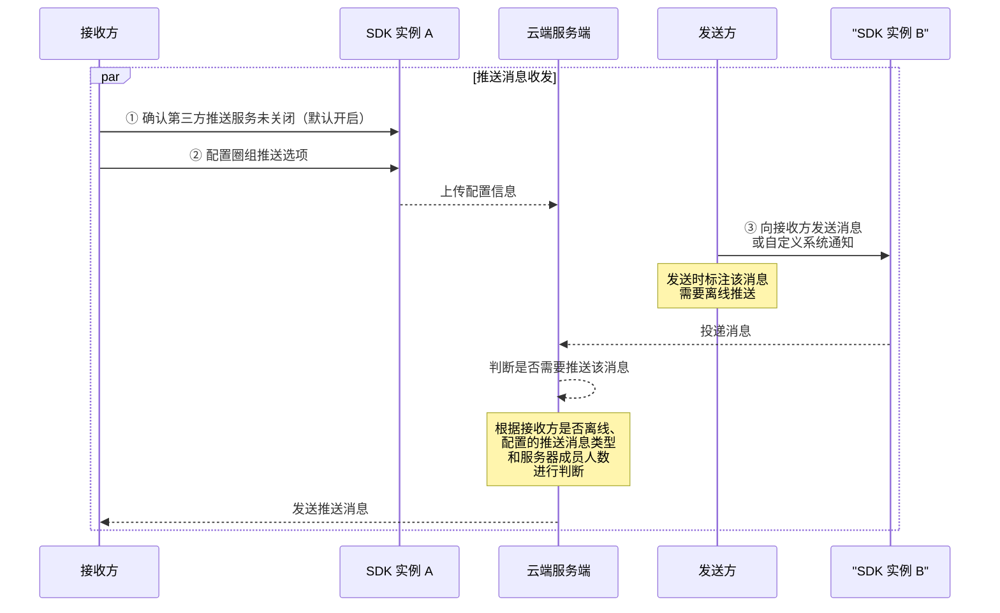

<!--keywords: 推送,圈组推送,消息推送,圈组消息推送 -->


圈组支持接收方在**个人使用的多个维度**（设备、圈组服务器、频道分组和频道）配置需要接收的**推送消息类型**，也支持**发送方**在发消息时决定该消息是否需要推送并配置该消息的推送文案。

NIM SDK 的 [`QChatPushService`](https://doc.yunxin.163.com/docs/interface/messaging/android/doxygen/Latest/zh/interfacecom_1_1netease_1_1nimlib_1_1sdk_1_1mixpush_1_1_q_chat_push_service.html)接口类提供了设备维度的圈组推送服务接口，[`QChatServerService`](https://doc.yunxin.163.com/docs/interface/messaging/android/doxygen/Latest/zh/interfacecom_1_1netease_1_1nimlib_1_1sdk_1_1qchat_1_1_q_chat_server_service.html)接口类提供圈组服务器维度的推送配置方法，[`QChatChannelService`](https://doc.yunxin.163.com/docs/interface/messaging/android/doxygen/Latest/zh/interfacecom_1_1netease_1_1nimlib_1_1sdk_1_1qchat_1_1_q_chat_channel_service.html)接口类提供频道分组维度和频道维度的推送配置方法。


## 功能介绍


圈组根据消息优先级和推送范围的大小确定消息是否离线推送，具体推送机制见下图。


上图中，推送消息被分为高中低优先级三种类型：
- 高优先级消息：@指定人（有具体目标、有@意愿）。对于被@的用户而言，该消息为高优消息。
- 中优先级消息：@所有人、@指定身份组（没有具体目标、有@意愿）。
- 低优先级消息：普通消息（没有具体目标、没有@意愿）。

::: note notice
消息优先级基于**消息接收者**判断。如某消息@A用户，那么对于A用户来说该消息为高优消息，而对于除A外的其他圈组服务器成员而言，该消息为低优消息（普通消息）。
:::

<br>

NIM SDK 支持通过[`QChatPushMsgType`](https://doc.yunxin.163.com/docs/interface/messaging/android/doxygen/Latest/zh/enumcom_1_1netease_1_1nimlib_1_1sdk_1_1qchat_1_1enums_1_1_q_chat_push_msg_type.html)枚举设置需要接收的**推送消息类型**，具体枚举值如下：


<div style="width:150px">枚举值</div> | 说明
---- | --------------
`ALL`| 接收全部类型的推送消息
`HIGH_LEVEL`| 只接收高优先级的推送消息
`HIGH_MID_LEVEL` | 只接收高优先级和中优先级的推送消息
`INHERIT` | 继承**用户个人使用**的上一维度的推送消息类型配置，具体维度从上到下为设备维度、服务器维度、频道分组维度和频道维度。例如，如果服务器维度的推送消息类型设置为`ALL`的情况下，频道分组维度的推送消息类型设置为`INHERIT`，那么频道分组维度的推送消息类型实际也为`ALL`，即接收全部类型的推送消息。
`NONE`  | 全部推送消息都不接收

需要接收的推送消息类型可在**用户个人使用**的不同维度配置，包括设备维度、服务器维度、频道分组维度和频道维度。

- 如果多个维度同时配置了推送消息类型，最终生效的推送消息类型取决于维度的优先级。

    不同维度的优先级为**频道>频道分组>服务器>设备**。最终实际生效的推送消息类型，为 **最高优维度** 的配置。
    
- 圈组在设备维度的推送消息类型默认为**接收全部类型的推送消息**（`ALL`），在其他维度的推送消息类型默认为**继承上一维度的推送消息类型配置**（`INHERIT`）。具体的“继承”示例，可参见本文末尾的[常见问题](#常见问题)。


::: note notice
- 服务器成员数**大于或等于** 2000 人阈值时，即使接收方将推送消息类型设置为“接收全部类型的消息推送”(`ALL`)，也无法收到低优先级消息的离线推送。 
- 如果接收方离线而且消息不走离线推送，接收方可通过[查询历史消息](https://doc.yunxin.163.com/messaging/guide/TM4NDAxMTA?platform=android)的方式获取离线消息。
:::

## 前提条件

在实现圈组的离线推送前，请确保：

- 已了解消息被推送前的流转过程，具体参见[图解圈组消息流转](https://doc.yunxin.163.com/messaging/guide/zI1NTY0MzQ?platform=android)。
- 已在集成 SDK 时集成推送辅助包（关键字：`push`），具体参见[集成 SDK](https://doc.yunxin.163.com/messaging/guide/DAyOTkwMDQ?platform=android#集成)。
- 已在初始化时完成 Android 厂商推送相关基础配置，具体参见[实现 Android 离线推送](https://doc.yunxin.163.com/messaging/guide/zc1OTI2MTM?platform=android)的步骤1 至步骤 3。


## 实现圈组消息推送

实现圈组消息推送的流程如下图所示。

::: note note
下图可能因为网络问题而显示异常。如显示异常，一般刷新当前页面即可正常显示。
:::



  


### **步骤1：开启第三方推送服务**

接收方确认**未关闭**圈组的第三方推送服务。圈组的第三方推送服务**默认开启**。

如需要关闭圈组的第三方推送服务，接收方可调用[`enable`](https://doc.yunxin.163.com/docs/interface/messaging/android/doxygen/Latest/zh/interfacecom_1_1netease_1_1nimlib_1_1sdk_1_1mixpush_1_1_q_chat_push_service.html#a11b7f7322b3233c27c2077269f83e9c5)方法关闭。

```
//开启圈组推送
NIMClient.getService(QChatPushService.class).enable(true).setCallback(new RequestCallback<Void>() {
    @Override
    public void onSuccess(Void param) {
        //开启圈组推送成功
    }

    @Override
    public void onFailed(int code) {
        //开启圈组推送失败，返回错误code
    }

    @Override
    public void onException(Throwable exception) {
        //开启圈组推送异常
    }
});
```
### **步骤2：配置圈组推送选项**

接收方开启圈组的第三方推送服务后，还可按需配置其他选项，包括推送免打扰、推送不展示文案详情、需要接收的推送消息类型等。

#### **圈组推送免打扰**

调用[`setPushNoDisturbConfig`](https://doc.yunxin.163.com/docs/interface/messaging/android/doxygen/Latest/zh/interfacecom_1_1netease_1_1nimlib_1_1sdk_1_1mixpush_1_1_mix_push_service.html#ad94f5562b297adfc5ed7625c7ff6216c)方法可以设置是否开启圈组推送免打扰（若开启，默认免打扰时段为 22：00-08：00），以及设置免打扰时间段。如果设置了免打扰时间，则在该时间段内将不再收到推送。


::: note note
- 圈组推送免打扰默认不开启。 
- 可调用[`observePushNoDisturbConfigUpdate`](https://doc.yunxin.163.com/docs/interface/messaging/android/doxygen/Latest/zh/interfacecom_1_1netease_1_1nimlib_1_1sdk_1_1qchat_1_1_q_chat_service_observer.html#a34405f640623a8c7fb352157fb085931)方法注册推送免打扰配置更新观察者，监听圈组的免打扰配置更新事件通知。
:::

<br>

示例代码如下：

```
//设置圈组推送免打扰时间，设置0点到8点30分之间不发推送信息
NIMClient.getService(QChatPushService.class).setPushNoDisturbConfig(true,"00:00","08:30").setCallback(new RequestCallback<Void>() {
    @Override
    public void onSuccess(Void param) {
        //设置圈组推送免打扰时间成功
    }

    @Override
    public void onFailed(int code) {
        //设置圈组推送免打扰时间失败，返回错误code
    }

    @Override
    public void onException(Throwable exception) {
        //设置圈组推送免打扰时间异常
    }
});
```


#### **圈组推送是否不展示详情**

调用[`setPushShowNoDetail`](https://doc.yunxin.163.com/docs/interface/messaging/android/doxygen/Latest/zh/interfacecom_1_1netease_1_1nimlib_1_1sdk_1_1qchat_1_1model_1_1_q_chat_push_config.html#ab0dfe0f653befaf2a92e7dd9728a9f1b)方法，可设置圈组推送消息是否不展示文案详情。如果不展示详情，默认的推送文案为“你收到一条新消息”。


::: note note
- 圈组推送默认展示文案详情。
- 圈组的推送文案，在发送消息时配置，具体见下文的[步骤3：发消息时配置推送](#步骤3发消息时配置推送)。
:::

<br>

示例代码如下：

```
NIMClient.getService(QChatPushService.class).setPushShowNoDetail(true).setCallback(new RequestCallback<Void>() {
    @Override
    public void onSuccess(Void param) {
        //设置圈组推送是否不展示详情成功
    }

    @Override
    public void onFailed(int code) {
        //设置圈组推送是否不展示详情送失败，返回错误code
    }

    @Override
    public void onException(Throwable exception) {
        //设置圈组推送是否不展示详情异常
    }
});
```


#### **设备维度的推送消息类型**


调用[`setPushMsgType`](https://doc.yunxin.163.com/docs/interface/messaging/android/doxygen/Latest/zh/interfacecom_1_1netease_1_1nimlib_1_1sdk_1_1qchat_1_1model_1_1_q_chat_push_config.html#a692d858e89328169c75487548b08994b)方法设置需要接收的推送消息类型（设备维度）。
示例代码如下：

```
NIMClient.getService(QChatPushService.class).setPushMsgType(QChatPushMsgType.ALL).setCallback(new RequestCallback<Void>() {
    @Override
    public void onSuccess(Void param) {
        //设置成功
    }

    @Override
    public void onFailed(int code) {
        //设置失败，返回错误code
    }

    @Override
    public void onException(Throwable exception) {
        //设置异常
    }
});
```


<div style="display:none"><font color=red>冗余接口，先隐藏</font>

**获取圈组推送配置**

- 调用[`setPushConfig`](https://doc.yunxin.163.com/docs/interface/messaging/android/doxygen/Latest/zh/interfacecom_1_1netease_1_1nimlib_1_1sdk_1_1mixpush_1_1_q_chat_push_service.html#aab2aae88ddd407735eca91968a050024)方法可对圈组推送做整体配置。 

    该方法的参数在[`QChatPushConfigParam`](https://doc.yunxin.163.com/docs/interface/messaging/android/doxygen/Latest/zh/classcom_1_1netease_1_1nimlib_1_1sdk_1_1qchat_1_1param_1_1_q_chat_push_config_param.html)类中定义，参数说明如下：

    参数  | 类型 | 说明     
    :----  |:----| :----- 
    `isPushShowNoDetail`| Boolean| 推送是否不显示详情
    `isNoDisturbOpen`| Boolean |是否开启免打扰
    `startNoDisturbTime`| String |免打扰开始时间，格式 HH:mm
    `stopNoDisturbTime`| String |免打扰结束时间，格式 HH:mm
    `pushMsgType`| [`QChatPushMsgType`](https://doc.yunxin.163.com/docs/interface/messaging/android/doxygen/Latest/zh/enumcom_1_1netease_1_1nimlib_1_1sdk_1_1qchat_1_1enums_1_1_q_chat_push_msg_type.html)|消息推送类型选项


    ```
    QChatPushConfigParam param = new QChatPushConfigParam(false,true,"22:00","08:00", QChatPushMsgType.ALL);
    NIMClient.getService(QChatPushService.class).setPushConfig(param).setCallback(new RequestCallback<Void>() {
        @Override
        public void onSuccess(Void param) {
            //设置成功
        }

        @Override
        public void onFailed(int code) {
            //设置失败，返回错误code
        }

        @Override
        public void onException(Throwable exception) {
            //设置异常
        }
    });
    ```


调用[`getPushConfig`](https://doc.yunxin.163.com/docs/interface/messaging/android/doxygen/Latest/zh/interfacecom_1_1netease_1_1nimlib_1_1sdk_1_1mixpush_1_1_q_chat_push_service.html#a80f38a59b9ab220cc935bec4e0d266d1)获取当前设备圈组推送配置，包括推送是否不显示详情、是否开启免打扰和推送消息类型等。

```
/**
* 获取圈组推送设置
*
* @return QChatPushConfig
*/
QChatPushConfig getPushConfig();
```
</div>


#### **服务器维度的推送消息类型**

调用[`updateUserServerPushConfig`](https://doc.yunxin.163.com/docs/interface/messaging/android/doxygen/Latest/zh/interfacecom_1_1netease_1_1nimlib_1_1sdk_1_1qchat_1_1_q_chat_server_service.html#a8ebb6725437d03aa8ff00edb0661d054)方法更新某个服务器下需要接收的推送消息类型。


::: note note
- 服务器维度的推送消息类型默认为`INHERIT`，即继承设备维度的推送消息类型配置。
- 具体的更新配置示例，参见本文末尾的[常见问题](#常见问题)。
:::

<br>


示例代码如下：


```
NIMClient.getService(QChatServerService.class).updateUserServerPushConfig(new QChatUpdateUserServerPushConfigParam(1607312, QChatPushMsgType.ALL))
                .setCallback(new RequestCallback<Void>() {
                    @Override
                    public void onSuccess(Void param) {
                        //操作成功
                    }

                    @Override
                    public void onFailed(int code) {
                        //操作失败，返回错误code
                    }

                    @Override
                    public void onException(Throwable exception) {
                        //操作异常
                    }
                });

```


#### **频道分组维度的推送消息类型**

调用[`updateUserChannelCategoryPushConfig`](https://doc.yunxin.163.com/docs/interface/messaging/android/doxygen/Latest/zh/interfacecom_1_1netease_1_1nimlib_1_1sdk_1_1qchat_1_1_q_chat_channel_service.html#a89aab244ea7c301fefaf68ecf6767799)方法更新在某个频道分组下需要接收的推送消息类型。


示例代码如下：


```
long serviceId = 2114708;
long categoryId = 17790;
//设置推送之接收高等级消息： @某些人等（有具体目标、有@意愿）
QChatPushMsgType pushMsgType = QChatPushMsgType.HIGH_LEVEL;
QChatUpdateUserChannelCategoryPushConfigParam pushConfigParam = new QChatUpdateUserChannelCategoryPushConfigParam(serviceId,categoryId,pushMsgType)
NIMClient.getService(QChatChannelService.class).updateUserChannelCategoryPushConfig(pushConfigParam).setCallback(
        new RequestCallback<Void>() {
            @Override
            public void onSuccess(Void result) {
                //更新用户频道分组推送配置成功
            }
```


#### **频道维度的推送消息类型**


调用[`updateUserChannelPushConfig`](https://doc.yunxin.163.com/docs/interface/messaging/android/doxygen/Latest/zh/interfacecom_1_1netease_1_1nimlib_1_1sdk_1_1qchat_1_1_q_chat_channel_service.html#ac08c725f10412a6cf4a869447333e4c1)方法更新在某个频道下需要接收的推送消息类型。


::: note note
- 频道维度的推送消息类型默认为`INHERIT`，即继承上一维度（服务器维度或频道分组维度）的推送消息类型配置。
- 具体的更新配置示例，参见本文末尾的[常见问题](#常见问题)。
:::

<br>

示例代码如下：


```
NIMClient.getService(QChatChannelService.class).updateUserChannelPushConfig(new QChatUpdateUserChannelPushConfigParam(1607312, 1492446L,QChatPushMsgType.ALL))
                .setCallback(new RequestCallback<Void>() {
                    @Override
                    public void onSuccess(Void param) {
                        //操作成功
                    }

                    @Override
                    public void onFailed(int code) {
                        //操作失败，返回错误code
                    }

                    @Override
                    public void onException(Throwable exception) {
                        //操作异常
                    }
                });

```


### **步骤3：发消息时配置推送**


发送方调用[`sendMessage`](https://doc.yunxin.163.com/docs/interface/messaging/android/doxygen/Latest/zh/interfacecom_1_1netease_1_1nimlib_1_1sdk_1_1qchat_1_1_q_chat_message_service.html#a50851a1367f29b3162f2ae3afcf48624)方法[发送某条消息](https://doc.yunxin.163.com/messaging/guide/TE1MjI2MDI?platform=android#实现消息收发)时，或调用[`sendSystemNotification`](https://doc.yunxin.163.com/docs/interface/messaging/android/doxygen/Latest/zh/interfacecom_1_1netease_1_1nimlib_1_1sdk_1_1qchat_1_1_q_chat_message_service.html#a4ed011f932cfa8b849adacc0caefe47c)方法发送自定义系统通知时，确认其内置方法`setPushEnable`设置为 true，即该消息需要推送。

::: note note
`setPushEnable`默认为 true，即圈组的消息默认需要推送。
:::

<br>

发送方发消息或自定义系统通知时还可配置如下选项：


<div style="width:120px">内置方法</div> |说明
---- | -------------- 
[`isNeedPushNick`](https://doc.yunxin.163.com/docs/interface/messaging/android/doxygen/Latest/zh/classcom_1_1netease_1_1nimlib_1_1sdk_1_1qchat_1_1param_1_1_q_chat_send_message_param.html#a8a15bc008e10bea95d03ec87b00410ca)  | 是否需要推送昵称，默认为用户昵称
[`setPushContent`](https://doc.yunxin.163.com/docs/interface/messaging/android/doxygen/Latest/zh/classcom_1_1netease_1_1nimlib_1_1sdk_1_1qchat_1_1param_1_1_q_chat_send_message_param.html#ad861d1e6df4650ae6173246c822bc38a) | 设置推送文案，长度限制 500 字符，撤回消息时该字段无效
[`setPushPayload`](https://doc.yunxin.163.com/docs/interface/messaging/android/doxygen/Latest/zh/classcom_1_1netease_1_1nimlib_1_1sdk_1_1qchat_1_1param_1_1_q_chat_send_message_param.html#af52a47c4a19a93033911a608621d6422) | 设置推送的 payload 进行自定义配置，例如可通过设置消息体`QChatMessage`的 payload 实现点击通知栏跳转至目标界面（相关说明参考[推送通知栏跳转](https://doc.yunxin.163.com/messaging/guide/zc1OTI2MTM?platform=android#推送通知栏跳转)）。长度限制 2000 字符，撤回消息时该字段无效


## 获取圈组推送配置

接收方配置了上文提及的[圈组推送选项](#配置圈组推送选项)后，在其他设备端登录时，可按需调用如下方法获取相应的配置。 


### 获取是否已开启第三方推送

调用[`isEnable`](https://doc.yunxin.163.com/docs/interface/messaging/android/doxygen/Latest/zh/classcom_1_1netease_1_1nimlib_1_1sdk_1_1chatroom_1_1model_1_1_chat_room_cdn_info.html#ad83722cb2c3195819bfb523470a45ea3)方法，判断是否已经开启了圈组的第三方推送服务。

### 获取圈组推送免打扰配置


调用[`getPushNoDisturbConfig`](https://doc.yunxin.163.com/docs/interface/messaging/android/doxygen/Latest/zh/interfacecom_1_1netease_1_1nimlib_1_1sdk_1_1mixpush_1_1_mix_push_service.html#a17e00cdda422205bb61ebb369e5d93c9)方法获取免打扰时间设置。

```
/**
* 获取圈组推送免打扰设置
*
* @return NoDisturbConfig
*/
NoDisturbConfig getPushNoDisturbConfig();
```

### 获取推送是否不展示详情


调用[`isPushShowNoDetail`](https://doc.yunxin.163.com/docs/interface/messaging/android/doxygen/Latest/zh/interfacecom_1_1netease_1_1nimlib_1_1sdk_1_1qchat_1_1model_1_1_q_chat_push_config.html#a86c8f8eb8c33964a69e7eb12d67f60cf)方法判断圈组推送是否不展示文案详情。

```
/**
* 获取圈组推送是否不展示详情
*
* @return 当前是否不展示详情
*/
boolean isPushShowNoDetail();
```

### 获取设备维度的推送消息类型


调用[`getPushMsgType`](https://doc.yunxin.163.com/docs/interface/messaging/android/doxygen/Latest/zh/interfacecom_1_1netease_1_1nimlib_1_1sdk_1_1qchat_1_1model_1_1_q_chat_push_config.html#acb38fe7366bc6750a33ac614820f6e34)获取在设备维度需要接收的推送消息类型的配置。


```
/**
* 获取推送消息类型
* @return
*/
QChatPushMsgType getPushMsgType();
```

### 获取服务器维度的推送配置列表
调用[`getUserServerPushConfigs`](https://doc.yunxin.163.com/docs/interface/messaging/android/doxygen/Latest/zh/interfacecom_1_1netease_1_1nimlib_1_1sdk_1_1qchat_1_1_q_chat_server_service.html#a96277f1e0e765413cc04b3ab3ccbdd99)方法查询多个服务器的推送配置列表。 


::: note notice
单次调用最多可传入 10 个服务器 ID 进行查询。
:::


示例代码如下：

```
List<Long> serverIdList = getServerIdList();
NIMClient.getService(QChatServerService.class).getUserServerPushConfigs(new QChatGetUserServerPushConfigsParam(serverIdList))
        .setCallback(new RequestCallback<QChatGetUserPushConfigsResult>() {
            @Override
            public void onSuccess(QChatGetUserPushConfigsResult result) {
                //操作成功
                List<QChatUserPushConfig> userPushConfigs = result.getUserPushConfigs();
            }

            @Override
            public void onFailed(int code) {
                //操作失败，返回错误code
            }

            @Override
            public void onException(Throwable exception) {
                //操作异常
            }
        });

```


### 获取频道分组维度的推送配置列表

调用[`getUserChannelCategoryPushConfigs`](https://doc.yunxin.163.com/docs/interface/messaging/android/doxygen/Latest/zh/interfacecom_1_1netease_1_1nimlib_1_1sdk_1_1qchat_1_1_q_chat_channel_service.html#ac8270d7a5d0e76cfac781e9a6821bc80)获取多个频道分组的推送配置列表。 


::: note notice
单次调用最多可传入 10 个频道分组 ID 进行查询。
:::


示例代码如下：

```
long serviceId = 2114708;
long categoryId = 17790;
List<QChatChannelCategoryIdInfo> channelCategoryIdInfos = new ArrayList<>();
channelCategoryIdInfos.add(new QChatChannelCategoryIdInfo(serviceId,categoryId));
QChatGetUserChannelCategoryPushConfigsParam getUserChannelCategoryPushConfigsParam = new QChatGetUserChannelCategoryPushConfigsParam(channelCategoryIdInfos);
NIMClient.getService(QChatChannelService.class).getUserChannelCategoryPushConfigs(getUserChannelCategoryPushConfigsParam).setCallback(
        new RequestCallback<QChatGetUserPushConfigsResult>() {
            @Override
            public void onSuccess(QChatGetUserPushConfigsResult result) {
                //获取查询到的用户推送配置列表
                List<QChatUserPushConfig> userPushConfigs = result.getUserPushConfigs();
            }

            @Override
            public void onFailed(int code) {
                //查询失败
            }

            @Override
            public void onException(Throwable exception) {
                //查询异常
            }
        });
```


### 获取频道维度的推送配置列表

调用[`getUserChannelPushConfigs`](https://doc.yunxin.163.com/docs/interface/messaging/android/doxygen/Latest/zh/interfacecom_1_1netease_1_1nimlib_1_1sdk_1_1qchat_1_1_q_chat_channel_service.html#a984902ae40bef9afed242a1f10f722e3)获取多个频道的推送配置列表。


::: note notice
单次调用最多可传入 10 个频道 ID 进行查询。
:::

示例代码如下：

```
List<QChatChannelIdInfo> channelIdInfos = getChannelIdInfos();
NIMClient.getService(QChatChannelService.class).getUserChannelPushConfigs(new QChatGetUserChannelPushConfigsParam(channelIdInfos))
        .setCallback(new RequestCallback<QChatGetUserPushConfigsResult>() {
            @Override
            public void onSuccess(QChatGetUserPushConfigsResult result) {
                //操作成功
                List<QChatUserPushConfig> userPushConfigs = result.getUserPushConfigs();
            }

            @Override
            public void onFailed(int code) {
                //操作失败，返回错误code
            }

            @Override
            public void onException(Throwable exception) {
                //操作异常
            }
        });

```

## 常见问题

### 1. 如何实现不接收某个服务器的离线消息推送？

调用[`updateUserServerPushConfig`](https://doc.yunxin.163.com/docs/interface/messaging/android/doxygen/Latest/zh/interfacecom_1_1netease_1_1nimlib_1_1sdk_1_1qchat_1_1_q_chat_server_service.html#a8ebb6725437d03aa8ff00edb0661d054)方法时，通过`serverId`指定需要静默的服务器的 ID，并将`pushMsgType`设置为`NONE`。调用成功后，该用户将不再接收指定服务器的离线消息推送。 


### 2. 如何实现只接收某个服务器的高优离线消息推送？


用户**首次**配置圈组的离线消息推送时，按照如下步骤配置即可：

1. 调用[`setPushMsgType`](https://doc.yunxin.163.com/docs/interface/messaging/android/doxygen/Latest/zh/interfacecom_1_1netease_1_1nimlib_1_1sdk_1_1qchat_1_1model_1_1_q_chat_push_config.html#a692d858e89328169c75487548b08994b)方法，调用时将`pushMsgType`设置为`NONE`。


    本步骤完成后，**用户个人使用**的设备维度和服务器维度的推送消息类型配置，具体如下：

    用户个人使用的维度  | 推送消息类型 |  实际生效 |说明
    ---- |----|------
    设备 | `NONE` | `NONE` |  当前设备不接收圈组内所有推送消息
    服务器 |默认为`INHERIT` | `NONE` | 继承设备维度的配置，即“不接收服务器维度的所有推送消息”

2. 调用[`updateUserServerPushConfig`](https://doc.yunxin.163.com/docs/interface/messaging/android/doxygen/Latest/zh/interfacecom_1_1netease_1_1nimlib_1_1sdk_1_1qchat_1_1_q_chat_server_service.html#a8ebb6725437d03aa8ff00edb0661d054)方法更新服务器的推送消息配置，调用时完成如下配置：


    <div style="width:160px">参数</div> |  说明
    ---- | -----
    `serverId` | 指定服务器的 ID，假设此处指定的服务器为<font color=red>服务器A</font>
    `pushMsgType` | 设置为`HIGH_LEVEL`


    本步骤完成后，**用户个人使用**的设备维度和服务器维度的推送消息类型配置，具体如下：


    用户个人使用的维度  | 推送消息类型 |  实际生效 |说明
    ---- |----|------
    设备 | `NONE` | `NONE` |  当前设备不接收圈组内所有推送消息
    其他服务器 |仍为`INHERIT` | `NONE` | 继承设备维度的配置，即“不接收服务器维度的所有推送消息”
    <font color=red>服务器A</font>  |  <font color=red>`HIGH_LEVEL`</font> | <font color=red>`HIGH_LEVEL`</font> | 只接收<font color=red>服务器A</font> 内的“@消息”等高优先级的推送消息


### 3. 如何实现不接收某个频道的离线消息推送？


调用[`updateUserChannelPushConfig`](https://doc.yunxin.163.com/docs/interface/messaging/android/doxygen/Latest/zh/interfacecom_1_1netease_1_1nimlib_1_1sdk_1_1qchat_1_1_q_chat_channel_service.html#ac08c725f10412a6cf4a869447333e4c1)方法，调用时通过`serverId`指定频道所属的服务器的ID，并将`pushMsgType`设置为`NONE`。调用成功后，该用户将不再接收指定频道的所有离线消息推送。

### 4. 如何实现只接收某个频道的高优先级离线消息推送？


用户**首次**配置圈组的离线消息推送时，按照如下步骤配置即可：


1. 调用[`setPushMsgType`](https://doc.yunxin.163.com/docs/interface/messaging/android/doxygen/Latest/zh/interfacecom_1_1netease_1_1nimlib_1_1sdk_1_1qchat_1_1model_1_1_q_chat_push_config.html#a692d858e89328169c75487548b08994b)方法更新设备维度的推送消息类型配置，**调用时将`pushMsgType`设置为`NONE`**。


    本步骤完成后，**用户个人使用**的各个维度的推送消息类型配置，具体如下：

    用户个人使用的维度  | 推送消息类型 |  实际生效 |说明
    ---- |----|------
    设备 | `NONE` | `NONE` |  当前设备不接收圈组内所有推送消息
    服务器 |默认为`INHERIT` | `NONE` | 继承设备维度的配置，即在频道所属的服务器“不接收所有推送消息”
    频道分组 |默认为`INHERIT` | `NONE` |继承服务器维度的配置，即在频道所属的频道分组“不接收所有推送消息”
    频道 | 默认为`INHERIT` | `NONE` | 继承频道分组维度的配置，即在频道“不接收所有推送消息” <note type=note>如果无频道分组，则将直接继承服务器维度的配置。</note>
    


2. 调用[`updateUserChannelPushConfig`](https://doc.yunxin.163.com/docs/interface/messaging/android/doxygen/Latest/zh/interfacecom_1_1netease_1_1nimlib_1_1sdk_1_1qchat_1_1_q_chat_channel_service.html#ac08c725f10412a6cf4a869447333e4c1)方法，调用时完成如下配置：

    <div style="width:160px">参数</div> |  说明
    ---- | -----
    `serverId` | 指定频道所属的服务器的 ID
    `channelId` | 指定需要接收高优推送消息的频道的 ID，<font color=red>假设此处指定的为频道A</font>
    `pushMsgType` | 设置为`HIGH_LEVEL`


    本步骤完成后，**用户个人使用**的各个维度的推送消息类型配置，将如下表所示：

    用户个人使用的维度  | <div style="width:160px">推送消息类型</div> |  <div style="width:120px">实际生效</div> |说明
    ---- |----|------
    设备 | `NONE` | `NONE` |  当前设备不接收圈组内所有推送消息
    服务器 |仍为`INHERIT` | `NONE` | 继承设备维度的配置，即在频道所属的服务器“不接收所有推送消息”
    频道分组 |仍为`INHERIT` | `NONE` |继承服务器维度的配置，即在频道所属的频道分组“不接收所有推送消息”
    <font color=red>频道A</font> | <font color=red>`HIGH_LEVEL`</font> | <font color=red>`HIGH_LEVEL`</font> | 只接收<font color=red>频道A</font> 内的“@消息”等高优先级的推送消息
    服务器的其他频道 | 仍为`INHERIT` | `NONE` |继承服务器维度的配置，即“不接收频道内所有推送消息”
    
