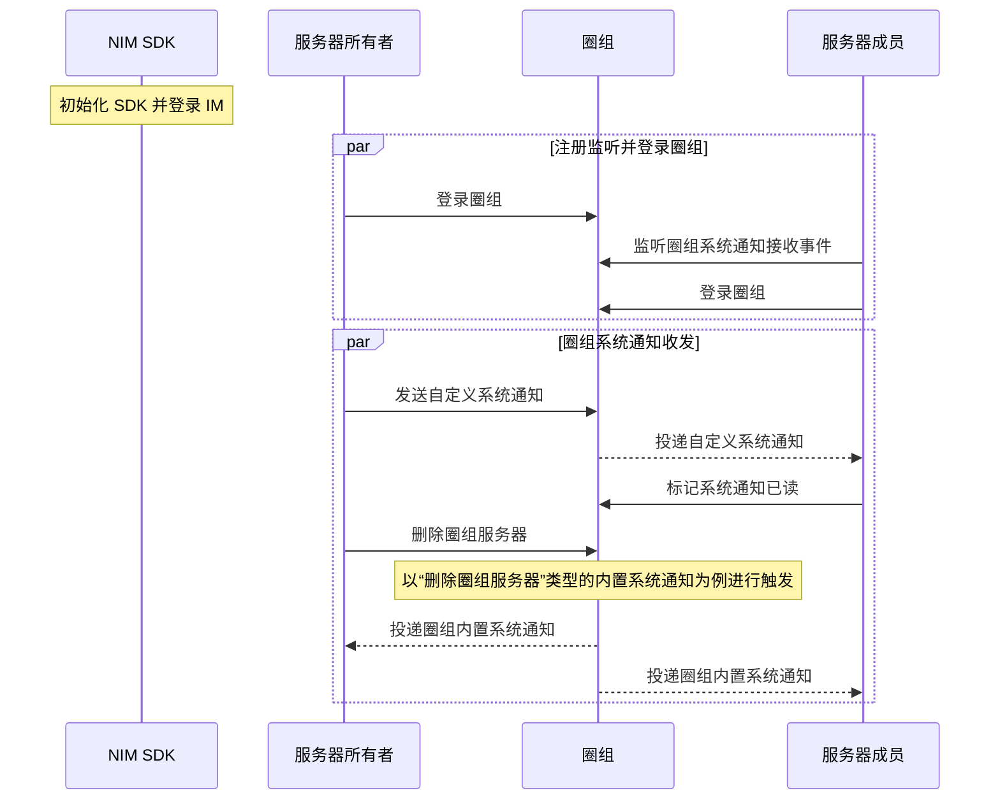

圈组系统通知是用户在使用圈组功能的过程中，由云信 IM 下发给用户相关事件的通知，比如圈组服务器中的成员变更，频道变更等事件。

## 功能介绍

圈组内置系统通知只能通过具体事件触发，由云信 IM 发送给相关的圈组用户。用户只需注册圈组系统通知的相关监听，就能接收到对应的系统通知。

圈组自定义系统通知支持用户主动发送，并可以指定发送给全员或部分成员。

云信 IM Android SDK 的 [`QChatMessageService`](https://doc.yunxin.163.com/docs/interface/messaging/android/doxygen/Latest/zh/interfacecom_1_1netease_1_1nimlib_1_1sdk_1_1qchat_1_1_q_chat_message_service.html) 接口提供管理圈组系统通知的相关方法，[`QChatServiceObserver`](https://doc.yunxin.163.com/docs/interface/messaging/android/doxygen/Latest/zh/interfacecom_1_1netease_1_1nimlib_1_1sdk_1_1qchat_1_1_q_chat_service_observer.html) 接口提供监听圈组系统通知的相关方法，帮助您快速实现对圈组系统通知的管理。

NIM SDK 中的 [`QChatSystemNotification`](https://doc.yunxin.163.com/docs/interface/messaging/android/doxygen/Latest/zh/interfacecom_1_1netease_1_1nimlib_1_1sdk_1_1qchat_1_1model_1_1_q_chat_system_notification.html) 类定义了圈组的系统通知，其内置方法如下：

<details><summary>单击展开查看 QChatSystemNotification 的内置方法</summary>

| 返回值类型  | 内置方法  | 说明     |
|  ----  | ----  | --------- |
|String|getAttach()|系统通知附件|
|[`QChatSystemNotificationAttachment`](https://doc.yunxin.163.com/docs/interface/messaging/android/doxygen/Latest/zh/interfacecom_1_1netease_1_1nimlib_1_1sdk_1_1qchat_1_1model_1_1systemnotification_1_1_q_chat_system_notification_attachment.html)|getAttachment()|系统通知附件字符串解析后的结构|
|String|getBody()|系统通知内容|
|String|getCallbackExtension()|获取第三方回调的自定义扩展字段|
|long|getChannelId()|系统通知所属的频道的 ID|
|String|getEnv()|获取环境变量,用于指向不同的抄送，第三方回调等配置|
|String|getExtension()|扩展字段|
|String|getFromAccount()|系统通知发送者的 accid|
|int|getFromClientType()|系统通知发送者的客户端类型|
|String|getFromDeviceId()|发送方设备 ID|
|String|getFromNick()|发送方昵称|
|String|getMsgIdClient()|客户端生成的系统通知 ID，用于去重|
|long|getMsgIdServer()|服务器生成的系统通知 ID，全局唯一|
|String|getPushContent()|自定义推送文案|
|String|getPushPayload()|第三方自定义的推送属性，限制使用 JSON 格式|
|int|getRawType()|获取通知类型裸数据，可能是新增通知类型，但是SDK还未更新，枚举还未添加|
|long|getServerId()|系统通知所属的圈组服务器的 ID|
|int|getStatus()|系统通知状态，可自定义。默认为 0，大于 10,000 为用户自定义的状态|
|long|getTime()|系统通知发送时间|
|List<String>|getToAccids()|系统通知接收者账号列表|
|[`QChatSystemMessageToType`](https://doc.yunxin.163.com/docs/interface/messaging/android/doxygen/Latest/zh/enumcom_1_1netease_1_1nimlib_1_1sdk_1_1qchat_1_1enums_1_1_q_chat_system_message_to_type.html)|getToType()|系统通知发送对象类型。主要分为服务器，服务器成员，频道，频道成员|
|[`QChatSystemNotificationType`](https://doc.yunxin.163.com/docs/interface/messaging/android/doxygen/Latest/zh/enumcom_1_1netease_1_1nimlib_1_1sdk_1_1qchat_1_1enums_1_1_q_chat_system_notification_type.html)|getType()|系统通知类型,具体系统通知类型的接收条件等信息，可参考服务器的 [`QChatSystemMsgType`](https://doc.yunxin.163.com/docs/TM5MzM5Njk/TkxMzc1NDg?platformId=60353#%E5%86%85%E7%BD%AE%E7%B3%BB%E7%BB%9F%E9%80%9A%E7%9F%A5%E7%B1%BB%E5%9E%8B)|
|long|getUpdateTime()|系统通知更新时间|
|boolean|isNeedBadge()|是否需要消息计数|
|boolean|isNeedPushNick()|是否需要推送昵称|
|boolean|isPersistEnable()|是否存离线，只有`toAccids`不为空，才能设置为存离线|
|boolean|isPushEnable()|是否需要推送，默认 false|
|boolean|isRouteEnable()|是否需要抄送，默认 true|
|void|setEnv(String env)|设置环境变量,用于指向不同的抄送，第三方回调等配置|

</details>


## 实现方法

本文以服务器所有者（即创建者）和服务器成员的交互为例，介绍服务器所有者发送圈组自定义系统通知的实现流程和触发内置圈组系统通知的实现流程。

### 前提条件

- 已[接入圈组](https://doc.yunxin.163.com/messaging/guide/Tk3NzY0OTM?platform=android)，并已创建圈组服务器。
- 已[创建](https://doc.yunxin.163.com/messaging/guide/DQ3Nzk1MTY?platform=server)云信 IM 账号，作为下文中服务器所有者和服务器成员的云信 IM 账号。

:::note notice
如果用户所在服务器的成员人数超过 2000 人阈值，该用户还需先订阅相应的服务器或频道，才能收到对应服务器或频道的系统通知。如未超过该阈值，则无需订阅。订阅相关说明，请参见[圈组订阅机制](https://doc.yunxin.163.com/messaging/guide/zgwMzQ5MDk?platform=android)。
:::

### 实现流程




**以下只对部分重要步骤进行说明：**

1. 服务器成员注册 [`observeReceiveSystemNotification`](https://doc.yunxin.163.com/docs/interface/messaging/android/doxygen/Latest/zh/interfacecom_1_1netease_1_1nimlib_1_1sdk_1_1qchat_1_1_q_chat_service_observer.html#a243ce250bbef08d40a52f24f12d1007c) 监听圈组系统通知的接收。

    示例代码：
    ```
    NIMClient.getService(QChatServiceObserver.class).observeReceiveSystemNotification(new Observer<List<QChatSystemNotification>>() {
    @Override
    public void onEvent(List<QChatSystemNotification> qChatSystemNotifications) {
    //收到圈组系统通知
    for (QChatSystemNotification qChatSystemNotification : qChatSystemNotifications) {
    //处理圈组系统通知
    }
    }
    }, true);
    ```

2. 服务器所有者通过调用 [`sendSystemNotification`](https://doc.yunxin.163.com/docs/interface/messaging/android/doxygen/Latest/zh/interfacecom_1_1netease_1_1nimlib_1_1sdk_1_1qchat_1_1_q_chat_message_service.html#a4ed011f932cfa8b849adacc0caefe47c) 发送圈组自定义系统通知。

    其中 `QChatSendSystemNotificationParam` 是发送圈组自定义系统通知入参，提供四种构造方法，通过入参的不同来进行区分，通知给不同的对象：

    通知的对象|涉及的入参
    :----|:----
    通知给圈组服务器全员|serverId（服务器 ID）
    通知给圈组服务器中的某个频道全员|serverId（服务器 ID），channelId（频道 ID）
    通知给圈组服务器中的部分成员|serverId（服务器 ID），toAccids（通知的服务器成员列表）
    通知给圈组服务器中的某个频道中的部分成员|serverId（服务器 ID），channelId（频道 ID），toAccids（通知的频道成员列表）

    若需要在发送自定义系统通知前提前构造一个 `QChatSystemNotification`，您可以通过 `QChatSendSystemNotificationParam` 的[`toSystemNotification`](https://doc.yunxin.163.com/docs/interface/messaging/android/doxygen/Latest/zh/classcom_1_1netease_1_1nimlib_1_1sdk_1_1qchat_1_1param_1_1_q_chat_send_system_notification_param.html#a780a462f71544fc7a5b8be1d7c9d1bb8) 构造圈组自定义系统通知。

    示例代码：
    ```
    QChatSendSystemNotificationParam param = new QChatSendSystemNotificationParam(943445L,885305L);
    param.setBody("测试自定义系统通知");
    param.setExtension(getExtension());
    param.setPushPayload(getPushPayload());
    param.setPushContent("测试推送自定义系统通知");
    param.setPushEnable(true);
    param.setNeedBadge(true);
    param.setNeedPushNick(true);

    QChatSystemNotification currentSystemNotification = param.toSystemNotification();

    NIMClient.getService(QChatMessageService.class).sendSystemNotification(param).setCallback(new RequestCallback<QChatSendSystemNotificationResult>() {
    @Override
    public void onSuccess(QChatSendSystemNotificationResult result) {
    //发送自定义系统通知成功,返回发送成功的自定义系统通知具体信息
            QChatSystemNotification notification = result.getSentCustomNotification();
    }

    @Override
    public void onFailed(int code) {
    //发送自定义系统通知息失败，返回错误code
    }

    @Override
    public void onException(Throwable exception) {
    //发送自定义系统通知异常
    }
    });
    ```

3. 服务器成员收到来自服务器所有者的自定义系统通知。

4. 服务器成员通过调用 [`markSystemNotificationsRead`](https://doc.yunxin.163.com/docs/interface/messaging/android/doxygen/Latest/zh/interfacecom_1_1netease_1_1nimlib_1_1sdk_1_1qchat_1_1_q_chat_message_service.html#a6c459d837e7c6d4e69be0afcb6bd3007) 标记圈组系统通知已读。

    标记已读后的系统通知将从服务端删除，后续不会在其他端接收。

    示例代码：
    ```
    QChatSystemNotification systemNotification = getMarkSystemNotification();
    List<Pair<Long, QChatSystemNotificationType>> pairs = new ArrayList<>();
    pairs.add(new Pair<>(systemNotification.getMsgIdServer(),systemNotification.getType()));

    QChatMarkSystemNotificationsReadParam param = new QChatMarkSystemNotificationsReadParam(pairs);
    NIMClient.getService(QChatMessageService.class).markSystemNotificationsRead(param).setCallback(new RequestCallback<Void>() {
        @Override
        public void onSuccess(Void result) {
            //标记成功
        }

        @Override
        public void onFailed(int code) {
            //标记失败
        }

        @Override
        public void onException(Throwable exception) {
            //标记异常
        }
    });
    ```

5. 服务器所有者调用 [`deleteServer`](https://doc.yunxin.163.com/docs/interface/messaging/android/doxygen/Latest/zh/interfacecom_1_1netease_1_1nimlib_1_1sdk_1_1qchat_1_1_q_chat_server_service.html#a4ac1c9ac8179f5a359386cdee4685752) 方法删除圈组服务器。

    示例代码：
    ```
    NIMClient.getService(QChatServerService.class).deleteServer(new QChatDeleteServerParam(944335L)).setCallback(
            new RequestCallback<Void>() {
                @Override
                public void onSuccess(Void result) {
                    // 删除Server成功
                }

                @Override
                public void onFailed(int code) {
                    //  删除Server失败，返回错误code
                }

                @Override
                public void onException(Throwable exception) {
                    //  删除Server异常
                }
            });

    ```
6. 服务器所有者和服务器成员收到系统投递的内置系统通知。

    :::note notice
    该示例收到类型为“删除服务器”的系统通知，更多事件类型和相应的通知接收条件，请参见[圈组系统通知分类](https://doc.yunxin.163.com/messaging/guide/jM4NjQwNzU?platform=android#圈组系统通知分类)和[圈组系统通知接收机制](https://doc.yunxin.163.com/messaging/guide/jM4NjQwNzU?platform=android#圈组系统通知接收机制)。
    :::

7. （可选）如果因为网络等原因，自定义系统通知发送失败，用户可以调用 [`resendSystemNotification`](https://doc.yunxin.163.com/docs/interface/messaging/android/doxygen/Latest/zh/interfacecom_1_1netease_1_1nimlib_1_1sdk_1_1qchat_1_1_q_chat_message_service.html#a5b05a082ed655e152a3365ef61d1d718) 方法重新发送自定义系统通知。

    :::note notice
    如果重发已经发送成功的自定义系统通知，那么通知接收方不会再次收到该系统通知。
    :::

    示例代码：
    ```
    NIMClient.getService(QChatMessageService.class).resendSystemNotification(new QChatResendSystemNotificationParam(currentSystemNotification)).setCallback(new RequestCallback<QChatSendSystemNotificationResult>() {
        @Override
        public void onSuccess(QChatSendSystemNotificationResult result) {
            //重发自定义系统通知成功,返回发送成功的自定义系统通知具体信息
            QChatSystemNotification notification = result.getSentCustomNotification();
        }

        @Override
        public void onFailed(int code) {
            //重发自定义系统通知息失败，返回错误code
        }

        @Override
        public void onException(Throwable exception) {
            //重发自定义系统通知异常
        }
    });
    ```

