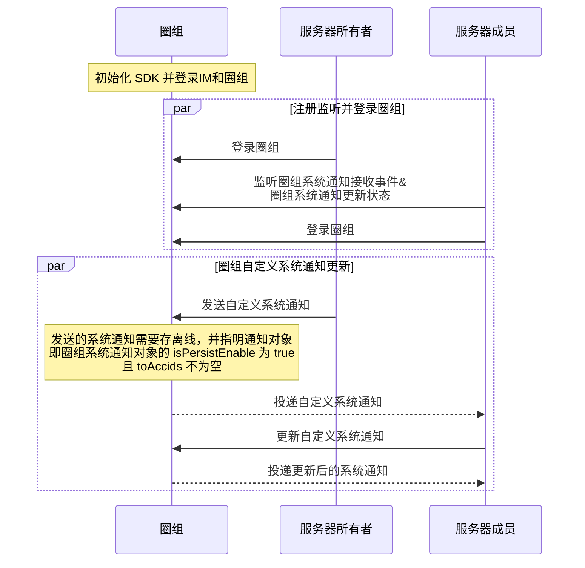
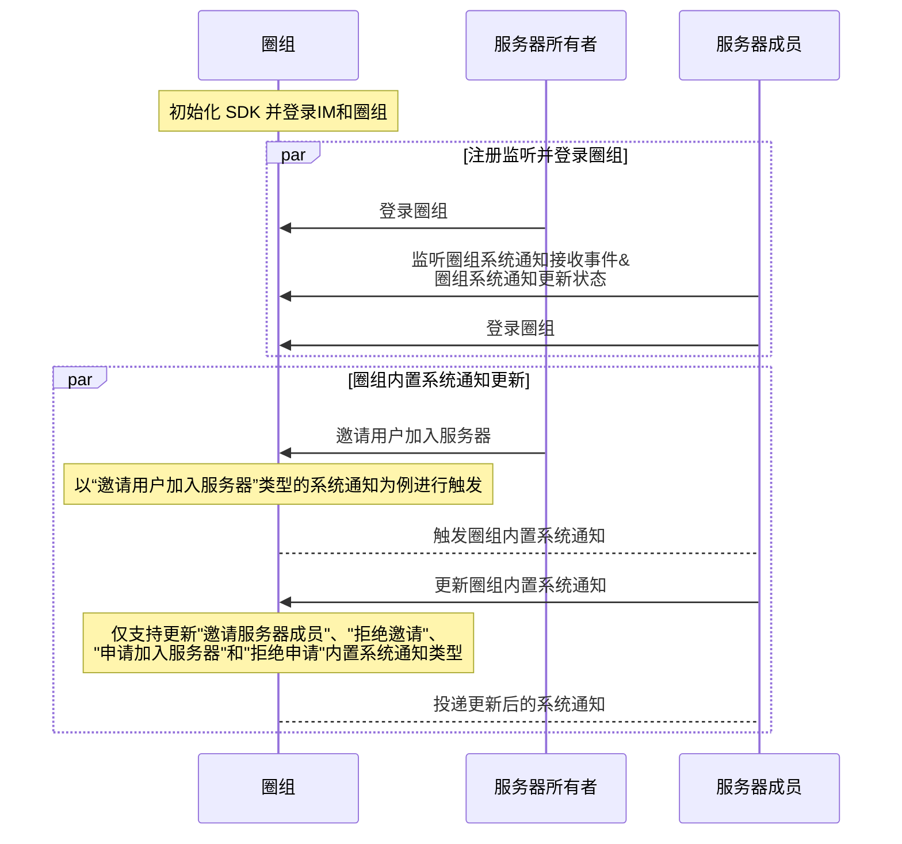

NIM SDK 支持更新已发送的圈组系统通知。


## 功能介绍

用户可通过 [`QChatMessageService`](https://doc.yunxin.163.com/docs/interface/messaging/android/doxygen/Latest/zh/interfacecom_1_1netease_1_1nimlib_1_1sdk_1_1qchat_1_1_q_chat_message_service.html) 中的 [`updateSystemNotification`](https://doc.yunxin.163.com/docs/interface/messaging/android/doxygen/Latest/zh/interfacecom_1_1netease_1_1nimlib_1_1sdk_1_1qchat_1_1_q_chat_message_service.html#a5f8e4b6af8ad3d5a9593a3d7dc16bfe9) 方法更新圈组系统通知的部分信息，如系统通知中的内容、自定义扩展字段等。


支持更新的圈组系统通知类型如下表所示：

系统通知分类 || [QChatSystemNotificationType](https://doc.yunxin.163.com/docs/interface/messaging/android/doxygen/Latest/zh/enumcom_1_1netease_1_1nimlib_1_1sdk_1_1qchat_1_1enums_1_1_q_chat_system_notification_type.html)的枚举值   | 相关限制
---- | --------------
内置系统通知|邀请服务器成员 | `SERVER_MEMBER_INVITE ` | 默认自动存离线。这四种通知每月总共至多存 1000 条离线，**超限后将无法更新通知的信息**
^^|拒绝邀请  | `SERVER_MEMBER_INVITE_REJECT `|^^
^^|申请加入服务器 |`SERVER_MEMBER_APPLY ` | ^^
^^ |拒绝申请 |`SERVER_MEMBER_APPLY_REJECT ` | ^^
自定义系统通知|| `CUSTOM ` |  只有**存离线**的自定义系统通知才能更新。每月至多存 1000 条离线，**超限后将无法更新通知的信息**

::: note notice
- 只有指明通知接收者的自定义系统通知才能设置存离线，即圈组系统通知对象的 `toAccids` 不为空。
- 其他内置系统通知，不支持更新。具体的内置系统通知类型，请参见<a href="https://doc.yunxin.163.com/messaging/guide/TkxMzc1NDg?platform=server#内置系统通知类型" target="_blank">内置系统通知类型</a>。
:::

## 实现方法

本文以服务器所有者（即创建者）和服务器成员的交互为例，介绍服务器成员更新圈组自定义系统通知和内置系统通知的实现流程。

### 前提条件

- 已[接入圈组](https://doc.yunxin.163.com/messaging/guide/Tk3NzY0OTM?platform=android)，并已创建圈组服务器。
- 已[创建](https://doc.yunxin.163.com/messaging/guide/DQ3Nzk1MTY?platform=server)云信 IM 账号，作为下文中服务器所有者和服务器成员的云信 IM 账号。

:::note notice
如果用户所在服务器的成员人数超过 2000 人阈值，该用户还需先订阅相应的服务器或频道，才能收到对应服务器或频道的系统通知。如未超过该阈值，则无需订阅。订阅相关说明，请参见[圈组订阅机制](https://doc.yunxin.163.com/messaging/guide/zgwMzQ5MDk?platform=android)。
:::

### 实现流程

::::: div custom-tabs 
::: tab 圈组自定义系统通知更新


::: 
::: tab 圈组内置系统通知更新


:::
::::::

**以下只对部分重要步骤进行说明：**

1. 服务器成员在登录圈组前，注册 [`observeReceiveSystemNotification`](https://doc.yunxin.163.com/docs/interface/messaging/android/doxygen/Latest/zh/interfacecom_1_1netease_1_1nimlib_1_1sdk_1_1qchat_1_1_q_chat_service_observer.html#a243ce250bbef08d40a52f24f12d1007c) 和 [`observeSystemNotificationUpdate`](https://doc.yunxin.163.com/docs/interface/messaging/android/doxygen/Latest/zh/interfacecom_1_1netease_1_1nimlib_1_1sdk_1_1qchat_1_1_q_chat_service_observer.html#a4d05b53fc6e44f96272ced2dfd3aa00d) 分别监听圈组系统通知接收和圈组系统通知更新状态。

    示例代码：

    :::::: div custom-tabs
    ::: tab 监听圈组系统通知接收
    ```
    NIMClient.getService(QChatServiceObserver.class).observeReceiveSystemNotification(new Observer<List<QChatSystemNotification>>() {
    @Override
    public void onEvent(List<QChatSystemNotification> qChatSystemNotifications) {
    //收到圈组系统通知
    for (QChatSystemNotification qChatSystemNotification : qChatSystemNotifications) {
    //处理圈组系统通知
    }
    }
    }, true);
    ```
    :::
    ::: tab 圈组系统通知更新状态
    ```
    NIMClient.getService(QChatServiceObserver.class).observeSystemNotificationUpdate(new Observer<QChatSystemNotificationUpdateEvent>() {
        @Override
        public void onEvent(QChatSystemNotificationUpdateEvent event) {
            //更新成功，返回更新后的系统通知
            QChatSystemNotification systemNotification = event.getSystemNotification();
        }
    }, true);
    ```
    :::
    ::::::

2. 服务器所有者通过调用 [`sendSystemNotification`](https://doc.yunxin.163.com/docs/interface/messaging/android/doxygen/Latest/zh/interfacecom_1_1netease_1_1nimlib_1_1sdk_1_1qchat_1_1_q_chat_message_service.html#a4ed011f932cfa8b849adacc0caefe47c) 发送圈组自定义系统通知。发送的圈组自定义系统通知需要存离线，并指明通知对象，即圈组系统通知的 `isPersistEnable` 设置为 `true` 且 `toAccids` 不为空。

    若需要在发送自定义系统通知前提前构造一个系统通知对象，您可以通过 [`toSystemNotification`](https://doc.yunxin.163.com/docs/interface/messaging/android/doxygen/Latest/zh/classcom_1_1netease_1_1nimlib_1_1sdk_1_1qchat_1_1param_1_1_q_chat_send_system_notification_param.html#a780a462f71544fc7a5b8be1d7c9d1bb8) 构造圈组自定义系统通知。

    示例代码：
    ```
    //通知的账号列表
    List<String> toAccids = new ArrayList<>();
    toAccids.add("test");
    QChatSendSystemNotificationParam param = new QChatSendSystemNotificationParam(currentChannel.getServerId(),currentChannel.getChannelId(),toAccids);
    //设置存离线，只有toAccids不为空，才能设置为存离线，
    param.setPersistEnable(true);
    //通过param提前构建出一个QChatSystemNotification
    QChatSystemNotification qChatSystemNotification = param.toSystemNotification();
    NIMClient.getService(QChatMessageService.class).sendSystemNotification(param).setCallback(
            new RequestCallback<QChatSendSystemNotificationResult>() {
                @Override
                public void onSuccess(QChatSendSystemNotificationResult result) {
                    //发送系统通知成功
                    QChatSystemNotification sentCustomNotification = result.getSentCustomNotification();
                }

                @Override
                public void onFailed(int code) {
                    //发送系统通知失败
                }

                @Override
                public void onException(Throwable exception) {
                    //发送系统通知异常
                }
            });
    ```

3. 服务器成员收到来自服务器所有者的系统通知。

4. 服务器成员调用 [`updateSystemNotification`](https://doc.yunxin.163.com/docs/interface/messaging/android/doxygen/Latest/zh/interfacecom_1_1netease_1_1nimlib_1_1sdk_1_1qchat_1_1_q_chat_message_service.html#a5f8e4b6af8ad3d5a9593a3d7dc16bfe9) 更新圈组系统通知。

    其中 `QChatUpdateSystemNotificationParam` 是更新圈组系统通知的入参，必须传入更新操作通用参数 `updateParam`、系统通知服务端 ID `msgIdServer`(全局唯一)、系统通知类型 `type`。

    示例代码：
    ```
    QChatUpdateParam updateParam = new QChatUpdateParam();
    updateParam.setPostscript("附言");
    updateParam.setExtension("操作扩展字段");

    QChatUpdateSystemNotificationParam updateSystemNotificationParam = new QChatUpdateSystemNotificationParam(updateParam, currentSystemNotification.getMsgIdServer(),
            currentSystemNotification.getType());
    updateSystemNotificationParam.setBody("修改系统通知内容");
    //修改系统通知自定义扩展
    updateSystemNotificationParam.setExtension(getExtension());
    //只有自定义系统通知类型才可以更改状态值，且必须大于等于10,000
    updateSystemNotificationParam.setStatus(10001);
    NIMClient.getService(QChatMessageService.class).updateSystemNotification(updateSystemNotificationParam).setCallback(
            new RequestCallback<QChatUpdateSystemNotificationResult>() {
                @Override
                public void onSuccess(QChatUpdateSystemNotificationResult result) {
                    //更新成功，返回更新后的系统通知
                    result.getSentCustomNotification();
                }

                @Override
                public void onFailed(int code) {
                    //更新失败，返回错误code
                }

                @Override
                public void onException(Throwable exception) {
                    //更新异常
                }

            });
    ```

5. 服务器成员收到更新后的圈组系统通知。


