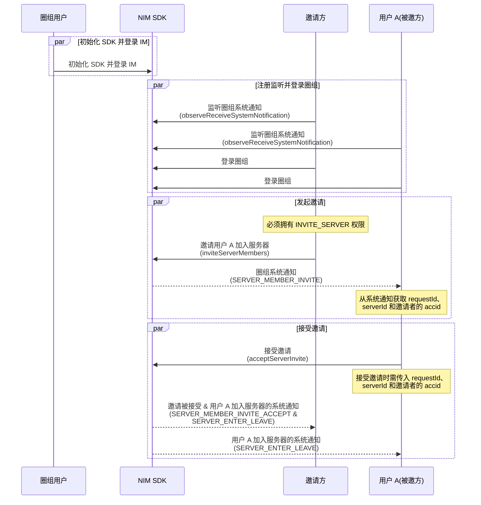
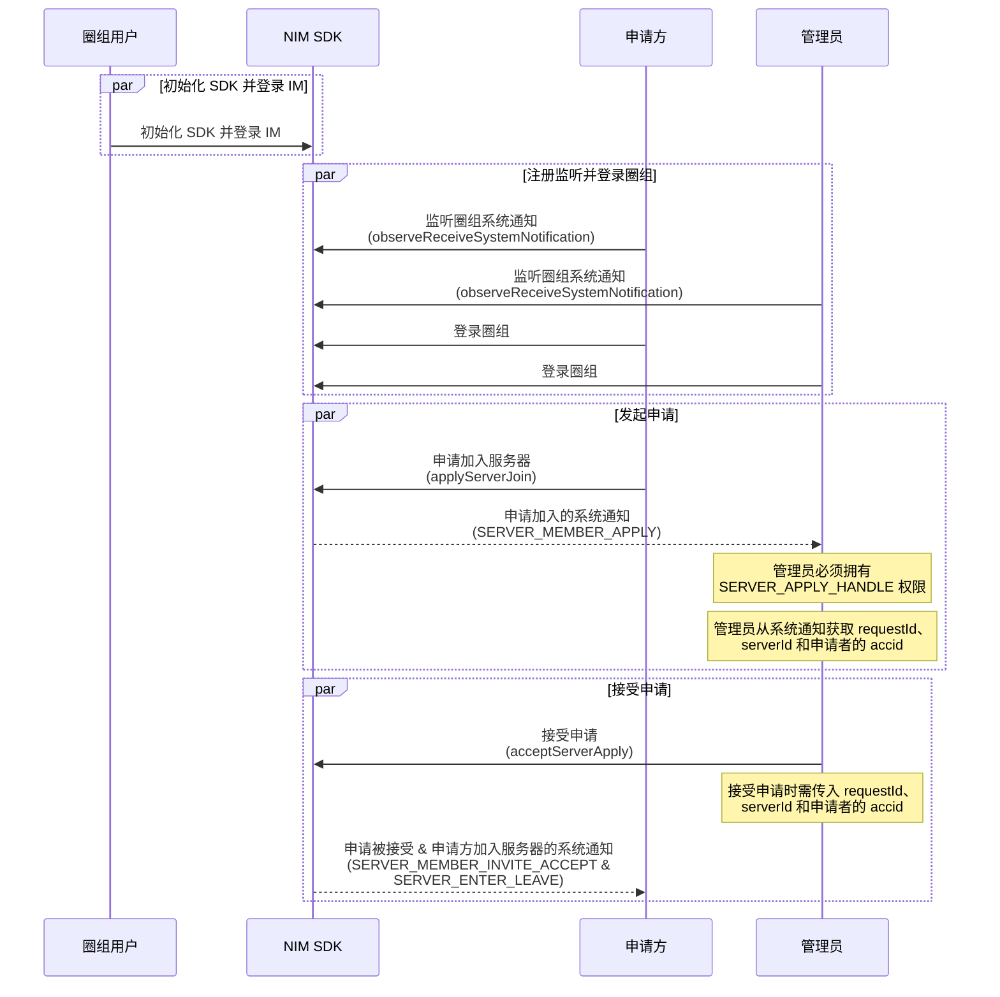

NIM SDK 的 <a href="https://doc.yunxin.163.com/docs/interface/messaging/android/doxygen/Latest/zh/interfacecom_1_1netease_1_1nimlib_1_1sdk_1_1qchat_1_1_q_chat_server_service.html" target="_blank">`QChatServerService`</a> 类提供了管理服务器成员的方法，包括加入服务器、离开服务器、将成员踢出服务器和封禁成员等。

## 前提条件

根据本文操作前，请确保您已经完成以下操作：

- 注册 [`observeReceiveSystemNotification`](https://doc.yunxin.163.com/docs/interface/messaging/android/doxygen/Latest/zh/interfacecom_1_1netease_1_1nimlib_1_1sdk_1_1qchat_1_1_q_chat_service_observer.html#a243ce250bbef08d40a52f24f12d1007c)监听圈组的系统通知。示例代码参考 [圈组系统通知收发](https://doc.yunxin.163.com/messaging/guide/Tc3MDM2MTQ?platform=android)。

    具体 **与服务器成员管理相关** 的系统通知类型，见本文末尾的 [相关系统通知](#相关系统通知)。

- <a href="https://doc.yunxin.163.com/messaging/guide/Dg2NjI4NzQ?platform=android#创建服务器" target="_blank">创建服务器</a>。

## 功能定义

NIM SDK <a href="https://doc.yunxin.163.com/docs/interface/messaging/android/doxygen/Latest/zh/interfacecom_1_1netease_1_1nimlib_1_1sdk_1_1qchat_1_1model_1_1_q_chat_server_member.html" target="_blank">`QChatServerMember`</a> 类定义了服务器成员。

<details><summary>单击展开查看 QChatServerMember 的内置方法。</summary>

方法 | 类型 | 说明
---- | ---- | ----
`getAccid` | String | 成员的网易云信 IM 账号
`getAvatar` | String | 成员在服务器内展示的头像
`getCreateTime` | long | 服务器创建时间
`getCustom` | String | 成员的自定义扩展字段
`getInviter` | String | 邀请当前成员加入服务器的用户
`getjoinTime` | long | 成员加入服务器的时间
`getNick` | String | 成员昵称
`getServerId` | long | 服务器 ID
`getType` | `QChatMemberType` | 成员类型：<ul><li>`Normal`：普通成员</li><li>`Owner`：服务器所有者，默认为服务器创建者</li></ul>
`getUpdateTime` | long | 更新时间
`isValid` | boolean | 有效标志

</details>

## 使用限制

服务器存在如下与其成员数量相关的限制：

- 单个用户的服务器的数量上限（包括自己创建的和加入的）默认为 100 个。
- 单个服务器可容纳人数上限默认为 500000。

若需要扩展上限，可在 [网易云信控制台](https://app.yunxin.163.com/global/home) 配置圈组子功能项（**单个用户 server 数** 和 **单 server 容纳人数**），具体请参考 [开通和配置圈组功能](https://doc.yunxin.163.com/console/concept/TIzNjkxMTg?platform=console)。

## 加入服务器

用户可通过被邀请的方式加入服务器，也可通过主动申请加入服务器。

### **邀请用户加入**

拥有 **邀请他人加入服务器的权限**（`QChatRoleResource.INVITE_SERVER`）的用户，可邀请其他用户加入服务器。

::: note notice
如果没有该权限，无法成功发起邀请。服务器所有者默认拥有全部权限。权限通过身份组进行配置和管理，具体请参考 <a href="https://doc.yunxin.163.com/messaging/guide/DU4NzI0NjU?platform=android" target="_blank">身份组概述</a> 及其他身份组相关文档。
:::

根据服务器的不同邀请模式（[`QChatInviteMode`](https://doc.yunxin.163.com/docs/interface/messaging/android/doxygen/Latest/zh/enumcom_1_1netease_1_1nimlib_1_1sdk_1_1qchat_1_1enums_1_1_q_chat_invite_mode.html)），被邀者成功加入服务器的流程略有不同。服务器的邀请模式，在创建服务器时配置，创建后也可修改。

:::::: div linked-codes
::: code 需要同意

如果服务器的邀请模式被设置为 **邀请需要同意**，那么被邀方需要接受邀请才能加入服务器。

**API 调用时序**



**流程说明**

1. 用户 A 调用 <a href="https://doc.yunxin.163.com/docs/interface/messaging/android/doxygen/Latest/zh/interfacecom_1_1netease_1_1nimlib_1_1sdk_1_1qchat_1_1_q_chat_server_service.html#ab36c3619a6c263f9e3c9efc38f89d0c0" target="_blank">`inviteServerMembers`</a> 方法邀请多位用户加入服务器。

    调用时需传入被邀者的账号（`accid`）列表以及指定的服务器 ID（`serverId`）。还可以设置有效时长和邀请附言（最多 5000 个字符）。

    - 发起邀请后，被邀方将收到邀请服务器成员（`QChatSystemNotificationType.SERVER_MEMBER_INVITE`）的系统通知。
    - 如果邀请成员失败，可从该方法的回调（[`QChatInviteServerMembersResult`](https://doc.yunxin.163.com/docs/interface/messaging/android/doxygen/Latest/zh/classcom_1_1netease_1_1nimlib_1_1sdk_1_1qchat_1_1result_1_1_q_chat_invite_server_members_result.html)）获取邀请失败的成员列表，如因为被封禁而无法邀请的成员列表。

    示例代码：

    ```Java
    List<String> accids = new ArrayList<>();
    accids.add("test");
    QChatInviteServerMembersParam param = new QChatInviteServerMembersParam(943445L,accids);
    param.setPostscript("邀请您加入测试服务器");
    NIMClient.getService(QChatServerService.class).inviteServerMembers(param).setCallback(
            new RequestCallback<QChatInviteServerMembersResult>() {
                @Override
                public void onSuccess(QChatInviteServerMembersResult result) {
                    //邀请成功,会返回因为用户服务器数量超限导致失败的 accid 列表
                    List<String> failedAccids = result.getFailedAccids();
                }

                @Override
                public void onFailed(int code) {
                    //邀请失败，返回错误 code
                }

                @Override
                public void onException(Throwable exception) {
                    //邀请异常
                }
            });
    ```

2. 被邀方接受或拒绝邀请。

    调用以下两个方法均需要传入接受加入的服务器 ID（`serverId`）、邀请者账号（`accid`）以及邀请唯一标识（`requestId`）。其中 `requestId` 可以从邀请服务器成员（`QChatSystemNotificationType.SERVER_MEMBER_INVITE`）系统通知附件中获取，也可以通过调用 [`getInviteApplyRecordOfServer`](https://doc.yunxin.163.com/docs/interface/messaging/android/doxygen/Latest/zh/interfacecom_1_1netease_1_1nimlib_1_1sdk_1_1qchat_1_1_q_chat_server_service.html#a10d545246f669424938dd9f87526892b) 方法查询服务器下的申请邀请记录来获取。

    - 调用 <a href="https://doc.yunxin.163.com/docs/interface/messaging/android/doxygen/Latest/zh/interfacecom_1_1netease_1_1nimlib_1_1sdk_1_1qchat_1_1_q_chat_server_service.html#abea80541a8869610ed5d85934f780742" target="_blank">`acceptServerInvite`</a> 方法接受邀请加入服务器。

        示例代码：

        ```Java
        long requestId = getRequestId();
        NIMClient.getService(QChatServerService.class).acceptServerInvite(new QChatAcceptServerInviteParam(943445L,"test",requestId)).setCallback(
                new RequestCallback<Void>() {
                    @Override
                    public void onSuccess(Void param) {
                        //接受邀请成功
                    }

                    @Override
                    public void onFailed(int code) {
                        //接受邀请失败，返回错误 code
                    }

                    @Override
                    public void onException(Throwable exception) {
                        //接受邀请异常
                    }
                });
        ```

    - 调用 <a href="https://doc.yunxin.163.com/docs/interface/messaging/android/doxygen/Latest/zh/interfacecom_1_1netease_1_1nimlib_1_1sdk_1_1qchat_1_1_q_chat_server_service.html#a8aa35e6f0eab32c679acc4da10497410" target="_blank">`rejectServerInvite`</a> 方法拒绝邀请。

        示例代码：

        ```Java
        long requestId = getRequestId();
        QChatRejectServerInviteParam param = new QChatRejectServerInviteParam(943445L,"test",requestId);
        param.setPostscript("拒绝邀请");
        NIMClient.getService(QChatServerService.class).rejectServerInvite(param).setCallback(
                new RequestCallback<Void>() {
                    @Override
                    public void onSuccess(Void param) {
                        //拒绝邀请成功
                    }

                    @Override
                    public void onFailed(int code) {
                        //拒绝邀请失败，返回错误 code
                    }

                    @Override
                    public void onException(Throwable exception) {
                        //拒绝邀请异常
                    }
                });
        ```

:::
::: code 不需要同意

如果服务器的邀请模式被设置为 **邀请不需要同意**，那么邀请方调用 <a href="https://doc.yunxin.163.com/docs/interface/messaging/android/doxygen/Latest/zh/interfacecom_1_1netease_1_1nimlib_1_1sdk_1_1qchat_1_1_q_chat_server_service.html#ab36c3619a6c263f9e3c9efc38f89d0c0" target="_blank">`inviteServerMembers`</a> 方法方法发起邀请后，被邀请方自动加入服务器。

示例代码：

```Java
List<String> accids = new ArrayList<>();
accids.add("test");
QChatInviteServerMembersParam param = new QChatInviteServerMembersParam(943445L,accids);
param.setPostscript("邀请您加入测试服务器");
NIMClient.getService(QChatServerService.class).inviteServerMembers(param).setCallback(
        new RequestCallback<QChatInviteServerMembersResult>() {
            @Override
            public void onSuccess(QChatInviteServerMembersResult result) {
                //邀请成功,会返回因为用户服务器数量超限导致失败的 accid 列表
                List<String> failedAccids = result.getFailedAccids();
            }

            @Override
            public void onFailed(int code) {
                //邀请失败，返回错误 code
            }

            @Override
            public void onException(Throwable exception) {
                //邀请异常
            }
        });
```

:::
::::::

### **申请加入**

用户也可以主动申请加入某个服务器。根据服务器的不同申请模式，申请方成功加入服务器的流程略有不同。

:::::: div linked-codes
::: code 需要同意

**API 调用时序**



**流程说明**

1. 申请方调用 <a href="https://doc.yunxin.163.com/docs/interface/messaging/android/doxygen/Latest/zh/interfacecom_1_1netease_1_1nimlib_1_1sdk_1_1qchat_1_1_q_chat_server_service.html#adddaceacc927acd03882b15b7432d431" target="_blank">`applyServerJoin`</a> 方法主动申请加入某个服务器。调用时需要传入申请加入的服务器的 ID（`serverId`），还可以设置有效时长和申请附言（最多 5000 字符）。

    示例代码：

    ```Java
    QChatApplyServerJoinParam param = new QChatApplyServerJoinParam(943445L);
    param.setPostscript("申请加入服务器");
    NIMClient.getService(QChatServerService.class).applyServerJoin(param).setCallback(
            new RequestCallback<Void>() {
                @Override
                public void onSuccess(Void param) {
                    //申请加入服务器成功
                }

                @Override
                public void onFailed(int code) {
                    //申请加入服务器失败，返回错误 code
                }

                @Override
                public void onException(Throwable exception) {
                    //申请加入服务器异常
                }
            });
    ```

2. 该服务器内拥有 **处理加入服务器申请的权限**（`QChatRoleResource.SERVER_APPLY_HANDLE`）的用户将收到申请加入服务器（`QChatSystemNotificationType.SERVER_MEMBER_APPLY`）的系统通知。收到申请通知的用户接受或拒绝申请。申请被同意，申请方才能加入服务器。

    ::: note notice
    接受或拒绝申请，需要拥有 **处理加入服务器申请的权限**（`SERVER_APPLY_HANDLE`）。权限通过身份组进行配置和管理，具体请参考 <a href="https://doc.yunxin.163.com/messaging/guide/DU4NzI0NjU?platform=android" target="_blank">身份组概述</a> 及其他身份组相关文档。
    :::

    调用以下两个方法均需要传入拒绝加入的服务器的 ID（`serverId`）、申请者账号（`accid`）以及申请唯一标识（`requestId`）。其中 `requestId` 可以从申请加入服务器（`QChatSystemNotificationType.SERVER_MEMBER_APPLY`）系统通知附件中获取，也可以通过调用 [`getInviteApplyRecordOfServer`](https://doc.yunxin.163.com/docs/interface/messaging/android/doxygen/Latest/zh/interfacecom_1_1netease_1_1nimlib_1_1sdk_1_1qchat_1_1_q_chat_server_service.html#a10d545246f669424938dd9f87526892b) 方法查询服务器下的申请邀请记录来获取。

    - 调用 <a href="https://doc.yunxin.163.com/docs/interface/messaging/android/doxygen/Latest/zh/interfacecom_1_1netease_1_1nimlib_1_1sdk_1_1qchat_1_1_q_chat_server_service.html#ade63666abc77deff95f0092ae920c583" target="_blank">`acceptServerApply`</a> 方法接受申请。

        示例代码：

        ```Java
        long requestId = getRequestId();
        NIMClient.getService(QChatServerService.class).acceptServerApply(new QChatAcceptServerApplyParam(943445L,"test"，requestId)).setCallback(
                new RequestCallback<Void>() {
                    public void onSuccess(Void param) {
                        //接受申请成功
                    }

                    @Override
                    public void onFailed(int code) {
                        //接受申请失败，返回错误 code
                    }

                    @Override
                    public void onException(Throwable exception) {
                        //接受申请异常
                    }
                });
        ```

    - 调用 <a href="https://doc.yunxin.163.com/docs/interface/messaging/android/doxygen/Latest/zh/interfacecom_1_1netease_1_1nimlib_1_1sdk_1_1qchat_1_1_q_chat_server_service.html#a517091749c5935a76c57ee06cfad86a0" target="_blank">`rejectServerApply`</a> 方法拒绝申请。

        示例代码：

        ```Java
        long requestId = getRequestId();
        QChatRejectServerApplyParam param = new QChatRejectServerApplyParam(943445L,"test",requestId);
        param.setPostscript("拒绝申请");
        NIMClient.getService(QChatServerService.class).rejectServerApply(param).setCallback(
                new RequestCallback<Void>() {
                    @Override
                    public void onSuccess(Void param) {
                        //拒绝邀请成功
                    }

                    @Override
                    public void onFailed(int code) {
                        //拒绝邀请失败，返回错误 code
                    }

                    @Override
                    public void onException(Throwable exception) {
                        //拒绝邀请异常
                    }
                });
        ```

:::

::: code 不需要同意

如果服务器的申请模式被设置为 **申请不需要同意**，那么申请方调用 <a href="https://doc.yunxin.163.com/docs/interface/messaging/android/doxygen/Latest/zh/interfacecom_1_1netease_1_1nimlib_1_1sdk_1_1qchat_1_1_q_chat_server_service.html#adddaceacc927acd03882b15b7432d431" target="_blank">`applyServerJoin`</a> 方法发起申请后，将自动加入服务器。

示例代码：

```Java
QChatApplyServerJoinParam param = new QChatApplyServerJoinParam(943445L);
param.setPostscript("申请加入服务器");
NIMClient.getService(QChatServerService.class).applyServerJoin(param).setCallback(
        new RequestCallback<Void>() {
            @Override
            public void onSuccess(Void param) {
                //申请加入服务器成功
            }

            @Override
            public void onFailed(int code) {
                //申请加入服务器失败，返回错误 code
            }

            @Override
            public void onException(Throwable exception) {
                //申请加入服务器异常
            }
        });
```

:::

::::::

### **通过邀请码加入**

用户可通过服务器成员分享的邀请码（通过第三方应用分享，如微信）加入服务器。

1. 用户 A 调用 <a href="https://doc.yunxin.163.com/docs/interface/messaging/android/doxygen/Latest/zh/interfacecom_1_1netease_1_1nimlib_1_1sdk_1_1qchat_1_1_q_chat_server_service.html#a42e9751a83dcf62391d7ff70c559b181" target="_blank">`generateInviteCode`</a> 方法生成邀请码。调用时必须传入服务器 ID（`serverId`），邀请码有效期可不传。

    ::: note notice
    拥有 **邀请他人加入服务器的权限**（`QChatRoleResource.INVITE_SERVER`）的服务器成员才能生成邀请码。权限通过身份组进行配置和管理，具体请参考 <a href="https://doc.yunxin.163.com/messaging/guide/DU4NzI0NjU?platform=android" target="_blank">身份组概述</a> 及其他身份组相关文档。
    :::

    示例代码：
    ```Java
    QChatGenerateInviteCodeParam param = new QChatGenerateInviteCodeParam(311254);
                //设置过期时间为 1 天
                param.setTtl(24 * 60 * 60 * 1000L);
                NIMClient.getService(QChatServerService.class).generateInviteCode(param).setCallback(
                        new RequestCallback<QChatGenerateInviteCodeResult>() {
                            @Override
                            public void onSuccess(QChatGenerateInviteCodeResult result) {
                                //生成邀请码成功
                            }

                            @Override
                            public void onFailed(int code) {
                                //生成邀请码失败
                            }

                            @Override
                            public void onException(Throwable exception) {
                                //生成邀请码异常
                            }
                        });
    ```

2. 用户 B 调用 <a href="https://doc.yunxin.163.com/docs/interface/messaging/android/doxygen/Latest/zh/interfacecom_1_1netease_1_1nimlib_1_1sdk_1_1qchat_1_1_q_chat_server_service.html#a4dfb941c1268b4b2ffcc48ef8f639e73" target="_blank">`joinByInviteCode`</a> 方法，通过邀请码加入服务器。调用时必须传入服务器 ID 和邀请码。

    示例代码：

    ```Java
    String inviteCode = getInviteCode();
    QChatJoinByInviteCodeParam param = new QChatJoinByInviteCodeParam(311254,inviteCode);
    NIMClient.getService(QChatServerService.class).joinByInviteCode(param).setCallback(new RequestCallback<Void>() {
        @Override
        public void onSuccess(Void result) {
            //通过邀请码加入服务器成功
        }

        @Override
        public void onFailed(int code) {
            //通过邀请码加入服务器失败
        }

        @Override
        public void onException(Throwable exception) {
            //通过邀请码加入服务器异常
        }
    });
    ```

## 退出服务器

用户既可以主动退出服务器，也可以被动退出，即被其他用户踢出服务器。

### **主动退出服务器**

加入服务器后如不想继续待在此服务器中，用户可以调用 <a href="https://doc.yunxin.163.com/docs/interface/messaging/android/doxygen/Latest/zh/interfacecom_1_1netease_1_1nimlib_1_1sdk_1_1qchat_1_1_q_chat_server_service.html#a147a1dcb08f0f3b1e6bd7a66044c7096" target="_blank">`leaveServer`</a> 方法主动退出，调用时需传入服务器 ID。离开后将不再接收该服务器下的消息和通知。

示例代码：

```Java
NIMClient.getService(QChatServerService.class).leaveServer(new QChatLeaveServerParam(943445L)).setCallback(
        new RequestCallback<Void>() {
            @Override
            public void onSuccess(Void param) {
                //离开 Server 成功
            }

            @Override
            public void onFailed(int code) {
                //离开 Serve 失败，返回错误 code
            }

            @Override
            public void onException(Throwable exception) {
                //离开 Serve 异常
            }
        });
```

### **踢出服务器成员**

调用 <a href="https://doc.yunxin.163.com/docs/interface/messaging/android/doxygen/Latest/zh/interfacecom_1_1netease_1_1nimlib_1_1sdk_1_1qchat_1_1_q_chat_server_service.html#a422b2c84c2600b684977de3651f64328" target="_blank">`kickServerMembers`</a> 方法将其他成员踢出服务器。调用时需要传入当前服务器 ID（`serverId`）和需要被踢出用户的 `accid` 列表。

::: note notice
调用该接口需拥有 **踢出他人权限**（`QChatRoleResource.KICK_SERVER`）。权限通过身份组进行配置和管理，具体请参考 <a href="https://doc.yunxin.163.com/messaging/guide/DU4NzI0NjU?platform=android" target="_blank">身份组概述</a> 及其他身份组相关文档。
:::

示例代码：

```Java
List<String> accids = new ArrayList<>();
accids.add("test");
NIMClient.getService(QChatServerService.class).kickServerMembers(new QChatKickServerMembersParam(943445L,accids)).setCallback(
        new RequestCallback<Void>() {
            @Override
            public void onSuccess(Void param) {
                //踢除成员成功
            }

            @Override
            public void onFailed(int code) {
                //踢除成员失败，返回错误 code
            }

            @Override
            public void onException(Throwable exception) {
                //踢除成员异常
            }
        });
```

## 修改成员信息

V9.9.2 新增 **圈组用户资料复用 IM 用户资料** 的能力。

- 如果某用户未配置自己的服务器成员信息，该用户进入服务器后的初始成员信息将直接复用对应的 IM 用户资料（目前仅支持复用昵称和头像）。

- 如果某用户在未配置自己的服务器成员信息的情况下修改了自己的 IM 用户资料（昵称或头像），系统通知（通知类型 `NIMQChatSystemNotificationTypeMyMemberInfoUpdated`）将触发，通知该用户需要在哪些服务器重新获取资料。

:::note note
该功能需要在开通圈组功能的基础上额外开通后才能使用，具体请参考 [开通圈组功能](https://doc.yunxin.163.com/messaging/guide/TU3MjAzMjE?platform=android)。
:::

### **修改自己的成员信息**

调用 <a href="https://doc.yunxin.163.com/docs/interface/messaging/android/doxygen/Latest/zh/interfacecom_1_1netease_1_1nimlib_1_1sdk_1_1qchat_1_1_q_chat_server_service.html#a37fdef39a65be4c189b52d57d6ac0f3b" target="_blank">`updateMyMemberInfo`</a> 方法可修改自己在当前服务器的成员信息。调用时需要传入对应的服务器 ID 以及相应的修改项。支持对成员昵称、头像和自定义扩展的修改，9.1.0 版本后可设置反垃圾配置 `QChatAntiSpamConfig`（更多圈组反垃圾相关说明请参考 [圈组内容审核](https://doc.yunxin.163.com/messaging/guide/DY0ODI1OTQ?platform=android)）。

示例代码：

```Java
QChatUpdateMyMemberInfoParam param = new QChatUpdateMyMemberInfoParam(943445L);
param.setNick("昵称 2");
param.setCustom("xxxxx");
QChatAntiSpamConfig antiSpamConfig = new QChatAntiSpamConfig("用户配置的对某些资料内容另外的反垃圾的业务 ID")。
param.setAntiSpamBusinessId(antiSpamConfig);
NIMClient.getService(QChatServerService.class).updateMyMemberInfo(param).setCallback(new RequestCallback<QChatUpdateMyMemberInfoResult>() {
    @Override
    public void onSuccess(QChatUpdateMyMemberInfoResult result) {
        //修改成员信息成功,返回最新的成员信息
        QChatServerMember member = result.getMember();
    }

    @Override
    public void onFailed(int code) {
        //修改成员信息失败，返回错误 code
    }

    @Override
    public void onException(Throwable exception) {
        //修改成员信息异常
    }
});
```

### **修改他人的成员信息**

调用 [`updateServerMemberInfo`](https://doc.yunxin.163.com/docs/interface/messaging/android/doxygen/Latest/zh/interfacecom_1_1netease_1_1nimlib_1_1sdk_1_1qchat_1_1_q_chat_server_service.html#a944364fbb23f78a0f69735e8bdc3cec0) 方法可修改其他成员的信息。

::: note notice
调用该方法需要拥有修改他人成员信息的权限（`QChatRoleResource.ACCOUNT_INFO_OTHER`）。
:::

调用时需传入对应的服务器 ID （`serverId`）、待修改成员的账号（`accid`）以及相应的修改项。支持修改其他成员的昵称和头像，9.1.0 版本后可设置反垃圾配置 `QChatAntiSpamConfig`。更多圈组反垃圾相关说明请参考 [圈组内容审核](https://doc.yunxin.163.com/messaging/guide/DY0ODI1OTQ?platform=android)。

示例代码：

```Java
QChatUpdateServerMemberInfoParam param = new QChatUpdateServerMemberInfoParam(943445L,"test");
param.setNick("昵称 3");
QChatAntiSpamConfig antiSpamConfig = new QChatAntiSpamConfig("用户配置的对某些资料内容另外的反垃圾的业务 ID")。
param.setAntiSpamBusinessId(antiSpamConfig);
NIMClient.getService(QChatServerService.class).updateServerMemberInfo(param).setCallback(new RequestCallback<QChatUpdateServerMemberInfoResult>() {
    @Override
    public void onSuccess(QChatUpdateServerMemberInfoResult result) {
        //修改成员信息成功,返回最新的成员信息
        QChatServerMember member = result.getMember();
    }

    @Override
    public void onFailed(int code) {
        //修改成员信息失败，返回错误 code
    }

    @Override
    public void onException(Throwable exception) {
        //修改成员信息异常
    }
});
```

## 成员封禁管理

### **封禁服务器成员**

拥有封禁他人权限（`QChatRoleResource.BAN_SERVER_MEMBER`）的用户可调用 [banServerMember](https://doc.yunxin.163.com/docs/interface/messaging/android/doxygen/Latest/zh/interfacecom_1_1netease_1_1nimlib_1_1sdk_1_1qchat_1_1_q_chat_server_service.html#a7624af0c05d7727ea1ac29e1980ba834) 方法封禁某位服务器成员。调用时需传入服务器 ID（`serverId`）和待封禁成员的账号（`accid`）。

::: note notice
执行封禁操作，必须拥有封禁他人的权限。
:::

被封禁的成员将直接被踢出服务器，且不能再申请加入服务器或被邀请加入服务器。某成员被封禁后，所有该服务器成员都会收到该封禁成员被踢的系统通知（`QChatSystemNotificationType.SERVER_MEMBER_KICK`）。

示例代码：

```Java
NIMClient.getService(QChatServerService.class).banServerMember(new QChatBanServerMemberParam(1607312,"test")).setCallback(
                new RequestCallback<Void>() {
                    @Override
                    public void onSuccess(Void param) {
                        //操作成功
                    }

                    @Override
                    public void onFailed(int code) {
                        //操作失败，返回错误 code
                    }

                    @Override
                    public void onException(Throwable exception) {
                        //操作异常
                    }
                });
```

### **分页查询封禁成员列表**

调用 [`getBannedServerMembersByPage`](https://doc.yunxin.163.com/docs/interface/messaging/android/doxygen/Latest/zh/interfacecom_1_1netease_1_1nimlib_1_1sdk_1_1qchat_1_1_q_chat_server_service.html#a017432d932ce264d8bc875e440d52e0d) 方法可分页查询某服务器下被封禁的成员列表。

该方法的入参包括服务器 ID （`serverId`）、查询时间戳（`timeTag`）和查询数量限制（`limit`)，`timeTag` 传 0 表示当前时间，limit 默认 100。
该方法的回参结构 `QChatGetBannedServerMembersByPageResult` 返回被封禁成员 `QChatBannedServerMember` 列表。

`QChatBannedServerMember` 参数说明如下：
| 返回值类型 | 参数 | 说明 |
| ---- | ---- | ---- |
| long | `getServerId()` | 获取服务器 ID |
| String | `getAccid()` | 获取用户 accid |
| String | `getCustom()` | 获取自定义扩展 |
| long | `getBanTime()` | 获取封禁时间 |
| boolean | `isValid()` | 获取有效标志：false-无效，true-有效 |
| long | `getCreateTime()` | 获取创建时间 |
| long | `getUpdateTime()` | 获取更新时间 |

示例代码：

```Java
NIMClient.getService(QChatServerService.class).getBannedServerMembersByPage(new QChatGetBannedServerMembersByPageParam(1607312L,0L))
                .setCallback(new RequestCallback<QChatGetBannedServerMembersByPageResult>() {
                    @Override
                    public void onSuccess(QChatGetBannedServerMembersByPageResult result) {
                        //操作成功
                        List<QChatBannedServerMember> serverMemberBanInfoList = result.getServerMemberBanInfoList();
                    }

                    @Override
                    public void onFailed(int code) {
                        //操作失败，返回错误 code
                    }

                    @Override
                    public void onException(Throwable exception) {
                        //操作异常
                    }
                });
```

### **解封服务器成员**

调用 [`unbanServerMember`](https://doc.yunxin.163.com/docs/interface/messaging/android/doxygen/Latest/zh/interfacecom_1_1netease_1_1nimlib_1_1sdk_1_1qchat_1_1_q_chat_server_service.html#a176b6db593ad3b1ba76f2a4672777c23)方法可将已封禁用户解封。调用时需要传入服务器 ID（`serverId`）和待解封成员账号（`accid`）。待解封的成员账号，可通过调用 [`getBannedServerMembersByPage`](https://doc.yunxin.163.com/docs/interface/messaging/android/doxygen/Latest/zh/interfacecom_1_1netease_1_1nimlib_1_1sdk_1_1qchat_1_1_q_chat_server_service.html#a017432d932ce264d8bc875e440d52e0d) 方法获取。

被解封的用户可正常申请加入服务器或被邀请加入服务器。

::: note notice
调用该方法需要拥有封禁他人权限（`QChatRoleResource.BAN_SERVER_MEMBER`）。
:::

示例代码：

```Java
NIMClient.getService(QChatServerService.class).unbanServerMember(new QChatUnbanServerMemberParam(1607312,"test")).setCallback(
                new RequestCallback<Void>() {
                    @Override
                    public void onSuccess(Void param) {
                        //操作成功
                    }

                    @Override
                    public void onFailed(int code) {
                        //操作失败，返回错误 code
                    }

                    @Override
                    public void onException(Throwable exception) {
                        //操作异常
                    }
                });
```

## 查询服务器成员

### **根据账号查询**

用户登录圈组且进入服务器后，如果需要检索当前服务器内的成员，可调用 [`getServerMembers`](https://doc.yunxin.163.com/docs/interface/messaging/android/doxygen/Latest/zh/interfacecom_1_1netease_1_1nimlib_1_1sdk_1_1qchat_1_1_q_chat_server_service.html#afad13e64adbbcdbfed7248caabf1ca55) 方法查询多个服务器成员的信息。调用时需传入由服务器 ID （`serverId`）和用户账号（`accid`）组成的键值对列表（List<Pair<Long, String>>），Pair.first 填 `serverId`，Pair.second 填 `accid`）。

::: note notice
调用该方法时最多可传入 200 个 `accid`。
:::

示例代码：

```Java
List<Pair<Long,String>> serverIdAccidPairList = new ArrayList<>();
serverIdAccidPairList.add(new Pair<>(943445L,"test"));
QChatGetServerMembersParam param = new QChatGetServerMembersParam(serverIdAccidPairList);
NIMClient.getService(QChatServerService.class).getServerMembers(param).setCallback(new RequestCallback<QChatGetServerMembersResult>() {
    @Override
    public void onSuccess(QChatGetServerMembersResult result) {
        //查询 Server 成员信息成功,返回查询到的 Server 成员信息
        List<QChatServerMember> serverMembers = result.getServerMembers();
    }

    @Override
    public void onFailed(int code) {
        //查询 Server 成员信息失败，返回错误 code
    }

    @Override
    public void onException(Throwable exception) {
        //查询 Server 成员信息异常
    }
});
```

### **分页查询**

用户登录圈组且进入服务器后，如需要获取当前服务器的成员，可调用 [`getServerMembersByPage`](https://doc.yunxin.163.com/docs/interface/messaging/android/doxygen/Latest/zh/interfacecom_1_1netease_1_1nimlib_1_1sdk_1_1qchat_1_1_q_chat_server_service.html#a4d6d219764fa6023a8294904090f9fc4) 方法可按成员加入服务器的时间倒序（由近及远）分页查询圈组的服务器列表。

示例代码：

```Java
//当前时间往前查最多 100 条 Server 成员信息
NIMClient.getService(QChatServerService.class).getServerMembersByPage(new QChatGetServerMembersByPageParam(943445L,System.currentTimeMillis(),100)).setCallback(
        new RequestCallback<QChatGetServerMembersByPageResult>() {
            @Override
            public void onSuccess(QChatGetServerMembersByPageResult result) {
                //查询 Server 成员信息成功,返回查询到的 Server 成员信息
                List<QChatServerMember> serverMembers = result.getServerMembers();
            }

            @Override
            public void onFailed(int code) {
                //查询 Server 成员信息失败，返回错误 code
            }

            @Override
            public void onException(Throwable exception) {
                //查询 Server 成员信息异常
            }
        });
```

## 查询申请与邀请记录

### **查询服务器记录**

调用 [`getInviteApplyRecordOfServer`](https://doc.yunxin.163.com/docs/interface/messaging/android/doxygen/Latest/zh/interfacecom_1_1netease_1_1nimlib_1_1sdk_1_1qchat_1_1_q_chat_server_service.html#a10d545246f669424938dd9f87526892b) 方法可查询服务器下的申请与邀请记录。调用时需要传入服务器 ID，其他参数值可为空。

::: note notice
调用该方法需要拥有申请邀请历史查看权限（`QChatRoleResource.INVITE_APPLY_HISTORY_QUERY`）。
:::

示例代码：

```Java
QChatGetInviteApplyRecordOfServerParam param = new QChatGetInviteApplyRecordOfServerParam(311254);
//设置查询开始时间，首次查询可不传
param.setFromTime(getFromTime());
//搜索查询结束时间，，首次查询可不传
param.setToTime(getToTime());
param.setLimit(100);
param.setReverse(false);
param.setExcludeRecordId(null);

NIMClient.getService(QChatServerService.class).getInviteApplyRecordOfServer(param).setCallback(
        new RequestCallback<QChatGetInviteApplyRecordOfServerResult>() {
            @Override
            public void onSuccess(QChatGetInviteApplyRecordOfServerResult result) {
                //
            }

            @Override
            public void onFailed(int code) {

            }

            @Override
            public void onException(Throwable exception) {

            }
        });
```

### **查询指定用户记录**

用户如果需要查询自己的申请或邀请记录，可调用 [`getInviteApplyRecordOfSelf`](https://doc.yunxin.163.com/docs/interface/messaging/android/doxygen/Latest/zh/interfacecom_1_1netease_1_1nimlib_1_1sdk_1_1qchat_1_1_q_chat_server_service.html#a1e809400a757eacaeec6972c022c1cf9) 方法进行查询。

::: note notice
调用该方法需要拥有申请邀请记录的查看权限（`QChatRoleResource.INVITE_APPLY_HISTORY_QUERY`）。
:::

示例代码：

```Java
QChatGetInviteApplyRecordOfSelfParam param = new QChatGetInviteApplyRecordOfSelfParam();
        //设置查询开始时间，首次查询可不传
        param.setFromTime(getFromTime());
        //搜索查询结束时间，，首次查询可不传
        param.setToTime(getToTime());
        param.setLimit(100);
        param.setReverse(false);
        param.setExcludeRecordId(null);

        NIMClient.getService(QChatServerService.class).getInviteApplyRecordOfSelf(param).setCallback(
                new RequestCallback<QChatGetInviteApplyRecordOfSelfResult>() {
                    @Override
                    public void onSuccess(QChatGetInviteApplyRecordOfSelfResult result) {
                        //
                    }

                    @Override
                    public void onFailed(int code) {

                    }

                    @Override
                    public void onException(Throwable exception) {

                    }
                });
```

<a id="相关系统通知"></a>

## 系统通知

圈组系统通知的类型在 [`QChatSystemNotificationType`](https://doc.yunxin.163.com/docs/interface/messaging/android/doxygen/Latest/zh/enumcom_1_1netease_1_1nimlib_1_1sdk_1_1qchat_1_1enums_1_1_q_chat_system_notification_type.html) 枚举中定义，与服务器成员管理相关的内置系统通知类型如下：

枚举值 | 说明
---- | ----
`SERVER_MEMBER_INVITE` | 邀请服务器成员
`SERVER_MEMBER_INVITE_REJECT` | 拒绝邀请
`SERVER_MEMBER_APPLY` | 申请加入服务器
`SERVER_MEMBER_APPLY_REJECT` | 拒绝申请
`SERVER_MEMBER_INVITE_DONE` | 用户已被邀请
`SERVER_MEMBER_INVITE_ACCEPT` | 接受邀请
`SERVER_MEMBER_APPLY_DONE` | 已申请加入服务器
`SERVER_MEMBER_APPLY_ACCEPT` | 申请被接受
`SERVER_MEMBER_KICK` | 踢除服务器成员
`SERVER_MEMBER_LEAVE` | 主动退出服务器
`SERVER_MEMBER_UPDATE` | 服务器成员的信息更新
`SERVER_MEMBER_JOIN_BY_INVITE_CODE` | 用户通过邀请码加入服务器
`SERVER_ENTER_LEAVE` | 服务器成员加入或退出服务器
`MY_MEMBER_INFO_UPDATED` | 修改 IM 用户资料所触发的对服务器成员信息的联动修改

::: note note
更多圈组系统通知相关说明，参考 [圈组系统通知](https://doc.yunxin.163.com/messaging/guide/TA4NjcwNTc?platform=android)。
:::

## 内容审核

修改自己或他人在服务器展示的成员信息（如昵称和头像）时，如果通过 `setAntiSpamBusinessId` 方法配置了安全通的业务 ID，那么网易云信将会对成员资料进行 **安全通** 内容审核。`antiSpamBusinessId` 代表安全通默认内容审核业务以外的自定义内容审核的业务 ID。如需新增自定义内容审核，请联系商务经理进行相关配置，然后前往网易云信控制台的安全通配置界面获取该业务 ID。

更多圈组内容审核相关说明，参考 [圈组内容审核](https://doc.yunxin.163.com/messaging/guide/DY0ODI1OTQ?platform=android)。