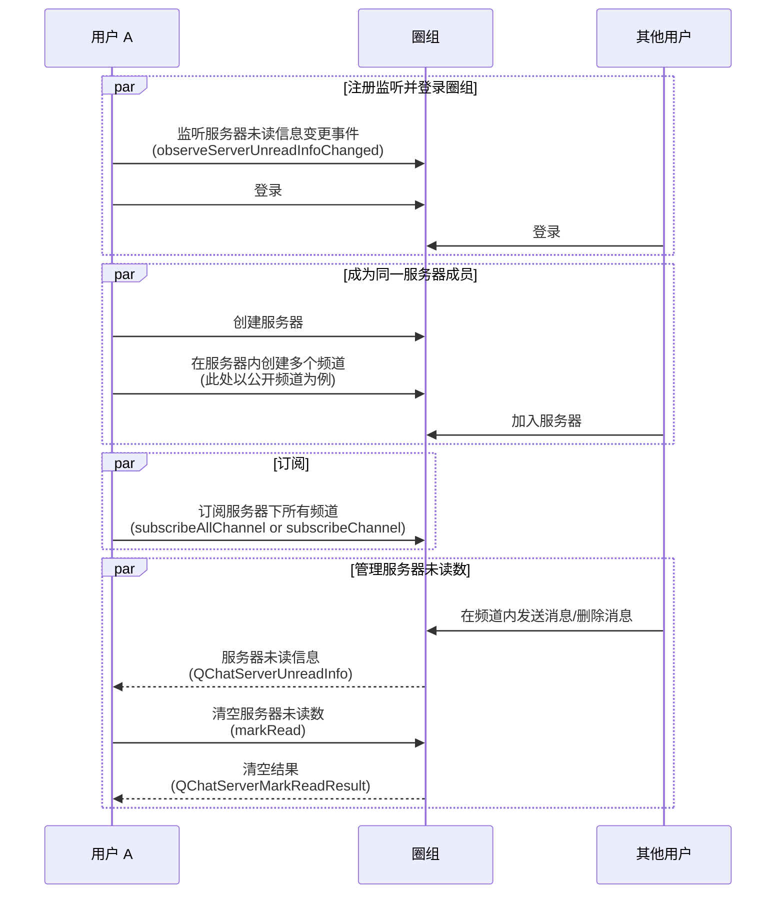

<!--keywords: 未读数, 服务器未读数, 圈组 -->

服务器未读数，指圈组服务器下所有频道的总未读数。网易云信 NIM SDK 的 [`QChatServerUnreadInfoChangedEvent`](https://doc.yunxin.163.com/docs/interface/messaging/android/doxygen/Latest/zh/interfacecom_1_1netease_1_1nimlib_1_1sdk_1_1qchat_1_1event_1_1_q_chat_server_unread_info_changed_event.html)接口定义了圈组服务器未读信息变更事件。用户在圈组频道内发送或删除消息后，SDK 触发该事件，事件信息包含未读信息[`QChatServerUnreadInfo`](https://doc.yunxin.163.com/docs/interface/messaging/android/doxygen/Latest/zh/interfacecom_1_1netease_1_1nimlib_1_1sdk_1_1qchat_1_1model_1_1_q_chat_server_unread_info.html)。您可调用[`QChatServiceObserver`](https://doc.yunxin.163.com/docs/interface/messaging/android/doxygen/Latest/zh/interfacecom_1_1netease_1_1nimlib_1_1sdk_1_1qchat_1_1_q_chat_service_observer.html) 接口的 `observeServerUnreadInfoChanged` 方法监听该事件。

本文介绍获取服务器未读数并按需清空的实现方法以及相应的示例代码。

::: note notice
游客接收到的消息无已读未读逻辑。不支持对游客展示消息未读数。
:::

## 前提条件

根据本文操作前，请确保您已经完成以下操作：

- [登录圈组服务端](https://doc.yunxin.163.com/docs/TM5MzM5Njk/Tk3NzY0OTM?platformId=60002#%E6%AD%A5%E9%AA%A45:%20%E7%99%BB%E5%BD%95%E4%BA%91%E4%BF%A1%E5%9C%88%E7%BB%84%E6%9C%8D%E5%8A%A1%E7%AB%AF)，并已创建圈组服务器和频道。
- 用户已 [加入圈组服务器](https://doc.yunxin.163.com/messaging/guide/DIzODU1MDQ?platform=android)。

## 使用限制

服务器未读数管理存在如下与未读数相关的限制：

- 所有未读消息（包括@消息）的消息阈值默认为 99 条。
- @消息的未读数的有效期，默认为 7 天，即默认存储 7 天。

若需要扩展上限，可在 [网易云信控制台](https://app.yunxin.163.com/global/home) 配置圈组子功能项（**未读的@消息数-周期** 和 **所有未读消息（包括@）的消息计数-阈值**），具体请参考 [开通和配置圈组功能](https://doc.yunxin.163.com/console/concept/TIzNjkxMTg?platform=console)。

## API 调用时序



## 实现流程

::: note note
以下仅对上图中标为部分的流程进行详细说明。
:::

1. 用户 A 调用 [`observeServerUnreadInfoChanged`](https://doc.yunxin.163.com/docs/interface/messaging/android/doxygen/Latest/zh/interfacecom_1_1netease_1_1nimlib_1_1sdk_1_1qchat_1_1_q_chat_service_observer.html#a297c61fcacc26fcd3c26105e591db4b1) 方法监听 `QChatServerUnreadInfoChangedEvent`。

    示例代码如下：

    ```Java
    //监听服务器未读数
    NIMClient.getService(QChatServiceObserver.class).observeServerUnreadInfoChanged(new Observer<QChatServerUnreadInfoChangedEvent>() {
        @Override
        public void onEvent(QChatServerUnreadInfoChangedEvent event) {
            //获取变更后服务器未读信息列表
            List<QChatServerUnreadInfo> serverUnreadInfos = event.getServerUnreadInfos();
            //遍历变更的服务器未读信息
            for (QChatServerUnreadInfo serverUnreadInfo : serverUnreadInfos) {

            }
        }
    },true);
    ```

2. 根据服务器下的频道数量，按如下方法订阅服务器下的所有频道的未读数。订阅后 SDK 获取并缓存各频道的初始未读数。
    - 如果目标服务器下的频道数量不超过 200 个，则用户 A 可调用 [`subscribeAllChannel`](https://doc.yunxin.163.com/docs/interface/messaging/android/doxygen/Latest/zh/interfacecom_1_1netease_1_1nimlib_1_1sdk_1_1qchat_1_1_q_chat_server_service.html#a901d4b228b8f34883e558ece163a91de) 方法一次性订阅服务器下所有的频道的未读数（单次调用最多可传入 10 个 服务器 ID）。
    - 如果目标服务器下的频道数量超过 200 个，则用户 A 需多次调用 [`subscribeChannel`](https://doc.yunxin.163.com/docs/interface/messaging/android/doxygen/Latest/zh/interfacecom_1_1netease_1_1nimlib_1_1sdk_1_1qchat_1_1_q_chat_channel_service.html#afce5d8bbe2541d92194cdf8303bb6332) 方法订阅服务器下所有频道的未读数（单次调用最多可订阅 100 个频道）。

    ::: note important
    - 通过 `subscribeAllChannel` 订阅频道，单次调用可传入的服务器 ID 数量上限为 10 个。即使多次调用，单个服务器下最多仅能订阅 200 个 频道。如果目标服务器下频道数量大于 200，需改用 `subscribeChannel` 方法订阅服务器下所有频道（单次调用最多可订阅 100 个频道）。
    - 获取服务器的精确未读数，必须订阅服务器下的所有频道的未读数。
    :::

    示例代码如下：

    :::::: div linked-codes

    ::: code 调用 subscribeAllChannel 的示例

    ```Java
    QChatSubscribeType type = QChatSubscribeType.CHANNEL_MSG;
    List<Long> serverIds = getServerIds();
    QChatSubscribeAllChannelParam param = new QChatSubscribeAllChannelParam(type,serverIds);
    NIMClient.getService(QChatServerService.class).subscribeAllChannel(param).setCallback(
            new RequestCallback<QChatSubscribeAllChannelResult>() {
                @Override
                public void onSuccess(QChatSubscribeAllChannelResult result) {
                    //订阅成功的频道未读信息
                    List<QChatUnreadInfo> unreadInfoList = result.getUnreadInfoList();
                    //订阅失败的频道 ID 列表
                    List<Long> failedList = result.getFailedList();
                }

                @Override
                public void onFailed(int code) {

                }

                @Override
                public void onException(Throwable exception) {

                }
            });
    ```
    :::

    ::: code 调用 subscribeChannel 的示例

    ```Java
    //获取 server 下所有 channelId 信息
    List<QChatChannelIdInfo> channelIdInfos = getAllChannelIdInfoOfServer(311254);
    QChatSubscribeChannelParam param = new QChatSubscribeChannelParam(QChatSubscribeType.CHANNEL_MSG_UNREAD_COUNT, QChatSubscribeOperateType.SUB,channelIdInfos);
    NIMClient.getService(QChatChannelService.class).subscribeChannel(param).setCallback(new RequestCallback<QChatSubscribeChannelResult>() {
        @Override
        public void onSuccess(QChatSubscribeChannelResult result) {
            //订阅成功
        }

        @Override
        public void onFailed(int code) {
            //订阅失败
        }

        @Override
        public void onException(Throwable exception) {
            //订阅异常
        }
    });
    ```
    :::
    ::::::

3. 其他用户 [发送消息](https://doc.yunxin.163.com/messaging/guide/TE1MjI2MDI?platform=android#实现消息收发) 或 [删除消息](https://doc.yunxin.163.com/messaging/guide/Tc3MTM5NTc?platform=android) 后，SDK 对服务器下所有已订阅频道的未读数进行累加计算。

    未读数 **累加规则** 如下：

    - 接到新消息，某个频道未读数 +1 时：
        - 如果累加未读数达到未读数上限（`maxCount`），则触发 `QChatServerUnreadInfoChangedEvent`，并给出 `maxCount`。
        - 如果累加未读数没有达到 `maxCount`，则触发 `QChatServerUnreadInfoChangedEvent`，并给出累加未读数。
    - 消息被删除，某个频道未读数 - 1 时：
        - 如果累加未读数达到 `maxCount`，则触发 `QChatServerUnreadInfoChangedEvent`，并给出 `maxCount`。
        - 如果累加未读数没有达到 `maxCount`，则触发 `QChatServerUnreadInfoChangedEvent`，并给出累加未读数。

4. SDK 计算完所有已订阅频道的累加未读数（`QChatServerUnreadInfo`）后，将其返回给用户 A。

    ::: note notice :::
    服务器累加未读数在达到 `maxCount` 后，`QChatServerUnreadInfoChangedEvent` 事件将不会触发。
    :::

5. 如需清空该服务器的未读数，可调用 [`markRead`](https://doc.yunxin.163.com/docs/interface/messaging/android/doxygen/Latest/zh/interfacecom_1_1netease_1_1nimlib_1_1sdk_1_1qchat_1_1_q_chat_server_service.html#a62416f01335f061193c0d5720fb3479c) 方法清空。

    示例代码如下：

    ```Java
    List<Long> serverIds = getServerIds();
    NIMClient.getService(QChatServerService.class).markRead(new QChatServerMarkReadParam(serverIds)).setCallback(
            new RequestCallback<QChatServerMarkReadResult>() {
                @Override
                public void onSuccess(QChatServerMarkReadResult result) {
                    //清空未读数成功的服务器 ID 列表
                    List<Long> successServerIds = result.getSuccessServerIds();
                    //清空未读数失败的服务器 ID 列表
                    List<Long> failedServerIds = result.getFailedServerIds();
                }

                @Override
                public void onFailed(int code) {

                }

                @Override
                public void onException(Throwable exception) {

                }
            });
    ```