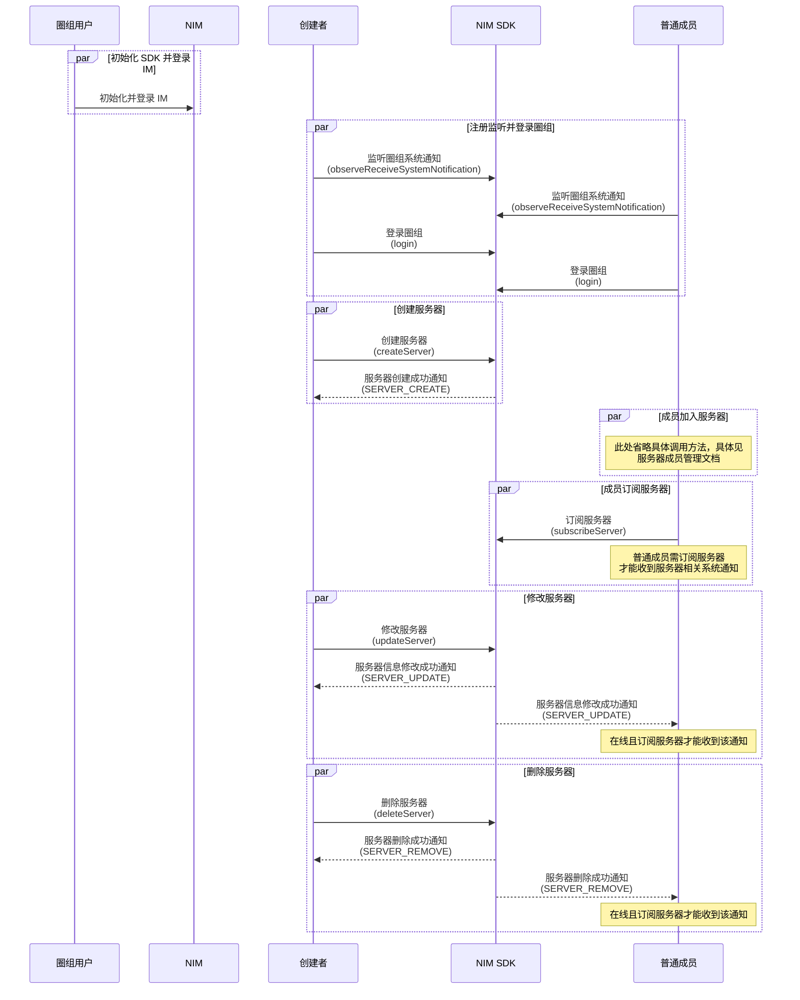

NIM SDK 的 <a href="https://doc.yunxin.163.com/docs/interface/messaging/android/doxygen/Latest/zh/interfacecom_1_1netease_1_1nimlib_1_1sdk_1_1qchat_1_1_q_chat_server_service.html" target="_blank">`QChatServerService`</a> 类提供管理服务器的相关方法，支持圈组服务器的创建、修改和删除。

## 前提条件

根据本文操作前，请确保您已经完成以下操作：

- 注册 `observeReceiveSystemNotification` 监听系统通知的接收。示例代码参考 [圈组系统通知收发](https://doc.yunxin.163.com/messaging/guide/Tc3MDM2MTQ?platform=android)。

    具体 **与服务器管理相关** 的系统通知类型以及触发时序，见本文末尾的 [相关系统通知](#相关系统通知)。

- <a href="https://doc.yunxin.163.com/messaging/guide/TcyMjc3MTM?platform=android" target="_blank">登录圈组</a>。

## 使用限制

单个用户的服务器的数量上限（包括自己创建的和加入的）默认为 100 个。若需要扩展上限，可在 [网易云信控制台](https://app.yunxin.163.com/global/home) 配置圈组子功能项（**单个用户 server 数**），具体请参考 [开通和配置圈组功能](https://doc.yunxin.163.com/console/concept/TIzNjkxMTg?platform=console#%E5%9C%88%E7%BB%84%E5%AD%90%E5%8A%9F%E8%83%BD%E5%88%97%E8%A1%A8%E8%AF%B4%E6%98%8E)。

## API 调用时序

下图中，**订阅** 相关说明参考 [圈组订阅机制](https://doc.yunxin.163.com/messaging/guide/zgwMzQ5MDk?platform=android)，**成员加入服务器** 相关说明参考 [服务器成员管理](https://doc.yunxin.163.com/messaging/guide/DIzODU1MDQ?platform=android)。



## 创建服务器

调用 <a href="https://doc.yunxin.163.com/docs/interface/messaging/android/doxygen/Latest/zh/interfacecom_1_1netease_1_1nimlib_1_1sdk_1_1qchat_1_1_q_chat_server_service.html#adac9a8e180bf96db402b483e2bd315e4" target="_blank">`createServer`</a> 方法可创建一个服务器。

示例代码：

```Java
QChatCreateServerParam param = new QChatCreateServerParam("测试");
QChatAntiSpamConfig antiSpamConfig = new QChatAntiSpamConfig("用户配置的对某些资料内容另外的反垃圾的业务 ID");
param.setAntiSpamBusinessId(antiSpamConfig);
NIMClient.getService(QChatServerService.class).createServer(param).setCallback(
        new RequestCallback<QChatCreateServerResult>() {
            @Override
            public void onSuccess(QChatCreateServerResult result) {
                // 创建成功
                QChatServer server = result.getServer();
            }

            @Override
            public void onFailed(int code) {
                // 创建失败，返回错误 code
            }

            @Override
            public void onException(Throwable exception) {
                // 创建异常
                     }
        });
```

::: note note
上述示例代码中的 `antiSpamConfig` 为圈组内容审核配置，详情请参考 <a href="https://doc.yunxin.163.com/messaging/guide/DY0ODI1OTQ?platform=android" target="_blank">圈组内容审核</a>。
:::

## 修改服务器

调用 <a href="https://doc.yunxin.163.com/docs/interface/messaging/android/doxygen/Latest/zh/interfacecom_1_1netease_1_1nimlib_1_1sdk_1_1qchat_1_1_q_chat_server_service.html#ab76de9e2c83e716f63d2e070952c150d" target="_blank">`updateServer`</a> 方法可修改服务器的配置信息，包括服务器名称、服务器图标、服务器自定义扩展、服务器邀请模式和服务器申请模式等。

::: note notice
调用该方法需要拥有 **管理服务器** 的权限（`QChatRoleResource.MANAGE_SERVER`）。权限通过身份组进行配置和管理，具体请参考 <a href="https://doc.yunxin.163.com/messaging/guide/DU4NzI0NjU?platform=android" target="_blank">身份组概述</a> 及其他身份组相关文档。
:::

示例代码：

```Java
QChatUpdateServerParam param = new QChatUpdateServerParam(944335L);
param.setName("修改 Server 名称");
QChatAntiSpamConfig antiSpamConfig = new QChatAntiSpamConfig("用户配置的对某些资料内容另外的反垃圾的业务 ID");
param.setAntiSpamBusinessId(antiSpamConfig);
NIMClient.getService(QChatServerService.class).updateServer(param).setCallback(
        new RequestCallback<QChatUpdateServerResult>() {
            @Override
            public void onSuccess(QChatUpdateServerResult result) {
                // 修改 Server 信息成功
                QChatServer server = result.getServer();
            }

            @Override
            public void onFailed(int code) {
                // 修改 Server 信息失败，返回错误 code
            }

            @Override
            public void onException(Throwable exception) {
                // 修改 Server 信息异常
            }
        });
```

## 删除服务器

服务器创建者可调用 <a href="https://doc.yunxin.163.com/docs/interface/messaging/android/doxygen/Latest/zh/interfacecom_1_1netease_1_1nimlib_1_1sdk_1_1qchat_1_1_q_chat_server_service.html#a4ac1c9ac8179f5a359386cdee4685752" target="_blank">`deleteServer`</a> 方法将自己创建的某个服务器删除。

::: note notice
仅服务器创建者可删除服务器。
:::

示例代码：

```Java
NIMClient.getService(QChatServerService.class).deleteServer(new QChatDeleteServerParam(944335L)).setCallback(
        new RequestCallback<Void>() {
            @Override
            public void onSuccess(Void result) {
                // 删除 Server 成功
            }

            @Override
            public void onFailed(int code) {
                // 删除 Server 失败，返回错误 code
            }

            @Override
            public void onException(Throwable exception) {
                // 删除 Server 异常
            }
        });
```

## 查询服务器列表

### **分页查询**

用户登录圈组后，如果想要获取当前圈组内已有的服务器，可调用 <a href="https://doc.yunxin.163.com/docs/interface/messaging/android/doxygen/Latest/zh/interfacecom_1_1netease_1_1nimlib_1_1sdk_1_1qchat_1_1_q_chat_server_service.html#a1d5bde329384f8a94102b0bdd35f4706" target="_blank">`getServersByPage`</a> 方法，通过时间戳和查询数量分页查询服务器列表。调用时可通过 `Future<NIMResult<QChatGetServersByPageResult>>` 可设置回调函数，监听操作结果。如果调用成功，回调返回查询到的服务器列表。

示例代码：

```Java
//当前时间往前查最多 100 条 Server 信息
NIMClient.getService(QChatServerService.class).getServersByPage(new QChatGetServersByPageParam(System.currentTimeMillis(),100)).setCallback(
        new RequestCallback<QChatGetServersByPageResult>() {
            @Override
            public void onSuccess(QChatGetServersByPageResult result) {
                // 查询 Server 信息成功
                List<QChatServer> servers = result.getServers();
            }

            @Override
            public void onFailed(int code) {
                // 查询 Server 信息失败，返回错误 code
            }

            @Override
            public void onException(Throwable exception) {
                // 查询 Server 信息异常
            }
        });
```

### **根据 ID 查询**

用户登录圈组后，如果需要检索服务器，可调用 <a href="https://doc.yunxin.163.com/docs/interface/messaging/android/doxygen/Latest/zh/interfacecom_1_1netease_1_1nimlib_1_1sdk_1_1qchat_1_1_q_chat_server_service.html#afd35aa84ec078f4a03cdf1c5be0d1fbf" target="_blank">`getServers`</a> 方法，根据服务器的 ID 查询对应的服务器列表。调用时可通过 `Future<NIMResult<QChatGetServersResult>>` 可设置回调函数，监听操作结果。如果调用成功，回调返回查询到的服务器列表。

示例代码：

```Java
List<Long> serviceIds = new ArrayList<>();
serviceIds.add(944334L);
serviceIds.add(944335L);
NIMClient.getService(QChatServerService.class).getServers(new QChatGetServersParam(serviceIds)).setCallback(
        new RequestCallback<QChatGetServersResult>() {
            @Override
            public void onSuccess(QChatGetServersResult result) {
                // 查询 Server 信息成功
                List<QChatServer> servers = result.getServers();
            }

            @Override
            public void onFailed(int code) {
                // 查询 Server 信息失败，返回错误 code
            }

            @Override
            public void onException(Throwable exception) {
                // 查询 Server 信息异常
            }
        });
```

<a id="相关系统通知"></a>

## 系统通知

圈组系统通知的类型在 [`QChatSystemNotificationType`](https://doc.yunxin.163.com/docs/interface/messaging/android/doxygen/Latest/zh/enumcom_1_1netease_1_1nimlib_1_1sdk_1_1qchat_1_1enums_1_1_q_chat_system_notification_type.html) 枚举中定义，与服务器管理相关的内置系统通知类型如下：

枚举值 | 说明
---- | ----
`SERVER_CREATE` | 创建服务器
`SERVER_REMOVE` | 删除服务器
`SERVER_UPDATE` | 修改服务器信息

::: note note
更多圈组系统通知相关说明，请参考 [圈组系统通知相关](https://doc.yunxin.163.com/messaging/guide/jM4NjQwNzU?platform=android)。
:::

## 内容审核

创建或修改服务器时，如果通过 `setAntiSpamBusinessId` 方法配置了安全通的业务 ID，那么网易云信将会对服务器资料进行 **安全通** 内容审核。`antiSpamBusinessId` 代表安全通默认内容审核业务以外的自定义内容审核的业务 ID。如需新增自定义内容审核，请联系商务经理进行相关配置，然后前往网易云信控制台的安全通配置界面获取该业务 ID。

更多圈组内容审核相关说明，参考 [圈组内容审核](https://doc.yunxin.163.com/messaging/guide/DY0ODI1OTQ?platform=android)。