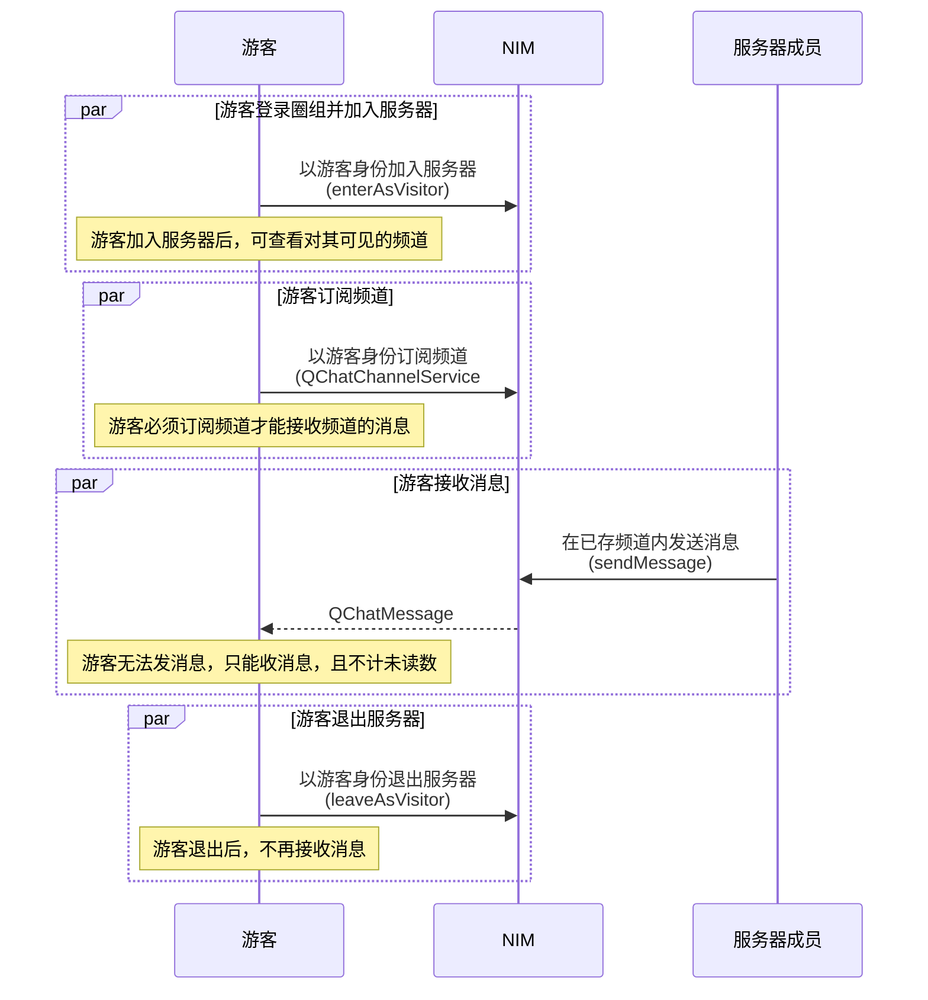
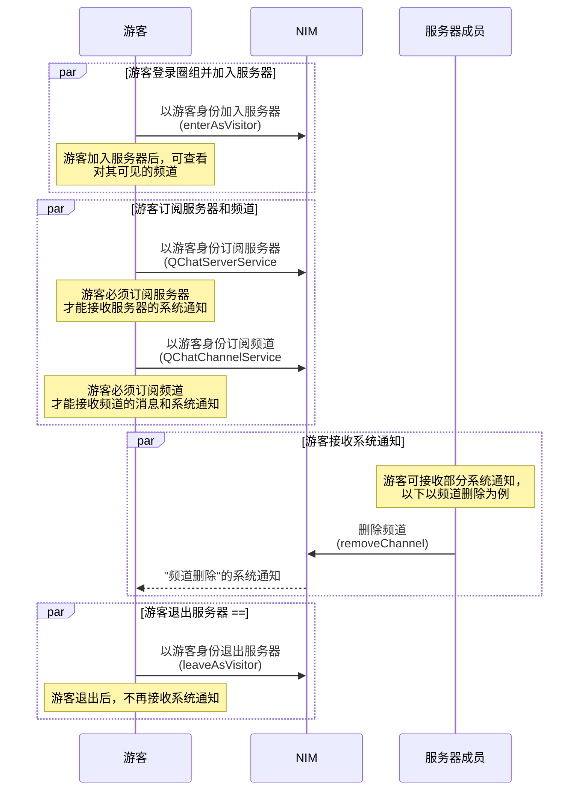
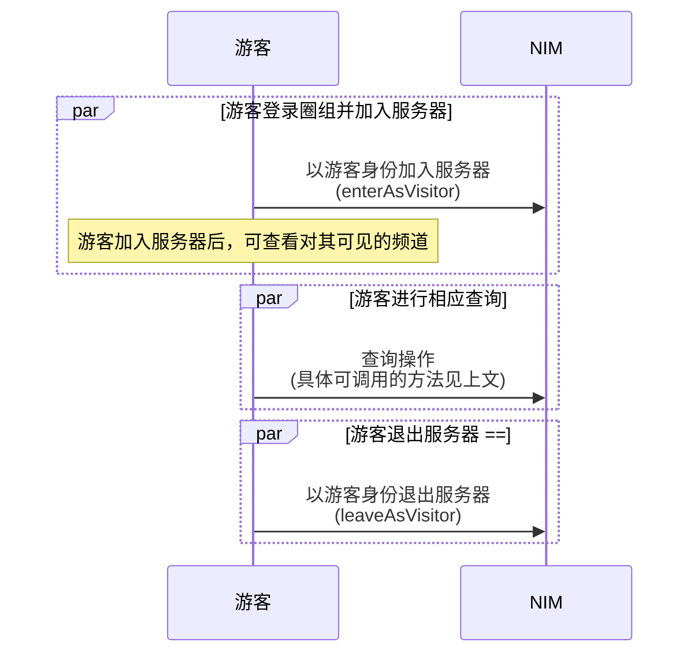

本文介绍游客功能的使用限制、实现方法、以及相关参考。

## 功能介绍

自 v9.8.0 起，圈组支持用户在正式成为服务器成员之前，先以游客身份加入服务器体验相应线上社区的部分内容、活动以及氛围，之后再决策是否需要正式加入服务器。游客相当于临时性的只读普通成员，只能查看服务器和频道内的部分信息，无法发送消息，因此无法与服务器成员形成互动。

以下为对游客支持的功能：

<div style="width:140px">功能</div> | 说明 | <div style="width:120px">限制</div>
---- | ---- | ----
加入和退出服务器 | 以游客身份加入和退出服务器，加入服务器后，可查看对其可见的频道和频道分组。频道 **是否对游客可见**，可在频道创建和修改时设置，频道分组是否对游客可见由其所包含的频道决定，具体见 [频道管理](https://doc.yunxin.163.com/messaging/guide/TgwMjk5NDY?platform=android) 和[频道分组](https://doc.yunxin.163.com/messaging/guide/jUxNTE5MTY?platform=android) | <ul><li>应用需已开通游客功能</li><li>服务器成员被封禁后不能再以游客身份加入</li></ul>
接收消息 | 接收成员在频道内发送的消息，接收到的消息无已读未读逻辑，不支持展示未读数       | 必须先订阅频道
接收服务器的系统通知 | 接收服务器相关事件的通知，具体可接收的通知类型，参考下文的[可接收的系统通知](#可接收的系统通知) | 必须先订阅服务器
接收频道的系统通知 | 接收频道相关事件的通知，具体可接收的通知类型，参考下文的[可接收的系统通知](#可接收的系统通知) | 必须先订阅频道
查询部分信息 | 查询服务器、频道、消息和频道分组的部分信息，具体可调用的 SDK API，见下文的[实现查询操作](#实现查询操作) | 只能调用相应的 SDK API，无法调用服务端 API
断网重连 | 用户以游客身份加入服务器后，如果网络异常断开，用户将在网络恢复时自动重新以游客身份加入服务器，如果游客之前已订阅服务器和服务器下的频道，将自动重新订阅 | -

## 前提条件

根据本文操作前，请确保您已经完成以下操作：

- [开通圈组的游客功能](https://doc.yunxin.163.com/console/concept/TIzNjkxMTg?platform=console)。游客功能需要在开通圈组功能的基础上额外开通后才能使用。
- 用户在以游客身份加入服务器前，需已 [登录圈组](https://doc.yunxin.163.com/messaging/guide/TcyMjc3MTM?platform=android)。

## API 调用时序

:::::: div linked-codes
::: code 游客接收消息


:::
::: code 游客接收系统通知


:::
::: code 游客的查询操作


:::
::::::

## 加入和退出服务器

- 调用 [`enterAsVisitor`](https://doc.yunxin.163.com/docs/interface/messaging/android/doxygen/Latest/zh/interfacecom_1_1netease_1_1nimlib_1_1sdk_1_1qchat_1_1_q_chat_server_service.html#aaaacf287ec8f4a4ee5ea0f335e1938c1) 方法以游客身份加入服务器。

    ::: note notice
    - 单个用户最多只能以游客身份加入 10 服务器。因此，调用该方法时，最多可传入 10 个服务器 ID。如果超限，将以加入失败列表的形式返回。
    - 单个服务器的游客数量上限为 2000。如果超限，将以加入失败列表的形式返回。
    :::

    示例代码如下：

    ```Java
    List<Long> serverIds = new ArrayList<>();
    serverIds.add(234567L);
    //以游客身份进入服务器
    QChatEnterServerAsVisitorParam param = new QChatEnterServerAsVisitorParam(serverIds);
    NIMClient.getService(QChatServerService.class).enterAsVisitor(param).setCallback(new RequestCallback<QChatEnterServerAsVisitorResult>() {
        @Override
        public void onSuccess(QChatEnterServerAsVisitorResult result) {
            //进入成功，如果存在进入失败的服务器，failedList 不为空，
            List<Long> failedList = result.getFailedList();

        }

        @Override
        public void onFailed(int code) {
            //进入失败
        }

        @Override
        public void onException(Throwable exception) {
            //进入异常
        }
    });
    ```

- 调用 [`leaveAsVisitor`](https://doc.yunxin.163.com/docs/interface/messaging/android/doxygen/Latest/zh/interfacecom_1_1netease_1_1nimlib_1_1sdk_1_1qchat_1_1_q_chat_server_service.html#adee1b7d88f3212ab53c22f4693383562) 方法退出，调用时最多可传入 10 个服务器 ID。

    ::: note note
    游客退出服务器后，订阅的服务器和频道将 **自动取消订阅**。
    :::

    示例代码如下:

    ```Java
    List<Long> serverIds = new ArrayList<>();
    serverIds.add(234567L);
    //以游客身份离开服务器
    QChatLeaveServerAsVisitorParam param = new QChatLeaveServerAsVisitorParam(serverIds);
    NIMClient.getService(QChatServerService.class).leaveAsVisitor(param).setCallback(new RequestCallback<QChatLeaveServerAsVisitorResult>() {
        @Override
        public void onSuccess(QChatLeaveServerAsVisitorResult result) {
            //离开成功，如果存在离开失败的服务器，failedList 不为空，
            List<Long> failedList = result.getFailedList();

        }

        @Override
        public void onFailed(int code) {
            //离开失败
        }

        @Override
        public void onException(Throwable exception) {
            //离开异常
        }
    });
    ```

## 消息接收

单个游客加入服务器后，可调用 [`QChatChannelService#subscribeAsVisitor`](https://doc.yunxin.163.com/docs/interface/messaging/android/doxygen/Latest/zh/interfacecom_1_1netease_1_1nimlib_1_1sdk_1_1qchat_1_1_q_chat_channel_service.html#a3cce58e143d5a20d73dd9d45af3e39a8) 方法订阅对其可见的频道，从而在频道成员发送消息后接收消息，否则将无法接收。

::: note notice
- 一位游客最多可订阅 100 个频道。
- 不支持对游客显示消息未读数。
- 游客无法接收消息的离线推送。
:::

示例代码如下:

```Java
List<QChatChannelIdInfo> channelIdInfos = new ArrayList<>();
long serverId = 234567L;
long channelId = 543538L;
channelIdInfos.add(new QChatChannelIdInfo(serverId,channelId));
//以游客身份订阅频道
QChatSubscribeChannelAsVisitorParam param = new QChatSubscribeChannelAsVisitorParam(QChatSubscribeOperateType.SUB,channelIdInfos);
NIMClient.getService(QChatChannelService.class).subscribeAsVisitor(param).setCallback(new RequestCallback<QChatSubscribeChannelAsVisitorResult>() {
    @Override
    public void onSuccess(QChatSubscribeChannelAsVisitorResult result) {
        //订阅成功，如果存在订阅失败的频道，failedList 不为空，
        List<QChatChannelIdInfo> failedList = result.getFailedList();

    }

    @Override
    public void onFailed(int code) {
        //订阅失败
    }

    @Override
    public void onException(Throwable exception) {
        //订阅异常
    }
});
```

## 系统通知接收

单个游客加入服务器后，可调用 [`QChatServerService#subscribeAsVisitor`](https://doc.yunxin.163.com/docs/interface/messaging/android/doxygen/Latest/zh/interfacecom_1_1netease_1_1nimlib_1_1sdk_1_1qchat_1_1_q_chat_server_service.html#a22fdd2934204629214657a2afb3ff7f6) 方法订阅服务器，从而能够接收该服务器的部分事件通知，否则将无法接收。也可调用 `QChatChannelService#subscribeAsVisitor` 方法订阅该服务器下对该游客可见的频道，从而能够接收该频道的部分事件通知，否则将无法接收。

::: note notice
一位游客最多可订阅 10 个服务器和 100 个频道。
:::

示例代码如下:

:::::: div linked-codes

::: code 订阅服务器

```Java
List<Long> serverIds = new ArrayList<>();
serverIds.add(234567L);
//以游客身份订阅服务器
QChatSubscribeServerAsVisitorParam param = new QChatSubscribeServerAsVisitorParam(QChatSubscribeOperateType.SUB,serverIds);
NIMClient.getService(QChatServerService.class).subscribeAsVisitor(param).setCallback(new RequestCallback<QChatSubscribeServerAsVisitorResult>() {
    @Override
    public void onSuccess(QChatSubscribeServerAsVisitorResult result) {
        //订阅成功，如果存在订阅失败的服务器，failedList 不为空，
        List<Long> failedList = result.getFailedList();

    }

    @Override
    public void onFailed(int code) {
        //订阅失败
    }

    @Override
    public void onException(Throwable exception) {
        //订阅异常
    }
});
```

:::

::: code 订阅频道

```Java
List<QChatChannelIdInfo> channelIdInfos = new ArrayList<>();
long serverId = 234567L;
long channelId = 543538L;
channelIdInfos.add(new QChatChannelIdInfo(serverId,channelId));
//以游客身份订阅频道
QChatSubscribeChannelAsVisitorParam param = new QChatSubscribeChannelAsVisitorParam(QChatSubscribeOperateType.SUB,channelIdInfos);
NIMClient.getService(QChatChannelService.class).subscribeAsVisitor(param).setCallback(new RequestCallback<QChatSubscribeChannelAsVisitorResult>() {
    @Override
    public void onSuccess(QChatSubscribeChannelAsVisitorResult result) {
        //订阅成功，如果存在订阅失败的频道，failedList 不为空，
        List<QChatChannelIdInfo> failedList = result.getFailedList();

    }

    @Override
    public void onFailed(int code) {
        //订阅失败
    }

    @Override
    public void onException(Throwable exception) {
        //订阅异常
    }
});
```
:::
::::::

## 查询操作

用户在以游客身份加入服务器后，可调用如下方法查询服务器、频道、消息和频道分组的部分信息。

模块 | <div style="width:200px">方法</div> | 说明 | 相关文档
---- | ---- | ----
服务器 | `getServers` | 根据服务器的 ID 查询对应的服务器的信息 | [根据服务器 ID 查询服务器](https://doc.yunxin.163.com/messaging/guide/Dg2NjI4NzQ?platform=android#%E6%A0%B9%E6%8D%AE%E6%9C%8D%E5%8A%A1%E5%99%A8id%E6%9F%A5%E8%AF%A2%E6%9C%8D%E5%8A%A1%E5%99%A8%E5%88%97%E8%A1%A8)
^^ | `getServerMembers` | 根据服务器成员的 ID 查询服务器成员的信息 | [根据账号查询服务器成员](https://doc.yunxin.163.com/messaging/guide/DIzODU1MDQ?platform=android#根据账号查询服务器成员)
^^ | `getServerMembersByPage` | 根据时间分页查询服务器成员列表 | [分页查询服务器成员列表](https://doc.yunxin.163.com/messaging/guide/DIzODU1MDQ?platform=android#分页查询服务器成员)
频道 | `getChannels` | 根据频道 ID 查询频道信息 | [根据频道 ID 查询频道](https://doc.yunxin.163.com/messaging/guide/TgwMjk5NDY?platform=android#根据频道-id-查询频道列表)
^^ | `getChannelsByPage` | 根据时间分页查询频道列表（**仅返回对游客可见的频道**） | [分页查询频道列表](https://doc.yunxin.163.com/messaging/guide/TgwMjk5NDY?platform=android#分页查询频道列表)
^^ | `getChannelMembersByPage` | 根据时间分页查询频道成员列表 | [分页查询频道成员列表](https://doc.yunxin.163.com/messaging/guide/TgwMjk5NDY?platform=android#分页查询频道成员列表)
^^ | `getLastMessageOfChannels` | 获取多个频道的最后一条消息 | [获取频道最后一条消息](https://doc.yunxin.163.com/messaging/guide/jIyNjg3MjM?platform=android)
消息 | `getMessageHistory` | 查询历史消息 | [查询历史消息](https://doc.yunxin.163.com/messaging/guide/TM4NDAxMTA?platform=android)
^^ | `getMessageHistoryByIds` | 根据回复消息的服务端 ID 查询历史回复消息（**注**：需先在 [网易云信控制台](https://app.yunxin.163.com/global/home) 开通圈组的会话消息回复功能）</note> | [根据消息 ID 批量查询回复消息](https://doc.yunxin.163.com/messaging/guide/jg2MDk5NjA?platform=android#根据消息-id-批量查询回复消息)
^^ | `getThreadMessages` | 根据某个 Thread 中的任意一条消息分页查询该 Thread 的消息列表，即该 Thread 的聊天历史（**注**：需先在 [网易云信控制台](https://app.yunxin.163.com/global/home) 开通圈组的会话消息回复功能） | [查询 Thread 消息列表](https://doc.yunxin.163.com/messaging/guide/jg2MDk5NjA?platform=android#查询-thread-的消息列表)
^^ | `getMessageThreadInfos` | 批量查询某个频道下的多个 Thread 的根消息的 meta 信息，包括总回复数和最后回复时间 （**注**：需先在 [网易云信控制台](https://app.yunxin.163.com/global/home) 开通圈组的会话消息回复功能） | [批量查询根消息 meta 信息](https://doc.yunxin.163.com/messaging/guide/jg2MDk5NjA?platform=android#%E6%89%B9%E9%87%8F%E6%9F%A5%E8%AF%A2%E6%A0%B9%E6%B6%88%E6%81%AFmeta%E4%BF%A1%E6%81%AF)
^^ | `getQuickComments` | 查询指定消息所包含的快捷评论列表 （**注**：需先在 [网易云信控制台](https://app.yunxin.163.com/global/home) 开通圈组的快捷评论功能） | [查询快捷评论列表](https://doc.yunxin.163.com/messaging/guide/jcwODc1OTQ?platform=android#查询快捷评论列表)
频道分组 | `getChannelCategories` | 根据频道分组的 ID 查询频道分组信息 | [频道分组](https://doc.yunxin.163.com/messaging/guide/jUxNTE5MTY?platform=android)

## 可接收的系统通知

圈组系统通知的类型在 [`QChatSystemNotificationType`](https://doc.yunxin.163.com/docs/interface/messaging/android/doxygen/Latest/zh/enumcom_1_1netease_1_1nimlib_1_1sdk_1_1qchat_1_1enums_1_1_q_chat_system_notification_type.html) 枚举中定义，其中游客可接收的系统通知类型如下：

枚举值 | 说明 | 接收条件
---- | ---- | ----
`CHANNEL_VISIBILITY_TO_VISITOR_UPDATE` | 频道对游客可见性变更<note type=note>频道对游客的可见性，可通过修改频道的 `visitorMode` 属性进行变更，也可能因频道分组的属性变更而变更。具体参考 [频道管理](https://doc.yunxin.163.com/messaging/guide/TgwMjk5NDY?platform=android) 中对游客可见性的说明。</note> | 订阅频道且在线
`UPDATE_QUICK_COMMENT` | 更新快捷评论 | 订阅频道且在线
`CUSTOM` | 自定义系统通知 | 订阅服务器或频道且在线
`SERVER_REMOVE` | 删除服务器 | 订阅服务器且在线
`SERVER_UPDATE` | 修改服务器信息 | 订阅服务器且在线
`CHANNEL_CREATE` | 创建频道 | 订阅服务器且在线
`CHANNEL_REMOVE` | 删除频道 | 订阅频道且在线
`CHANNEL_UPDATE` | 修改频道 | 订阅频道且在线
`CHANNEL_CATEGORY_CREATE` | 创建频道分组 | 订阅服务器且在线
`CHANNEL_CATEGORY_REMOVE` | 删除频道分组 | 订阅服务器且在线
`CHANNEL_CATEGORY_UPDATE` | 修改频道分组信息 | 订阅服务器且在线