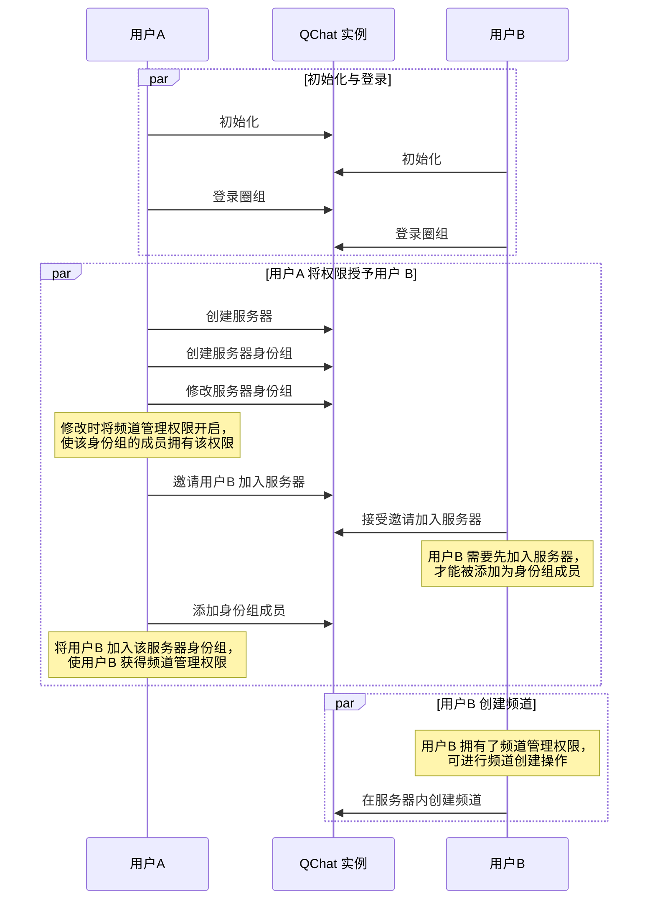

服务器身份组指负责在服务器维度对用户进行权限控制的身份组，包括服务器下的@everyone 身份组和自定义身份组。创建服务器时，@everyone 身份组（`type == QChatRoleType.EVERYONE`）默认自动创建。而服务器自定义身份组则需要用户手动创建。自定义身份组创建后，其权限配置默认继承自 @everyone 身份组，如需调整，需要拥有相应权限的用户手动更新。此外，用户还可调整服务器身份组的优先级（需要相应权限）。

本文介绍如何通过服务器身份组在圈组实现基础的权限控制，以及服务器身份组相关的方法调用。 


::: note notice :::
- @everyone 身份组的权限配置，只有服务器创建者可修改。@everyone 身份组的其他信息（身份组的名称、图标、自定义扩展和优先级）不支持修改。
- `Web SDK`最大可以设置的整型是`9007199254740991`。如果超过，接收方是`Web SDK`时会溢出。
:::

## 服务器身份组定义

SDK 中定义服务器身份组的结构为<a href="https://doc.yunxin.163.com/docs/interface/messaging/android/doxygen/Latest/zh/interfacecom_1_1netease_1_1nimlib_1_1sdk_1_1qchat_1_1model_1_1_q_chat_server_role.html" target="_blank">`QChatServerRole`</a>接口类，该接口类的内置方法说明如下：

<details><summary>单击展开查看 QChatServerRole 的内置方法</summary>


方法 | 返回数据类型 |说明
:---- | :-------------- | :---------
`getRoleId`  |  long |  返回身份组 ID
`getServerId` | long | 返回身份组所属服务器的 ID
`getName` | String  | 返回身份组名称
`getIcon` | String  | 返回身份组图标的 URL 
`getExtension`| String  | 返回身份组的扩展字段 
`getResourceAuths`   |Map<`QChatRoleResource`, <a href="https://doc.yunxin.163.com/docs/interface/messaging/android/doxygen/Latest/zh/enumcom_1_1netease_1_1nimlib_1_1sdk_1_1qchat_1_1enums_1_1_q_chat_role_option.html" target="">`QChatRoleOption`</a>>|   返回身份组的权限列表，其中:<ul><li>`QChatRoleResource`的说明请参见<a href="https://doc.yunxin.163.com/messaging/guide/DU4NzI0NjU?platform=android##身份组权限类型" target="_blank">身份组权限类型</a></li><li>`QChatRoleOption`定义了权限的配置状态（即用户能否访问各权限），包括：<ul><li>`ALLOW`：开启（有权限）</li><li>`DENY`：关闭（无权限）</li><li>`INHERIT`：继承</li></ul></li></ul>
`getType`|  `QChatRoleType`    |返回身份组的类型，1 表示@everyone 身份组，2 表示自定义身份组 
`getMemberCount` | long |  返回身份组的成员数量，@ everyone 身份组的成员数量数量默认为-1
`getPriority` |    long  |   返回身份组优先级（具体见下文的[批量更新服务器身份组优先级](#批量更新服务器身份组优先级)），用于判定身份组成员是否能修改其他身份组的权限配置。自定义身份组优先级取值大于0，数字越小优先级越高。高优先级身份组中拥有管理角色权限的用户，可修改低优先级身份组的权限，但无法修改更高优先级身份组的权限。<br><br>@everyone 身份组优先级取值为 0 且不能更改，默认低于自定义身份组优先级
`getCreateTime`  | long  | 返回身份组的创建时间
`getUpdateTime` | long  | 返回身份组配置的更新时间

</details>

## 前提条件


- 已注册[`observeReceiveSystemNotification`](https://doc.yunxin.163.com/docs/interface/messaging/android/doxygen/Latest/zh/interfacecom_1_1netease_1_1nimlib_1_1sdk_1_1qchat_1_1_q_chat_service_observer.html#a243ce250bbef08d40a52f24f12d1007c)监听圈组的系统通知。示例代码参见[圈组系统通知收发](https://doc.yunxin.163.com/messaging/guide/Tc3MDM2MTQ?platform=android)。

  具体**与服务器身份组相关**的系统通知类型，见本文末尾的[相关系统通知](#相关系统通知)。
  

- 已创建服务器。

## 使用限制

单个服务器内可创建的服务器身份组数量上限，默认为 20 个。


若需要扩展上限，可在控制台配置圈组子功能项（**单 server 可创建的身份组**），具体请参考[开通和配置圈组功能](https://doc.yunxin.163.com/messaging/guide/TU3MjAzMjE?platform=android)。


## 实现方法

以下时序图以典型场景为例，介绍 **通过服务器身份组进行权限控制** 的流程。该典型场景为：服务器创建者将频道管理权限（`MANAGE_CHANNEL`）授予服务器成员，从而使该成员能够创建频道。 




::: note note
本节仅对上图中标为部分的方法调用做详细说明，其他方法调用请参考相应的文档。
:::


### **步骤1：创建服务器身份组**


调用<a href="https://doc.yunxin.163.com/docs/interface/messaging/android/doxygen/Latest/zh/interfacecom_1_1netease_1_1nimlib_1_1sdk_1_1qchat_1_1_q_chat_role_service.html#a13b9c1c42eee7d2209af6807c6c5c103" target="_blank">`createServerRole`</a>方法创建自定义身份组（`type == QChatRoleType.CUSTOM`）。调用成功后，可以从返回的`QChatCreateServerRoleResult`获得新建的服务器身份组`QChatServerRole`。

新创建的自定义身份组的权限为用户所有已有身份组的权限之和。假设用户在创建之前，只属于 @everyone 身份组的成员，则新创建的自定义身份组的权限将继承 @everyone 身份组的权限，两者权限一致。如需修改，还需要调用`updateServerRole`方法，具体请参见下文的**更新服务器身份组**。

::: note notice :::
- 调用该方法需要拥有`MANAGE_ROLE`权限，且必须是相应服务器的成员。如果没有该权限，调用该方法将返回 `403` 错误码。
- 新创建的服务器自定义身份组的优先级，必须小于用户已有身份组的最高优先级。
:::


- API 原型
    ```
    InvocationFuture<QChatCreateServerRoleResult> createServerRole(QChatCreateServerRoleParam param);
    ```


- 示例代码
    ```
    QChatCreateServerRoleParam createServerRoleParam = new QChatCreateServerRoleParam(943445L,"测试身份组名称", QChatRoleType.CUSTOM);
    createServerRoleParam.setExtension("自定义扩展字段");
    //设置身份组头像url
    createServerRoleParam.setIcon("http://xxxxxx/xxxxx/x/xx");
    QChatAntiSpamConfig antiSpamConfig = new QChatAntiSpamConfig("用户配置的对某些资料内容另外的反垃圾的业务ID")；
    antiSpamConfig.setAntiSpamBusinessId(antiSpamConfig);
    NIMClient.getService(QChatRoleService.class).createServerRole(createServerRoleParam).setCallback(
            new RequestCallback<QChatCreateServerRoleResult>() {
                @Override
                public void onSuccess(QChatCreateServerRoleResult result) {
                    //创建成功，返回创建成功的Server身份组信息
                    QChatServerRole role = result.getRole();
                }

                @Override
                public void onFailed(int code) {
                    //创建失败，返回错误code
                }

                @Override
                public void onException(Throwable exception) {
                    //创建异常
                }
            });
    ```


###  **步骤2：修改服务器身份组**


调用<a href="https://doc.yunxin.163.com/docs/interface/messaging/android/doxygen/Latest/zh/interfacecom_1_1netease_1_1nimlib_1_1sdk_1_1qchat_1_1_q_chat_role_service.html#ad5a7fc43e0f983997d47314933fdeb33" target="_blank">`updateServerRole`</a>方法可修改服务器身份组的名称、图标、自定义扩展字段、权限列表配置和优先级（优先级的具体介绍请参见下文的**批量更新服务器身份组优先级**）。调用时，需在其入参结构 `QChatUpdateServerRoleParam` 传入服务器身份组的 ID 和身份组所属服务器的 ID。

::: note notice
- 调用该方法需要管理角色权限（`MANAGE_ROLE`），且必须是相应服务器的成员。如没有该权限，调用将返回 `403` 错误码。
- 创建服务器时默认创建的 @everyone 身份组仅支持修改其权限配置（且只有服务器创建者可修改），其他属性（身份组的名称、图标、自定义扩展和优先级）不支持修改。 如调用该方法修改 @everyone 身份组的名称、图标、自定义扩展和优先级， 将报错（错误码 `403`）。
- 调用该方法修改身份组的优先级必须小于用户已有身份组的最高优先级。
- 用户无法配置自己没有的权限。例如用户没有权限A，则无法修改权限A 的配置。
- 用户无法将自己拥有的某个权限在全部所属身份组中都设置为`DENY`，如果都设置为`DENY`，将返回`403`错误码。例如用户属于 10 个身份组且这 10 个身份组都开启了权限A，那么用户最多可以将其中 9 个身份组的权限A 设置为`DENY`。
:::

- API 原型
    ```
    InvocationFuture<QChatUpdateServerRoleResult> updateServerRole(QChatUpdateServerRoleParam param);
    ```


- 示例代码
    ```
    QChatServerRole serverRole = getServerRole();
    QChatUpdateServerRoleParam param = new QChatUpdateServerRoleParam(serverRole.getServerId(), serverRole.getRoleId());
    param.setName("修改身份组名称");
    param.setIcon("http://xxxxxx/xxx/");
    param.setExt("修改自定义扩展");
    //修改优先级，注意优先级不可与其他身份组相同，不然报错
    param.setPriority(2L);
    Map<QChatRoleResource, QChatRoleOption> map = new HashMap<>();
    //赋予管理黑白名单权限
    map.put(QChatRoleResource.MANAGE_BLACK_WHITE_LIST,QChatRoleOption.ALLOW);
    param.setResourceAuths(map);
    QChatAntiSpamConfig antiSpamConfig = new QChatAntiSpamConfig("用户配置的对某些资料内容另外的反垃圾的业务ID")；
    antiSpamConfig.setAntiSpamBusinessId(antiSpamConfig);
    NIMClient.getService(QChatRoleService.class).updateServerRole(param).setCallback(new RequestCallback<QChatUpdateServerRoleResult>() {
        @Override
        public void onSuccess(QChatUpdateServerRoleResult result) {
            //更新成功，返回更新后的Server身份组
            QChatServerRole role = result.getRole();
        }

        @Override
        public void onFailed(int code) {
            //更新失败，返回错误code
        }

        @Override
        public void onException(Throwable exception) {
            //更新异常
        }
    });
    ```
### **步骤3：添加身份组成员**

服务器的 @everyone 身份组的成员，默认为服务器的全部成员。服务器自定义身份组的成员，需要用户手动添加。


调用<a href="https://doc.yunxin.163.com/docs/interface/messaging/android/doxygen/Latest/zh/interfacecom_1_1netease_1_1nimlib_1_1sdk_1_1qchat_1_1_q_chat_role_service.html#acc76632038649a99e3154e67c512fe4e" target="_blank">`addMembersToServerRole`</a> 方法将用户批量添加至指定的服务器自定义身份组。添加后，继承自该服务器身份组的频道身份组成员也会作相应变化。

`QChatAddMembersToServerRoleParam`为该方法的入参结构，需要传入操作者所属的服务器 ID、服务器身份组 ID 和待添加用户的 IM 账号（`accid`）列表。


::: note notice 
调用该方法必须先拥有`MANAGE_ROLE`权限。如果没有该权限，调用该方法将返回 `403` 错误码。
:::

- API 原型
    ```
    InvocationFuture<QChatAddMembersToServerRoleResult> addMembersToServerRole(QChatAddMembersToServerRoleParam param);
    ```

- 示例代码
    ```
    NIMClient.getService(QChatRoleService.class).addMembersToServerRole(new QChatAddMembersToServerRoleParam(943445L,5673L,accids)).setCallback(
            new RequestCallback<QChatAddMembersToServerRoleResult>() {
                @Override
                public void onSuccess(QChatAddMembersToServerRoleResult result) {
                    //操作成功,返回加入成功和加入失败的成员accid列表
                    List<String> successAccids = result.getSuccessAccids();
                    List<String> failedAccids = result.getFailedAccids();

                }

                @Override
                public void onFailed(int code) {
                    //操作失败，返回错误code
                }

                @Override
                public void onException(Throwable exception) {
                    //操作异常
                }
            });
    ```
### 其他相关 SDK API 

#### **移除身份组成员**

可调用<a href="https://doc.yunxin.163.com/docs/interface/messaging/android/doxygen/Latest/zh/interfacecom_1_1netease_1_1nimlib_1_1sdk_1_1qchat_1_1_q_chat_role_service.html#aff0b181706f227038d68b40696290d78" target="_blank">`removeMembersFromServerRole`</a>方法将服务器自定义身份组的成员批量移除。移除后，继承自该服务器身份组的频道身份组成员也会作相应变化。

该方法的入参结构为`QChatRemoveMembersFromServerRoleParam`，需要传入操作者所属的服务器 ID、服务器身份组 ID 和待移除的成员的 IM 账号（`accid`）列表。


::: note notice 
调用该方法必须先拥有`MANAGE_ROLE`权限。如果没有该权限，调用该方法将返回 `403` 错误码。
:::
- API 原型
    ```
    InvocationFuture<QChatRemoveMembersFromServerRoleResult> removeMembersFromServerRole(QChatRemoveMembersFromServerRoleParam param);
    ```

- 示例代码
    ```
    NIMClient.getService(QChatRoleService.class).removeMembersFromServerRole(new QChatRemoveMembersFromServerRoleParam(943445L,5673L,accids)).setCallback(
            new RequestCallback<QChatRemoveMembersFromServerRoleResult>() {
                @Override
                public void onSuccess(QChatRemoveMembersFromServerRoleResult result) {
                    //操作成功,返回移除成功和移除失败的成员accid列表
                    List<String> successAccids = result.getSuccessAccids();
                    List<String> failedAccids = result.getFailedAccids();
                    
                }

                @Override
                public void onFailed(int code) {
                    //操作失败，返回错误code
                }

                @Override
                public void onException(Throwable exception) {
                    //操作异常
                }
            });
    ```


#### **删除服务器身份组**

拥有`MANAGE_ROLE`权限的用户可调用<a href="https://doc.yunxin.163.com/docs/interface/messaging/android/doxygen/Latest/zh/interfacecom_1_1netease_1_1nimlib_1_1sdk_1_1qchat_1_1_q_chat_role_service.html#a589eac178aa1f4a63dc94920f2704d4b" target="_blank">`deleteServerRole`</a>方法删除包含此权限的自定义身份组。调用该方法时，入参结构 `QChatDeleteServerRoleParam` 需要传入待删除的身份组的 ID 和该身份组所属的服务器 ID。


::: note notice 
- 调用该方法必须先拥有`MANAGE_ROLE`权限，且必须是相应服务器的成员。如果没有该权限，调用该方法将返回 `403` 错误码。
-  @everyone 身份组默认不可删除。
- 用户无法删除优先级高于自己已有身份组的最高优先级的身份组。
:::

- API 原型

```
InvocationFuture<Void> deleteServerRole(QChatDeleteServerRoleParam param);
```


- 示例代码

```
QChatServerRole serverRole = getServerRole();
NIMClient.getService(QChatRoleService.class).deleteServerRole(new QChatDeleteServerRoleParam(serverRole.getServerId(),serverRole.getRoleId())).setCallback(
        new RequestCallback<Void>() {
            @Override
            public void onSuccess(Void param) {
                //删除成功
            }

            @Override
            public void onFailed(int code) {
                //删除失败，返回错误code
            }

            @Override
            public void onException(Throwable exception) {
                //删除异常
            }
        });

```


#### **批量更新服务器身份组优先级**

身份组有优先级高低之分。当用户拥有`MANAGE_ROLE`权限后，可对等级低于自身最高优先级身份组的其他身份组进行操作（如修改权限配置），也可创建一个新的自定义身份组，并对其进行优先级排序。新的自定义身份组被创建后，其优先级默认为用户所属自定义身份组中最低。


调用<a href="https://doc.yunxin.163.com/docs/interface/messaging/android/doxygen/Latest/zh/interfacecom_1_1netease_1_1nimlib_1_1sdk_1_1qchat_1_1_q_chat_role_service.html#a75f7c3355bd413c2348b3db5bc7029a8" target="_blank">`updateServerRolePriorities`</a>方法可同时修改多个服务器身份组的优先级，其中`QChatUpdateServerRolePrioritiesParam`需要传入服务器 ID、服务器身份组 ID 和身份组优先级构成的 Map。


**最佳实践**：建议把 priority 为 1 的身份组空出来，不要用在业务上。可以把这个 priority 为 1 的身份组专门留给最高管理员使用，方便后面调整其他身份组的优先级。


::: note notice
- 调用该方法需要拥有`MANAGE_ROLE`权限。如果没有该权限，调用该方法将返回 `403` 错误码。当拥有`MANAGE_ROLE`权限的用户想去变更某个低优先级身份组的某项权限时，首先其自身必须有该权限，即该用户所在的所有身份组中，至少有一个身份组为其赋予过该权限。
- 自定义身份组等级永远高于@everyone身份组。
- 修改后的优先级必须在修改前的最高优先级和最低优先级之间。比如，修改前 serverRole1 优先级 p1，serverRole2 优先级 p2，serverRole3 优先级 p3，想把他们的优先级分别改为 P1、P2 和 P3，必须满足 min(P1，P2，P3) >= min(p1，p2，p3)，max(P1，P2，P3) <= max(p1，p2，p3)。
:::


- API 调用时序示例

    以下时序图以用户A（服务器创建者） 和 用户B（服务器成员）的交互场景为例，展示在调用`updateServerRolePriorities`方法前需要实现的业务逻辑。

    <br>

    <details><summary>单击展开查看该 API 调用时序示例</summary>

    ```mermaid
    sequenceDiagram

    par  初始化与登录 
    用户A ->> QChat 实例: 初始化
    用户B ->> QChat 实例: 初始化
    用户A ->> QChat 实例: 登录圈组
    用户B ->> QChat 实例: 登录圈组
    end
    par  用户A 创建服务器 
    用户A ->> QChat 实例: 创建服务器
    end
    par  用户A 创建多个身份组并授予用户B 权限 
    用户A ->> QChat 实例: 创建身份组1 
    note over 用户A: 身份组1 的优先级默认高于<br>之后新创建的身份组
    用户A ->> QChat 实例: 修改身份组1
    note over 用户A: 调用修改身份组接口<br>开启身份组1的管理角色权限，<br>使该身份组的成员拥有该权限
    用户A ->> QChat 实例: 创建身份组2
    用户A ->> QChat 实例: 创建身份组3
    用户A ->> QChat 实例: 邀请用户B 加入服务器
    用户B ->> QChat 实例: 接受邀请加入服务器
    note over 用户B: 需先加入服务器<br>才能被添加为身份组成员
    用户A ->> QChat 实例: 将用户B 加入身份组1
    note over 用户A: 用户B 加入身份组1 后，<br>获得管理角色权限
    end
    par  用户B 批量更新身份组优先级 
    note over 用户B: 用户B 获得管理角色权限后，<br>可进行身份组管理操作
    用户B ->> QChat 实例: 创建身份组4
    note over 用户B: 由于用户B 所属的身份组1<br>优先级高于身份组2、3、4，<br>所以用户B 可批量更新2、3、4 的优先级
    用户B ->>  QChat 实例: 批量更新身份组2,3,4的优先级
    end
    ```

    </details>

- API 原型
    ```
    InvocationFuture<QChatUpdateServerRolePrioritiesResult> updateServerRolePriorities(QChatUpdateServerRolePrioritiesParam param);
    ```


- 示例代码
    ```
    Map<Long, Long> roleIdPriorityMap = new HashMap<>();
    roleIdPriorityMap.put(10001L,3L);
    roleIdPriorityMap.put(10002L,4L);
    roleIdPriorityMap.put(10003L,5L);

    NIMClient.getService(QChatRoleService.class).updateServerRolePriorities(new QChatUpdateServerRolePrioritiesParam(943445L,roleIdPriorityMap)).setCallback(
            new RequestCallback<QChatUpdateServerRolePrioritiesResult>() {
                @Override
                public void onSuccess(QChatUpdateServerRolePrioritiesResult result) {
                    //修改成功，返回修改后的Server身份组Id和Server身份组优先级构成的Map
                    Map<Long, Long> roleIdPriorityMap = result.getRoleIdPriorityMap();
                }

                @Override
                public void onFailed(int code) {
                    //修改失败，返回错误code
                }

                @Override
                public void onException(Throwable exception) {
                    //修改异常
                }
            });
    ```
#### 查询服务器身份组

SDK 也提供多个查询服务器身份组的方法，相关具体介绍，请参见[服务器身份组相关查询](https://doc.yunxin.163.com/messaging/guide/TQyMjQ2MTg?platform=android#服务器身份组相关查询)。


## 相关参考

### 相关系统通知


圈组系统通知的类型在[`QChatSystemNotificationType`](https://doc.yunxin.163.com/docs/interface/messaging/android/doxygen/Latest/zh/enumcom_1_1netease_1_1nimlib_1_1sdk_1_1qchat_1_1enums_1_1_q_chat_system_notification_type.html)枚举中定义，与服务器身份组相关的内置系统通知类型如下：

枚举值| 说明   
---- | --------------
`SERVER_ROLE_AUTH_UPDATE` | “服务器身份组”权限更新   |
`SERVER_ROLE_MEMBER_ADD`  | 新成员加入“服务器身份组” |
`SERVER_ROLE_MEMBER_DELETE`  | 成员被移出“服务器身份组”  |

::: note note 
这三种系统通知的接收条件，请参见服务端文档的[身份组成员管理相关通知](https://doc.yunxin.163.com/messaging/guide/TkxMzc1NDg?platform=server#身份组成员管理相关通知)和[身份组权限相关事件通知](https://doc.yunxin.163.com/messaging/guide/TkxMzc1NDg?platform=server#身份组权限相关事件通知)。
:::


### 相关内容审核


创建或修改服务器身份组时，如果通过`setAntiSpamBusinessId`方法配置了安全通的业务 ID， 那么云信将会对服务器身份组的资料（如身份组名称和图标）进行“安全通”内容审核。`antiSpamBusinessId`代表安全通默认内容审核业务以外的自定义内容审核的业务 ID；如需新增自定义内容审核，请联系商务经理进行相关配置，然后前往云信控制台的安全通配置界面获取该业务 ID。

更多圈组内容审核相关说明，参见[圈组内容审核](https://doc.yunxin.163.com/messaging/guide/DY0ODI1OTQ?platform=android)。

